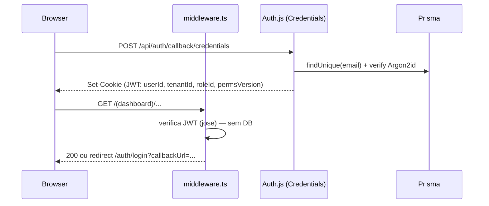

# Design: Backend Foundation

## Decisões de Arquitectura

| # | Decisão | Alternativa rejeitada | Justificação |
|---|---------|----------------------|--------------|
| D1 | Prisma + PostgreSQL directo | Manter PostgREST (`@supabase/postgrest-js`) | O cliente PostgREST existe mas não é usado; Prisma dá tipagem end-to-end, migrations versionadas e transacções — essenciais para contabilidade/faturação. Remover `@supabase/postgrest-js`. |
| D2 | Server Actions para mutações + Server Components para leitura | API REST completa consumida via fetch no cliente | Elimina uma camada de rede interna, reduz boilerplate em 21 módulos, mantém validação/permissão centralizadas no factory. Route Handlers só onde há consumidor externo. |
| D3 | Auth.js v5 (Credentials + JWT) | Sessões DB-backed / Lucia / custom `jose` | O projecto já usa `jose`; Auth.js v5 integra middleware Next 16, CSRF e rotação de sessão sem reinventar. JWT evita round-trip à DB por request; claims mínimas (`userId`, `tenantId`, `roleId`, `permsVersion`). |
| D4 | Multi-tenancy por coluna `tenantId` + Prisma Extension | Schema-per-tenant / RLS PostgreSQL | Escala do produto (SME moçambicanas) não justifica schema-per-tenant; RLS é boa defesa extra mas duplicaria lógica — pode ser adicionada depois sem alterar aplicação. A extension torna o filtro automático e testável. |
| D5 | Estrutura `src/server/**` isolada com `import 'server-only'` | Lógica espalhada em `src/lib` | Impede import acidental de código de servidor em Client Components (erro de build em vez de fuga de segredos). |

## Estrutura de Directórios (nova)

```
src/
├─ server/                        # NUNCA importável no cliente ('server-only')
│  ├─ db/
│  │  ├─ client.ts                # PrismaClient singleton + extensions
│  │  ├─ tenant-extension.ts      # injecção automática de tenantId
│  │  └─ audit-extension.ts       # captura de diffs para AuditLog
│  ├─ auth/
│  │  ├─ config.ts                # Auth.js v5 config
│  │  ├─ session.ts               # getSession(), requireSession()
│  │  ├─ permissions.ts           # requirePermission(), can()
│  │  └─ rate-limit.ts
│  ├─ actions/
│  │  └─ safe-action.ts           # createSafeAction factory
│  ├─ api/
│  │  └─ with-api.ts              # wrapper para Route Handlers
│  ├─ errors.ts                   # hierarquia AppError
│  ├─ logger.ts                   # pino estruturado
│  └─ services/<modulo>/          # lógica de domínio (preenchida no spec 02)
├─ lib/validations/<modulo>.ts    # Zod schemas partilhados cliente/servidor
prisma/
├─ schema.prisma
├─ migrations/
└─ seed.ts
```

## Schema Prisma — Núcleo

Modelos core (os modelos de domínio por módulo são detalhados no spec 02; aqui fica o contrato que todos seguem):

```prisma
model Tenant {
  id        String   @id @default(cuid())
  nome      String
  nuit      String   @unique
  estado    TenantEstado @default(ACTIVO)   // ACTIVO | SUSPENSO
  plano     String   @default("standard")
  createdAt DateTime @default(now())
  updatedAt DateTime @updatedAt
  users     User[]
}

model User {
  id           String   @id @default(cuid())
  tenantId     String
  tenant       Tenant   @relation(fields: [tenantId], references: [id])
  email        String
  passwordHash String
  nome         String
  roleId       String
  role         Role     @relation(fields: [roleId], references: [id])
  estado       UserEstado @default(ACTIVO)
  createdAt    DateTime @default(now())
  updatedAt    DateTime @updatedAt
  @@unique([tenantId, email])
  @@index([tenantId, estado])
}

model Role {
  id          String       @id @default(cuid())
  tenantId    String?      // null = role de sistema
  nome        String
  permissions Permission[]
  users       User[]
  @@unique([tenantId, nome])
}

model Permission {
  id    String @id @default(cuid())
  code  String @unique          // "faturacao:criar"
  roles Role[]
}

model AuditLog {
  id         String   @id @default(cuid())
  tenantId   String
  userId     String
  entidade   String
  entidadeId String
  accao      String            // CREATE | UPDATE | DELETE | APPROVE | ...
  diff       Json?
  ip         String?
  createdAt  DateTime @default(now())
  @@index([tenantId, entidade, entidadeId])
  @@index([tenantId, createdAt])
}
```

Convenções obrigatórias para modelos de domínio (skill `prisma-conventions`):
- `tenantId String` + relação + `@@index([tenantId, <campo de filtro principal>])`
- Dinheiro: `Decimal @db.Decimal(18, 2)`; taxas: `Decimal @db.Decimal(9, 6)`
- Enums Prisma para máquinas de estado (espelham os union types já existentes em `src/types`)
- Soft delete (`deletedAt DateTime?`) apenas onde o requisito funcional o exigir (clientes, fornecedores, produtos); resto é hard delete com auditoria

## Tenant Extension (esboço)

```ts
// src/server/db/tenant-extension.ts
export const TENANT_MODELS = new Set(['Cliente', 'Fornecedor', 'Produto', /* ... */]);

export function tenantExtension(getTenantId: () => string) {
  return Prisma.defineExtension({
    query: {
      $allModels: {
        async $allOperations({ model, operation, args, query }) {
          if (!model || !TENANT_MODELS.has(model)) return query(args);
          const tenantId = getTenantId(); // AsyncLocalStorage — nunca de args
          injectTenantFilter(args, operation, tenantId);
          return query(args);
        },
      },
    },
  });
}
```

`getTenantId` lê de um `AsyncLocalStorage` populado por `requireSession()` no início de cada action/handler. Se não houver tenant no contexto e o modelo for tenant-scoped → `throw new Error('Tenant context missing')` (fail-closed).

## createSafeAction (contrato)

```ts
type ActionResult<T> = { ok: true; data: T } | { ok: false; error: { code: string; message: string; fieldErrors?: Record<string, string[]> } };

export function createSafeAction<In, Out>(config: {
  schema: z.ZodType<In>;
  permission: PermissionCode;
  revalidate?: (input: In, output: Out) => string[];   // paths/tags
  handler: (input: In, ctx: ActionContext) => Promise<Out>;
}): (raw: unknown) => Promise<ActionResult<Out>>;
```

Pipeline interno: `requireSession()` → `requirePermission()` → `schema.safeParse` → `runWithTenantContext(handler)` → catch `AppError` → mapear → `revalidatePath/Tag`. Nunca deixa escapar stack traces para o cliente.

## Fluxo de Autenticação



`permsVersion` incrementa quando as permissões da role mudam → sessões com versão antiga refazem lookup de permissões e actualizam o token (evita JWT eternamente stale sem custo por request).

## Tratamento de Erros

```
AppError (abstract: code, httpStatus, publicMessage)
├─ ValidationError   (400, fieldErrors)
├─ UnauthorizedError (401)
├─ ForbiddenError    (403)
├─ NotFoundError     (404)  ← também para cross-tenant
├─ ConflictError     (409)  ← unique violations mapeadas de P2002
└─ BusinessRuleError (422)  ← regras de domínio (ex.: fecho de caixa com pendências)
```

Erros Prisma conhecidos (`P2002`, `P2025`) são traduzidos no factory; qualquer erro não-`AppError` vira 500 genérico + log com `requestId`.

## Riscos e Mitigações

- **Risco:** migração de 21 módulos de mock para DB em paralelo criar schemas inconsistentes. **Mitigação:** o schema Prisma núcleo + convenções são `[BLOCKING]`; agentes de domínio propõem modelos via PR revistos pelo code reviewer antes de gerar migrations (uma migration por módulo, nome padronizado).
- **Risco:** Server Actions com validação esquecida. **Mitigação:** regra ESLint custom proibindo `'use server'` fora de ficheiros `*.actions.ts` que não usem `createSafeAction`.
- **Risco:** connection storms em dev/serverless. **Mitigação:** singleton global do PrismaClient + documentar `DATABASE_URL` com pooler.

## Referências

- Prisma Client Extensions: https://www.prisma.io/docs/orm/prisma-client/client-extensions
- Auth.js v5: https://authjs.dev/getting-started
- Next.js Server Actions: https://nextjs.org/docs/app/building-your-application/data-fetching/server-actions-and-mutations
- Zod: https://zod.dev
- OWASP Password Storage Cheat Sheet: https://cheatsheetseries.owasp.org/cheatsheets/Password_Storage_Cheat_Sheet.html
