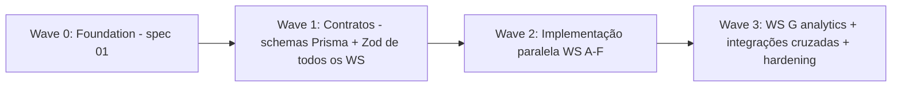

# Design: APIs e Serviços de Domínio

## Padrão por Módulo (obrigatório e idêntico em todos os workstreams)

```
prisma/schema/<modulo>.prisma          # se se adoptar prismaSchemaFolder; senão secção no schema único
prisma/seed/<modulo>.ts
src/lib/validations/<modulo>.ts        # Zod: Create/Update/Filter schemas
src/server/services/<modulo>/
  ├─ <entidade>.service.ts             # regras de domínio puras
  └─ __tests__/
src/server/actions/<modulo>.actions.ts # 'use server' + createSafeAction
src/app/api/<modulo>/export/route.ts   # apenas quando há exportação
```

Nota: usar `prismaSchemaFolder` (preview feature estável no Prisma 6) para permitir que 7 agentes editem schemas em paralelo sem conflitos de merge num único `schema.prisma`. Referência: https://www.prisma.io/docs/orm/prisma-schema/overview/location#multi-file-prisma-schema

## Contrato de Serviço

```ts
// exemplo: src/server/services/faturacao/fatura.service.ts
export async function emitirFatura(input: EmitirFaturaInput, ctx: Ctx): Promise<Fatura> {
  return prisma.$transaction(async (tx) => {
    const numero = await proximoNumeroSerie(tx, ctx.tenantId, input.serieId); // SELECT ... FOR UPDATE
    validarPartidas(input.linhas);                                            // BusinessRuleError se inválido
    const fatura = await tx.fatura.create({ ... });
    await registarLancamentoContabilistico(tx, fatura);                       // integração WS D
    return fatura;
  });
}
```

Regras:
- Serviços recebem `Ctx { tenantId, userId }` explícito (testabilidade) — as actions constroem-no a partir da sessão.
- Integração entre workstreams é feita por **chamada de serviço directa dentro da mesma transacção** quando a consistência é obrigatória (venda→stock, factura→contabilidade) e por serviço assíncrono simples nos restantes casos. Não introduzir message broker nesta fase (overengineering para o volume alvo).

## Máquinas de Estado

Transições declaradas como mapa e validadas centralmente:

```ts
const TRANSICOES: Record<StatusRequisicao, StatusRequisicao[]> = {
  rascunho: ['pendente', 'cancelada'],
  pendente: ['em_aprovacao', 'cancelada'],
  em_aprovacao: ['aprovada', 'rejeitada'],
  aprovada: ['convertida', 'cancelada'],
  rejeitada: [], cancelada: [], convertida: [],
};
export function transitar(actual: S, alvo: S) {
  if (!TRANSICOES[actual]?.includes(alvo)) throw new BusinessRuleError('TRANSICAO_INVALIDA', ...);
}
```

Property tests (fast-check) para cada máquina de estado: nenhuma sequência de transições válidas atinge estado inválido; toda a transição fora do mapa lança erro — replicando o padrão já usado no spec `transporte-logistica-refatoracao`.

## Numeração Sequencial de Documentos (faturação)

- Tabela `SerieDocumento { id, tenantId, tipo, prefixo, proximoNumero }`
- Obtenção do número: `UPDATE ... SET proximoNumero = proximoNumero + 1 RETURNING` dentro da transacção de emissão — serializa por série, sem lacunas em rollback (o incremento só persiste se a emissão persistir).
- Facturas emitidas são imutáveis: updates bloqueados no serviço e por trigger opcional; correcção via nota de crédito referenciando a factura.

## Paginação e Filtros

Helper único:

```ts
paginate(model, { cursor, take = 25, where, orderBy }) → { items, nextCursor }
```

- Cursor-based (id) por omissão; offset apenas em relatórios administrativos pequenos.
- Filtros validados por Zod (`FilterSchema` por entidade) — nunca `where` cru vindo do cliente.

## Ordem de Implementação (Waves)



- **Wave 1 (contratos):** cada agente entrega apenas `*.prisma` + `validations/*.ts` + interfaces de serviço. Code reviewer (fable 5) valida consistência inter-domínio (FKs entre WS, nomes, enums) antes de gerar migrations. Isto elimina o risco nº 1 do paralelismo: schemas incompatíveis.
- **Wave 2:** implementação paralela; dependências cruzadas usam as interfaces publicadas na Wave 1 (o WS D pode implementar `registarLancamentoContabilistico` como stub tipado até integração).
- **Wave 3:** integrações transaccionais reais entre WS, analytics agregado, remoção final de `src/data`.

## Riscos e Mitigações

- **Conflitos de migration em paralelo:** migrations só são geradas pelo orquestrador no fim de cada wave, numa ordem determinística (A→B→C→D→E→F→G), a partir dos schemas aprovados.
- **Regras contabilísticas erradas:** partidas dobradas validadas por invariante testado por property test (soma débitos == soma créditos para qualquer lançamento gerado).
- **Duplicação compras/procurement:** um único domínio de serviço; a decisão de consolidar rotas de UI fica registada para o spec 03 (recomendação: manter `/compras` como árvore única e redireccionar `/procurement`).
