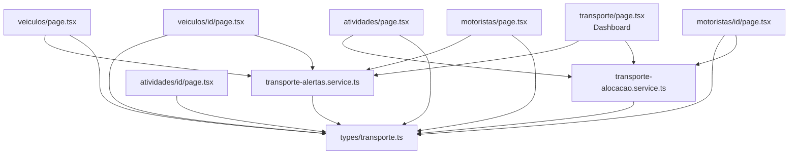
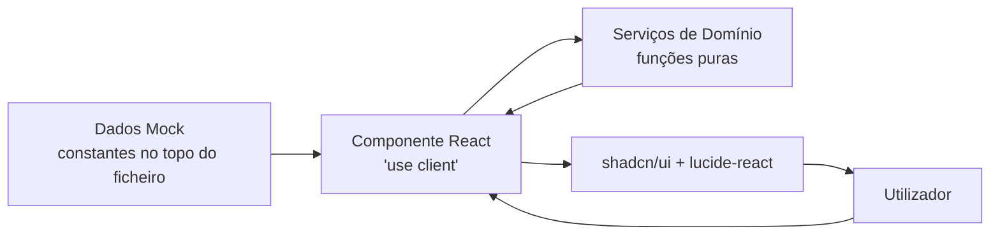

# Design Document — Refatoração do Módulo de Transportes e Logística

## Overview

Este documento descreve o design técnico para a refatoração completa do módulo de Transportes e Logística do GestPro ERP. A refatoração transforma o módulo de um sistema centrado em "Entregas" para um módulo orientado a domínio, com a entidade **Atividade** como unidade central de operação.

As principais mudanças são:

- **Novo modelo de domínio**: tipos TypeScript actualizados em `src/types/transporte.ts` com `Atividade`, `DocumentoViatura`, `ManutencaoViatura` (expandido), `ChecklistViatura`, `DocumentoMotorista` e `DisponibilidadeMotorista`.
- **Novas páginas**: `/transporte/atividades`, `/transporte/atividades/[id]`, `/transporte/veiculos/[id]`, `/transporte/motoristas/[id]`.
- **Páginas refatoradas**: `/transporte` (dashboard), `/transporte/veiculos`, `/transporte/motoristas`.
- **Novos serviços**: `transporte-alocacao.service.ts` (motor de validação) e `transporte-alertas.service.ts` (motor de alertas).

O módulo opera inteiramente com dados mock (sem backend real), seguindo os padrões existentes do projecto: componentes `'use client'`, shadcn/ui, lucide-react, react-hook-form + zod, sonner para toasts, e paginação via `usePagination`.

---

## Architecture

### Estrutura de Ficheiros

```
src/
├── types/
│   └── transporte.ts                          — tipos actualizados (Viatura, Motorista, Atividade, etc.)
├── services/
│   ├── transporte-alocacao.service.ts         — motor de validação de alocação (novo)
│   └── transporte-alertas.service.ts          — motor de geração de alertas (novo)
└── app/(dashboard)/transporte/
    ├── page.tsx                               — dashboard refatorado
    ├── veiculos/
    │   ├── page.tsx                           — lista de viaturas (expandida)
    │   └── [id]/page.tsx                      — detalhe de viatura (novo)
    ├── motoristas/
    │   ├── page.tsx                           — lista de motoristas (refatorada)
    │   └── [id]/page.tsx                      — detalhe de motorista (novo)
    ├── atividades/
    │   ├── page.tsx                           — lista de atividades (novo)
    │   └── [id]/page.tsx                      — detalhe de atividade (novo)
    ├── manutencao/page.tsx                    — manter (não é alvo)
    ├── rotas/page.tsx                         — manter (não é alvo)
    └── combustivel/page.tsx                   — manter (não é alvo)
```

### Diagrama de Dependências



### Fluxo de Dados (Mock)



Todos os dados são declarados como constantes no topo de cada ficheiro de página (padrão existente no projecto). Os serviços são funções puras que recebem dados e retornam resultados — sem estado interno, sem chamadas HTTP.

---

## Components and Interfaces

### Serviço de Alocação (`src/services/transporte-alocacao.service.ts`)

```typescript
interface ValidationResult {
  isValid: boolean;
  errors: string[];
}

interface ConflictResult {
  atividadeId: string;
  atividadeCodigo: string;
  dataInicio: Date;
  dataFim?: Date;
  descricao: string;
}

// Valida se uma viatura pode ser alocada a uma atividade
function validarAlocacaoViatura(
  viatura: Viatura,
  dataInicio: Date,
  dataFim?: Date,
  atividadesExistentes?: Atividade[]
): ValidationResult

// Valida se um motorista pode ser alocado a uma atividade
function validarAlocacaoMotorista(
  motorista: Motorista,
  dataInicio: Date,
  dataFim?: Date,
  atividadesExistentes?: Atividade[]
): ValidationResult

// Verifica conflitos de agenda para uma entidade
function verificarConflitosAgenda(
  entidadeId: string,
  tipo: 'viatura' | 'motorista',
  dataInicio: Date,
  dataFim: Date | undefined,
  atividades: Atividade[]
): ConflictResult[]

// Calcula o estado de um documento com base na data de validade e prazo de alerta
function calcularEstadoDocumento(
  dataValidade: Date,
  prazoAlertaDias: number
): 'valido' | 'proximo_expirar' | 'expirado'
```

### Serviço de Alertas (`src/services/transporte-alertas.service.ts`)

```typescript
interface Alerta {
  id: string;
  tipo: 'documento_expirado' | 'documento_proximo_expirar' | 'manutencao_pendente' | 'conflito_alocacao';
  urgencia: 'critico' | 'aviso' | 'info';
  entidade: 'viatura' | 'motorista';
  entidadeId: string;
  entidadeNome: string;
  descricao: string;
  dataAlerta: Date;
}

// Gera alertas de documentos para viaturas e motoristas
function gerarAlertasDocumentos(
  viaturas: Viatura[],
  motoristas: Motorista[]
): Alerta[]

// Gera alertas de manutenção preventiva em atraso ou próxima
function gerarAlertasManutencao(
  viaturas: Viatura[],
  manutencoes: ManutencaoViatura[]
): Alerta[]
```

### Componentes de Página

Cada página segue o padrão existente no projecto:

| Página | Componente | Padrão |
|--------|-----------|--------|
| `/transporte` | `TransporteDashboardPage` | KPIs + alertas + lista recente + atalhos |
| `/transporte/atividades` | `AtividadesPage` | Tabela + filtros + Dialog de criação |
| `/transporte/atividades/[id]` | `AtividadeDetalhesPage` | Header + Tabs (2) |
| `/transporte/veiculos` | `VeiculosPage` | Tabela + filtros + Dialog de criação |
| `/transporte/veiculos/[id]` | `ViaturaDetalhesPage` | Header + Tabs (5) |
| `/transporte/motoristas` | `MotoristasPage` | Cards + filtros + Dialog de criação |
| `/transporte/motoristas/[id]` | `MotoristaDetalhesPage` | Header + Tabs (4) |

### Componentes UI Reutilizados

Todos os componentes são importados de `@/components/ui/`:

`Card`, `CardContent`, `CardHeader`, `CardTitle`, `Badge`, `Button`, `Input`, `Label`, `Select`, `Dialog`, `DialogContent`, `DialogHeader`, `DialogTitle`, `DialogFooter`, `Tabs`, `TabsContent`, `TabsList`, `TabsTrigger`, `Table`, `TableBody`, `TableCell`, `TableHead`, `TableHeader`, `TableRow`, `Textarea`

---

## Data Models

### Tipos Actualizados em `src/types/transporte.ts`

#### Viatura (actualizado)

```typescript
interface Viatura {
  id: string;
  matricula: string;
  marca: string;
  modelo: string;
  tipoViatura: 'ligeiro_passageiros' | 'ligeiro_mercadorias' | 'pesado_mercadorias' | 'pesado_passageiros' | 'motociclo' | 'outro';
  capacidade: number;
  unidadeCapacidade: 'kg' | 'ton' | 'm3' | 'passageiros';
  localActividade: string;
  dataInicioActividade: Date;
  motoristaResponsavelId?: string;
  motoristaResponsavelNome?: string;
  estado: 'disponivel' | 'em_actividade' | 'em_manutencao' | 'inactiva' | 'abatida';
  observacoes?: string;
  documentos: DocumentoViatura[];
  criadoEm: Date;
  actualizadoEm: Date;
}
```

#### DocumentoViatura (novo)

```typescript
interface DocumentoViatura {
  id: string;
  viaturaId: string;
  tipo: 'livrete' | 'inspecao' | 'seguro' | 'licenca' | 'manifesto' | 'taxa_radio' | 'outro';
  numero: string;
  dataEmissao: Date;
  dataValidade: Date;
  entidadeEmissora: string;
  estado: 'valido' | 'proximo_expirar' | 'expirado';
  anexo?: string;
  observacoes?: string;
  prazoAlertaDias: number; // default: 30
}
```

#### ManutencaoViatura (expandido)

```typescript
interface ManutencaoViatura {
  id: string;
  viaturaId: string;
  tipo: 'preventiva' | 'correctiva';
  data: Date;
  quilometragem?: number;
  criterio?: string;
  descricao: string;
  fornecedor?: string;
  custo?: number;
  pecasSubstituidas?: string;
  responsavel: string;
  proximaManutencaoPrevista?: {
    data?: Date;
    quilometragem?: number;
    criterio?: string;
  };
  criadoEm: Date;
}
```

#### ChecklistViatura (novo)

```typescript
interface ChecklistViatura {
  id: string;
  viaturaId: string;
  tipoViatura: string;
  itens: ItemChecklist[];
  responsavel: string;
  dataInspeccao: Date;
  observacoes?: string;
}

interface ItemChecklist {
  id: string;
  nome: string;
  categoria: 'componente' | 'sobressalente' | 'acessorio';
  estado: 'ok' | 'avaria' | 'falta';
  observacoes?: string;
}
```

#### Atividade (novo — entidade central)

```typescript
interface Atividade {
  id: string;
  codigo: string; // gerado automaticamente: AT-YYYY-NNNN
  titulo: string;
  descricao?: string;
  tipoActividade: 'deslocacao' | 'missao_servico' | 'transporte_mercadorias' | 'transporte_pessoal' | 'manutencao_campo' | 'outro';
  localActividade: string;
  dataInicioPrevista: Date;
  dataConclusaoPrevista?: Date;
  motoristaResponsavelId?: string;
  motoristaResponsavelNome?: string;
  viaturaId?: string;
  viaturaMatricula?: string;
  prioridade: 'baixa' | 'media' | 'alta' | 'urgente';
  estado: 'planeada' | 'em_curso' | 'suspensa' | 'concluida' | 'cancelada';
  observacoes?: string;
  anexos?: string[];
  historico: EventoAtividade[];
  criadoEm: Date;
  criadoPor: string;
}

interface EventoAtividade {
  id: string;
  data: Date;
  estadoAnterior?: string;
  estadoNovo: string;
  utilizador: string;
  descricao: string;
}
```

#### Motorista (actualizado)

```typescript
interface Motorista {
  id: string;
  nomeCompleto: string;
  contacto: string;
  morada?: string;
  numeroBI?: string;
  numeroCarta: string;
  categoriaCarta: string[];
  dataEmissaoCarta: Date;
  validadeCarta: Date;
  localActividade?: string;
  estadoOperacional: 'activo' | 'inactivo' | 'suspenso';
  observacoes?: string;
  documentos: DocumentoMotorista[];
  disponibilidade: DisponibilidadeMotorista;
  criadoEm: Date;
  actualizadoEm: Date;
}
```

#### DocumentoMotorista (novo)

```typescript
interface DocumentoMotorista {
  id: string;
  motoristaId: string;
  tipo: 'carta_conducao' | 'bi' | 'outro';
  numero: string;
  dataEmissao: Date;
  dataValidade: Date;
  entidadeEmissora: string;
  estado: 'valido' | 'proximo_expirar' | 'expirado';
  anexo?: string;
  observacoes?: string;
}
```

#### DisponibilidadeMotorista (novo)

```typescript
interface DisponibilidadeMotorista {
  disponivel: boolean;
  motivo?: 'ferias' | 'ausencia' | 'suspensao' | 'manual' | 'conflito_agenda';
  dataInicio?: Date;
  dataFim?: Date;
  fonte: 'sistema' | 'rh_api' | 'manual';
}
```

### Compatibilidade com Tipos Existentes

Os tipos `Rota`, `PontoEntrega`, `Entrega`, `ItemEntrega`, `Abastecimento` e `RelatorioTransporte` são mantidos sem alterações para garantir compatibilidade com as páginas de rotas e combustível que não são alvo desta refatoração. Os tipos `Veiculo` e `Motorista` antigos são substituídos pelos novos `Viatura` e `Motorista` actualizados — as páginas de rotas e combustível que referenciam os tipos antigos devem ser actualizadas para usar os novos nomes.

### Dados Mock

Cada página declara os seus dados mock como constantes no topo do ficheiro (fora do componente), seguindo o padrão existente:

```typescript
// Exemplo: atividades/page.tsx
const atividadesMock: Atividade[] = [
  {
    id: '1',
    codigo: 'AT-2024-0001',
    titulo: 'Deslocação ao Porto de Maputo',
    tipoActividade: 'deslocacao',
    localActividade: 'Porto de Maputo',
    dataInicioPrevista: new Date('2024-03-15T08:00:00'),
    prioridade: 'alta',
    estado: 'em_curso',
    historico: [...],
    criadoEm: new Date('2024-03-14'),
    criadoPor: 'admin'
  },
  // ... mais registos
];
```

---

## Correctness Properties

*A property is a characteristic or behavior that should hold true across all valid executions of a system — essentially, a formal statement about what the system should do. Properties serve as the bridge between human-readable specifications and machine-verifiable correctness guarantees.*

### Property 1: Cálculo de estado de documento

*Para qualquer* data de validade e prazo de alerta em dias, a função `calcularEstadoDocumento` SHALL retornar:
- `'expirado'` se a data de validade for anterior à data actual
- `'proximo_expirar'` se a data de validade estiver dentro do prazo de alerta (entre hoje e hoje + prazoAlertaDias)
- `'valido'` se a data de validade for posterior a hoje + prazoAlertaDias

**Validates: Requirements 3.4, 3.5, 3.6, 9.4, 9.5, 9.6**

---

### Property 2: Bloqueio de alocação por documento expirado

*Para qualquer* viatura que tenha pelo menos um `DocumentoViatura` com `estado === 'expirado'`, a função `validarAlocacaoViatura` SHALL retornar `{ isValid: false, errors: [...] }` com pelo menos um erro descrevendo o documento inválido.

**Validates: Requirements 7.1, 7.2**

---

### Property 3: Bloqueio de alocação por carta de condução expirada

*Para qualquer* motorista cuja `validadeCarta` seja anterior à data actual, a função `validarAlocacaoMotorista` SHALL retornar `{ isValid: false, errors: [...] }` com pelo menos um erro descrevendo a carta inválida.

**Validates: Requirements 7.3, 7.4**

---

### Property 4: Detecção de conflitos de agenda

*Para qualquer* par de atividades que partilhem a mesma `viaturaId` (ou `motoristaResponsavelId`) e cujos intervalos `[dataInicioPrevista, dataConclusaoPrevista]` se sobreponham, a função `verificarConflitosAgenda` SHALL retornar pelo menos um `ConflictResult`.

**Validates: Requirements 7.5, 7.6, 7.7, 7.8**

---

### Property 5: Bloqueio de alocação por indisponibilidade de motorista

*Para qualquer* motorista com `disponibilidade.disponivel === false` (independentemente do motivo), a função `validarAlocacaoMotorista` SHALL retornar `{ isValid: false, errors: [...] }` com pelo menos um erro indicando o motivo de indisponibilidade.

**Validates: Requirements 7.9**

---

### Property 6: Geração de alertas para documentos inválidos

*Para qualquer* conjunto de viaturas e motoristas, a função `gerarAlertasDocumentos` SHALL retornar pelo menos um `Alerta` por cada documento cujo `estado` seja `'expirado'` ou `'proximo_expirar'`. O campo `urgencia` do alerta SHALL ser `'critico'` para documentos expirados e `'aviso'` para documentos próximos a expirar.

**Validates: Requirements 1.2, 1.5, 1.6, 11.1**

---

### Property 7: KPIs do dashboard correspondem aos dados

*Para qualquer* conjunto de viaturas, atividades e motoristas, os KPIs calculados para o dashboard SHALL corresponder exactamente às contagens filtradas:
- viaturas disponíveis = `viaturas.filter(v => v.estado === 'disponivel').length`
- atividades em curso = `atividades.filter(a => a.estado === 'em_curso').length`
- motoristas disponíveis = `motoristas.filter(m => m.disponibilidade.disponivel).length`
- alertas activos = `gerarAlertasDocumentos(viaturas, motoristas).length + gerarAlertasManutencao(viaturas, manutencoes).length`

**Validates: Requirements 1.1**

---

### Property 8: Imutabilidade do histórico de atividades

*Para qualquer* sequência de N mudanças de estado aplicadas a uma atividade, o array `historico` da atividade SHALL conter exactamente N `EventoAtividade`, cada um com os campos `data`, `estadoNovo`, `utilizador` e `descricao` preenchidos. Nenhum evento existente SHALL ser removido ou modificado quando um novo evento é adicionado.

**Validates: Requirements 6.6, 12.1, 12.5**

---

### Property 9: Bloqueio de alocação por checklist com itens em avaria/falta

*Para qualquer* viatura cujo checklist mais recente contenha pelo menos um `ItemChecklist` com `estado === 'avaria'` ou `estado === 'falta'`, a função `validarAlocacaoViatura` SHALL retornar `{ isValid: false, errors: [...] }` com pelo menos um erro descrevendo o item problemático.

**Validates: Requirements 5.6**

---

## Error Handling

### Validação de Formulários

Todos os formulários usam `react-hook-form` + `zod` para validação. Campos obrigatórios em falta impedem a submissão e exibem mensagens de erro inline. Toasts de erro são exibidos via `sonner` quando a validação falha.

```typescript
// Exemplo de schema zod para Atividade
const atividadeSchema = z.object({
  titulo: z.string().min(1, 'Título é obrigatório'),
  tipoActividade: z.enum(['deslocacao', 'missao_servico', ...]),
  localActividade: z.string().min(1, 'Local é obrigatório'),
  dataInicioPrevista: z.date(),
  prioridade: z.enum(['baixa', 'media', 'alta', 'urgente']),
  // campos opcionais...
});
```

### Erros de Alocação

Quando `validarAlocacaoViatura` ou `validarAlocacaoMotorista` retorna `isValid: false`, o formulário de criação de atividade exibe os erros inline junto aos campos de viatura/motorista, sem fechar o Dialog. O utilizador pode corrigir a selecção sem perder os dados já preenchidos.

### Estado Not-Found nas Páginas de Detalhe

Quando `useParams` retorna um `id` que não existe nos dados mock, as páginas de detalhe renderizam um estado de erro mínimo:

```tsx
<div className="p-6">
  <Button variant="ghost" onClick={() => router.back()}>
    <ArrowLeft className="h-4 w-4 mr-2" /> Voltar
  </Button>
  <div className="mt-8 text-center">
    <AlertCircle className="h-12 w-12 text-muted-foreground mx-auto mb-4" />
    <p className="text-muted-foreground">Registo não encontrado</p>
  </div>
</div>
```

### Arrays Vazios

Todas as listas e tabelas tratam o caso de array vazio com um estado visual adequado (ícone + mensagem), seguindo o padrão das páginas existentes.

### Integração com Módulo RH (Mock)

A integração com o Módulo RH é simulada com dados mock. A `DisponibilidadeMotorista` com `fonte: 'rh_api'` é tratada da mesma forma que `fonte: 'manual'` — a lógica de validação não distingue a fonte, apenas o valor de `disponivel`.

---

## Testing Strategy

### Abordagem Dual

O módulo usa duas camadas de testes complementares:

1. **Testes de exemplo (unit tests)**: verificam comportamentos específicos, casos de uso concretos e integração entre componentes.
2. **Testes de propriedade (property-based tests)**: verificam propriedades universais das funções puras dos serviços, com 100+ iterações por propriedade.

### Biblioteca de Property-Based Testing

A biblioteca recomendada é **fast-check** (`npm install --save-dev fast-check`), que integra nativamente com Vitest/Jest e suporta TypeScript. Os serviços `transporte-alocacao.service.ts` e `transporte-alertas.service.ts` são funções puras — ideais para PBT.

```bash
npm install --save-dev fast-check
```

### Testes de Exemplo (Unit Tests)

**Serviço de Alocação:**
- Viatura com todos os documentos válidos → `isValid: true`
- Viatura sem documentos → `isValid: true` (sem documentos obrigatórios definidos)
- Motorista activo com carta válida → `isValid: true`
- Motorista suspenso → `isValid: false`
- Duas atividades sem sobreposição de datas → sem conflitos
- Duas atividades com datas exactamente adjacentes → sem conflitos

**Serviço de Alertas:**
- Conjunto vazio de viaturas/motoristas → array vazio de alertas
- Viatura com todos os documentos válidos → sem alertas de documentos
- Manutenção sem próxima manutenção prevista → sem alertas de manutenção

**Páginas:**
- Dashboard renderiza com dados mock sem erros
- Lista de atividades filtra correctamente por estado
- Formulário de nova atividade valida campos obrigatórios
- Página de detalhe renderiza todas as tabs para um registo válido
- Página de detalhe exibe estado not-found para id inexistente
- Transições de estado de atividade adicionam evento ao histórico

### Testes de Propriedade (Property-Based Tests)

Cada teste de propriedade corre um mínimo de **100 iterações**.

Tag format: `Feature: transporte-logistica-refatoracao, Property {N}: {property_text}`

**Property 1** — Cálculo de estado de documento  
Gerar datas de validade aleatórias (passado, dentro do prazo, futuro) e prazos de alerta aleatórios (1–365 dias). Verificar que `calcularEstadoDocumento` retorna o estado correcto para cada combinação.  
`// Feature: transporte-logistica-refatoracao, Property 1: calcularEstadoDocumento retorna estado correcto para qualquer data e prazo`

**Property 2** — Bloqueio por documento expirado  
Gerar viaturas com pelo menos um documento expirado (data de validade no passado). Verificar que `validarAlocacaoViatura` retorna `isValid: false` com erros não vazios.  
`// Feature: transporte-logistica-refatoracao, Property 2: viatura com documento expirado bloqueia alocação`

**Property 3** — Bloqueio por carta expirada  
Gerar motoristas com `validadeCarta` no passado. Verificar que `validarAlocacaoMotorista` retorna `isValid: false`.  
`// Feature: transporte-logistica-refatoracao, Property 3: motorista com carta expirada bloqueia alocação`

**Property 4** — Detecção de conflitos de agenda  
Gerar pares de atividades com a mesma viatura/motorista e intervalos de datas sobrepostos. Verificar que `verificarConflitosAgenda` retorna pelo menos um conflito.  
`// Feature: transporte-logistica-refatoracao, Property 4: atividades com datas sobrepostas geram conflito`

**Property 5** — Motorista indisponível bloqueia alocação  
Gerar motoristas com `disponibilidade.disponivel === false` e motivos aleatórios. Verificar que `validarAlocacaoMotorista` retorna `isValid: false`.  
`// Feature: transporte-logistica-refatoracao, Property 5: motorista indisponível bloqueia alocação`

**Property 6** — Geração de alertas para documentos inválidos  
Gerar conjuntos aleatórios de viaturas e motoristas com documentos de estados variados. Verificar que `gerarAlertasDocumentos` retorna exactamente um alerta por documento com estado `'expirado'` ou `'proximo_expirar'`, com urgência correcta.  
`// Feature: transporte-logistica-refatoracao, Property 6: gerarAlertasDocumentos gera alerta por cada documento inválido`

**Property 7** — KPIs correspondem aos dados  
Gerar conjuntos aleatórios de viaturas, atividades e motoristas. Verificar que as contagens calculadas para os KPIs correspondem às contagens reais dos arrays filtrados.  
`// Feature: transporte-logistica-refatoracao, Property 7: KPIs do dashboard correspondem às contagens reais`

**Property 8** — Imutabilidade do histórico  
Gerar sequências aleatórias de N mudanças de estado (1–10). Aplicar cada mudança e verificar que o histórico cresce de 1 em 1 e que os eventos anteriores não são modificados.  
`// Feature: transporte-logistica-refatoracao, Property 8: histórico de atividade é append-only`

**Property 9** — Checklist com avaria/falta bloqueia alocação  
Gerar checklists com pelo menos um item com `estado === 'avaria'` ou `estado === 'falta'`. Verificar que `validarAlocacaoViatura` retorna `isValid: false`.  
`// Feature: transporte-logistica-refatoracao, Property 9: checklist com avaria/falta bloqueia alocação de viatura`

### Cobertura de Testes

| Camada | Tipo | Foco |
|--------|------|------|
| `transporte-alocacao.service.ts` | Property + Unit | Todas as funções puras |
| `transporte-alertas.service.ts` | Property + Unit | Geração de alertas |
| Páginas de lista | Unit | Filtros, paginação, formulários |
| Páginas de detalhe | Unit | Renderização de tabs, not-found |
| Tipos TypeScript | Smoke | Compilação sem erros (`tsc --noEmit`) |
