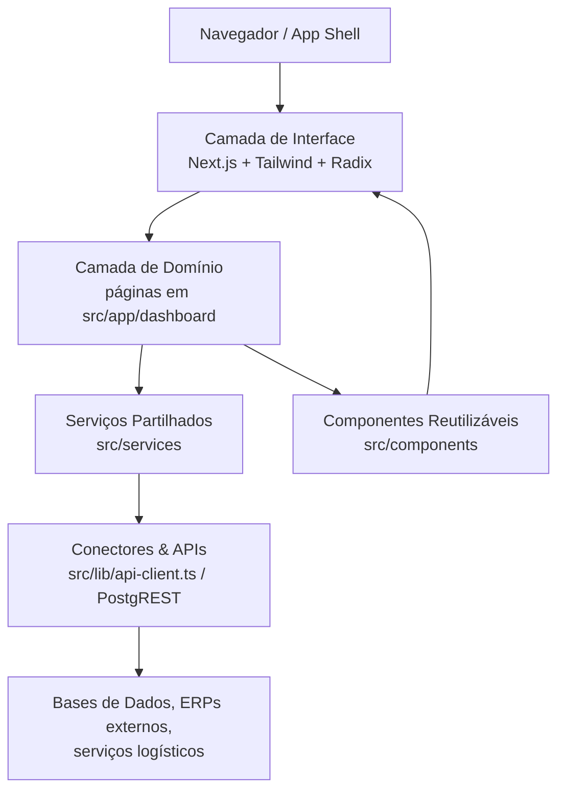
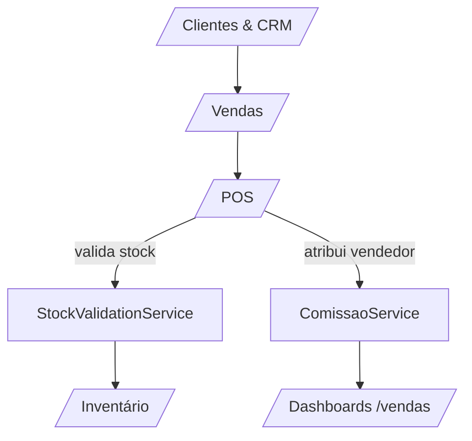

# Documentação Funcional do GestPro ERP (PT)

## Sumário
1. [Visão Geral](#visão-geral)
2. [Tecnologias Principais](#tecnologias-principais)
3. [Estrutura de Pastas Essencial](#estrutura-de-pastas-essencial)
4. [Arquitetura em Camadas](#arquitetura-em-camadas)
5. [Reorganização Funcional dos Módulos](#reorganização-funcional-dos-módulos)
6. [Fluxos Operacionais-Chave](#fluxos-operacionais-chave)
7. [Serviços e Bibliotecas Partilhadas](#serviços-e-bibliotecas-partilhadas)
8. [Qualidade, Operação e Automação](#qualidade-operação-e-automação)
9. [Backlog Orientado a Valor](#backlog-orientado-a-valor)

---

## Visão Geral
GestPro ERP é um monorepositório centrado em Next.js 15 que agrega num único frontend todos os domínios operacionais típicos de uma empresa moçambicana (retalho, serviços e indústria ligeira). Cada módulo no directório `src/app/(dashboard)` expõe um "mini-dashboard" especializado, construído com componentes reutilizáveis (`src/components`) e serviços de domínio (`src/services`).

O objectivo desta documentação é disponibilizar, em Português de Portugal, uma visão consolidada e sem duplicações sobre:
- Estrutura técnica do projecto;
- Organização funcional dos módulos do ERP;
- Fluxos transversais (Procurement, Vendas, Stock, Capital Humano);
- Pontos de integração e bibliotecas reutilizáveis;
- Backlog mínimo de evolução.

---

## Tecnologias Principais
| Camada | Tecnologia / Versão | Observações |
| --- | --- | --- |
| Framework Web | Next.js 15.2.4 + App Router | `src/app` aloja rotas, layouts, páginas de erro e a API local em `next_api`. |
| Linguagens | TypeScript 5.x + React 19 | Estrita tipagem aplicada nas rotas e serviços. |
| UI & Estado | Radix UI, Tailwind 4 (com `tailwindcss-animate`), `lucide-react` | Componentes em `src/components/ui` e temas em `ThemeProvider`. |
| Formulários & Validação | `react-hook-form`, `zod`, `@hookform/resolvers` | Utilizados nos módulos de RH, compras e vendas. |
| Gráficos e UX | `recharts`, `framer-motion`, `embla-carousel` | Dashboards de KPIs (por ex. compras, vendas, stock). |
| Serviços & Dados | `@supabase/postgrest-js`, utilitários em `src/lib/api-client.ts` e `postgrest.ts` | Camada de acesso a dados desacoplada via PostgREST. |
| Segurança e Sessão | `jose`, `next-themes`, `auth-context` | Implementa autenticação JWT e gestão do tema. |

---

## Estrutura de Pastas Essencial
```
src/
├─ app/
│  ├─ (dashboard)/            # Rotas de negócio (ver tabela de módulos abaixo)
│  ├─ dashboard/              # Página pública e landing
│  ├─ next_api/               # Handlers API locais
│  ├─ zoer_chatbot/           # Integração com @npm_chat2db/zoer-copilot
│  └─ globals.css / layout.tsx
├─ components/
│  ├─ ui/                     # Botões, cards, tabelas, gráficos
│  ├─ dashboard/, auth/, etc.  # Conjuntos reutilizáveis por domínio
├─ hooks/                      # React hooks especializados (ex.: uso de tema, dados)
├─ lib/
│  ├─ api-client.ts / postgrest.ts # Ligações HTTP e utilidades
│  ├─ utils.ts / format-currency.ts # Funções de apoio
│  └─ storage/                 # Estratégias de persistência local
├─ services/
│  ├─ comissao.service.ts      # Motor de comissões
│  └─ stock-validation.service.ts # Motor de validação e reserva de stock
└─ types/                      # Tipagens globais (ex.: pedido, stock, utilizador)
```

---

## Arquitetura em Camadas



A camada `(dashboard)` consome componentes e serviços partilhados, evitando duplicação de lógica. Os serviços encapsulam integrações (ex.: cálculo de comissões e gestão de stock), permitindo evoluir o backend sem alterar as páginas.

---

## Reorganização Funcional dos Módulos
Para eliminar ambiguidades e duplicações, os módulos do directório `src/app/(dashboard)` foram agrupados em nove domínios funcionais. Cada domínio pode possuir mais do que uma rota física (ex.: `/compras` e `/procurement`), mas a documentação abaixo considera-os como parte de um único macro-módulo.

### Visão Consolidada
| Macro-módulo | Rotas incluídas | Responsabilidades principais | Integrações |
| --- | --- | --- | --- |
| Base & Experiência | `/dashboard`, `/layout`, `/zoer_chatbot` | Navegação, shell responsivo, assistente Zoer Copilot. | Componentes globais, `ThemeProvider`. |
| Procurement & Compras Integradas | `/compras`, `/procurement`, `/fornecedores`, `/servicos` | Requisições, orçamentos, aprovações, contratos de serviços e catálogos de fornecedores. | Stock Validation, PostgREST, workflow de aprovadores. |
| Gestão de Produtos e Inventário | `/produtos`, `/inventario`, `/stock` | Catálogo, classificação ABC, auditorias, alertas de stock mínimo. | `StockValidationService`, relatórios Recharts. |
| Operações Comerciais | `/vendas`, `/pos`, `/clientes` | Pipeline comercial, POS, gestão de comissões e carteira de clientes. | `ComissaoService`, métricas de vendas. |
| Finanças & Conformidade | `/caixa`, `/contabilidade`, `/faturacao` | Fluxo de caixa, conciliações, emissão de facturas e impostos. | Validadores fiscais (`validacao-nuit`, `validacao-bi`). |
| Produção & Projetos | `/producao`, `/projetos` | Ordens de produção, planeamento de capacidade, portefólio de projectos. | Integração com inventário e RH. |
| Capital Humano | `/rh` | Admissões, presença, formação e indicadores sociais. | Hooks para folhas de ponto e validações. |
| Atendimento & Serviços de Campo | `/tickets`, `/transporte` | Helpdesk omnicanal, planeamento de entregas e SLAs. | Serviços externos de logística. |
| Inteligência Operacional | `/pos`, `/vendas`, `/inventario`, `/compras` (dashboards) | KPIs e painéis interactivos, alimentados por `recharts`. | ChartContainer e ChartTooltip partilhados. |

### Descrição dos Domínios
- **Procurement & Compras Integradas** (`src/app/(dashboard)/compras` e `/procurement`): dashboards com cartões de KPI, gráficos de barras/líneas (`recharts`) e atalhos para orçamentos, requisições e recepção de mercadorias. O módulo `procurement` detalha fluxos de aprovação e pedidos, enquanto `compras` destaca desempenho dos fornecedores e status das requisições.
- **Fornecedores & Serviços** (`/fornecedores`, `/servicos`): bases de dados com scoring, gestão de contratos e integração com o módulo de compras para avaliação e renegociação.
- **Gestão de Produtos & Inventário** (`/inventario`, `/stock`, `/produtos`): consolida os dashboards de inventário físico (conteúdos em `inventario`) com métricas em tempo real (`stock`). Os alertas de stock são produzidos pelo `StockValidationService` e exibidos em cartões e gráficos.
- **Operações Comerciais & POS** (`/vendas`, `/pos`, `/clientes`): reúne pipeline de oportunidades, vendas assistidas e terminal POS. As comissões calculadas em `src/services/comissao.service.ts` alimentam os relatórios de vendedores.
- **Finanças & Conformidade** (`/caixa`, `/contabilidade`, `/faturacao`): gere fluxo de caixa, integrações bancárias, emissão de facturas e validações fiscais (rotinas em `src/lib/validacao-nuit.ts` e `validacao-bi.ts`).
- **Produção e Projectos** (`/producao`, `/projetos`): suportam planeamento de ordens, MRP e acompanhamento de milestones, alinhados com consumo de stock e disponibilidade de RH.
- **Capital Humano** (`/rh`): dashboards de headcount, assiduidade e planos de formação, partilhando componentes com `src/components/dashboard`.
- **Atendimento & Transporte** (`/tickets`, `/transporte`): módulos orientados a SLA com mapas, filas e planeamento de entregas.
- **Base & Inteligência** (`/dashboard`, `/zoer_chatbot`): ponto de entrada com visão macro e assistente conversacional para consulta rápida.

Cada módulo segue o mesmo padrão: exporta um componente React client-side (`'use client';`) com `Card`, `Button`, `ChartContainer` e integrações com hooks e serviços para garantir consistência visual.

---

## Fluxos Operacionais-Chave
### Fluxo de Procurement Integrado
```mermaid
graph LR
  A[Requisição (Compras/Requisições)] --> B[Aprovação multiescala
(Procurement/Aprovações)]
  B --> C[Pedido de Compra
(Procurement/Pedidos)]
  C --> D[Recepção Física
(Compras/Recepção)]
  D --> E[Validação de Stock
StockValidationService]
  E --> F[Facturação & Pagamento
/financeiro]
  F --> G[Análise de Fornecedores
/fornecedores]
```

### Fluxo Comercial com Comissões


---

## Serviços e Bibliotecas Partilhadas
| Componente | Localização | Finalidade |
| --- | --- | --- |
| `ComissaoService` | `src/services/comissao.service.ts` | Calcula percentuais dinâmicos, gere regras escalonadas, regista e recupera comissões de vendedores. |
| `StockValidationService` | `src/services/stock-validation.service.ts` | Garante disponibilidade de stock, reserva/liberta quantidades e produz alertas de nível mínimo. |
| Utilidades de API | `src/lib/api-client.ts`, `postgrest.ts`, `api-utils.ts` | Normalizam chamadas HTTP, gestão de tokens e serialização para PostgREST/Supabase. |
| Validadores Fiscais | `src/lib/validacao-nuit.ts`, `validacao-bi.ts` | Validam documentos legais moçambicanos para módulos de faturação. |
| Armazenamento Local | `src/lib/storage/*` | Abstrações para `localStorage` / `sessionStorage` seguras no contexto Next.js. |
| Componentes UI Base | `src/components/ui/*` | Cards, tabelas, gráficos, badges, menus e tooltips reutilizados em todos os dashboards. |

---

## Qualidade, Operação e Automação
- **Desenvolvimento local:** `npm run dev` inicia o servidor com Turbopack (porta 3000).
- **Verificações:** `npm run lint` aplica ESLint 9 com regras do Next.js 15.
- **Build de produção:** `npm run build` compila o App Router e gera artefactos otimizados.
- **Configuração de temas:** `src/components/ThemeProvider.tsx` e `ThemeToggle.tsx` asseguram modo claro/escuro global.
- **Observabilidade:** utilizar `GlobalClientEffects` para side-effects globais (toasts, telemetria) e `next_api` para protótipos de API.

---

## Backlog Orientado a Valor
1. **Automação documental no Procurement:** ligar `aprovacoes` a notificações push e gerar minutas automáticas.
2. **Motor de previsão de stock:** integrar dados históricos (via `storage/` ou Supabase) para prever rupturas antes dos alertas mínimos.
3. **Workflow de RH:** expor formulários baseados em `react-hook-form` para admissões, com validação automática de BI/NUIT.
4. **Integração logística:** sincronizar módulo `transporte` com APIs de operadores para rastreamento em tempo real.
5. **Monitorização financeira:** dashboards adicionais que cruzem `caixa` e `vendas` para projectar fluxo de caixa.

Esta documentação consolida a organização dos módulos e serve como referência única para equipas de produto, engenharia e operações.
