# GestPro ERP – Backend Modular (Spring Modulith + DDD + Hexagonal)

## Índice Geral

1. [Visão Geral](#1-visão-geral)
2. [Stack Tecnológica](#2-stack-tecnológica)
3. [Arquitectura – Diagramas C4](#3-arquitectura--diagramas-c4)
4. [Arquitectura Hexagonal por Módulo](#4-arquitectura-hexagonal-por-módulo)
5. [Estrutura de Projecto](#5-estrutura-de-projecto-maven--spring-modulith)
6. [Bounded Contexts & Mapeamento](#6-bounded-contexts--mapeamento-dos-modelos-typescript)
7. [Multi-tenancy & Segurança](#7-multi-tenancy--segurança)
8. [Convenções de API](#8-convenções-de-api)
9. [Diagramas ERD](#9-diagramas-erd-mermaid--exemplo)
10. [Fluxos de Negócio e Processos](#10-fluxos-de-negócio-e-processos-financeiros-mermaid)
    - [Requisição de Compra](#101-fluxo-de-requisição-de-compra)
    - [Venda POS](#102-fluxo-de-venda-pos)
    - [Ticket / Suporte](#103-fluxo-de-ticket--suporte)
    - [Nota de Crédito](#104-anulação-de-fatura-via-nota-de-crédito)
    - [Nota de Débito Complementar](#105-nota-de-débito-complementar)
    - [Faturação Completa](#106-fluxo-completo-de-faturação)
    - [Inventário Completo](#107-fluxo-completo-de-inventário)
    - [Recursos Humanos](#108-fluxo-completo-de-recursos-humanos)
    - [Procurement Completo](#109-fluxo-completo-de-procurement)
    - [Abertura de Contas Contabilísticas](#1010-fluxo-completo-de-abertura-de-contas-contabilísticas)
    - [Abertura e Fecho de Caixa](#1011-fluxo-completo-de-abertura-e-fecho-de-caixa)
    - [Configuração do Ano Contabilístico](#1012-fluxo-completo-de-configuração-de-ano-contabilístico)
    - [Abertura do Ano Contabilístico](#1013-fluxo-de-abertura-do-ano-contabilístico)
    - [Fecho do Ano Contabilístico](#1014-fluxo-de-fecho-do-ano-contabilístico)
    - [Lançamentos Contabilísticos](#1015-fluxo-de-lançamentos-contabilísticos)
    - [Reconciliação Bancária](#1016-fluxo-de-reconciliação-bancária)
    - [DRE](#1017-fluxo-de-demonstração-dos-resultados-dre)
    - [Produção Industrial](#1018-fluxos-do-módulo-de-produção)
    - [Fecho Contabilístico Mensal](#1019-fecho-contabilístico-mensal)
11. [Diagramas de Sequência](#11-diagramas-de-sequência-exemplos)
12. [Convenções de Mapeamento](#12-convenções-de-mapeamento-ts--java)
13. [Roadmap](#13-roadmap-de-implementação)
14. [Checklist](#14-checklist-rápido)

## 1. Visão Geral

O GestPro ERP é um backend corporativo modular construído em **Spring Boot 3.3 + Spring Modulith**, seguindo:

- Arquitectura **Hexagonal (Ports & Adapters)**  
- **Domain-Driven Design (DDD)** com Bounded Contexts explícitos  
- **Java 21**, **Maven**, **Lombok** e **MapStruct**  
- Modelo **multi-tenant** com `tenantId` em todas as entidades  
- API REST alinhada com os **modelos TypeScript** já usados no frontend (Next.js)

O objetivo é substituir os dados mock/local dos ficheiros de storage do frontend:

- `cliente-storage.ts`, `fornecedor-storage.ts`, `ticket-storage.ts`,  
  `servico-storage.ts`, `rh-storage.ts`, `projeto-storage.ts`,  
  `provincias-mocambique.ts`, `format-currency.ts`,  
  `validacao-bi.ts`, `validacao-nuit.ts`, etc.

por uma **API real, versionada e estável** (`/api/v1/...`).

---

## 2. Stack Tecnológica

| Camada | Tecnologia / Versão | Observações |
| --- | --- | --- |
| Runtime | Java 21 (LTS) | Records, pattern matching, switch melhorado. |
| Framework | Spring Boot 3.3 + Spring Modulith | Monólito modular com fronteiras de módulos. |
| Build | Maven 3.9.x | Multi-module, organizado por Bounded Contexts. |
| Persistência | Spring Data JPA + PostgreSQL 16 | Schemas por módulo (futuro), transacções por agregado. |
| Mapeamento | MapStruct + Lombok | DTOs/records ↔ Entities, menos boilerplate. |
| Eventos internos | Spring Modulith Events | Eventos de domínio e integração entre módulos. |
| Segurança | OAuth2 Resource Server + Keycloak | JWT, roles e tenants. |
| Observabilidade | Actuator, Micrometer, OpenTelemetry | Health, métricas, tracing. |
| Testes | JUnit 5, Testcontainers, Spring Modulith Test | Testes isolados por módulo e contratuais. |

---

## 3. Arquitectura – Diagramas C4

### 3.1. C4 – Nível 1 (Contexto)

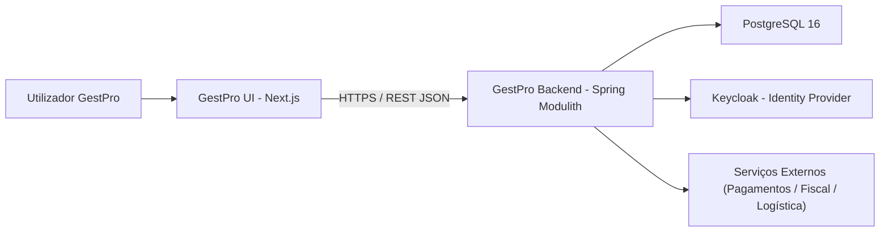

### 3.2. C4 – Nível 2 (Containers)

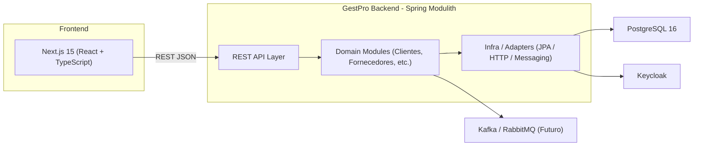

### 3.3. C4 – Nível 3 (Componentes – Exemplo: CRM Clientes)

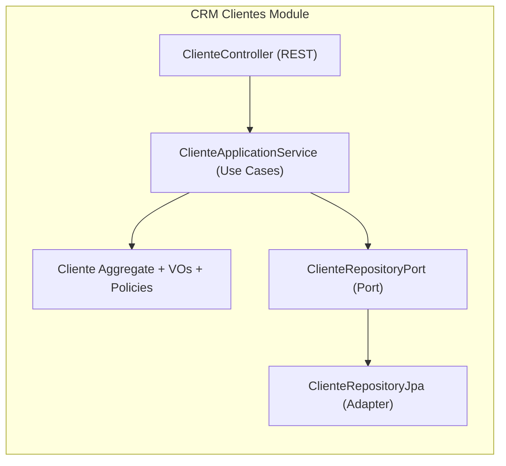

## 4. Arquitectura Hexagonal por Módulo

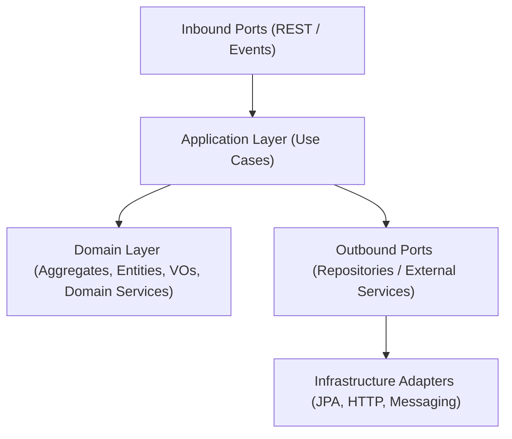

## 5. Estrutura de Projecto (Maven + Spring Modulith)

```
backend/
├─ pom.xml                          # POM agregador (parent)
├─ modules/
│  ├─ shared-kernel/
│  ├─ core-tenancy-module/
│  ├─ crm-clientes-module/
│  ├─ fornecedores-procurement-module/
│  ├─ inventory-assets-module/
│  ├─ finance-accounting-module/
│  ├─ sales-pos-module/
│  ├─ projects-module/
│  ├─ hr-module/
│  ├─ services-module/
│  ├─ support-tickets-module/
│  ├─ transport-logistics-module/
│  └─ analytics-module/
└─ platform/
   ├─ application-bootstrap/
   └─ integration-tests/
```

Cada módulo Java segue:

```
modules/<bounded-context>-module/src/main/java/com/gestpro/<context>/
  ├─ api/           # REST Controllers + DTOs
  ├─ application/   # Use Cases (Services) + Ports
  ├─ domain/        # Aggregates, Entities, VOs, Domain Services, Domain Events
  └─ infrastructure/# JPA Entities, Spring Data Repositories, HTTP Clients, etc.
```

## 6. Bounded Contexts & Mapeamento dos Modelos TypeScript

### 6.1. Tenancy & Shared Kernel

TS: Tenant, ConfiguracoesFiscais, SerieDocumento, Usuario,
provincias-mocambique.ts, validacao-bi.ts, validacao-nuit.ts, format-currency.ts.

Módulos: core-tenancy-module, shared-kernel

- Tenant (AggregateRoot)
- TenantFiscalConfig (VO ou entidade interna)
- Usuario (AggregateRoot) com enum UserRole
- VOs para NUIT, BI, Email, Money, TenantId
- Validação de BI/NUIT replicada dos TS para Domain Services/VOs

### 6.2. CRM – Clientes

TS principais:

Cliente, EnderecoCliente, ContactoCliente,
HistoricoTransacao, SegmentacaoCliente,
RelatorioCliente, DashboardClientes, etc.

Módulo: crm-clientes-module
Aggregates: Cliente, HistoricoTransacao, SegmentacaoCliente

### 6.3. Fornecedores & Procurement

TS principais:

Fornecedor, EnderecoFornecedor, ContactoFornecedor, DocumentoFornecedor,

ProdutoFornecedor, OrcamentoFornecedor, PedidoFornecedor, PagamentoFornecedor,

RequisicaoCompra, Cotacao, PedidoCompra, RecebimentoCompra,

ConfiguracaoWorkflow, NivelAprovacao, AprovacaoWorkflow, etc.

Módulo: fornecedores-procurement-module
Aggregates: Fornecedor, RequisicaoCompra, Cotacao, PedidoCompra, WorkflowAprovacao

### 6.4. Inventário & Ativos

TS: Produto, VarianteProduto, Categoria, MovimentacaoStock,
Localizacao, CategoriaAtivo, Ativo, MovimentacaoAtivo,
ManutencaoAtivo, InventarioFisico, ItemInventario,
AmortizacaoCalculo, ResumoInventario, LogInventario.

Módulo: inventory-assets-module

### 6.5. Finanças & Contabilidade

TS: PlanoContas, LancamentoContabil, PartidaContabil,
CentroCusto, ContaBancaria, ReconciliacaoBancaria,
DRE, Balancete, ConfiguracaoContabil, etc.

Módulo: finance-accounting-module

### 6.6. Vendas & POS

TS: Pedido, ItemPedido, ValidacaoStock, ComissaoVendedor,
Venda, ItemVenda, MetodoPagamento.

Módulo: sales-pos-module

### 6.7. Projectos & Trabalho

TS: Projeto, Tarefa, Milestone, Equipe, MembroEquipe,
RegistroTempo, OrcamentoProjeto, DocumentoProjeto, RelatorioProjeto.

Módulo: projects-module

### 6.8. Recursos Humanos (RH)

TS: Colaborador, FormacaoAcademica, ExperienciaProfissional,
DocumentoColaborador, Payroll, Ferias, SolicitacaoFerias,
Ausencia, RegistroAssiduidade, Avaliacao, Formacao, Beneficio,
VagaEmprego, Candidatura, DashboardRH.

Módulo: hr-module

### 6.9. Serviços & Agendamentos

TS: Servico, CategoriaServico, ServicoVenda,
AgendamentoServico, TecnicoServico, AvaliacaoServico,
RelatorioServico, PacoteServico, ContratoServico, DashboardServicos.

Módulo: services-module

### 6.10. Support & Tickets

TS: Ticket, CategoriaTicket, EquipeSuporte, BaseConhecimento,
RelatorioTickets, ConfiguracaoTickets.

Módulo: support-tickets-module

### 6.11. Transporte & Logística

TS: Veiculo, Motorista, Rota, PontoEntrega,
Entrega, ItemEntrega, Manutencao, Abastecimento, RelatorioTransporte.

Módulo: transport-logistics-module

### 6.12. Analytics

TS: Todos os Dashboard* e Relatorio*.

Módulo: analytics-module – projections/event consumers.

### 6.13. Produção Industrial

TS: OrdemProducao, ListaMaterial (BOM), RequisicaoMaterial, Maquina,
Turno, RegistoProducao, ControleQualidade, PlanoProducao,
CapacidadeProducao, IndicadorProducao.

Módulo: production-module

- Aggregates principais: PlanoProducao, OrdemProducao, RegistoProducao,
  ControleQualidade, IndicadorProducao.
- Eventos publicados para inventário (consumo/entrada de stock) e
  finanças (custos de produção).

## 7. Multi-tenancy & Segurança

- Todas as entidades de negócio possuem tenantId.
- Filtro global por tenantId em repositórios (via @EntityListeners, @Where, ou Specification).
- TenantContextHolder preenchido por um interceptor/filtro que lê:
  - Header X-Tenant-ID, e/ou
  - claim tenant_id do JWT.
- Roles mapeadas de Usuario.funcao:
  - TENANT_ADMIN, MANAGER, CASHIER, VIEWER, etc.

## 8. Convenções de API

Prefixo global: /api/v1

Exemplos:

- /api/v1/clientes
- /api/v1/fornecedores
- /api/v1/financeiro/lancamentos
- /api/v1/rh/colaboradores
- /api/v1/servicos/agendamentos
- /api/v1/tickets
- /api/v1/transporte/rotas

Paginação:

`?page=0&size=20&sort=nome,asc`

Resposta com PageResponse<T> (content + pageable + total).

## 9. Diagramas ERD (Mermaid – Exemplo)

### 9.1. ERD – CRM Clientes (simplificado)

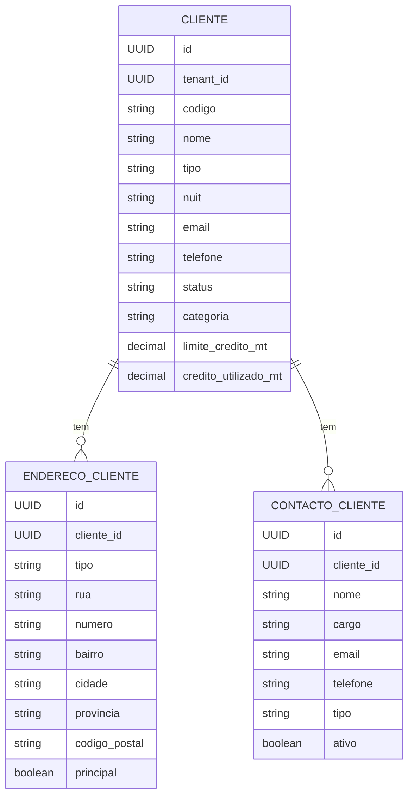

### 9.2. ERD – Financeiro (simplificado)

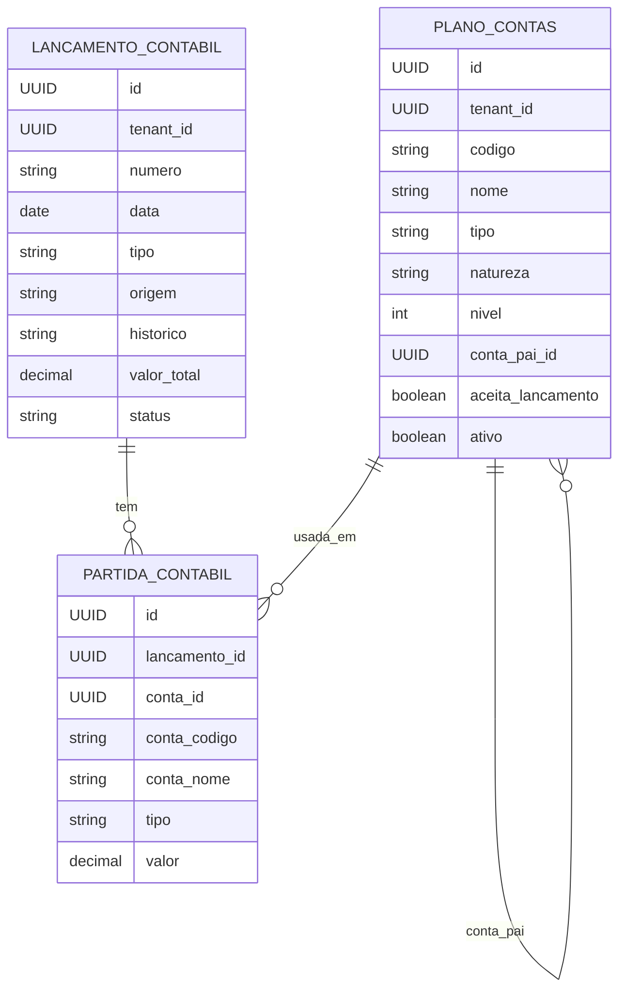

## 10. Fluxos de Negócio e Processos Financeiros (Mermaid)

### 10.1. Fluxo de Requisição de Compra

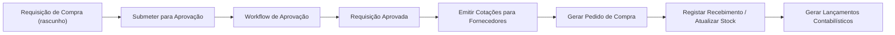

### 10.2. Fluxo de Venda POS

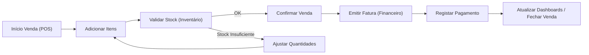

### 10.3. Fluxo de Ticket / Suporte

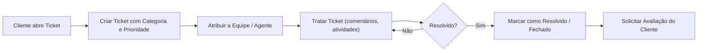

### 10.4. Anulação de Fatura via Nota de Crédito

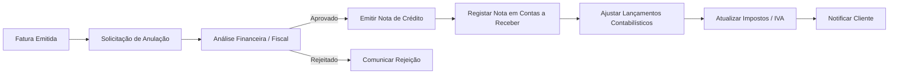

### 10.5. Nota de Débito Complementar

As **notas de débito** são usadas para ajustar faturas já emitidas, adicionando
custos (juros de mora, serviços adicionais, diferenças cambiais) sem perder o
vínculo fiscal com o documento original. No GestPro, o fluxo respeita as regras
de contabilização e de séries fiscais configuradas no módulo
`finance-accounting-module`.

**Cenários suportados**

- Ajustes pós-faturação com referência obrigatória ao documento de origem.
- Aplicação de juros por atraso em contas a receber.
- Complementos contratuais aprovados em `projects-module` ou `services-module`.

#### Processo Operacional

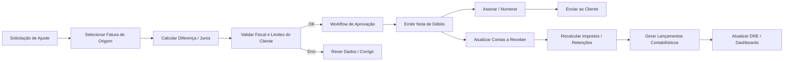

#### Fluxo de Dados e Integrações

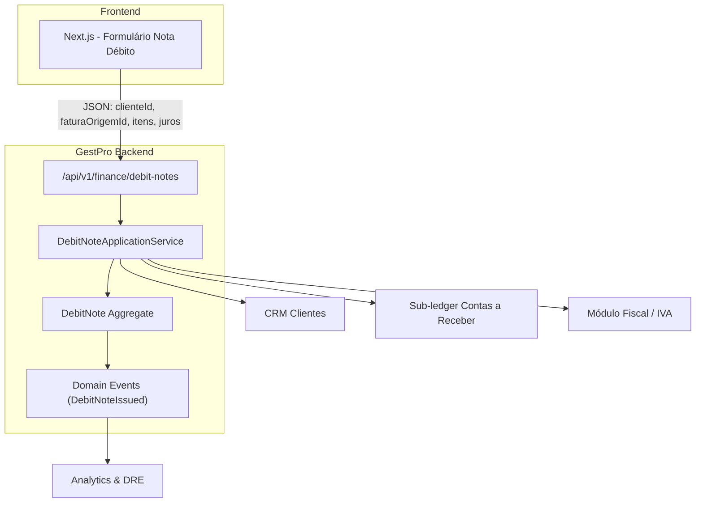

**Payload principal**

| Campo | Origem | Observações |
| --- | --- | --- |
| `invoiceId` | Seleção UI / API | Garante vínculo fiscal. |
| `reasonCode` | Catálogo `shared-kernel` | Enum padronizado (JUROS, DIF_CAMB, SERV_ADIC). |
| `debitLines[]` | Input do utilizador | Valores positivos, com impostos associados. |
| `interestPolicyId` | `finance-accounting-module` | Opcional, aplica juros automáticos. |
| `attachments[]` | Upload UI | Evidências (ordens de serviço, contratos). |

Após a emissão, o evento `DebitNoteIssued` aciona listeners que alimentam
`conta-receber`, reprocessam impostos e actualizam relatórios de faturação.

### 10.6. Fluxo Completo de Faturação

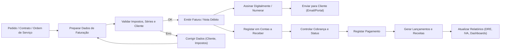

### 10.7. Fluxo Completo de Inventário

```mermaid
flowchart LR
  DEM["Necessidade / Previsão"] --> PLANEIO["Planeamento de Stock"]
  PLANEIO --> COMPRA["Requisições e Compras"]
  COMPRA --> RECEP["Recepção Física e QA"]
  RECEP --> ARMAZ["Armazenamento e Endereçamento"]
  ARMAZ --> MOV["Movimentações (Transferências / Reservas)"]
  MOV --> DISP["Disponibilidade em Tempo Real"]
  DISP --> CONS["Consumo / Saída para Produção ou Vendas"]
  CONS --> AJUST["Ajustes e Inventário Físico"]
  AJUST --> COST["Recalcular Custos e Valorações"]
  COST --> REL["Publicar KPIs (Rotação, Ruptura)"]
```

### 10.8. Fluxo Completo de Recursos Humanos

```mermaid
flowchart LR
  NEC["Necessidade de Talento"] --> VAGA["Abrir Vaga"]
  VAGA --> RECRUTA["Recrutamento e Seleção"]
  RECRUTA --> CONTRATA["Admissão e Onboarding"]
  CONTRATA --> REG["Registar Dados do Colaborador"]
  REG --> TEMPO["Gestão de Assiduidade e Férias"]
  TEMPO --> PAY["Processar Payroll"]
  PAY --> BENEF["Gerir Benefícios e Obrigações Fiscais"]
  BENEF --> AVAL["Avaliações de Desempenho"]
  AVAL --> DESENV["Planos de Formação / Upskilling"]
  DESENV --> ENC["Encerramento ou Retenção"]
  ENC --> ANAL["Analytics RH (Turnover, Headcount)"]
```

### 10.9. Fluxo Completo de Procurement

```mermaid
flowchart LR
  NECMAT["Necessidades Planeadas / Requisições"] --> WF_REQ["Workflow de Aprovação"]
  WF_REQ --> SOURCING["Sourcing e Convites de Cotação"]
  SOURCING --> ANALISE["Comparar Cotações"]
  ANALISE --> NEGOCIA["Negociação e Seleção do Fornecedor"]
  NEGOCIA --> PEDIDO["Emitir Pedido de Compra"]
  PEDIDO --> ENTREGA["Acompanhar Entregas e SLAs"]
  ENTREGA --> RECEP_INV["Receber e Validar Itens"]
  RECEP_INV --> FATURAS["Conciliar Fatura vs Pedido vs Recepção"]
  FATURAS --> PAGTO["Programar Pagamentos"]
  PAGTO --> PERFORMANCE["Avaliar Desempenho do Fornecedor"]
```

### 10.10. Fluxo Completo de Abertura de Contas Contabilísticas

```mermaid
flowchart LR
  NECPLAN["Necessidade (novo negócio / centro de custo)"] --> PLANO["Analisar Plano de Contas"]
  PLANO --> PROPOSTA["Propor Código e Estrutura"]
  PROPOSTA --> VALIDA["Validar Natureza e Regras de Lançamento"]
  VALIDA --> APROV["Aprovação por Contabilidade / Auditoria"]
  APROV --> CAD["Criar Conta no Sistema"]
  CAD --> PARAM["Configurar Regras Automáticas e Integrações"]
  PARAM --> PUB["Disponibilizar para Lançamentos e Relatórios"]
```

### 10.11. Fluxo Completo de Abertura e Fecho de Caixa

```mermaid
flowchart LR
  INI["Início do Dia"] --> ABERTURA["Registrar Abertura com Fundo Inicial"]
  ABERTURA --> VENDAS["Captar Vendas e Movimentos"]
  VENDAS --> AUDITORIA["Contagens Parciais / Auditoria"]
  AUDITORIA --> FECHO_REQ["Solicitar Fecho"]
  FECHO_REQ --> CONTA["Conferir Numerário e Meios de Pagamento"]
  CONTA --> AJUS_CAIXA["Registrar Diferenças"]
  AJUS_CAIXA --> FECHO["Fechar Caixa e Emitir Relatório"]
  FECHO --> BANCAR["Depositar / Transferir Valores"]
  BANCAR --> CONTACX["Gerar Lançamentos Contábeis"]
```

### 10.12. Fluxo Completo de Configuração de Ano Contabilístico

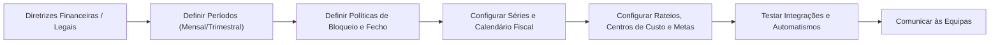

### 10.13. Fluxo de Abertura do Ano Contabilístico

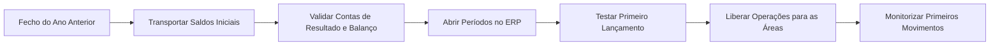

### 10.14. Fluxo de Fecho do Ano Contabilístico

```mermaid
flowchart LR
  ENC_MES["Fechos Mensais Concluídos"] --> AJUSTES["Ajustes de Encerramento (Provisões, Impostos)"]
  AJUSTES --> INVENT["Inventários Físicos e Avaliações"]
  INVENT --> CONSOL["Conciliações e Conferências Finais"]
  CONSOL --> RECLASS["Reclassificações e Reabertura se necessário"]
  RECLASS --> BALANC["Gerar Balanço e DRE anuais"]
  BALANC --> AUDI["Submeter à Auditoria / Conselho Fiscal"]
  AUDI --> BLOQ_ANO["Bloquear Ano e Armazenar Documentos"]
  BLOQ_ANO --> PRX_ANO["Preparar Abertura do Próximo Ano"]
```

### 10.15. Fluxo de Lançamentos Contabilísticos

```mermaid
flowchart LR
  DOC["Documento de Origem (Fatura, Recibo, Folha de Pagamento)"] --> REGRA["Mapeamento Plano de Contas"]
  REGRA --> PREP["Preparar Partidas Débito/Crédito"]
  PREP --> VAL["Validação Automática (saldo = 0)"]
  VAL -->|OK| POST["Persistir Lançamento"]
  VAL -->|Erro| AJUSTE["Ajustar Regras / Dados"]
  POST --> CONS["Atualizar Balancete e DRE"]
  POST --> EVENT["Publicar Evento ContabilLancado"]
  EVENT --> INT["Integrações (BI, Auditoria)"]
```

### 10.16. Fluxo de Reconciliação Bancária

```mermaid
flowchart LR
  EXT["Importar Extratos Bancários"] --> MATCH["Matching Automático (Regra por Referência/Valor)"]
  MATCH -->|Encontrado| CONC["Conciliar e Gerar Registos"]
  MATCH -->|Pendentes| ANALISE["Análise Manual"]
  ANALISE --> AJU["Criar Ajustes / Lançamentos"]
  CONC --> APROV["Aprovação do Gestor Financeiro"]
  APROV --> FECHO["Fechar Período de Reconciliação"]
  FECHO --> DASH["Atualizar Cash-Flow e Relatórios"]
```

### 10.17. Fluxo de Demonstração dos Resultados (DRE)

```mermaid
flowchart LR
  LANC["Lançamentos Contabilísticos" ] --> CLASS["Classificar em Rubricas (Receita, COGS, Opex)"]
  CLASS --> RATEIO["Aplicar Rateios / Centros de Custo"]
  RATEIO --> AGREG["Consolidar por Período"]
  AGREG --> DRE["Gerar DRE"]
  DRE --> ANALISE["Análises e KPI (Margem Bruta, EBITDA)"]
  ANALISE --> SHARE["Publicar Dashboard / PDF"]
```

### 10.18. Fluxos do Módulo de Produção

#### 10.18.1. Planeamento e Ordem de Produção

```mermaid
flowchart LR
  DEM["Demanda (Pedidos / Forecast)"] --> PLANO["Plano Mestre de Produção"]
  PLANO --> CAP["Verificar Capacidade e Materiais"]
  CAP --> OP["Gerar Ordem de Produção"]
  OP --> APROV_OP["Aprovação (Planeamento)"]
  APROV_OP --> LIB["Libertar Ordem para Chão de Fábrica"]
```

#### 10.18.2. Execução e Consumo de Materiais

```mermaid
flowchart LR
  LIB["Ordem Libertada"] --> REQMAT["Requisição de Materiais (BOM)"]
  REQMAT --> PICK["Separação / Picking no Armazém"]
  PICK --> PROD["Registar Consumo e Progresso"]
  PROD --> QTD["Apontamento Quantitativo e Tempo"]
  QTD --> RES["Atualizar Stock e Custos de Produção"]
```

#### 10.18.3. Qualidade, Encerramento e Expedição

```mermaid
flowchart LR
  PROD["Produção Concluída"] --> QUALI["Inspeção de Qualidade"]
  QUALI -->|Aprovado| ENC["Encerrar Ordem"]
  QUALI -->|Rejeitado| RETRAB["Abrir Não Conformidade / Retrabalho"]
  ENC --> ARMAZ["Mover para Stock de Produto Acabado"]
  ARMAZ --> EXP["Disponível para Expedição / Venda"]
  ENC --> CUSTO["Gerar Custo Padrão / Real"]
  CUSTO --> FIN["Enviar Custos para Contabilidade"]
```

### 10.19. Fecho Contabilístico Mensal

```mermaid
flowchart LR
  PREP["Encerrar Operações do Mês"] --> PROV["Conferir Provisões e Ajustes"]
  PROV --> DEP["Processar Depreciações e Rateios"]
  DEP --> REV["Revisão por Controladoria"]
  REV --> BLOQ["Bloquear Período"]
  BLOQ --> REL["Publicar Relatórios Oficiais"]
```

## 11. Diagramas de Sequência (Exemplos)

### 11.1. Criação de Cliente

```mermaid
sequenceDiagram
  participant FE as Frontend (Next.js)
  participant API as ClienteController
  participant APP as ClienteApplicationService
  participant DOM as ClienteDomain
  participant REPO as ClienteRepository

  FE->>API: POST /api/v1/clientes (ClienteDTO)
  API->>APP: criarCliente(ClienteCommand)
  APP->>DOM: Cliente.create(...)
  DOM-->>APP: ClienteAggregate
  APP->>REPO: save(ClienteAggregate)
  REPO-->>APP: ClienteAggregate
  APP-->>API: ClienteDTO
  API-->>FE: 201 Created + ClienteDTO
```

### 11.2. Requisição de Compra → Aprovação → Pedido de Compra

```mermaid
sequenceDiagram
  participant User as Solicitante
  participant API as RequisicaoController
  participant APP as RequisicaoService
  participant WF as WorkflowService
  participant PC as PedidoCompraService

  User->>API: POST /requisicoes (rascunho)
  API->>APP: criarRequisicao(...)
  APP-->>API: RequisicaoDTO(rascunho)

  User->>API: POST /requisicoes/{id}/submeter
  API->>APP: submeterRequisicao(id)
  APP->>WF: iniciarWorkflowAprovacao(requisicao)
  WF-->>APP: estado=em_aprovacao

  WF-->>APP: evento RequisicaoAprovadaEvent
  APP->>PC: gerarPedidoCompra(requisicaoAprovada)
  PC-->>APP: PedidoCompraDTO
```

## 12. Convenções de Mapeamento TS → Java

- id: string → UUID id
- tenantId: string → UUID tenantId ou VO TenantId
- Datas string → LocalDate, LocalDateTime ou OffsetDateTime
- Enums TS ('ativo' | 'inativo') → enum Status { ATIVO, INATIVO }
- Campos monetários → BigDecimal

## 13. Roadmap de Implementação

- **Fase 1 – Fundamentos**
  - shared-kernel, core-tenancy-module, crm-clientes-module
  - Substituir cliente-storage.ts pelo backend real
- **Fase 2 – Fornecedores, Inventário e Vendas**
  - fornecedores-procurement-module, inventory-assets-module, sales-pos-module
- **Fase 3 – Finanças & Contabilidade**
  - finance-accounting-module
- **Fase 4 – RH & Projectos**
  - hr-module, projects-module
- **Fase 5 – Serviços, Tickets & Transporte**
  - services-module, support-tickets-module, transport-logistics-module
- **Fase 6 – Analytics & Microserviços**
  - analytics-module, externalizar eventos via Kafka e fatiar módulos críticos.

## 14. Checklist Rápido

- Parent POM com Spring Boot 3.3 e Spring Modulith configurados
- shared-kernel com VO de NUIT, BI, Money, TenantId, etc.
- core-tenancy-module (Tenant, Usuario, ConfiguracoesFiscais)
- Módulo de Clientes funcionando e ligado ao Next.js
- Multitenancy com TenantContextHolder + filtro/inteceptor global
- Testcontainers para PostgreSQL e @ApplicationModuleTest em módulos críticos
- OpenAPI/Swagger exposto e consumido pelo frontend
- Métricas, Health e Logs estruturados ativos (Actuator + OTEL)
