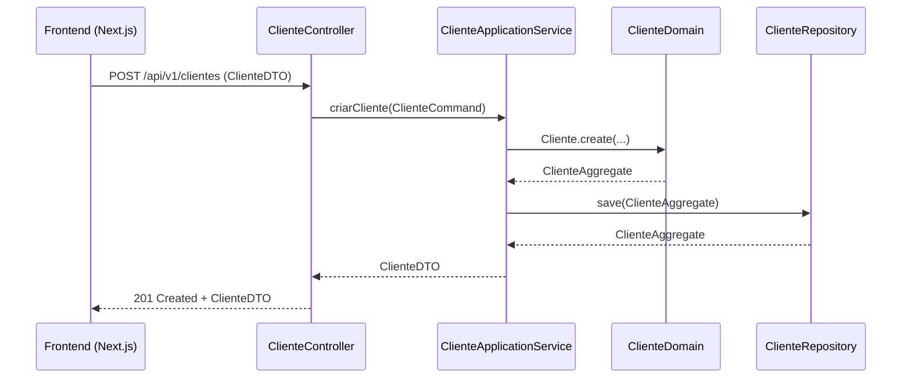
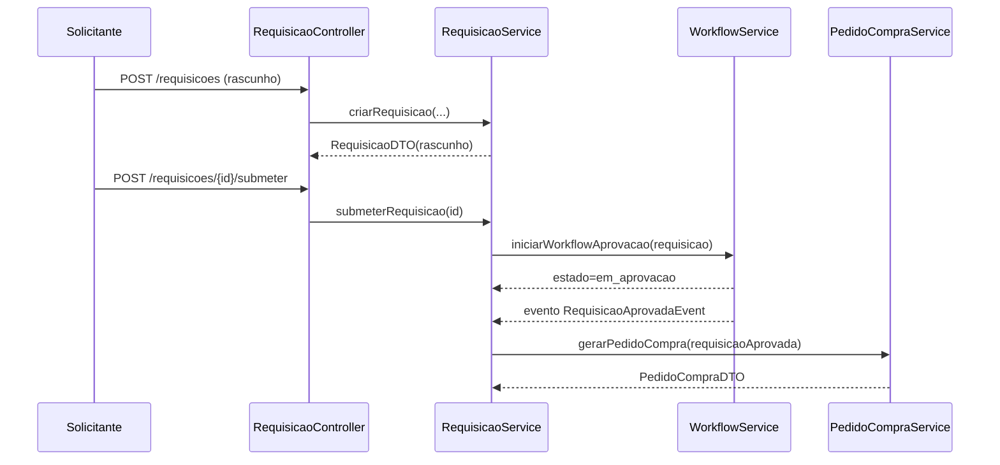

# GestPro ERP – Backend Modular (Spring Modulith + DDD + Hexagonal)

## 1. Visão Geral

O GestPro ERP é um backend corporativo modular construído em **Spring Boot 3.3 + Spring Modulith**, seguindo:

- Arquitectura **Hexagonal (Ports & Adapters)**  
- **Domain-Driven Design (DDD)** com Bounded Contexts explícitos  
- **Java 21**, **Maven**, **Lombok** e **MapStruct**  
- Modelo **multi-tenant** com `tenantId` em todas as entidades  
- API REST alinhada com os **modelos TypeScript** já usados no frontend (Next.js)

O objetivo é substituir os dados mock/local dos ficheiros de storage do frontend:

- `cliente-storage.ts`, `fornecedor-storage.ts`, `ticket-storage.ts`,  
  `servico-storage.ts`, `rh-storage.ts`, `projeto-storage.ts`,  
  `provincias-mocambique.ts`, `format-currency.ts`,  
  `validacao-bi.ts`, `validacao-nuit.ts`, etc.

por uma **API real, versionada e estável** (`/api/v1/...`).

---

## 2. Stack Tecnológica

| Camada | Tecnologia / Versão | Observações |
| --- | --- | --- |
| Runtime | Java 21 (LTS) | Records, pattern matching, switch melhorado. |
| Framework | Spring Boot 3.3 + Spring Modulith | Monólito modular com fronteiras de módulos. |
| Build | Maven 3.9.x | Multi-module, organizado por Bounded Contexts. |
| Persistência | Spring Data JPA + PostgreSQL 16 | Schemas por módulo (futuro), transacções por agregado. |
| Mapeamento | MapStruct + Lombok | DTOs/records ↔ Entities, menos boilerplate. |
| Eventos internos | Spring Modulith Events | Eventos de domínio e integração entre módulos. |
| Segurança | OAuth2 Resource Server + Keycloak | JWT, roles e tenants. |
| Observabilidade | Actuator, Micrometer, OpenTelemetry | Health, métricas, tracing. |
| Testes | JUnit 5, Testcontainers, Spring Modulith Test | Testes isolados por módulo e contratuais. |

---

## 3. Arquitectura – Diagramas C4

### 3.1. C4 – Nível 1 (Contexto)


### 3.2. C4 – Nível 2 (Containers)


### 3.3. C4 – Nível 3 (Componentes – Exemplo: CRM Clientes)


## 4. Arquitectura Hexagonal por Módulo


## 5. Estrutura de Projecto (Maven + Spring Modulith)

```
backend/
├─ pom.xml                          # POM agregador (parent)
├─ modules/
│  ├─ shared-kernel/
│  ├─ core-tenancy-module/
│  ├─ crm-clientes-module/
│  ├─ fornecedores-procurement-module/
│  ├─ inventory-assets-module/
│  ├─ finance-accounting-module/
│  ├─ sales-pos-module/
│  ├─ projects-module/
│  ├─ hr-module/
│  ├─ services-module/
│  ├─ support-tickets-module/
│  ├─ transport-logistics-module/
│  └─ analytics-module/
└─ platform/
   ├─ application-bootstrap/
   └─ integration-tests/
```

Cada módulo Java segue:

```
modules/<bounded-context>-module/src/main/java/com/gestpro/<context>/
  ├─ api/           # REST Controllers + DTOs
  ├─ application/   # Use Cases (Services) + Ports
  ├─ domain/        # Aggregates, Entities, VOs, Domain Services, Domain Events
  └─ infrastructure/# JPA Entities, Spring Data Repositories, HTTP Clients, etc.
```

## 6. Bounded Contexts & Mapeamento dos Modelos TypeScript

### 6.1. Tenancy & Shared Kernel

TS: Tenant, ConfiguracoesFiscais, SerieDocumento, Usuario,
provincias-mocambique.ts, validacao-bi.ts, validacao-nuit.ts, format-currency.ts.

Módulos: core-tenancy-module, shared-kernel

- Tenant (AggregateRoot)
- TenantFiscalConfig (VO ou entidade interna)
- Usuario (AggregateRoot) com enum UserRole
- VOs para NUIT, BI, Email, Money, TenantId
- Validação de BI/NUIT replicada dos TS para Domain Services/VOs

### 6.2. CRM – Clientes

TS principais:

Cliente, EnderecoCliente, ContactoCliente,
HistoricoTransacao, SegmentacaoCliente,
RelatorioCliente, DashboardClientes, etc.

Módulo: crm-clientes-module
Aggregates: Cliente, HistoricoTransacao, SegmentacaoCliente

### 6.3. Fornecedores & Procurement

TS principais:

Fornecedor, EnderecoFornecedor, ContactoFornecedor, DocumentoFornecedor,

ProdutoFornecedor, OrcamentoFornecedor, PedidoFornecedor, PagamentoFornecedor,

RequisicaoCompra, Cotacao, PedidoCompra, RecebimentoCompra,

ConfiguracaoWorkflow, NivelAprovacao, AprovacaoWorkflow, etc.

Módulo: fornecedores-procurement-module
Aggregates: Fornecedor, RequisicaoCompra, Cotacao, PedidoCompra, WorkflowAprovacao

### 6.4. Inventário & Ativos

TS: Produto, VarianteProduto, Categoria, MovimentacaoStock,
Localizacao, CategoriaAtivo, Ativo, MovimentacaoAtivo,
ManutencaoAtivo, InventarioFisico, ItemInventario,
AmortizacaoCalculo, ResumoInventario, LogInventario.

Módulo: inventory-assets-module

### 6.5. Finanças & Contabilidade

TS: PlanoContas, LancamentoContabil, PartidaContabil,
CentroCusto, ContaBancaria, ReconciliacaoBancaria,
DRE, Balancete, ConfiguracaoContabil, etc.

Módulo: finance-accounting-module

### 6.6. Vendas & POS

TS: Pedido, ItemPedido, ValidacaoStock, ComissaoVendedor,
Venda, ItemVenda, MetodoPagamento.

Módulo: sales-pos-module

### 6.7. Projectos & Trabalho

TS: Projeto, Tarefa, Milestone, Equipe, MembroEquipe,
RegistroTempo, OrcamentoProjeto, DocumentoProjeto, RelatorioProjeto.

Módulo: projects-module

### 6.8. Recursos Humanos (RH)

TS: Colaborador, FormacaoAcademica, ExperienciaProfissional,
DocumentoColaborador, Payroll, Ferias, SolicitacaoFerias,
Ausencia, RegistroAssiduidade, Avaliacao, Formacao, Beneficio,
VagaEmprego, Candidatura, DashboardRH.

Módulo: hr-module

### 6.9. Serviços & Agendamentos

TS: Servico, CategoriaServico, ServicoVenda,
AgendamentoServico, TecnicoServico, AvaliacaoServico,
RelatorioServico, PacoteServico, ContratoServico, DashboardServicos.

Módulo: services-module

### 6.10. Support & Tickets

TS: Ticket, CategoriaTicket, EquipeSuporte, BaseConhecimento,
RelatorioTickets, ConfiguracaoTickets.

Módulo: support-tickets-module

### 6.11. Transporte & Logística

TS: Veiculo, Motorista, Rota, PontoEntrega,
Entrega, ItemEntrega, Manutencao, Abastecimento, RelatorioTransporte.

Módulo: transport-logistics-module

### 6.12. Analytics

TS: Todos os Dashboard* e Relatorio*.

Módulo: analytics-module – projections/event consumers.

## 7. Multi-tenancy & Segurança

- Todas as entidades de negócio possuem tenantId.
- Filtro global por tenantId em repositórios (via @EntityListeners, @Where, ou Specification).
- TenantContextHolder preenchido por um interceptor/filtro que lê:
  - Header X-Tenant-ID, e/ou
  - claim tenant_id do JWT.
- Roles mapeadas de Usuario.funcao:
  - TENANT_ADMIN, MANAGER, CASHIER, VIEWER, etc.

## 8. Convenções de API

Prefixo global: /api/v1

Exemplos:

- /api/v1/clientes
- /api/v1/fornecedores
- /api/v1/financeiro/lancamentos
- /api/v1/rh/colaboradores
- /api/v1/servicos/agendamentos
- /api/v1/tickets
- /api/v1/transporte/rotas

Paginação:

`?page=0&size=20&sort=nome,asc`

Resposta com PageResponse<T> (content + pageable + total).

## 9. Diagramas ERD (Mermaid – Exemplo)

### 9.1. ERD – CRM Clientes (simplificado)


### 9.2. ERD – Financeiro (simplificado)


## 10. Fluxos de Negócio (Mermaid)

### 10.1. Fluxo de Requisição de Compra


### 10.2. Fluxo de Venda POS


### 10.3. Fluxo de Ticket / Suporte


## 11. Diagramas de Sequência (Exemplos)

### 11.1. Criação de Cliente



### 11.2. Requisição de Compra → Aprovação → Pedido de Compra



## 12. Convenções de Mapeamento TS → Java

- id: string → UUID id
- tenantId: string → UUID tenantId ou VO TenantId
- Datas string → LocalDate, LocalDateTime ou OffsetDateTime
- Enums TS ('ativo' | 'inativo') → enum Status { ATIVO, INATIVO }
- Campos monetários → BigDecimal

## 13. Roadmap de Implementação

- **Fase 1 – Fundamentos**
  - shared-kernel, core-tenancy-module, crm-clientes-module
  - Substituir cliente-storage.ts pelo backend real
- **Fase 2 – Fornecedores, Inventário e Vendas**
  - fornecedores-procurement-module, inventory-assets-module, sales-pos-module
- **Fase 3 – Finanças & Contabilidade**
  - finance-accounting-module
- **Fase 4 – RH & Projectos**
  - hr-module, projects-module
- **Fase 5 – Serviços, Tickets & Transporte**
  - services-module, support-tickets-module, transport-logistics-module
- **Fase 6 – Analytics & Microserviços**
  - analytics-module, externalizar eventos via Kafka e fatiar módulos críticos.

## 14. Checklist Rápido

- Parent POM com Spring Boot 3.3 e Spring Modulith configurados
- shared-kernel com VO de NUIT, BI, Money, TenantId, etc.
- core-tenancy-module (Tenant, Usuario, ConfiguracoesFiscais)
- Módulo de Clientes funcionando e ligado ao Next.js
- Multitenancy com TenantContextHolder + filtro/inteceptor global
- Testcontainers para PostgreSQL e @ApplicationModuleTest em módulos críticos
- OpenAPI/Swagger exposto e consumido pelo frontend
- Métricas, Health e Logs estruturados ativos (Actuator + OTEL)
