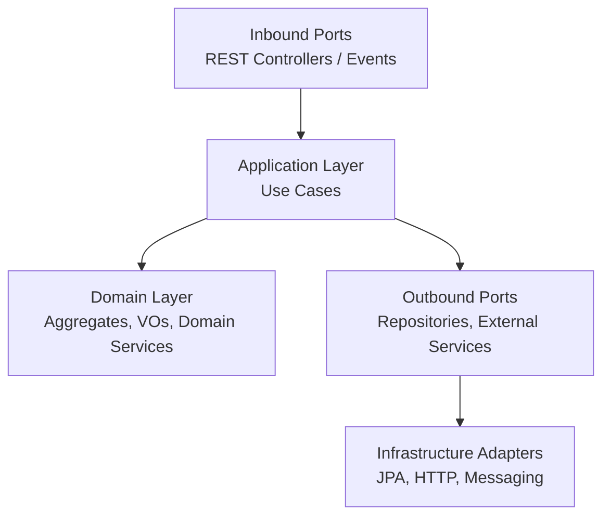
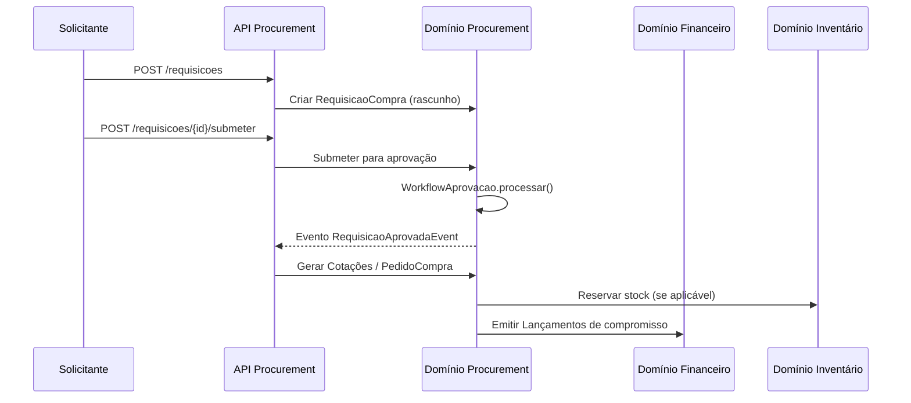

# Documentação Técnica do Backend Spring Modulith do GestPro ERP

## 1. Objectivo
Esta documentação define, de forma exaustiva, como implementar o backend corporativo do GestPro ERP em **Spring Boot 3.3** com **Spring Modulith**, seguindo uma **Arquitectura Hexagonal** e princípios de **Domain-Driven Design (DDD)**. Os objectivos centrais são:

- Substituir integralmente os dados mock/local usados pelo frontend Next.js (`cliente-storage.ts`, `fornecedor-storage.ts`, `ticket-storage.ts`, etc.) por uma API REST real, versionada (`/api/v1/...`) e com contratos estáveis.
- Estruturar o monólito modular em **Bounded Contexts DDD** bem definidos (clientes, fornecedores, procurement, contabilidade, RH, serviços, transporte, etc.), para permitir uma futura migração selectiva para microserviços.
- Garantir uma base tecnológica standard com testes automatizados, observabilidade (metrics, logs, tracing) e documentação viva (OpenAPI/Swagger), mantendo a consistência com os modelos TypeScript existentes no frontend.

---

## 2. Stack Tecnológica Principal
| Camada | Tecnologia / Versão | Observações |
| --- | --- | --- |
| Runtime | Java 21 (LTS) | Records, pattern matching, switch melhorado e suporte futuro a virtual threads. |
| Framework | Spring Boot 3.3 + Spring Modulith | Monólito modular com fronteiras explícitas e verificação de dependências. |
| Build | Maven 3.9.x | Projecto multi-módulo alinhado com os Bounded Contexts. |
| ORM / Persistência | Spring Data JPA + PostgreSQL 16 | Cada módulo define os seus agregados e repositórios; possibilidade de schemas por módulo. |
| Mapeamento | MapStruct + Lombok | Lombok reduz boilerplate; MapStruct gera mapeamentos entre Entities e DTOs/records. |
| Mensageria interna | Spring Modulith Events / Application Events | Eventos de domínio intra/inter-módulo; possibilidade futura de externalizar para Kafka. |
| Observabilidade | Micrometer, OpenTelemetry, Spring Boot Actuator | Métricas, tracing e health checks modulados por contexto. |
| Segurança | OAuth2 Resource Server (JWT) + Keycloak | Multi-tenant + roles por módulo (TENANT_ADMIN, MANAGER, etc.). |
| Testes | JUnit 5, Testcontainers, Spring Modulith Test | Testes unitários, integrados e @ApplicationModuleTest para isolamento modular. |

---

## 3. Visão Arquitectural (C4)
### 3.1. Diagrama de Contexto (C4 – Level 1)
```mermaid
graph LR
  User[Utilizador GestPro<br/>Operacionais / Gestores / Admin] --> UI[GestPro UI (Next.js)]
  UI -->|HTTPS / REST JSON| API[(GestPro Backend<br/>Spring Modulith)]
  API --> DB[(Cluster PostgreSQL 16)]
  API --> IDP[(Keycloak / Identity Provider)]
  API --> EXT[Serviços Externos<br/>Pagamentos / Autoridade Fiscal / Correios]
```

### 3.2. Diagrama de Containers (C4 – Level 2)
```mermaid
graph LR
  subgraph Frontend
    Next[Next.js 15 App<br/>+ TypeScript Models + Storages]
  end

  subgraph Backend[GestPro Backend - Spring Modulith]
    API[(REST API Layer)]
    DOM[Domain Modules<br/>(Clientes, Fornecedores, RH, etc.)]
    INFRA[Infra / Adapters<br/>JPA, HTTP Clients, Messaging]
  end

  DB[(PostgreSQL)]
  IDP[(Keycloak)]
  MQ[(Kafka / RabbitMQ - futuro)]

  Next -->|JSON/HTTPS| API
  API --> DOM
  DOM --> INFRA
  INFRA --> DB
  INFRA --> IDP
  DOM --> MQ
```

### 3.3. Arquitectura Hexagonal por Módulo


---

## 4. Estrutura de Projecto (Maven + Spring Modulith)
```text
backend/
├─ pom.xml                          # POM agregador (parent)
├─ modules/
│  ├─ shared-kernel/                # Tipos globais, eventos base, utilitários, validações
│  ├─ core-tenancy-module/          # Tenant, Usuario, Configurações fiscais, multi-tenant
│  ├─ crm-clientes-module/          # Clientes & CRM
│  ├─ fornecedores-procurement-module/
│  ├─ inventory-assets-module/
│  ├─ finance-accounting-module/
│  ├─ sales-pos-module/
│  ├─ projects-module/
│  ├─ hr-module/
│  ├─ services-module/
│  ├─ support-tickets-module/
│  ├─ transport-logistics-module/
│  └─ analytics-module/
└─ platform/
   ├─ application-bootstrap/        # Config global, segurança, Actuator, Modulith config
   └─ integration-tests/            # Testes ponta-a-ponta com vários módulos reais
```

Cada módulo Java segue a convenção:
```
modules/crm-clientes-module/src/main/java/com/gestpro/crm/
  ├─ api/               # REST Controllers, DTOs, mappers externos
  ├─ application/       # Casos de uso (services) + ports
  ├─ domain/            # Aggregates, VOs, Domain Services, Domain Events
  └─ infrastructure/    # JPA entities, repositories, adapters externos
```

---

## 5. Bounded Contexts & Mapeamento dos Modelos TypeScript
Os modelos TypeScript existentes orientam a divisão do domínio. O quadro seguinte sintetiza as responsabilidades:

| Bounded Context | Principais Tipos TypeScript | Módulo Spring Modulith | Responsabilidades |
| --- | --- | --- | --- |
| Core Tenancy & Shared Kernel | `Tenant`, `Usuario`, `ConfiguracoesFiscais`, utilitários (`provincias-mocambique.ts`, `validacao-bi.ts`, `format-currency.ts`) | `core-tenancy-module`, `shared-kernel` | Gestão do tenantId, validações de BI/NUIT, configurações fiscais e séries documentais por tenant. |
| CRM – Clientes | `Cliente`, `EnderecoCliente`, `ContactoCliente`, `HistoricoTransacao`, dashboards e relatórios | `crm-clientes-module` | Gestão do agregado Cliente, histórico de transações, segmentações e dashboards específicos. |
| Fornecedores & Procurement | `Fornecedor`, `RequisicaoCompra`, `Cotacao`, `PedidoCompra`, `WorkflowAprovacao`, relatórios | `fornecedores-procurement-module` | Gestão de fornecedores, processos de compra e workflows de aprovação. |
| Inventário & Ativos | `Produto`, `VarianteProduto`, `MovimentacaoStock`, `Ativo`, `InventarioFisico`, `ManutencaoAtivo` | `inventory-assets-module` | Catálogo de produtos, movimentos de stock, activos fixos e inventários físicos. |
| Finanças & Contabilidade | `PlanoContas`, `LancamentoContabil`, `ReconciliacaoBancaria`, `ContaBancaria`, DRE, Balancete | `finance-accounting-module` | Plano de contas, lançamentos, integrações automáticas com vendas e procurement. |
| Vendas & POS | `Pedido`, `ItemPedido`, `Venda`, `ComissaoVendedor`, `ValidacaoStock`, métodos de pagamento | `sales-pos-module` | Fluxos POS, vendas, cálculo de comissões e políticas de validação de stock. |
| Projectos | `Projeto`, `Tarefa`, `RegistroTempo`, `OrcamentoProjeto`, `DocumentoProjeto`, relatórios | `projects-module` | Gestão de projectos, equipas, orçamentos e milestones. |
| Recursos Humanos & Payroll | `Colaborador`, `Ferias`, `Payroll`, `Avaliacao`, `Formacao`, `VagaEmprego`, dashboards RH | `hr-module` | Gestão do ciclo de vida do colaborador, ausências, formação e recrutamento. |
| Serviços & Agendamentos | `Servico`, `AgendamentoServico`, `ContratoServico`, `PacoteServico`, `DashboardServicos` | `services-module` | Serviços, agendamentos, pacotes e relatórios de desempenho. |
| Suporte & Tickets | `Ticket`, `AnexoTicket`, `EquipeSuporte`, `BaseConhecimento`, `DashboardTickets` | `support-tickets-module` | Helpdesk, SLA, avaliações e configurações de tickets. |
| Transporte & Logística | `Veiculo`, `Rota`, `Entrega`, `Abastecimento`, `Manutencao`, relatórios | `transport-logistics-module` | Frota, rotas, entregas e manutenção de veículos. |
| Analytics | Todos os `Dashboard*`, `Relatorio*` | `analytics-module` | Consumo de eventos de todos os módulos e projecção de dashboards/relatórios. |

### Exemplo detalhado – Procurement
```mermaid
flowchart LR
  RC[RequisicaoCompra (rascunho)] -->|submeter| RC_P[RequisicaoCompra (pendente)]
  RC_P --> WF[Workflow de Aprovação]
  WF -->|aprovado| RC_A[RequisicaoCompra (aprovada)]
  RC_A --> COT[Emitir Cotações]
  COT --> PC[Gerar Pedido de Compra]
  PC --> REC[Recebimento + Stock]
  REC --> LC[Lançamentos Contabilísticos]
```

---

## 6. Contratos de API, Versionamento e Naming
### 6.1. Convenção de Paths
- Prefixo global: `/api/v1`.
- Segmentos por módulo: `/clientes`, `/fornecedores`, `/financeiro`, `/rh`, `/servicos`, `/tickets`, `/transporte`, etc.
- Exemplos:
  - `GET /api/v1/clientes`
  - `POST /api/v1/fornecedores/{id}/pedidos`
  - `GET /api/v1/financeiro/lancamentos`
  - `GET /api/v1/rh/colaboradores`

### 6.2. JSON & Tipos
- DTOs em `camelCase`, alinhados com os interfaces TypeScript.
- Datas: ISO 8601 string no frontend; `OffsetDateTime`, `LocalDateTime` ou `LocalDate` no backend.
- Números monetários: `BigDecimal` com escala definida no backend; `number` no frontend (formatação continua a ser feita em UI).

### 6.3. Versionamento
- Novas versões: novo prefixo (`/api/v2`).
- Deprecações comunicadas via cabeçalhos HTTP (`Deprecation`, `Sunset`) e documentação OpenAPI.

---

## 7. Convenções de Mapeamento TypeScript → Java
### 7.1. Regras gerais
- `id: string` → `UUID` (ou `TenantId` VO).
- `tenantId` presente em todos os modelos → campo obrigatório em todas as entidades de negócio; reforçado pelo `TenantContextHolder`.
- Enums TS (string unions) → `enum` Java.

```typescript
// Frontend
export interface Cliente {
  id: string;
  tenantId: string;
  codigo: string;
  nome: string;
  tipo: 'fisica' | 'juridica' | 'revendedor';
}
```

```java
// Backend
public enum TipoCliente { FISICA, JURIDICA, REVENDEDOR }

@Entity
@Table(name = "clientes")
public class ClienteEntity {
    @Id
    private UUID id;

    @Column(name = "tenant_id", nullable = false)
    private UUID tenantId;

    @Column(nullable = false, unique = true)
    private String codigo;

    @Column(nullable = false)
    private String nome;

    @Enumerated(EnumType.STRING)
    private TipoCliente tipo;
}
```

### 7.2. Datas
- `dataCriacao: string` → `OffsetDateTime`.
- `dataNascimento: string` → `LocalDate`.

### 7.3. Relações
- Arrays TS (`enderecos: EnderecoCliente[]`) → `@OneToMany` ou colecções imutáveis de Value Objects, conforme o caso.

---

## 8. Multi-tenant & Segurança
### 8.1. Modelo de Tenancy
- Campo obrigatório `tenantId` em todas as entidades (persistência e DTOs).
- Resolução do tenant via header `X-Tenant-ID`, claim `tenant_id` no JWT ou subdomínio.
- `TenantContextHolder` inicializado em `OncePerRequestFilter` / interceptor, com limpeza no final do request.
- Repositórios JPA incluem automaticamente `tenantId = :tenantId`; serviços não aceitam tenantId “livre”, apenas obtido do contexto.

### 8.2. Segurança & Roles
- Roles derivadas de `Usuario.funcao` (`TENANT_ADMIN`, `MANAGER`, `CASHIER`, `VIEWER`).
- Spring Security configurado como OAuth2 Resource Server a validar JWTs emitidos pelo Keycloak.
- Anotações `@PreAuthorize("hasRole('TENANT_ADMIN')")` aplicadas aos casos de uso sensíveis.

---

## 9. Observabilidade, Logs e Operações
- **Métricas** específicas por módulo (`gestpro_clientes_total`, `gestpro_vendas_total`, etc.).
- **Actuator** exposto via `/actuator/health`, `/actuator/prometheus`, `/actuator/loggers` com grupos por módulo.
- **Tracing** com OpenTelemetry (exportadores OTLP). Eventos modulith também podem gerar spans específicos.
- **Logs multi-tenant** com `tenantId`, `usuarioId` e `correlationId` injectados via MDC.

---

## 10. Fluxos de Negócio
### 10.1. Fluxo de Requisição de Compra


### 10.2. Fluxo de Venda & Faturação
```mermaid
flowchart LR
  A[Iniciar Venda (POS)] --> B[Adicionar Itens]
  B --> C[Validar Stock (Inventory)]
  C -->|OK| D[Confirmar Venda]
  D --> E[Gerar Fatura (Finance)]
  E --> F[Registar Pagamentos]
  F --> G[Atualizar Dashboards (Analytics)]
```

---

## 11. Roadmap de Implementação por Fases
1. **Fase 1 – Fundamentos & Núcleo Comercial**
   - `shared-kernel`, `core-tenancy-module`, `crm-clientes-module`.
   - `inventory-assets-module` (Produtos) e `fornecedores-procurement-module` (Fornecedor básico).
   - `sales-pos-module` (venda POS simples).
   - Substituição dos storages `cliente-storage.ts`, `fornecedor-storage.ts`, `servico-storage.ts`.
2. **Fase 2 – Contabilidade & Finanças**
   - `finance-accounting-module` (Plano de Contas, Lançamentos, Centro de Custo).
   - Integração automática com Procurement e Vendas.
3. **Fase 3 – RH & Projectos**
   - `hr-module`, `projects-module`.
   - Substituição de `rh-storage.ts`, `projeto-storage.ts`.
4. **Fase 4 – Serviços, Tickets & Transporte**
   - `services-module`, `support-tickets-module`, `transport-logistics-module`.
   - Substituição de `ticket-storage.ts`, `servico-storage.ts` remanescente.
5. **Fase 5 – Analytics & Migração para Microserviços**
   - Activar `analytics-module` como consumer de eventos (Spring Modulith events ➜ Kafka/RabbitMQ).
   - Preparar fatiamento seletivo (ex.: `support-tickets-module` como serviço autónomo).

---

## 12. Checklist de Implementação
- [ ] Criar parent POM com Spring Boot 3.3 e Spring Modulith.
- [ ] Configurar `shared-kernel` com `BaseEntity`, `AuditableEntity`, Value Objects (`TenantId`, `Money`, `Email`).
- [ ] Migrar validações (`validacao-bi.ts`, `validacao-nuit.ts`) e tabelas de referência (`provincias-mocambique.ts`).
- [ ] Implementar `core-tenancy-module` (Tenant, Usuario, ConfiguracoesFiscais, séries documentais).
- [ ] Implementar `crm-clientes-module` e substituir `cliente-storage.ts`.
- [ ] Implementar `fornecedores-procurement-module` e substituir `fornecedor-storage.ts` básico.
- [ ] Implementar `inventory-assets-module` (Produto, Categoria, MovimentacaoStock).
- [ ] Implementar `sales-pos-module` (Venda simples) e remover storages equivalentes.
- [ ] Configurar OpenAPI/Springdoc agrupado por módulo.
- [ ] Configurar Testcontainers (PostgreSQL) e `@ApplicationModuleTest` para módulos piloto.
- [ ] Activar observabilidade (Actuator, Micrometer, OTEL) com labels por tenant/módulo.
- [ ] Refatorar o frontend para consumir `/api/v1/...` em vez de storages locais.
