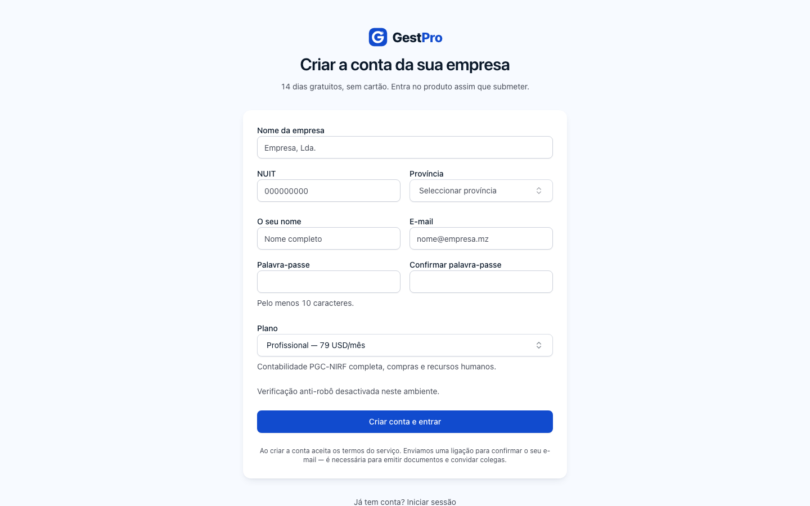
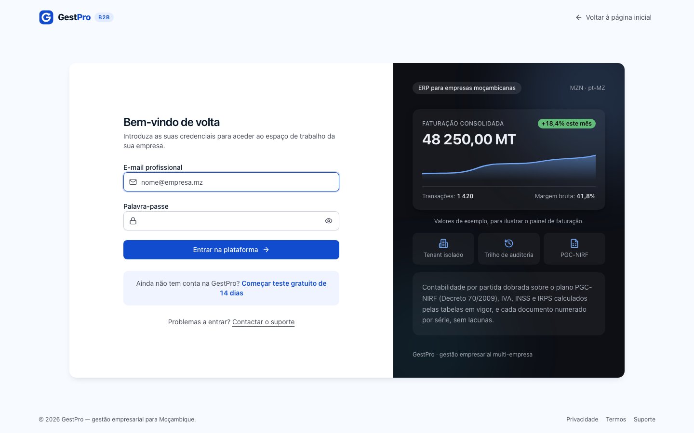
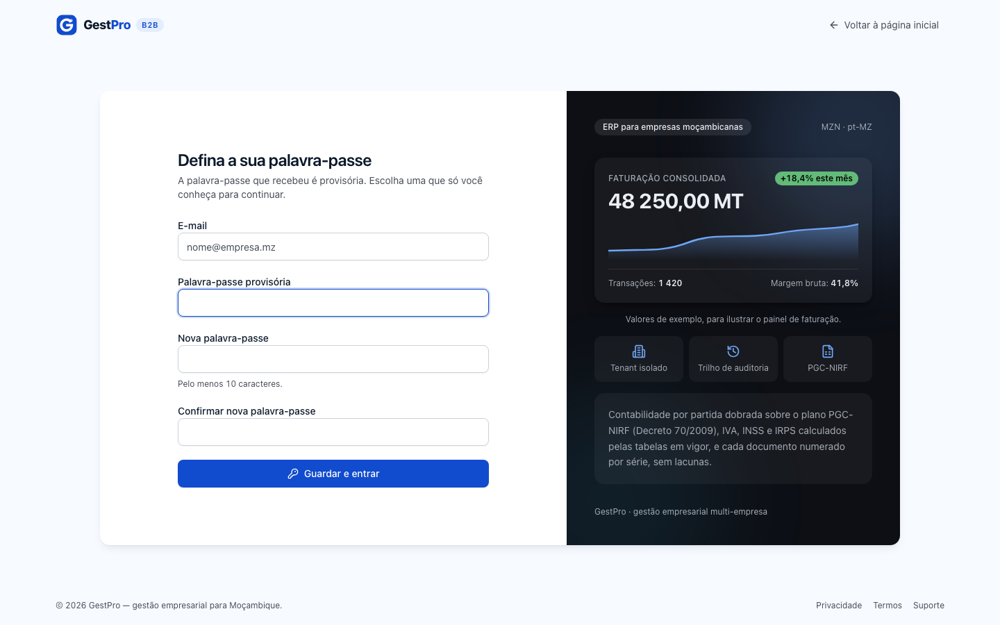
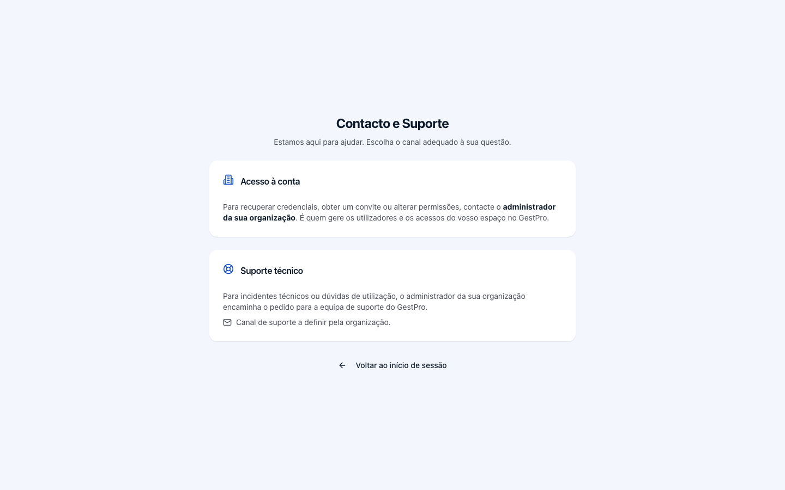
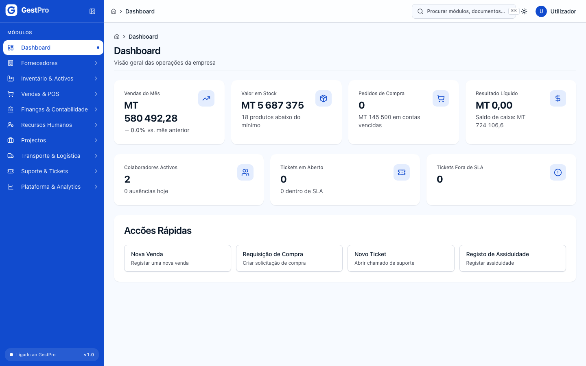
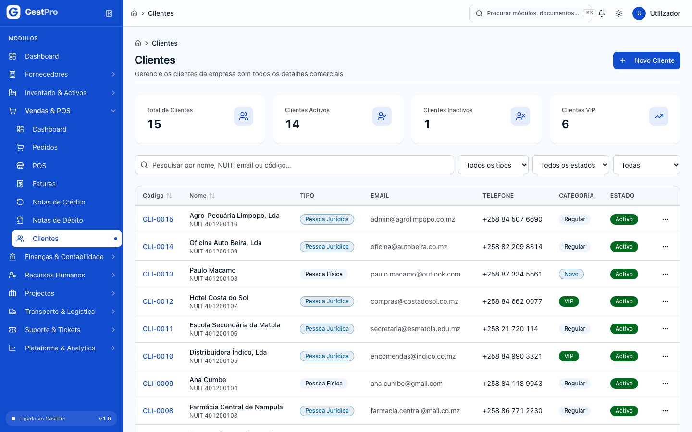
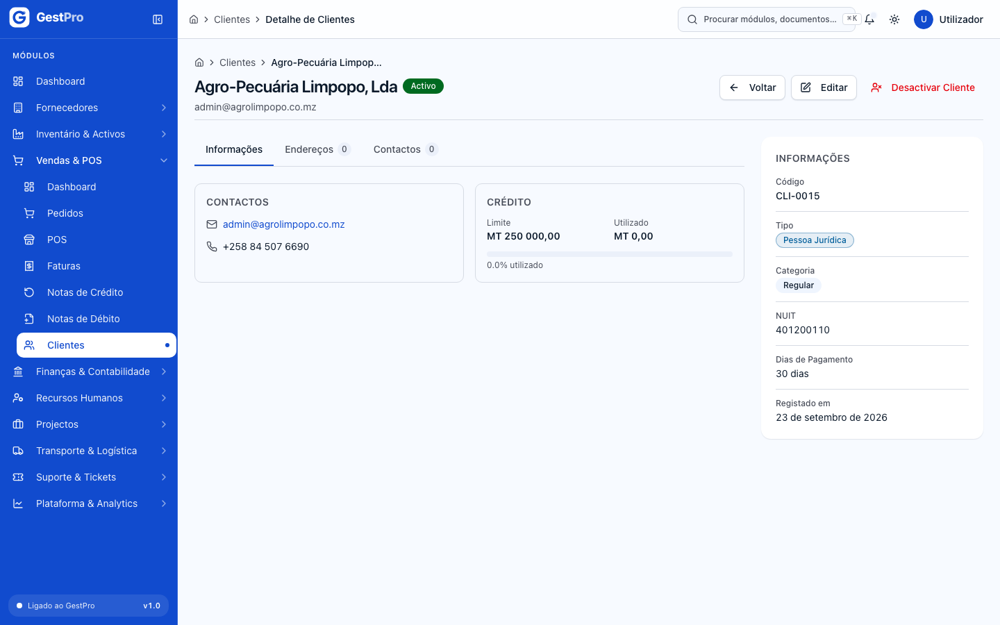
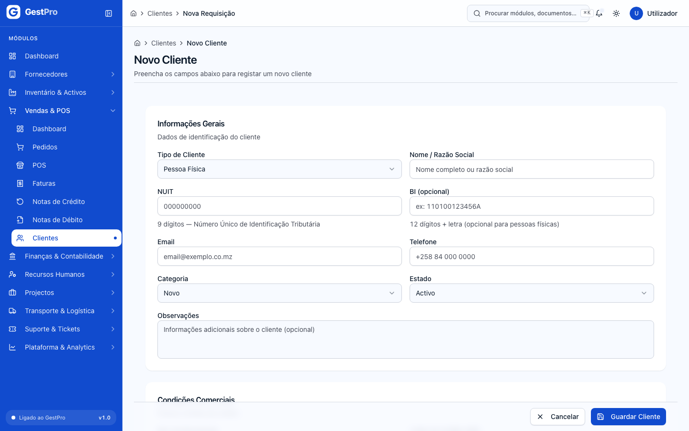

# 0. Primeiros passos

> **Para quem:** todos os perfis · **Onde:** ecrãs de entrada (`/registo`, `/auth/login`) e a interface comum a todos os módulos

## Para que serve

Este capítulo explica como a sua empresa começa a usar o GestPro: criar a conta, confirmar o
e-mail, entrar, definir a palavra-passe no primeiro acesso e terminar a sessão. Explica também a
interface que é igual em todos os módulos — barra lateral, paleta de comandos, cabeçalho,
notificações, tema — e as regras comuns das listas, fichas e formulários. Fecha com os cinco
perfis de sistema e o que significa receber «Sem permissão».

## Conceitos

| Termo | O que é |
|---|---|
| Empresa | A conta da sua organização no GestPro. Todos os dados (clientes, facturas, stock…) pertencem a uma empresa e nunca são visíveis a outra. Cada empresa tem um NUIT único. |
| Utilizador | Uma pessoa com acesso à empresa: nome, e-mail, estado (Activo/Inactivo) e os papéis que lhe foram atribuídos. É o autor que fica registado em cada acção. |
| E-mail | O identificador com que se entra. **Um endereço só pode pertencer a uma empresa GestPro** — quem trabalha com duas empresas precisa de dois endereços distintos. |
| Papel | Um conjunto de permissões com nome (por exemplo ADMIN ou um papel criado pela empresa, como «Gestor de Vendas»). Um utilizador pode ter vários papéis. |
| Permissão | A autorização para uma acção concreta (por exemplo, emitir uma factura). O que cada pessoa pode fazer é a soma das permissões dos seus papéis. |
| Período de Teste | Os primeiros **14 dias** da conta, gratuitos e sem cartão. Durante o teste a empresa é uma empresa a sério: os documentos emitidos são fiscais como quaisquer outros. |
| Endereço de e-mail por confirmar | Estado de quem criou a conta no registo e ainda não abriu a ligação de confirmação. Pode explorar e configurar tudo, mas **não pode emitir documentos fiscais nem criar utilizadores**. |
| Palavra-passe provisória | Palavra-passe gerada pelo sistema quando um administrador cria ou repõe um acesso. É mostrada uma única vez ao administrador e tem de ser trocada no primeiro acesso. |
| Modo de Leitura | Estado da empresa depois de o teste ou a subscrição terminar: durante 30 dias pode consultar e exportar tudo, mas não gravar. Ver [Plataforma e Administração](11-plataforma-e-administracao.md). |

### Perfis de sistema

Todas as empresas nascem com cinco papéis de sistema. Não podem ser removidos. O administrador
pode criar outros papéis à medida (ver [Plataforma e Administração](11-plataforma-e-administracao.md)).

| Perfil | Descrição no produto | O que pode, em resumo |
|---|---|---|
| **ADMIN** | Administrador — acesso total ao tenant | Tudo, incluindo configurações sensíveis (séries de faturação, plano de contas, fecho e reabertura de períodos, declarar o IVA, estornar lançamentos). É quem cria a conta no registo. |
| **GESTOR** | Gestor — operações e aprovações, sem configuração de sistema | Quase tudo: operar e aprovar em todos os módulos, gerir utilizadores e papéis, gerir a subscrição. **Não pode:** configurar a empresa, atribuir permissões a papéis, configurar integrações, alterar o plano de contas, configurar séries de faturação, fechar/reabrir períodos, abrir exercícios, declarar o IVA, estornar lançamentos, remover colaboradores, administração total de inventário e activos. |
| **FINANCEIRO** | Financeiro — contabilidade, caixa e faturação | Contabilidade, faturação, caixa, tesouraria, IVA (apurar e declarar), processamento salarial (payroll) e analytics; consulta e exportação de tudo o resto. **Não pode** reabrir períodos nem abrir exercícios, nem criar clientes, produtos ou documentos de compra. |
| **OPERADOR** | Operador — operações de armazém, produção e suporte | Inventário, produção, transporte, tickets, serviços, operar o POS e a caixa (abertura, fecho, reforço, sangria), criar e submeter requisições de compra, registar recepções, criar e editar vendas, criar e editar produtos, tarefas e timesheets de projectos, registar assiduidade e ausências, pedir férias; consulta e exportação de tudo o resto. **Não aprova** compras nem emite facturas. |
| **LEITURA** | Leitura — apenas consulta e exportação | Consultar, listar e exportar em todos os módulos. Não grava nada. |

> **Nota:** a barra lateral mostra quase todos os módulos a todos os perfis. Ver um ecrã não
> garante poder agir nele: se tentar uma acção para a qual o seu perfil não tem permissão, o
> GestPro recusa-a com a mensagem «Sem permissão para esta operação» (ver [Erros frequentes](#erros-frequentes)).

## Ecrãs

| Menu | Endereço (/rota) | Para que serve |
|---|---|---|
| — (ligação «Começar teste gratuito de 14 dias») | `/registo` | Criar a conta da empresa e entrar de imediato. |
| — | `/auth/login` | Iniciar sessão («Bem-vindo de volta»). |
| — | `/auth/mudar-palavra-passe` | Trocar a palavra-passe provisória no primeiro acesso («Defina a sua palavra-passe»). |
| — | `/auth/erro` | Explica porque é que a entrada foi recusada. |
| — (ligação «Contactar o suporte») | `/contactos` | Como obter ajuda com o acesso («Contacto e Suporte»). |
| Dashboard | `/dashboard` | Página inicial: avisos, «Primeiros passos», indicadores e «Accões Rápidas». |
| Plataforma & Analytics › Core Tenancy | `/core-tenancy` | Administração de utilizadores, papéis e auditoria — ver capítulo 11. |
| (sino no cabeçalho) | `/notificacoes` | Centro de notificações — ver capítulo 11. |

## Tarefas

### Como criar a conta da sua empresa

**Antes de começar:** tenha à mão o nome e o NUIT da empresa, a província e um e-mail que ainda
não esteja associado a nenhuma conta GestPro.

1. Abra `/registo` (ou, no ecrã de entrada, clique em **Começar teste gratuito de 14 dias**).
2. Preencha **Nome da empresa**, **NUIT** (9 dígitos) e **Província**.
3. Preencha **O seu nome** e **E-mail**. Este e-mail passa a ser o seu identificador de entrada.
4. Escolha a **Palavra-passe** (pelo menos 10 caracteres) e repita-a em **Confirmar palavra-passe**.
5. Em **Plano**, escolha Básico, Profissional ou Empresarial. O preço mostrado é mensal, em USD;
   durante os 14 dias de teste não paga nada.
6. Complete a **Verificação anti-robô**, se aparecer.
7. Clique em **Criar conta e entrar**.

<!-- captura: 00-primeiros-passos/registo.png | /registo -->

**Resultado:** a conta é criada e entra directamente no **Dashboard**, já com sessão iniciada, em
**Período de Teste**. Fica com o perfil ADMIN. No Dashboard aparecem o aviso **Endereço de e-mail
por confirmar** e o cartão **Primeiros passos**. Enviamos-lhe por e-mail uma ligação de confirmação.

Se a conta for criada mas a sessão não abrir, o ecrã mostra «A sua conta foi criada, mas não foi
possível iniciar a sessão automaticamente. Inicie sessão com o e-mail e a palavra-passe que acabou
de escolher.» e um botão **Iniciar sessão**. Não volte a registar a empresa — ela já existe.

**Efeitos noutros módulos:** a empresa é criada já com o plano de contas, as séries de numeração
fiscal e os cinco perfis de sistema configurados.

### Como confirmar o endereço de e-mail (e reenviar a ligação)

Enquanto o endereço estiver por confirmar pode configurar e explorar tudo, mas estão travados:

- **emitir documentos fiscais** — facturas, notas de crédito, notas de débito e a conversão de
  proforma em factura;
- **criar utilizadores** e **reactivar utilizadores**.

1. Abra a mensagem de confirmação que recebeu e clique na ligação. A ligação é válida **24 horas**.
2. Se abrir a ligação sem sessão iniciada (por exemplo, no telemóvel), o ecrã de entrada mostra
   «Endereço confirmado. Inicie sessão para continuar — já pode emitir documentos e convidar colegas.»
3. Se a mensagem não chegou ou a ligação expirou: no **Dashboard**, no aviso **Endereço de e-mail
   por confirmar**, clique em **Reenviar ligação**. Aparece «Ligação enviada. Verifique a sua caixa
   de correio.»

**Resultado:** depois de confirmar, o aviso mostra «Endereço confirmado — a sessão actualiza-se
dentro de minutos». Os travões desaparecem no máximo em 15 minutos; para que desapareçam de
imediato, termine a sessão e entre outra vez.

### Como entrar no GestPro

1. Abra `/auth/login`. O ecrã de entrada é do próprio GestPro.
2. Escreva o **E-mail profissional** e a **Palavra-passe**. O ícone do olho mostra ou oculta o que escreveu.
3. Clique em **Entrar na plataforma**.

<!-- captura: 00-primeiros-passos/login.png | /auth/login -->

**Resultado:** entra no **Dashboard**. Se tinha tentado abrir outra página antes de entrar, o
GestPro leva-o de volta a essa página.

### Como entrar pela primeira vez por convite

**Antes de começar:** o administrador da sua empresa criou o seu utilizador com a opção
**Convite por e-mail**.

1. Abra a mensagem de convite que recebeu.
2. Siga a ligação, confirme o endereço e escolha a sua palavra-passe.
3. Entre em `/auth/login` com o seu e-mail e a palavra-passe que escolheu.

**Resultado:** entra no GestPro com os papéis que o administrador lhe atribuiu. O seu e-mail já
fica confirmado.

### Como entrar pela primeira vez com uma palavra-passe provisória

**Antes de começar:** o administrador criou o seu utilizador com a opção **Definir palavra-passe
agora** (ou repôs a sua palavra-passe) e entregou-lhe a palavra-passe provisória.

1. Em `/auth/login`, escreva o seu e-mail e a palavra-passe provisória e clique em
   **Entrar na plataforma**.
2. O GestPro abre automaticamente o ecrã **Defina a sua palavra-passe**, com o e-mail já preenchido.
3. Em **Palavra-passe provisória**, escreva de novo a que recebeu.
4. Em **Nova palavra-passe**, escolha uma com pelo menos 10 caracteres, diferente da provisória.
5. Repita-a em **Confirmar nova palavra-passe** e clique em **Guardar e entrar**.

<!-- captura: 00-primeiros-passos/mudar-palavra-passe.png | /auth/mudar-palavra-passe -->

**Resultado:** a palavra-passe provisória deixa de funcionar e entra no **Dashboard**. Se a troca
correr bem mas a sessão não abrir, aparece «Palavra-passe alterada. Inicie sessão com a nova para
continuar.» — volte a `/auth/login` e entre com a nova.

### Como recuperar a palavra-passe

O GestPro não tem uma opção «esqueci-me da palavra-passe» no ecrã de entrada. Quem perde a
palavra-passe pede ao **administrador da sua empresa** que a reponha:

1. O administrador abre **Plataforma & Analytics › Core Tenancy › Gerir Utilizadores**, abre a sua
   ficha e clica em **Repor palavra-passe** (ver [Plataforma e Administração](11-plataforma-e-administracao.md)).
2. O administrador entrega-lhe a nova palavra-passe provisória.
3. Entre com ela e troque-a, como em [Como entrar pela primeira vez com uma palavra-passe provisória](#como-entrar-pela-primeira-vez-com-uma-palavra-passe-provisória).

O ecrã **Contacto e Suporte** (`/contactos`, ligação **Contactar o suporte** no ecrã de entrada)
diz o mesmo: para recuperar credenciais, obter um convite ou alterar permissões, contacte o
administrador da sua organização.

<!-- captura: 00-primeiros-passos/contactos.png | /contactos -->

### Como terminar a sessão

1. No canto superior direito, clique no seu nome (ou nas suas iniciais).
2. Clique em **Terminar sessão**.

**Resultado:** volta ao ecrã de entrada.

**Expiração da sessão:** a sessão termina sozinha após um período sem actividade (8 horas, na
configuração por omissão) e, em qualquer caso, 12 horas depois de ter entrado. Quando isso
acontece, a próxima página que abrir leva-o ao ecrã de entrada; depois de entrar, volta à página
onde estava. Alterações feitas pelo administrador aos seus papéis, a desactivação do seu
utilizador ou uma mudança no estado da subscrição chegam à sua sessão em **15 minutos, no máximo**.

### Como usar a barra lateral

A barra lateral, à esquerda, lista os módulos agrupados (Compras & Procurement, Fornecedores,
Inventário & Activos, Vendas & POS, Finanças & Contabilidade, Recursos Humanos, Projectos,
Transporte & Logística, Suporte & Tickets, Plataforma & Analytics).

1. Clique num grupo para o abrir ou fechar; clique num item para abrir o ecrã. O item activo
   fica realçado.
2. Para recolher a barra a uma coluna de ícones, clique no botão no topo (**Recolher barra
   lateral**) ou prima **⌘B** (Mac) / **Ctrl+B** (Windows). Repita para expandir.
3. Com a barra recolhida, clique no ícone de um grupo para ver os seus itens num menu.

A escolha (recolhida ou expandida) fica guardada no navegador. Em ecrãs estreitos (telemóvel) a
barra começa recolhida e abre por cima do conteúdo.

<!-- captura: 00-primeiros-passos/dashboard.png | /dashboard -->

### Como procurar um ecrã (paleta de comandos)

1. Prima **⌘K** (Mac) ou **Ctrl+K** (Windows) em qualquer página.
2. Escreva parte do nome do ecrã (por exemplo «IVA» ou «Payroll»). A lista está agrupada por
   Início, Compras, Inventário, Vendas, Finanças, Recursos Humanos, Projectos, Operações e Analytics.
3. Use as setas e **Enter**, ou clique no resultado.

**Resultado:** o ecrã abre. Se nada corresponder, aparece «Nenhum resultado encontrado.» A paleta
procura ecrãs, não documentos nem registos.

> **Atenção:** a caixa «Procurar módulos, documentos…» no cabeçalho ainda não abre a paleta com
> um clique. Use o atalho de teclado.

### Como usar o cabeçalho

No topo de cada página encontra, da esquerda para a direita:

- o **caminho** da página (por exemplo *Administração › Utilizadores*) — cada parte é uma ligação;
- a caixa **Procurar módulos, documentos…** com o atalho **⌘K**;
- o **sino de notificações** — um número vermelho indica quantas notificações tem por ler
  (mostra «99+» acima de 99); clique para abrir `/notificacoes`;
- o botão **Alterar tema**;
- o **menu do utilizador** (o seu nome e e-mail, e **Terminar sessão**).

> **Atenção:** o item **Configurações** do menu do utilizador ainda não leva a nenhum ecrã.

### Como ver as notificações

1. Clique no sino, no cabeçalho.
2. Em **Notificações**, as não lidas aparecem realçadas com um ponto. Clique no visto para
   **Marcar como lida**, ou em **Marcar todas como lidas**.

Detalhes e preferências de entrega: ver [Plataforma e Administração](11-plataforma-e-administracao.md).

### Como mudar o tema (claro/escuro)

1. No cabeçalho, clique em **Alterar tema** (ícone do sol/lua).
2. Escolha **Claro**, **Escuro** ou **Sistema** (segue a configuração do seu computador).

### Como trabalhar com listas, fichas e formulários

As regras seguintes valem em todos os módulos.

**Listas**

- No topo há uma caixa **Pesquisar…** e filtros (por exemplo **Estado**). Os filtros em uso
  aparecem em **Filtros activos:**; remova-os um a um ou com **Limpar tudo**.
- Clique numa linha para abrir a ficha. O botão **⋯** no fim da linha abre as acções dessa linha
  (por exemplo **Ver detalhe**, **Editar**).
- Nas colunas com seta, clique no título para ordenar.
- Quando há mais registos, use **Seguinte** e **Anterior** no fundo da lista.
- Onde a exportação existe, há botões **CSV** e **XLSX** que descarregam o ficheiro (até 5 000
  linhas). Exportar é sempre permitido, mesmo em Modo de Leitura.

<!-- captura: 00-primeiros-passos/lista-exemplo.png | /clientes -->

**Fichas (páginas de detalhe)**

- No topo: o nome do registo, o seu estado (etiqueta colorida) e os botões de acção
  (**Voltar**, **Editar**, e acções próprias do módulo).
- Por baixo, um resumo dos dados principais e **separadores** com o resto da informação
  (por exemplo **Papéis**, **Permissões**, linhas, histórico).

<!-- captura: 00-primeiros-passos/detalhe-exemplo.png | /clientes >primeiro -->

**Formulários**

- Criar e editar abrem numa **página própria** (por exemplo `/clientes/novo`), não numa janela
  por cima da lista. Os botões **Cancelar** e **Guardar**/**Criar** ficam no topo do formulário.
- Os campos com erro mostram a mensagem logo por baixo.
- Se tiver alterações por guardar e tentar sair, o GestPro pergunta «Tem alterações não guardadas.
  Pretende sair mesmo assim?» (ou o navegador avisa ao fechar o separador).
- Depois de guardar, uma mensagem breve no canto do ecrã confirma o resultado.

<!-- captura: 00-primeiros-passos/formulario-exemplo.png | /clientes/novo -->

**Acções destrutivas**

- Desactivar, remover, anular ou cancelar pedem sempre confirmação numa janela com o que vai
  acontecer (por exemplo **Desactivar utilizador?** com **Cancelar** e **Confirmar Desactivação**).
  Nada acontece até confirmar.

## Estados

**Utilizador**

| Estado | Significado | Pode passar a | Quem |
|---|---|---|---|
| Activo | Pode entrar e trabalhar conforme os seus papéis. | Inactivo | ADMIN, GESTOR |
| Inactivo | Não consegue entrar («Este utilizador foi desactivado…»). | Activo (ver capítulo 11) | ADMIN, GESTOR (exige e-mail confirmado) |

**Endereço de e-mail de quem criou a conta**

| Estado | Significado | Pode passar a | Quem |
|---|---|---|---|
| Por confirmar | Pode trabalhar, mas não emite documentos fiscais nem cria/reactiva utilizadores. | Confirmado | O próprio, abrindo a ligação |
| Confirmado | Sem travões. | — | — |

**Subscrição da empresa** (resumo; detalhe no [capítulo 11](11-plataforma-e-administracao.md))

| Estado | Significado para quem usa |
|---|---|
| Período de Teste | Acesso completo durante 14 dias. |
| Activa | Acesso completo. |
| Modo de Leitura | Entra, consulta e exporta; não grava. Uma faixa no topo de todas as páginas mostra quantos dias faltam. |
| Acesso Fechado | Ninguém da empresa entra. Os dados continuam guardados. |

## Erros frequentes

| Mensagem mostrada | Porquê | O que fazer |
|---|---|---|
| E-mail ou palavra-passe incorrectos. | Dados errados — ou demasiadas tentativas falhadas seguidas. | Verifique o e-mail e a palavra-passe. Se persistir, espere uns minutos ou peça ao administrador que reponha a palavra-passe. |
| Esta conta está desactivada. Contacte o administrador da sua empresa. | A sua identidade foi desactivada. | Fale com o administrador da empresa. |
| Este utilizador foi desactivado. Contacte o administrador da sua empresa. | O seu utilizador está Inactivo. | Fale com o administrador da empresa. |
| A sua identidade foi reconhecida, mas ainda não existe um utilizador associado numa empresa GestPro. Contacte o administrador da sua empresa. | A palavra-passe está certa, mas não há utilizador seu em nenhuma empresa. | Peça ao administrador que o crie. |
| A subscrição da sua empresa não está activa. O administrador pode regularizar a situação nas definições. | O acesso da empresa está fechado. | Contacte o administrador da empresa ou o suporte GestPro. |
| O serviço de identidade não respondeu. Tente de novo dentro de momentos — não é problema das suas credenciais. | Falha temporária do serviço. | Tente de novo daí a pouco. |
| Já existe uma conta registada com este NUIT. Inicie sessão ou recupere a palavra-passe. | O NUIT já tem conta no GestPro. | Entre com a conta existente ou peça acesso ao administrador dela. |
| Este endereço de e-mail já está associado a uma conta GestPro. Cada pessoa tem uma única identidade, numa única empresa — quem gere duas empresas precisa de dois endereços de e-mail distintos. | O e-mail já pertence a outra conta. | Use outro endereço. |
| NUIT inválido (9 dígitos não repetidos) | O NUIT não tem formato válido. | Corrija o NUIT. |
| As palavras-passe não coincidem | A confirmação é diferente da palavra-passe. | Escreva a mesma nos dois campos. |
| A palavra-passe tem de ter pelo menos 10 caracteres | Palavra-passe curta. | Escolha uma com 10 ou mais caracteres. |
| Verificação anti-robô falhou. Actualize a página e tente de novo. | A verificação não foi aceite. | Actualize a página e repita. |
| Demasiados pedidos. Tente mais tarde. / Demasiados pedidos para este email. | Muitas tentativas de registo seguidas. | Espere e tente mais tarde. |
| A palavra-passe actual está incorrecta. | No ecrã de troca, a palavra-passe provisória está errada. | Escreva exactamente a que o administrador lhe deu. |
| A nova palavra-passe tem de ser diferente da actual | Repetiu a provisória. | Escolha outra. |
| Demasiadas tentativas. Tente novamente dentro de N minutos. | Muitas tentativas de troca falhadas. | Espere o tempo indicado. |
| A ligação de confirmação expirou (é válida 24 horas). Inicie sessão e peça uma nova a partir do aviso no painel. | Abriu a ligação passadas 24 horas. | Entre e clique em **Reenviar ligação** no Dashboard. |
| Já foram enviadas demasiadas mensagens. Tente novamente dentro de N minutos. | Pediu o reenvio muitas vezes. | Espere o tempo indicado. |
| Para emitir documentos fiscais é preciso confirmar o endereço de e-mail da conta — … | Tentou emitir com o e-mail por confirmar. | Confirme o e-mail (ver acima). Se já confirmou, termine a sessão e entre de novo. |
| Para criar utilizadores é preciso confirmar o endereço de e-mail da conta — … | Idem, ao criar um utilizador. | Idem. |
| Sem permissão para esta operação | O seu perfil não tem a permissão que esta acção exige. | Peça ao administrador que lhe atribua um papel com essa permissão. |
| A sua subscrição terminou e a conta está em modo de leitura. Pode consultar e exportar tudo o que é seu; para voltar a gravar, subscreva um plano. | A empresa está em Modo de Leitura. | O administrador (ou gestor) subscreve um plano em **Subscrição** — ver capítulo 11. |

## Perguntas frequentes

**Posso usar o mesmo e-mail em duas empresas?** Não. Cada e-mail pertence a uma única empresa
GestPro; use endereços diferentes.

**O registo pede cartão?** Não. Os 14 dias de teste são sem cartão; só paga quando subscrever um plano.

**Não recebi o e-mail de confirmação. Posso continuar a trabalhar?** Sim: pode configurar a empresa,
criar clientes e produtos, etc. Só não emite documentos fiscais nem cria utilizadores até confirmar.
