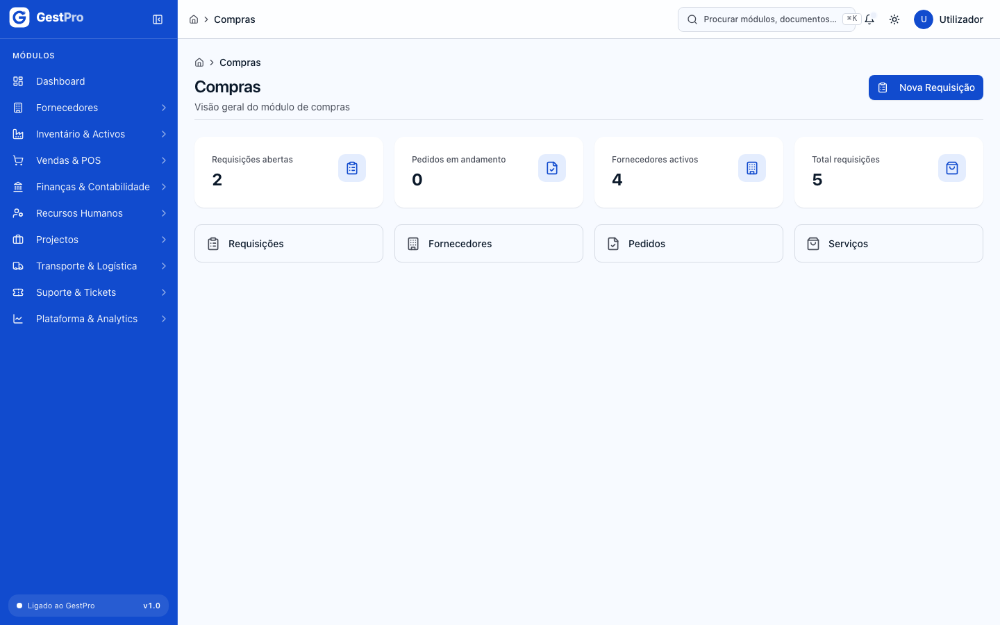
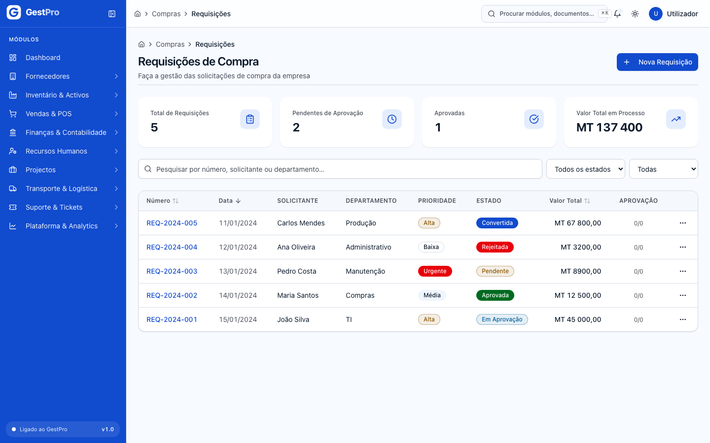
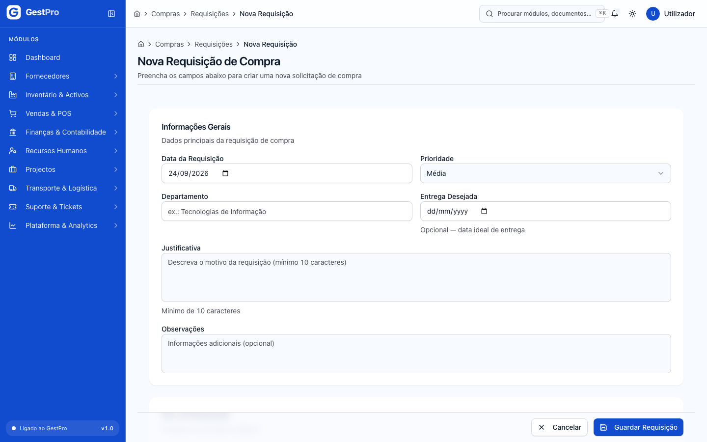
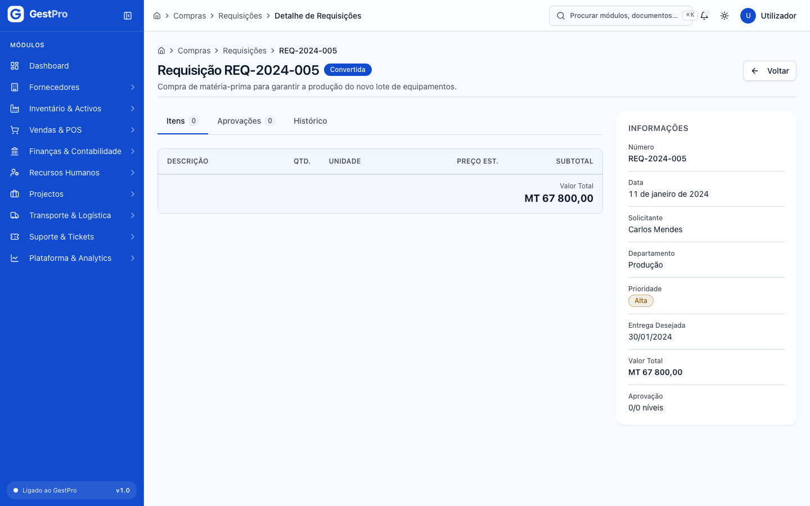
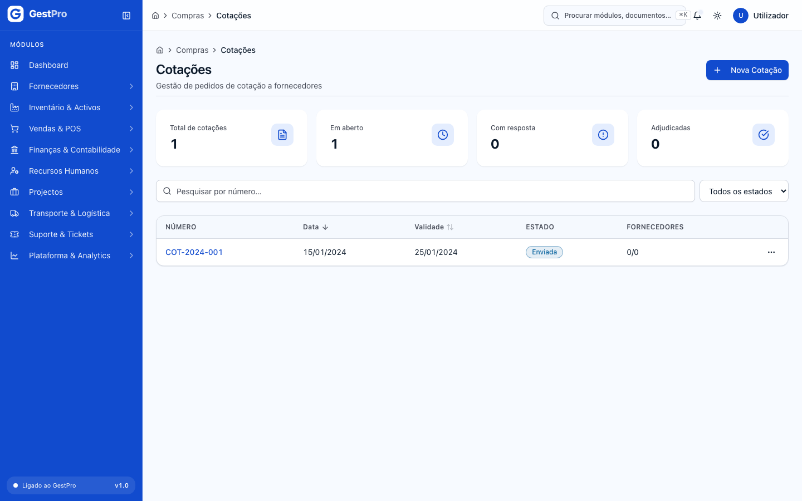
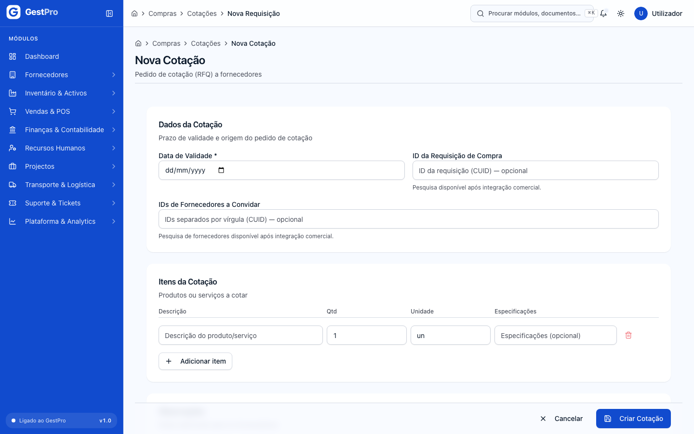
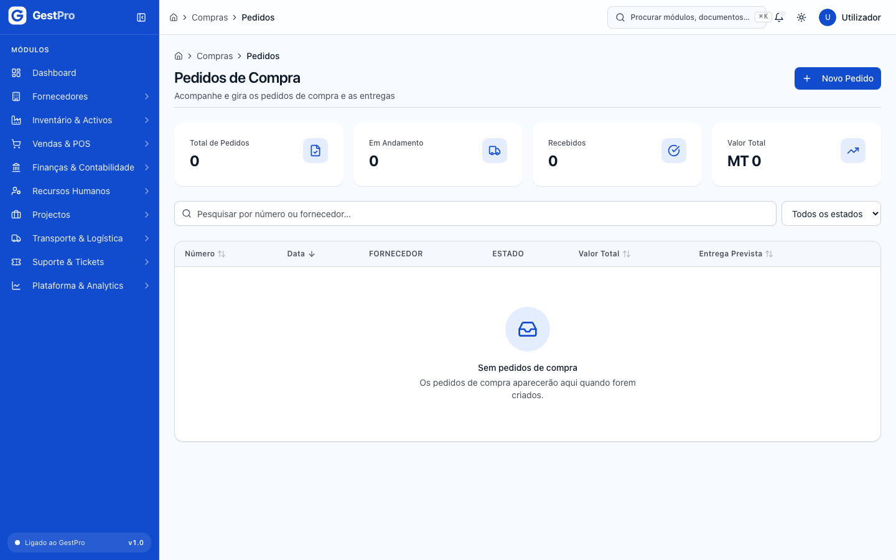
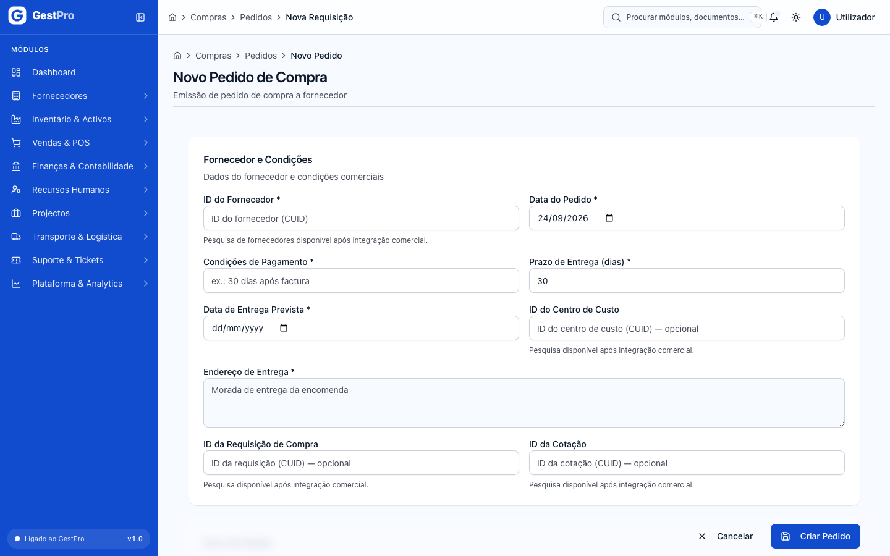

# 1. Compras

> **Para quem:** administrador, gestor, operador (consulta: financeiro, leitura) · **Onde:** menu › Compras & Procurement

## Para que serve

O módulo de Compras organiza o caminho de uma necessidade de compra até à encomenda ao fornecedor. Um colaborador regista uma **requisição** (o que é preciso, porquê e para quando), submete-a para aprovação e, depois, a empresa pode pedir preços a vários fornecedores (**cotação**) e emitir o **pedido de compra** ao fornecedor escolhido.

Nesta versão o módulo cobre bem a criação e o acompanhamento de requisições, e permite registar cotações e pedidos de compra. Os passos seguintes do circuito (enviar, adjudicar, converter e dar entrada da mercadoria) ainda não têm ecrã. Estão descritos em [Limites desta versão](#limites-desta-versão).

> **Atenção:** nesta versão o grupo **Compras & Procurement** pode não aparecer no menu lateral, mesmo para o administrador. Para abrir as páginas, carregue em **Ctrl+K** (ou **⌘K** no Mac) ou no campo **Procurar módulos, documentos…** no topo do ecrã e escreva «Requisições», «Cotações» ou «Pedidos». Também pode escrever o endereço directamente no navegador (por exemplo `/compras/requisicoes`).

## Conceitos

| Termo | O que é |
|---|---|
| Requisição de compra | Pedido interno de compra: departamento, prioridade, justificação e a lista de itens com preço estimado. Recebe um número automático. |
| Prioridade | Baixa, Média, Alta ou Urgente. Serve para ordenar e filtrar requisições. |
| Aprovação | Decisão sobre a requisição, feita por níveis. A requisição mostra o progresso em «x/y níveis». |
| Cotação (RFQ) | Pedido de preços enviado a um ou mais fornecedores, com os itens a cotar e uma data de validade. |
| Pedido de compra | Encomenda formal a um fornecedor, com preços, IVA, condições de pagamento, prazo e endereço de entrega. |
| Recepção | Entrada da mercadoria encomendada. Quando um pedido fica totalmente recebido, o sistema cria a conta a pagar ao fornecedor. |

## Ecrãs

| Menu | Endereço (/rota) | Para que serve |
|---|---|---|
| (sem entrada no menu) | /compras | Painel de Compras: indicadores e atalhos |
| Requisições | /compras/requisicoes | Lista de requisições, com indicadores e filtros |
| Requisições › Nova Requisição | /compras/requisicoes/novo | Criar uma requisição |
| Requisições › (linha) | /compras/requisicoes/‹id› | Detalhe da requisição (separadores Itens, Aprovações e Histórico) |
| Requisições › Editar | /compras/requisicoes/‹id›/editar | Alterar uma requisição em rascunho |
| Cotações (RFQ) | /compras/cotacoes | Lista de cotações |
| Cotações › Nova Cotação | /compras/cotacoes/novo | Criar um pedido de cotação |
| Pedidos de Compra | /compras/pedidos | Lista de pedidos de compra |
| Pedidos de Compra › Novo Pedido | /compras/pedidos/novo | Criar um pedido de compra |

Endereços antigos que reencaminham para os actuais: `/procurement/...` (requisições, cotações, pedidos, aprovações, recebimentos), `/compras/recepcao` → Pedidos de Compra, `/compras/orcamentos` → Cotações, `/compras/fornecedores` e `/compras/documentos` → lista de fornecedores.

### Painel de Compras

Mostra quatro indicadores: **Requisições abertas**, **Pedidos em andamento**, **Fornecedores activos** e **Total requisições**. Tem ainda o botão **Nova Requisição** e atalhos para Requisições, Fornecedores, Pedidos e Serviços.

<!-- captura: 01-compras/painel.png | /compras -->

### Lista de requisições

No topo estão os indicadores **Total de Requisições**, **Pendentes de Aprovação**, **Aprovadas** e **Valor Total em Processo** (em MT). Por baixo, a caixa de pesquisa (*Pesquisar por número, solicitante ou departamento…*) e os filtros **Estado** e **Prioridade**.

A tabela tem as colunas Número, Data, Solicitante, Departamento, Prioridade, Estado, Valor Total e Aprovação. O botão **⋯** de cada linha dá acesso a **Ver detalhe**, **Editar** (só em rascunho), **Submeter** e **Cancelar**.

Se clicar numa linha, abre-se um painel lateral com o resumo da requisição. Para ver a página completa, use **Ver detalhe completo**.

<!-- captura: 01-compras/requisicoes-lista.png | /compras/requisicoes -->

## Tarefas

### Como criar uma requisição de compra

**Antes de começar:** precisa do perfil Administrador, Gestor ou Operador.

1. Abra **Requisições** e clique em **Nova Requisição**. O botão também existe no painel `/compras`.
   > **Atenção:** há um problema conhecido. Ao clicar em **Nova Requisição**, o ecrã pode continuar a mostrar a lista em vez do formulário. Se isso acontecer, recarregue a página (**F5**) ou escreva o endereço `/compras/requisicoes/novo` na barra do navegador. O formulário abre normalmente.
2. Na secção **Informações Gerais**, preencha:
   - **Data da Requisição** (por omissão, hoje);
   - **Prioridade** (Baixa, Média, Alta ou Urgente; por omissão, Média);
   - **Departamento** (obrigatório, por exemplo «Tecnologias de Informação»);
   - **Entrega Desejada** (opcional);
   - **Justificativa** (obrigatória, com pelo menos 10 caracteres);
   - **Observações** (opcional).
3. Na secção **Itens da Requisição**, preencha em cada linha a **Descrição do Item**, a **Quantidade**, a **Unidade** (UN, KG, L, M, M², CX, PC) e o **Preço Est. (MZN)**. O **Subtotal** de cada linha e o **Valor Total Estimado** são calculados automaticamente.
4. Para acrescentar linhas, use **Adicionar Item**. Para retirar uma linha, use o ícone de caixote do lixo (só aparece quando há mais de uma linha).
5. Clique em **Guardar Requisição**.

**Resultado:** aparece a mensagem «Requisição criada com sucesso!» e volta à lista. A requisição fica no estado **Rascunho**, com um número atribuído automaticamente. Se sair do formulário com alterações por guardar, o sistema pede confirmação.

<!-- captura: 01-compras/requisicao-nova.png | /compras/requisicoes/novo -->

### Como consultar uma requisição

1. Na lista de requisições, clique na linha. Abre-se o painel lateral com Solicitante, Departamento, Prioridade, Valor Total, Entrega Desejada e Aprovação.
2. Clique em **Ver detalhe completo**, ou use **⋯ › Ver detalhe**.

A página de detalhe tem três separadores:
- **Itens**: Descrição, Qtd., Unidade, Preço Est. e Subtotal, com o **Valor Total** no fim;
- **Aprovações**: uma linha por aprovador, com o **Nível**, o nome, o estado (Pendente, Aprovado ou Rejeitado), a data e as observações. Se não houver aprovações, aparece «Nenhum processo de aprovação iniciado.»;
- **Histórico**: a sequência das decisões («Aprovado por…», «Rejeitado por…», «Aguardando decisão de…»).

Ao lado estão os dados da requisição: Número, Data, Solicitante, Departamento, Prioridade, Entrega Desejada, Valor Total e Aprovação (níveis concluídos / total de níveis).

<!-- captura: 01-compras/requisicao-detalhe.png | /compras/requisicoes >primeiro -->

### Como editar uma requisição

**Antes de começar:** a requisição tem de estar em **Rascunho**. Precisa do perfil Administrador, Gestor ou Operador.

1. No detalhe da requisição, clique em **Editar** (ou use **⋯ › Editar** na lista).
2. Altere os campos de **Informações Gerais**: Data da Requisição, Prioridade, Departamento, Entrega Desejada, Justificativa e Observações.
3. Clique em **Guardar Alterações**.

**Resultado:** aparece a mensagem «Requisição actualizada com sucesso!». Se abrir o endereço de edição de uma requisição que já não está em rascunho, o sistema leva-o para o detalhe.

### Como submeter uma requisição para aprovação

**Antes de começar:** a requisição tem de estar em **Rascunho**. Precisa do perfil Administrador, Gestor ou Operador.

1. No detalhe, clique em **Submeter para Aprovação**. Na lista, use **⋯ › Submeter**.

**Resultado:** aparece a mensagem «Requisição submetida para aprovação com sucesso.». O que acontece a seguir depende da empresa:
- **se a empresa não tiver um circuito de aprovação configurado**, a requisição passa logo a **Aprovada**. Esta é a situação normal nesta versão, porque ainda não há ecrã para configurar circuitos;
- **se houver um circuito configurado** para o valor da requisição, esta passa a **Em Aprovação** e são criadas as aprovações do primeiro nível (visíveis no separador **Aprovações**).

> **Atenção:** nesta versão não há ecrã para aprovar ou rejeitar uma requisição que esteja **Em Aprovação**.

### Como cancelar uma requisição

**Antes de começar:** precisa do perfil Administrador ou Gestor. Pode cancelar uma requisição em Rascunho ou Aprovada.

1. No detalhe, clique em **Cancelar Requisição**. Na lista, use **⋯ › Cancelar**.
2. Na janela «Cancelar requisição?», escreva o **Motivo do cancelamento** (obrigatório, até 500 caracteres).
3. Clique em **Confirmar Cancelamento**. Se mudar de ideias, use **Voltar**.

**Resultado:** aparece a mensagem «Requisição cancelada.» e a requisição passa a **Cancelada**. Esta acção não pode ser revertida.

### Como criar um pedido de cotação (RFQ)

**Antes de começar:** precisa do perfil Administrador ou Gestor. Se quiser ligar a cotação a uma requisição ou convidar fornecedores, tenha à mão os respectivos **identificadores** (ver o passo 3).

1. Abra **Cotações (RFQ)** e clique em **Nova Cotação**.
2. Em **Dados da Cotação**, indique a **Data de Validade** (obrigatória).
3. Se quiser, preencha:
   - **ID da Requisição de Compra**: o identificador da requisição de origem;
   - **IDs de Fornecedores a Convidar**: um ou mais identificadores de fornecedor, separados por vírgulas.

   O identificador é a última parte do endereço quando tem a ficha aberta. Por exemplo, em `/fornecedores/cm4abc…` o identificador é `cm4abc…`. Nesta versão ainda não há pesquisa por nome nestes campos.
4. Em **Itens da Cotação**, preencha para cada item a **Descrição**, a **Qtd**, a **Unidade** e, se quiser, as **Especificações**. Use **Adicionar item** para mais linhas.
5. Em **Observações**, escreva as notas para os fornecedores (opcional).
6. Clique em **Criar Cotação**.

**Resultado:** aparece a mensagem «Cotação criada com sucesso.». A cotação fica em **Rascunho**. Na lista, a coluna **Fornecedores** mostra respostas recebidas / fornecedores convidados.

A lista de cotações tem os indicadores **Total de cotações**, **Em aberto**, **Com resposta** e **Adjudicadas**, a pesquisa por número e o filtro **Estado**.

<!-- captura: 01-compras/cotacoes-lista.png | /compras/cotacoes -->

<!-- captura: 01-compras/cotacao-nova.png | /compras/cotacoes/novo -->

### Como criar um pedido de compra

**Antes de começar:** precisa do perfil Administrador ou Gestor e do **identificador do fornecedor**. Abra a ficha do fornecedor em **Fornecedores** e copie a última parte do endereço. Veja [Fornecedores e Serviços](02-fornecedores-e-servicos.md).

1. Abra **Pedidos de Compra** e clique em **Novo Pedido**.
2. Em **Fornecedor e Condições**, preencha:
   - **ID do Fornecedor** (obrigatório);
   - **Data do Pedido** (por omissão, hoje);
   - **Condições de Pagamento** (obrigatório, por exemplo «30 dias após factura»);
   - **Prazo de Entrega (dias)** (obrigatório);
   - **Data de Entrega Prevista** (obrigatória);
   - **Endereço de Entrega** (obrigatório);
   - opcionalmente, **ID do Centro de Custo**, **ID da Requisição de Compra** e **ID da Cotação**.
3. Em **Itens do Pedido**, preencha para cada linha a Descrição, a Qtd, a Unidade, o Preço Unit., o Desc. (desconto em MZN) e o IVA % (16% ou 0%). O total da linha, o **Subtotal**, o **IVA** e o **Total** são calculados automaticamente.
4. Em **Observações**, escreva as notas para o fornecedor (opcional).
5. Clique em **Criar Pedido**.

**Resultado:** aparece a mensagem «Pedido de compra criado com sucesso.». O pedido fica em **Rascunho**, com número automático.

A lista de pedidos tem os indicadores **Total de Pedidos**, **Em Andamento**, **Recebidos** e **Valor Total**, a pesquisa por número ou fornecedor e o filtro **Estado**. As colunas são Número, Data, Fornecedor, Estado, Valor Total e Entrega Prevista.

<!-- captura: 01-compras/pedidos-lista.png | /compras/pedidos -->

<!-- captura: 01-compras/pedido-novo.png | /compras/pedidos/novo -->

### Limites desta versão

O sistema já sabe fazer os passos seguintes, mas ainda não há botões ou ecrãs para os pedir:

- **aprovar ou rejeitar** uma requisição em aprovação, e **configurar circuitos de aprovação**;
- **enviar**, **registar respostas**, **adjudicar** ou **cancelar** uma cotação, e abrir o detalhe de uma cotação (**⋯ › Ver detalhe** mostra uma página inexistente);
- **converter** uma requisição aprovada num pedido de compra;
- **enviar**, **editar** ou **cancelar** um pedido de compra, e abrir o detalhe de um pedido (**⋯ › Ver detalhe** mostra uma página inexistente);
- **recepção de mercadoria**: o endereço `/compras/recepcao` leva à lista de pedidos, onde não há acção de recepção.

Por isso, na prática, cotações e pedidos ficam em **Rascunho** depois de criados.

**Efeitos noutros módulos (quando a recepção estiver disponível):** o sistema já está preparado para o seguinte. Cada quantidade aceite dá entrada no stock, se o item estiver ligado a um produto (ver [Inventário](03-inventario.md)). Quando o pedido fica **Recebido** (todos os itens recebidos), o sistema cria uma **conta a pagar** ao fornecedor, com vencimento igual à data em que a recepção fica completa mais o **Prazo de Entrega (dias)** do pedido, e regista o lançamento contabilístico de reconhecimento da dívida (ver [Contabilidade](05-contabilidade.md) e [Fornecedores e Serviços](02-fornecedores-e-servicos.md)). Não é possível exceder a quantidade encomendada.

## Estados

### Requisição de compra

| Estado | Significado | Pode passar a | Quem |
|---|---|---|---|
| Rascunho | Criada, ainda editável | Aprovada ou Em Aprovação (ao submeter), Cancelada | Submeter: Administrador, Gestor, Operador. Cancelar: Administrador, Gestor |
| Pendente | Estado intermédio da submissão (não fica visível na prática) | Em Aprovação, Cancelada | — |
| Em Aprovação | À espera da decisão dos aprovadores | Aprovada, Rejeitada | Aprovadores (sem ecrã nesta versão) |
| Aprovada | Pode seguir para cotação ou pedido | Convertida, Cancelada | Cancelar: Administrador, Gestor |
| Rejeitada | Recusada por um aprovador (final) | — | — |
| Cancelada | Cancelada com motivo (final) | — | — |
| Convertida | Deu origem a um pedido de compra (final) | — | — |

### Cotação

| Estado | Significado | Pode passar a | Quem |
|---|---|---|---|
| Rascunho | Criada, ainda não enviada | Enviada, Cancelada | (sem ecrã nesta versão) |
| Enviada | Enviada aos fornecedores | Respondida, Vencida, Cancelada | — |
| Respondida (filtro: «Com resposta») | Pelo menos um fornecedor respondeu | Adjudicada, Vencida, Cancelada | — |
| Adjudicada | Fornecedor vencedor escolhido (final) | — | — |
| Vencida | A data de validade passou (final) | — | — |
| Cancelada | Cancelada (final) | — | — |

### Pedido de compra

| Estado | Significado | Pode passar a | Quem |
|---|---|---|---|
| Rascunho | Criado, ainda não enviado | Enviado, Cancelado | (sem ecrã nesta versão) |
| Enviado | Enviado ao fornecedor | Confirmado, Cancelado | — |
| Confirmado | O fornecedor confirmou | Em Trânsito, Cancelado | — |
| Em Trânsito | Mercadoria a caminho; aceita recepções | Parcialmente Recebido, Recebido | — |
| Parcialmente Recebido (filtro: «Recebido Parcial») | Parte da mercadoria recebida | Recebido | — |
| Recebido (filtro: «Recebido Total») | Tudo recebido; gera a conta a pagar (final) | — | — |
| Cancelado | Cancelado (final) | — | — |

## Erros frequentes

| Mensagem mostrada | Porquê | O que fazer |
|---|---|---|
| Departamento obrigatório | O campo Departamento está vazio | Indique o departamento |
| Justificativa obrigatória (mín. 10 caracteres) | A justificação tem menos de 10 caracteres | Escreva uma justificação mais completa |
| Descrição obrigatória | Um item não tem descrição | Descreva o item ou remova a linha |
| Valor deve ser positivo | Na requisição, uma quantidade igual a zero | Indique uma quantidade maior que zero |
| Quantidade positiva · Preço positivo | Na cotação ou no pedido, uma linha com quantidade ou preço unitário a zero | Indique valores maiores que zero |
| Indique o motivo do cancelamento. | Tentou cancelar sem motivo | Escreva o motivo na janela de cancelamento |
| Apenas requisições em rascunho podem ser actualizadas | A requisição já foi submetida | Não é possível editar; crie uma nova requisição, se necessário |
| Transição inválida de RequisicaoCompra: … | A acção não é permitida no estado actual (por exemplo, cancelar uma requisição Em Aprovação) | Verifique o estado da requisição e actualize a página |
| Data de validade obrigatória | Nova cotação sem data de validade | Escolha a data de validade |
| Fornecedor obrigatório / ID de fornecedor inválido | Novo pedido sem identificador de fornecedor, ou com um identificador mal copiado | Copie de novo o identificador a partir do endereço da ficha do fornecedor |
| Condições de pagamento obrigatórias · Endereço de entrega obrigatório · Data prevista obrigatória | Campos obrigatórios do pedido por preencher | Preencha os campos assinalados |
| Sem permissão para esta operação | O seu perfil não permite esta acção | Peça a acção a um gestor ou administrador |
| Dados inválidos | Algum dado não passou na validação | Reveja os campos do formulário |

## Perguntas frequentes

**Submeti a requisição e ela ficou logo «Aprovada». É normal?**
Sim. Sem um circuito de aprovação configurado para a empresa, a submissão aprova a requisição automaticamente.

**Porque é que o Solicitante aparece como «Utilizador» seguido de quatro caracteres?**
Nesta versão o sistema guarda um nome abreviado do utilizador que criou a requisição, em vez do nome completo.

**Onde registo o pagamento ao fornecedor?**
Em **Fornecedores › Contas a Pagar**. Veja [Fornecedores e Serviços](02-fornecedores-e-servicos.md).
