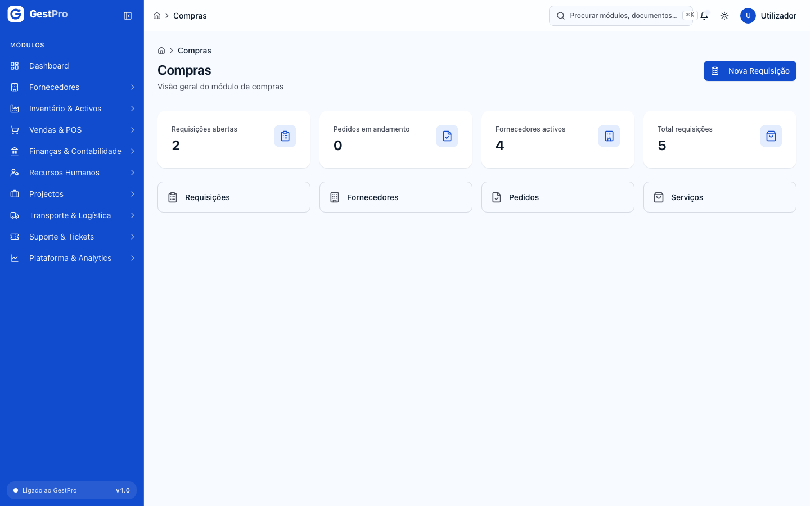
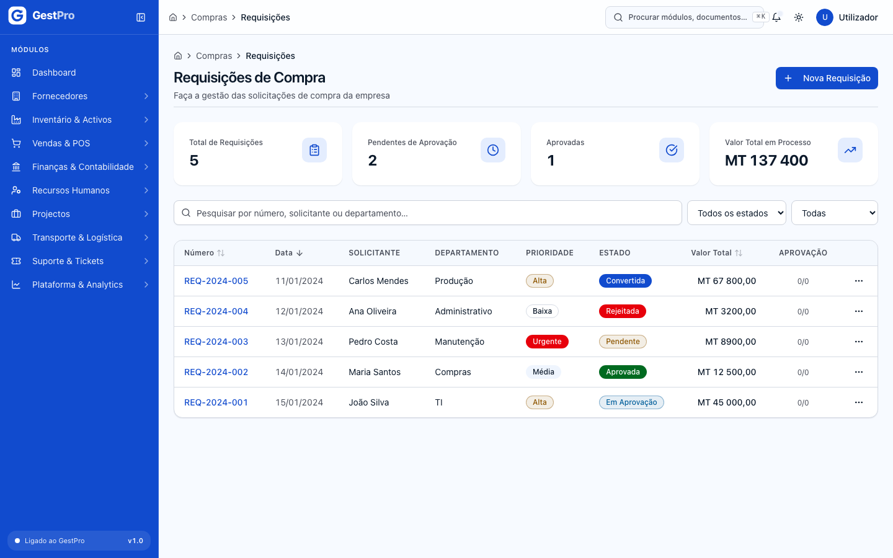
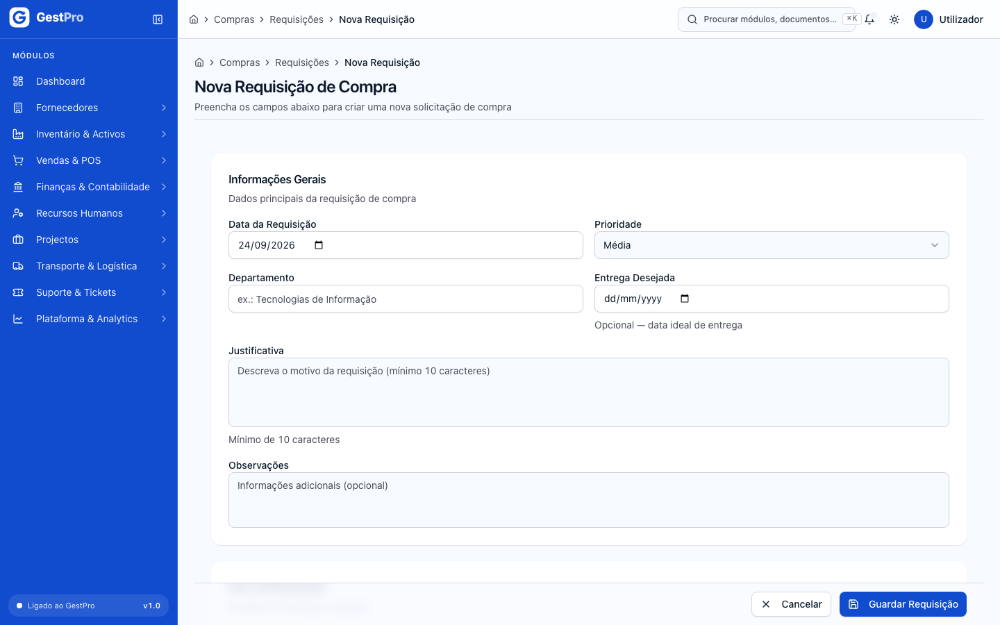
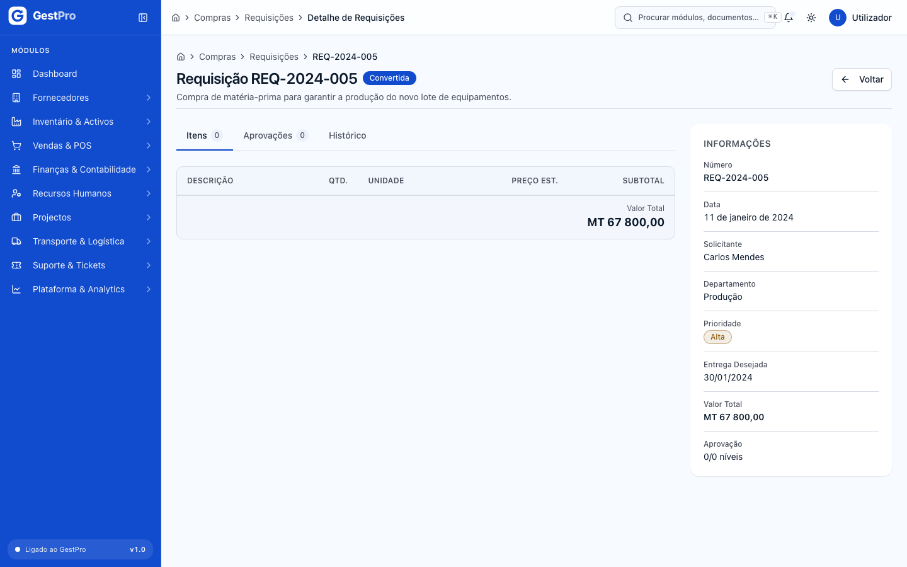
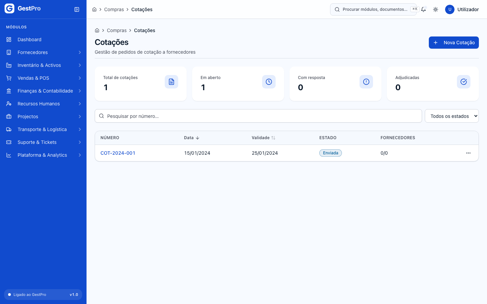
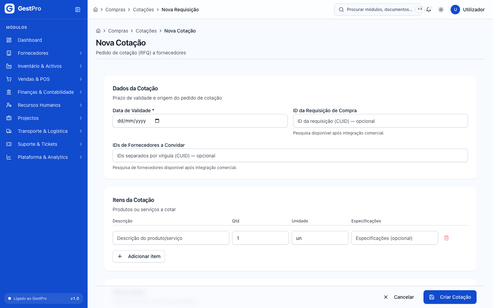
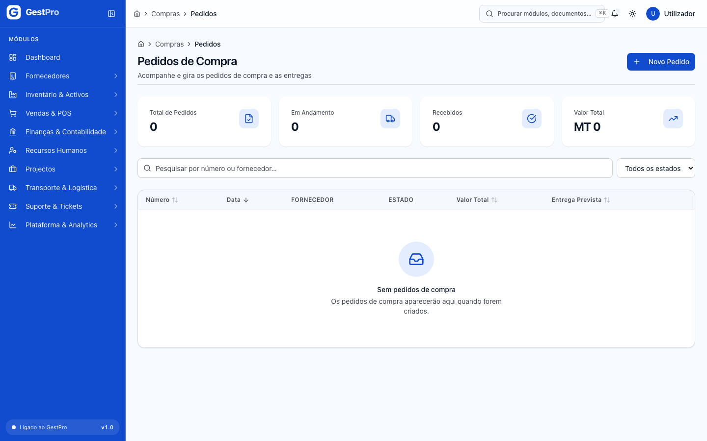
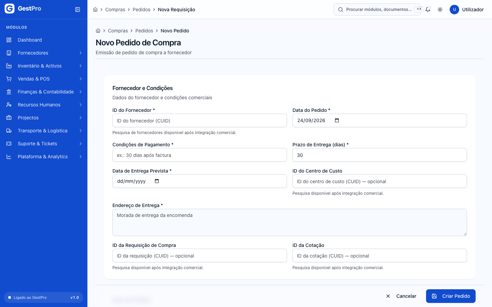

# 1. Compras

> **Para quem:** administrador, gestor, operador (consulta: financeiro, leitura) · **Onde:** menu › Compras & Procurement

## Objectivo do módulo

O módulo de Compras organiza o caminho de uma necessidade de compra até à mercadoria no armazém e à dívida ao fornecedor. Um colaborador regista uma **requisição** (o que é preciso, porquê e para quando) e submete-a para **aprovação**. Depois, a empresa pede preços a vários fornecedores (**cotação**), escolhe o vencedor, converte a requisição num **pedido de compra**, acompanha o pedido até à entrega e regista a **recepção** da mercadoria.

O objectivo é que **nenhuma compra aconteça sem justificação, aprovação e rasto**: quem pediu, quem aprovou, a que preço e a que fornecedor.

| | |
|---|---|
| **Que problema resolve** | Compras feitas «de boca» ou por WhatsApp, sem saber quem as autorizou nem se o preço era o melhor. |
| **Quem usa** | Quem precisa do material (Operador) pede; os aprovadores decidem; o Gestor cota e encomenda; a recepção regista-a o Gestor ou o Operador. |
| **O que entra** | A necessidade (itens, quantidades, preço estimado, justificação), as propostas dos fornecedores e as quantidades recebidas. |
| **O que sai** | Requisição aprovada, cotação adjudicada e pedido de compra numerados. Com a recepção completa, a conta a pagar ao fornecedor e o lançamento da dívida na contabilidade. A entrada no stock ainda se faz em Inventário (ver *Limites*). |
| **Liga-se a** | [Fornecedores](02-fornecedores-e-servicos.md) (quem vende e as contas a pagar), [Inventário](03-inventario.md) (onde entra a mercadoria), [Contabilidade](05-contabilidade.md) (a dívida ao fornecedor). |

O grupo **Compras & Procurement** aparece no menu lateral a quem tem permissão para consultar Compras. Quem não a tem não vê o grupo e, se abrir um endereço de Compras, vê o aviso «Sem permissão».

## Exemplo prático — reabastecer cimento e varão

**Situação:** a Ana Mabunda (Operador) nota que o cimento está a acabar e há uma obra grande a chegar. A Marta
Sitoe (Gestor) aprova as requisições da loja e quer comparar dois fornecedores antes de encomendar.

0. **Uma vez só, o administrador (ou um gestor) configura o circuito de aprovação** → [Como configurar um circuito de aprovação](#como-configurar-um-circuito-de-aprovação):
   Nome «Requisições — circuito geral», Tipo de documento **Requisições de compra**, **Nível 1** «Gerência»,
   Valor mínimo 0, Valor máximo 1 000 000, Quórum **Qualquer um**, aprovadora a Marta.

1. **A Ana regista a requisição** → [Como criar uma requisição de compra](#como-criar-uma-requisição-de-compra):

   | Campo | Valor |
   |---|---|
   | Prioridade | Alta |
   | Departamento | Loja |
   | Entrega Desejada | daqui a 5 dias |
   | Justificativa | «Stock de cimento abaixo do mínimo e obra da Construções Machava confirmada» |
   | Itens | Cimento Portland 50 kg · 200 · UN · 520,00 — Varão de aço 12 mm · 300 · UN · 380,00 |
   | **Valor Total Estimado** | **218 000,00 MZN** |

   Clica **Guardar Requisição** (fica **Rascunho**) e **Submeter para Aprovação**. Como há um circuito activo,
   a requisição passa a **Em Aprovação**.

2. **A Marta aprova** → [Como aprovar ou rejeitar uma requisição](#como-aprovar-ou-rejeitar-uma-requisição):
   no detalhe da requisição, **Aprovar…** › **Confirmar aprovação**. Como o circuito só tem um nível, a
   requisição fica **Aprovada**.

3. **A Marta pede preços a dois fornecedores** → [Como criar um pedido de cotação](#como-criar-um-pedido-de-cotação-rfq):
   Data de Validade +7 dias, **Requisição de Compra** escolhida pelo número, **Fornecedores a Convidar** a
   Cimentos do Índico e um segundo fornecedor, e os dois itens (200 UN e 300 UN). Clica **Criar Cotação**
   (fica **Rascunho**), abre a cotação e clica **Enviar aos fornecedores** (fica **Enviada**).

4. **Chegam as propostas** → [Como registar a resposta de um fornecedor](#como-registar-a-resposta-de-um-fornecedor):

   | Fornecedor | Cimento | Varão | Prazo | Condições | Valor total |
   |---|---:|---:|---|---|---:|
   | Cimentos do Índico | 520,00 | 380,00 | 3 dias | 30 dias após factura | 218 000,00 |
   | Segundo fornecedor | 540,00 | 395,00 | 5 dias | 30 dias | 226 500,00 |

   Com a primeira resposta, a cotação passa a **Respondida**.

5. **A Marta adjudica à Cimentos do Índico** (melhor preço e entrega em 3 dias)
   → [Como adjudicar uma cotação](#como-adjudicar-uma-cotação). A cotação fica **Adjudicada**.

6. **A Marta converte a requisição em pedido** → [Como converter uma requisição aprovada em pedido de compra](#como-converter-uma-requisição-aprovada-em-pedido-de-compra):
   no detalhe da requisição, **Converter em pedido**, escolhe a cotação e confirma. Nasce o pedido em
   **Rascunho** para a Cimentos do Índico, e a requisição passa a **Convertida**:

   | Linha | Qtd | Preço | IVA | Total |
   |---|---:|---:|---|---:|
   | Cimento Portland 50 kg | 200 | 520,00 | 16 % | 104 000,00 |
   | Varão de aço 12 mm | 300 | 380,00 | 16 % | 114 000,00 |
   | **Subtotal · IVA · Total** | | | | **218 000,00 · 34 880,00 · 252 880,00** |

   Condições de pagamento «30 dias após factura» e Prazo de entrega 3 dias, vindos da proposta vencedora.

7. **A Marta acompanha o pedido** → [Como enviar, confirmar e acompanhar um pedido de compra](#como-enviar-confirmar-e-acompanhar-um-pedido-de-compra):
   **Enviar pedido** (fica **Enviado**); quando o fornecedor confirma, **Confirmar pedido** (**Confirmado**);
   quando o camião sai, **Marcar em trânsito** (**Em Trânsito**).

8. **A mercadoria chega** → [Como registar a recepção de mercadoria](#como-registar-a-recepção-de-mercadoria):
   **Registar recepção**, Localização de destino «Armazém Central (ARM-01)», Guia de remessa com o número da
   guia do fornecedor, quantidades 200 e 300. O pedido passa a **Recebido**.

9. **A Ana dá entrada no stock** em [Inventário › Movimentações](03-inventario.md#como-dar-entrada-de-stock),
   com Tipo de documento **Recebimento de compra** e o número da guia. É preciso porque os itens do pedido
   não estão ligados a produtos do catálogo — ver [Limites desta versão](#limites-desta-versão).

**Resultado esperado:** a requisição está **Convertida**; a cotação **Adjudicada**, com «(vencedor)» ao lado
da Cimentos do Índico; o pedido de 252 880,00 MT está **Recebido**; em **Fornecedores › Contas a Pagar**
aparece uma conta **Aberta** de 252 880,00 MT à Cimentos do Índico («Compra via pedido …»), com vencimento
3 dias depois da recepção; a contabilidade tem o lançamento débito 211 Mercadorias / crédito 421 Fornecedores
c/c de 252 880,00 no diário de Compras; e o stock de `ARM-01` fica com 200 sacos e 300 varões.

## Conceitos

| Termo | O que é |
|---|---|
| Requisição de compra | Pedido interno de compra: departamento, prioridade, justificação e a lista de itens com preço estimado. Recebe um número automático. |
| Prioridade | Baixa, Média, Alta ou Urgente. Serve para ordenar e filtrar requisições. |
| Circuito de aprovação | Regra da empresa que diz quem aprova: um ou mais níveis, cada um com uma faixa de valor, um quórum e uma lista de aprovadores. Só pode haver um circuito activo por tipo de documento. |
| Quórum | Quantos aprovadores do nível têm de aprovar: **Qualquer um**, **Todos** ou **Maioria**. Uma rejeição rejeita sempre. |
| Aprovação | Decisão sobre a requisição, feita nível a nível. A requisição mostra o progresso em «x/y níveis». |
| Cotação (RFQ) | Pedido de preços enviado a um ou mais fornecedores, com os itens a cotar e uma data de validade. |
| Adjudicação | Escolha do fornecedor vencedor de uma cotação, entre os que responderam. |
| Pedido de compra | Encomenda formal a um fornecedor, com preços, IVA, condições de pagamento, prazo e endereço de entrega. |
| Recepção | Registo da mercadoria que chegou, com as quantidades por item. Quando o pedido fica totalmente recebido, o sistema cria a conta a pagar ao fornecedor. |

## Ecrãs

| Menu | Endereço (/rota) | Para que serve |
|---|---|---|
| (sem entrada no menu) | /compras | Painel de Compras: indicadores e atalhos |
| Requisições | /compras/requisicoes | Lista de requisições, com indicadores e filtros |
| Requisições › Nova Requisição | /compras/requisicoes/novo | Criar uma requisição |
| Requisições › (linha) | /compras/requisicoes/‹id› | Detalhe da requisição (separadores Itens, Aprovações e Histórico) |
| Requisições › Editar | /compras/requisicoes/‹id›/editar | Alterar uma requisição em rascunho |
| Requisição › Rejeitar… | /compras/requisicoes/‹id›/rejeitar | Rejeitar uma requisição, com motivo |
| Requisição › Converter em pedido | /compras/requisicoes/‹id›/converter | Criar o pedido de compra a partir da requisição aprovada |
| Cotações (RFQ) | /compras/cotacoes | Lista de cotações |
| Cotações › Nova Cotação | /compras/cotacoes/novo | Criar um pedido de cotação |
| Cotações › (linha) | /compras/cotacoes/‹id› | Detalhe da cotação (separadores Fornecedores e Itens) |
| Cotação › Registar resposta | /compras/cotacoes/‹id›/resposta | Registar a proposta de um fornecedor convidado |
| Cotação › Adjudicar | /compras/cotacoes/‹id›/adjudicar | Escolher o fornecedor vencedor |
| Pedidos de Compra | /compras/pedidos | Lista de pedidos de compra |
| Pedidos de Compra › Novo Pedido | /compras/pedidos/novo | Criar um pedido de compra sem passar pela requisição |
| Pedidos de Compra › (linha) | /compras/pedidos/‹id› | Detalhe do pedido (separador Itens, com as quantidades já recebidas) |
| Pedido › Registar recepção | /compras/pedidos/‹id›/receber | Registar a mercadoria recebida |
| Pedido › Cancelar pedido | /compras/pedidos/‹id›/cancelar | Cancelar o pedido, com motivo |
| Circuitos de aprovação | /compras/configuracoes/circuitos-aprovacao | Lista dos circuitos, com níveis, faixas de valor, quórum e aprovadores |
| Circuitos de aprovação › Novo circuito | /compras/configuracoes/circuitos-aprovacao/novo | Criar um circuito |
| Circuitos de aprovação › Editar | /compras/configuracoes/circuitos-aprovacao/‹id›/editar | Alterar, activar ou desactivar um circuito |

Endereços antigos que reencaminham para os actuais: `/procurement/...` (requisições, cotações, pedidos, aprovações, recebimentos), `/compras/recepcao` → Pedidos de Compra (a recepção faz-se no detalhe de cada pedido), `/compras/orcamentos` → Cotações, `/compras/fornecedores` e `/compras/documentos` → lista de fornecedores.

### Painel de Compras

Mostra quatro indicadores: **Requisições abertas**, **Pedidos em andamento**, **Fornecedores activos** e **Total requisições**. Tem ainda o botão **Nova Requisição** e atalhos para Requisições, Fornecedores, Pedidos e Serviços.

<!-- captura: 01-compras/painel.png | /compras -->

### Lista de requisições

No topo estão os indicadores **Total de Requisições**, **Pendentes de Aprovação**, **Aprovadas** e **Valor Total em Processo** (em MT). Por baixo, a caixa de pesquisa (*Pesquisar por número, solicitante ou departamento…*) e os filtros **Estado** e **Prioridade**.

A tabela tem as colunas Número, Data, Solicitante, Departamento, Prioridade, Estado, Valor Total e Aprovação. O botão **⋯** de cada linha dá acesso a **Ver detalhe**, **Editar** (só em rascunho), **Submeter** e **Cancelar**.

Se clicar numa linha, abre-se um painel lateral com o resumo da requisição. Para ver a página completa, use **Ver detalhe completo**.

<!-- captura: 01-compras/requisicoes-lista.png | /compras/requisicoes -->

## Tarefas

### Como configurar um circuito de aprovação

**Antes de começar:** precisa de permissão para configurar Compras (perfil Administrador ou Gestor). Sem circuito activo, uma requisição submetida fica aprovada de imediato.

1. Abra **Compras & Procurement › Circuitos de aprovação** e clique em **Novo circuito**.
2. Em **Circuito**, preencha:
   - **Nome** (por exemplo «Requisições — circuito geral»);
   - **Tipo de documento**: **Requisições de compra** ou **Pedidos de compra** (ver [Limites](#limites-desta-versão));
   - **Activo**: só pode haver um circuito activo por tipo.
3. Em **Nível 1**, preencha o **Nome do nível** (por exemplo «Chefia»), o **Valor mínimo (MT)**, o **Valor máximo (MT)** e o **Quórum** (Qualquer um, Todos ou Maioria).
4. Em **Aprovadores**, use **Adicionar aprovador…** e pesquise o utilizador por nome ou email. Repita para cada aprovador. Para retirar um, use o **X** ao lado do email.
5. Para mais níveis, use **Adicionar nível**. Para retirar o último nível, use **Remover nível**.
6. Clique em **Criar circuito**.

**Resultado:** aparece a mensagem «Circuito «‹nome›» criado.» e o circuito surge na lista, com os níveis, as faixas de valor, o quórum e os aprovadores (pelo email).

**Como funciona na submissão:** contam os níveis cuja faixa de valor inclui o valor da requisição. Se o valor estiver fora de todas as faixas, conta só o nível mais alto (a requisição nunca é aprovada sem decisão). Os níveis decidem-se por ordem: o nível seguinte só abre quando o anterior atinge o quórum.

**Editar ou desactivar:** na lista, clique em **Editar** no circuito, altere o que precisar (incluindo o interruptor **Activo**) e clique em **Guardar alterações**. Para desactivar sem editar, use **Desactivar…** e confirme com **Desactivar circuito**. As requisições submetidas a seguir deixam de usar esse circuito; sem outro activo do mesmo tipo, ficam aprovadas de imediato. Para voltar a activá-lo, edite-o.

### Como criar uma requisição de compra

**Antes de começar:** precisa do perfil Administrador, Gestor ou Operador.

1. Abra **Requisições** e clique em **Nova Requisição**. O botão também existe no painel `/compras`.
2. Na secção **Informações Gerais**, preencha:
   - **Data da Requisição** (por omissão, hoje);
   - **Prioridade** (Baixa, Média, Alta ou Urgente; por omissão, Média);
   - **Departamento** (obrigatório, por exemplo «Tecnologias de Informação»);
   - **Entrega Desejada** (opcional);
   - **Justificativa** (obrigatória, com pelo menos 10 caracteres);
   - **Observações** (opcional).
3. Na secção **Itens da Requisição**, preencha em cada linha a **Descrição do Item**, a **Quantidade**, a **Unidade** (UN, KG, L, M, M², CX, PC) e o **Preço Est. (MZN)**. O **Subtotal** de cada linha e o **Valor Total Estimado** são calculados automaticamente.
4. Para acrescentar linhas, use **Adicionar Item**. Para retirar uma linha, use o ícone de caixote do lixo (só aparece quando há mais de uma linha).
5. Clique em **Guardar Requisição**.

**Resultado:** aparece a mensagem «Requisição criada com sucesso!» e volta à lista. A requisição fica no estado **Rascunho**, com um número atribuído automaticamente. Se sair do formulário com alterações por guardar, o sistema pede confirmação.

> **Dica:** os preços estimados contam. Se a requisição for convertida em pedido de compra, são estes os preços que o pedido usa — ver [Como converter uma requisição aprovada em pedido de compra](#como-converter-uma-requisição-aprovada-em-pedido-de-compra).

<!-- captura: 01-compras/requisicao-nova.png | /compras/requisicoes/novo -->

### Como consultar uma requisição

1. Na lista de requisições, clique na linha. Abre-se o painel lateral com Solicitante, Departamento, Prioridade, Valor Total, Entrega Desejada e Aprovação.
2. Clique em **Ver detalhe completo**, ou use **⋯ › Ver detalhe**.

A página de detalhe tem três separadores:
- **Itens**: Descrição, Qtd., Unidade, Preço Est. e Subtotal, com o **Valor Total** no fim;
- **Aprovações**: uma linha por aprovador, com o **Nível**, o email do aprovador, o estado (Pendente, Aprovado ou Rejeitado), a data e as observações (numa rejeição, o motivo). Se não houver aprovações, aparece «Nenhum processo de aprovação iniciado.»;
- **Histórico**: a sequência das decisões («Aprovado por…», «Rejeitado por…», «Aguardando decisão de…»).

Ao lado estão os dados da requisição: Número, Data, Solicitante, Departamento, Prioridade, Entrega Desejada, Valor Total e Aprovação (níveis concluídos / total de níveis).

<!-- captura: 01-compras/requisicao-detalhe.png | /compras/requisicoes >primeiro -->

### Como editar uma requisição

**Antes de começar:** a requisição tem de estar em **Rascunho**. Precisa do perfil Administrador, Gestor ou Operador.

1. No detalhe da requisição, clique em **Editar** (ou use **⋯ › Editar** na lista).
2. Altere os campos de **Informações Gerais**: Data da Requisição, Prioridade, Departamento, Entrega Desejada, Justificativa e Observações.
3. Clique em **Guardar Alterações**.

**Resultado:** aparece a mensagem «Requisição actualizada com sucesso!». Se abrir o endereço de edição de uma requisição que já não está em rascunho, o sistema leva-o para o detalhe.

### Como submeter uma requisição para aprovação

**Antes de começar:** a requisição tem de estar em **Rascunho**. Precisa do perfil Administrador, Gestor ou Operador.

1. No detalhe, clique em **Submeter para Aprovação**. Na lista, use **⋯ › Submeter**.

**Resultado:** aparece a mensagem «Requisição submetida para aprovação com sucesso.». O que acontece a seguir depende da empresa:
- **se não houver um circuito activo para requisições**, a requisição passa logo a **Aprovada**;
- **se houver**, a requisição passa a **Em Aprovação** e são criadas as aprovações do primeiro nível que se aplica ao valor (visíveis no separador **Aprovações**). Ver [Como configurar um circuito de aprovação](#como-configurar-um-circuito-de-aprovação).

### Como aprovar ou rejeitar uma requisição

**Antes de começar:** a requisição tem de estar **Em Aprovação**, tem de ser um dos aprovadores do nível em curso, com a decisão ainda **Pendente**, e o seu perfil tem de permitir decidir aprovações (Administrador ou Gestor). Os botões só aparecem a quem cumpre estas condições.

**Para aprovar:**

1. Abra o detalhe da requisição e clique em **Aprovar…**.
2. Na janela «Aprovar a requisição ‹número›?», clique em **Confirmar aprovação**. Se mudar de ideias, use **Voltar**.

**Resultado:** aparece a mensagem «Requisição ‹número› aprovada (nível N).». Se o nível atingiu o quórum e é o último, a requisição passa a **Aprovada**; se há um nível seguinte, são criadas as aprovações desse nível e a requisição continua **Em Aprovação**; se o quórum ainda não foi atingido (por exemplo, quórum **Todos**), espera pelos outros aprovadores do nível.

**Para rejeitar:**

1. No detalhe, clique em **Rejeitar…**.
2. Em **Motivo da rejeição**, escreva o **Motivo** (obrigatório, até 1000 caracteres). É o que o solicitante lê no separador **Aprovações**.
3. Clique em **Rejeitar**. Para desistir, use **Cancelar**.

**Resultado:** aparece a mensagem «Requisição rejeitada.» e a requisição passa a **Rejeitada**. Basta uma rejeição, em qualquer nível, para rejeitar a requisição. Esta decisão não se desfaz: se a compra continuar necessária, crie uma nova requisição.

### Como cancelar uma requisição

**Antes de começar:** precisa do perfil Administrador ou Gestor. Pode cancelar uma requisição em Rascunho ou Aprovada (uma requisição Em Aprovação não se cancela; espere pela decisão).

1. No detalhe, clique em **Cancelar Requisição**. Na lista, use **⋯ › Cancelar**.
2. Na janela «Cancelar requisição?», escreva o **Motivo do cancelamento** (obrigatório, até 500 caracteres).
3. Clique em **Confirmar Cancelamento**. Se mudar de ideias, use **Voltar**.

**Resultado:** aparece a mensagem «Requisição cancelada.» e a requisição passa a **Cancelada**. Esta acção não pode ser revertida.

### Como criar um pedido de cotação (RFQ)

**Antes de começar:** precisa do perfil Administrador ou Gestor. Os fornecedores a convidar têm de estar registados em [Fornecedores](02-fornecedores-e-servicos.md#como-registar-um-fornecedor).

1. Abra **Cotações (RFQ)** e clique em **Nova Cotação**.
2. Em **Dados da Cotação**, indique a **Data de Validade** (obrigatória).
3. Se a cotação vem de uma requisição, escolha-a em **Requisição de Compra**: pesquise pelo número ou pelo departamento. É esta ligação que permite, depois, converter a requisição em pedido.
4. Em **Fornecedores a Convidar**, pesquise cada fornecedor por nome, código ou NUIT e escolha-o. Os escolhidos aparecem por baixo do campo; para retirar um, use o **X** ao lado do nome. Precisa de pelo menos um convidado para poder enviar a cotação.
5. Em **Itens da Cotação**, preencha para cada item a **Descrição**, a **Qtd**, a **Unidade** e, se quiser, as **Especificações**. Use **Adicionar item** para mais linhas. Os itens não são copiados da requisição: escreva-os.
6. Em **Observações**, escreva as notas para os fornecedores (opcional).
7. Clique em **Criar Cotação**.

**Resultado:** aparece a mensagem «Cotação criada com sucesso.». A cotação fica em **Rascunho**. Na lista, a coluna **Fornecedores** mostra respostas recebidas / fornecedores convidados.

A lista de cotações tem os indicadores **Total de cotações**, **Em aberto**, **Com resposta** e **Adjudicadas**, a pesquisa por número e o filtro **Estado**. Clique numa linha (ou use **⋯ › Ver detalhe**) para abrir a cotação.

<!-- captura: 01-compras/cotacoes-lista.png | /compras/cotacoes -->

<!-- captura: 01-compras/cotacao-nova.png | /compras/cotacoes/novo -->

### Como enviar ou cancelar uma cotação

**Antes de começar:** precisa do perfil Administrador ou Gestor.

O detalhe da cotação tem dois separadores: **Fornecedores** (cada convidado, com o estado do convite, a data da resposta, o prazo e o valor total da proposta) e **Itens** (cada item com as respostas recebidas: preço unitário × quantidade = subtotal). Ao lado estão o Número, a Data, a Validade, as Respostas (recebidas / convidados) e, depois de adjudicada, o Vencedor.

**Para enviar:** com a cotação em **Rascunho**, clique em **Enviar aos fornecedores**. Aparece a mensagem «Cotação enviada aos fornecedores.» e a cotação passa a **Enviada**. O sistema regista o envio, mas não manda emails: faça chegar o pedido de preços a cada fornecedor pelo meio habitual.

**Para cancelar:** com a cotação em Rascunho, Enviada ou Respondida, clique em **Cancelar cotação** e confirme com **Cancelar cotação** na janela. Aparece a mensagem «Cotação cancelada.» e a cotação passa a **Cancelada**: deixa de aceitar respostas ou adjudicação. Esta acção não pode ser revertida.

### Como registar a resposta de um fornecedor

**Antes de começar:** a cotação tem de estar **Enviada** ou **Respondida**. Precisa do perfil Administrador ou Gestor.

1. No detalhe da cotação, separador **Fornecedores**, clique em **Registar resposta** na linha do fornecedor.
2. Em **Preços por item**, indique o **Preço unitário** proposto para cada item, em MZN.
3. Em **Condições**, indique o **Prazo de entrega (dias)** (obrigatório) e, se quiser, as **Condições de pagamento** (por exemplo «30 dias»).
4. Clique em **Registar resposta**.

**Resultado:** aparece a mensagem «Resposta registada.». O fornecedor passa a **Respondida**, com o valor total da proposta (soma de preço × quantidade de cada item, sem IVA). Com a primeira resposta, a cotação passa a **Respondida**. Se registar outra vez a resposta do mesmo fornecedor, o formulário abre com os valores anteriores e a nova resposta substitui-os.

### Como adjudicar uma cotação

**Antes de começar:** a cotação tem de estar **Respondida**. Precisa do perfil Administrador ou Gestor.

1. No detalhe da cotação, clique em **Adjudicar**.
2. Em **Fornecedor vencedor**, escolha um dos fornecedores. Só aparecem os que responderam, cada um com o valor total e o prazo da proposta.
3. Clique em **Adjudicar**.

**Resultado:** aparece a mensagem «Cotação adjudicada.». A cotação passa a **Adjudicada** e o vencedor aparece com «(vencedor)» no separador **Fornecedores**.

### Como converter uma requisição aprovada em pedido de compra

**Antes de começar:** a requisição tem de estar **Aprovada** e ter pelo menos uma cotação **Adjudicada** ligada a ela (escolhida no campo **Requisição de Compra** da cotação). Precisa do perfil Administrador ou Gestor.

1. No detalhe da requisição, clique em **Converter em pedido**.
2. Em **Cotação adjudicada**, escolha a cotação. Cada opção mostra o número, o fornecedor vencedor, o valor total e o prazo da proposta. Se só houver uma, já vem escolhida.
3. Clique em **Converter em pedido**.

**Resultado:** aparece a mensagem «Pedido ‹número› criado em rascunho.» e abre o detalhe do pedido. O pedido nasce assim:
- **Fornecedor:** o vencedor da cotação;
- **Itens:** os da requisição, com as quantidades e os **preços estimados da requisição** (não os preços da proposta);
- **IVA:** a taxa do produto, quando o item está ligado a um; senão, 16%;
- **Condições de pagamento** e **Prazo de entrega:** os da proposta vencedora (na falta, «30 dias» e 30 dias); a **Entrega prevista** é hoje mais esse prazo;
- **Endereço de entrega:** «A definir».

A requisição passa a **Convertida** e o pedido mostra a ligação **Ver requisição** e **Ver cotação**.

Se a requisição não tiver nenhuma cotação adjudicada, o ecrã mostra «Sem cotações adjudicadas» e o botão **Voltar à requisição**.

### Como criar um pedido de compra

Use este formulário para encomendar sem passar por uma requisição (por exemplo, uma reposição combinada directamente com o fornecedor). Para uma requisição aprovada, prefira [convertê-la](#como-converter-uma-requisição-aprovada-em-pedido-de-compra): assim a requisição fica **Convertida**.

**Antes de começar:** precisa do perfil Administrador ou Gestor. O fornecedor tem de estar registado em [Fornecedores](02-fornecedores-e-servicos.md#como-registar-um-fornecedor).

1. Abra **Pedidos de Compra** e clique em **Novo Pedido**.
2. Em **Fornecedor e Condições**, preencha:
   - **Fornecedor** (obrigatório): pesquise por nome, código ou NUIT;
   - **Data do Pedido** (por omissão, hoje);
   - **Condições de Pagamento** (obrigatório, por exemplo «30 dias após factura»);
   - **Prazo de Entrega (dias)** (obrigatório);
   - **Data de Entrega Prevista** (obrigatória);
   - **Centro de Custo** (opcional);
   - **Endereço de Entrega** (obrigatório);
   - opcionalmente, a **Requisição de Compra** (pesquisa pelo número ou departamento) e a **Cotação** (pesquisa pelo número) de origem, só como referência.
3. Em **Itens do Pedido**, preencha para cada linha a Descrição, a Qtd, a Unidade, o Preço Unit., o Desc. (desconto em MZN) e o IVA % (16% ou 0% (isento)). O total da linha, o **Subtotal**, o **IVA** e o **Total** são calculados automaticamente.
4. Em **Observações**, escreva as notas para o fornecedor (opcional).
5. Clique em **Criar Pedido**.

**Resultado:** aparece a mensagem «Pedido de compra criado com sucesso.». O pedido fica em **Rascunho**, com número automático.

A lista de pedidos tem os indicadores **Total de Pedidos**, **Em Andamento**, **Recebidos** e **Valor Total**, a pesquisa por número ou fornecedor e o filtro **Estado**. As colunas são Número, Data, Fornecedor, Estado, Valor Total e Entrega Prevista. Clique numa linha (ou use **⋯ › Ver detalhe**) para abrir o pedido.

<!-- captura: 01-compras/pedidos-lista.png | /compras/pedidos -->

<!-- captura: 01-compras/pedido-novo.png | /compras/pedidos/novo -->

### Como enviar, confirmar e acompanhar um pedido de compra

**Antes de começar:** precisa do perfil Administrador ou Gestor.

O detalhe do pedido mostra, no separador **Itens**, a Descrição, a Qtd., o **Recebido**, a Unidade, o Preço unit., o IVA e o Subtotal, com o Subtotal, o IVA e o Valor total no fim. Ao lado estão o Número, a Data, o Fornecedor, a Entrega prevista, o Prazo de entrega, as Condições de pagamento, o Endereço de entrega e, quando existem, as ligações à requisição e à cotação e as Observações.

O pedido avança um passo de cada vez, com um botão por estado:

| Estado actual | Botão | Mensagem | Novo estado |
|---|---|---|---|
| Rascunho | **Enviar pedido** | «Pedido enviado ao fornecedor.» | Enviado |
| Enviado | **Confirmar pedido** (quando o fornecedor confirma) | «Pedido confirmado pelo fornecedor.» | Confirmado |
| Confirmado | **Marcar em trânsito** (quando a mercadoria sai do fornecedor) | «Pedido marcado em trânsito.» | Em Trânsito |

Como na cotação, **Enviar pedido** regista o envio mas não manda o pedido ao fornecedor: faça-o chegar pelo meio habitual. Nesta versão não há ecrã para editar um pedido depois de criado.

**Para cancelar:** com o pedido em Rascunho, Enviado ou Confirmado, clique em **Cancelar pedido**. Em **Motivo do cancelamento**, escreva o **Motivo** (obrigatório, até 500 caracteres) e clique em **Cancelar pedido**. Aparece a mensagem «Pedido cancelado.» e o pedido passa a **Cancelado**. O motivo junta-se às observações do pedido. Um pedido Em Trânsito já não se cancela.

### Como registar a recepção de mercadoria

**Antes de começar:** o pedido tem de estar **Em Trânsito** ou **Parcialmente Recebido**. Precisa do perfil Administrador, Gestor ou Operador. A localização de destino tem de existir e estar activa (ver [Inventário](03-inventario.md#como-criar-uma-localização)).

1. No detalhe do pedido, clique em **Registar recepção**.
2. Em **Recepção**, preencha:
   - **Localização de destino \***: escolha o armazém (por exemplo «Armazém Central (ARM-01)»);
   - **Data da recepção \*** (por omissão, hoje);
   - **Guia de remessa**: o número da guia do fornecedor (opcional).
3. Em **Quantidades recebidas**, cada item ainda por receber mostra o que foi pedido, o que já foi recebido e o que está em falta. Indique a quantidade que chegou nesta entrega e deixe a 0 os itens que não chegaram.
4. Clique em **Registar recepção**.

**Resultado:** aparece a mensagem «Recepção registada.» e volta ao detalhe do pedido, onde a coluna **Recebido** foi actualizada. O pedido passa a:
- **Parcialmente Recebido**, se ainda falta mercadoria (pode registar outra recepção mais tarde, só para o que falta);
- **Recebido**, se todos os itens ficaram recebidos na totalidade.

Não é possível receber mais do que o encomendado.

**Efeitos noutros módulos:**
- **Fornecedores › Contas a Pagar:** quando o pedido fica **Recebido**, o sistema cria uma conta a pagar **Aberta** ao fornecedor, com descrição «Compra via pedido ‹número›», o valor total do pedido (com IVA) e vencimento igual à data em que regista a recepção que completa o pedido mais o **Prazo de entrega** do pedido. Uma recepção parcial ainda não cria conta a pagar. Ver [Fornecedores e Serviços](02-fornecedores-e-servicos.md#como-consultar-as-contas-a-pagar).
- **Contabilidade:** com a conta a pagar, fica o lançamento de reconhecimento da dívida no diário de Compras: débito *211 Mercadorias* e crédito *421 Fornecedores c/c*, pelo valor total do pedido. Não é lançado IVA dedutível. Se o período contabilístico estiver fechado, a recepção que completa o pedido é recusada. Ver [Contabilidade](05-contabilidade.md).
- **Inventário:** só os itens ligados a um produto do catálogo dão entrada no stock, na localização escolhida. Os itens criados nos formulários de Compras não têm produto (o ecrã mostra «sem produto (não entra em stock)»), por isso dê entrada em [Inventário › Movimentações](03-inventario.md#como-dar-entrada-de-stock) — ver [Limites](#limites-desta-versão).

### Limites desta versão

- **Stock:** os formulários de requisição, cotação e pedido não ligam os itens a produtos do catálogo. Por isso a recepção não dá entrada no stock desses itens: registe a entrada em [Inventário › Movimentações](03-inventario.md#como-dar-entrada-de-stock), com Tipo de documento **Recebimento de compra** e o número da guia.
- **Rejeitar mercadoria na recepção:** o ecrã regista apenas as quantidades recebidas, todas aceites. Não há campos para quantidades rejeitadas nem motivo de rejeição.
- **Preços do pedido convertido:** a conversão usa os preços estimados da requisição, não os da proposta adjudicada, e o endereço de entrega fica «A definir». Como não há ecrã para editar um pedido, se os preços forem diferentes, crie o pedido em **Novo Pedido** em vez de converter.
- **Circuitos para pedidos de compra:** é possível criar um circuito do tipo **Pedidos de compra**, mas enviar um pedido não inicia nenhuma aprovação. Só os circuitos de requisições têm efeito.
- **IVA dedutível:** a conta a pagar criada pela recepção não regista o IVA dedutível, porque a factura do fornecedor costuma chegar depois. Não há ainda caminho para o completar.
- **Validade das cotações:** quando a data de validade passa, a cotação não muda sozinha para **Vencida**.

## Estados

### Requisição de compra

| Estado | Significado | Pode passar a | Quem |
|---|---|---|---|
| Rascunho | Criada, ainda editável | Aprovada ou Em Aprovação (ao submeter), Cancelada | Submeter: Administrador, Gestor, Operador. Cancelar: Administrador, Gestor |
| Pendente | Estado intermédio da submissão (não fica visível na prática) | Em Aprovação, Cancelada | — |
| Em Aprovação | À espera da decisão dos aprovadores do nível em curso | Aprovada, Rejeitada | Aprovadores do nível (**Aprovar…** / **Rejeitar…**) |
| Aprovada | Pode seguir para cotação e pedido | Convertida, Cancelada | Converter: Administrador, Gestor. Cancelar: Administrador, Gestor |
| Rejeitada | Recusada por um aprovador, com motivo (final) | — | — |
| Cancelada | Cancelada com motivo (final) | — | — |
| Convertida | Deu origem a um pedido de compra (final) | — | — |

### Cotação

| Estado | Significado | Pode passar a | Quem |
|---|---|---|---|
| Rascunho | Criada, ainda não enviada | Enviada, Cancelada | Administrador, Gestor (**Enviar aos fornecedores**, **Cancelar cotação**) |
| Enviada | Enviada aos fornecedores | Respondida, Cancelada | Administrador, Gestor (**Registar resposta**, **Cancelar cotação**) |
| Respondida (filtro: «Com resposta») | Pelo menos um fornecedor respondeu | Adjudicada, Cancelada | Administrador, Gestor (**Adjudicar**, **Cancelar cotação**) |
| Adjudicada | Fornecedor vencedor escolhido (final) | — | — |
| Vencida | A data de validade passou (final). Nesta versão não é atribuída automaticamente | — | — |
| Cancelada | Cancelada (final) | — | — |

Cada fornecedor convidado tem também um estado próprio, no separador **Fornecedores**: **Pendente** até ser registada a sua resposta, e depois **Respondida**.

### Pedido de compra

| Estado | Significado | Pode passar a | Quem |
|---|---|---|---|
| Rascunho | Criado, ainda não enviado | Enviado, Cancelado | Administrador, Gestor (**Enviar pedido**, **Cancelar pedido**) |
| Enviado | Enviado ao fornecedor | Confirmado, Cancelado | Administrador, Gestor (**Confirmar pedido**, **Cancelar pedido**) |
| Confirmado | O fornecedor confirmou | Em Trânsito, Cancelado | Administrador, Gestor (**Marcar em trânsito**, **Cancelar pedido**) |
| Em Trânsito | Mercadoria a caminho; aceita recepções | Parcialmente Recebido, Recebido | Administrador, Gestor, Operador (**Registar recepção**) |
| Parcialmente Recebido (filtro: «Recebido Parcial») | Parte da mercadoria recebida; aceita mais recepções | Recebido | Administrador, Gestor, Operador (**Registar recepção**) |
| Recebido (filtro: «Recebido Total») | Tudo recebido; gerou a conta a pagar (final) | — | — |
| Cancelado | Cancelado com motivo (final) | — | — |

## Erros frequentes

| Mensagem mostrada | Porquê | O que fazer |
|---|---|---|
| Departamento obrigatório | O campo Departamento está vazio | Indique o departamento |
| Justificativa obrigatória (mín. 10 caracteres) | A justificação tem menos de 10 caracteres | Escreva uma justificação mais completa |
| Descrição obrigatória | Um item não tem descrição | Descreva o item ou remova a linha |
| Valor deve ser positivo | Na requisição, uma quantidade igual a zero | Indique uma quantidade maior que zero |
| Quantidade positiva · Preço positivo | Na cotação ou no pedido, uma linha com quantidade ou preço unitário a zero | Indique valores maiores que zero |
| Indique o motivo do cancelamento. | Tentou cancelar uma requisição ou um pedido sem motivo | Escreva o motivo |
| Indique o motivo da rejeição. | Tentou rejeitar uma requisição sem motivo | Escreva o motivo |
| A requisição já não está em aprovação; a decisão já não conta. | Outro aprovador já decidiu (por exemplo, com quórum Qualquer um) ou a requisição mudou de estado | Actualize a página e veja o separador **Aprovações** |
| Aprovação não encontrada ou já decidida | A sua decisão já foi registada, ou não é aprovador deste nível | Actualize a página |
| Apenas requisições em rascunho podem ser actualizadas | A requisição já foi submetida | Não é possível editar; crie uma nova requisição, se necessário |
| Transição inválida de RequisicaoCompra: … | A acção não é permitida no estado actual (por exemplo, cancelar uma requisição Em Aprovação) | Verifique o estado da requisição e actualize a página |
| Já existe um circuito activo para este tipo de documento ("…"). Desactive-o antes de activar outro. | Tentou activar um segundo circuito do mesmo tipo | Desactive o circuito existente ou guarde o novo como inactivo |
| Workflow "…" já existe | Já há um circuito com esse nome | Escolha outro nome |
| Pelo menos um aprovador | Um nível do circuito não tem aprovadores | Adicione pelo menos um aprovador a cada nível |
| valorMaximo deve ser maior que valorMinimo em cada nível | Num nível, o Valor máximo não é maior que o Valor mínimo | Corrija a faixa de valores |
| Data de validade obrigatória | Nova cotação sem data de validade | Escolha a data de validade |
| Convide pelo menos um fornecedor antes de enviar a cotação | A cotação não tem fornecedores convidados | Crie uma nova cotação com os fornecedores a convidar (não se acrescentam convidados depois de criada) |
| Indique o preço unitário · O preço tem de ser positivo | Na resposta do fornecedor, um item sem preço ou com preço zero | Preencha o preço de todos os itens |
| Indique o prazo de entrega em dias · O prazo tem de ser positivo | Na resposta do fornecedor, prazo vazio ou zero | Indique o prazo em dias |
| Requisição não está aprovada (já foi convertida?) | A requisição já foi convertida noutro pedido (por exemplo, clique duplo) ou mudou de estado | Abra a requisição e siga a ligação para o pedido existente |
| Fornecedor obrigatório | Novo pedido sem fornecedor escolhido | Escolha o fornecedor no campo **Fornecedor** |
| Condições de pagamento obrigatórias · Endereço de entrega obrigatório · Data prevista obrigatória | Campos obrigatórios do pedido por preencher | Preencha os campos assinalados |
| Escolha a localização de destino. | Recepção sem localização | Escolha a localização de destino |
| Indique a quantidade recebida de pelo menos um item. | Todas as quantidades estão a 0 | Indique o que chegou |
| Só faltam receber N ‹unidade›. | Escreveu mais do que está em falta nesse item | Corrija a quantidade |
| A localização de destino está inactiva | A localização escolhida foi desactivada | Escolha outra localização ou reactive-a em Inventário |
| Pedido não está em trânsito | Tentou receber um pedido que não está Em Trânsito nem Parcialmente Recebido | No detalhe, use **Marcar em trânsito** primeiro |
| Sem permissão para esta operação | O seu perfil não permite esta acção | Peça a acção a um gestor ou administrador |
| Dados inválidos | Algum dado não passou na validação | Reveja os campos do formulário |

## Perguntas frequentes

**Submeti a requisição e ela ficou logo «Aprovada». É normal?**
Sim, se a empresa não tiver um circuito activo para requisições. Para exigir aprovação, configure um circuito — ver [Como configurar um circuito de aprovação](#como-configurar-um-circuito-de-aprovação).

**Sou aprovador, mas não vejo os botões Aprovar… e Rejeitar…. Porquê?**
Os botões só aparecem com a requisição **Em Aprovação**, no nível em curso, e se a sua decisão ainda estiver pendente. Se o circuito tem vários níveis, o seu só abre quando o anterior estiver aprovado.

**Porque é que o Solicitante aparece como «Utilizador» seguido de quatro caracteres?**
Nesta versão o sistema guarda um nome abreviado do utilizador que criou a requisição, em vez do nome completo.

**Recebi a mercadoria mas o stock não mudou. Porquê?**
Os itens criados em Compras não estão ligados a produtos do catálogo, por isso a recepção não mexe no stock. Dê entrada em [Inventário › Movimentações](03-inventario.md#como-dar-entrada-de-stock).

**Registei uma recepção parcial e não apareceu a conta a pagar. É normal?**
Sim. A conta a pagar só é criada quando o pedido fica **Recebido** (todos os itens recebidos), pelo valor total do pedido.

**Onde registo o pagamento ao fornecedor?**
Em **Fornecedores › Contas a Pagar**. Veja [Fornecedores e Serviços](02-fornecedores-e-servicos.md#como-registar-um-pagamento-a-um-fornecedor).
