# 2. Fornecedores e Serviços

> **Para quem:** administrador, gestor (pagamentos e fornecedores); operador (serviços e agendamentos); financeiro e leitura (consulta) · **Onde:** menu › Fornecedores

## Para que serve

Este grupo reúne três áreas. A ficha de cada **fornecedor**, com contactos e documentos. As **contas a pagar** a fornecedores e o registo dos respectivos pagamentos. O catálogo de **serviços** que a empresa presta a clientes, com os **agendamentos** e os **contratos** de serviço recorrentes.

Os pagamentos a fornecedores ficam registados automaticamente na contabilidade.

## Conceitos

| Termo | O que é |
|---|---|
| Fornecedor | Empresa ou pessoa a quem a empresa compra. Identificado por NUIT (único na empresa) e por um código automático (FOR-0001, FOR-0002…). |
| Classificação | Preferencial, Regular ou Novo. Serve para filtrar e destacar fornecedores. |
| Contacto | Pessoa de contacto do fornecedor (Principal, Secundário, Técnico ou Financeiro). |
| Documento | Ficheiro guardado na ficha do fornecedor (Contrato, NUIT, Certificação ou Outro), com validade opcional. |
| Conta a pagar | Valor em dívida a um fornecedor, com data de vencimento. Mostra o valor original, o valor pago e o valor restante. |
| Pagamento | Liquidação, total ou parcial, de uma conta a pagar. Cada pagamento gera um lançamento contabilístico. |
| Serviço | Item do catálogo de serviços (instalação, manutenção, reparação…), com preço, IVA e duração. |
| Agendamento | Marcação de um serviço para um cliente, com data, horas e local. Código automático AGD-00001… |
| Contrato de serviço | Acordo recorrente com um cliente (mensal, trimestral, semestral ou anual) para um ou mais serviços. Código automático CTRT-0001… |

## Ecrãs

| Menu | Endereço (/rota) | Para que serve |
|---|---|---|
| Lista de Fornecedores | /fornecedores/lista | Lista de fornecedores, com indicadores e filtros (`/fornecedores` leva aqui) |
| Lista de Fornecedores › Novo Fornecedor | /fornecedores/novo | Registar um fornecedor |
| Lista de Fornecedores › (linha) | /fornecedores/‹id› | Ficha do fornecedor (Informações, Contactos, Documentos) |
| Ficha › Editar | /fornecedores/‹id›/editar | Alterar os dados do fornecedor |
| Ficha › Gerir contactos | /fornecedores/‹id›/contactos | Acrescentar, editar e remover contactos |
| Ficha › Gerir documentos | /fornecedores/‹id›/documentos | Carregar e remover documentos |
| Contas a Pagar | /fornecedores/contas-pagar | Lista das contas a pagar |
| Contas a Pagar › (linha) | /fornecedores/contas-pagar/‹id› | Detalhe da conta e dos pagamentos |
| Conta › Registar pagamento | /fornecedores/contas-pagar/‹id›/pagar | Registar um pagamento |
| Conta › Cancelar conta | /fornecedores/contas-pagar/‹id›/cancelar | Cancelar a conta, com motivo |
| Serviços | /servicos/lista | Catálogo de serviços (`/servicos` leva aqui) |
| Serviços › Novo Serviço | /servicos/novo | Criar um serviço |
| Serviços › (linha) | /servicos/lista/‹id› | Detalhe do serviço (Informações, Avaliações) |
| Agendamentos | /servicos/agendamentos | Lista de agendamentos |
| Agendamentos › Novo Agendamento | /servicos/agendamentos/novo | Agendar um serviço |
| Contratos | /servicos/contratos | Lista de contratos de serviço |
| Contratos › Novo Contrato | /servicos/contratos/novo | Criar um contrato |
| (sem entrada no menu) | /servicos/categorias | Categorias de serviço (lista e **Nova Categoria**) |

## Tarefas

### Como consultar os fornecedores

1. Abra **Fornecedores › Lista de Fornecedores**.
2. Consulte os indicadores **Total de Fornecedores**, **Fornecedores Activos**, **Fornecedores Preferenciais** e **Total em Compras**.
3. Use a pesquisa (*Pesquisar por nome, NUIT ou código…*) e os filtros **Estado**, **Classificação** e **Tipo** (Pessoa Física ou Pessoa Jurídica).

A tabela mostra Código, Nome, Email, Classificação, Estado, Total Compras e Última Compra. O botão **⋯** dá acesso a **Ver detalhe**, **Editar** e **Arquivar**.

<!-- captura: 02-fornecedores-e-servicos/fornecedores-lista.png | /fornecedores/lista -->
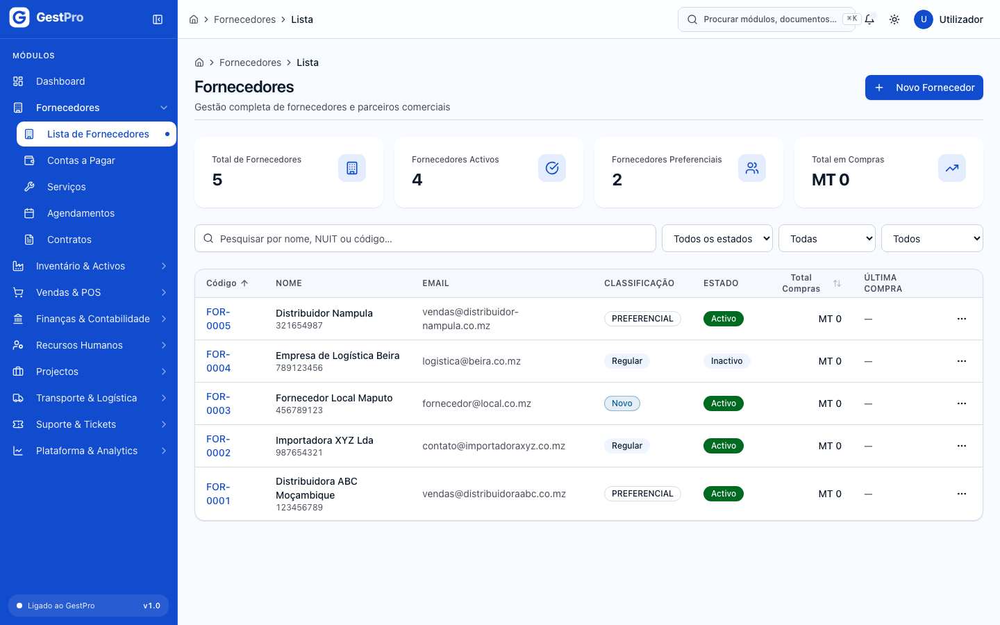

### Como registar um fornecedor

**Antes de começar:** precisa do perfil Administrador ou Gestor. Tenha à mão o NUIT do fornecedor (9 dígitos).

1. Na lista, clique em **Novo Fornecedor**.
2. Em **Identificação**, preencha:
   - **Código**: o sistema atribui sempre um código automático FOR-0001…, independentemente do que escrever aqui;
   - **Tipo**: Pessoa Física ou Pessoa Jurídica;
   - **Nome / Razão Social** (obrigatório);
   - **NUIT** (obrigatório, 9 dígitos);
   - **Email** (obrigatório);
   - **Telefone**.
3. Em **Condições Comerciais**, escolha a **Classificação** (por omissão, Regular) e preencha **Dias para Pagamento** (por omissão, 30), **Condições de Pagamento** e **Observações**.
4. Em **Contactos** (opcional), use **Adicionar contacto** e preencha Nome, Cargo, Tipo, Email e Telefone. Pode também acrescentar contactos mais tarde.
5. Clique em **Guardar Fornecedor**.

**Resultado:** aparece a mensagem «Fornecedor criado com sucesso!». O fornecedor fica no estado **Activo**.

<!-- captura: 02-fornecedores-e-servicos/fornecedor-novo.png | /fornecedores/novo -->
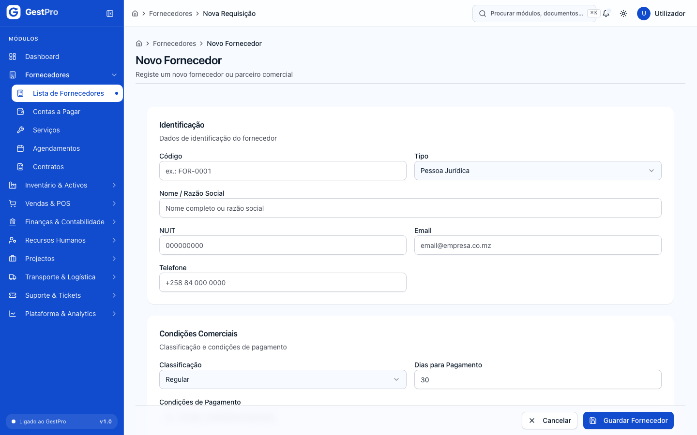

### Como consultar e editar a ficha de um fornecedor

1. Na lista, clique no fornecedor. A ficha tem os separadores **Informações**, **Contactos** e **Documentos**. Ao lado aparecem o Código, NUIT, Email, Telefone, Classificação, Total Compras, Avaliação e Última Compra.
2. Para alterar dados, clique em **Editar** (perfil Administrador ou Gestor). Aqui pode também mudar o **Estado** (Activo, Inactivo ou Suspenso).
3. Clique em **Guardar Alterações**.

**Resultado:** aparece a mensagem «Fornecedor actualizado com sucesso!».

> **Dica:** o endereço da ficha termina no **identificador** do fornecedor (por exemplo `/fornecedores/cm4abc…`). É esse identificador que se pede nos formulários de cotação e de pedido de compra. Veja [Compras](01-compras.md).

<!-- captura: 02-fornecedores-e-servicos/fornecedor-detalhe.png | /fornecedores/lista >primeiro -->
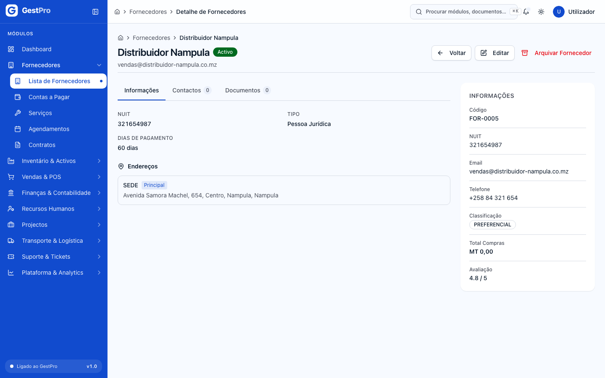

### Como gerir os contactos de um fornecedor

**Antes de começar:** precisa do perfil Administrador ou Gestor.

1. Na ficha, abra o separador **Contactos** e clique em **Gerir contactos**.
2. Para acrescentar um contacto, clique em **Novo contacto** e preencha **Nome**, **Cargo**, **Tipo**, **Email** e **Telefone**. O interruptor **Contacto activo** controla se o contacto aparece como preferencial.
3. Clique em **Guardar Contacto**. Aparece a mensagem «Contacto adicionado.».
4. Para alterar um contacto, use o ícone de lápis na linha. Para o remover, use o ícone de caixote do lixo e confirme com **Remover**. A remoção é definitiva.

### Como carregar documentos de um fornecedor

**Antes de começar:** precisa do perfil Administrador ou Gestor. Aceita PDF, imagens ou ficheiros Office até 10 MB.

1. Na ficha, abra o separador **Documentos** e clique em **Gerir documentos**. Depois clique em **Carregar documento**.
2. Escolha o **Tipo de documento** (Contrato, NUIT, Certificação ou Outro) e, se quiser, a **Validade (opcional)**.
3. Clique na área **Carregar documento do fornecedor** e escolha o ficheiro.

**Resultado:** aparece a mensagem «Documento carregado com sucesso.» e o documento surge na lista (Nome, Tipo, Data Upload, Validade). Clique no nome para o descarregar. Para remover, use o ícone de caixote do lixo e confirme. O ficheiro é apagado definitivamente.

### Como arquivar um fornecedor

**Antes de começar:** precisa do perfil Administrador ou Gestor.

1. Na ficha, clique em **Arquivar Fornecedor**. Na lista, use **⋯ › Arquivar**.
2. Confirme com **Confirmar Arquivo**.

**Resultado:** aparece a mensagem «Fornecedor arquivado com sucesso.». O fornecedor passa a **Inactivo** e desaparece da lista.

> **Atenção:** a janela de confirmação diz que a acção pode ser revertida editando o fornecedor. Nesta versão, porém, o fornecedor arquivado deixa de aparecer na lista, mesmo que depois lhe mude o estado. Arquive apenas fornecedores de que já não precisa. Se quiser só suspender temporariamente, use **Editar** e mude o **Estado** para Suspenso ou Inactivo.

### Como consultar as contas a pagar

1. Abra **Fornecedores › Contas a Pagar**.
2. Consulte os indicadores:
   - **Total de contas**;
   - **A pagar**: soma do valor restante das contas no estado Aberta;
   - **Vencidas**: contas por pagar com o vencimento já ultrapassado;
   - **Liquidadas**.
3. Use a pesquisa (*Pesquisar por número ou fornecedor…*) e o filtro **Estado**.

A tabela mostra Número, Fornecedor, Descrição, Vencimento, Estado e Restante. No detalhe da conta aparecem o Fornecedor (com ligação para a ficha), a Emissão, o Vencimento (com «· N dias de atraso» se estiver fora de prazo), o Valor original, o Valor pago e o Valor restante, além do separador **Pagamentos**.

**De onde vêm as contas:** o sistema cria uma conta a pagar automaticamente quando um pedido de compra fica totalmente recebido (ver [Compras](01-compras.md)). Nesta versão não há ecrã para criar contas a pagar à mão. As contas que vê nos dados de demonstração foram carregadas com esses dados.

<!-- captura: 02-fornecedores-e-servicos/contas-pagar-lista.png | /fornecedores/contas-pagar -->
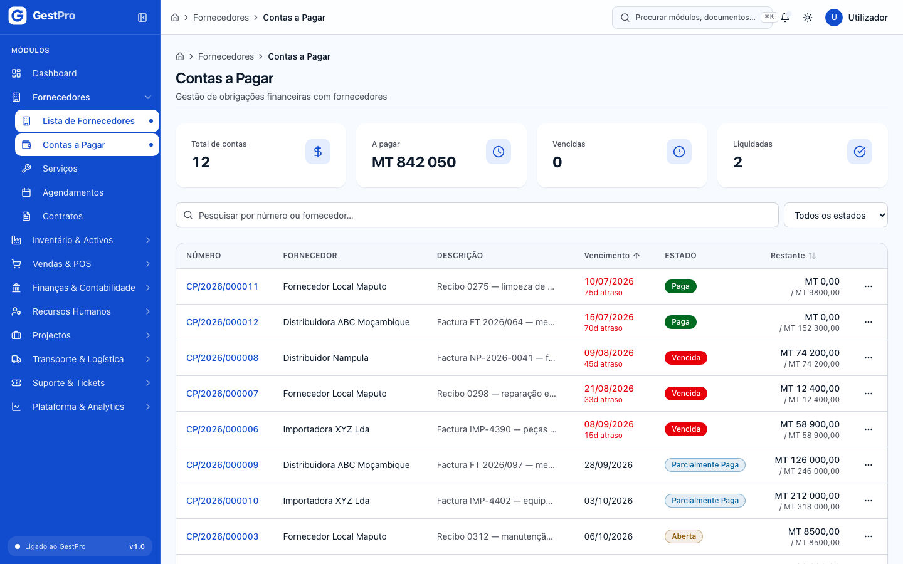

### Como registar um pagamento a um fornecedor

**Antes de começar:** precisa do perfil Administrador ou Gestor. A conta tem de estar Aberta, Parcialmente Paga ou Vencida.

1. Abra a conta e clique em **Registar pagamento**. Na lista, use **⋯ › Registar pagamento**.
2. Em **Pagamento**, confirme ou altere o **Valor (MZN)**. Vem preenchido com o valor restante. Para um pagamento parcial, escreva um valor menor.
3. Indique a **Data do pagamento** e a **Forma de pagamento**: Transferência bancária, Cheque, M-Pesa, e-Mola ou Numerário.
   - Em **Transferência bancária** e **Cheque**, escolha a **Conta bancária** de onde sai o dinheiro (contas correntes, de poupança ou a prazo).
   - Em **M-Pesa** e **e-Mola**, escolha a **Conta bancária** da carteira móvel. A carteira cria-se em **Contabilidade › Contas bancárias**, com o tipo **Carteira móvel (M-Pesa, e-Mola)**.
   - Em **Numerário**, o formulário mostra a **Sessão de caixa aberta** de onde sai o dinheiro. Tem de ser uma sessão aberta por si: se não tiver nenhuma, aparece «Não há sessão de caixa aberta. Para pagar em numerário, abra o caixa em Caixa › Abertura antes de continuar.» e o botão **Registar pagamento** fica inactivo.
4. Se quiser, preencha a **Referência** (n.º da transferência, cheque…) e as **Observações**.
5. Clique em **Registar pagamento**.

**Resultado:** aparece a mensagem «Pagamento registado.» e volta ao detalhe da conta. O pagamento surge no separador **Pagamentos** (Número, Data, Valor, Forma e referência, Lançamento). A conta passa a **Paga**, se ficou liquidada, ou a **Parcialmente Paga**. Uma conta Vencida continua Vencida até ser paga na totalidade.

**Efeitos noutros módulos:**
- **Contabilidade:** cada pagamento gera um lançamento a débito de *421 Fornecedores c/c*. A conta a crédito e o diário dependem da forma de pagamento:
  - **Numerário:** crédito em *111 Caixa*, no diário de Caixa.
  - **Transferência bancária, Cheque, M-Pesa e e-Mola:** crédito na conta do plano de contas associada à conta bancária escolhida, no diário de Banco.
  Para abrir o lançamento, use **Ver lançamento** na linha do pagamento. Veja [Contabilidade](05-contabilidade.md).
- **Caixa:** um pagamento em **Numerário** cria uma saída do tipo **Pagamento** na sua sessão de caixa aberta, que conta para o saldo esperado no fecho. As outras formas não mexem na caixa. Veja [Faturação, Caixa e Tesouraria](06-faturacao-caixa-tesouraria.md).

<!-- captura: 02-fornecedores-e-servicos/conta-pagar-detalhe.png | /fornecedores/contas-pagar >primeiro -->
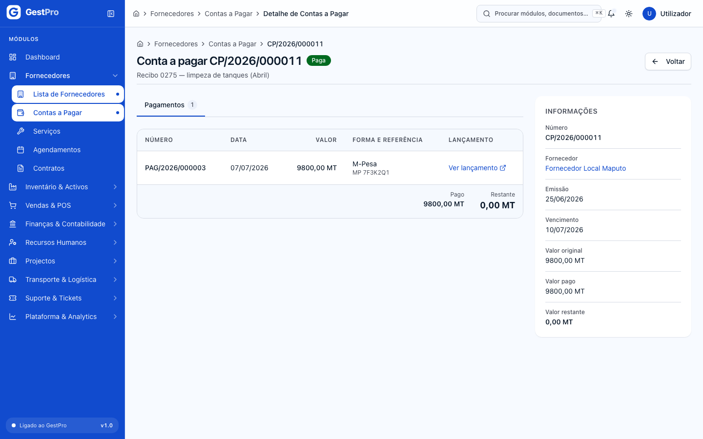

### Como cancelar uma conta a pagar

**Antes de começar:** precisa do perfil Administrador ou Gestor. A conta tem de estar Aberta, Parcialmente Paga ou Vencida.

1. No detalhe da conta, clique em **Cancelar conta**.
2. Em **Motivo do cancelamento**, escreva o **Motivo** (obrigatório, até 500 caracteres), por exemplo «factura emitida em duplicado pelo fornecedor».
3. Clique em **Cancelar conta**.

**Resultado:** aparece a mensagem «Conta ‹número› cancelada.» e a conta passa a **Cancelada**. Uma conta já **Paga** não se cancela. O ecrã explica que um pagamento feito se corrige por estorno do lançamento, não por cancelamento da conta.

### Como criar um serviço

**Antes de começar:** precisa do perfil Administrador, Gestor ou Operador.

1. Abra **Fornecedores › Serviços** e clique em **Novo Serviço**.
2. Em **Informações básicas**, preencha:
   - **Código \***: o sistema atribui sempre um código automático SRV-0001…;
   - **Tipo de serviço \***: Instalação, Manutenção, Reparação, Consultoria, Limpeza, Transporte ou Outro;
   - **Nome do serviço \***;
   - **Descrição**.
3. Em **Preços e duração**, preencha o **Preço (MT) \***, a **Taxa IVA** (0%, 5%, 16% ou 17%), a **Duração (minutos) \*** e a **Unidade de medida** (Unidade, Hora, Dia, Mês ou Projecto).
4. Em **Configurações**, escolha se o serviço está **Disponível**, se **Requer agendamento** e se **Requer técnico**. Acrescente **Observações**, se quiser.
5. Clique em **Guardar Serviço**.

**Resultado:** aparece a mensagem «Serviço criado com sucesso!». O serviço aparece na lista, que tem os indicadores **Total de Serviços**, **Serviços Activos**, **Disponíveis** e **Total de Vendas**, a pesquisa por nome, código ou descrição e o filtro **Tipo**.

> **Atenção:** nesta versão ainda não se pode alterar um serviço depois de criado. O botão **Editar** abre uma página inexistente. Para retirar um serviço do catálogo, use **Arquivar Serviço** no detalhe ou **⋯ › Arquivar** na lista. O serviço passa a inactivo e deixa de estar disponível para novos agendamentos.

<!-- captura: 02-fornecedores-e-servicos/servicos-lista.png | /servicos/lista -->
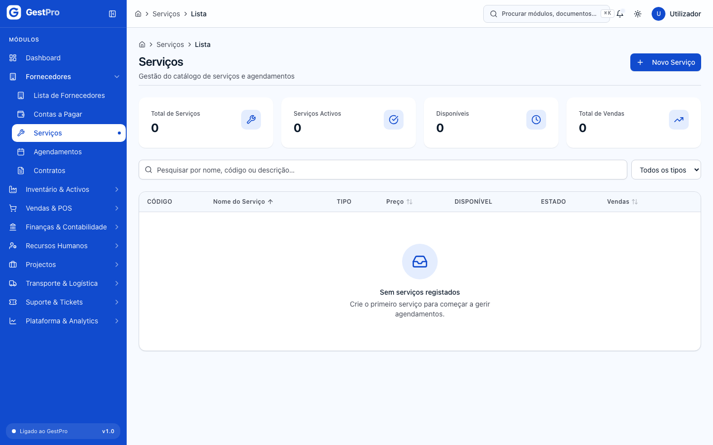

<!-- captura: 02-fornecedores-e-servicos/servico-novo.png | /servicos/novo -->
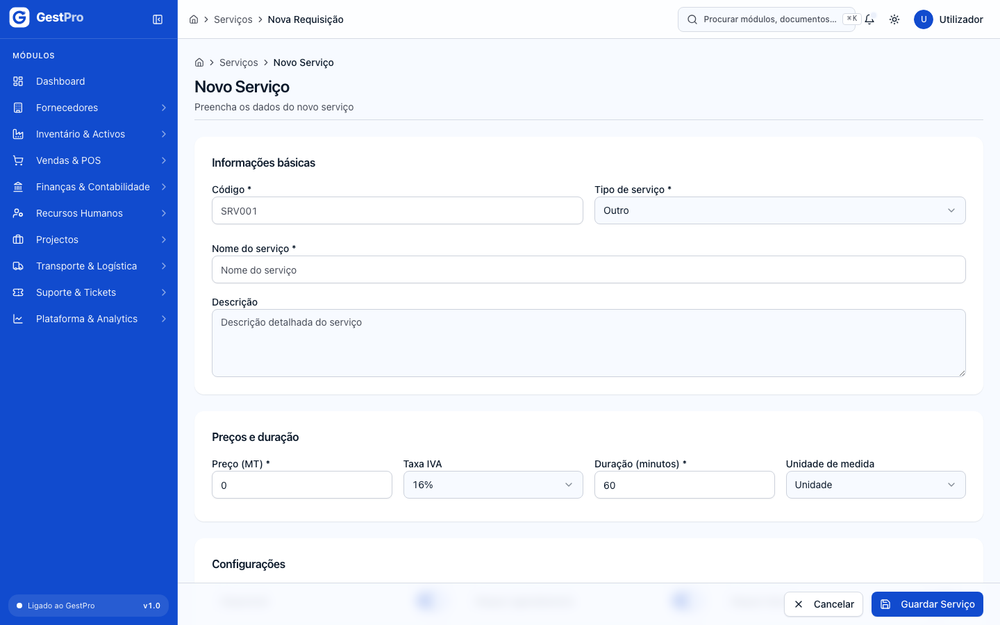

### Como agendar um serviço para um cliente

**Antes de começar:** precisa do perfil Administrador, Gestor ou Operador. O cliente tem de existir na ficha de clientes (ver [Vendas e POS](04-vendas-e-pos.md)) e o serviço tem de existir no catálogo.

1. Abra **Fornecedores › Agendamentos** e clique em **Novo Agendamento**.
2. Em **Serviço e cliente**:
   - escolha o **Serviço**;
   - escolha o **Cliente \***, pesquisando por código, nome ou NUIT;
   - o **E-mail de contacto** e o **Telefone de contacto** são preenchidos a partir da ficha do cliente e podem ser corrigidos.
3. Em **Data e local**, preencha a **Data**, a **Hora início**, a **Hora fim**, a **Duração (min)**, o **Local** (por exemplo «Instalações do cliente»), o **Endereço**, a **Cidade** e a **Província**. Todos estes campos são necessários.
4. Em **Preço**, confira o **Preço (MZN)**, que vem do serviço escolhido. Se houver desconto, indique-o em **Desconto (MZN)**.
5. Clique em **Criar agendamento**.

**Resultado:** aparece a mensagem «Agendamento criado com sucesso.». O agendamento fica **Pendente**, com código automático AGD-00001…. O total é calculado com o preço e a taxa de IVA do serviço no catálogo, menos o desconto. Os campos Preço e Taxa IVA do formulário não alteram esse cálculo.

A lista de agendamentos tem os indicadores **Total de Agendamentos**, **Pendentes**, **Confirmados** e **Concluídos**, a pesquisa por serviço, cliente ou código e o filtro **Estado**. As colunas são Código, Serviço, Cliente, Técnico, Data, Estado e Total.

> **Atenção:** nesta versão não há ecrã para confirmar, iniciar, concluir ou cancelar um agendamento, nem para lhe atribuir um técnico. **⋯ › Ver detalhe** abre uma página inexistente.

<!-- captura: 02-fornecedores-e-servicos/agendamentos-lista.png | /servicos/agendamentos -->
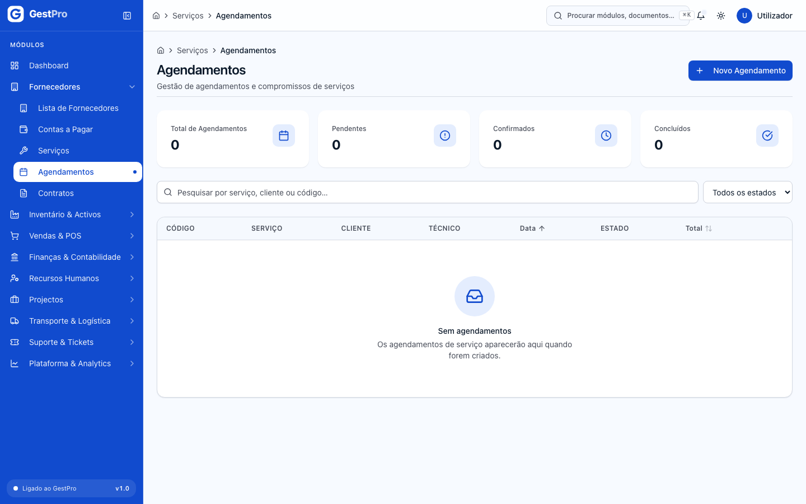

<!-- captura: 02-fornecedores-e-servicos/agendamento-novo.png | /servicos/agendamentos/novo -->
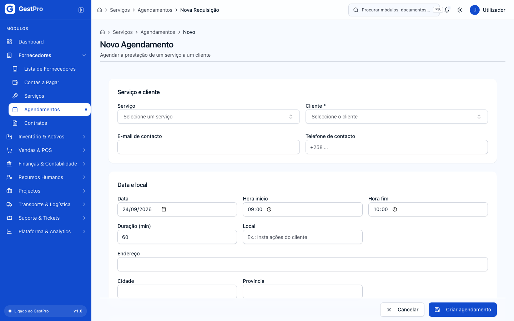

### Como criar um contrato de serviço

**Antes de começar:** precisa do perfil Administrador ou Gestor. Tenha à mão o **identificador do cliente**, que é a última parte do endereço da ficha do cliente.

1. Abra **Fornecedores › Contratos** e clique em **Novo Contrato**.
2. Em **Identificação**, preencha o **Código** (o sistema atribui sempre um código automático CTRT-0001…), o **ID do cliente** e o **Nome do cliente**.
3. Em **Serviços incluídos**, marque um ou mais serviços.
4. Em **Vigência e valor**, preencha o **Início**, o **Fim**, a **Periodicidade** (Mensal, Trimestral, Semestral ou Anual) e o **Valor mensal (MZN)**. Marque **Renovação automática**, se for o caso, e acrescente **Observações**.
5. Clique em **Criar contrato**.

**Resultado:** aparece a mensagem «Contrato criado com sucesso.». O contrato fica **Activo**. A lista de contratos tem os indicadores **Total de contratos**, **Activos**, **Pausados** e **A expirar (30 dias)**, a pesquisa por código ou cliente e o filtro **Estado**.

> **Atenção:** o campo **ID do cliente** aceita qualquer texto e o sistema não confirma que o cliente existe. Copie o identificador com cuidado. Nesta versão não há ecrã para pausar, renovar, encerrar ou abrir o detalhe de um contrato.

<!-- captura: 02-fornecedores-e-servicos/contratos-lista.png | /servicos/contratos -->
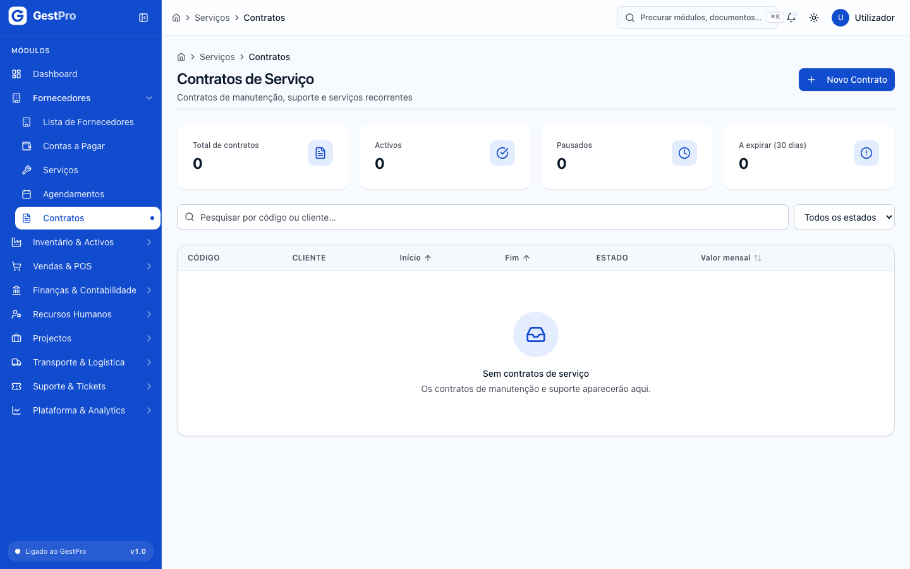

<!-- captura: 02-fornecedores-e-servicos/contrato-novo.png | /servicos/contratos/novo -->
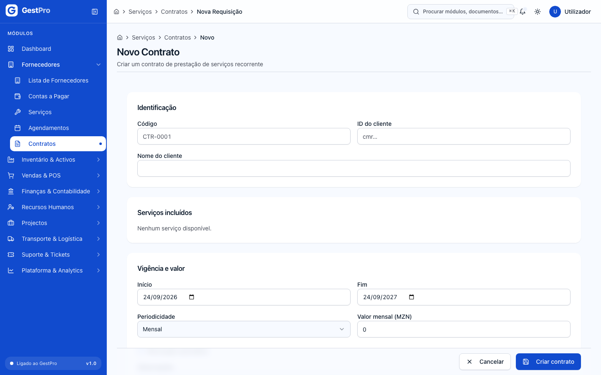

### Como criar uma categoria de serviço

**Antes de começar:** precisa do perfil Administrador ou Gestor. Esta página não tem entrada no menu: abra o endereço `/servicos/categorias`.

1. Clique em **Nova Categoria**.
2. Preencha **Nome \*** (por exemplo «Manutenção»), **Descrição**, **Ordem** e **Ativa**.
3. Clique em **Criar Categoria**.

**Resultado:** aparece a mensagem «Categoria criada com sucesso.». Nesta versão o formulário de serviço ainda não permite escolher a categoria.

## Estados

### Fornecedor

| Estado | Significado | Pode passar a | Quem |
|---|---|---|---|
| Activo | Fornecedor em uso (estado inicial) | Inactivo, Suspenso | Administrador, Gestor (Editar ou Arquivar) |
| Inactivo | Fora de uso; se foi arquivado, deixa de aparecer na lista | Activo, Suspenso (por Editar, se não foi arquivado) | Administrador, Gestor |
| Suspenso | Temporariamente suspenso | Activo, Inactivo | Administrador, Gestor |

### Conta a pagar

| Estado | Significado | Pode passar a | Quem |
|---|---|---|---|
| Aberta | Por pagar | Parcialmente Paga, Paga, Cancelada | Administrador, Gestor |
| Parcialmente Paga | Já tem pagamentos, mas ainda há valor restante | Paga, Cancelada | Administrador, Gestor |
| Vencida | Fora de prazo. Nesta versão o sistema não muda o estado automaticamente quando a data passa; use o indicador **Vencidas** e os dias de atraso no detalhe | Paga, Cancelada | Administrador, Gestor |
| Paga | Liquidada na totalidade (final) | — | — |
| Cancelada | Cancelada com motivo (final) | — | — |

### Agendamento de serviço

| Estado | Significado | Pode passar a | Quem |
|---|---|---|---|
| Pendente | Criado, à espera de confirmação | Confirmado, Cancelado | (sem ecrã nesta versão) |
| Confirmado | Marcação confirmada | Em Andamento, Cancelado, Não Compareceu | — |
| Em Andamento | Serviço a decorrer | Concluído, Cancelado | — |
| Concluído | Serviço prestado (final); só estes podem ser avaliados | — | — |
| Cancelado | Cancelado (final) | — | — |
| Não Compareceu | O cliente faltou (final) | — | — |

### Contrato de serviço

| Estado | Significado | Pode passar a | Quem |
|---|---|---|---|
| Activo | Em vigor (estado inicial) | — (sem ecrã nesta versão) | — |
| Pausado | Suspenso temporariamente | — | — |
| Encerrado | Terminado | — | — |
| Cancelado | Cancelado | — | — |

## Erros frequentes

| Mensagem mostrada | Porquê | O que fazer |
|---|---|---|
| NUIT deve ter exactamente 9 dígitos | O NUIT tem mais ou menos de 9 caracteres | Corrija o NUIT |
| NUIT inválido — deve ter 9 dígitos não repetidos | O NUIT não é válido (por exemplo, 111111111) | Confirme o NUIT junto do fornecedor |
| NUIT ‹n.º› já registado neste tenant | Já existe um fornecedor com este NUIT na empresa | Procure o fornecedor existente na lista |
| Nome obrigatório · Email inválido | Nome com menos de 2 caracteres, ou email mal escrito | Corrija os campos assinalados |
| Ficheiro demasiado grande (máx. 10 MB). | O documento excede o limite | Reduza o ficheiro ou divida-o |
| Tipo de ficheiro não permitido. | O ficheiro não é PDF, imagem ou Office | Converta-o para PDF |
| Valor do pagamento (X) excede o valor restante (Y) | Tentou pagar mais do que está em dívida | Indique um valor igual ou inferior ao restante |
| Conta a pagar já liquidada ou cancelada | A conta já está Paga ou Cancelada | Nada a pagar; confirme o estado da conta |
| Forma de pagamento obrigatória | Não escolheu a forma de pagamento | Escolha uma das opções |
| Indique o motivo | Tentou cancelar a conta sem motivo | Escreva o motivo |
| Código obrigatório | Deixou o campo Código vazio (serviço ou contrato) | Escreva qualquer código; o sistema substitui-o pelo automático |
| Valor deve ser positivo | Preço do serviço ou valor mensal do contrato igual a zero | Indique um valor maior que zero |
| ID de serviço inválido | Não escolheu o serviço no agendamento | Escolha um serviço |
| ID de cliente obrigatório | Não escolheu o cliente (agendamento) ou não preencheu o ID do cliente (contrato) | Escolha ou indique o cliente |
| Hora inválida — formato HH:MM | Hora de início ou de fim mal preenchida | Use o formato 09:00 |
| Pelo menos um serviço | Contrato sem serviços marcados | Marque pelo menos um serviço |
| Sem permissão para esta operação | O seu perfil não permite a acção | Peça a acção a um gestor ou administrador |

## Perguntas frequentes

**Porque é que o código que escrevi não ficou gravado?**
Fornecedores, serviços, agendamentos e contratos recebem sempre um código automático e sequencial. O que escrever no campo Código não é usado.

**O perfil Financeiro pode registar pagamentos a fornecedores?**
Nesta versão não. Os perfis de sistema dão a permissão de registar pagamentos e cancelar contas a pagar apenas ao Administrador e ao Gestor. O administrador pode criar um perfil próprio com essa permissão (ver [Plataforma e Administração](11-plataforma-e-administracao.md)).
