# 3. Inventário & Activos

> **Para quem:** Administrador, Gestor, Operador (consulta: Financeiro, Leitura) · **Onde:** menu › Inventário & Activos

## Para que serve

Este módulo guarda o catálogo de produtos que a empresa compra e vende e controla quanto stock existe e onde está (armazéns, lojas, prateleiras). Também regista os bens da própria empresa (os **activos**: computadores, viaturas, máquinas), com os seus documentos, as manutenções e as contagens físicas.

O stock muda por duas vias: pelos movimentos que regista aqui (entradas, saídas, transferências, contagens) e pelas operações de outros módulos, como a recepção de compras, as vendas no POS e a produção.

## Conceitos

| Termo | O que é |
|---|---|
| Produto | Artigo do catálogo, identificado por um **SKU** (código único). Tem preços de compra e venda, taxa de IVA e stock mínimo. |
| Localização | Sítio físico onde fica stock ou um activo: Armazém, Escritório, Departamento, Filial, Prateleira, Sala, Andar, Área Técnica. |
| Saldo de stock | Quantidade de um produto numa localização. Cada movimento aumenta ou diminui o saldo. |
| Reservado / Disponível | Quantidade guardada para encomendas de venda ou produção ainda por entregar. O disponível é o saldo menos o reservado. |
| Movimento de stock | Registo de uma entrada, saída, ajuste ou transferência. Um movimento registado não se apaga. |
| Stock mínimo | Limite definido no produto. Abaixo dele, o produto aparece em **Reposição de Stock**. |
| Activo | Bem da empresa (equipamento, mobiliário, viatura) com código interno, valor de compra, vida útil e estado. |
| Categoria de activo | Agrupa activos e define o método de amortização, a vida útil e o intervalo de manutenção preventiva. |
| Contagem de stock | Contagem das quantidades reais de produtos numa localização. Na reconciliação, o sistema acerta o stock pela quantidade contada. |
| Contagem cega | Contagem em que quem conta não vê o saldo do sistema. |
| Inventário físico | Verificação dos **activos** (não dos produtos) de uma ou mais localizações. |

## Ecrãs

| Menu | Endereço | Para que serve |
|---|---|---|
| Dashboard | /inventario | Indicadores de activos e manutenções, com atalhos para as outras páginas do módulo |
| Produtos | /produtos | Catálogo de produtos: criar, ver, editar, arquivar |
| Categorias | /inventario/categorias | Categorias de **activos** (não de produtos) |
| Activos | /inventario/ativos | Registo de activos, mudanças de estado e documentos |
| Movimentações | /inventario/movimentacoes | Histórico de movimentos de stock. Aqui regista entradas, saídas e transferências |
| Inventário Físico | /inventario/fisico | Inventários de activos |
| Manutenção | /inventario/manutencao | Manutenções preventivas e correctivas dos activos |
| *(atalho no Dashboard)* | /inventario/localizacoes | Localizações (armazéns, lojas, salas). Precisa delas para registar stock e activos |
| *(sem entrada no menu)* | /inventario/contagens | Contagens de stock de produtos e reconciliação |
| *(sem entrada no menu)* | /inventario/transferencias | Lista de transferências de stock (ver a nota em [Como transferir stock](#como-transferir-stock-entre-localizações)) |
| *(sem entrada no menu)* | /stock/dashboard | Dashboard de Stock: produtos no catálogo, alertas de stock mínimo, movimentações |
| *(sem entrada no menu)* | /stock/reposicao | Reposição de Stock: produtos abaixo do stock mínimo |
| *(sem entrada no menu)* | /inventario/relatorios | Relatórios de Inventário, com ligações para Amortização (/inventario/amortizacao), Abate (/inventario/abate) e Reconciliação (/inventario/reconciliacao). São listas só de consulta |

> **Nota:** os endereços antigos /stock/movimentacao e /stock/movimentacao/nova já não têm página própria. Levam-no automaticamente para **Movimentações** e **Nova Movimentação**.

<!-- captura: 03-inventario/dashboard.png | /inventario -->
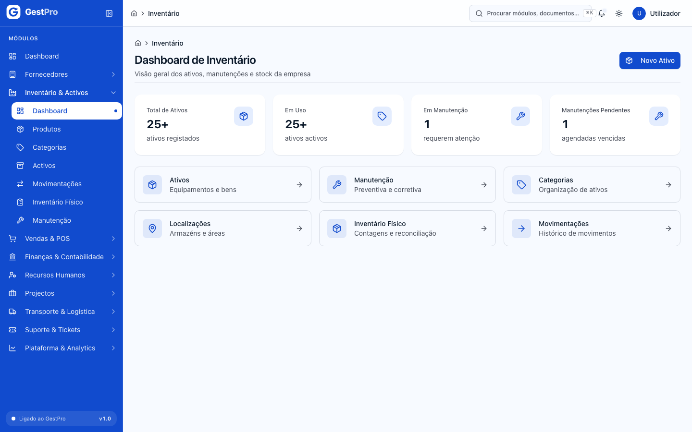

O **Dashboard de Inventário** mostra quatro indicadores (Total de Ativos, Em Uso, Em Manutenção, Manutenções Pendentes) e atalhos para Ativos, Manutenção, Categorias, Localizações, Inventário Físico e Movimentações. O botão **Novo Ativo** abre o formulário de um activo novo.

> **Atenção:** hoje os indicadores do Dashboard não mostram o total real. «Total de Ativos» e «Em Uso» mostram 0, 1 ou «25+», e «Em Manutenção» mostra no máximo 1. Para saber quantos activos tem em cada estado, use o filtro **Estado** em **Activos**.

## Tarefas

### Como criar uma localização

**Antes de começar:** precisa de uma destas permissões de perfil: Administrador, Gestor ou Operador.

1. No **Dashboard** do inventário, clique no atalho **Localizações**.
2. Clique em **Nova Localização**.
3. Preencha **Código \*** (ex.: ARM-01), **Nome \*** e **Tipo \***. Se quiser, preencha também **Endereço**, **Descrição** e **Capacidade**.
4. Clique em **Criar Localização**.

**Resultado:** aparece a mensagem «Localização criada com sucesso!». A localização passa a estar disponível nos formulários de movimentos de stock, de activos e de inventário físico.

Para deixar de usar uma localização, abra o menu **⋯** da linha e escolha **Desactivar**. Uma localização desactivada deixa de aparecer para novos activos e novo stock.

> **Atenção:** a opção **Editar** no menu **⋯** das localizações ainda abre uma página inexistente. Por enquanto não é possível alterar uma localização depois de criada.

### Como criar um produto

**Antes de começar:** perfil Administrador, Gestor ou Operador. Tem de existir pelo menos uma categoria de produto (ver a nota no fim desta tarefa).

1. Vá a **Inventário & Activos › Produtos** e clique em **Novo Produto**.
2. Em **Identificação**, preencha **SKU \*** (ex.: PROD-001), **Nome \***, **Categoria \*** e **Unidade de Medida \*** (Unidade, Quilograma, Litro, Metro, Caixa ou Pacote). **Marca** e **Descrição** são opcionais.
3. Em **Preços e Stock**, indique **Preço de Compra (MT) \***, **Preço de Venda (MT) \***, **Taxa de IVA** (Isento (0%) ou 16%) e **Stock Mínimo**.
4. Clique em **Criar Produto**.

**Resultado:** aparece «Produto criado com sucesso!» e volta à lista **Catálogo de Produtos**. O produto fica no estado **Activo**.

**Efeitos noutros módulos:** o produto passa a poder ser usado em requisições e recepções de [Compras](01-compras.md), em vendas e no POS ([Vendas & POS](04-vendas-e-pos.md)) e em movimentos de stock. Criar o produto não lhe dá stock. O stock entra com uma entrada, com uma recepção de compra ou com a produção.

> **Atenção:** o menu **Categorias** deste módulo gere categorias de **activos**. Ainda não existe um ecrã para criar ou editar categorias de **produtos**. As que aparecem no campo **Categoria** vêm da configuração inicial da empresa. Se a lista estiver vazia, peça ao suporte que as crie.

<!-- captura: 03-inventario/produtos-lista.png | /produtos -->
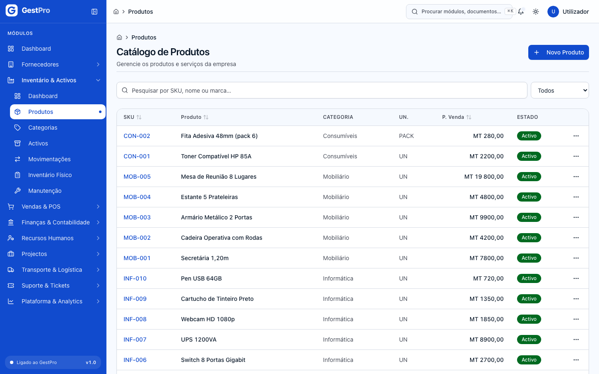

<!-- captura: 03-inventario/produto-novo.png | /produtos/novo -->
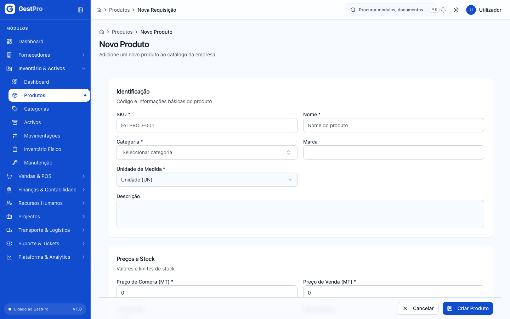

### Como consultar, editar ou arquivar um produto

1. Em **Produtos**, pesquise por SKU, nome ou marca, ou filtre por **Estado** (Activo / Inactivo).
2. Clique na linha para ver o detalhe: SKU, categoria, preços, **Margem**, **IVA**, **Stock Mínimo** e o separador **Variantes**.
3. Para alterar, clique em **Editar** (no detalhe ou no menu **⋯** da lista), mude os campos e clique em **Guardar Alterações**. O SKU não se pode alterar.
4. Para retirar o produto de uso, abra o menu **⋯** da linha, escolha **Arquivar** e confirme. O produto fica **Inactivo** e deixa de poder ser editado.

**Resultado:** aparece «Produto actualizado com sucesso.» ou «Produto "…" arquivado.».

> **Atenção:** no formulário de edição, o campo **Taxa IVA (0–1)** aceita apenas `0` (isento) ou `0.16` (16%), apesar de o exemplo mostrado ser 0.17. O separador **Variantes** é só de consulta: ainda não é possível criar variantes neste ecrã. O detalhe do produto também ainda não mostra o saldo de stock.

### Como dar entrada de stock

**Antes de começar:** perfil Administrador, Gestor ou Operador. O produto e a localização de destino têm de existir.

1. Vá a **Inventário & Activos › Movimentações** e clique em **Nova Movimentação**.
2. Escolha o cartão **Entrada**.
3. Em **Produto**, escolha o **Produto** e, se aplicável, a **Variante**.
4. Em **Destino e quantidade**, escolha a **Localização de destino** e indique a **Quantidade**. Por baixo aparece a unidade do produto.
5. Se quiser, em **Referência**, escolha o **Tipo de documento** (Recebimento de compra, Ajuste de inventário, Devolução de venda, Produção (saída), Manual) e preencha **Nº do documento**, **Motivo** e **Observações**.
6. Clique em **Registar Entrada**.

**Resultado:** aparece «Entrada de stock registada com sucesso.» e o saldo do produto nessa localização aumenta.

> **Nota:** para mercadoria comprada a fornecedores, é melhor registar a recepção em [Compras](01-compras.md). A recepção dá entrada no stock automaticamente e fica ligada à encomenda.

<!-- captura: 03-inventario/movimentacao-nova.png | /inventario/movimentacoes/nova -->
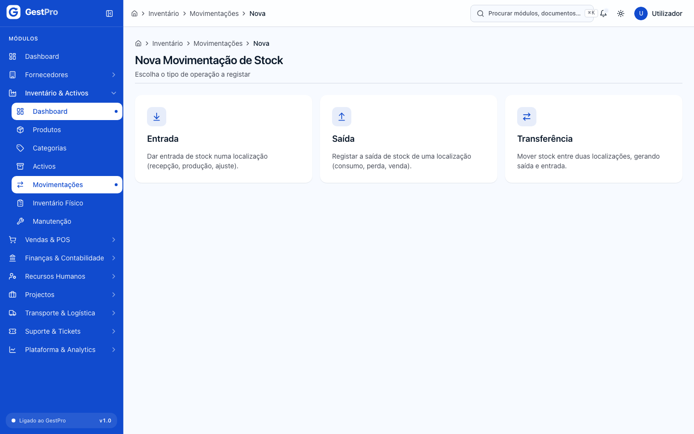

<!-- captura: 03-inventario/movimentacao-entrada.png | /inventario/movimentacoes/nova/entrada -->
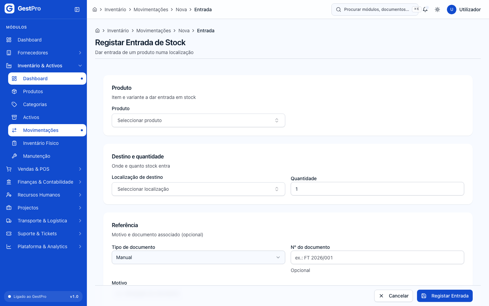

### Como dar saída de stock

**Antes de começar:** perfil Administrador, Gestor ou Operador. O produto tem de ter saldo suficiente na localização de origem.

1. Em **Movimentações**, clique em **Nova Movimentação** e escolha **Saída**.
2. Escolha o **Produto** (e a **Variante**, se houver).
3. Em **Origem e quantidade**, escolha a **Localização de origem** e a **Quantidade**.
4. Se quiser, indique o **Tipo de documento** (Venda, Ordem de produção, Perda / quebra, Ajuste de inventário, Manual), o **Motivo** e as **Observações**.
5. Clique em **Registar Saída**.

**Resultado:** aparece «Saída de stock registada com sucesso.» e o saldo diminui.

Se não houver stock suficiente, a saída não é registada. Aparece o aviso «Stock insuficiente na localização de origem para a quantidade indicada. Ajuste a quantidade ou escolha outra localização.» Reduza a quantidade, escolha outra localização ou registe primeiro uma entrada.

### Como transferir stock entre localizações

**Antes de começar:** perfil Administrador, Gestor ou Operador.

1. Em **Movimentações**, clique em **Nova Movimentação** e escolha **Transferência**.
2. Escolha o **Produto** (e a **Variante**, se houver).
3. Em **Origem e destino**, escolha a **Localização de origem** e a **Localização de destino**. A lista de destino não mostra a origem.
4. Indique a **Quantidade** e o **Motivo** (obrigatório). **Observações** é opcional.
5. Clique em **Registar Transferência**.

**Resultado:** aparece o painel **Transferência concluída** com os dois movimentos criados: **Movimento de saída** na origem e **Movimento de entrada** no destino. O saldo total do produto não muda. Clique em **Registar outra** para fazer uma nova transferência.

> **Atenção:** hoje a página **Transferências de Stock** (botão **Ver transferências**) aparece sempre vazia. As transferências registadas aparecem em **Movimentações**.

### Como consultar as movimentações

Em **Movimentações** vê os movimentos mais recentes, com as colunas **Tipo**, **Produto**, **Qtd**, **Motivo** e **Data**. Aparecem os movimentos registados neste ecrã e também os que vêm de compras, vendas, produção e contagens.

> **Atenção:** hoje o filtro **Tipo** e a caixa de pesquisa não filtram esta lista. Nas transferências, a coluna **Tipo** mostra o código interno (TRANSFERENCIA_ENTRADA / TRANSFERENCIA_SAIDA).

<!-- captura: 03-inventario/movimentacoes-lista.png | /inventario/movimentacoes -->
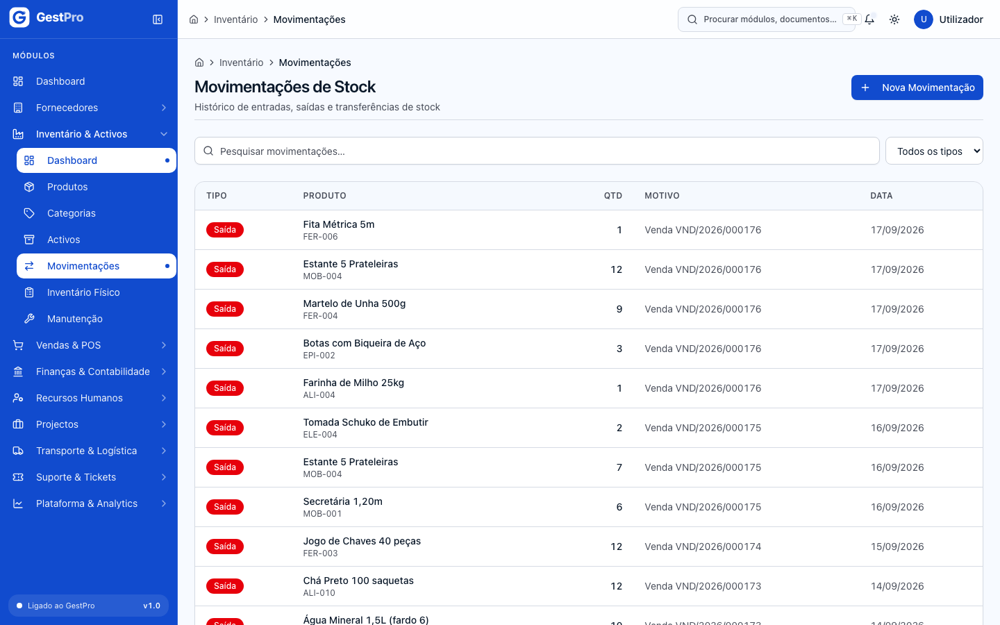

### Como ver os produtos que precisam de reposição

1. Abra o endereço /stock/reposicao, ou o atalho **Reposição** no Dashboard de Stock (/stock/dashboard).
2. A lista mostra os produtos com saldo abaixo do **Stock Mínimo**: **Saldo Actual**, **Reservado**, **Disponível** e o alerta **Stock Baixo**.

> **Atenção:** nesta lista, as colunas **Produto** e **Localização** mostram ainda um código interno abreviado, e não o nome.

### Como fazer uma contagem de stock (e acertar o stock)

**Antes de começar:** perfil Administrador, Gestor ou Operador. A empresa precisa de uma série de numeração activa para contagens de stock no ano corrente. As séries são geridas em [Faturação, Caixa e Tesouraria](06-faturacao-caixa-tesouraria.md).

1. Abra o endereço /inventario/contagens (**Contagens de Stock**) e clique em **Nova Contagem**.
2. Em **Configuração da Contagem**:
   - **Responsável \***: já vem preenchido com o seu utilizador;
   - **Contagem Cega**: «Não (saldos visíveis)» ou «Sim (saldos ocultos até fecho)»;
   - **Localização (opcional)** e **Categoria (opcional)**: deixe em branco para contar todas as localizações e todos os produtos;
   - **Observações**.
3. Clique em **Abrir Contagem**. A contagem recebe um número, fica no estado **Em Contagem** e o sistema cria uma linha para cada produto e localização com stock. Cada linha guarda o **Saldo Sistema** no momento da abertura.
4. Na tabela **Itens de Contagem**, escreva a quantidade real em **Qtd. Contada** e clique no visto (✓) da linha. O item passa a **Contado** e a coluna **Diferença** mostra a diferença para o saldo do sistema.
5. Para um item que não conseguiu contar, clique no ícone de mensagem (**Justificar discrepância**), escreva o motivo (pelo menos 5 caracteres) e clique em **Guardar Justificativa**. O item passa a **Justificado**.
6. Quando não houver itens **Pendentes**, clique em **Reconciliar** e depois em **Confirmar Reconciliação**.
7. Confira o resultado e clique em **Concluir** › **Confirmar Conclusão**.

**Resultado:** a reconciliação cria um movimento de entrada por cada item com diferença positiva e um movimento de saída por cada item com diferença negativa, com o motivo «Ajuste de contagem …». Esses itens passam a **Ajustado** e a contagem passa a **Reconciliada**. Depois de **Concluir**, a contagem já não pode ser alterada.

**Efeitos noutros módulos:** os ajustes aparecem em **Movimentações** e alteram o stock disponível para vendas e POS. A contagem não cria lançamentos contabilísticos.

> **Atenção:**
> - Hoje os campos **Localização (opcional)** e **Categoria (opcional)** pedem um código interno, e não mostram uma lista para escolher. Na prática, deixe-os em branco.
> - Se um item tiver uma diferença superior a 5% do saldo do sistema, a reconciliação é recusada. Aparece a mensagem «… excede o limiar de 5%. Aprovação obrigatória.», e o ecrã ainda não tem forma de registar essa aprovação.
> - Justificar um item que já tinha quantidade contada não impede o ajuste. Se houver diferença, o stock é acertado na reconciliação na mesma.
> - Nas colunas **Produto** e **Localização** dos itens aparecem ainda códigos internos, e não os nomes.

Para cancelar, clique em **Cancelar Contagem** › **Confirmar Cancelamento**. Não é possível cancelar uma contagem já **Concluída**.

<!-- captura: 03-inventario/contagem-detalhe.png | /inventario/contagens >primeiro -->
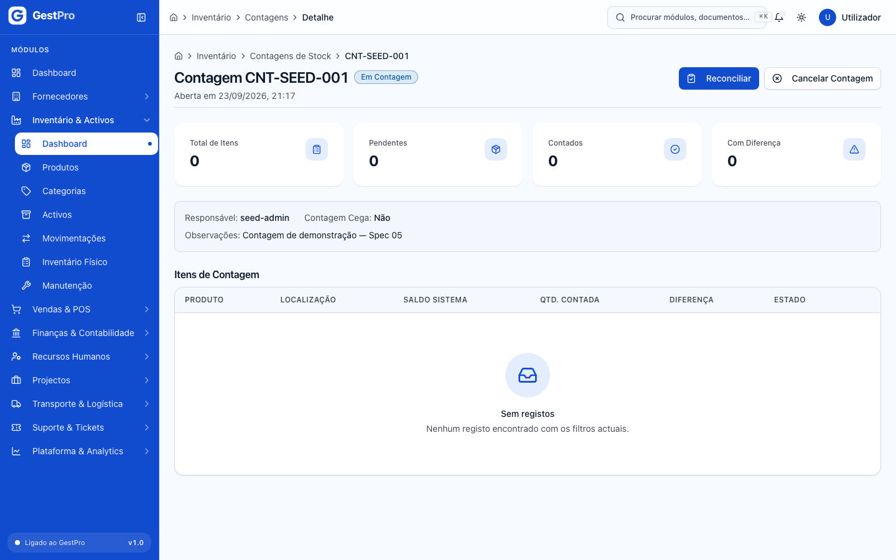

### Como criar uma categoria de activo

**Antes de começar:** perfil Administrador ou Gestor.

1. Vá a **Inventário & Activos › Categorias** (página **Categorias de Ativos**) e clique em **Nova Categoria**.
2. Em **Identificação**, preencha **Código \*** (ex.: EQ-TI), **Nome \*** e, se quiser, **Descrição**.
3. Em **Amortização**, escolha o **Método de Amortização** (Linear, Dígitos dos Anos, Unidades de Produção, Saldos Decrescentes) e preencha **Vida Útil (anos) \***, **Valor Residual (%)** e **Intervalo Preventiva (dias)**.
4. Clique em **Criar Categoria**.

**Resultado:** aparece «Categoria criada com sucesso!».

Para alterar, use **⋯ › Editar** na linha. O **Código** não se pode alterar. Em **Estado**, o interruptor **Categoria activa** desligado impede que a categoria seja usada em novos activos. Clique em **Guardar Alterações**.

<!-- captura: 03-inventario/categorias-lista.png | /inventario/categorias -->
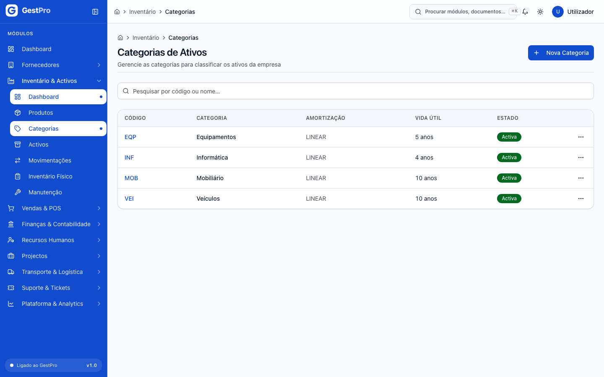

### Como registar um activo

**Antes de começar:** perfil Administrador ou Gestor. Tem de existir pelo menos uma categoria de activo e uma localização activa.

1. Vá a **Inventário & Activos › Activos** (página **Gestão de Ativos**) e clique em **Novo Ativo**.
2. **Informações Básicas:** **Código Interno \*** (ex.: INF-001), **Categoria \***, **Nome do Ativo \***. Opcionais: **Descrição**, **Marca**, **Modelo**, **Número de Série**.
3. **Informações Financeiras:** **Data de Aquisição \***, **Valor de Compra (MT) \***, **Vida Útil (anos) \***. Opcional: **Valor Residual (MT)**.
4. **Localização e Estado:** **Localização \***, **Estado Inicial** (Novo ou Em Uso) e **Método de Amortização**.
5. **Informações Adicionais:** **Observações**.
6. Clique em **Guardar Ativo**.

**Resultado:** aparece «Ativo criado com sucesso!» e o activo passa a constar da lista.

<!-- captura: 03-inventario/ativos-lista.png | /inventario/ativos -->
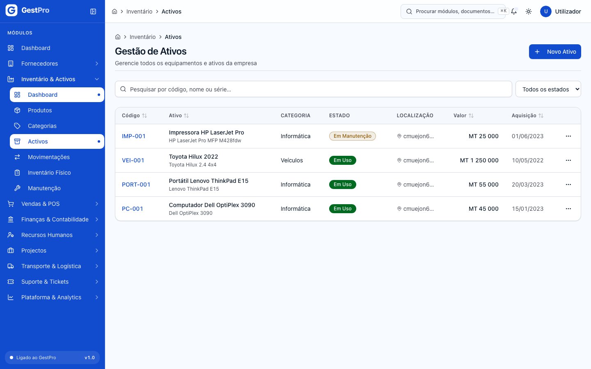

### Como mudar o estado de um activo (colocar em uso, baixar, arquivar)

1. Abra o activo (clique na linha da lista).
2. No topo do detalhe aparecem só os botões dos estados permitidos, por exemplo **Em Uso**, **Em Manutenção**, **Obsoleto** ou **Baixado**. Os mesmos botões estão no menu **⋯** da lista.
3. Clique no estado pretendido. Para **Baixado**, escreva em **Observações** o motivo da baixa (opcional) e clique em **Confirmar Baixa**. Um activo baixado não pode voltar atrás.
4. Um activo **Baixado** pode ainda ser retirado das listas com **Arquivar** › **Arquivar Ativo**. Esta acção também não se pode desfazer.

**Resultado:** aparece «Ativo transitado para …» ou «Ativo arquivado com sucesso.».

Para alterar os dados (categoria, nome, descrição, marca, modelo, valor de compra, vida útil, localização), use **Editar** e depois **Guardar Alterações**. Um activo **Baixado** não pode ser editado.

### Como anexar documentos a um activo

**Antes de começar:** perfil Administrador ou Gestor.

1. Abra o activo e vá ao separador **Documentos**.
2. Em **Tipo de documento**, escolha Manual, Certificado, Garantia, Factura / Nota Fiscal ou Outro.
3. Clique em **Carregar documento do ativo** e escolha o ficheiro (PDF, imagem ou Office, máx. 10 MB).
4. Aguarde a mensagem «Documento carregado com sucesso.». Para enviar outro ficheiro, clique em **Carregar outro**.

**Resultado:** o documento aparece em **Documentos anexados**, com o tipo e a data. Clique em **Descarregar** para o abrir. Para o apagar, clique no ícone do caixote do lixo e depois em **Remover**. O ficheiro é apagado de vez.

O detalhe do activo tem também os separadores **Informações** (identificação e valores) e **Amortização** (método, vida útil e, quando existirem, a percentagem amortizada e a amortização acumulada).

<!-- captura: 03-inventario/ativo-detalhe.png | /inventario/ativos >primeiro -->
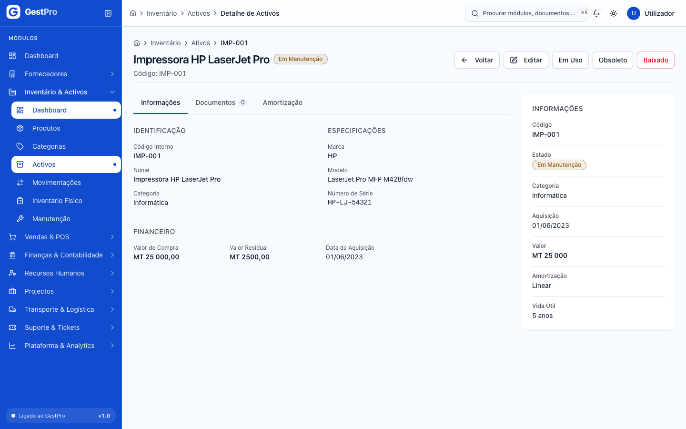

### Como agendar e acompanhar uma manutenção

**Antes de começar:** perfil Administrador ou Gestor.

1. Vá a **Inventário & Activos › Manutenção** e clique em **Nova Manutenção**.
2. Em **Informações Básicas**, escolha o **Ativo \*** e o **Tipo \*** (Preventiva, Corretiva, Inspecção, Calibração) e preencha **Título \*** e **Descrição \***.
3. Em **Agendamento e Prioridade**, indique a **Prioridade** (Baixa, Média, Alta, Crítica) e a **Data Agendada \***. **Custo Estimado (MT)** e **Observações** são opcionais.
4. Clique em **Criar Manutenção**. A manutenção fica **Agendada**.
5. Quando o trabalho começar, clique em **Iniciar**. A manutenção passa a **Em Andamento**.
6. Quando o trabalho terminar, clique no botão que conclui a manutenção (ver a nota abaixo). A manutenção passa a **Concluída**.
7. Se a manutenção não se fizer, clique em **Cancelar**, escreva o motivo (opcional) e clique em **Confirmar Cancelamento**.

**Resultado:** ao **Iniciar**, um activo que esteja **Em Uso** passa automaticamente a **Em Manutenção**. Ao concluir, volta a **Em Uso**. Se cancelar, o estado do activo não muda.

O detalhe da manutenção tem os separadores **Detalhes**, **Custos** e **Relatório**. As manutenções agendadas cuja data já passou contam no indicador «Manutenções Pendentes» do Dashboard.

> **Atenção:** no estado **Em Andamento** aparecem dois botões com o mesmo nome, **Concluir**. O primeiro passa a manutenção para **Orçamento** e o segundo para **Concluída**. De **Orçamento**, o botão **Retomar** volta a **Em Andamento**. Ainda não é possível registar o **Custo Real** nos ecrãs. A edição permite alterar título, prioridade, data agendada, descrição, custo estimado e observações.

<!-- captura: 03-inventario/manutencao-lista.png | /inventario/manutencao -->
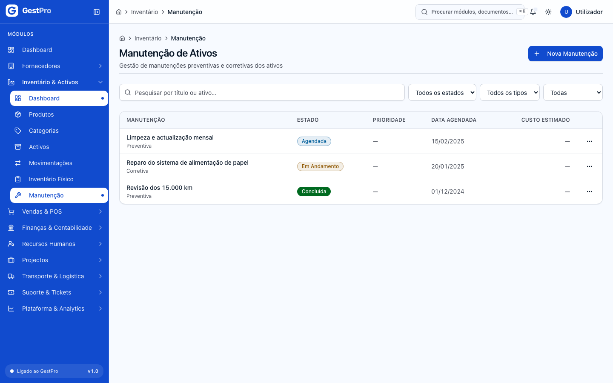

### Como criar um inventário físico de activos

**Antes de começar:** perfil Administrador, Gestor ou Operador.

1. Vá a **Inventário & Activos › Inventário Físico** e clique em **Novo Inventário**.
2. Em **Identificação**, preencha **Código \*** (ex.: INV-2026-001), **Data de Início \*** e **Título \***. Se quiser, preencha também **Data Prevista de Conclusão**, **Localização Principal**, **Descrição** e **Observações**.
3. Clique em **Criar Inventário**.

**Resultado:** aparece «Inventário físico criado com sucesso!» e o inventário fica **Planeado**. No detalhe vê os separadores **Detalhes**, **Equipa** e **Discrepâncias**, e os totais Ativos esperados, Contados, Discrepâncias e Progresso.

> **Atenção:** para já, este ecrã só permite criar e consultar inventários de activos. Ainda não é possível agendar, iniciar, registar contagens ou reconciliar, e o botão **Editar** do detalhe abre uma página inexistente. Para contar **produtos** e acertar o stock, use as **Contagens de Stock** (ver [acima](#como-fazer-uma-contagem-de-stock-e-acertar-o-stock)).

<!-- captura: 03-inventario/fisico-lista.png | /inventario/fisico -->
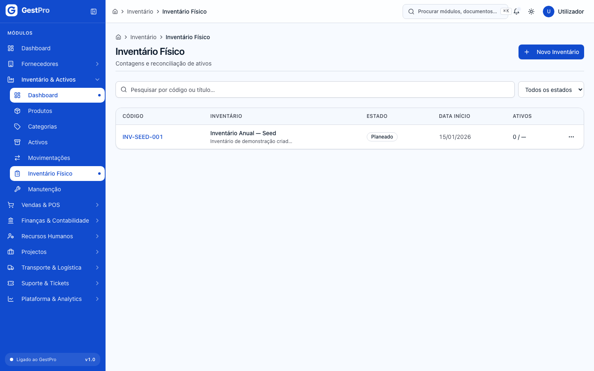

## Efeitos de outros módulos no stock

| Operação | Onde | Efeito no stock |
|---|---|---|
| Recepção de mercadoria | [Compras](01-compras.md) | Entrada de cada item aceite na localização de recepção |
| Venda no POS | [Vendas & POS](04-vendas-e-pos.md) | Saída imediata do stock |
| Encomenda de venda confirmada / entregue / cancelada | [Vendas & POS](04-vendas-e-pos.md) | Reserva o stock, depois dá-lhe saída ou liberta a reserva |
| Devolução ou troca de venda | [Vendas & POS](04-vendas-e-pos.md) | Entrada do artigo devolvido (e saída do artigo dado em troca) |
| Ordem de produção | [Projetos e Produção](08-projetos-e-producao.md) | Reserva e consumo dos componentes, e entrada do produto acabado |

Todos estes movimentos aparecem em **Movimentações**. Se não houver stock suficiente, a operação no outro módulo é recusada com a mesma mensagem de stock insuficiente.

## Estados

### Produto

| Estado | Significado | Pode passar a | Quem |
|---|---|---|---|
| Activo | Disponível para uso em compras, vendas e stock | Inactivo (com **Arquivar**) | Administrador, Gestor, Operador |
| Inactivo | Arquivado. Não pode ser editado | — | — |

### Activo

| Estado | Significado | Pode passar a | Quem |
|---|---|---|---|
| Novo | Registado, ainda não em utilização | Em Uso, Baixado | Administrador, Gestor |
| Em Uso | Em utilização normal | Em Manutenção, Em Transferência, Obsoleto, Baixado | Administrador, Gestor |
| Em Manutenção | Em reparação ou revisão (também muda automaticamente ao **Iniciar** uma manutenção) | Em Uso, Obsoleto, Baixado | Administrador, Gestor |
| Em Transferência | A ser mudado de sítio | Em Uso, Baixado | Administrador, Gestor |
| Obsoleto | Já não serve, mas ainda não saiu da empresa | Baixado | Administrador, Gestor |
| Baixado | Saiu do património. Não se pode reverter | Pode ser **Arquivado** | Administrador, Gestor |

### Manutenção

| Estado | Significado | Pode passar a | Quem |
|---|---|---|---|
| Agendada | Marcada para uma data | Em Andamento (**Iniciar**), Cancelada | Administrador, Gestor |
| Em Andamento | Trabalho a decorrer | Orçamento, Concluída, Cancelada | Administrador, Gestor |
| Orçamento | À espera de orçamento | Em Andamento (**Retomar**), Cancelada | Administrador, Gestor |
| Concluída | Terminada | — | — |
| Cancelada | Não realizada | — | — |

### Contagem de stock

| Estado | Significado | Pode passar a | Quem |
|---|---|---|---|
| Em Contagem | Aberta, a registar quantidades | Reconciliada, Cancelada | Administrador, Gestor, Operador |
| Reconciliada | Ajustes de stock já aplicados | Concluída, Cancelada | Administrador, Gestor, Operador |
| Concluída | Fechada. Não se pode alterar | — | — |
| Cancelada | Anulada | — | — |

O filtro da lista inclui também **Rascunho**, mas as contagens abertas no ecrã começam logo em **Em Contagem**.

Cada **item** da contagem pode estar **Pendente** (por contar), **Contado**, **Justificado** ou **Ajustado** (já acertado na reconciliação).

### Inventário físico

Os estados previstos são Planeado, Agendado, Em Andamento, Pausado, Concluído e Cancelado. Hoje, os inventários criados no ecrã ficam em **Planeado** (ver a nota em [Como criar um inventário físico](#como-criar-um-inventário-físico-de-activos)).

## Erros frequentes

| Mensagem mostrada | Porquê | O que fazer |
|---|---|---|
| Stock insuficiente. Disponível: X, solicitado: Y. / Stock insuficiente para a quantidade indicada. | A localização de origem não tem a quantidade pedida | Reduza a quantidade, escolha outra localização ou registe primeiro uma entrada |
| Localização de origem e destino não podem ser iguais | Na transferência escolheu a mesma localização duas vezes | Escolha um destino diferente |
| Motivo é obrigatório | Numa transferência, o **Motivo** é obrigatório | Preencha o motivo |
| Quantidade deve ser positiva | A quantidade é zero ou negativa | Indique uma quantidade maior que zero |
| Já existe um produto com o SKU "…". | O SKU já está a ser usado | Use outro SKU |
| Taxa de IVA deve ser 0 (isento) ou 0.16 (16%) | Na edição do produto escreveu outra taxa | Escreva `0` ou `0.16` |
| Já existe uma contagem em aberto (…) para esta localização. | Há outra contagem **Em Contagem** para a mesma localização | Termine ou cancele a contagem existente |
| Série activa para tipo "CONTAGEM_STOCK" no ano … não encontrada. Crie a série … primeiro. | Falta a série de numeração das contagens para o ano | Peça a quem gere as séries que a crie ([Faturação, Caixa e Tesouraria](06-faturacao-caixa-tesouraria.md)) |
| Existem N item(s) PENDENTE(s) sem justificativa. Registe contagem ou justifique antes de reconciliar. | Há itens por contar | Registe a quantidade ou justifique cada item pendente |
| Item …: discrepância de X% excede o limiar de 5%. Aprovação obrigatória. | A diferença de um item é superior a 5% do saldo do sistema | Confirme a contagem. Se estiver correcta, contacte o administrador, porque o ecrã ainda não permite aprovar |
| Justificativa deve ter pelo menos 5 caracteres | O motivo escrito é demasiado curto | Escreva um motivo mais completo |
| Indique a quantidade contada | Clicou no ✓ sem escrever a quantidade | Escreva a quantidade antes de confirmar |
| Contagem "…" não está em estado EM_CONTAGEM. | A contagem já foi reconciliada, concluída ou cancelada | Abra uma nova contagem, se for preciso |
| Este item já foi ajustado na reconciliação. | O item já foi acertado | Nada a fazer |
| Transição inválida de "…" para "…" em Ativo. | Essa mudança de estado não é permitida (ver [Estados](#activo)) | Use um dos botões que aparecem no detalhe |
| Ficheiro demasiado grande (máx. 10 MB). | O documento tem mais de 10 MB | Comprima o ficheiro ou divida-o |
| Tipo de ficheiro não permitido. | O formato não é PDF, imagem ou Office | Converta para PDF |

## Perguntas frequentes

**Onde vejo quanto stock tenho de um produto?**
Para já, não há um ecrã com o saldo de cada produto. Em **Reposição de Stock** (/stock/reposicao) vê os produtos abaixo do mínimo, e em **Movimentações** vê o histórico de entradas e saídas.

**Qual é a diferença entre «Inventário Físico» e «Contagens de Stock»?**
O **Inventário Físico** verifica os **activos** da empresa (equipamentos, mobiliário). As **Contagens de Stock** contam os **produtos** em armazém e acertam o stock pela quantidade contada.

**Posso apagar um movimento de stock errado?**
Não. Os movimentos ficam sempre registados. Para corrigir, registe o movimento contrário, por exemplo uma entrada para anular uma saída errada, e explique no **Motivo**.

**O Financeiro e o perfil Leitura podem usar este módulo?**
Podem consultar todas as páginas, mas não podem criar nem alterar registos.
