# 3. Inventário & Activos

> **Para quem:** Administrador, Gestor, Operador (consulta: Financeiro, Leitura) · **Onde:** menu › Inventário & Activos

## Objectivo do módulo

Este módulo guarda o catálogo de produtos que a empresa compra e vende e controla quanto stock existe e onde está (armazéns, lojas, prateleiras). Também regista os bens da própria empresa (os **activos**: computadores, viaturas, máquinas), com os seus documentos, as manutenções e as contagens físicas.

O objectivo é que **o número no ecrã seja o número na prateleira**: saber a cada momento o que há, onde
está, o que está reservado e o que tem de ser reposto — e conhecer o estado e o valor dos bens da empresa.

| | |
|---|---|
| **Que problema resolve** | Rupturas de stock descobertas ao balcão, diferenças entre o sistema e o armazém sem explicação, equipamentos sem dono, sem manutenção e sem valor conhecido. |
| **Quem usa** | Operador (movimentos, contagens); Gestor (produtos, categorias, activos). |
| **O que entra** | Categorias de produto, produtos (SKU, preços, IVA, stock mínimo), localizações, entradas, saídas, transferências, contagens; activos, as suas movimentações e manutenções; inventários físicos dos activos. |
| **O que sai** | Saldo por produto e localização (no detalhe do produto), lista de reposição, ajustes de contagem; ficha de cada activo com movimentações, amortização mensal e histórico de manutenção; resultado da contagem física dos activos. |
| **Liga-se a** | [Compras](01-compras.md) (entradas), [Vendas & POS](04-vendas-e-pos.md) (saídas e reservas), [Produção](08-projetos-e-producao.md) (consumo e produto acabado). |

O stock muda por duas vias: pelos movimentos que regista aqui (entradas, saídas, transferências, contagens) e pelas operações de outros módulos, como a recepção de compras, as vendas no POS e a produção.

> **Importante para o POS:** cada venda POS dá saída do **armazém activo principal** da empresa (o mais
> antigo). Mantenha o stock de venda ao balcão nesse armazém; stock transferido para outra localização deixa
> de estar disponível para o POS.

## Exemplo prático — montar o armazém e mantê-lo certo

**Situação:** a Ferragens Boa Obra tem um armazém, três produtos principais e um camião de entregas. A Ana
(Operador) trata do dia-a-dia; a Marta (Gestor) do catálogo e dos activos.

**1. Criar a localização e o catálogo**

- Localização `ARM-01` «Armazém Central», tipo **Armazém** → [Como criar uma localização](#como-criar-uma-localização).
- Categoria de produto «Materiais de construção» → [Como criar uma categoria de produto](#como-criar-uma-categoria-de-produto).
- Produtos, todos nessa categoria → [Como criar um produto](#como-criar-um-produto):

| SKU | Nome | Unidade | Compra | Venda | IVA | Stock mínimo |
|---|---|---|---:|---:|---|---:|
| CIM-50 | Cimento Portland 50 kg | Unidade | 520,00 | 650,00 | 16% | 40 |
| VAR-12 | Varão de aço 12 mm (12 m) | Unidade | 380,00 | 480,00 | 16% | 100 |
| TIN-20 | Tinta plástica branca 20 L | Unidade | 2 900,00 | 3 600,00 | 16% | 10 |

Os preços de venda são **sem IVA**; a margem bruta do cimento é 130,00 MT por saco (25 % sobre o custo).

**2. Movimentar o stock** → [Como dar entrada](#como-dar-entrada-de-stock) · [Como dar saída](#como-dar-saída-de-stock)

| Movimento | Produto | Qtd | Onde se regista | Saldo CIM-50 em ARM-01 |
|---|---|---:|---|---:|
| Chegada da compra | CIM-50 | 200 | Entrada, Tipo de documento **Recebimento de compra** (depois de **Registar recepção** no pedido, em [Compras](01-compras.md)) | 200 |
| Vendas do mês (POS e facturas) | CIM-50 | −160 | (automático / Venda) | 40 |
| 3 sacos molhados pela chuva | CIM-50 | −3 | Saída, Tipo de documento **Perda / quebra** | 37 |

Se tentar dar saída de mais do que há, o sistema recusa com «Stock insuficiente na localização de origem…».
O saldo de cada localização vê-se no separador **Stock** do detalhe do produto.

**3. Contar e acertar** → [Como fazer uma contagem de stock](#como-fazer-uma-contagem-de-stock-e-acertar-o-stock)

No fim do mês a Ana abre uma contagem cega. Conta 36 sacos onde o sistema diz 37: diferença −1 (2,7 %, abaixo
do limite de 5 %). **Reconciliar** cria a saída de ajuste; **Concluir** fecha a contagem. Saldo final: **36**.

**4. Ver o que repor** → [Como ver os produtos que precisam de reposição](#como-ver-os-produtos-que-precisam-de-reposição)

`/stock/reposicao` mostra CIM-50 (36 < 40) com **Stock Baixo**: é o sinal para uma nova requisição em
[Compras](01-compras.md).

**5. Registar o camião como activo** → [Como registar um activo](#como-registar-um-activo)

Categoria `VIA` «Viaturas» (Linear, vida útil 5 anos, valor residual 10 %, preventiva a cada 90 dias) e o
activo `VIA-001` «Camião Isuzu 4 t», adquirido por 2 400 000,00 MT, **Valor Residual (MT)** 240 000,00 (os
10 % da categoria), localização `ARM-01`, estado **Em Uso**. A
cada 90 dias agenda-se uma **Manutenção** preventiva → [Como agendar e acompanhar uma manutenção](#como-agendar-e-acompanhar-uma-manutenção);
ao **Iniciar**, o camião passa a **Em Manutenção** e, ao concluir, volta a **Em Uso**.

**6. Amortizar o camião** → [Como processar a amortização do mês](#como-processar-a-amortização-do-mês)

No fim de cada mês, o Sérgio (Administrador) clica em **Processar amortização do mês**. Pelo método linear, o
camião amortiza (2 400 000,00 − 240 000,00) ÷ 60 meses = **36 000,00 MT por mês**; ao fim de 12 meses, a
amortização acumulada é 432 000,00 MT e o valor líquido 1 968 000,00 MT.

**Resultado esperado:** em **Movimentações** vê todas as entradas, saídas e o ajuste de contagem; o saldo do
cimento bate com a prateleira; o camião tem ficha, documentos, histórico de manutenção e amortização. (A frota
em si — motoristas, rotas, combustível — gere-se em [Transporte](09-transporte.md).)

## Conceitos

| Termo | O que é |
|---|---|
| Produto | Artigo do catálogo, identificado por um **SKU** (código único). Tem preços de compra e venda, taxa de IVA e stock mínimo. |
| Categoria de produto | Agrupa os produtos do catálogo (ex.: Materiais de construção). Cada produto pertence a uma. Não confundir com a categoria de **activo**. |
| Localização | Sítio físico onde fica stock ou um activo: Armazém, Escritório, Departamento, Filial, Prateleira, Sala, Andar, Área Técnica. |
| Saldo de stock | Quantidade de um produto numa localização. Cada movimento aumenta ou diminui o saldo. |
| Reservado / Disponível | Quantidade guardada para encomendas de venda ou produção ainda por entregar. O disponível é o saldo menos o reservado. |
| Movimento de stock | Registo de uma entrada, saída, ajuste ou transferência. Um movimento registado não se apaga. |
| Stock mínimo | Limite definido no produto. Abaixo dele, o produto aparece em **Reposição de Stock**. |
| Activo | Bem da empresa (equipamento, mobiliário, viatura) com código interno, valor de compra, vida útil e estado. |
| Categoria de activo | Agrupa activos e define o método de amortização, a vida útil e o intervalo de manutenção preventiva. |
| Movimentação de activo | Mudança de um activo para outra localização ou para outro responsável. Fica registada no separador **Movimentações** do activo. |
| Amortização mensal | Parte do valor de um activo (valor de compra menos valor residual) que se considera gasta em cada mês, segundo o método e a vida útil. |
| Contagem de stock | Contagem das quantidades reais de produtos numa localização. Na reconciliação, o sistema acerta o stock pela quantidade contada. |
| Contagem cega | Contagem em que quem conta não vê o saldo do sistema. |
| Inventário físico | Verificação dos **activos** (não dos produtos): para cada activo regista-se se foi encontrado e em que estado. |

## Ecrãs

| Menu | Endereço | Para que serve |
|---|---|---|
| Dashboard | /inventario | Indicadores de activos e manutenções, com atalhos para as outras páginas do módulo |
| Produtos | /produtos | Catálogo de produtos: criar, ver (com o stock por localização), editar, arquivar |
| Categorias de produto | /produtos/categorias | Categorias de **produtos**: criar e editar. Também pelo botão **Categorias** da lista de produtos |
| Categorias de activos | /inventario/categorias | Categorias de **activos** |
| Activos | /inventario/ativos | Registo de activos, mudanças de estado, documentos e movimentações (**Movimentar**, em /inventario/ativos/‹activo›/movimentar) |
| Movimentações | /inventario/movimentacoes | Histórico de movimentos de stock. Aqui regista entradas, saídas e transferências |
| Inventário Físico | /inventario/fisico | Inventários de activos: agendar, iniciar, contar cada activo e concluir |
| Manutenção | /inventario/manutencao | Manutenções preventivas e correctivas dos activos |
| *(atalho no Dashboard)* | /inventario/localizacoes | Localizações (armazéns, lojas, salas). Precisa delas para registar stock e activos |
| *(sem entrada no menu)* | /inventario/contagens | Contagens de stock de produtos e reconciliação |
| *(sem entrada no menu)* | /inventario/transferencias | Lista de transferências de stock (ver a nota em [Como transferir stock](#como-transferir-stock-entre-localizações)) |
| *(sem entrada no menu)* | /stock/dashboard | Dashboard de Stock: produtos no catálogo, alertas de stock mínimo, movimentações |
| *(sem entrada no menu)* | /stock/reposicao | Reposição de Stock: produtos abaixo do stock mínimo |
| *(sem entrada no menu)* | /inventario/relatorios | Relatórios de Inventário, com ligações para Amortização (/inventario/amortizacao), Abate (/inventario/abate) e Reconciliação (/inventario/reconciliacao). Abate e Reconciliação são listas só de consulta |
| *(a partir de Relatórios)* | /inventario/amortizacao | **Amortização de Ativos**: valor original, valor líquido e percentagem amortizada dos activos em uso. O Administrador tem aqui o botão **Processar amortização do mês** |

> **Nota:** os endereços antigos /stock/movimentacao e /stock/movimentacao/nova já não têm página própria. Levam-no automaticamente para **Movimentações** e **Nova Movimentação**.

<!-- captura: 03-inventario/dashboard.png | /inventario -->
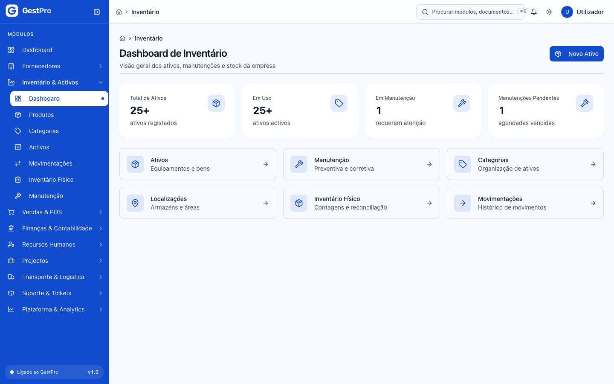

O **Dashboard de Inventário** mostra quatro indicadores (Total de Ativos, Em Uso, Em Manutenção, Manutenções Pendentes) e atalhos para Ativos, Manutenção, Categorias (de activos), Localizações, Inventário Físico e Movimentações. O botão **Novo Ativo** abre o formulário de um activo novo.

> **Atenção:** hoje os indicadores do Dashboard não mostram o total real. «Total de Ativos» e «Em Uso» mostram 0, 1 ou «25+», e «Em Manutenção» mostra no máximo 1. Para saber quantos activos tem em cada estado, use o filtro **Estado** em **Activos**.

## Tarefas

### Como criar uma localização

**Antes de começar:** precisa de uma destas permissões de perfil: Administrador, Gestor ou Operador.

1. No **Dashboard** do inventário, clique no atalho **Localizações**.
2. Clique em **Nova Localização**.
3. Preencha **Código \*** (ex.: ARM-01), **Nome \*** e **Tipo \***. Se quiser, preencha também **Endereço**, **Descrição** e **Capacidade**.
4. Clique em **Criar Localização**.

**Resultado:** aparece a mensagem «Localização criada com sucesso!». A localização passa a estar disponível nos formulários de movimentos de stock, de activos e de inventário físico.

Para deixar de usar uma localização, abra o menu **⋯** da linha e escolha **Desactivar**. Uma localização desactivada deixa de aparecer para novos activos e novo stock.

O plano de subscrição limita o número de localizações do tipo **Armazém** activas: 1 no plano Básico, 5 no
Profissional, sem limite no Empresarial. As localizações de outros tipos (Prateleira, Sala, Filial…) não
contam. No limite, criar mais um armazém é recusado com a mensagem «O plano … permite até … e esse limite já
foi atingido…»: mude de plano em **Definições › Subscrição** ou desactive um armazém que já não use.

> **Atenção:** a opção **Editar** no menu **⋯** das localizações ainda abre uma página inexistente. Por enquanto não é possível alterar uma localização depois de criada.

### Como criar uma categoria de produto

**Antes de começar:** perfil Administrador, Gestor ou Operador.

1. Vá a **Inventário & Activos › Categorias de produto** (ou clique em **Categorias** na lista de produtos) e clique em **Nova categoria**.
2. Em **Identificação**, preencha **Nome \*** (ex.: Materiais de construção). **Cor** (identifica a categoria nas listagens) e **Descrição** são opcionais.
3. Em **Estado**, deixe ligado o interruptor **Categoria activa**.
4. Clique em **Criar categoria**.

**Resultado:** aparece «Categoria criada.» e volta à lista **Categorias de Produto**. A categoria passa a aparecer no campo **Categoria** do formulário de produto.

Para alterar, clique na linha (ou em **⋯ › Editar**), mude os campos e clique em **Guardar alterações**. Aparece «Categoria actualizada.». Não pode haver duas categorias com o mesmo nome.

### Como criar um produto

**Antes de começar:** perfil Administrador, Gestor ou Operador. Tem de existir pelo menos uma categoria de produto ([Como criar uma categoria de produto](#como-criar-uma-categoria-de-produto)). Se ainda não houver nenhuma, o formulário mostra «Ainda não há categorias de produto.» com a ligação **Criar categoria**.

1. Vá a **Inventário & Activos › Produtos** e clique em **Novo Produto**.
2. Em **Identificação**, preencha **SKU \*** (ex.: PROD-001), **Nome \***, **Categoria \*** e **Unidade de Medida \*** (Unidade, Quilograma, Litro, Metro, Caixa ou Pacote). **Marca** e **Descrição** são opcionais.
3. Em **Preços e Stock**, indique **Preço de Compra (MT) \***, **Preço de Venda (MT) \***, **Taxa de IVA** (Isento (0%) ou 16%) e **Stock Mínimo**.
4. Clique em **Criar Produto**.

**Resultado:** aparece «Produto criado com sucesso!» e volta à lista **Catálogo de Produtos**. O produto fica no estado **Activo**.

**Efeitos noutros módulos:** o produto passa a poder ser usado em vendas e no POS ([Vendas & POS](04-vendas-e-pos.md)) e em movimentos de stock. Criar o produto não lhe dá stock. O stock entra com uma entrada (incluindo a de uma compra recebida) ou com a produção.

<!-- captura: 03-inventario/produtos-lista.png | /produtos -->
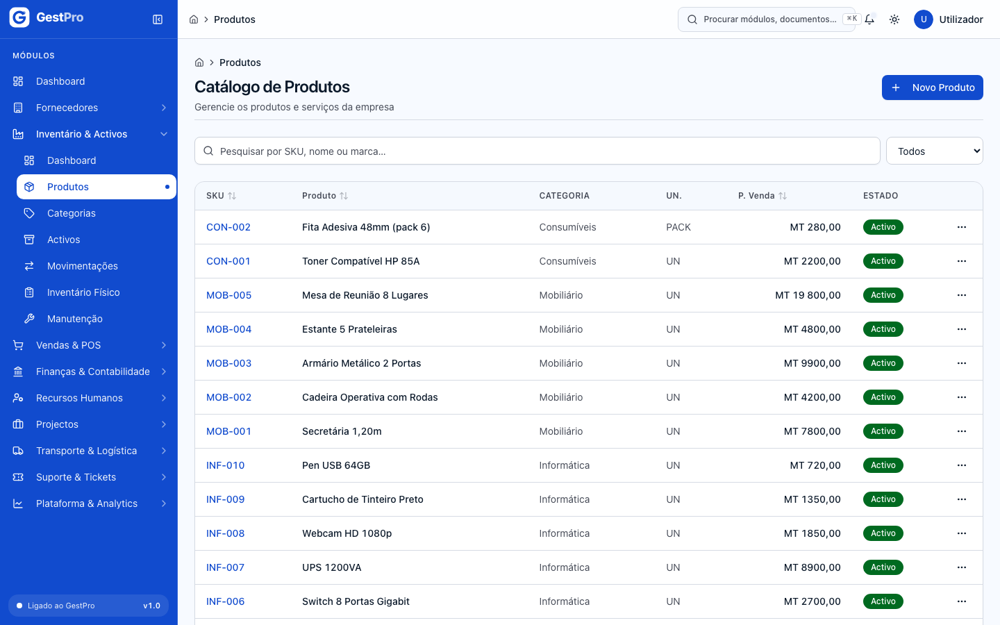

<!-- captura: 03-inventario/produto-novo.png | /produtos/novo -->
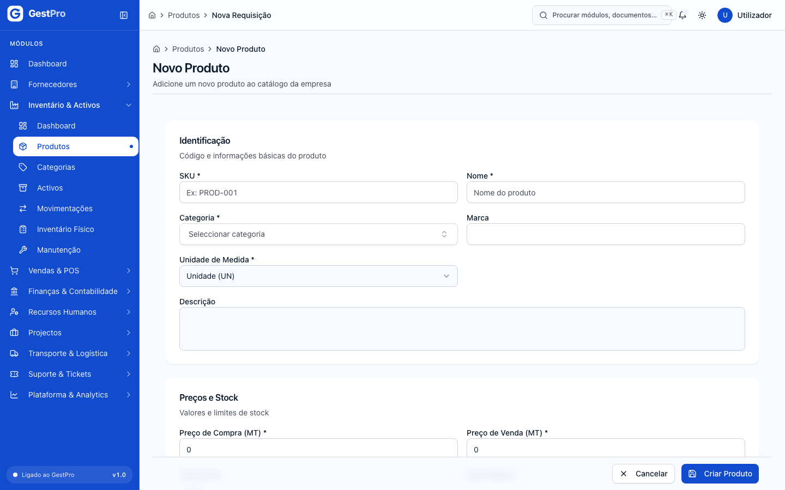

### Como consultar, editar ou arquivar um produto

1. Em **Produtos**, pesquise por SKU, nome ou marca, ou filtre por **Estado** (Activo / Inactivo).
2. Clique na linha para ver o detalhe: SKU, categoria, preços, **Margem**, **IVA**, **Stock Mínimo** e os separadores **Stock** e **Variantes**. O separador **Stock** mostra, em **Stock por localização**, a **Quantidade**, a **Reservada** e a **Disponível** do produto em cada localização (ou «Sem stock registado em nenhuma localização.»). Só aparece a quem pode consultar o inventário.
3. Para alterar, clique em **Editar** (no detalhe ou no menu **⋯** da lista), mude os campos e clique em **Guardar Alterações**. O SKU não se pode alterar.
4. Para retirar o produto de uso, abra o menu **⋯** da linha, escolha **Arquivar** e confirme. O produto fica **Inactivo** e deixa de poder ser editado.

**Resultado:** aparece «Produto actualizado com sucesso.» ou «Produto "…" arquivado.».

> **Atenção:** no formulário de edição, a **Taxa de IVA** escolhe-se entre **16%** e **0% (isento)**. O separador **Variantes** é só de consulta: ainda não é possível criar variantes neste ecrã.

### Como dar entrada de stock

**Antes de começar:** perfil Administrador, Gestor ou Operador. O produto e a localização de destino têm de existir.

1. Vá a **Inventário & Activos › Movimentações** e clique em **Nova Movimentação**.
2. Escolha o cartão **Entrada**.
3. Em **Produto**, escolha o **Produto** e, se aplicável, a **Variante**.
4. Em **Destino e quantidade**, escolha a **Localização de destino** e indique a **Quantidade**. Por baixo aparece a unidade do produto.
5. Se quiser, em **Referência**, escolha o **Tipo de documento** (Recebimento de compra, Ajuste de inventário, Devolução de venda, Produção (saída), Manual) e preencha **Nº do documento**, **Motivo** e **Observações**.
6. Clique em **Registar Entrada**.

**Resultado:** aparece «Entrada de stock registada com sucesso.» e o saldo do produto nessa localização aumenta.

> **Nota:** para mercadoria comprada a fornecedores, registe primeiro a recepção no pedido de compra confirmado, em [Compras](01-compras.md) (**Registar recepção**): é ela que fica ligada ao pedido e, quando o pedido fica totalmente recebido, cria a conta a pagar ao fornecedor. Nesta versão, os itens criados nos formulários de Compras não ficam ligados a um produto do catálogo, por isso a recepção **não** mexe no stock deles (o ecrã mostra «sem produto (não entra em stock)»). Dê a entrada aqui, com Tipo de documento **Recebimento de compra** e o número da guia do fornecedor.

<!-- captura: 03-inventario/movimentacao-nova.png | /inventario/movimentacoes/nova -->
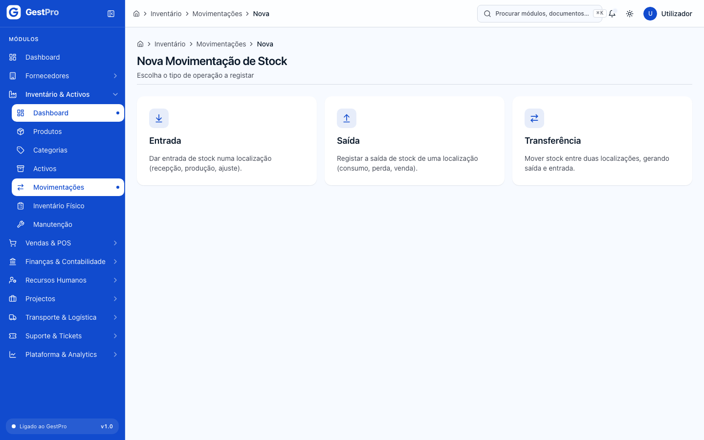

<!-- captura: 03-inventario/movimentacao-entrada.png | /inventario/movimentacoes/nova/entrada -->
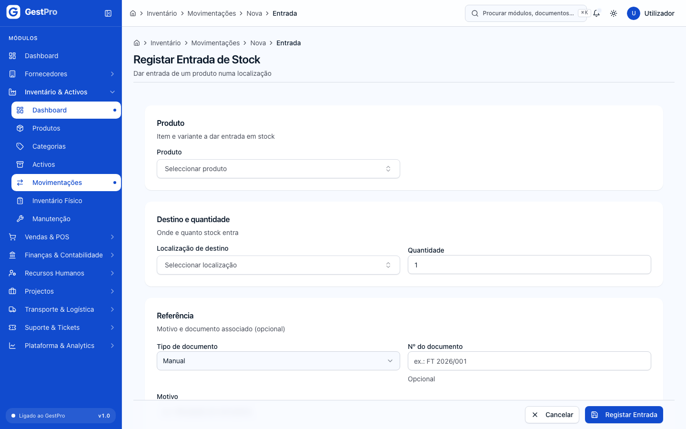

### Como dar saída de stock

**Antes de começar:** perfil Administrador, Gestor ou Operador. O produto tem de ter saldo suficiente na localização de origem.

1. Em **Movimentações**, clique em **Nova Movimentação** e escolha **Saída**.
2. Escolha o **Produto** (e a **Variante**, se houver).
3. Em **Origem e quantidade**, escolha a **Localização de origem** e a **Quantidade**.
4. Se quiser, indique o **Tipo de documento** (Venda, Ordem de produção, Perda / quebra, Ajuste de inventário, Manual), o **Motivo** e as **Observações**.
5. Clique em **Registar Saída**.

**Resultado:** aparece «Saída de stock registada com sucesso.» e o saldo diminui.

Se não houver stock suficiente, a saída não é registada. Aparece o aviso «Stock insuficiente na localização de origem para a quantidade indicada. Ajuste a quantidade ou escolha outra localização.» Reduza a quantidade, escolha outra localização ou registe primeiro uma entrada.

### Como transferir stock entre localizações

**Antes de começar:** perfil Administrador, Gestor ou Operador.

1. Em **Movimentações**, clique em **Nova Movimentação** e escolha **Transferência**.
2. Escolha o **Produto** (e a **Variante**, se houver).
3. Em **Origem e destino**, escolha a **Localização de origem** e a **Localização de destino**. A lista de destino não mostra a origem.
4. Indique a **Quantidade** e o **Motivo** (obrigatório). **Observações** é opcional.
5. Clique em **Registar Transferência**.

**Resultado:** aparece o painel **Transferência concluída** com os dois movimentos criados: **Movimento de saída** na origem e **Movimento de entrada** no destino. O saldo total do produto não muda. Clique em **Registar outra** para fazer uma nova transferência.

> **Atenção:** hoje a página **Transferências de Stock** (botão **Ver transferências**) aparece sempre vazia. As transferências registadas aparecem em **Movimentações**.

### Como consultar as movimentações

Em **Movimentações** vê os movimentos mais recentes, com as colunas **Tipo**, **Produto**, **Qtd**, **Motivo** e **Data**. Aparecem os movimentos registados neste ecrã e também os que vêm de compras, vendas, produção e contagens.

> **Atenção:** hoje o filtro **Tipo** e a caixa de pesquisa não filtram esta lista. Nas transferências, a coluna **Tipo** mostra o código interno (TRANSFERENCIA_ENTRADA / TRANSFERENCIA_SAIDA).

<!-- captura: 03-inventario/movimentacoes-lista.png | /inventario/movimentacoes -->
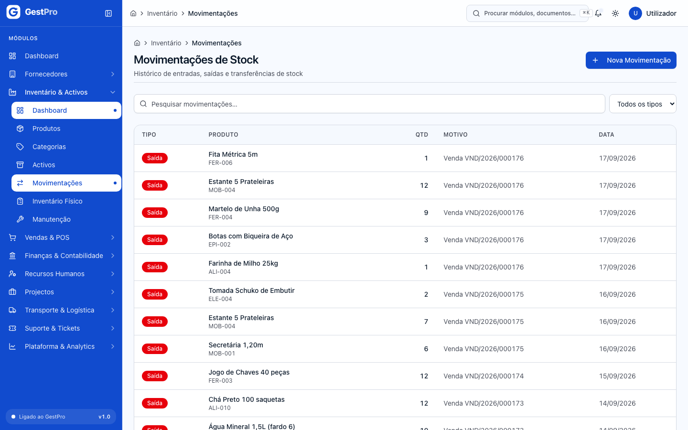

### Como ver os produtos que precisam de reposição

1. Abra o endereço /stock/reposicao, ou o atalho **Reposição** no Dashboard de Stock (/stock/dashboard).
2. A lista mostra os produtos com saldo abaixo do **Stock Mínimo**: **Saldo Actual**, **Reservado**, **Disponível** e o alerta **Stock Baixo**.

> **Atenção:** nesta lista, as colunas **Produto** e **Localização** mostram ainda um código interno abreviado, e não o nome.

### Como fazer uma contagem de stock (e acertar o stock)

**Antes de começar:** perfil Administrador, Gestor ou Operador. A empresa precisa de uma série de numeração activa para contagens de stock no ano corrente. As séries são geridas em [Faturação, Caixa e Tesouraria](06-faturacao-caixa-tesouraria.md).

1. Abra o endereço /inventario/contagens (**Contagens de Stock**) e clique em **Nova Contagem**.
2. Em **Configuração da Contagem**:
   - **Responsável \***: já vem preenchido com o seu utilizador;
   - **Contagem Cega**: «Não (saldos visíveis)» ou «Sim (saldos ocultos até fecho)»;
   - **Localização (opcional)** e **Categoria (opcional)**: escolha na lista uma localização (pelo nome e código) e/ou uma categoria de produto, ou deixe «Todas as localizações» e «Todos os produtos» para contar tudo;
   - **Observações**.
3. Clique em **Abrir Contagem**. A contagem recebe um número, fica no estado **Em Contagem** e o sistema cria uma linha para cada produto e localização com stock. Cada linha guarda o **Saldo Sistema** no momento da abertura.
4. Na tabela **Itens de Contagem**, escreva a quantidade real em **Qtd. Contada** e clique no visto (✓) da linha. O item passa a **Contado** e a coluna **Diferença** mostra a diferença para o saldo do sistema.
5. Para um item que não conseguiu contar, ou cuja diferença está explicada e **não deve** mexer no stock, clique no ícone de mensagem (**Justificar discrepância**), escreva o motivo (pelo menos 5 caracteres) e clique em **Guardar Justificativa**. O item passa a **Justificado**. Um item justificado nunca é ajustado na reconciliação, mesmo que já tivesse quantidade contada.
6. Quando não houver itens **Pendentes**, clique em **Reconciliar** e depois em **Confirmar Reconciliação**.
7. Confira o resultado e clique em **Concluir** › **Confirmar Conclusão**.

**Resultado:** a reconciliação cria um movimento de entrada por cada item **Contado** com diferença positiva e um movimento de saída por cada item **Contado** com diferença negativa, com o motivo «Ajuste de contagem …». Esses itens passam a **Ajustado** e a contagem passa a **Reconciliada**. Os itens **Justificados** ficam como estão. Depois de **Concluir**, a contagem já não pode ser alterada.

**Diferenças acima de 5 %:** se a diferença de um item contado for superior a 5 % do **Saldo Sistema** (ou se o saldo do sistema era 0), a reconciliação precisa de aprovação. Quem tem permissão para aprovar discrepâncias de contagem (o Administrador e o Gestor; o Operador não a tem) clica em **Reconciliar** e fica registado como aprovador. Para os outros utilizadores a reconciliação é recusada com a mensagem «… acima do limiar de 5%. A reconciliação requer aprovação de um utilizador com permissão para aprovar discrepâncias.» Em alternativa, se a diferença não deve acertar o stock, justifique o item.

**Efeitos noutros módulos:** os ajustes aparecem em **Movimentações** e alteram o stock disponível para vendas e POS. A contagem não cria lançamentos contabilísticos.

> **Atenção:** nas colunas **Produto** e **Localização** dos itens (e na mensagem de diferença acima de 5 %) aparecem ainda códigos internos, e não os nomes.

Para cancelar, clique em **Cancelar Contagem** › **Confirmar Cancelamento**. Não é possível cancelar uma contagem já **Concluída**.

<!-- captura: 03-inventario/contagem-detalhe.png | /inventario/contagens >primeiro -->
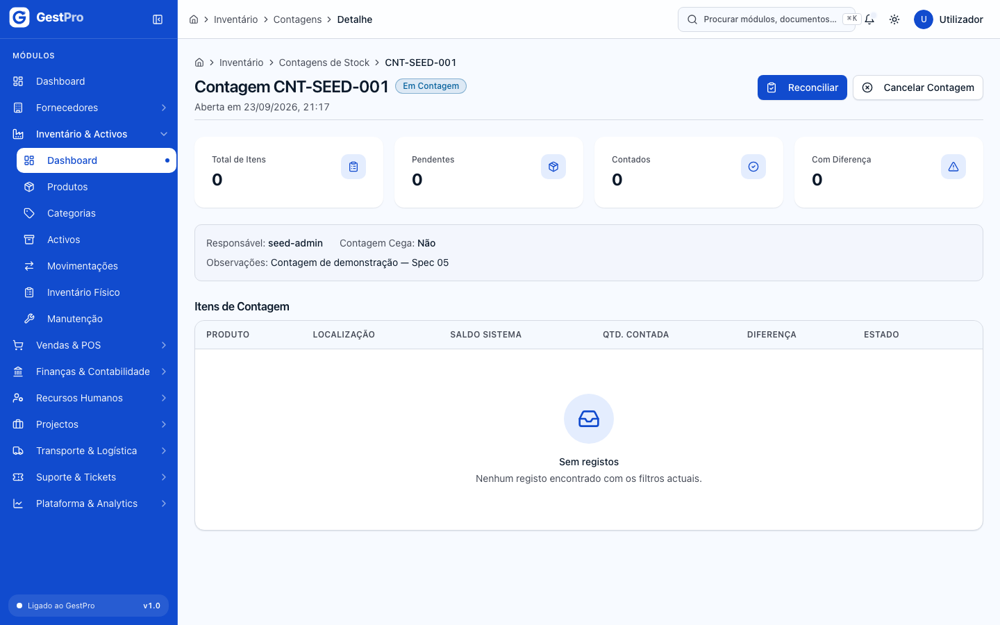

### Como criar uma categoria de activo

**Antes de começar:** perfil Administrador ou Gestor.

1. Vá a **Inventário & Activos › Categorias de activos** (página **Categorias de Ativos**) e clique em **Nova Categoria**.
2. Em **Identificação**, preencha **Código \*** (ex.: EQ-TI), **Nome \*** e, se quiser, **Descrição**.
3. Em **Amortização**, escolha o **Método de Amortização** (Linear, Dígitos dos Anos, Unidades de Produção, Saldos Decrescentes) e preencha **Vida Útil (anos) \***, **Valor Residual (%)** e **Intervalo Preventiva (dias)**.
4. Clique em **Criar Categoria**.

**Resultado:** aparece «Categoria criada com sucesso!».

Para alterar, use **⋯ › Editar** na linha. O **Código** não se pode alterar. Em **Estado**, o interruptor **Categoria activa** desligado impede que a categoria seja usada em novos activos. Clique em **Guardar Alterações**.

<!-- captura: 03-inventario/categorias-lista.png | /inventario/categorias -->
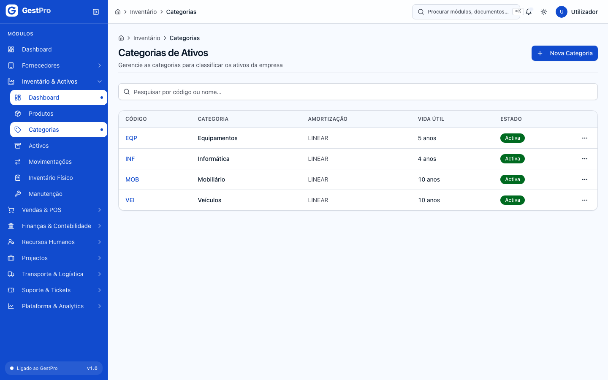

### Como registar um activo

**Antes de começar:** perfil Administrador ou Gestor. Tem de existir pelo menos uma categoria de activo e uma localização activa.

1. Vá a **Inventário & Activos › Activos** (página **Gestão de Ativos**) e clique em **Novo Ativo**.
2. **Informações Básicas:** **Código Interno \*** (ex.: INF-001), **Categoria \***, **Nome do Ativo \***. Opcionais: **Descrição**, **Marca**, **Modelo**, **Número de Série**.
3. **Informações Financeiras:** **Data de Aquisição \***, **Valor de Compra (MT) \***, **Vida Útil (anos) \***. Opcional: **Valor Residual (MT)**.
4. **Localização e Estado:** **Localização \***, **Estado Inicial** (Novo ou Em Uso) e **Método de Amortização**.
5. **Informações Adicionais:** **Observações**.
6. Clique em **Guardar Ativo**.

**Resultado:** aparece «Ativo criado com sucesso!» e o activo passa a constar da lista.

<!-- captura: 03-inventario/ativos-lista.png | /inventario/ativos -->
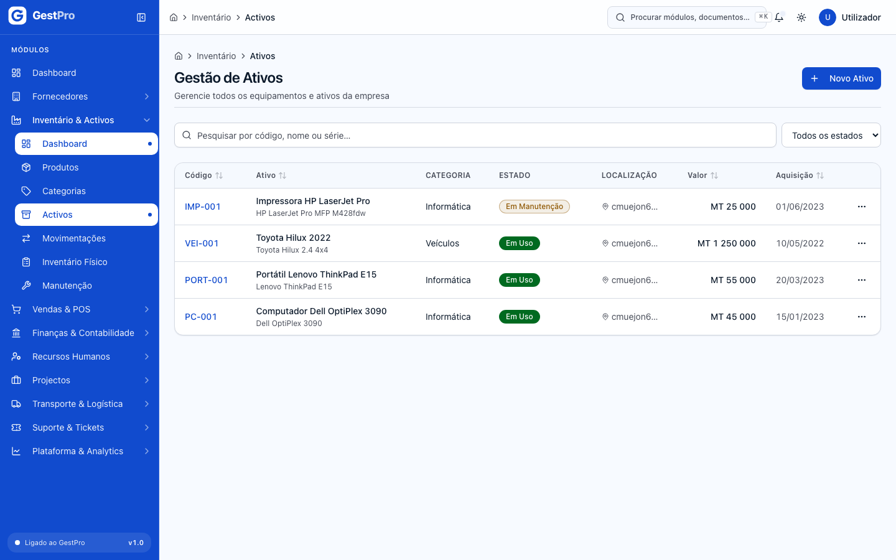

### Como mudar o estado de um activo (colocar em uso, baixar, arquivar)

1. Abra o activo (clique na linha da lista).
2. No topo do detalhe aparecem só os botões dos estados permitidos, por exemplo **Em Uso**, **Em Manutenção**, **Obsoleto** ou **Baixado**. Os mesmos botões estão no menu **⋯** da lista.
3. Clique no estado pretendido. Para **Baixado**, escreva em **Observações** o motivo da baixa (opcional) e clique em **Confirmar Baixa**. Um activo baixado não pode voltar atrás.
4. Um activo **Baixado** pode ainda ser retirado das listas com **Arquivar** › **Arquivar Ativo**. Esta acção também não se pode desfazer.

**Resultado:** aparece «Ativo transitado para …» ou «Ativo arquivado com sucesso.».

Para alterar os dados (categoria, nome, descrição, marca, modelo, valor de compra, vida útil, localização), use **Editar** e depois **Guardar Alterações**. Um activo **Baixado** não pode ser editado.

### Como anexar documentos a um activo

**Antes de começar:** perfil Administrador ou Gestor.

1. Abra o activo e vá ao separador **Documentos**.
2. Em **Tipo de documento**, escolha Manual, Certificado, Garantia, Factura / Nota Fiscal ou Outro.
3. Clique em **Carregar documento do ativo** e escolha o ficheiro (PDF, imagem ou Office, máx. 10 MB).
4. Aguarde a mensagem «Documento carregado com sucesso.». Para enviar outro ficheiro, clique em **Carregar outro**.

**Resultado:** o documento aparece em **Documentos anexados**, com o tipo e a data. Clique em **Descarregar** para o abrir. Para o apagar, clique no ícone do caixote do lixo e depois em **Remover**. O ficheiro é apagado de vez.

O detalhe do activo tem também os separadores **Informações** (identificação e valores), **Movimentações** (ver a tarefa seguinte) e **Amortização** (método, vida útil e, depois de processada a amortização de algum mês, a percentagem amortizada e a amortização acumulada).

<!-- captura: 03-inventario/ativo-detalhe.png | /inventario/ativos >primeiro -->
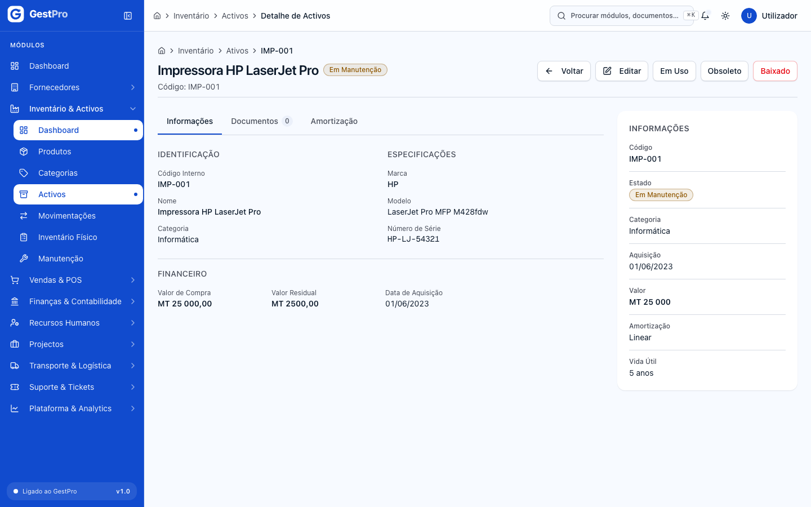

### Como movimentar um activo (mudar de localização ou de responsável)

**Antes de começar:** perfil Administrador ou Gestor. O activo não pode estar **Baixado**.

1. Abra o activo e clique em **Movimentar**.
2. Na secção **Transferência** vê a origem (localização e responsável actuais). Indique o destino: a **Localização de destino**, o **Responsável de destino**, ou os dois. A localização pesquisa-se pelo nome ou código (só localizações activas); o responsável, pelo nome ou e-mail do utilizador.
3. Escreva o **Motivo** (obrigatório) e, se quiser, **Observações (opcional)**.
4. Clique em **Registar movimentação**.

**Resultado:** aparece «Movimentação registada.» e volta ao detalhe do activo, que passa a ter a nova localização e/ou o novo responsável. O estado do activo não muda. A movimentação fica no separador **Movimentações**, com **Data**, **Tipo**, **Localização**, **Responsável** e **Motivo**.

Se o destino for igual à situação actual, a movimentação é recusada com «A transferência não muda a localização nem o responsável do ativo».

### Como processar a amortização do mês

**Antes de começar:** perfil Administrador. Os activos a amortizar têm de estar **Em Uso**.

1. Abra **Relatórios de Inventário** (/inventario/relatorios) e, no cartão **Amortizações**, clique em **Ver Relatório**; ou abra directamente /inventario/amortizacao.
2. Clique em **Processar amortização do mês**.
3. Confirme em **Processar amortização do mês** na janela «Processar a amortização de MM/AAAA?».

**Resultado:** o sistema calcula a amortização do mês corrente (hora de Maputo) de cada activo **Em Uso** que ainda não a tenha, pelo método, vida útil e valor residual de cada activo. Aparece, por exemplo, «Amortização de 10/2026: 3 ativo(s) processado(s).». Se o mês já estava processado, aparece «A amortização de 10/2026 já estava processada.». Repetir é seguro: um activo nunca é amortizado duas vezes no mesmo mês, e os activos adquiridos depois desse mês ficam de fora.

A lista **Amortização de Ativos** mostra, para os activos em uso, o **Valor Original**, o **Valor Líquido** e a percentagem **Amortizado**; o separador **Amortização** de cada activo mostra a amortização acumulada.

**Efeitos noutros módulos:** nenhum. O processamento **não cria lançamentos contabilísticos**. Para reflectir a amortização na contabilidade, registe-a com um [lançamento manual](05-contabilidade.md#como-criar-um-lançamento-manual).

> **Atenção:** só se processa o mês corrente. Um mês que ficou por processar já não pode ser processado a partir deste ecrã.

### Como agendar e acompanhar uma manutenção

**Antes de começar:** perfil Administrador ou Gestor.

1. Vá a **Inventário & Activos › Manutenção** e clique em **Nova Manutenção**.
2. Em **Informações Básicas**, escolha o **Ativo \*** e o **Tipo \*** (Preventiva, Corretiva, Inspecção, Calibração) e preencha **Título \*** e **Descrição \***.
3. Em **Agendamento e Prioridade**, indique a **Prioridade** (Baixa, Média, Alta, Crítica) e a **Data Agendada \***. **Custo Estimado (MT)** e **Observações** são opcionais.
4. Clique em **Criar Manutenção**. A manutenção fica **Agendada**.
5. Quando o trabalho começar, clique em **Iniciar**. A manutenção passa a **Em Andamento**.
6. Quando o trabalho terminar, clique no botão que conclui a manutenção (ver a nota abaixo). A manutenção passa a **Concluída**.
7. Se a manutenção não se fizer, clique em **Cancelar**, escreva o motivo (opcional) e clique em **Confirmar Cancelamento**.

**Resultado:** ao **Iniciar**, um activo que esteja **Em Uso** passa automaticamente a **Em Manutenção**. Ao concluir, volta a **Em Uso**. Se cancelar, o estado do activo não muda.

O detalhe da manutenção tem os separadores **Detalhes**, **Custos** e **Relatório**. As manutenções agendadas cuja data já passou contam no indicador «Manutenções Pendentes» do Dashboard.

> **Atenção:** no estado **Em Andamento** aparecem dois botões com o mesmo nome, **Concluir**. O primeiro passa a manutenção para **Orçamento** e o segundo para **Concluída**. De **Orçamento**, o botão **Retomar** volta a **Em Andamento**. Ainda não é possível registar o **Custo Real** nos ecrãs. A edição permite alterar título, prioridade, data agendada, descrição, custo estimado e observações.

<!-- captura: 03-inventario/manutencao-lista.png | /inventario/manutencao -->
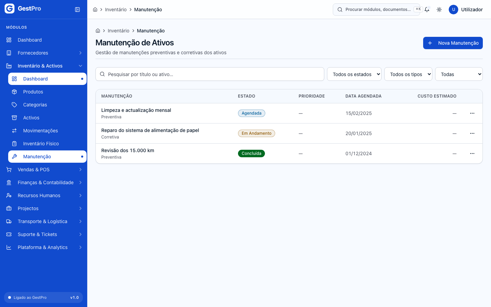

### Como criar um inventário físico de activos

**Antes de começar:** perfil Administrador, Gestor ou Operador.

1. Vá a **Inventário & Activos › Inventário Físico** e clique em **Novo Inventário**.
2. Em **Identificação**, preencha **Código \*** (ex.: INV-2026-001), **Data de Início \*** e **Título \***. Se quiser, preencha também **Data Prevista de Conclusão**, **Localização Principal**, **Descrição** e **Observações**.
3. Clique em **Criar Inventário**.

**Resultado:** aparece «Inventário físico criado com sucesso!» e o inventário fica **Planeado**. No detalhe vê os separadores **Detalhes**, **Contagem**, **Equipa** e **Discrepâncias**, e os totais Ativos esperados, Contados, Discrepâncias e Progresso.

### Como contar os activos num inventário físico

**Antes de começar:** perfil Administrador, Gestor ou Operador. O inventário tem de estar criado.

1. Abra o inventário em **Inventário Físico** e clique em **Agendar**. Aparece «Inventário agendado.» e o estado passa a **Agendado**.
2. No dia da contagem, clique em **Iniciar**. O inventário passa a **Em andamento** e o sistema gera, no separador **Contagem**, uma linha por cada activo registado da empresa, com o **Estado esperado** (o estado que o activo tem no sistema).
3. Para cada activo, clique em **Registar contagem** na linha. O ecrã **Registar contagem** abre com **Encontrado** e o estado esperado já escolhidos (ou com a contagem anterior, se já contou esse activo):
   - escolha **Encontrado** ou **Não encontrado**;
   - se foi encontrado, confirme ou altere o **Estado encontrado**;
   - se quiser, escreva **Observações**;
   - clique em **Registar contagem**. Aparece «Contagem registada.».
4. Na linha, o **Resultado** passa de «Por contar» a «Encontrado» ou «Não encontrado»; um activo não encontrado, ou encontrado num estado diferente do esperado, fica marcado com «· discrepância» e conta em **Discrepâncias**.
5. Se precisar de interromper, clique em **Pausar** (e depois em **Retomar**). Enquanto o inventário está pausado não se registam contagens.
6. Quando todos os activos estiverem contados, clique em **Concluir**. Aparece «Inventário concluído.».

**Resultado:** o inventário fica **Concluído**, com os totais de activos contados e de discrepâncias. Para anular um inventário ainda não concluído, clique em **Cancelar inventário** e confirme em **Cancelar inventário**. Um inventário cancelado não volta a ser iniciado nem contado.

**Efeitos noutros módulos:** nenhum. Concluir o inventário não altera a localização nem o estado dos activos: se um activo não foi encontrado ou está noutro estado, corrija-o na ficha do activo (por exemplo, [mudando o estado](#como-mudar-o-estado-de-um-activo-colocar-em-uso-baixar-arquivar) ou [movimentando-o](#como-movimentar-um-activo-mudar-de-localização-ou-de-responsável)).

> **Atenção:**
> - A lista de contagem inclui **todos** os activos da empresa, qualquer que seja a **Localização Principal** escolhida no inventário.
> - O botão **Editar** do detalhe abre ainda uma página inexistente, e o separador **Equipa** não tem forma de acrescentar membros.
> - Para contar **produtos** e acertar o stock, use as **Contagens de Stock** (ver [acima](#como-fazer-uma-contagem-de-stock-e-acertar-o-stock)).

<!-- captura: 03-inventario/fisico-lista.png | /inventario/fisico -->
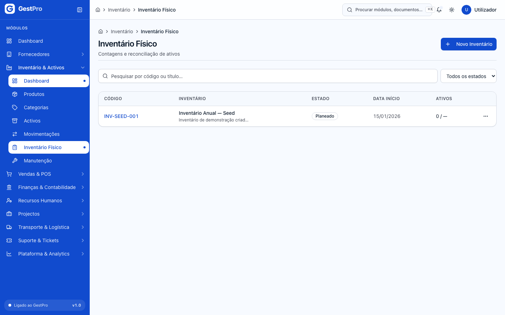

## Efeitos de outros módulos no stock

| Operação | Onde | Efeito no stock |
|---|---|---|
| Recepção de mercadoria | [Compras](01-compras.md) | Entrada de cada item aceite ligado a um produto do catálogo, na localização de destino (os itens criados nos formulários de Compras não têm produto: entrada manual) |
| Venda no POS | [Vendas & POS](04-vendas-e-pos.md) | Saída imediata do stock |
| Encomenda de venda confirmada / entregue / cancelada | [Vendas & POS](04-vendas-e-pos.md) | Reserva o stock, depois dá-lhe saída ou liberta a reserva |
| Devolução ou troca de venda | [Vendas & POS](04-vendas-e-pos.md) | Entrada do artigo devolvido (e saída do artigo dado em troca) |
| Ordem de produção | [Projetos e Produção](08-projetos-e-producao.md) | Ao liberar, reserva os materiais da estrutura no armazém de código `MP`; **Registar consumo** dá-lhes saída de imediato; ao concluir, dá saída do que estava reservado e entrada do produto acabado no armazém de código `PA`; ao cancelar, liberta as reservas |

Todos estes movimentos aparecem em **Movimentações**. Se não houver stock suficiente, a operação no outro módulo é recusada com a mesma mensagem de stock insuficiente.

## Estados

### Produto

| Estado | Significado | Pode passar a | Quem |
|---|---|---|---|
| Activo | Disponível para uso em compras, vendas e stock | Inactivo (com **Arquivar**) | Administrador, Gestor, Operador |
| Inactivo | Arquivado. Não pode ser editado | — | — |

### Activo

| Estado | Significado | Pode passar a | Quem |
|---|---|---|---|
| Novo | Registado, ainda não em utilização | Em Uso, Baixado | Administrador, Gestor |
| Em Uso | Em utilização normal | Em Manutenção, Em Transferência, Obsoleto, Baixado | Administrador, Gestor |
| Em Manutenção | Em reparação ou revisão (também muda automaticamente ao **Iniciar** uma manutenção) | Em Uso, Obsoleto, Baixado | Administrador, Gestor |
| Em Transferência | A ser mudado de sítio | Em Uso, Baixado | Administrador, Gestor |
| Obsoleto | Já não serve, mas ainda não saiu da empresa | Baixado | Administrador, Gestor |
| Baixado | Saiu do património. Não se pode reverter | Pode ser **Arquivado** | Administrador, Gestor |

### Manutenção

| Estado | Significado | Pode passar a | Quem |
|---|---|---|---|
| Agendada | Marcada para uma data | Em Andamento (**Iniciar**), Cancelada | Administrador, Gestor |
| Em Andamento | Trabalho a decorrer | Orçamento, Concluída, Cancelada | Administrador, Gestor |
| Orçamento | À espera de orçamento | Em Andamento (**Retomar**), Cancelada | Administrador, Gestor |
| Concluída | Terminada | — | — |
| Cancelada | Não realizada | — | — |

### Contagem de stock

| Estado | Significado | Pode passar a | Quem |
|---|---|---|---|
| Em Contagem | Aberta, a registar quantidades | Reconciliada, Cancelada | Administrador, Gestor, Operador |
| Reconciliada | Ajustes de stock já aplicados | Concluída, Cancelada | Administrador, Gestor, Operador |
| Concluída | Fechada. Não se pode alterar | — | — |
| Cancelada | Anulada | — | — |

O filtro da lista inclui também **Rascunho**, mas as contagens abertas no ecrã começam logo em **Em Contagem**.

Cada **item** da contagem pode estar **Pendente** (por contar), **Contado**, **Justificado** ou **Ajustado** (já acertado na reconciliação).

### Inventário físico

| Estado | Significado | Pode passar a | Quem |
|---|---|---|---|
| Planeado | Criado | Agendado (**Agendar**), Cancelado | Administrador, Gestor, Operador |
| Agendado | Data marcada | Em andamento (**Iniciar**, gera a lista de contagem), Cancelado | Administrador, Gestor, Operador |
| Em andamento | A contar os activos | Concluído (**Concluir**, só sem activos por contar), Pausado (**Pausar**), Cancelado | Administrador, Gestor, Operador |
| Pausado | Contagem interrompida; não se registam contagens | Em andamento (**Retomar**), Cancelado | Administrador, Gestor, Operador |
| Concluído | Todos os activos contados. Não se altera | — | — |
| Cancelado | Anulado. Não se retoma | — | — |

## Erros frequentes

| Mensagem mostrada | Porquê | O que fazer |
|---|---|---|
| Stock insuficiente. Disponível: X, solicitado: Y. / Stock insuficiente para a quantidade indicada. | A localização de origem não tem a quantidade pedida | Reduza a quantidade, escolha outra localização ou registe primeiro uma entrada |
| Localização de origem e destino não podem ser iguais | Na transferência escolheu a mesma localização duas vezes | Escolha um destino diferente |
| Motivo é obrigatório | Numa transferência de stock ou na movimentação de um activo, o **Motivo** é obrigatório | Preencha o motivo |
| Quantidade deve ser positiva | A quantidade é zero ou negativa | Indique uma quantidade maior que zero |
| Já existe um produto com o SKU "…". | O SKU já está a ser usado | Use outro SKU |
| Taxa de IVA deve ser 0 (isento) ou 0.16 (16%) | Na edição do produto escreveu outra taxa | Escreva `0` ou `0.16` |
| Já existe uma contagem em aberto (…) para esta localização. | Há outra contagem **Em Contagem** para a mesma localização | Termine ou cancele a contagem existente |
| Série activa para tipo "CONTAGEM_STOCK" no ano … não encontrada. Crie a série … primeiro. | Falta a série de numeração das contagens para o ano | Peça a quem gere as séries (Administrador ou Financeiro) que a crie ([Faturação, Caixa e Tesouraria](06-faturacao-caixa-tesouraria.md)) |
| Existem N item(s) PENDENTE(s) sem justificativa. Registe contagem ou justifique antes de reconciliar. | Há itens por contar | Registe a quantidade ou justifique cada item pendente |
| Item …: discrepância de X% acima do limiar de 5%. A reconciliação requer aprovação de um utilizador com permissão para aprovar discrepâncias. | A diferença de um item contado é superior a 5% do saldo do sistema (ou o saldo do sistema era 0) e o seu perfil não pode aprovar discrepâncias | Confirme a contagem. Se estiver correcta, peça a quem pode aprovar (o Administrador ou o Gestor) que clique em **Reconciliar**; se a diferença não deve mexer no stock, justifique o item |
| Justificativa deve ter pelo menos 5 caracteres | O motivo escrito é demasiado curto | Escreva um motivo mais completo |
| Indique a quantidade contada | Clicou no ✓ sem escrever a quantidade | Escreva a quantidade antes de confirmar |
| Contagem "…" não está em estado EM_CONTAGEM. | A contagem já foi reconciliada, concluída ou cancelada | Abra uma nova contagem, se for preciso |
| Este item já foi ajustado na reconciliação. | O item já foi acertado | Nada a fazer |
| Transição inválida de "…" para "…" em Ativo. | Essa mudança de estado não é permitida (ver [Estados](#activo)) | Use um dos botões que aparecem no detalhe |
| Já existe uma categoria com o nome "…". | Já há uma categoria de produto com esse nome | Use outro nome, ou edite a categoria existente |
| O plano … permite até … armazém(ns) activo(s), e esse limite já foi atingido. Para acrescentar mais, mude de plano em Definições › Subscrição (/definicoes/faturacao) ou desactive um armazém. | Criou uma localização do tipo **Armazém** acima do limite do plano | Mude de plano ou desactive um armazém que já não use |
| A transferência não muda a localização nem o responsável do ativo | Na movimentação de um activo, o destino é igual à situação actual | Escolha outra localização ou outro responsável |
| Existem N ativos por contar | Tentou concluir um inventário físico com activos ainda «Por contar» | Registe a contagem dos activos em falta |
| Só é possível registar contagens com o inventário em andamento | O inventário físico está pausado, concluído ou cancelado | Retome o inventário, se estiver pausado |
| Ficheiro demasiado grande (máx. 10 MB). | O documento tem mais de 10 MB | Comprima o ficheiro ou divida-o |
| Tipo de ficheiro não permitido. | O formato não é PDF, imagem ou Office | Converta para PDF |

## Perguntas frequentes

**Onde vejo quanto stock tenho de um produto?**
No detalhe do produto, separador **Stock**: mostra a quantidade, a reservada e a disponível em cada localização. Em **Reposição de Stock** (/stock/reposicao) vê os produtos abaixo do mínimo, e em **Movimentações** o histórico de entradas e saídas.

**Qual é a diferença entre «Inventário Físico» e «Contagens de Stock»?**
O **Inventário Físico** verifica os **activos** da empresa (equipamentos, mobiliário). As **Contagens de Stock** contam os **produtos** em armazém e acertam o stock pela quantidade contada.

**Posso apagar um movimento de stock errado?**
Não. Os movimentos ficam sempre registados. Para corrigir, registe o movimento contrário, por exemplo uma entrada para anular uma saída errada, e explique no **Motivo**.

**O Financeiro e o perfil Leitura podem usar este módulo?**
Podem consultar todas as páginas, mas não podem criar nem alterar registos.
