# 4. Vendas & POS

> **Para quem:** Administrador, Gestor, Operador (balcão/POS), Financeiro (emissão de documentos fiscais), Leitura (consulta) · **Onde:** menu › Vendas & POS

## Para que serve

O grupo **Vendas & POS** reúne tudo o que acontece do lado do cliente: vender ao balcão no **POS**, registar
**encomendas** de clientes, emitir **faturas**, corrigir faturas com **notas de crédito** e **notas de débito**, e
manter a ficha de **clientes**. As vendas feitas no POS baixam o stock e ficam registadas na sessão de caixa aberta.

A emissão de documentos fiscais pelo lado financeiro (séries de numeração, painel de faturação, proformas e cotações)
está no capítulo [Faturação, Caixa e Tesouraria](06-faturacao-caixa-tesouraria.md). Este capítulo trata a emissão a
partir das vendas.

> **Regra de ouro — um documento emitido não se altera.** Uma fatura, nota de crédito ou nota de débito, depois de
> emitida, fica tal como está: não há botão para a editar nem para a apagar. Se houver um erro, corrige-se com outro
> documento:
> - o cliente pagou **a mais** ou devolveu mercadoria → emita uma **nota de crédito** sobre a fatura;
> - ficou **por cobrar** algum valor (preço abaixo do acordado, serviço extra, portes) → emita uma **nota de débito**.
>
> Assim fica sempre registado o que foi faturado e porque é que mudou.

> **Atenção — confirme o seu e-mail antes de emitir documentos fiscais.** Se a sua empresa foi registada pelo site e
> ainda não abriu a ligação de confirmação que recebeu por e-mail, pode usar o sistema normalmente (configurar,
> importar dados, vender no POS, exportar), mas **não pode emitir faturas, notas de crédito nem notas de débito**.
> Um documento fiscal é irreversível e tem efeito para terceiros, por isso o sistema exige que se saiba quem o emite.
> Abra a ligação de confirmação; se já confirmou há pouco e o sistema ainda recusa, termine a sessão e entre outra
> vez.

## Conceitos

| Termo | O que é |
|---|---|
| Venda | Registo de uma venda a um cliente, com itens, pagamentos e histórico de estados. Tem número próprio (por exemplo `VND/2026/000123`). A **Origem** diz de onde veio: POS, Encomenda, E-Commerce ou Manual. |
| POS | O terminal de venda ao balcão. Só funciona com uma **sessão de caixa** aberta em seu nome. |
| Sessão POS | O período de trabalho de um vendedor no terminal, ligado à sua sessão de caixa. Abre-se sozinha quando entra no POS com o caixa aberto. |
| Encomenda (Pedido) | Pedido de um cliente para entrega futura, com data prevista. Tem numeração própria (`ENC/…`). |
| Fatura | Documento fiscal que diz ao cliente quanto deve e até quando. É emitida já no estado **Emitida** e não se altera. |
| Série de documento | A numeração sequencial de cada tipo de documento, por ano (por exemplo `FAT/2026`). As séries do ano são criadas automaticamente para a empresa; ver o capítulo [Faturação, Caixa e Tesouraria](06-faturacao-caixa-tesouraria.md). |
| Nota de crédito | Documento que **reduz** o valor de uma fatura já emitida (devolução, defeito, erro de valor, desconto posterior). Refere sempre uma fatura original. |
| Nota de débito | Documento que **aumenta** o que o cliente deve (serviços não faturados, correcção de preço, custos logísticos). Refere o cliente. |
| Natureza da nota de débito | O *porquê* do débito, que decide onde o valor entra na contabilidade: acerto de preço (é venda), juros de mora, despesas repercutidas, penalização ou outro. Ver [Como emitir uma nota de débito](#como-emitir-uma-nota-de-débito). |
| Devolução | Registo de mercadoria devolvida pelo cliente, com motivo e opção de reembolso. |
| Troca | Devolução seguida de venda de substituição. |
| Vendedor | Pessoa que vende, com meta mensal. |
| Comissão | Valor a pagar ao vendedor por uma venda, calculado pelas **regras de comissão**. |
| NUIT | Número Único de Identificação Tributária do cliente — 9 dígitos, obrigatório na ficha do cliente. |

## Ecrãs

| Menu | Endereço | Para que serve |
|---|---|---|
| Vendas & POS › Dashboard | `/vendas/dashboard` | Indicadores (Volume Total, Total Vendas, Concluídas, Em Curso) e as 10 vendas mais recentes. |
| — (botão **Ver todas** no Dashboard) | `/vendas` | Lista de todas as vendas, com filtros por Estado e Origem. |
| — (clique numa venda) | `/vendas/<venda>` | Detalhe da venda: separadores **Itens**, **Pagamentos** e **Histórico**; botões **Confirmar** e **Cancelar Venda**. |
| Vendas & POS › Pedidos | `/vendas/pedidos` | Lista de **Encomendas de Venda** e botão **Nova Encomenda**. |
| Vendas & POS › POS | `/pos` | Terminal de venda ao balcão. |
| Vendas & POS › Faturas | `/vendas/faturas` | Lista de faturas e botão **Nova Fatura**. |
| Vendas & POS › Notas de Crédito | `/vendas/notas-credito` | Lista de notas de crédito e botão **Nova Nota de Crédito**. |
| Vendas & POS › Notas de Débito | `/vendas/notas-debito` | Lista de notas de débito e botão **Nova Nota de Débito**. |
| Vendas & POS › Clientes | `/clientes` | Lista de clientes, botão **Novo Cliente**, ficha de cada cliente. |
| — (sem entrada no menu) | `/clientes/historico` | **Histórico de Transacções** por cliente, com exportação CSV/XLSX. |
| — (sem entrada no menu) | `/clientes/dashboard`, `/clientes/relatorios` | **Dashboard de Clientes** e **Relatórios de Clientes** (com exportação CSV/XLSX da carteira). |
| — (sem entrada no menu) | `/vendas/devolucoes` | **Devoluções**: lista e botão **Nova Devolução**. |
| — (sem entrada no menu) | `/vendas/trocas` | **Trocas**: lista (só consulta). |
| — (sem entrada no menu) | `/vendas/vendedores` | **Vendedores**: lista e botão **Novo Vendedor**. |
| — (sem entrada no menu) | `/vendas/comissoes` | **Comissões**: lista e indicadores; regras em `/vendas/comissoes/regras/nova`. |

> Os ecrãs sem entrada no menu abrem-se escrevendo o endereço na barra do navegador, depois do endereço do GestPro.

<!-- captura: 04-vendas-e-pos/dashboard.png | /vendas/dashboard -->
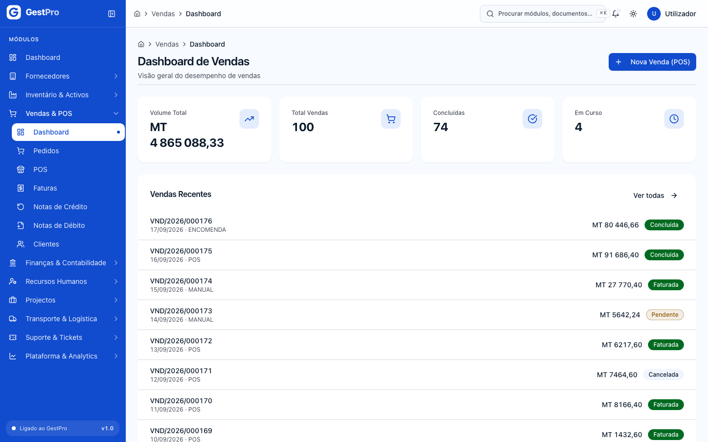

## Tarefas

### Como vender no POS

**Antes de começar**
- Precisa da permissão de operar o POS (perfis Administrador, Gestor ou Operador).
- Tem de ter uma **sessão de caixa aberta em seu nome** — quem vende é quem presta contas do dinheiro no fecho. Se
  não tiver, ao abrir o POS é levado para a abertura de caixa e volta ao POS assim que registar o fundo (ver
  [Faturação, Caixa e Tesouraria](06-faturacao-caixa-tesouraria.md)).
- A empresa tem de ter pelo menos um **armazém activo** e stock dos produtos (ver [Inventário](03-inventario.md)).

**Passos**
1. No menu, abra **Vendas & POS › POS**. Se o caixa estiver aberto, aparece por instantes «A iniciar o POS…» e o
   terminal abre. No topo do painel direito vê **Sessão POS** e o seu código.
2. Procure o produto na caixa **Pesquisar produto (/ ou F2)…** — por nome, SKU ou código de barras — ou clique
   directamente no cartão do produto. Cada clique acrescenta uma unidade ao carrinho.
3. No carrinho, use **+** e **−** para mudar a quantidade e o caixote do lixo para retirar a linha. O painel mostra
   **Subtotal**, **IVA** e **Total**.
4. Clique **Finalizar (F10)**.
5. Em **Método de pagamento**, escolha **Dinheiro**, **Cartão**, **M-Pesa**, **e-Mola** ou **Transferência**.
6. Se for **Dinheiro**, escreva o **Valor recebido (MT)**; o sistema mostra o **Troco**.
7. Clique **Pagar MT …** (o botão mostra o total).

**Atalhos de teclado:** `/` ou `F2` — pesquisar; `F10` — finalizar; `Esc` — voltar ao carrinho ou, no carrinho,
limpá-lo; `+`/`-` — aumentar ou diminuir a última linha.

**Resultado**
- Aparece «Venda VND/… registada com sucesso!» e o carrinho fica vazio para o cliente seguinte.
- A venda fica na lista de vendas (`/vendas`) com Origem **POS** e estado **Pendente**.

**Efeitos noutros módulos**
- **Stock:** cada produto vendido sai do armazém activo principal da empresa (o mais antigo). Se não houver stock
  suficiente, a venda é recusada e nada fica registado.
- **Caixa:** é registado na sua sessão de caixa um movimento de venda pelo **total** da venda, com a descrição
  «Venda VND/…».
- **Comissões:** é calculada automaticamente uma comissão para quem vendeu, no estado **Pendente**.
- **Contabilidade:** a venda POS, por si, **não** gera lançamento contabilístico nem fatura. Se o cliente precisar
  de fatura, emita-a em **Faturas** (ver abaixo).

> **Atenção — limitações actuais do POS:**
> - O sistema ainda **não imprime recibo nem talão**. O comprovativo da venda é o seu número, que pode ser consultado
>   em `/vendas`.
> - Cada venda aceita **um só método de pagamento**.
> - O terminal mostra os **primeiros 60 produtos activos** por ordem alfabética, e a pesquisa procura só entre esses.
> - O valor recebido em dinheiro não é verificado: confirme que cobre o total antes de clicar **Pagar**.

<!-- captura: 04-vendas-e-pos/pos.png | /pos -->
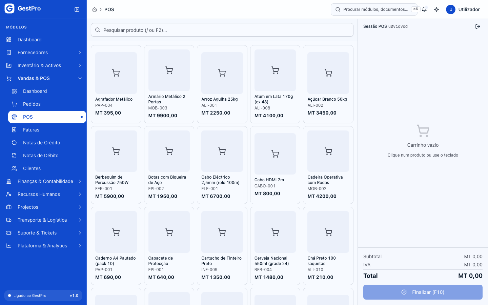

### Como fechar a sessão POS

**Antes de começar**
- O sistema **recusa fechar a sessão enquanto houver vendas Pendentes** feitas nela — e hoje todas as vendas do POS
  ficam Pendentes. Antes de fechar, abra `/vendas`, filtre **Origem: POS** e **Estado: Pendente**, e use
  **Confirmar** em cada uma (ver [Como confirmar ou cancelar uma venda](#como-confirmar-ou-cancelar-uma-venda)).

**Passos**
1. No terminal, clique no ícone de saída ao lado de **Sessão POS** (dica: «Fechar sessão POS»).
2. Na janela **Fechar sessão POS?**, clique **Fechar Sessão**.

**Resultado**
- Aparece «Sessão POS encerrada.».
- Enquanto a sua sessão de caixa continuar aberta, ao voltar ao POS é aberta automaticamente uma nova sessão POS. Para
  terminar o dia, feche também o caixa (ver [Faturação, Caixa e Tesouraria](06-faturacao-caixa-tesouraria.md)).

> A janela diz «Vendas pendentes nesta sessão não serão afectadas», mas na prática o fecho é recusado com a
> mensagem «Existem N vendas pendentes. Feche-as antes de encerrar a sessão.» — siga o passo *Antes de começar*.

### Como consultar as vendas

**Passos**
1. Abra **Vendas & POS › Dashboard** e clique **Ver todas** (ou escreva `/vendas`).
2. Use **Pesquisar por número ou nome do cliente…** e os filtros **Estado** e **Origem**.
3. Clique no número da venda para abrir o detalhe: separadores **Itens**, **Pagamentos** (método, valor, troco) e
   **Histórico** (cada mudança de estado com data e motivo).

### Como confirmar ou cancelar uma venda

**Antes de começar**
- **Confirmar** exige permissão de editar vendas (Administrador, Gestor, Operador).
- **Cancelar** exige permissão de cancelar vendas (Administrador, Gestor).

**Passos — confirmar**
1. Abra a venda (ou use o menu de acções da linha na lista).
2. Numa venda **Pendente**, clique **Confirmar**. Aparece «Venda confirmada com sucesso.».

**Passos — cancelar**
1. Abra a venda e clique **Cancelar Venda** (disponível enquanto não estiver Concluída, Cancelada ou Devolvida).
2. Na janela **Cancelar venda?**, escreva um **Motivo (opcional)** e clique **Confirmar Cancelamento**.

**Resultado**
- A venda passa a **Cancelada** e o Histórico regista a mudança. As comissões **Pendentes** dessa venda são
  canceladas. Se a venda veio de uma encomenda, o stock reservado é libertado.

> **Atenção:** cancelar uma venda feita **no POS** não devolve o stock ao armazém nem retira o valor da sessão de
> caixa — ajuste o stock em [Inventário](03-inventario.md) e o caixa no capítulo
> [Faturação, Caixa e Tesouraria](06-faturacao-caixa-tesouraria.md). O cancelamento não pode ser revertido.

### Como registar uma encomenda de cliente

**Antes de começar**
- Precisa da permissão de criar encomendas (Administrador, Gestor).
- O cliente tem de existir (ver [Como criar um cliente](#como-criar-um-cliente)).

**Passos**
1. Abra **Vendas & POS › Pedidos** e clique **Nova Encomenda**.
2. Em **Informações da Encomenda**, escolha o **Cliente \*** (pesquise por código, nome ou NUIT), opcionalmente o
   **Vendedor**, a **Data Prevista de Entrega** e **Notas**.
3. Em **Itens da Encomenda**, para cada linha escolha o **Produto \*** (o sistema mostra o preço de catálogo e
   propõe-o), e preencha **Qtd.**, **Preço Unit. (MT)** e **Desconto (%)**. Use **Adicionar Item** para mais linhas.
4. Clique **Criar Encomenda**.

**Resultado**
- Aparece «Encomenda criada com sucesso» e a encomenda fica na lista com número `ENC/…` e estado **Rascunho**.
- No detalhe vê **Estado**, **Total**, **Data Prevista** e os **Itens da Encomenda** (com a coluna **Entregue**).

> **Atenção:** hoje os ecrãs só permitem **criar e consultar** encomendas. Confirmar (reservar stock), converter em
> venda ou cancelar uma encomenda ainda não têm botão. O botão **Editar** que aparece numa encomenda em Rascunho
> ainda não abre nenhum ecrã.

<!-- captura: 04-vendas-e-pos/pedidos.png | /vendas/pedidos -->
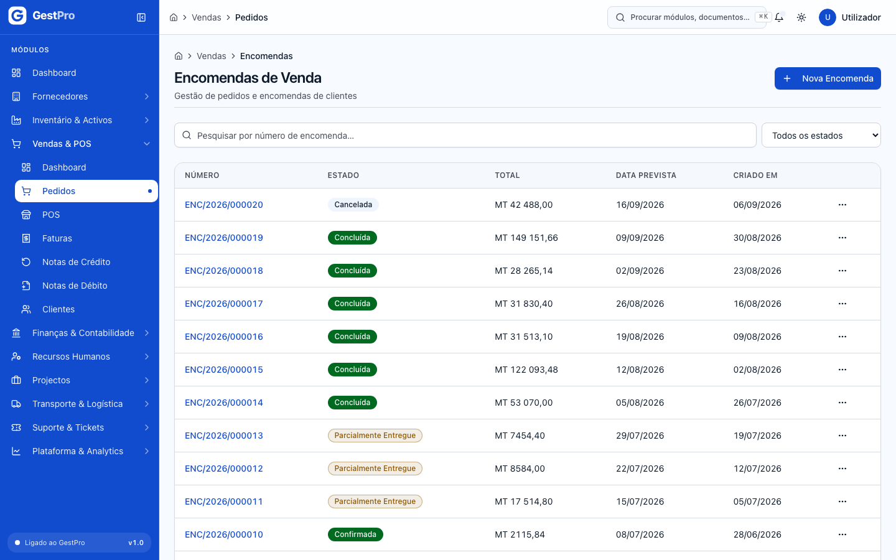

<!-- captura: 04-vendas-e-pos/encomenda-nova.png | /vendas/pedidos/novo -->
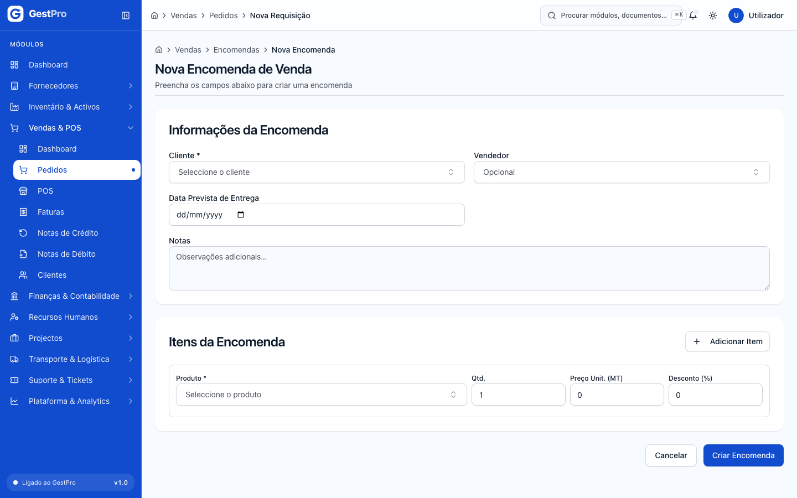

### Como emitir uma fatura

**Antes de começar**
- Precisa da permissão de emitir faturas (Administrador, Gestor, Financeiro).
- O seu **e-mail tem de estar confirmado** (ver a caixa no início do capítulo).
- Tem de existir uma série de fatura activa para o ano da data de emissão (normalmente `FAT/<ano>`, criada
  automaticamente). A série não se escolhe: a fatura é numerada na série activa de faturas do ano da data de
  emissão.

**Passos**
1. Abra **Vendas & POS › Faturas** e clique **Nova Fatura**.
2. Em **Dados da Fatura**, escolha o **Cliente \***.
3. Indique a **Data de emissão \*** e a **Data de vencimento \*** (não pode ser anterior à de emissão), a **Moeda**
   (MZN — Metical, USD — Dólar ou EUR — Euro) e, se quiser, **Observações**.
4. Em **Linhas da Fatura**, para cada linha preencha **Descrição \***, **Quantidade \***, **Preço Unit. (MT) \***,
   **Desconto (MT)** e **IVA** — **16% (padrão)** ou **0% (isento)**. Use **Adicionar linha** para mais linhas.
5. Reveja com cuidado — depois de emitida, a fatura não se altera — e clique **Emitir Fatura**.

**Resultado**
- Aparece «Fatura emitida com sucesso!» e a fatura fica na lista com número da série (por exemplo `FAT/2026/000001`)
  e estado **Emitida**.
- No detalhe vê **Total**, **Subtotal**, **IVA**, **Vencimento**, as linhas e o **Resumo Financeiro**.

**Efeitos noutros módulos**
- **Contabilidade:** a emissão cria automaticamente o lançamento contabilístico da fatura (cliente a débito; vendas e
  IVA liquidado a crédito), no mesmo momento. Ver [Contabilidade](05-contabilidade.md).
- **Stock:** a fatura **não** mexe no stock, e não fica ligada a uma venda do POS — é um documento independente.

> **Atenção:** o botão **Baixar PDF** no detalhe da fatura ainda não descarrega o documento. O registo de pagamentos
> de faturas também não está disponível nestes ecrãs.

<!-- captura: 04-vendas-e-pos/faturas.png | /vendas/faturas -->
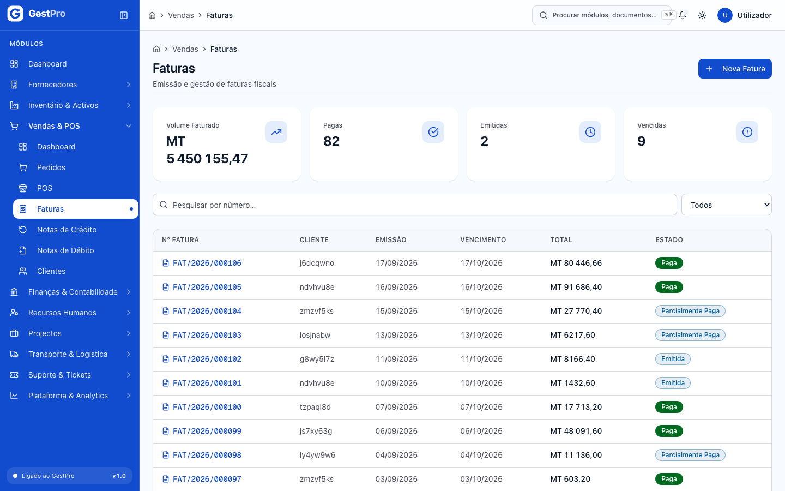

<!-- captura: 04-vendas-e-pos/fatura-nova.png | /vendas/faturas/nova -->
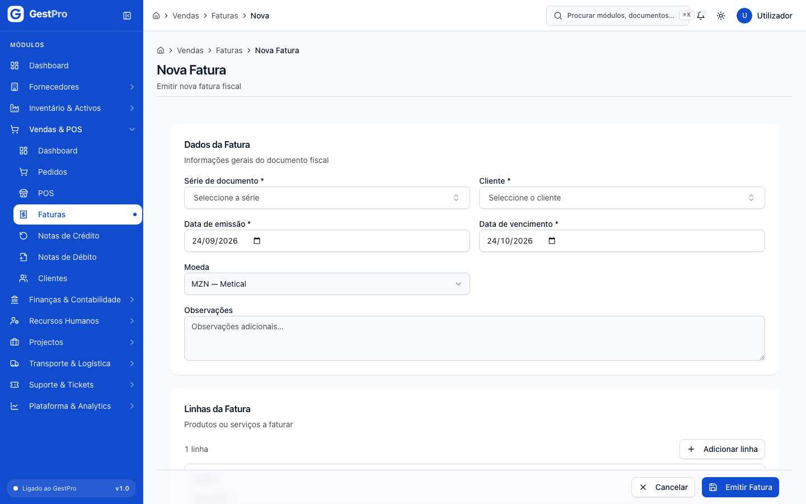

<!-- captura: 04-vendas-e-pos/fatura-detalhe.png | /vendas/faturas >primeiro -->
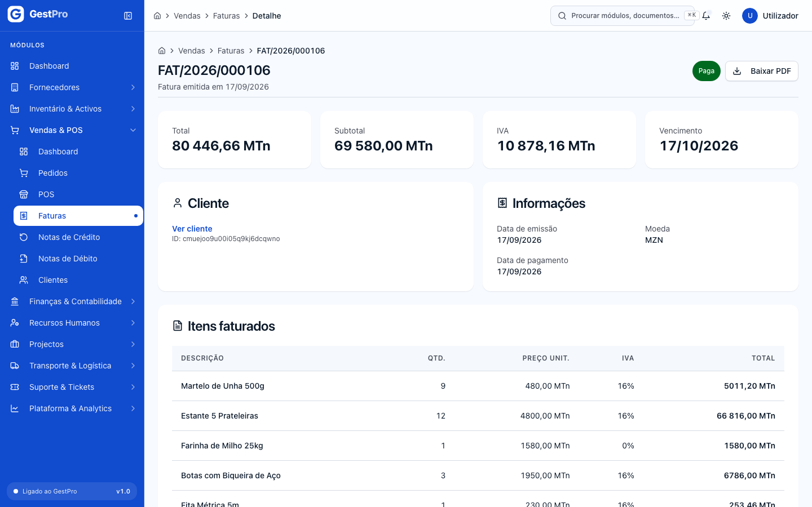

### Como emitir uma nota de crédito

Use-a para **reduzir** o valor de uma fatura já emitida: mercadoria devolvida, produto com defeito, valor cobrado a
mais, venda cancelada ou desconto concedido depois.

**Antes de começar**
- Permissão de emitir notas de crédito (Administrador, Gestor, Financeiro) e **e-mail confirmado**.
- A fatura original tem de estar no estado **Emitida** (o ecrã só mostra essas).

**Passos**
1. Abra **Vendas & POS › Notas de Crédito** e clique **Nova Nota de Crédito**.
2. Em **Dados da Nota de Crédito**, escolha a **Fatura original \*** (aparece com número e total), a **Data de
   emissão \*** e o **Motivo \***: Devolução de mercadoria, Produto com defeito, Erro no valor cobrado, Cancelamento
   de venda, Desconto posterior ou Outro motivo. A nota é numerada na série activa de notas de crédito do ano da
   data de emissão.
3. Em **Itens a Creditar**, descreva cada item (**Descrição \***, **Quantidade**, **Preço (MT)**, **Desconto (MT)**,
   **IVA**). Credite só o que está a corrigir, não a fatura inteira, a menos que seja esse o caso.
4. Clique **Emitir Nota de Crédito**.

**Resultado**
- Aparece «Nota de crédito emitida com sucesso!» e a nota fica na lista, estado **Emitida**, com ligação à
  **Fatura Original**.

**Efeitos noutros módulos**
- **Contabilidade:** é criado automaticamente o lançamento de estorno (o inverso do da fatura). Ver
  [Contabilidade](05-contabilidade.md).
- A fatura original **não muda** de estado nem de valor — a correcção é a nota de crédito.

> O sistema não impede que a nota de crédito ultrapasse o valor da fatura: confira o total antes de emitir.

<!-- captura: 04-vendas-e-pos/nota-credito-nova.png | /vendas/notas-credito/nova -->
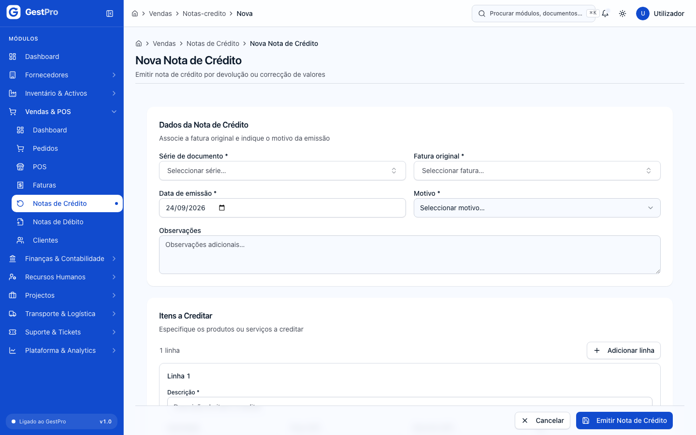

### Como emitir uma nota de débito

Use-a para **cobrar a mais** ao cliente algo que ficou de fora: um serviço adicional não faturado, uma actualização
contratual, uma correcção de preço ou custos logísticos adicionais.

**Antes de começar**
- Permissão de emitir notas de débito (Administrador, Gestor, Financeiro) e **e-mail confirmado**.

**Passos**
1. Abra **Vendas & POS › Notas de Débito** e clique **Nova Nota de Débito**.
2. Em **Dados da Nota de Débito**, escolha o **Cliente \***, a **Data de emissão \*** e o **Motivo \***: Serviços
   adicionais não faturados, Actualização contratual, Correcção de preço, Custos logísticos adicionais ou Outro.
   Acrescente **Observações** se precisar. A nota é numerada na série activa de notas de débito do ano da data de
   emissão.
3. Em **Ajustes / Serviços**, descreva cada valor (**Descrição \***, **Quantidade**, **Preço (MT)**,
   **Desconto (MT)**, **IVA** 16% ou 0% (isento)). Para um valor único (por exemplo juros), use quantidade 1 e o valor
   no preço.
4. Clique **Emitir Nota de Débito**.

**Resultado**
- Aparece «Nota de débito emitida com sucesso!» e a nota fica na lista, estado **Emitida**.

**Efeitos noutros módulos**
- **Contabilidade:** é criado automaticamente o lançamento da nota de débito (cliente a débito; vendas e IVA
  liquidado a crédito). Ver [Contabilidade](05-contabilidade.md).

**A natureza do débito.** Nem todo o débito é uma venda. Uma correcção de preço é receita de vendas; juros de mora são
um rendimento financeiro; portes que a empresa pagou e repassa ao cliente são uma recuperação de gasto; uma
penalização contratual é outro rendimento. Misturar tudo em «vendas» faz o volume de negócios parecer maior do que
é. O GestPro já guarda, para cada empresa, a conta contabilística de cada natureza (acerto de preço, juros de mora,
penalização).

> **Atenção:** o formulário ainda **não pergunta a natureza**. Até isso chegar, todas as notas de débito são
> contabilizadas como **acerto de preço** (receita de vendas), qualquer que seja o motivo escolhido. Se emitir uma
> nota de débito de juros, portes ou penalização, avise a contabilidade para reclassificar o lançamento (ver
> [Contabilidade](05-contabilidade.md)).

<!-- captura: 04-vendas-e-pos/nota-debito-nova.png | /vendas/notas-debito/nova -->
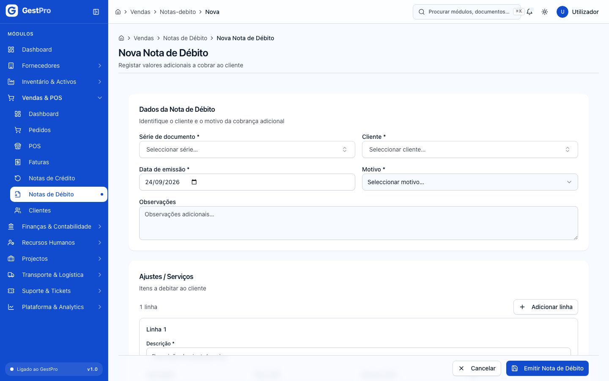

### Como registar uma devolução

**Antes de começar**
- Permissão de criar devoluções (Administrador, Gestor).

**Passos**
1. Abra `/vendas/devolucoes` e clique **Nova Devolução**.
2. Em **Informações da Devolução**, preencha **ID do Cliente \***, opcionalmente **ID da Venda (opcional)**, o
   **Motivo \*** (Defeito, Produto errado, Insatisfação, Excesso de pedido, Avaria no transporte, Outro), marque
   **Reembolso ao cliente** se for o caso, e **Observações**.
3. Em **Itens a Devolver**, preencha **Nome do Produto \***, **ID Produto**, **Qtd.** e **Valor Unit. (MT)**. Use
   **Adicionar Item** para mais linhas.
4. Clique **Registar Devolução**.

**Resultado**
- Aparece «Devolução criada com sucesso» e a devolução fica na lista com número `NDV/…` e estado **Pendente**.

> **Atenção:** este formulário pede os **identificadores internos** do cliente, da venda e do produto (não o nome
> nem o número), e ainda não há botões para aprovar, processar ou rejeitar a devolução — por isso uma devolução
> registada aqui **não** devolve stock nem gera nota de crédito. Para corrigir o valor faturado ao cliente, emita
> uma [nota de crédito](#como-emitir-uma-nota-de-crédito). O ecrã **Trocas** (`/vendas/trocas`) é só de consulta:
> o botão **Nova Troca (via Devolução)** leva à lista de devoluções.

### Como criar um vendedor e ver comissões

**Antes de começar**
- Criar vendedores e regras de comissão: Administrador, Gestor.

**Passos — vendedor**
1. Abra `/vendas/vendedores` e clique **Novo Vendedor**.
2. Preencha **Nome \***, **Email**, **Telefone**, **Meta Mensal (MT)** e **Observações**.
3. Clique **Criar Vendedor**. Aparece «Vendedor criado com sucesso» e abre o perfil do vendedor.

Os vendedores activos passam a aparecer no campo **Vendedor** da [Nova Encomenda](#como-registar-uma-encomenda-de-cliente).

**Passos — regra de comissão**
1. Abra `/vendas/comissoes/regras/nova` (ou **Nova Regra** nas comissões de um vendedor).
2. Preencha **Nome \***, **Tipo \*** (Fixa, Escalonada, Por Categoria, Por Meta, Por Período), **Descrição \***,
   **Percentual Base (%) \***, e opcionalmente **Percentual Bónus (%)**, **Prioridade**, **Ativa**,
   **ID do Vendedor**, **Data de Início** e **Data de Fim**.
3. Clique **Criar Regra**. Aparece «Regra de comissão criada com sucesso.».

**Consultar comissões:** abra `/vendas/comissoes` para ver **Total Comissões**, **Pendentes**, **Pagas** e
**Valor Total**, e a lista com **Venda**, **%**, **Valor Base**, **Comissão**, **Estado** e **Data**. Cada venda
feita no POS gera uma comissão; sem regra própria do vendedor, aplica-se 5%.

> **Atenção:** aprovar, pagar ou cancelar comissões, e editar ou excluir vendedores, ainda não têm botão nos ecrãs.

### Como criar um cliente

**Antes de começar**
- Permissão de criar clientes (Administrador, Gestor).
- Tenha à mão o **NUIT** do cliente (9 dígitos). Não pode haver dois clientes com o mesmo NUIT na empresa.

**Passos**
1. Abra **Vendas & POS › Clientes** e clique **Novo Cliente**.
2. Em **Informações Gerais**: **Tipo de Cliente** (Pessoa Física, Pessoa Jurídica, Revendedor), **Nome / Razão
   Social**, **NUIT**, **BI (opcional)**, **Email**, **Telefone**, **Categoria** (Novo, Regular, VIP), **Estado**
   (Activo, Inactivo, Suspenso) e **Observações**.
3. Em **Condições Comerciais**: **Dias de Pagamento** (por exemplo 30) e **Limite de Crédito (MT)** (0 = sem limite
   de crédito).
4. Em **Endereço Principal** (endereço de faturação): **Rua / Avenida**, **Número**, **Bairro**, **Cidade** e
   **Província**.
5. Clique **Guardar Cliente**.

**Resultado**
- Aparece «Cliente criado com sucesso!» e volta à lista.

<!-- captura: 04-vendas-e-pos/clientes.png | /clientes -->
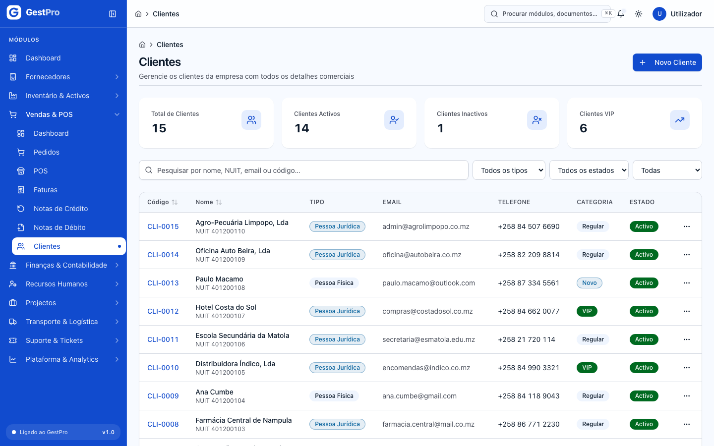

### Como consultar, editar ou desactivar um cliente

**Passos**
1. Em **Clientes**, pesquise por nome, NUIT, email ou código, ou filtre por **Tipo**, **Estado** e **Categoria**.
2. Clique no nome para abrir a ficha: separadores **Informações** (contactos, **Crédito** com **Limite** e
   **Utilizado**, observações), **Endereços** e **Contactos**.
3. Para alterar dados, clique **Editar**, faça as alterações e clique **Guardar Alterações**.
4. Para desactivar, clique **Desactivar Cliente** e depois **Confirmar Desactivação**. Aparece «Cliente desactivado
   com sucesso.».

**Resultado**
- O cliente desactivado passa a **Inactivo**. Só os clientes **Activos** aparecem para escolha em novas faturas,
  notas de débito e encomendas.
- Um cliente com crédito utilizado não pode ser desactivado.
- Para voltar a activar, abra **Editar** e mude o **Estado** para **Activo**.

<!-- captura: 04-vendas-e-pos/cliente-detalhe.png | /clientes >primeiro -->

### Como ver e exportar o histórico de um cliente

**Passos**
1. Abra `/clientes/historico`.
2. Na coluna **Clientes**, à esquerda, clique no cliente.
3. A tabela mostra **Data**, **Tipo**, **Referência**, **Descrição**, **Valor** e **Estado** das transacções.
4. Para exportar, clique **CSV** ou **XLSX** no topo.

> **Atenção:** o histórico mostra as transacções carregadas com os dados de demonstração; as vendas e faturas novas
> ainda **não** são acrescentadas a esta lista. Para ver as faturas de um cliente, use **Faturas**; para as vendas,
> pesquise o nome do cliente em `/vendas`.

<!-- captura: 04-vendas-e-pos/clientes-historico.png | /clientes/historico -->
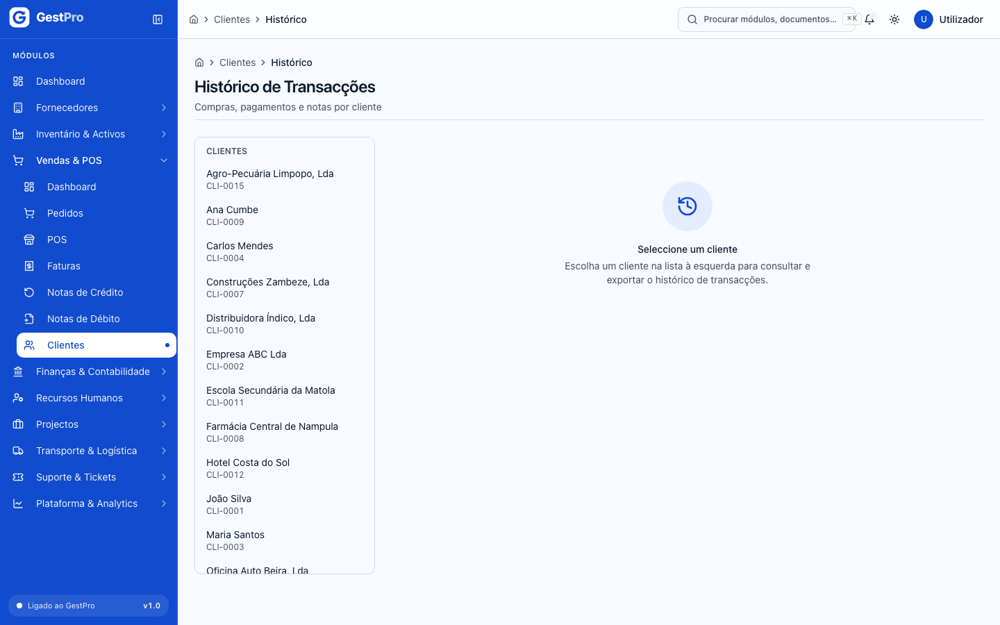

## Estados

### Venda

| Estado | Significado | Pode passar a | Quem |
|---|---|---|---|
| Rascunho | Venda ainda em preparação (vendas vindas de encomenda). | Pendente, Cancelada | — |
| Pendente | Venda registada (é o estado das vendas feitas no POS). | Confirmada (botão **Confirmar**), Faturada, Cancelada | Confirmar: Administrador, Gestor, Operador. Cancelar: Administrador, Gestor |
| Confirmada | Venda aceite. | Em Preparação, Faturada, Cancelada | Cancelar: Administrador, Gestor |
| Em Preparação | A ser preparada para entrega. | Faturada, Cancelada | Cancelar: Administrador, Gestor |
| Faturada | Venda com fatura. | Concluída, Devolvida | — |
| Concluída | Venda terminada. | — (final) | — |
| Cancelada | Venda anulada. | — (final) | — |
| Devolvida | Mercadoria devolvida. | — (final) | — |

Nos ecrãs só existem hoje os botões **Confirmar** e **Cancelar Venda**; as restantes passagens ainda não têm botão.

### Sessão POS

| Estado | Significado | Pode passar a | Quem |
|---|---|---|---|
| Aberta | O terminal está a vender. | Fechada (botão **Fechar Sessão**), Suspensa | Administrador, Gestor, Operador |
| Suspensa | Pausa (ainda sem botão). | Aberta, Fechada | — |
| Fechada | Sessão encerrada. | — (final) | — |

### Encomenda

| Estado | Significado | Pode passar a | Quem |
|---|---|---|---|
| Rascunho | Criada, ainda não confirmada. | Confirmada, Cancelada | — (sem botão) |
| Confirmada | Aceite; o stock fica reservado. | Parcialmente Entregue, Concluída, Cancelada | — (sem botão) |
| Parcialmente Entregue | Parte já foi entregue. | Concluída, Cancelada | — (sem botão) |
| Concluída | Tudo entregue. | — (final) | — |
| Cancelada | Anulada. | — (final) | — |

### Fatura

| Estado | Significado | Pode passar a | Quem |
|---|---|---|---|
| Emitida | Fatura emitida, por pagar. É o estado com que nasce. | Paga, Parcialmente Paga, Vencida, Cancelada | Ver [capítulo 6](06-faturacao-caixa-tesouraria.md) |
| Parcialmente Paga | Pagamento parcial registado. | Paga, Vencida | Ver capítulo 6 |
| Vencida | Passou a data de vencimento sem pagamento total. | Paga, Parcialmente Paga, Cancelada | Ver capítulo 6 |
| Paga | Totalmente paga. | — (final) | — |
| Cancelada | Anulada. | — (final) | — |

### Nota de crédito e nota de débito

| Estado | Significado | Pode passar a | Quem |
|---|---|---|---|
| Emitida | Documento emitido. É o estado com que nasce. | Liquidada, Cancelada | — (sem botão nestes ecrãs) |
| Liquidada | Valor acertado com o cliente. | — (final) | — |
| Cancelada | Anulada. | — (final) | — |

### Devolução

| Estado | Significado | Pode passar a | Quem |
|---|---|---|---|
| Pendente | Registada, à espera de decisão. | Aprovada, Rejeitada | — (sem botão) |
| Aprovada | Aceite. | Processada | — (sem botão) |
| Processada | Stock recebido e crédito tratado. | — (final) | — |
| Rejeitada | Recusada. | — (final) | — |

### Comissão

| Estado | Significado | Pode passar a | Quem |
|---|---|---|---|
| Pendente | Calculada automaticamente na venda. | Aprovada, Cancelada (automaticamente, se a venda for cancelada) | — |
| Aprovada | Aceite para pagamento. | Paga | — (sem botão) |
| Paga | Paga ao vendedor. | — (final) | — |
| Cancelada | Anulada. | — (final) | — |

### Cliente

| Estado | Significado | Pode passar a | Quem |
|---|---|---|---|
| Activo | Cliente em uso. | Inactivo (**Desactivar Cliente**), Suspenso (em **Editar**) | Administrador, Gestor |
| Suspenso | Cliente temporariamente suspenso. | Inactivo, Activo (em **Editar**) | Administrador, Gestor |
| Inactivo | Cliente desactivado. | Activo (em **Editar**) | Administrador, Gestor |

## Erros frequentes

| Mensagem mostrada | Porquê | O que fazer |
|---|---|---|
| Para emitir documentos fiscais é preciso confirmar o endereço de e-mail da conta — um documento fiscal é irreversível e tem efeito para terceiros. … | A conta que está a usar ainda não confirmou o e-mail. | Abra a ligação de confirmação recebida por e-mail (o aviso no painel reenvia-a). Se já confirmou, termine a sessão e entre de novo. |
| Sem permissão para esta operação | O seu perfil não tem a permissão para esta acção (por exemplo, o Financeiro a vender no POS, ou o Operador a cancelar uma venda). | Peça a um Administrador. Ver [Plataforma e Administração](11-plataforma-e-administracao.md). |
| Stock insuficiente. Disponível: …, solicitado: …. | Não há stock suficiente no armazém para a quantidade no carrinho. | Reduza a quantidade ou dê entrada de stock em [Inventário](03-inventario.md). |
| Nenhum armazém activo encontrado. Crie pelo menos um armazém no módulo de stock. | A empresa não tem nenhum armazém activo. | Crie um armazém em [Inventário](03-inventario.md). |
| Sessão de caixa … não está aberta | A sessão de caixa ligada ao POS foi fechada. | Abra o caixa outra vez e volte ao POS. |
| Existem N vendas pendentes. Feche-as antes de encerrar a sessão. | Há vendas Pendentes nesta sessão POS. | Confirme-as em `/vendas` e volte a fechar a sessão. |
| Série activa para tipo "…" no ano … não encontrada. Crie a série … primeiro. | Não existe numeração para esse tipo de documento no ano da data escolhida. | Veja as séries no capítulo [Faturação, Caixa e Tesouraria](06-faturacao-caixa-tesouraria.md); confirme também a data de emissão. |
| Data de vencimento não pode ser anterior à data de emissão | Datas trocadas na fatura. | Corrija a **Data de vencimento**. |
| Transição inválida de Venda: RASCUNHO → CONFIRMADA. Permitidas: PENDENTE, CANCELADA | Clicou **Submeter** numa venda em Rascunho. | Hoje uma venda em Rascunho só pode ser cancelada pelos ecrãs. |
| Há campos por corrigir acima — a encomenda não foi criada. | Falta o cliente, um produto ou uma quantidade válida. | Corrija os campos marcados a vermelho. |
| NUIT deve ter exactamente 9 dígitos / NUIT inválido — deve ter 9 dígitos não repetidos | O NUIT do cliente está incompleto ou não é válido. | Confirme o NUIT com o cliente. |
| Cliente tem crédito utilizado de … MT | Tentou desactivar um cliente que ainda deve dinheiro. | Regularize o crédito antes de desactivar. |

## Perguntas frequentes

**Enganei-me numa fatura. Posso corrigi-la?** Não directamente — uma fatura emitida não se altera. Emita uma
[nota de crédito](#como-emitir-uma-nota-de-crédito) para anular o que estava a mais e, se for o caso, uma nova fatura
correcta ou uma [nota de débito](#como-emitir-uma-nota-de-débito) para o que ficou por cobrar.

**A venda no POS emite fatura?** Não. A venda POS regista a venda, baixa o stock e entra no caixa. Se o cliente
pedir fatura, emita-a em **Faturas**.

**O cliente pagou por M-Pesa. Entra no caixa?** Sim: hoje todas as vendas do POS, qualquer que seja o método,
entram na sessão de caixa pelo total. O método fica registado no separador **Pagamentos** da venda.

**Posso vender no POS sem ter confirmado o e-mail?** Sim. Só a emissão de faturas, notas de crédito e notas de débito
exige o e-mail confirmado.

**Onde estão as cotações e as proformas?** No capítulo [Faturação, Caixa e Tesouraria](06-faturacao-caixa-tesouraria.md).
