# 4. Vendas & POS

> **Para quem:** Administrador, Gestor, Operador (balcão/POS), Financeiro (emissão de documentos fiscais), Leitura (consulta) · **Onde:** menu › Vendas & POS

## Objectivo do módulo

O grupo **Vendas & POS** reúne tudo o que acontece do lado do cliente: vender ao balcão no **POS**, registar
e acompanhar **encomendas** de clientes, emitir **faturas**, corrigir faturas com **notas de crédito** e **notas de
débito**, tratar **devoluções** e **trocas**, gerir **vendedores** e **comissões**, e manter a ficha de **clientes**.
Cada venda feita no POS emite o seu documento fiscal (uma **Factura-Recibo**, ou uma **Factura** se tiver uma parte a
crédito), baixa o stock, entra na contabilidade e, na parte paga em dinheiro, na sessão de caixa aberta.

O objectivo é **vender depressa sem perder controlo**: o balcão só escolhe produtos e meios de pagamento; o
sistema garante o documento fiscal correcto, o stock, a caixa e a contabilidade, de uma só vez e sem números
saltados.

| | |
|---|---|
| **Que problema resolve** | Vendas sem factura, stock que não bate com as vendas, dinheiro da gaveta sem explicação, facturas corrigidas «à mão». |
| **Quem usa** | Operador (balcão e POS); Gestor (clientes, encomendas, anulações, devoluções, comissões); Financeiro (facturas, notas de crédito e de débito). |
| **O que entra** | Clientes (com NUIT), produtos do inventário, a venda e um ou mais meios de pagamento. |
| **O que sai** | Factura-Recibo ou Factura numerada, saída de stock (ou reserva, nas encomendas), movimento na caixa (só dinheiro), lançamento contabilístico, nota de crédito nas anulações, comissão do vendedor. |
| **Liga-se a** | [Inventário](03-inventario.md), [Caixa](06-faturacao-caixa-tesouraria.md#caixa), [Contabilidade](05-contabilidade.md), [Recursos Humanos](07-recursos-humanos.md) (comissões no salário). |

A emissão de documentos fiscais pelo lado financeiro (séries de numeração, painel de faturação, proformas e cotações,
pagamentos de faturas) está no capítulo [Faturação, Caixa e Tesouraria](06-faturacao-caixa-tesouraria.md). Este
capítulo trata a emissão a partir das vendas.

> **Regra de ouro — um documento emitido não se altera.** Uma fatura, nota de crédito ou nota de débito, depois de
> emitida, fica tal como está: não há botão para a editar nem para a apagar. Se houver um erro, corrige-se com outro
> documento:
> - o cliente pagou **a mais** ou devolveu mercadoria → emita uma **nota de crédito** sobre a fatura;
> - ficou **por cobrar** algum valor (preço abaixo do acordado, serviço extra, portes) → emita uma **nota de débito**.
>
> Assim fica sempre registado o que foi faturado e porque é que mudou.

> **Atenção — confirme o seu e-mail antes de emitir documentos fiscais.** Se a sua empresa foi registada pelo site e
> ainda não abriu a ligação de confirmação que recebeu por e-mail, pode usar o sistema normalmente (configurar,
> importar dados, exportar), mas **não pode emitir faturas, notas de crédito nem notas de débito** — nem vender no
> POS, porque cada venda POS emite um documento fiscal.
> Um documento fiscal é irreversível e tem efeito para terceiros, por isso o sistema exige que se saiba quem o emite.
> Abra a ligação de confirmação; se já confirmou há pouco e o sistema ainda recusa, termine a sessão e entre outra
> vez.

## Exemplo prático — balcão, cliente a crédito e uma correcção de preço

**Situação:** a Ana (Operador) está ao balcão com o caixa aberto (fundo de 5 000,00 MT). A Construções
Machava, cliente empresarial com 30 dias de prazo, compra a crédito. Mais tarde descobre-se que uma factura
saiu com o preço errado.

**1. Cliente empresarial** → [Como criar um cliente](#como-criar-um-cliente): Pessoa Jurídica, «Construções
Machava, Lda», NUIT `400300400`, **Dias de Pagamento** 30, **Limite de Crédito** 500 000.

**2. Três vendas no POS** → [Como vender no POS](#como-vender-no-pos)

| # | Cliente | Carrinho | Subtotal | IVA 16 % | Total | Pagamento | Documento |
|---|---|---|---:|---:|---:|---|---|
| 1 | Consumidor Final | 10 × CIM-50 + 1 × TIN-20 | 10 100,00 | 1 616,00 | **11 716,00** | Dinheiro: recebe 12 000,00, **troco 284,00** | Factura-Recibo `FR/…` (Paga) |
| 2 | Consumidor Final | 20 × VAR-12 | 9 600,00 | 1 536,00 | **11 136,00** | M-Pesa | Factura-Recibo `FR/…` (Paga) |
| 3 | Construções Machava | 50 × CIM-50 | 32 500,00 | 5 200,00 | **37 700,00** | Crédito | Factura `FAT/…` (Emitida, vence a 30 dias) |

No terminal: clique nos cartões (ou **F2** para pesquisar), **F10** para finalizar. O painel de pagamento
abre com uma linha pelo total, no meio da venda anterior (ou **Dinheiro**). Na venda 1, escreva **12 000,00** na
linha de dinheiro e o painel mostra «Troco: MT 284,00»; na venda 2, clique **M-Pesa**; na venda 3, clique
**Crédito** e escolha o cliente. Depois **Pagar MT …** / **Facturar a crédito MT …**. A crédito, o cliente é
obrigatório — nunca o Consumidor Final.

*E se o cliente da venda 2 pagasse 10 000,00 por M-Pesa e o resto em dinheiro?* No painel, mude a primeira linha
para **M-Pesa** e escreva 10 000,00; clique **Adicionar pagamento** — a nova linha vem em **Dinheiro** já com os
1 136,00 em falta. A venda continua a ser uma só Factura-Recibo de 11 136,00, mas só os 1 136,00 entram na gaveta e o
lançamento debita a conta da carteira M-Pesa por 10 000,00 e **111 Caixa** por 1 136,00.

**3. O que o sistema fez sozinho**

| | Venda 1 | Venda 2 | Venda 3 |
|---|---|---|---|
| Stock | −10 CIM-50, −1 TIN-20 | −20 VAR-12 | −50 CIM-50 |
| Caixa da Ana | **+11 716,00** | — (não é dinheiro) | — (crédito) |
| Débito | 111 Caixa | conta da carteira M-Pesa | 411 Clientes c/c |
| Crédito | 711 Vendas 10 100,00 · 44331 IVA 1 616,00 | 711 9 600,00 · 44331 1 536,00 | 711 32 500,00 · 44331 5 200,00 |

**4. Corrigir sem apagar**

- *Engano ao balcão:* se o cliente da venda 1 desistisse da compra logo a seguir, abria-se a venda e usava-se
  **Anular venda**: nota de crédito total de 11 716,00, o dinheiro sai da gaveta da Ana, os 10 sacos e a lata
  voltam ao armazém → [Como anular uma venda POS](#como-anular-uma-venda-pos). A anulação desfaz sempre a venda
  **inteira**; também serve para a venda 3, a crédito — aí a nota de crédito abate os 37 700,00 à factura e não sai
  dinheiro nenhum.
- *Preço errado numa factura:* uma factura de 200 varões saiu a 450,00 em vez dos 480,00 acordados. Não se
  edita: emite-se uma **nota de débito** de **Acerto de preço** com a linha «Acerto de preço — varão 12 mm» ·
  200 · 30,00 · IVA 16 % → **6 000,00 + 960,00 = 6 960,00**, com a factura como **Factura de referência** →
  [Como emitir uma nota de débito](#como-emitir-uma-nota-de-débito). Lançamento: débito 411 6 960,00 /
  crédito 711 6 000,00 e 44331 960,00.
- *Mercadoria danificada:* 5 sacos da venda 3 chegaram rasgados → **nota de crédito** sobre a factura da venda 3
  de 5 × 650,00 + IVA = **3 770,00**, motivo **Produto com defeito** → [Como emitir uma nota de crédito](#como-emitir-uma-nota-de-crédito).
  Na lista **Factura a creditar**, a factura aparece com o saldo que ainda se pode creditar (37 700,00).

**5. Encomenda para entrega futura** → [Como registar uma encomenda](#como-registar-uma-encomenda-de-cliente):
a Construções Machava pede 100 sacos para daqui a uma semana. A Marta cria a encomenda `ENC/…` em
**Rascunho**; no dia seguinte o cliente passa para 120 sacos e ela corrige com **Editar**. Com a encomenda
fechada, clica **Confirmar** e escolhe a localização do armazém: os 120 sacos ficam **reservados** e a encomenda
passa a **Confirmada** → [Como confirmar, converter ou cancelar uma encomenda](#como-confirmar-converter-ou-cancelar-uma-encomenda).

**Resultado esperado:** em **Faturas** aparecem as duas Factura-Recibo e a Factura de 37 700,00; em `/vendas`
as vendas 1 e 2 estão **Concluídas** e a 3 **Faturada**; a Ana tem uma comissão **Pendente** por venda; a
encomenda está **Confirmada**, com o stock reservado. A cobrança da factura de 37 700,00 regista-se em [Faturação](06-faturacao-caixa-tesouraria.md#como-registar-o-pagamento-de-uma-fatura).

## Conceitos

| Termo | O que é |
|---|---|
| Venda | Registo de uma venda a um cliente, com itens, pagamentos e histórico de estados. Tem número próprio (por exemplo `VND/2026/000123`). A **Origem** diz de onde veio: POS, Encomenda, E-Commerce ou Manual. |
| POS | O terminal de venda ao balcão. Só funciona com uma **sessão de caixa** aberta em seu nome. |
| Factura-Recibo | Documento fiscal da venda paga no acto (série `FR/…`): é factura e recibo ao mesmo tempo e nasce já **Paga**. É o que o POS emite numa venda paga. |
| Consumidor Final | Cliente técnico que cada empresa tem (código `CF-000000`, NUIT `999999999`). Uma venda POS sem cliente escolhido sai em nome dele. Não se edita nem se desactiva. |
| Sessão POS | O período de trabalho de um vendedor no terminal, ligado à sua sessão de caixa. Abre-se sozinha quando entra no POS com o caixa aberto e fecha-se sozinha quando o caixa é fechado ou cancelado. |
| Encomenda (Pedido) | Pedido de um cliente para entrega futura, com data prevista. Tem numeração própria (`ENC/…`). |
| Fatura | Documento fiscal que diz ao cliente quanto deve e até quando. É emitida já no estado **Emitida** e não se altera. |
| Série de documento | A numeração sequencial de cada tipo de documento, por ano (por exemplo `FAT/2026`). As séries do ano são criadas automaticamente para a empresa; ver o capítulo [Faturação, Caixa e Tesouraria](06-faturacao-caixa-tesouraria.md). |
| Nota de crédito | Documento que **reduz** o valor de uma fatura já emitida (devolução, defeito, erro de valor, desconto posterior). Refere sempre uma fatura original. |
| Nota de débito | Documento que **aumenta** o que o cliente deve (serviços não faturados, correcção de preço, custos logísticos). Refere o cliente. |
| Natureza da nota de débito | O *porquê* do débito, que decide onde o valor entra na contabilidade: acerto de preço (é venda), juros de mora, despesas repercutidas, penalização ou outro. Ver [Como emitir uma nota de débito](#como-emitir-uma-nota-de-débito). |
| Anulação de venda POS | Desfaz uma venda POS inteira emitindo uma nota de crédito total: a parte paga é devolvida pelos meios com que foi paga, a parte a crédito é abatida à factura, e o stock volta ao armazém. |
| Devolução | Registo de mercadoria devolvida pelo cliente, com motivo e opção de reembolso. Tem numeração própria (`NDV/…`) e passa por aprovação antes de ser processada. |
| Troca | Devolução aprovada seguida de venda de substituição: o crédito da devolução paga o artigo novo e só a diferença muda de mãos. Tem numeração própria (`TRC/…`). |
| Vendedor | Pessoa que vende, com meta mensal. |
| Comissão | Valor a pagar ao vendedor por uma venda, calculado pelas **regras de comissão**. Passa de Pendente a Aprovada e a Paga. |
| NUIT | Número Único de Identificação Tributária do cliente — 9 dígitos, obrigatório na ficha do cliente. |

## Ecrãs

| Menu | Endereço | Para que serve |
|---|---|---|
| Vendas & POS › Dashboard | `/vendas/dashboard` | Indicadores (Volume Total, Total Vendas, Concluídas, Em Curso) e as 10 vendas mais recentes. |
| — (botão **Ver todas** no Dashboard) | `/vendas` | Lista de todas as vendas, com filtros por Estado e Origem. |
| — (clique numa venda) | `/vendas/<venda>` | Detalhe da venda: separadores **Itens**, **Pagamentos** e **Histórico**; botões **Submeter**, **Confirmar**, **Cancelar Venda**, **Talão** e **Anular venda**, conforme o estado e a origem. |
| — (botão **Anular venda**) | `/vendas/<venda>/anular` | Anulação de uma venda POS, com o motivo. |
| Vendas & POS › Pedidos | `/vendas/pedidos` | Lista de **Encomendas de Venda** e botão **Nova Encomenda**. |
| — (clique numa encomenda) | `/vendas/pedidos/<encomenda>` | Detalhe da encomenda: botões **Editar**, **Confirmar**, **Converter em Venda** e **Cancelar Encomenda**, conforme o estado. |
| — (botão **Confirmar**) | `/vendas/pedidos/<encomenda>/confirmar` | Escolha da localização onde o stock da encomenda fica reservado. |
| Vendas & POS › POS | `/pos` | Terminal de venda ao balcão. |
| Vendas & POS › Faturas | `/vendas/faturas` | Lista de faturas e botão **Nova Fatura**. |
| Vendas & POS › Notas de Crédito | `/vendas/notas-credito` | Lista de notas de crédito e botão **Nova Nota de Crédito**. |
| Vendas & POS › Notas de Débito | `/vendas/notas-debito` | Lista de notas de débito e botão **Nova Nota de Débito**. |
| Vendas & POS › Clientes | `/clientes` | Lista de clientes, botão **Novo Cliente**, ficha de cada cliente. |
| — (sem entrada no menu) | `/clientes/historico` | **Histórico de Transacções** por cliente, com exportação CSV/XLSX. |
| — (sem entrada no menu) | `/clientes/dashboard`, `/clientes/relatorios` | **Dashboard de Clientes** e **Relatórios de Clientes** (com exportação CSV/XLSX da carteira). |
| — (sem entrada no menu) | `/vendas/devolucoes` | **Devoluções**: lista e botão **Nova Devolução**. |
| — (clique numa devolução) | `/vendas/devolucoes/<devolução>` | Detalhe da devolução: botões **Aprovar** e **Rejeitar** (Pendente), **Processar** e **Criar Troca** (Aprovada). |
| — (botão **Processar**) | `/vendas/devolucoes/<devolução>/processar` | Escolha da localização onde o stock devolvido dá entrada. |
| — (sem entrada no menu) | `/vendas/trocas` | **Trocas**: lista e botão **Nova Troca**. |
| — (botão **Nova Troca** ou **Criar Troca**) | `/vendas/trocas/nova` | Criar uma troca a partir de uma devolução aprovada. |
| — (sem entrada no menu) | `/vendas/vendedores` | **Vendedores**: lista e botão **Novo Vendedor**; perfil de cada vendedor com **Editar** e **Desactivar**. |
| — (sem entrada no menu) | `/vendas/comissoes` | **Comissões**: lista e indicadores; regras em `/vendas/comissoes/regras/nova`. |
| — (clique no valor de uma comissão) | `/vendas/comissoes/<comissão>` | Detalhe da comissão: botões **Aprovar**, **Marcar como paga** e **Cancelar comissão**. |

> Os ecrãs sem entrada no menu abrem-se escrevendo o endereço na barra do navegador, depois do endereço do GestPro.
>
> O menu só mostra as entradas que o seu perfil pode consultar: sem a permissão de ver vendas, os ecrãs `/vendas/…`
> não aparecem; sem a de operar o POS, não aparece o **POS**; sem a de ver clientes, não aparece **Clientes**. Se
> abrir o endereço de um desses ecrãs, aparece **Sem permissão** em vez da página.

<!-- captura: 04-vendas-e-pos/dashboard.png | /vendas/dashboard -->
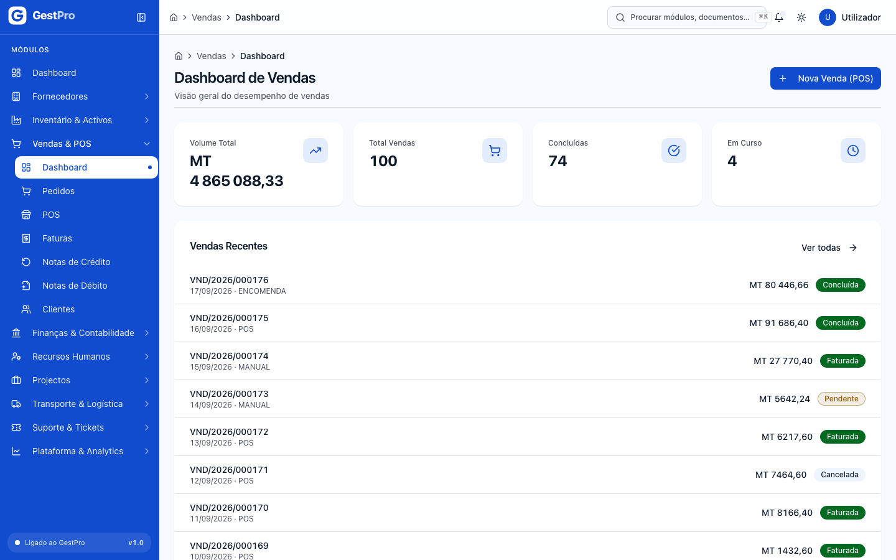

## Tarefas

### Como vender no POS

**Antes de começar**
- Precisa da permissão de operar o POS (perfis Administrador, Gestor ou Operador).
- Tem de ter uma **sessão de caixa aberta em seu nome** — quem vende é quem presta contas do dinheiro no fecho. Se
  não tiver, ao abrir o POS é levado para a abertura de caixa e volta ao POS assim que registar o fundo (ver
  [Faturação, Caixa e Tesouraria](06-faturacao-caixa-tesouraria.md)).
- A empresa tem de ter pelo menos um **armazém activo** e stock dos produtos (ver [Inventário](03-inventario.md)).
- Tem de ter o **e-mail confirmado** e o **período contabilístico de hoje aberto**: cada venda emite um documento
  fiscal e lança na contabilidade. O POS verifica as duas coisas (e o caixa) ao abrir a sessão, e recusa logo à
  entrada em vez de falhar com o cliente ao balcão — o ecrã diz o que falta e leva-o ao sítio onde se resolve.

**Passos**
1. No menu, abra **Vendas & POS › POS**. Se o caixa estiver aberto, aparece por instantes «A iniciar o POS…» e o
   terminal abre. No topo do painel direito vê **Sessão POS** e o seu código.
2. Procure o produto na caixa **Pesquisar produto (/ ou F2)…** — por nome, SKU ou código de barras — ou clique
   directamente no cartão do produto. Sem pesquisa, a grelha mostra os primeiros produtos activos por ordem
   alfabética; a pesquisa procura em **todo** o catálogo de produtos activos. Cada clique acrescenta uma unidade ao
   carrinho.
3. No carrinho, use **+** e **−** para mudar a quantidade e o caixote do lixo para retirar a linha. O painel mostra
   **Subtotal**, **IVA** e **Total**.
4. Clique **Finalizar (F10)**. O painel de pagamento abre com **uma linha de pagamento pelo total**, no meio usado
   na venda anterior (ou **Dinheiro**; depois de uma venda a crédito, volta sempre a **Dinheiro**).
5. Em **Método de pagamento**, escolha o meio da linha: **Dinheiro**, **Cartão**, **M-Pesa**, **e-Mola**,
   **Transferência** ou **Crédito**. Os botões mudam sempre a **última** linha.
6. Em **Pagamentos (valor recebido, MT)**, escreva quanto recebeu nessa linha (aceita vírgula decimal, até 2 casas).
   - Para dividir o pagamento por vários meios, clique **Adicionar pagamento**: aparece uma nova linha em
     **Dinheiro** já com o valor em falta; mude-lhe o meio e o valor se for preciso. O caixote do lixo retira uma
     linha.
   - Por baixo das linhas, o painel diz o que falta: «Em falta: MT …» enquanto a soma não chega ao total, ou
     «Troco: MT …» quando o dinheiro recebido passa do total.
   - **Só o dinheiro dá troco.** Se a soma passar do total e o excesso não puder sair das linhas em dinheiro,
     aparece «O excesso só pode ser troco em dinheiro.» — corrija o valor do cartão, M-Pesa, e-Mola ou
     transferência para o valor exacto.
7. Se alguma linha for **Crédito**, escolha o **Cliente \*** (pesquise por código, nome ou NUIT). Uma venda com
   parte a crédito exige um cliente identificado e activo — não pode ser o Consumidor Final —, porque é emitida uma
   factura em nome dele.
8. Clique **Pagar MT …** ou, com parte a crédito, **Facturar a crédito MT …** (o botão mostra o total). O botão só
   fica disponível quando os pagamentos cobrem o total.

**Atalhos de teclado:** `/` ou `F2` — pesquisar; `F10` — finalizar; `Esc` — voltar ao carrinho ou, no carrinho,
limpá-lo; `+`/`-` — aumentar ou diminuir a última linha.

**Resultado**
- Aparece «Venda VND/… registada com sucesso!», com o botão **Imprimir talão**, e o carrinho fica vazio para o
  cliente seguinte.
- Numa venda com parte a crédito, se o cliente passar a dever mais do que o seu **Limite de Crédito**, aparece
  também um aviso «O cliente … passa a ter … MT de crédito utilizado, acima do limite de crédito de … MT.». O aviso
  **não impede** a venda: decida com o seu gestor.
- A venda fica na lista de vendas (`/vendas`) com Origem **POS** e estado **Concluída** (paga) ou **Faturada** (com
  parte a crédito). O separador **Pagamentos** mostra cada meio, o valor e o troco.
- **Documento fiscal**, emitido no mesmo momento e ligado à venda:
  - venda paga (por um ou vários meios) → **Factura-Recibo** (`FR/…`), já **Paga**; sem cliente escolhido, em nome
    do Consumidor Final;
  - venda com parte a crédito → **Factura** (`FAT/…`), com vencimento pelo prazo de pagamento do cliente:
    **Emitida** se for toda a crédito, **Parcialmente Paga** se outra parte foi paga no acto. O que fica por pagar
    cobra-se como qualquer outra factura (ver [capítulo 6](06-faturacao-caixa-tesouraria.md)).
  O documento aparece em **Faturas**. Produtos com IVA a 0 % saem no documento com o motivo de isenção legal da
  empresa, preenchido pelo sistema. Se alguma coisa falhar (stock, período, série, conta), nada fica registado —
  nem venda, nem documento, nem número.

**Efeitos noutros módulos**
- **Stock:** cada produto vendido sai do armazém activo principal da empresa (o mais antigo). Se não houver stock
  suficiente, a venda é recusada e nada fica registado.
- **Caixa:** só a parte paga em **dinheiro** (já sem o troco) entra na sua sessão de caixa, como movimento de venda
  com a descrição «Venda VND/…». Cartão, M-Pesa, e-Mola e transferência não passam pela gaveta.
- **Contabilidade:** o documento lança, no mesmo momento, a débito a conta de cada meio de pagamento (uma linha por
  meio, pelo valor desse meio) e a crédito **711 Vendas** e **44331 IVA liquidado**. Dinheiro debita **111 Caixa**;
  crédito debita **411 Clientes c/c**;
  cartão, transferência, M-Pesa e e-Mola debitam a conta configurada em
  **Contabilidade › Configurações › Meios de pagamento do POS** (sem configuração, **121 Depósitos à ordem**). Ver
  [Contabilidade](05-contabilidade.md).
- **Comissões:** é calculada automaticamente uma comissão para quem vendeu, no estado **Pendente**.

> **Atenção — limitações actuais do POS:**
> - O **talão** (botão **Imprimir talão**, ou **Talão** no detalhe da venda) **não é documento fiscal**; o documento
>   fiscal é a Factura-Recibo ou a Factura, em **Faturas**.
> - A venda **não lança o custo das vendas** (a saída de stock não debita 61 nem credita 32): a margem não aparece
>   na contabilidade.
> - As vendas POS feitas **antes** da emissão automática de documentos não têm documento fiscal nem lançamento.

<!-- captura: 04-vendas-e-pos/pos.png | /pos -->
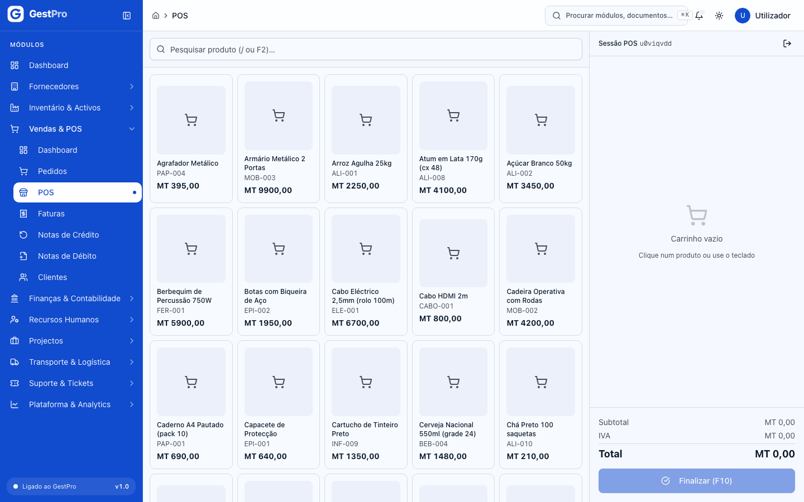

### Como fechar a sessão POS

**Antes de começar**
- O sistema **recusa fechar a sessão enquanto houver vendas Pendentes** feitas nela. As vendas do POS nascem
  **Concluídas** ou **Faturadas**, por isso isto só acontece com vendas antigas; nesse caso abra `/vendas`, filtre
  **Origem: POS** e **Estado: Pendente**, e use **Confirmar** em cada uma.

**Passos**
1. No terminal, clique no ícone de saída ao lado de **Sessão POS** (dica: «Fechar sessão POS»).
2. Na janela **Fechar sessão POS?**, clique **Fechar Sessão**.

**Resultado**
- Aparece «Sessão POS encerrada.».
- Enquanto a sua sessão de caixa continuar aberta, ao voltar ao POS é aberta automaticamente uma nova sessão POS. Para
  terminar o dia, feche também o caixa (ver [Faturação, Caixa e Tesouraria](06-faturacao-caixa-tesouraria.md)).

**Fechar só o caixa também serve.** Ao fechar (ou cancelar) a sessão de caixa, o sistema fecha sozinho as sessões
POS que estavam abertas nela — não precisa de as fechar antes. Se alguma delas tiver vendas **Pendentes**, o fecho do
caixa é recusado com «Existem N vendas pendentes nas sessões POS deste caixa. Conclua-as ou anule-as antes de
encerrar o caixa.».

> A janela diz «Vendas pendentes nesta sessão não serão afectadas», mas se houver vendas Pendentes o fecho é
> recusado com a mensagem «Existem N vendas pendentes. Feche-as antes de encerrar a sessão.» — siga o passo
> *Antes de começar*.

### Como consultar as vendas

**Passos**
1. Abra **Vendas & POS › Dashboard** e clique **Ver todas** (ou escreva `/vendas`).
2. Use **Pesquisar por número ou nome do cliente…** e os filtros **Estado** e **Origem**.
3. Clique no número da venda para abrir o detalhe: separadores **Itens**, **Pagamentos** (método, valor, troco) e
   **Histórico** (cada mudança de estado com data e motivo).
4. Numa venda com documento fiscal (todas as do POS), o campo **Documento fiscal** mostra o número da
   Factura-Recibo ou da Factura e abre-o em Facturação, onde o botão **Descarregar PDF** (no topo) descarrega o
   PDF fiscal. O talão também indica o documento.

### Como confirmar ou cancelar uma venda

**Antes de começar**
- **Submeter** e **Confirmar** exigem permissão de editar vendas (Administrador, Gestor, Operador).
- **Cancelar** exige permissão de cancelar vendas (Administrador, Gestor).

**Passos — submeter ou confirmar**
1. Abra a venda (ou use o menu de acções da linha na lista).
2. Numa venda em **Rascunho**, clique **Submeter**: passa a **Pendente** e aparece «Venda submetida com sucesso.».
3. Numa venda **Pendente**, clique **Confirmar**: passa a **Confirmada** e aparece «Venda confirmada com sucesso.».

**Passos — cancelar**
1. Abra a venda e clique **Cancelar Venda** (disponível enquanto não estiver Concluída, Cancelada ou Devolvida).
2. Na janela **Cancelar venda?**, escreva um **Motivo (opcional)** e clique **Confirmar Cancelamento**.

**Resultado**
- A venda passa a **Cancelada** e o Histórico regista a mudança. As comissões **Pendentes** dessa venda são
  canceladas. Se a venda veio de uma encomenda, o stock reservado é libertado.

> **Atenção:** uma venda **com documento fiscal** (todas as do POS) não tem o botão **Cancelar Venda** e o sistema
> recusa cancelá-la ou dá-la como devolvida: um documento emitido só se desfaz por nota de crédito. Para uma venda
> POS, paga ou a crédito, use [Como anular uma venda POS](#como-anular-uma-venda-pos). O cancelamento não pode ser
> revertido.

### Como anular uma venda POS

Anular desfaz uma venda POS **inteira** sem tocar no documento original: é emitida uma **nota de crédito** total sobre
a Factura-Recibo ou a Factura, a parte paga é devolvida ao cliente pelos meios com que pagou, a parte a crédito é
abatida à factura, e o stock volta ao armazém — tudo de uma vez. Serve tanto para vendas pagas (**Concluídas**)
como para vendas a crédito ou com parte a crédito (**Faturadas**), no próprio dia ou em dias seguintes.

**Antes de começar**
- Permissão de cancelar vendas (Administrador, Gestor). Se a venda teve uma parte em dinheiro, também a de operar o
  caixa; se teve cartão, M-Pesa, e-Mola ou transferência, também a de movimentar contas bancárias. A parte a crédito
  não pede permissão extra.
- Se houver dinheiro a devolver, **quem anula tem de ter uma sessão de caixa aberta em seu nome**: o dinheiro sai
  dessa gaveta — não da sessão onde a venda foi feita (que, no dia seguinte, já está fechada) nem da de outro
  colega.
- O documento da venda não pode ter já outra nota de crédito (a anulação total creditá-lo-ia duas vezes). Numa
  venda com parte a crédito, a factura também não pode ter recebido pagamentos em **Faturação** depois da venda.
- O período contabilístico de hoje tem de estar aberto.

**Passos**
1. Abra a venda em `/vendas` e clique **Anular venda** (só aparece numa venda POS **Concluída** ou **Faturada** com
   documento).
2. Leia o resumo no topo: o **Total**, quanto é abatido à factura (se houver crédito), e quanto sai em dinheiro da
   gaveta da sua sessão de caixa aberta.
3. Escreva o **Motivo** — fica na nota de crédito e no histórico da venda.
4. Clique **Anular venda**.

**Resultado**
- Aparece «Venda VND/… anulada — nota de crédito emitida.» e a venda passa a **Cancelada**. As comissões
  **Pendentes** dessa venda são canceladas.
- É emitida uma **nota de crédito** de todas as linhas e liquidada logo; aparece em **Notas de Crédito**.
- **Contabilidade:** a nota de crédito estorna a venda (débito de 711 e 44331, crédito de 411) e a devolução
  credita os meios de pagamento originais. A parte a crédito não sai por meio nenhum: fica compensada na factura,
  que deixa de ter valor em aberto. A Factura-Recibo ou a Factura e o seu lançamento ficam como estavam.
- **Caixa:** a parte em dinheiro sai da sua sessão de caixa aberta, como devolução com a descrição «Anulação da
  venda VND/… (NC …)». **Stock:** cada produto volta à localização de onde saiu.
- Se alguma coisa falhar (sem caixa aberto, período fechado…), nada fica registado — nem a nota de crédito.

> **Não se anulam aqui:** a venda de substituição de uma troca (corrige-se em Facturação, por nota de crédito), as
> vendas que não vieram do POS, e as vendas POS antigas sem documento fiscal. O ecrã **Anular** explica o motivo em
> cada caso.

### Como registar uma encomenda de cliente

**Antes de começar**
- Precisa da permissão de criar encomendas (Administrador, Gestor).
- O cliente tem de existir (ver [Como criar um cliente](#como-criar-um-cliente)).

**Passos**
1. Abra **Vendas & POS › Pedidos** e clique **Nova Encomenda**.
2. Em **Informações da Encomenda**, escolha o **Cliente \*** (pesquise por código, nome ou NUIT), opcionalmente o
   **Vendedor**, a **Data Prevista de Entrega** e **Notas**.
3. Em **Itens da Encomenda**, para cada linha escolha o **Produto \*** (o sistema mostra o preço de catálogo e
   propõe-o), e preencha **Qtd.**, **Preço Unit. (MT)** e **Desconto (%)**. Use **Adicionar Item** para mais linhas.
4. Clique **Criar Encomenda**.

**Resultado**
- Aparece «Encomenda criada com sucesso» e a encomenda fica na lista com número `ENC/…` e estado **Rascunho**.
- No detalhe vê **Estado**, **Total**, **Data Prevista** e os **Itens da Encomenda** (com a coluna **Entregue**).

**Corrigir uma encomenda em Rascunho:** no detalhe, clique **Editar** (só aparece em Rascunho). O formulário
**Editar Encomenda** vem preenchido: pode mudar o **Cliente**, o **Vendedor**, a **Data Prevista de Entrega**, as
**Notas** e as linhas (**Adicionar Item**). Clique **Guardar Alterações** — aparece «Encomenda actualizada». O número
não muda. Gravar exige a permissão de editar encomendas (Administrador, Gestor).

Para reservar o stock e avançar a encomenda, veja a tarefa seguinte.

<!-- captura: 04-vendas-e-pos/pedidos.png | /vendas/pedidos -->
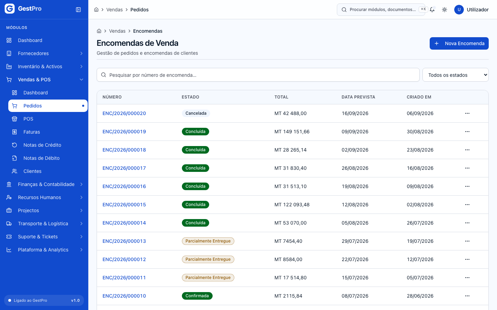

<!-- captura: 04-vendas-e-pos/encomenda-nova.png | /vendas/pedidos/novo -->
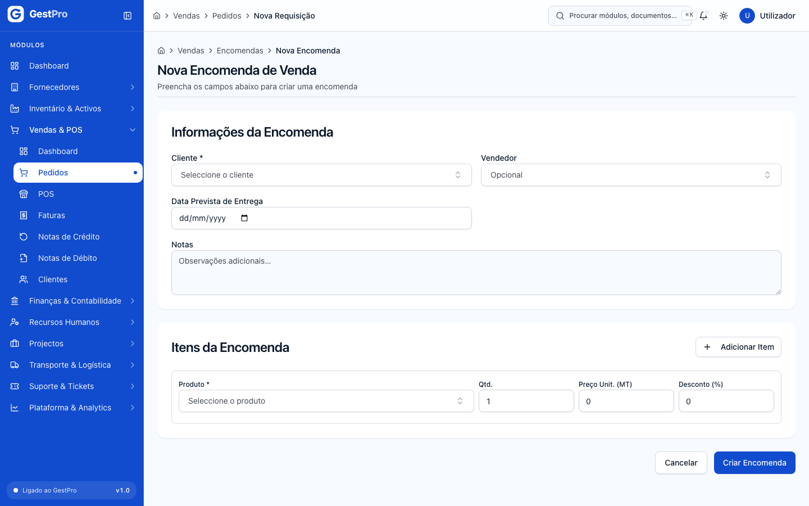

### Como confirmar, converter ou cancelar uma encomenda

**Antes de começar**
- Precisa da permissão de confirmar, de converter ou de cancelar encomendas, conforme a acção (o Administrador e o
  Gestor têm as três; sem ela, o sistema responde «Sem permissão para esta operação»).
- Para confirmar, os produtos têm de ter stock disponível na localização que vai escolher (ver
  [Inventário](03-inventario.md)).
- Para converter, o cliente da encomenda tem de estar **Activo** e não pode ser o Consumidor Final: a venda criada
  é a crédito.

**Passos — confirmar (reservar o stock)**
1. Abra a encomenda em **Vendas & POS › Pedidos**. Numa encomenda em **Rascunho**, clique **Confirmar**.
2. Em **Reserva de stock**, escolha a **Localização \*** (pesquise pelo nome ou código). Cada linha da encomenda
   fica reservada nessa localização até ser convertida em venda ou cancelada.
3. Clique **Confirmar Encomenda**. Aparece «Encomenda confirmada; stock reservado.» e a encomenda passa a
   **Confirmada**. Depois de confirmada já não se edita.

**Passos — converter em venda**
1. Numa encomenda **Confirmada** (ou **Parcialmente Entregue**), clique **Converter em Venda**.
2. Na janela **Converter a encomenda … em venda?**, clique **Converter**.
3. Aparece «Encomenda … convertida em venda.»: é criada uma venda a crédito pelo total da encomenda, com Origem
   **Encomenda** e estado **Faturada**; o stock reservado é consumido, a venda é lançada na contabilidade (débito
   **411 Clientes c/c**, crédito **711 Vendas** e **44331 IVA liquidado**) e a encomenda passa a **Concluída**.

**Passos — cancelar**
1. Numa encomenda em **Rascunho**, **Confirmada** ou **Parcialmente Entregue**, clique **Cancelar Encomenda**.
2. Na janela **Cancelar a encomenda …?**, clique **Confirmar cancelamento**. Aparece «Encomenda … cancelada.»: o
   stock reservado é libertado e a encomenda deixa de aparecer na listagem. Não se pode reverter.

> **Atenção:** a venda criada pela conversão **não emite factura** nem fica ligada a uma — não aparece em **Faturas**
> e não tem botão **Anular venda** (o **Cancelar Venda** aparece, mas é recusado). O valor fica lançado na conta do
> cliente (411), mas não conta para a dívida do cliente, que se mede pelas facturas em aberto. Antes de emitir uma
> factura manual pelo mesmo valor, fale com o seu contabilista: a venda ficaria lançada duas vezes.

### Como emitir uma fatura

**Antes de começar**
- Precisa da permissão de emitir faturas (Administrador, Gestor, Financeiro).
- O seu **e-mail tem de estar confirmado** (ver a caixa no início do capítulo).
- Tem de existir uma série de fatura activa para o ano da data de emissão (normalmente `FAT/<ano>`, criada
  automaticamente). A série não se escolhe: a fatura é numerada na série activa de faturas do ano da data de
  emissão.

**Passos**
1. Abra **Vendas & POS › Faturas** e clique **Nova Fatura**.
2. Em **Dados da Fatura**, escolha o **Cliente \***.
3. Indique a **Data de emissão \*** e a **Data de vencimento \*** (não pode ser anterior à de emissão), a **Moeda**
   (MZN — Metical, USD — Dólar ou EUR — Euro) e, se quiser, **Observações**.
4. Em **Linhas da Fatura**, para cada linha preencha **Descrição \***, **Quantidade \***, **Preço Unit. (MT) \***,
   **Desconto (MT)** e **IVA** — **16% (padrão)** ou **0% (isento)**. Use **Adicionar linha** para mais linhas.
   Numa linha a **0% (isento)** aparece o campo **Motivo de isenção \***: escreva a razão legal (por exemplo «Isento
   nos termos do artigo 9.º do Código do IVA») — sem ele a fatura não é emitida.
5. Reveja com cuidado — depois de emitida, a fatura não se altera — e clique **Emitir Fatura**.

**Resultado**
- Aparece «Fatura emitida com sucesso!» e a fatura fica na lista com número da série (por exemplo `FAT/2026/000001`)
  e estado **Emitida**. Se, com esta fatura, o cliente passar o seu **Limite de Crédito**, aparece também um aviso —
  a fatura é emitida na mesma.
- No detalhe vê **Total**, **Subtotal**, **IVA**, **Vencimento**, as linhas, o **Resumo Financeiro** e o **Hash de
  integridade** do documento.
- Só um cliente **Activo** recebe uma fatura a crédito: um cliente suspenso ou inactivo é recusado.

> **IVA a 0 % e apuramento:** a partir de 2026, um mês com linhas a 0 % (em faturas, notas de crédito ou notas de
> débito) não pode ser apurado no sistema, porque a dedução do IVA passa a depender do pro rata, que não está
> implementado. Ver [Contabilidade](05-contabilidade.md).

**Efeitos noutros módulos**
- **Contabilidade:** a emissão cria automaticamente o lançamento contabilístico da fatura (cliente a débito; vendas e
  IVA liquidado a crédito), no mesmo momento. Ver [Contabilidade](05-contabilidade.md).
- **Stock:** a fatura **não** mexe no stock, e não fica ligada a uma venda do POS — é um documento independente.

**PDF fiscal:** o botão **Baixar PDF** no detalhe da fatura descarrega o PDF fiscal do documento emitido.

> **Nota:** o pagamento de uma fatura regista-se no detalhe da fatura em **Faturação** (`/faturacao/<fatura>` ›
> **Registar pagamento**), não neste ecrã — ver [Faturação, Caixa e Tesouraria](06-faturacao-caixa-tesouraria.md#como-registar-o-pagamento-de-uma-fatura).

<!-- captura: 04-vendas-e-pos/faturas.png | /vendas/faturas -->
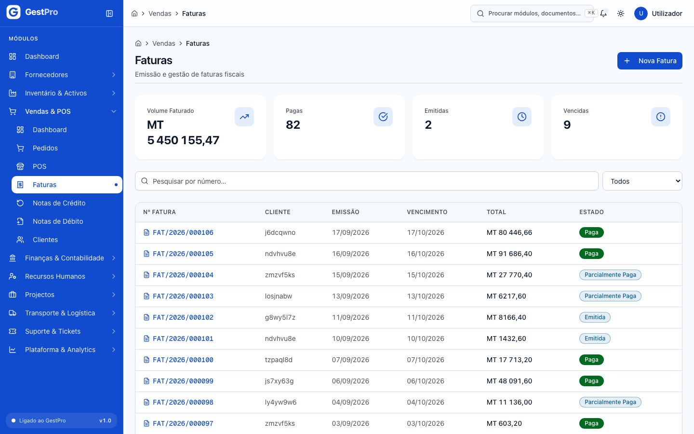

<!-- captura: 04-vendas-e-pos/fatura-nova.png | /vendas/faturas/nova -->
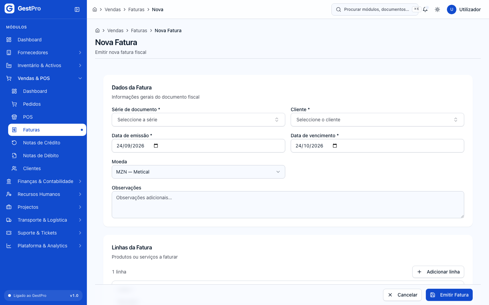

<!-- captura: 04-vendas-e-pos/fatura-detalhe.png | /vendas/faturas >primeiro -->
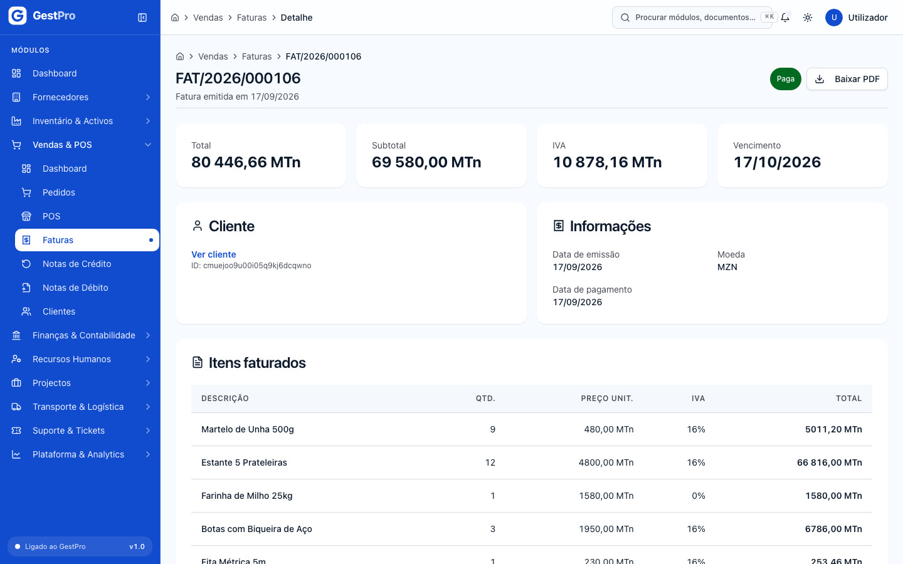

### Como emitir uma nota de crédito

Use-a para **reduzir** o valor de uma fatura já emitida: mercadoria devolvida, produto com defeito, valor cobrado a
mais, venda cancelada ou desconto concedido depois.

**Antes de começar**
- Permissão de emitir notas de crédito (Administrador, Gestor, Financeiro) e **e-mail confirmado**.
- A fatura original tem de estar **Emitida**, **Parcialmente Paga**, **Paga** ou **Vencida**, e ainda ter **saldo
  creditável** (o total menos as notas de crédito já emitidas sobre ela). O ecrã só mostra essas.

**Passos**
1. Abra **Vendas & POS › Notas de Crédito** e clique **Nova Nota de Crédito**.
2. Em **Dados da Nota de Crédito**, escolha a **Factura a creditar \*** — pesquise pelo número; cada opção mostra o
   número, a data e o **saldo** que ainda se pode creditar. Indique a **Data de emissão \*** e o **Motivo \***:
   Devolução de mercadoria, Produto com defeito, Erro no valor cobrado, Cancelamento de venda, Desconto posterior ou
   Outro motivo. A nota é numerada na série activa de notas de crédito do ano da data de emissão.
3. Em **Itens a Creditar**, descreva cada item (**Descrição \***, **Quantidade**, **Preço (MT)**, **Desconto (MT)**,
   **IVA**). Numa linha a 0 %, preencha o **Motivo de isenção \***. Credite só o que está a corrigir, não a fatura
   inteira, a menos que seja esse o caso.
4. Clique **Emitir Nota de Crédito**.

**Resultado**
- Aparece «Nota de crédito emitida com sucesso!» e a nota fica na lista, estado **Emitida**, com ligação à
  **Fatura Original**.

**Efeitos noutros módulos**
- **Contabilidade:** é criado automaticamente o lançamento de estorno (o inverso do da fatura). Ver
  [Contabilidade](05-contabilidade.md).
- A fatura original **não muda** de estado nem de valor — a correcção é a nota de crédito.

> O sistema recusa uma nota de crédito que, somada às já emitidas, ultrapasse o total da fatura (ver
> [Erros frequentes](#erros-frequentes)).

<!-- captura: 04-vendas-e-pos/nota-credito-nova.png | /vendas/notas-credito/nova -->
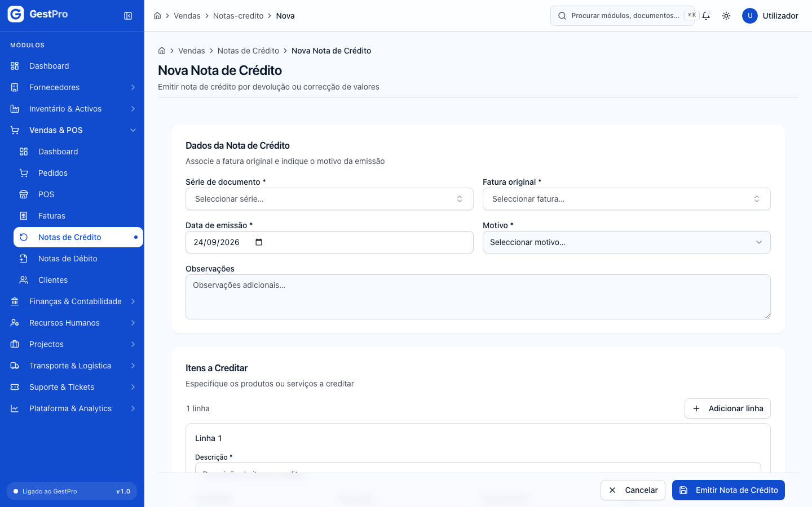

### Como emitir uma nota de débito

Use-a para **cobrar a mais** ao cliente algo que ficou de fora: um serviço adicional não faturado, uma actualização
contratual, uma correcção de preço ou custos logísticos adicionais.

**Antes de começar**
- Permissão de emitir notas de débito (Administrador, Gestor, Financeiro) e **e-mail confirmado**.

**Passos**
1. Abra **Vendas & POS › Notas de Débito** e clique **Nova Nota de Débito**.
2. Escolha o **Cliente \*** e a **Data de emissão \***. A nota é numerada na série activa de notas de débito do ano
   da data de emissão.
3. Escolha a **Natureza \*** — é ela que decide onde o valor entra na contabilidade (ver abaixo): **Acerto de
   preço** (por omissão), **Juros de mora**, **Despesas repercutidas**, **Penalização** ou **Outro**.
4. Confira a **Conta a crédito**: vem preenchida com a conta configurada para a natureza e muda quando muda a
   natureza. Se a natureza não tiver conta por omissão (Despesas repercutidas e Outro, de origem), a conta é
   obrigatória — para despesas repercutidas, escolha a conta de gasto (classe 6) que a despesa originou.
5. Opcionalmente, ligue a **Factura de referência** (só aparecem facturas desse cliente que ainda têm saldo, com o
   número, a data e o saldo; escolha primeiro o cliente).
6. Escolha o **Motivo \***: Serviços adicionais não faturados, Actualização contratual, Correcção de preço, Custos
   logísticos adicionais ou Outro. Acrescente **Observações** se precisar.
7. Nas linhas, descreva cada valor (**Descrição \***, **Quantidade**, **Preço (MT)**, **Desconto (MT)**, **IVA** 16%
   ou 0% (isento)). Para um valor único (por exemplo juros), use quantidade 1 e o valor no preço. Numa linha a 0 %,
   preencha o **Motivo de isenção \***.
8. Clique **Emitir Nota de Débito**.

**Resultado**
- Aparece «Nota de débito emitida com sucesso!» e a nota fica na lista, estado **Emitida**.

**Efeitos noutros módulos**
- **Contabilidade:** é criado automaticamente o lançamento: débito **411 Clientes c/c** pelo total; crédito da
  **conta a crédito** pelo valor sem IVA e **44331 IVA liquidado** pelo IVA. Ver [Contabilidade](05-contabilidade.md).

**A natureza do débito.** Nem todo o débito é uma venda. Uma correcção de preço é receita de vendas; juros de mora são
um rendimento financeiro; portes que a empresa pagou e repassa ao cliente são uma recuperação de gasto; uma
penalização contratual é outro rendimento. Misturar tudo em «vendas» faz o volume de negócios parecer maior do que
é. As contas por omissão de cada natureza configuram-se em **Contabilidade › Configurações › Naturezas de nota de
débito** ([Contabilidade](05-contabilidade.md#como-configurar-a-conta-de-cada-natureza-de-nota-de-débito)):

| Natureza | Conta a crédito por omissão |
|---|---|
| Acerto de preço | 711 Vendas |
| Juros de mora | 781 Juros obtidos |
| Penalização | 769 Outros rendimentos |
| Despesas repercutidas | — (escolhida em cada nota, classe 6) |
| Outro | — (escolhida em cada nota, classe 7) |

<!-- captura: 04-vendas-e-pos/nota-debito-nova.png | /vendas/notas-debito/nova -->
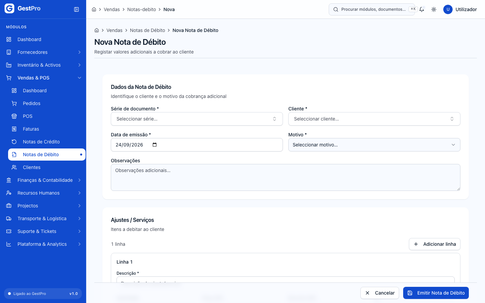

### Como registar uma devolução

**Antes de começar**
- Permissão de criar devoluções (Administrador, Gestor).

**Passos**
1. Abra `/vendas/devolucoes` e clique **Nova Devolução**.
2. Em **Informações da Devolução**, escolha o **Cliente \*** (pesquise por código, nome ou NUIT) e, opcionalmente, a
   **Venda (opcional)** — pesquise pelo número da venda; só aparecem vendas desse cliente, por isso escolha primeiro o
   cliente. Escolha o **Motivo \*** (Defeito, Produto errado, Insatisfação, Excesso de pedido, Avaria no transporte,
   Outro), marque **Reembolso ao cliente** se for devolver o dinheiro em numerário, e escreva **Observações**.
3. Em **Itens a Devolver**, para cada linha escolha o **Produto \*** (pesquise por nome ou SKU; o sistema propõe o
   preço de venda) e acerte **Qtd.** e **Valor Unit. (MT)**. Use **Adicionar Item** para mais linhas.
4. Clique **Registar Devolução**.

**Resultado**
- Aparece «Devolução criada com sucesso» e a devolução fica na lista com número `NDV/…` e estado **Pendente**.
- Nada acontece ainda ao stock, à caixa nem à contabilidade: a devolução tem de ser aprovada e processada (tarefa
  seguinte).

> **Atenção:** a devolução registada neste formulário fica ligada à venda escolhida, mas **não à factura** dessa
> venda. Por isso, ao processá-la, o sistema dá entrada do stock (e, com reembolso, tira o dinheiro da caixa) mas
> **não emite nota de crédito**, e o botão **Criar Troca** não aparece. Para desfazer uma venda POS inteira, use
> [Como anular uma venda POS](#como-anular-uma-venda-pos); para corrigir o valor faturado ao cliente, emita uma
> [nota de crédito](#como-emitir-uma-nota-de-crédito).

### Como aprovar, processar ou rejeitar uma devolução

**Antes de começar**
- Precisa da permissão de aprovar, de processar ou de rejeitar devoluções, conforme a acção (Administrador e Gestor
  têm as três).
- Se a devolução tem **Reembolso ao cliente**, quem a processa tem de ter uma **sessão de caixa aberta** em seu nome:
  o dinheiro sai dessa gaveta.

**Passos**
1. Em `/vendas/devolucoes`, clique no número da devolução.
2. Numa devolução **Pendente**, clique **Aprovar** (e de novo **Aprovar** na janela) ou **Rejeitar** (e de novo
   **Rejeitar**). Aparece «Devolução … aprovada.» ou «Devolução … rejeitada.». A rejeição não se pode reverter: uma
   devolução rejeitada não se processa nem dá origem a uma troca.
3. Numa devolução **Aprovada**, clique **Processar**.
4. Em **Entrada do stock devolvido**, escolha a **Localização \*** onde os artigos dão entrada.
5. Clique **Processar Devolução**. Aparece «Devolução processada.» e a devolução passa a **Processada**.

**Resultado**
- **Stock:** cada artigo devolvido dá entrada na localização escolhida.
- **Nota de crédito:** se a devolução estiver ligada a uma factura, é emitida uma nota de crédito dos artigos
  devolvidos, numerada na série activa; o detalhe da devolução mostra **Ver nota de crédito**.
- **Caixa:** com **Reembolso ao cliente**, o valor sai da sua sessão de caixa aberta («Reembolso devolução NDV/…»)
  e, havendo nota de crédito, liquida-a. Sem caixa aberto, o ecrã avisa «Esta devolução reembolsa o cliente em
  dinheiro: abra uma sessão de caixa antes de a processar.» e o botão fica indisponível.
- O detalhe da devolução mostra, em **Histórico**, quando foi aprovada (ou rejeitada) e processada.

### Como criar uma troca

Uma troca parte de uma devolução **Aprovada** ligada a uma factura: o cliente devolve um artigo e leva outro. O
crédito da devolução paga o artigo novo; só a diferença muda de mãos.

**Antes de começar**
- Permissão de criar trocas (Administrador, Gestor) e **e-mail confirmado** (a troca emite documentos fiscais).
- Se a troca movimentar dinheiro (diferença paga em dinheiro, ou dinheiro a devolver ao cliente), tem de ter uma
  **sessão de caixa aberta** em seu nome.

**Passos**
1. No detalhe da devolução aprovada, clique **Criar Troca** (ou abra `/vendas/trocas`, clique **Nova Troca** e, em
   **Devoluções aprovadas com factura**, clique **Escolher** na devolução).
2. Confira, no quadro **Devolução NDV/…**, os artigos devolvidos e o **Crédito da devolução**.
3. Em **Substituição**, escolha o **Produto \*** (pesquise por nome, SKU ou código de barras), a **Quantidade** e o
   **Preço Unit. (MT)** (vem o preço de venda), e a **Localização \*** onde o artigo devolvido dá entrada no stock.
4. Em **Diferença**, veja **Substituto**, **Crédito** e o valor **A pagar pelo cliente** ou **A devolver ao
   cliente**. Se o cliente tiver de pagar, escolha o **Meio de pagamento da diferença** (Dinheiro, Cartão,
   Transferência, M-Pesa ou e-Mola).
5. Clique **Criar Troca**. Aparece «Troca TRC/… criada.» e volta à lista de trocas.

**Resultado**
- É emitida, de uma vez, a **nota de crédito** da devolução e uma **Factura-Recibo** da venda de substituição, paga
  pelo crédito da nota (e pela diferença, se houver). A devolução passa a **Processada**.
- **Stock:** o artigo devolvido entra na localização escolhida e o de substituição sai dessa mesma localização.
- **Caixa:** só se houver dinheiro a receber ou a devolver.
- A venda de substituição não se anula pelo POS: corrige-se em Facturação, por nota de crédito.

> A diferença paga-se no acto: uma troca não aceita crédito. Se o cliente quiser pagar a diferença mais tarde, emita
> uma factura em Facturação.

### Como criar um vendedor e ver comissões

**Antes de começar**
- Criar vendedores e regras de comissão: Administrador, Gestor.

**Passos — vendedor**
1. Abra `/vendas/vendedores` e clique **Novo Vendedor**.
2. Preencha **Nome \***, **Email**, **Telefone**, **Meta Mensal (MT)** e **Observações**.
3. Clique **Criar Vendedor**. Aparece «Vendedor criado com sucesso» e abre o perfil do vendedor.

Os vendedores activos passam a aparecer no campo **Vendedor** da [Nova Encomenda](#como-registar-uma-encomenda-de-cliente).

**Passos — regra de comissão**
1. Abra `/vendas/comissoes/regras/nova` (ou **Nova Regra** nas comissões de um vendedor).
2. Preencha **Nome \***, **Tipo \*** (Fixa, Escalonada, Por Categoria, Por Meta, Por Período), **Descrição \***,
   **Percentual Base (%) \***, e opcionalmente **Percentual Bónus (%)**, **Prioridade** e **Ativa**.
3. Em **Aplicação (opcional)**, para restringir a regra, escolha o **Vendedor** (pesquise pelo nome; vazio = todos
   os vendedores) e a **Data de Início** e **Data de Fim**. As datas contam por dia inteiro, na hora de Maputo: a
   regra aplica-se às vendas do primeiro ao último dia, ambos incluídos.
4. Clique **Criar Regra**. Aparece «Regra de comissão criada com sucesso.».

**Consultar comissões:** abra `/vendas/comissoes` para ver **Total Comissões**, **Pendentes**, **Pagas** e
**Valor Total**, e a lista com **Venda**, **%**, **Valor Base**, **Comissão**, **Estado** e **Data**. Cada venda
feita no POS gera uma comissão; sem regra própria do vendedor, aplica-se 5%. Clique no valor da **Comissão** para
abrir o detalhe.

### Como aprovar, pagar ou cancelar uma comissão

**Antes de começar**
- Aprovar e cancelar exigem a permissão de gerir comissões; marcar como paga, a de pagar comissões. Nos perfis de
  sistema, ambas são só do Administrador e do Gestor (o Financeiro não paga comissões). Os botões só aparecem a quem
  tem a permissão.

**Passos**
1. Em `/vendas/comissoes` (ou nas **Últimas Comissões** do perfil do vendedor), clique no valor da comissão.
2. Numa comissão **Pendente**, clique **Aprovar** e confirme com **Aprovar**. Aparece «Comissão aprovada.».
3. Numa comissão **Aprovada**, clique **Marcar como paga** e confirme. Aparece «Comissão marcada como paga.» e o
   campo **Paga em** fica com a data de hoje.
4. Para cancelar uma comissão **Pendente** ou **Aprovada**, clique **Cancelar comissão**, escreva o **Motivo** e
   clique **Cancelar Comissão**. Aparece «Comissão cancelada.»; o motivo fica no detalhe, em **Motivo do
   cancelamento**.

**Resultado**
- Pagas e canceladas são estados finais: não voltam atrás.
- **Marcar como paga** só regista o pagamento: **não** gera lançamento contabilístico nem movimento de caixa.

### Como editar ou desactivar um vendedor

**Antes de começar**
- Editar exige a permissão de editar vendedores; desactivar, a de excluir vendedores (ambas do Administrador e do
  Gestor). Os botões só aparecem a quem tem a permissão.

**Passos — editar**
1. Em `/vendas/vendedores`, abra o perfil do vendedor e clique **Editar**.
2. Altere **Nome \***, **Email**, **Telefone**, **Meta Mensal (MT)**, **Estado** (Activo, Inactivo, Suspenso) ou
   **Observações**.
3. Clique **Guardar alterações**. Aparece «Vendedor actualizado».

**Passos — desactivar**
1. No perfil do vendedor, clique **Desactivar** e confirme com **Desactivar**. Aparece «Vendedor desactivado.».

**Resultado**
- O vendedor fica **Inactivo** mas não é apagado: continua na listagem e as comissões dele mantêm-se. Para o
  reactivar, abra **Editar** e mude o **Estado** para **Activo**.

### Como criar um cliente

**Antes de começar**
- Permissão de criar clientes (Administrador, Gestor).
- Tenha à mão o **NUIT** do cliente (9 dígitos). Não pode haver dois clientes com o mesmo NUIT na empresa.

**Passos**
1. Abra **Vendas & POS › Clientes** e clique **Novo Cliente**.
2. Em **Informações Gerais**: **Tipo de Cliente** (Pessoa Física, Pessoa Jurídica, Revendedor), **Nome / Razão
   Social**, **NUIT**, **BI (opcional)**, **Email**, **Telefone**, **Categoria** (Novo, Regular, VIP), **Estado**
   (Activo, Inactivo, Suspenso) e **Observações**.
3. Em **Condições Comerciais**: **Dias de Pagamento** (por exemplo 30) e **Limite de Crédito (MT)** (0 = sem limite
   de crédito). O limite **não bloqueia** vendas: quando uma venda a crédito ou uma factura o ultrapassa, o sistema
   emite o documento e mostra um aviso.
4. Em **Endereço Principal** (endereço de faturação): **Rua / Avenida**, **Número**, **Bairro**, **Cidade** e
   **Província**.
5. Clique **Guardar Cliente**.

**Resultado**
- Aparece «Cliente criado com sucesso!» e volta à lista.

<!-- captura: 04-vendas-e-pos/clientes.png | /clientes -->
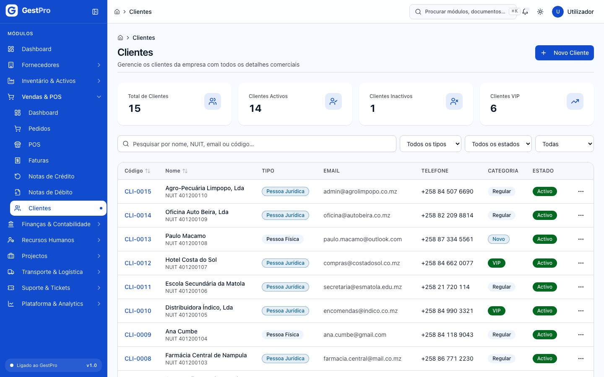

### Como consultar, editar ou desactivar um cliente

**Passos**
1. Em **Clientes**, pesquise por nome, NUIT, email ou código, ou filtre por **Tipo**, **Estado** e **Categoria**.
2. Clique no nome para abrir a ficha: separadores **Informações** (contactos, **Crédito** com **Limite** e
   **Utilizado**, observações), **Endereços** e **Contactos**.
3. Para alterar dados, clique **Editar**, faça as alterações e clique **Guardar Alterações**.
4. Para desactivar, clique **Desactivar Cliente** e depois **Confirmar Desactivação**. Aparece «Cliente desactivado
   com sucesso.».

**Resultado**
- O cliente desactivado passa a **Inactivo**. Só os clientes **Activos** aparecem para escolha em novas faturas,
  notas de débito, encomendas e vendas a crédito no POS.
- Um cliente **Inactivo** ou **Suspenso** não pode comprar a crédito (nem no POS, nem por factura, nem pela
  conversão de uma encomenda); pode continuar a comprar a pronto.
- Um cliente com facturas por pagar não pode ser desactivado. O valor em dívida conta-se pelas facturas em aberto
  (total menos o já pago e menos as notas de crédito emitidas).
- Para voltar a activar, abra **Editar** e mude o **Estado** para **Activo**.

> **Atenção:** o valor **Utilizado** do quadro **Crédito**, na ficha do cliente, não acompanha as facturas e os
> pagamentos. Para saber quanto o cliente deve, veja as facturas dele em **Faturas**, ou a **Dívida Total** e os
> maiores devedores nos **Relatórios de Clientes** (`/clientes/relatorios`), que já contam pelas facturas em aberto.

<!-- captura: 04-vendas-e-pos/cliente-detalhe.png | /clientes >primeiro -->

### Como ver e exportar o histórico de um cliente

**Passos**
1. Abra `/clientes/historico`.
2. Na coluna **Clientes**, à esquerda, clique no cliente.
3. A tabela mostra **Data**, **Tipo**, **Referência**, **Descrição**, **Valor** e **Estado** das transacções.
4. Para exportar, clique **CSV** ou **XLSX** no topo.

> **Atenção:** o histórico mostra as transacções carregadas com os dados de demonstração; as vendas e faturas novas
> ainda **não** são acrescentadas a esta lista. Para ver as faturas de um cliente, use **Faturas**; para as vendas,
> pesquise o nome do cliente em `/vendas`.

<!-- captura: 04-vendas-e-pos/clientes-historico.png | /clientes/historico -->
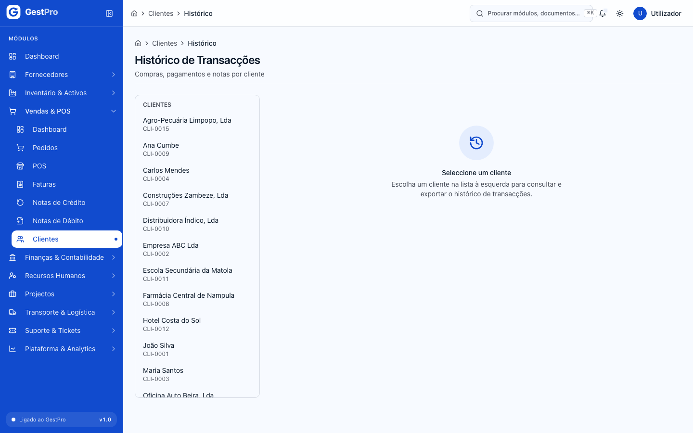

## Estados

### Venda

| Estado | Significado | Pode passar a | Quem |
|---|---|---|---|
| Rascunho | Venda ainda em preparação. | Pendente (botão **Submeter**), Cancelada | Submeter: Administrador, Gestor, Operador. Cancelar: Administrador, Gestor |
| Pendente | Venda registada (vendas manuais e as vendas POS antigas). | Confirmada (botão **Confirmar**), Faturada, Cancelada | Confirmar: Administrador, Gestor, Operador. Cancelar: Administrador, Gestor |
| Confirmada | Venda aceite. | Em Preparação, Faturada, Cancelada | Cancelar: Administrador, Gestor |
| Em Preparação | A ser preparada para entrega. | Faturada, Cancelada | Cancelar: Administrador, Gestor |
| Faturada | Venda com fatura (é o estado da venda POS com parte a crédito e da venda criada ao converter uma encomenda). | Concluída, Devolvida (só sem documento fiscal), Cancelada (venda POS, só por **Anular venda**) | Anular: Administrador, Gestor |
| Concluída | Venda terminada (é o estado da venda POS paga). | Cancelada, só por **Anular venda** | Administrador, Gestor |
| Cancelada | Venda anulada. | — (final) | — |
| Devolvida | Mercadoria devolvida. | — (final) | — |

Nos ecrãs existem os botões **Submeter**, **Confirmar**, **Cancelar Venda** e, nas vendas POS, **Anular venda**; as
passagens para Em Preparação, Faturada, Concluída ou Devolvida ainda não têm botão (o POS cria as vendas já
Concluídas ou Faturadas, e a conversão de uma encomenda cria-a já Faturada).

### Sessão POS

| Estado | Significado | Pode passar a | Quem |
|---|---|---|---|
| Aberta | O terminal está a vender. | Fechada (botão **Fechar Sessão**, ou ao fechar ou cancelar o caixa), Suspensa | Administrador, Gestor, Operador |
| Suspensa | Pausa (ainda sem botão). | Aberta, Fechada (também ao fechar ou cancelar o caixa) | — |
| Fechada | Sessão encerrada. | — (final) | — |

### Encomenda

| Estado | Significado | Pode passar a | Quem |
|---|---|---|---|
| Rascunho | Criada, ainda não confirmada; pode ser editada. | Confirmada (botão **Confirmar**), Cancelada (**Cancelar Encomenda**) | Administrador, Gestor |
| Confirmada | Aceite; o stock fica reservado. | Concluída (**Converter em Venda**), Parcialmente Entregue, Cancelada (**Cancelar Encomenda**) | Administrador, Gestor |
| Parcialmente Entregue | Parte já foi entregue (ainda sem botão para registar entregas). | Concluída (**Converter em Venda**), Cancelada (**Cancelar Encomenda**) | Administrador, Gestor |
| Concluída | Convertida em venda. | — (final) | — |
| Cancelada | Anulada; o stock reservado é libertado e a encomenda sai da listagem. | — (final) | — |

### Fatura

| Estado | Significado | Pode passar a | Quem |
|---|---|---|---|
| Emitida | Fatura emitida, por pagar. É o estado com que nasce. | Paga, Parcialmente Paga, Vencida, Cancelada | Ver [capítulo 6](06-faturacao-caixa-tesouraria.md) |
| Parcialmente Paga | Pagamento parcial registado. | Paga, Vencida | Ver capítulo 6 |
| Vencida | Passou a data de vencimento sem pagamento total. | Paga, Parcialmente Paga, Cancelada | Ver capítulo 6 |
| Paga | Totalmente paga. | — (final) | — |
| Cancelada | Anulada. | — (final) | — |

### Nota de crédito e nota de débito

| Estado | Significado | Pode passar a | Quem |
|---|---|---|---|
| Emitida | Documento emitido. É o estado com que nasce. | Liquidada, Cancelada | — (sem botão nestes ecrãs) |
| Liquidada | Valor acertado com o cliente. | — (final) | — |
| Cancelada | Anulada. | — (final) | — |

### Devolução

| Estado | Significado | Pode passar a | Quem |
|---|---|---|---|
| Pendente | Registada, à espera de decisão. | Aprovada (**Aprovar**), Rejeitada (**Rejeitar**) | Administrador, Gestor |
| Aprovada | Aceite. | Processada (**Processar**, ou ao criar uma troca com **Criar Troca**) | Administrador, Gestor |
| Processada | Stock recebido e crédito tratado. | — (final) | — |
| Rejeitada | Recusada. | — (final) | — |

### Comissão

| Estado | Significado | Pode passar a | Quem |
|---|---|---|---|
| Pendente | Calculada automaticamente na venda. | Aprovada (**Aprovar**), Cancelada (**Cancelar comissão**, ou automaticamente se a venda for cancelada ou anulada) | Administrador, Gestor |
| Aprovada | Aceite para pagamento. | Paga (**Marcar como paga**), Cancelada (**Cancelar comissão**) | Administrador, Gestor |
| Paga | Paga ao vendedor. | — (final) | — |
| Cancelada | Anulada. | — (final) | — |

### Cliente

| Estado | Significado | Pode passar a | Quem |
|---|---|---|---|
| Activo | Cliente em uso. | Inactivo (**Desactivar Cliente**), Suspenso (em **Editar**) | Administrador, Gestor |
| Suspenso | Cliente temporariamente suspenso. | Inactivo, Activo (em **Editar**) | Administrador, Gestor |
| Inactivo | Cliente desactivado. | Activo (em **Editar**) | Administrador, Gestor |

## Erros frequentes

| Mensagem mostrada | Porquê | O que fazer |
|---|---|---|
| Para emitir documentos fiscais é preciso confirmar o endereço de e-mail da conta — um documento fiscal é irreversível e tem efeito para terceiros. … | A conta que está a usar ainda não confirmou o e-mail. | Abra a ligação de confirmação recebida por e-mail (o aviso no painel reenvia-a). Se já confirmou, termine a sessão e entre de novo. |
| Sem permissão para esta operação | O seu perfil não tem a permissão para esta acção (por exemplo, o Financeiro a vender no POS, ou o Operador a cancelar uma venda). | Peça a um Administrador. Ver [Plataforma e Administração](11-plataforma-e-administracao.md). |
| Stock insuficiente. Disponível: …, solicitado: …. | Não há stock suficiente no armazém para a quantidade no carrinho. | Reduza a quantidade ou dê entrada de stock em [Inventário](03-inventario.md). |
| Nenhum armazém activo encontrado. Crie pelo menos um armazém no módulo de stock. | A empresa não tem nenhum armazém activo. | Crie um armazém em [Inventário](03-inventario.md). |
| Sessão de caixa … não está aberta | A sessão de caixa ligada ao POS foi fechada. | Abra o caixa outra vez e volte ao POS. |
| Uma venda a crédito exige um cliente identificado (não o Consumidor Final). | Escolheu **Crédito** sem cliente, ou com o Consumidor Final. | Escolha o cliente em **Cliente \***. |
| A venda … tem documento fiscal: use «Anular venda» (nota de crédito total) ou registe uma devolução. | Tentou cancelar ou dar como devolvida uma venda com documento fiscal. | Use **Anular venda** ou uma nota de crédito. |
| … é um cliente técnico do POS e não pode ser alterado nem desactivado. | Tentou editar ou desactivar o Consumidor Final. | Nada a fazer: o Consumidor Final é do sistema. |
| Existem N vendas pendentes. Feche-as antes de encerrar a sessão. | Há vendas Pendentes nesta sessão POS. | Confirme-as em `/vendas` e volte a fechar a sessão. |
| Série activa para tipo "…" no ano … não encontrada. Crie a série … primeiro. | Não existe numeração para esse tipo de documento no ano da data escolhida. | Veja as séries no capítulo [Faturação, Caixa e Tesouraria](06-faturacao-caixa-tesouraria.md); confirme também a data de emissão. |
| Data de vencimento não pode ser anterior à data de emissão | Datas trocadas na fatura. | Corrija a **Data de vencimento**. |
| Há campos por corrigir acima — a encomenda não foi criada. | Falta o cliente, um produto ou uma quantidade válida. | Corrija os campos marcados a vermelho. |
| NUIT deve ter exactamente 9 dígitos / NUIT inválido — deve ter 9 dígitos não repetidos | O NUIT do cliente está incompleto ou não é válido. | Confirme o NUIT com o cliente. |
| Cliente tem … MT em facturas por pagar | Tentou desactivar um cliente com facturas em aberto. | Registe os pagamentos (ou emita as notas de crédito devidas) antes de desactivar. |
| Um cliente suspenso ou inactivo não pode comprar a crédito. Reactive o cliente ou receba a pronto. | Venda a crédito, fatura ou conversão de encomenda para um cliente Suspenso ou Inactivo. | Reactive o cliente em **Editar** ou receba a pronto. |
| O cliente … passa a ter … MT de crédito utilizado, acima do limite de crédito de … MT. | Aviso (não é erro): a venda ou a fatura ultrapassou o limite de crédito do cliente. O documento foi emitido. | Decida com o gestor se continua a vender a crédito a este cliente. |
| Em falta: MT … / O excesso só pode ser troco em dinheiro. / Valor inválido: positivo, até 2 casas decimais. | No painel de pagamento do POS, os pagamentos não cobrem o total, passam dele num meio que não dá troco, ou um valor está mal escrito. | Acerte os valores das linhas; o botão **Pagar** só fica disponível quando a soma está certa. |
| Existem N vendas pendentes nas sessões POS deste caixa. Conclua-as ou anule-as antes de encerrar o caixa. | Tentou fechar ou cancelar o caixa com vendas Pendentes numa sessão POS dele. | Confirme-as em `/vendas` e volte a fechar o caixa. |
| Para pagar em numerário é necessário ter uma sessão de caixa aberta. Abra o caixa em Caixa › Abertura antes de pagar em numerário. | Anulou uma venda com parte em dinheiro sem ter uma sessão de caixa aberta em seu nome. | Abra o seu caixa e volte a anular. |
| Não tem permissão para operar o caixa: a devolução em dinheiro não é possível. / Não tem permissão para movimentar contas bancárias: a devolução por cartão ou carteira móvel não é possível. | A anulação devolveria dinheiro por um meio que o seu perfil não pode movimentar. | Peça a anulação a quem tenha essa permissão. |
| A factura da venda … já tem a nota de crédito …: a anulação total creditá-la-ia duas vezes. | O documento da venda já tem uma nota de crédito. | Corrija o resto por [nota de crédito](#como-emitir-uma-nota-de-crédito) sobre a factura. |
| O saldo em aberto da factura … (…) é inferior ao valor a compensar da nota de crédito (…). | Anulou uma venda POS com parte a crédito cuja factura já recebeu pagamentos. | Trate a correcção em Faturação (nota de crédito e devolução do que foi pago). |
| A factura … (…) já tem … creditados: uma nota de crédito de … excede o total. | A nota de crédito, somada às já emitidas, passa do total da fatura. | Reduza as linhas a creditar ao saldo mostrado na lista **Factura a creditar**. |
| Indique o motivo de isenção (IVA a 0%). / A linha N tem IVA a 0%: indique o motivo de isenção ou de não sujeição. | Uma linha a 0 % numa fatura, nota de crédito ou nota de débito sem motivo de isenção. | Preencha o **Motivo de isenção** dessa linha. |
| Stock disponível insuficiente. Disponível: …, solicitado: …. | Ao confirmar uma encomenda, a localização escolhida não tem stock livre para reservar. | Escolha outra localização ou dê entrada de stock em [Inventário](03-inventario.md). |
| Transição inválida de Venda: FATURADA → CANCELADA. Permitidas: CONCLUIDA, DEVOLVIDA | Clicou **Cancelar Venda** numa venda **Faturada** sem documento fiscal (por exemplo, a criada ao converter uma encomenda). | Uma venda Faturada já não se cancela pelos ecrãs; fale com o Financeiro para a correcção. |
| Só é possível converter encomendas confirmadas em venda. | A encomenda já não está Confirmada (por exemplo, foi convertida ou cancelada entretanto). | Actualize a página e veja o estado da encomenda. |
| Esta devolução reembolsa o cliente em dinheiro: abra uma sessão de caixa antes de a processar. | Devolução com **Reembolso ao cliente** e sem caixa aberto em seu nome. | Abra o seu caixa e volte a **Processar**. |
| Esta troca movimenta dinheiro na gaveta: abra uma sessão de caixa … | A diferença da troca paga-se ou devolve-se em dinheiro e não tem caixa aberto. | Abra o seu caixa ou, se o cliente paga, escolha outro meio. |
| A nota de crédito … da devolução … está CANCELADA: … / … está LIQUIDADA: … | A nota de crédito ligada à devolução já foi cancelada ou já foi liquidada: não tem crédito para usar. | Fale com o Financeiro: a correcção faz-se em Faturação. |

## Perguntas frequentes

**Enganei-me numa fatura. Posso corrigi-la?** Não directamente — uma fatura emitida não se altera. Emita uma
[nota de crédito](#como-emitir-uma-nota-de-crédito) para anular o que estava a mais e, se for o caso, uma nova fatura
correcta ou uma [nota de débito](#como-emitir-uma-nota-de-débito) para o que ficou por cobrar.

**A venda no POS emite fatura?** Sim. Uma venda paga emite uma **Factura-Recibo**; uma venda a crédito, uma
**Factura** em nome do cliente. Ambas aparecem em **Faturas** e entram na contabilidade. Não emita outra fatura para
a mesma venda.

**O cliente pagou por M-Pesa. Entra no caixa?** Não. Só o dinheiro entra na sessão de caixa. O M-Pesa é lançado na
conta configurada para esse meio (por omissão, 121 Depósitos à ordem); o método fica registado no separador
**Pagamentos** da venda.

**O cliente quer pagar parte em dinheiro e parte por M-Pesa. Como faço?** No painel de pagamento, use **Adicionar
pagamento** para ter uma linha por meio. Só a linha de dinheiro entra na gaveta e só ela pode dar troco. Ver
[Como vender no POS](#como-vender-no-pos).

**Posso anular uma venda POS de ontem?** Sim. A anulação usa a **sua** sessão de caixa aberta para devolver o
dinheiro; a sessão onde a venda foi feita pode já estar fechada. Ver [Como anular uma venda POS](#como-anular-uma-venda-pos).

**Posso vender no POS sem ter confirmado o e-mail?** Não. Cada venda POS emite um documento fiscal, e o POS recusa
abrir a sessão enquanto o e-mail não estiver confirmado.

**Onde estão as cotações e as proformas?** No capítulo [Faturação, Caixa e Tesouraria](06-faturacao-caixa-tesouraria.md).
