# 5. Contabilidade

> **Para quem:** Financeiro, Administrador, Gestor (sem fecho de períodos nem estornos) · Leitura (só consulta) · **Onde:** menu › Finanças & Contabilidade

## Para que serve

O módulo de Contabilidade guarda a escrita da empresa em partidas dobradas, segundo o Plano Geral de Contabilidade baseado nas NIRF (PGC-NIRF, Decreto n.º 70/2009). A maior parte dos lançamentos chega sozinha dos outros módulos (facturas, notas de crédito e de débito, contas a pagar, salários); aqui regista os lançamentos manuais, consulta o razão e o balancete, reconcilia os bancos, apura o IVA e fecha os meses.

O princípio que atravessa todo o módulo: **um lançamento confirmado nunca se altera nem se apaga — corrige-se com um estorno**, e **um mês fechado não aceita mais escrita**.

## Conceitos

| Termo | O que é |
|---|---|
| Exercício | O ano contabilístico (ex.: «Exercício 2026», de 1 de Janeiro a 31 de Dezembro). Cada exercício tem **13 períodos**. |
| Período | Uma divisão do exercício. Os períodos 1 a 12 são os meses (código `2026-01` … `2026-12`). O **Período 13 (encerramento)** (`2026-13`) está reservado aos lançamentos de fim de ano. Cada período está **Aberto** ou **Fechado**. |
| Lançamento | Um registo contabilístico com data, diário, histórico e pelo menos duas partidas. A soma dos débitos tem de ser igual à soma dos créditos. |
| Partida | Uma linha do lançamento: uma conta, um lado (Débito ou Crédito) e um valor. |
| Período fiscal do lançamento | O período a que o lançamento pertence. **É decidido pela data do lançamento** (dia civil em Maputo): um lançamento de 14/03/2026 fica no período `2026-03`. Não se escolhe à mão. |
| Diário | Agrupa os lançamentos por natureza (Vendas, Compras, Caixa, Banco, Operações, Salários, Abertura, Encerramento, Outros). A numeração dos lançamentos recomeça em cada diário, em cada período. |
| Rascunho | Lançamento gravado mas ainda sem efeito: não entra no balancete, no razão nem na DRE, e impede o fecho do período. |
| Estorno | Contra-lançamento com as partidas invertidas, que anula um lançamento já confirmado. O original fica visível, marcado **Estornado**. |
| Plano de contas | As contas PGC-NIRF da empresa. Só as **contas de movimento** (as que têm «Aceita Lançamentos» ligado) recebem lançamentos; as outras só agregam. |
| Apuramento do IVA | Lançamento mensal que salda as contas de IVA liquidado, dedutível e regularizações contra a conta 4435 e passa o resultado para 4437 (IVA a pagar) ou 4438 (IVA a recuperar). |
| Reconciliação bancária | Comparação entre o extracto do banco e o que a contabilidade registou na conta PGC desse banco. |

### Como se relacionam exercício, períodos e lançamentos

```
Exercício 2026
 ├─ Período 2026-01  (Janeiro)   ── lançamentos com data em Janeiro
 ├─ Período 2026-02  (Fevereiro) ── lançamentos com data em Fevereiro
 │   …
 ├─ Período 2026-12  (Dezembro)
 └─ Período 2026-13  (encerramento)
```

- **Cada lançamento pertence a um só período**, determinado pela sua data. O mesmo vale para os lançamentos automáticos: uma factura emitida a 3 de Abril gera um lançamento no período `2026-04`.
- **Enquanto o período está Aberto**, aceita lançamentos novos (manuais e automáticos) e estornos com data nesse mês.
- **Quando o período é Fechado**, qualquer escrita com data nesse mês é recusada com a mensagem «Período 2026-03 está fechado» — incluindo a emissão de uma factura, nota de crédito ou nota de débito com data nesse mês, ou um estorno datado nesse mês. Para corrigir um mês fechado, estorne com uma data de um período aberto, ou peça a reabertura.
- **Os meses fecham por ordem**: não se fecha Março com Fevereiro ainda aberto.
- **O exercício seguinte abre sozinho**: por omissão a 1 de Dezembro é criado o exercício do ano seguinte, com os 13 períodos e as séries de numeração dos documentos (ver [Configurações](#como-configurar-a-abertura-automática-do-exercício)). Se, por qualquer razão, alguém registar um documento num ano ainda sem exercício, o sistema cria-o nesse momento.

> **Atenção:** o encerramento do exercício (saldar as classes 6 e 7, apurar o resultado, transportar saldos de abertura) **ainda não existe no produto**. Os estados de exercício «Em Encerramento», «Encerrado (Provisório)» e «Encerrado» estão previstos, mas hoje todos os exercícios ficam **Aberto**. O Período 13 existe e pode ser fechado, mas nenhum lançamento é hoje colocado nele.

## Ecrãs

| Menu | Endereço | Para que serve |
|---|---|---|
| Dashboard | `/contabilidade` | Indicadores (lançamentos pendentes e efectuados, contas, diários) e atalhos para os ecrãs do módulo. |
| Plano de Contas | `/contabilidade/plano-contas` | Lista, cria, edita e desactiva contas PGC-NIRF. |
| Diários | `/contabilidade/diarios` | Lista, cria e edita diários. |
| Lançamentos | `/contabilidade/lancamentos` | Lista de lançamentos; criar, confirmar e estornar. |
| Razão Geral | `/contabilidade/razao-geral` | Movimentos de uma conta num intervalo de datas, com saldo acumulado. |
| Balancete | `/contabilidade/balancete` | Balancete de verificação (débitos, créditos e saldo por conta). |
| Reconciliação | `/contabilidade/reconciliacao` | Reconciliação bancária por conta: importar extracto, confirmar correspondências, fechar períodos de reconciliação. |
| Exercícios | `/contabilidade/exercicios` | Exercícios e os seus 13 períodos; fechar e reabrir períodos; abrir um exercício. |
| Apuramento de IVA | `/contabilidade/iva` | Apurar, estornar e declarar o IVA de cada período; descarregar os mapas. |
| Configurações | `/contabilidade/configuracoes` | Calendário de abertura automática do exercício e fecho automático de períodos. |
| *(atalho no Dashboard)* Centros de Custo | `/contabilidade/centros-custo` | Dimensão analítica. |
| *(atalho no Dashboard)* DRE | `/contabilidade/dre` | Demonstração do Resultado do Exercício. |
| *(botão em Reconciliação)* Contas Bancárias | `/contabilidade/contas-bancarias` | Contas bancárias e a conta PGC a que cada uma está ligada. |

Faturação, Caixa, Tesouraria e Compromissos, que também estão neste grupo do menu, são descritos em [Faturação, Caixa e Tesouraria](06-faturacao-caixa-tesouraria.md).

<!-- captura: 05-contabilidade/dashboard.png | /contabilidade -->
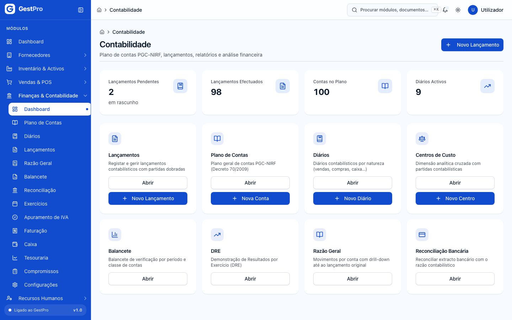

## Tarefas

### Como consultar e manter o plano de contas

**Antes de começar:** criar ou editar contas exige a permissão de escrita no plano de contas (Administrador e Financeiro). Consultar está aberto a todos os perfis.

1. Abra **Finanças & Contabilidade › Plano de Contas**. A lista mostra Código, Nome, Classe, Tipo, Natureza, Lançamentos (Sim/Não) e Estado. Pode filtrar por **Classe** e **Tipo**.
2. Clique numa conta para ver o detalhe: identificação, **Movimento do exercício** (Débitos, Créditos, Saldo devedor/credor, Movimentos) e **Hierarquia** (conta mãe e sub-contas). Numa conta de movimento, **Ver razão** abre o Razão Geral dessa conta no exercício corrente.
3. Para criar uma conta, clique **Nova Conta** e preencha:
   - **Identificação:** Código, Nível (1 a 4), Nome.
   - **Classificação:** Classe, Tipo, Natureza (Devedora/Credora), Conta Mãe (opcional) e **Aceita Lançamentos** (só as contas de movimento, as «folhas», devem ter este interruptor ligado).
   - Descrição (opcional).
4. Clique **Guardar Conta**.

**Resultado:** a mensagem «Conta criada.» (ou «Conta actualizada.») e a conta passa a aparecer na lista.

**Regras que o sistema impõe:**
- Numa conta que já tem lançamentos, o **código, a classe, o tipo, a natureza, o nível e a conta mãe ficam bloqueados** — alterá-los mudaria o significado de documentos já emitidos. Só o nome e a descrição mudam. Para reclassificar, crie uma conta nova e desactive a antiga.
- **Desactivar** (no detalhe da conta) só é possível numa conta **sem** lançamentos. Uma conta com histórico fica; o que se faz é deixar de lançar nela.

> **Atenção:** os códigos do plano entregue não levam pontos (ex.: `111`, `44331`), apesar de o formulário sugerir o formato «1.1.1». Use o formato sem pontos, como no resto do plano. As designações de classe no formulário também diferem das do plano (no plano, a classe 2 é «Inventários e activos biológicos», a 3 «Investimentos de capital» e a 4 «Contas a receber, contas a pagar, acréscimos e diferimentos»); escolha a classe pelo primeiro algarismo do código.

<!-- captura: 05-contabilidade/plano-contas.png | /contabilidade/plano-contas -->
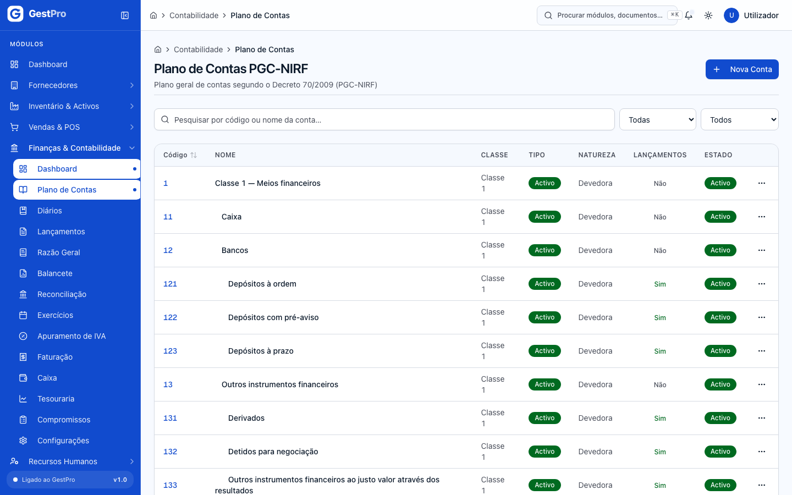

### Como criar ou editar um diário

**Antes de começar:** permissão de escrita em diários (Administrador, Financeiro, Gestor). Cada empresa já recebe nove diários: VD Vendas, CP Compras, CX Caixa, BN Banco, OP Operações, SL Salários, AB Abertura, EN Encerramento e OT Outros.

1. Abra **Diários** e clique **Novo Diário** (ou abra um diário e clique **Editar**).
2. Preencha **Código** (máximo 10 caracteres), **Natureza** e **Nome**.
3. Deixe **Activo** ligado. Um diário inactivo deixa de estar disponível para novos lançamentos.
4. Clique **Guardar Diário**.

**Resultado:** «Diário criado.» No detalhe do diário, **Ver lançamentos** mostra os lançamentos desse diário.

### Como criar um lançamento manual

**Antes de começar:**
- Permissão de criar lançamentos (Administrador, Financeiro, Gestor).
- O período da data que vai usar tem de estar **Aberto** (veja em **Exercícios**).

1. Abra **Lançamentos** e clique **Novo Lançamento**.
2. Em **Informações Gerais**, preencha **Data do Lançamento**, **Diário**, **Histórico** (a descrição que identifica o lançamento no razão) e, se quiser, **Observações**.
3. Em **Partidas (Débito = Crédito)**, para cada linha escolha a **Conta**, o **Tipo** (**D — Débito** ou **C — Crédito**), o **Valor (MZN)** e, opcionalmente, o histórico da partida. Use **Adicionar Partida** para mais linhas; são precisas pelo menos duas.
4. Confira o quadro de totais: tem de aparecer **Lançamento equilibrado**. Enquanto aparecer **Diferença (bloqueia submissão)**, o lançamento não é aceite.
5. Clique **Guardar Lançamento**.

**Resultado:** «Lançamento criado com sucesso!». O lançamento fica em **Rascunho**, com número atribuído no diário e período correspondentes. **Ainda não conta** no balancete, no razão nem na DRE — é preciso confirmá-lo.

> **Atenção:** hoje a lista de contas deste formulário só mostra as primeiras 200 contas de movimento, por ordem de código (até cerca da conta 493). Contas das classes 5 a 8 — capital, gastos, rendimentos e resultados — e parte da classe 4 **não aparecem** para escolha. Se precisar delas, contacte o administrador do sistema.

<!-- captura: 05-contabilidade/lancamento-novo.png | /contabilidade/lancamentos/novo -->
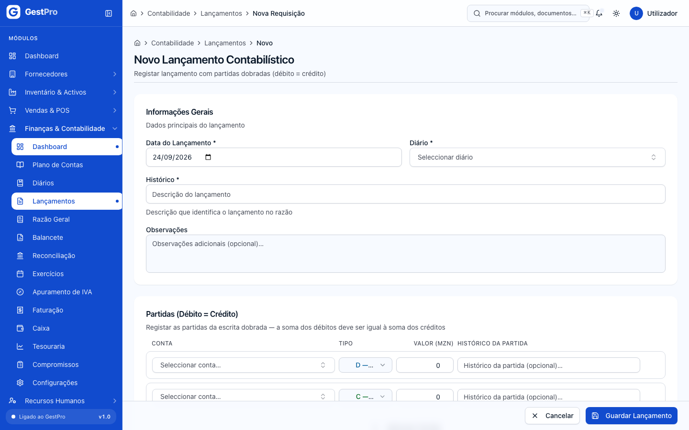

### Como confirmar (lançar) um lançamento

**Antes de começar:** permissão de confirmar lançamentos (Administrador, Financeiro, Gestor).

1. Em **Lançamentos**, filtre por **Estado: Rascunho**.
2. Abra o lançamento e clique **Confirmar** (ou, na lista, menu **⋯ › Confirmar**).
3. Leia o aviso — «Depois de lançado fica imutável… Correcções posteriores fazem-se por estorno, nunca por alteração.» — e clique **Confirmar**.

**Resultado:** «Lançamento confirmado.» O estado passa a **Lançado** e o lançamento entra no balancete, no razão, na DRE e no apuramento do IVA.

> **Nota:** o produto não tem, hoje, forma de editar nem de eliminar um rascunho. Se um rascunho estiver errado, a única saída é confirmá-lo e depois estorná-lo. Reveja bem antes de gravar.

<!-- captura: 05-contabilidade/lancamentos.png | /contabilidade/lancamentos -->
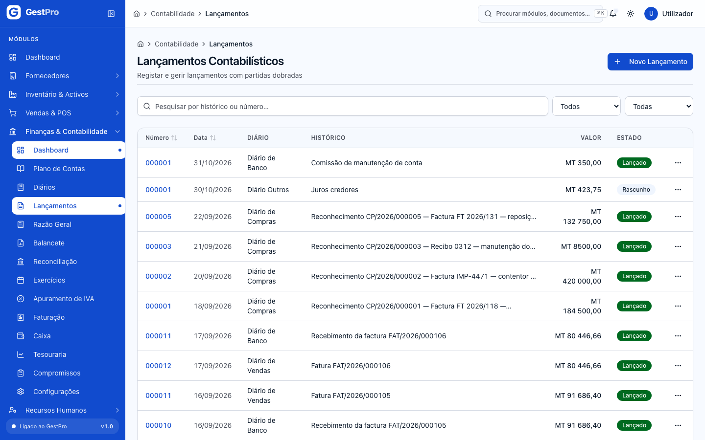

### Como estornar um lançamento

Um lançamento **Lançado** nunca se edita. Para o anular, estorna-se.

**Antes de começar:** permissão de estornar (Administrador e Financeiro). O período da **data do estorno** tem de estar aberto.

1. Abra o lançamento e clique **Estornar** (ou, na lista, **⋯ › Estornar**).
2. Indique a **Data do estorno** (por omissão, hoje). Esta data determina o período fiscal onde o contra-lançamento entra — pode ser um mês diferente do original.
3. Escreva o **Motivo** (obrigatório). Fica registado no contra-lançamento.
4. Clique **Estornar lançamento**.

**Resultado:** «Lançamento N estornado.» É criado um novo lançamento, já **Lançado**, com as partidas invertidas e o histórico «ESTORNO: …». O original passa a **Estornado** e mantém-se visível. No detalhe de cada um aparece a ligação ao outro («Estornado por …» / «Este é o estorno de …»). Um lançamento só se estorna uma vez.

**Efeitos noutros módulos:** estornar um lançamento criado por uma factura não anula a factura — isso faz-se em [Faturação](06-faturacao-caixa-tesouraria.md).

<!-- captura: 05-contabilidade/lancamento-detalhe.png | /contabilidade/lancamentos >primeiro -->
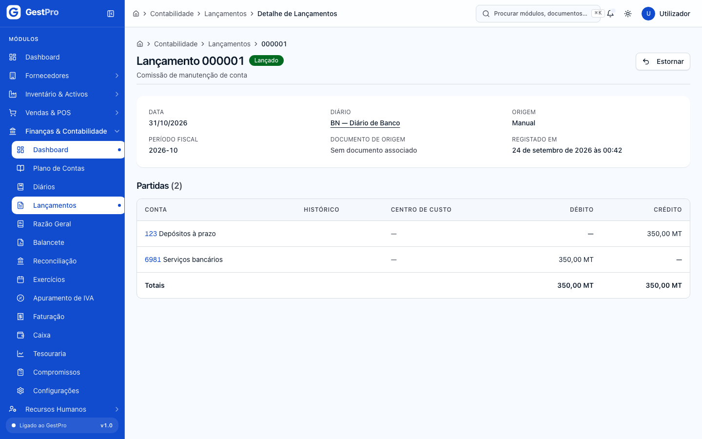

### Como consultar o Razão Geral de uma conta

1. Abra **Razão Geral**.
2. Escolha a **Conta** (só aparecem contas de movimento), as datas **De** e **Até**, e clique **Consultar**.

**Resultado:** a tabela **Movimentos da Conta** com Data, Histórico, Débito, Crédito e **Saldo Acum.** Só contam lançamentos **Lançados** e **Estornados** (os rascunhos ficam de fora; um lançamento estornado e o seu estorno aparecem os dois e anulam-se).

> **Nota:** o saldo acumulado começa em zero na data «De» — não inclui o saldo de antes do intervalo. Para ver o saldo desde o início do ano, comece em 1 de Janeiro.

> **Atenção:** o mesmo defeito da data «Até» descrito no Balancete aplica-se aqui — ver abaixo.

### Como gerar o Balancete

1. Abra **Balancete**. Por omissão, mostra o ano civil corrente.
2. Ajuste **De** e **Até** e clique **Consultar**. Em **Contas Zeradas** pode escolher **Excluir zeradas** ou **Incluir zeradas**.

**Resultado:** o quadro «Balancete — dd/mm/aaaa – dd/mm/aaaa» com Código, Conta, Saldo Anterior, Débitos, Créditos e Saldo Actual por conta de movimento, a linha **TOTAIS** e a linha **DIFERENÇA (deve ser zero)**. Se a diferença não for zero, há lançamentos desequilibrados — e o período não fecha.

> **Atenção — defeito conhecido na data «Até»:** os lançamentos com data **no próprio dia indicado em «Até»** ficam de fora do balancete (e também do Razão Geral e da DRE). Por exemplo, com Até = 31/12/2026, os lançamentos de 31 de Dezembro não aparecem. Até ser corrigido, **indique em «Até» o dia seguinte** ao último dia que quer incluir (ex.: 01/01/2027 para fechar em 31/12/2026, ou 01/04/2026 para um balancete até 31/03/2026).

> **Atenção:** a coluna **Saldo Anterior** mostra sempre zero — o balancete conta só os movimentos do intervalo escolhido. Para saldos acumulados, comece em 1 de Janeiro. A caixa «Pesquisar por conta…» e a opção «Incluir zeradas» não alteram, hoje, o resultado.

> **Atenção:** o botão **Registar Balancete Oficial** (`/contabilidade/balancete/nova`) é um protótipo: o balancete «registado» fica guardado só no seu browser, não na base de dados da empresa, e não é visto por mais ninguém. Não o use como registo oficial.

<!-- captura: 05-contabilidade/balancete.png | /contabilidade/balancete -->
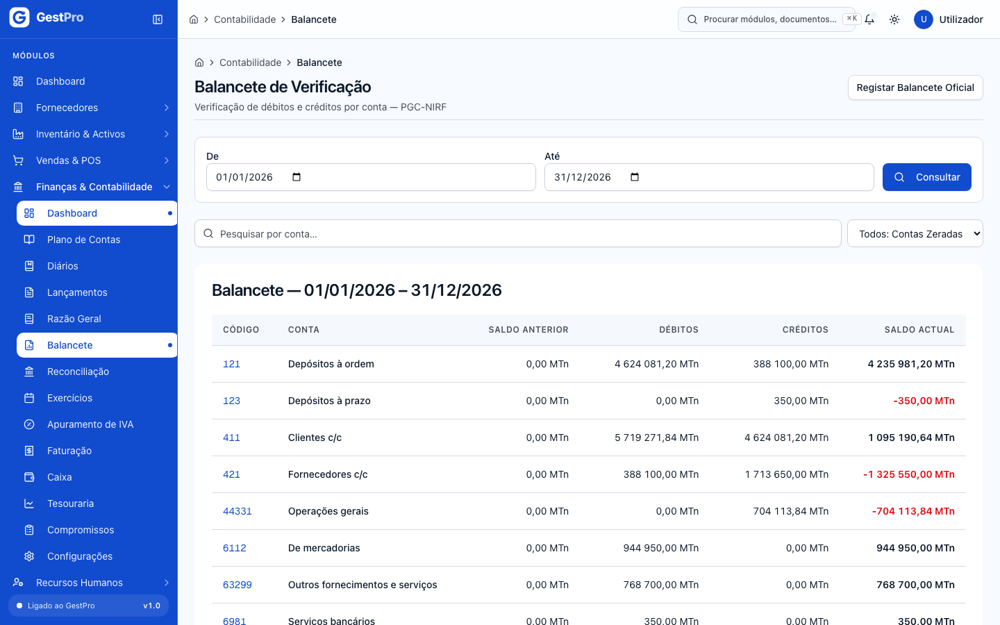

### Como abrir um exercício manualmente

Normalmente não é preciso: o exercício do ano seguinte abre sozinho (ver Configurações).

**Antes de começar:** permissão de abrir exercício (Administrador e Gestor).

1. Abra **Exercícios** e clique **Abrir exercício**.
2. Indique o **Ano** e clique **Abrir exercício**.

**Resultado:** «Exercício 2027 aberto. N série(s) de documento criadas.» São criados o exercício, os 13 períodos (todos **Aberto**) e as séries de numeração dos documentos desse ano. Se o exercício já existia, a mensagem é «Exercício 2027 já existia — operação idempotente.» e nada muda.

### Como fechar um período (mês)

Fechar um período tranca-o: a partir daí, nenhum lançamento — manual ou vindo de outro módulo — pode entrar com data nesse mês.

**Antes de começar:**
- Permissão de fechar período (Administrador e Financeiro).
- A ordem recomendada do fecho mensal é: conferir documentos → confirmar rascunhos → reconciliar bancos → **apurar o IVA** → **fechar o período** → declarar o IVA à AT.

1. Abra **Exercícios**. Cada exercício mostra a grelha dos 13 períodos com Período, Código, Início, Fim, Estado, Fechado em e Acções.
2. Na linha do período, clique **Fechar período**.
3. Se tudo estiver em ordem, aparece «Período fechado» e o estado passa a **Fechado**.
4. Se não, aparece um quadro «N impedimentos para fechar» com **todos** os impedimentos de uma só vez. Resolva-os e tente de novo.

**O que impede o fecho de um período** (o sistema verifica todos e mostra-os juntos):

| Impedimento (mensagem mostrada) | O que significa | Como resolver |
|---|---|---|
| Existem lançamentos em rascunho no período. | Há lançamentos por confirmar com data nesse mês. | Em **Lançamentos**, filtre por **Rascunho** e confirme-os (não é possível eliminá-los — ver nota acima). |
| Existe pelo menos uma sessão de caixa aberta com abertura neste período. | Uma sessão de caixa aberta nesse mês ainda não foi fechada. | Feche a sessão em **Caixa** ([capítulo 6](06-faturacao-caixa-tesouraria.md)). |
| Existe uma reconciliação bancária em curso que abrange datas deste período. | Há um período de reconciliação bancária **Aberto** ou **Em reconciliação** cujas datas tocam este mês. | Em **Reconciliação**, feche ou cancele esse período de reconciliação. |
| Existem facturas, notas de crédito ou notas de débito emitidas neste período sem o lançamento contabilístico correspondente. | Um documento fiscal emitido no mês não gerou o seu lançamento. | Não é situação normal e não se resolve com um lançamento manual (o documento continua sem ligação). Contacte o suporte. |
| O balancete do período não está equilibrado — o total dos débitos é diferente do total dos créditos. | A soma dos débitos dos lançamentos do mês difere da soma dos créditos. | Veja o **Balancete** do mês e corrija com estornos. |
| O período anterior ainda está aberto. | Os períodos fecham por ordem. | Feche primeiro o mês anterior. |
| O apuramento do IVA do período ainda não foi executado. | O mês não tem apuramento de IVA **Apurado** ou **Declarado à AT**. | Apure o IVA em **Apuramento de IVA** (mesmo que o resultado seja zero). |

**Efeitos noutros módulos:** com o período fechado, é recusada qualquer operação que gere lançamento com data nesse mês — emitir facturas, notas de crédito ou de débito, criar ou pagar contas a pagar, registar recepções de compras, processar salários, estornar.

> **Nota:** o Período 13 também exige apuramento de IVA para fechar. Como não recebe lançamentos, o apuramento dá zero e não gera lançamento — basta executá-lo.

<!-- captura: 05-contabilidade/exercicios.png | /contabilidade/exercicios -->
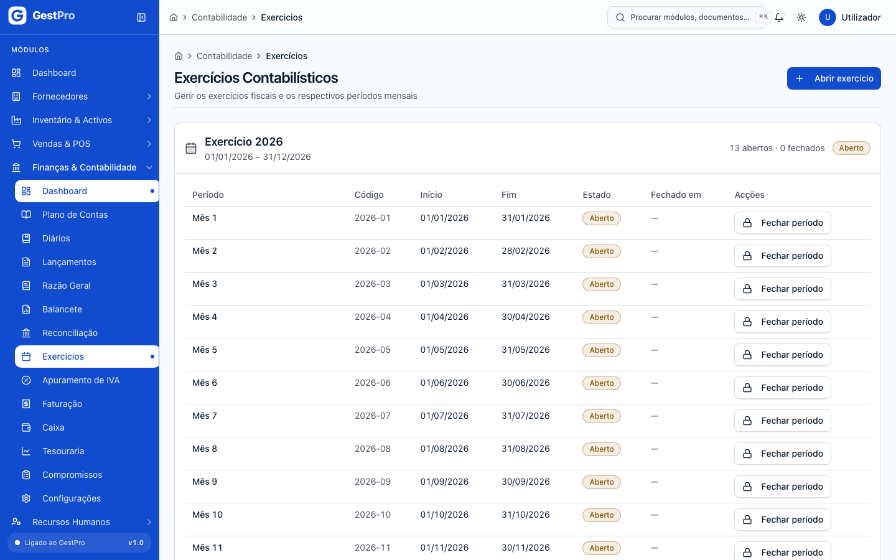

### Como reabrir um período fechado

Reabrir é possível, mas é uma operação excepcional, com motivo e registo.

**Antes de começar:**
- Permissão de reabrir período — por omissão só o **Administrador** a tem (nem o Financeiro nem o Gestor).
- **Não é possível** reabrir um período cujo IVA já foi marcado como **Declarado à AT**. Nesse caso, a correcção faz-se por regularização no período seguinte (contas 44341/44342).

1. Em **Exercícios**, na linha do período **Fechado**, clique **Reabrir**.
2. Escreva o **Motivo (mínimo 10 caracteres)** — fica gravado no trilho de auditoria.
3. Clique **Reabrir período**.

**Resultado:** «Período 2026-03 reaberto com sucesso». O período volta a **Aberto** e aceita lançamentos. O apuramento de IVA existente mantém-se; se precisar de o refazer, estorne-o em **Apuramento de IVA**.

### Como apurar o IVA de um período

> **Atenção — conformidade legal por confirmar:** o apuramento segue as alterações ao Código do IVA da Lei n.º 10/2025 (taxa normal de 16 %, taxa reduzida de 5 %, fim dos regimes especiais a partir de Janeiro de 2026), mas esta leitura assenta em análises de consultoras e **ainda não foi confirmada contra o texto publicado no Boletim da República nem junto da AT**. A regra de apuramento continua em validação. Confira os valores com o seu contabilista certificado antes de entregar a declaração.

**Antes de começar:**
- Permissão de apurar IVA (Administrador, Financeiro, Gestor).
- O período tem de estar **Aberto**, sem rascunhos, e todos os documentos fiscais do mês com lançamento.
- O produto **recusa apurar** se o mês tiver operações a taxas diferentes de 16 % e 0 % (por exemplo, 5 %), porque o cálculo do pro rata não está implementado.

1. Abra **Apuramento de IVA**. Para cada exercício aparece a lista de períodos com Período, Intervalo, Estado período, Apuramento IVA (**Não apurado**, **Apurado**, **Declarado à AT**) e Acção.
2. Na linha do mês, clique **Apurar**.
3. Leia o que o apuramento vai fazer e clique **Apurar IVA do período 2026-03**.

**Resultado:** «IVA apurado com sucesso para o período 2026-03». O sistema:
- lê os saldos das contas de IVA (4432x dedutível, 4433x liquidado, 4434x regularizações) nesse mês;
- gera um lançamento **Lançado** no diário de Operações, com data do último dia do mês e histórico «Apuramento IVA 2026-03», que salda essas contas contra 4435 e passa o resultado para **4437 IVA a pagar** ou **4438 IVA a recuperar** (o crédito de meses anteriores em 4438 é trazido de volta ao apuramento);
- grava as linhas do apuramento para os mapas.

No detalhe (**Ver detalhe**) aparecem os totais **IVA Liquidado**, **IVA Dedutível**, **Regularizações**, **Crédito Reportado** e **IVA a Pagar** ou **IVA a Recuperar**, e as **Linhas do apuramento** (Conta, Nome (à data), Tipo, Base imponível, Taxa, Imposto, Divergência). Se houver divergências entre base × taxa e o imposto do razão, surge o aviso «Existem divergências nas linhas acima» — confirme a origem antes de declarar.

Se o apuramento for recusado, o ecrã mostra o motivo (ver [Erros frequentes](#erros-frequentes)); quando há documentos sem lançamento, lista-os pelo número.

<!-- captura: 05-contabilidade/iva.png | /contabilidade/iva -->
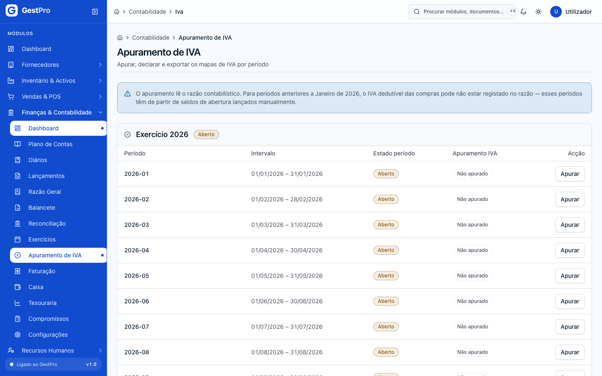

### Como descarregar os mapas de IVA

1. No detalhe do apuramento, em **Mapas de suporte**, clique no mapa pretendido:
   - **Suporte Declaração Periódica** — Modelo A — base e imposto por taxa;
   - **Mapa de Clientes** — por documento, NUIT e imposto liquidado;
   - **Mapa de Fornecedores** — por documento, NUIT e imposto dedutível;
   - **Antiguidade do Crédito** — crédito em 4438 por período de origem.

**Resultado:** é descarregado um ficheiro CSV. Os mapas saem das linhas gravadas no apuramento, não de um recálculo: um mapa pedido anos depois devolve os mesmos números. Todos os perfis, incluindo Leitura, podem descarregá-los.

### Como corrigir um apuramento de IVA (estornar)

Só enquanto **não** estiver declarado à AT.

**Antes de começar:** permissão de apurar IVA. O período tem de estar **Aberto** (se estiver fechado, peça primeiro a reabertura).

1. No detalhe do apuramento, clique **Estornar**.
2. Escreva o **Motivo (mínimo 10 caracteres)** e clique **Estornar apuramento**.

**Resultado:** o lançamento do apuramento é estornado **com data no último dia do mesmo período** e o apuramento fica **Estornado**. Pode então corrigir o que faltava e voltar a **Apurar** — nasce uma nova versão (v2, v3…). As versões anteriores ficam no histórico.

### Como marcar o IVA como declarado à AT

**Antes de começar:** permissão de declarar IVA (Administrador e Financeiro). Faça-o depois de entregar a declaração.

1. No detalhe de um apuramento **Apurado**, clique **Marcar declarado**.
2. Indique a **Data de entrega à AT** e a **Referência da entrega** (número de referência ou recibo da AT).
3. Clique **Confirmar declaração**.

**Resultado:** «Apuramento marcado como declarado à AT». O estado passa a **Declarado à AT**. **É irreversível:** o apuramento deixa de poder ser estornado e o período deixa de poder ser reaberto. Qualquer correcção posterior faz-se por regularização (contas 44341/44342) num período seguinte.

### Como reconciliar uma conta bancária

A reconciliação compara, conta a conta, os movimentos do extracto do banco com os lançamentos da conta PGC ligada a esse banco.

**Antes de começar:**
- Permissão de reconciliar (Administrador, Financeiro, Gestor).
- A conta bancária tem de estar criada em **Contas Bancárias** (botão no topo do ecrã de Reconciliação) e ligada à **sua própria** subconta PGC. Se duas contas bancárias activas partilharem a mesma conta PGC, aparece o aviso «Conta contabilística partilhada» e a reconciliação fica bloqueada.
- Tenha o extracto do banco em **CSV ou XLSX, até 5 MB**, com as colunas data, descrição e valor (opcionais: referência, tipo D/C, data-valor, saldo). Sem coluna de tipo, o sinal do valor decide se é entrada ou saída.

**1. Abrir um período de reconciliação**
1. Em **Reconciliação**, clique na conta bancária. O cabeçalho mostra o banco e a conta PGC.
2. Clique **Abrir período**. Indique **Início** e **Fim**, e os saldos **Saldo inicial** e **Saldo final** tal como o extracto os declara. Clique **Abrir período**.
   Só pode haver um período em aberto por conta, e não pode sobrepor-se a um já reconciliado.

**2. Importar o extracto**
1. Clique **Importar extracto**, escolha o ficheiro em **Extracto** e clique **Importar e reconciliar**.
2. Se alguma linha tiver erro, **nada é importado** e o ecrã lista todas as linhas com erro. Corrija o ficheiro e repita.

Reimportar o mesmo ficheiro, ou um extracto que se sobreponha a outro, não duplica movimentos.

**3. Executar o motor de correspondência**
A importação já corre o motor. Pode voltar a corrê-lo a qualquer momento com **Executar reconciliação** (por exemplo, depois de confirmar lançamentos novos). O motor procura pares entre banco e contabilidade por esta ordem: referência exacta, referência normalizada, documento, valor + natureza + data, valor dentro da tolerância, e descrição. Por omissão, **não confirma nada sozinho**: tudo o que encontra fica como sugestão.

**4. Tratar o resultado, vista a vista**

O ecrã da conta tem os indicadores **Excepções**, **Sugestões**, **Em trânsito** e **Reconciliados**, e as vistas:

- **Sugestões** — pares propostos pelo motor, com **Regra · confiança** e **Diferença**. Escolha os que aceita (ou **Todas nesta página**) e clique **Confirmar N**. Se algum tiver diferença de valor acima da tolerância, é pedida uma **Justificação** (mínimo 10 caracteres). **Rejeitar** liberta os dois movimentos e o motor não volta a propor esse par.
- **Excepções** — movimentos que precisam de decisão: **Banco sem contabilização**, **Contabilidade sem banco**, **Diferença de valor**, **Divergência**. Aqui pode:
  - **Contabilizar** (num movimento do banco sem lançamento): abre o formulário **Novo Lançamento** já preenchido com a data, o histórico e as partidas sugeridas (por exemplo, comissões e encargos bancários vão para a conta 6981 Serviços bancários). Se nenhuma regra se aplicar, aparece «Nenhuma regra de sugestão se aplica: escolha a conta de contrapartida.» Reveja, grave, **confirme o lançamento** (ver acima) e volte a **Executar reconciliação**.
  - **Reconciliar manualmente**: marque um ou mais movimentos de cada lado (**Extracto bancário** e **Contabilidade**), clique **Reconciliar manualmente (x + y)**, confira os totais e a diferença, escreva a **Justificação** (obrigatória, mínimo 10 caracteres) e confirme.
  - **Ignorar**: retira o movimento das excepções.
- **Em trânsito e pendentes** — lançamentos que ainda aguardam o banco (dentro da tolerância de dias, 5 por omissão) ou por classificar. Um movimento em trânsito continua a ser procurado nos extractos seguintes, mesmo depois de o período fechar.
- **Reconciliados** — **Reverter** desfaz uma reconciliação (os movimentos voltam a pendentes; fica o registo). Não é possível num período já fechado.
- **Ignorados** — **Reactivar** devolve o movimento às pendentes.

**5. Fechar o período de reconciliação**
1. Clique **Período em curso**. O ecrã mostra **Saldo reconciliado**, **Saldo contabilístico**, **Diferença residual** e o **Mapa de fecho** (saldo inicial e final do extracto, movimentos do período, valores em trânsito, bancários por contabilizar, diferenças aceites, diferença de abertura, saldo final da contabilidade, saldo reconciliado).
2. Clique **Fechar período** e confirme. Se a diferença residual não for zero, tem de escrever a **Justificação da diferença residual**.

**Resultado:** «Período reconciliado e fechado.» O mapa fica gravado tal como estava e as reconciliações deste período deixam de poder ser revertidas. Pode exportar o mapa em **XLSX** ou **CSV**. Em alternativa, **Cancelar período** anula-o sem afectar os movimentos (um período cancelado não se reabre: abre-se outro).

**Efeitos noutros módulos:** um período de reconciliação **Aberto** ou **Em reconciliação** impede o fecho do período contabilístico dos meses que abrange.

> **Nota:** as regras de sugestão de lançamento (qual conta usar para cada tipo de movimento do banco) ainda não se configuram no ecrã; existe apenas a regra por omissão para comissões, encargos, taxas, imposto de selo e manutenção. As tolerâncias da conta (dias, valor) também usam os valores por omissão.

<!-- captura: 05-contabilidade/reconciliacao.png | /contabilidade/reconciliacao -->
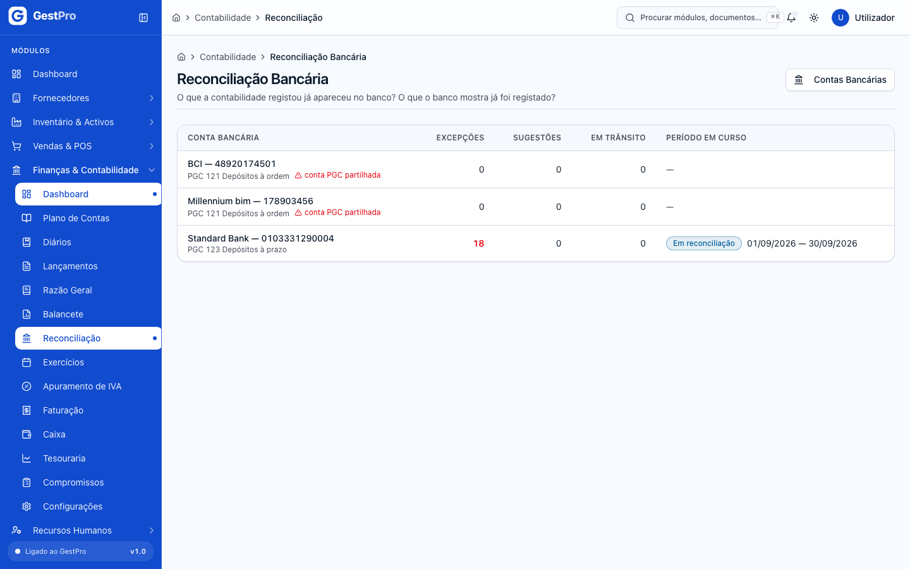

<!-- captura: 05-contabilidade/reconciliacao-conta.png | /contabilidade/reconciliacao >primeiro -->
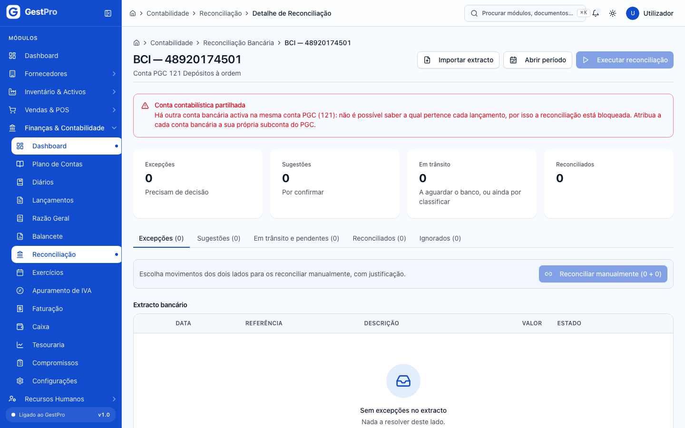

### Como configurar a abertura automática do exercício

**Antes de começar:** permissão de configuração financeira (Administrador, Financeiro, Gestor). Sem ela, a página mostra «Acesso não autorizado».

1. Abra **Configurações**.
2. Em **Calendário contabilístico**, ligue ou desligue **Abertura automática do exercício** e, se ligada, escolha o **Dia** (1–28) e o **Mês** (1–12) em que o exercício do ano seguinte deve abrir. Por omissão: 1 de Dezembro.
3. Clique **Guardar configurações**.

**Resultado:** «Configurações guardadas com sucesso.» No dia escolhido, o sistema abre o exercício seguinte com os 13 períodos e as séries de documento. Mesmo com a abertura automática desligada, pode sempre abrir manualmente em **Exercícios**.

> **Atenção:** a secção **Fecho automático de períodos** (interruptor e «Dias após o fim do mês») está visível mas **desactivada**: o processo agendado que faria o fecho ainda não existe. Os períodos fecham-se à mão em **Exercícios**.

> **Nota — conta por natureza de nota de débito:** a escolha da conta de rendimento a creditar por cada natureza de nota de débito (acerto de preço, juros de mora, penalização…) **ainda não está disponível** neste ecrã. Hoje, o lançamento de qualquer nota de débito debita 411 Clientes c/c e credita 711 Vendas (e 44331 IVA liquidado, se houver IVA), seja qual for a natureza.

<!-- captura: 05-contabilidade/configuracoes.png | /contabilidade/configuracoes -->
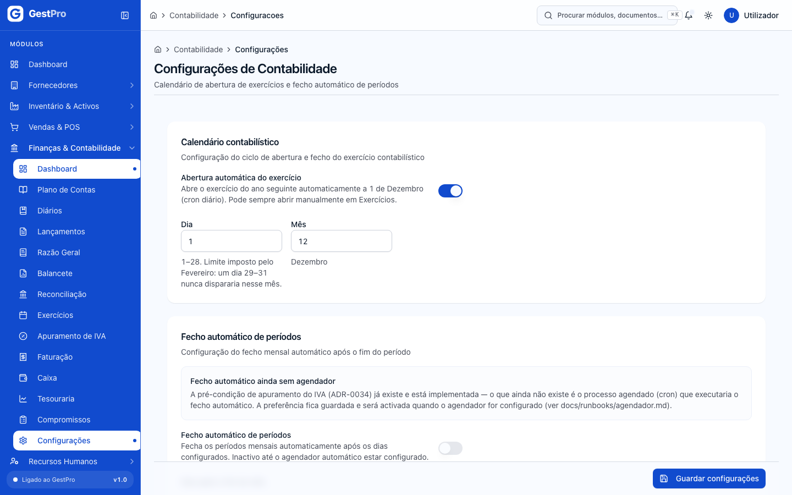

### Efeitos de outros módulos na contabilidade

Estes lançamentos são criados automaticamente, já no estado **Lançado**, com data do documento:

| Acção noutro módulo | Lançamento gerado |
|---|---|
| Emitir factura | Diário de Vendas: débito 411 Clientes c/c; crédito 711 Vendas e 44331 IVA liquidado. |
| Emitir nota de crédito | Diário de Vendas: o inverso da factura, na parte creditada. |
| Emitir nota de débito | Diário de Vendas: débito 411; crédito 711 e 44331. |
| Criar uma conta a pagar, ou registar a recepção de uma compra | Diário de Compras: débito da conta de gasto/existências (e da conta 4432x de IVA dedutível, só quando a conta a pagar tem o documento do fornecedor completo); crédito 421 Fornecedores c/c. Na recepção de compras não é lançado IVA dedutível. |
| Pagar uma conta a pagar | Diário de Banco: débito 421 Fornecedores c/c; crédito 121 Depósitos à ordem. |
| Processar e pagar a folha salarial | Diário de Salários ([Recursos Humanos](07-recursos-humanos.md)). |
| Converter uma encomenda em venda | Lançamento da venda ([Vendas e POS](04-vendas-e-pos.md)). |
| Apurar o IVA | Diário de Operações, no último dia do mês (ver acima). |

Se o período da data do documento estiver fechado, a operação no outro módulo é recusada com «Período … está fechado».

## Estados

**Lançamento**

| Estado | Significado | Pode passar a | Quem |
|---|---|---|---|
| Rascunho | Gravado, sem efeito nos mapas. Impede o fecho do período e o apuramento do IVA. | Lançado | Administrador, Financeiro, Gestor (**Confirmar**) |
| Lançado | Confirmado e imutável. Conta no balancete, razão, DRE e IVA. Os lançamentos automáticos nascem já neste estado. | Estornado | Administrador, Financeiro (**Estornar**) |
| Estornado | Anulado por um contra-lançamento; ambos continuam visíveis e anulam-se nos mapas. | — (final) | — |

**Período contabilístico**

| Estado | Significado | Pode passar a | Quem |
|---|---|---|---|
| Aberto | Aceita lançamentos com data no período. | Fechado | Administrador, Financeiro (**Fechar período**, sem impedimentos) |
| Fechado | Recusa qualquer escrita com data no período. | Aberto | Administrador (**Reabrir**, com motivo; nunca se o IVA estiver Declarado à AT) |

**Exercício**

| Estado | Significado | Pode passar a | Quem |
|---|---|---|---|
| Aberto | Exercício em curso. Hoje, é o único estado usado. | — | — |
| Em Encerramento · Encerrado (Provisório) · Encerrado | Previstos para o encerramento do ano, que ainda não existe. | — | — |

**Apuramento de IVA**

| Estado | Significado | Pode passar a | Quem |
|---|---|---|---|
| *(Não apurado)* | Ainda sem apuramento activo. | Apurado | Administrador, Financeiro, Gestor (**Apurar**) |
| Apurado | Calculado e lançado. Permite fechar o período. | Estornado · Declarado à AT | Estornar: Administrador, Financeiro, Gestor · Declarar: Administrador, Financeiro |
| Estornado | Versão anulada; o período volta a poder ser apurado (nova versão). | — (final) | — |
| Declarado à AT | Entregue à AT. Tranca a reabertura do período. | — (final) | — |

**Período de reconciliação bancária**

| Estado | Significado | Pode passar a | Quem |
|---|---|---|---|
| Aberto | Criado, motor ainda não corrido. | Em reconciliação · Cancelado | Administrador, Financeiro, Gestor |
| Em reconciliação | O motor já correu; em tratamento. | Reconciliado · Cancelado | Administrador, Financeiro, Gestor |
| Reconciliado | Fechado, com mapa gravado. | — (final) | — |
| Cancelado | Anulado; abre-se outro. | — (final) | — |

**Movimento na reconciliação** (extracto ou contabilidade)

| Estado | Significado |
|---|---|
| Pendente | Ainda não classificado ou devolvido após reverter/reactivar. |
| Em Trânsito | Lançamento ainda não visto no banco, dentro da tolerância de dias. |
| Banco sem contabilização | Está no extracto e não tem lançamento. |
| Contabilidade sem banco | Tem lançamento e não aparece no banco, já fora da tolerância. |
| Diferença de valor | Par encontrado, mas com valores diferentes (a decidir nas Sugestões). |
| Divergência | Não corresponde e precisa de análise. |
| Reconciliado · Reconciliado manualmente | Correspondido pelo motor (confirmado) ou à mão, com justificação. Volta a Pendente se for revertido. |
| Ignorado | Retirado da análise; volta a Pendente com **Reactivar**. |

## Erros frequentes

| Mensagem mostrada | Porquê | O que fazer |
|---|---|---|
| Período 2026-03 está fechado | A data do lançamento, estorno ou documento cai num período fechado. | Use uma data num período aberto, ou peça ao Administrador para reabrir o período. |
| Débitos (…) devem ser iguais a créditos (…) | O lançamento não está equilibrado. | Corrija os valores até ver «Lançamento equilibrado». |
| Mínimo de 2 partidas por lançamento | Só foi indicada uma partida. | Adicione pelo menos uma partida do lado oposto. |
| Conta … não aceita lançamentos | A conta escolhida é de agregação. | Escolha uma conta de movimento (subconta). |
| Conta "…" já existe | Já há uma conta com esse código. | Use outro código. |
| Esta conta já tem N movimento(s): … não pode(m) ser alterado(s). Crie uma conta nova e desactive esta. | Tentou mudar código, classe, tipo, natureza, nível ou conta mãe de uma conta com lançamentos. | Altere só o nome/descrição, ou crie conta nova. |
| Conta tem lançamentos — não pode ser desativada | A conta tem histórico. | Deixe de lançar nela; não é possível desactivá-la. |
| Transição inválida: LANCADO → LANCADO … | Tentou confirmar um lançamento que outra pessoa já confirmou. | Actualize a página. |
| Período 2026-03 já está fechado | O período foi fechado entretanto. | Actualize a página. |
| O apuramento do IVA do período … já foi declarado à AT (referência: …). A correcção deve ser feita por regularização no período seguinte … | Tentou reabrir um período com IVA declarado. | Faça a regularização (44341/44342) num período aberto. |
| Não é possível reabrir um período de um exercício encerrado | O exercício está encerrado. | Não há reabertura possível. |
| Motivo deve ter pelo menos 10 caracteres | Motivo de reabertura demasiado curto. | Escreva um motivo mais completo. |
| O período … já tem um apuramento activo (versão N). Para corrigir, estorne-o e execute de novo. | Já existe apuramento Apurado ou Declarado. | Estorne o apuramento (se não estiver declarado) e apure de novo. |
| O período … tem N lançamento(s) em rascunho. Confirme ou elimine antes de apurar. | Há rascunhos no mês. | Confirme-os em **Lançamentos**. |
| O período … tem N documento(s) fiscal(is) sem lançamento: … | Documentos emitidos sem lançamento. | Contacte o suporte, indicando os números listados. |
| O período … tem operações a taxas não-standard (ex.: 5 %). O cálculo do pro rata não está implementado. … | Há documentos a taxas diferentes de 16 % e 0 %. | Trate o apuramento desse mês fora do sistema com o seu contabilista. |
| Formato de extracto não suportado: … Use CSV ou XLSX. | Ficheiro com outra extensão. | Exporte o extracto em CSV ou XLSX. |
| O extracto excede o tamanho máximo de 5 MB. | Ficheiro demasiado grande. | Divida o extracto por períodos mais curtos. |
| Este ficheiro já tinha sido importado nesta conta — nada foi alterado. | Ficheiro repetido. | Nada a fazer. |
| Há N contas bancárias activas na mesma conta contabilística … | Duas contas bancárias partilham a conta PGC. | Em **Contas Bancárias**, ligue cada conta à sua própria subconta PGC. |
| Já existe um período de reconciliação em aberto para esta conta. | Só pode haver um período aberto por conta. | Feche ou cancele o período em curso. |
| O período sobrepõe-se a outro já reconciliado nesta conta. | As datas tocam um período fechado. | Comece no dia seguinte ao último período reconciliado. |
| A reconciliação tem uma diferença residual de … MT: justifique-a para fechar o período. | Há diferença por explicar. | Resolva as excepções/sugestões ou escreva a justificação. |
| Não se reconciliam entradas com saídas. | Escolheu movimentos de naturezas diferentes. | Escolha só entradas, ou só saídas, dos dois lados. |
| Um dos movimentos já tem correspondência: rejeite-a primeiro. | Um movimento escolhido está reservado por uma sugestão. | Rejeite a sugestão em **Sugestões** e tente de novo. |
| A correspondência pertence a um período já reconciliado. | Tentou reverter uma reconciliação de um período fechado. | Não é possível; registe o ajuste no período seguinte. |

## Perguntas frequentes

**Enganei-me num lançamento que ainda está em rascunho. Posso corrigi-lo?** Hoje não há forma de editar nem de eliminar um rascunho. Confirme-o e estorne-o, e depois crie o lançamento correcto.

**Porque é que o balancete não mostra os lançamentos do último dia?** É o defeito conhecido da data «Até». Indique o dia seguinte.

**Posso lançar em Janeiro de 2027 antes de o exercício 2027 abrir?** Sim: se o exercício ainda não existir, é criado automaticamente no primeiro lançamento com essa data.

**Quem pode reabrir um mês?** Só o Administrador, com motivo escrito — e nunca depois de o IVA desse mês ter sido declarado à AT.
