# 5. Contabilidade

> **Para quem:** Financeiro, Administrador, Gestor (sem fecho de períodos nem estornos) · Leitura (só consulta) · **Onde:** menu › Finanças & Contabilidade

## Objectivo do módulo

O módulo de Contabilidade guarda a escrita da empresa em partidas dobradas, segundo o Plano Geral de Contabilidade baseado nas NIRF (PGC-NIRF, Decreto n.º 70/2009). A maior parte dos lançamentos chega sozinha dos outros módulos (facturas, notas de crédito e de débito, pagamentos, contas a pagar, salários); aqui regista os lançamentos manuais, consulta o razão, o balancete, o balanço e a DRE, reconcilia os bancos, apura o IVA, fecha os meses e encerra o ano.

O objectivo é ter **uma contabilidade sempre em dia e verificável**: o contabilista deixa de passar o mês a
copiar documentos e passa a conferir, corrigir excepções e fechar.

| | |
|---|---|
| **Que problema resolve** | Contabilidade feita semanas depois, a partir de papéis; IVA calculado em folha de cálculo; meses «fechados» que continuam a mudar. |
| **Quem usa** | Financeiro e contabilista; o Administrador fecha o ano e reabre o que for preciso. |
| **O que entra** | Os lançamentos automáticos dos outros módulos, os lançamentos manuais e os extractos bancários. |
| **O que sai** | Razão, balancete (com exportação CSV, Excel e PDF), balanço, DRE, DFC, apuramento do IVA com mapas de suporte, reconciliação bancária fechada, meses e anos encerrados. |
| **Liga-se a** | Todos os módulos que movimentam dinheiro: [Vendas](04-vendas-e-pos.md), [Faturação e Caixa](06-faturacao-caixa-tesouraria.md), [Fornecedores](02-fornecedores-e-servicos.md), [Recursos Humanos](07-recursos-humanos.md). |

O princípio que atravessa todo o módulo: **um lançamento confirmado nunca se altera nem se apaga — corrige-se com um estorno**, e **um mês fechado não aceita mais escrita**.

## Exemplo prático — o fim do mês do contabilista

**Situação:** é dia 2 do mês seguinte. O Carlos Nhantumbo (Financeiro) quer fechar Outubro na Ferragens Boa
Obra. As vendas, facturas, pagamentos e salários já lançaram sozinhos; falta o que só ele sabe.

**1. Registar o depósito do dinheiro da loja no banco** → [Como criar um lançamento manual](#como-criar-um-lançamento-manual)

No dia 31 a Marta depositou no BCI 16 000,00 MT do caixa. Não há documento no sistema que o lance, por isso o
Carlos cria-o:

| Data | Diário | Histórico | Conta | D/C | Valor |
|---|---|---|---|---|---:|
| 31/10 | BN Banco | Depósito do caixa da loja | conta PGC do BCI | D | 16 000,00 |
| | | | 111 Caixa | C | 16 000,00 |

Fica em **Rascunho** (pode **Editar** ou **Anular**); com **Lançamento equilibrado** confirmado, clica
**Confirmar** → passa a **Lançado** → [Como confirmar](#como-confirmar-lançar-um-lançamento).

**2. Conferir uma conta no Razão** → [Como consultar o Razão Geral](#como-consultar-o-razão-geral-de-uma-conta)

Razão da conta **111 Caixa**, por períodos, de 10 a 10: **Saldo anterior**, cada venda em dinheiro, o depósito
de 16 000,00 a crédito e o **Saldo final** — que tem de bater com o dinheiro que ficou na gaveta.

**3. Reconciliar o BCI** → [Como reconciliar uma conta bancária](#como-reconciliar-uma-conta-bancária)

Importa o extracto CSV de Outubro. O motor sugere os pares (o depósito de 16 000,00, a transferência a um
fornecedor); a comissão de manutenção de conta de 350,00 aparece em **Excepções** → **Contabilizar** propõe a
conta **6981 Serviços bancários** (regra de sugestão) → grava, confirma, **Executar reconciliação** e fecha o
período com **diferença residual 0,00**.

**4. Apurar o IVA de Outubro** → [Como apurar o IVA](#como-apurar-o-iva-de-um-período)

| | MT |
|---|---:|
| IVA liquidado (44331) no mês | 33 592,00 |
| IVA dedutível (4432x) | 0,00 |
| **IVA a pagar (4437)** | **33 592,00** |

Descarrega o **Suporte Declaração Periódica — Modelo A** e os mapas de clientes e fornecedores.

**5. Ver o Balancete e fechar o mês** → [Como gerar o Balancete](#como-gerar-o-balancete) · [Como fechar um período](#como-fechar-um-período-mês)

Balancete 2026, períodos 10..10 → **Balancete equilibrado**. Em **Exercícios**, **Fechar período** em `2026-10`.
Depois de entregar a declaração à AT, **Marcar declarado** no apuramento.

**6. No fim do ano** — o Sérgio (Administrador) encerra o exercício depois de fechar Dezembro, e aplica o
resultado quando os sócios aprovarem as contas: ver o exemplo numérico em
[Como encerrar o exercício](#como-encerrar-o-exercício-fim-do-ano).

**Resultado esperado:** `2026-10` **Fechado**; qualquer tentativa de lançar com data de Outubro é recusada com
«Período 2026-10 está fechado»; o IVA está **Apurado** (ou **Declarado à AT**) e o BCI reconciliado.

## Conceitos

| Termo | O que é |
|---|---|
| Exercício | O ano contabilístico (ex.: «Exercício 2026», de 1 de Janeiro a 31 de Dezembro). Cada exercício tem **13 períodos**. |
| Período | Uma divisão do exercício. Os períodos 1 a 12 são os meses (código `2026-01` … `2026-12`). O **Período 13 (encerramento)** (`2026-13`) está reservado aos lançamentos de fim de ano. Cada período está **Aberto** ou **Fechado**. |
| Lançamento | Um registo contabilístico com data, diário, histórico e pelo menos duas partidas. A soma dos débitos tem de ser igual à soma dos créditos. |
| Partida | Uma linha do lançamento: uma conta, um lado (Débito ou Crédito) e um valor. |
| Período fiscal do lançamento | O período a que o lançamento pertence. **É decidido pela data do lançamento** (dia civil em Maputo): um lançamento de 14/03/2026 fica no período `2026-03`. Não se escolhe à mão. |
| Diário | Agrupa os lançamentos por natureza (Vendas, Compras, Caixa, Banco, Operações, Salários, Abertura, Encerramento, Outros). A numeração dos lançamentos recomeça em cada diário, em cada período. |
| Rascunho | Lançamento gravado mas ainda sem efeito: não entra no balancete, no razão nem na DRE, e impede o fecho do período. Enquanto é rascunho pode ser corrigido ou anulado. |
| Anulado | Rascunho que se decidiu não lançar. Fica gravado, com o motivo, para não abrir um buraco na numeração; nunca teve efeito nos mapas. |
| Estorno | Contra-lançamento com as partidas invertidas, que anula um lançamento já confirmado. O original fica visível, marcado **Estornado**. |
| Plano de contas | As contas PGC-NIRF da empresa. Só as **contas de movimento** (as que têm «Aceita Lançamentos» ligado) recebem lançamentos; as outras só agregam. |
| Apuramento do IVA | Lançamento mensal que salda as contas de IVA liquidado, dedutível e regularizações contra a conta 4435 e passa o resultado para 4437 (IVA a pagar) ou 4438 (IVA a recuperar). |
| Reconciliação bancária | Comparação entre o extracto do banco e o que a contabilidade registou na conta PGC desse banco. |

### Como se relacionam exercício, períodos e lançamentos

```
Exercício 2026
 ├─ Período 2026-01  (Janeiro)   ── lançamentos com data em Janeiro
 ├─ Período 2026-02  (Fevereiro) ── lançamentos com data em Fevereiro
 │   …
 ├─ Período 2026-12  (Dezembro)
 └─ Período 2026-13  (encerramento)
```

- **Cada lançamento pertence a um só período**, determinado pela sua data. O mesmo vale para os lançamentos automáticos: uma factura emitida a 3 de Abril gera um lançamento no período `2026-04`.
- **Enquanto o período está Aberto**, aceita lançamentos novos (manuais e automáticos) e estornos com data nesse mês.
- **Quando o período é Fechado**, qualquer escrita com data nesse mês é recusada com a mensagem «Período 2026-03 está fechado» — incluindo a emissão de uma factura, nota de crédito ou nota de débito com data nesse mês, ou um estorno datado nesse mês. Para corrigir um mês fechado, estorne com uma data de um período aberto, ou peça a reabertura.
- **Os meses fecham por ordem**: não se fecha Março com Fevereiro ainda aberto.
- **O exercício seguinte abre sozinho**: por omissão a 1 de Dezembro é criado o exercício do ano seguinte, com os 13 períodos e as séries de numeração dos documentos (ver [Configurações](#como-configurar-a-abertura-automática-do-exercício)). Se, por qualquer razão, alguém registar um documento num ano ainda sem exercício, o sistema cria-o nesse momento. Quando o exercício anterior já está encerrado, o novo exercício recebe também, automaticamente, o **lançamento de abertura** (diário AB) com os saldos de fecho.

- **O ano fecha em três passos** (ver [Como encerrar o exercício](#como-encerrar-o-exercício-fim-do-ano)): **encerramento provisório** (o resultado é apurado no Período 13 e o exercício seguinte recebe a abertura), **aplicação do resultado** (da conta 88 para 59, depois da deliberação dos sócios) e **encerramento definitivo** (irreversível, depois de as contas aprovadas).

## Ecrãs

| Menu | Endereço | Para que serve |
|---|---|---|
| Dashboard | `/contabilidade` | Indicadores (lançamentos pendentes e efectuados, contas, diários) e atalhos para os ecrãs do módulo. |
| Plano de Contas | `/contabilidade/plano-contas` | Lista, cria, edita e desactiva contas PGC-NIRF. |
| Diários | `/contabilidade/diarios` | Lista, cria e edita diários. |
| Lançamentos | `/contabilidade/lancamentos` | Lista de lançamentos; criar, editar e anular rascunhos, confirmar e estornar. |
| Razão Geral | `/contabilidade/razao-geral` | Movimentos de uma conta num intervalo de datas, com saldo acumulado. |
| Balancete | `/contabilidade/balancete` | Balancete de verificação por exercício e período (movimento, acumulado e saldo por conta). |
| Reconciliação | `/contabilidade/reconciliacao` | Reconciliação bancária por conta: importar extracto, confirmar correspondências, fechar períodos de reconciliação. |
| Exercícios | `/contabilidade/exercicios` | Exercícios e os seus 13 períodos; fechar e reabrir períodos; abrir, encerrar, reabrir e encerrar definitivamente um exercício; aplicar o resultado; documentos arquivados do encerramento. |
| Balanço | `/contabilidade/balanco` | Balanço por classes (Activo, Capital próprio, Passivo) até um período; **Exportar PDF**. |
| Demonstração do Resultado do Exercício | `/contabilidade/dre` | DRE; **Exportar PDF**. |
| Demonstração de Fluxos de Caixa | `/contabilidade/dfc` | DFC pelo método indirecto, por períodos completos; **Exportar PDF** e, a partir daqui, **Configurar rubricas** (`/contabilidade/fluxo-caixa/rubricas`). |
| Centros de Custo | `/contabilidade/centros-custo` | Dimensão analítica cruzada com as partidas contabilísticas. |
| Contas Bancárias | `/contabilidade/contas-bancarias` | Contas bancárias, a conta PGC a que cada uma está ligada, as tolerâncias de reconciliação; criar, editar, desactivar e reactivar. Também se chega aqui pelo botão **Contas Bancárias** em Reconciliação. |
| Apuramento de IVA | `/contabilidade/iva` | Apurar, estornar e declarar o IVA de cada período; descarregar os mapas. |
| Configurações | `/contabilidade/configuracoes` | Calendário de abertura automática do exercício e fecho automático de períodos. |
| — (a partir de Configurações) | `/contabilidade/configuracoes/meios-pagamento-pos` | **Contas dos meios de pagamento do POS**: a conta bancária que cada venda POS debita, por meio de pagamento. |
| *(botão em Reconciliação)* Regras de sugestão | `/contabilidade/reconciliacao/regras` | Que conta de contrapartida o **Contabilizar** propõe para cada tipo de movimento do banco. |

Faturação, Séries de documento, Caixa, Tesouraria e Compromissos, que também estão neste grupo do menu, são descritos em [Faturação, Caixa e Tesouraria](06-faturacao-caixa-tesouraria.md).

Cada entrada do menu só aparece a quem tem permissão para a consultar, e o endereço aberto directamente sem essa permissão é recusado (em Contas Bancárias, por exemplo, aparece «Sem permissão»).

<!-- captura: 05-contabilidade/dashboard.png | /contabilidade -->
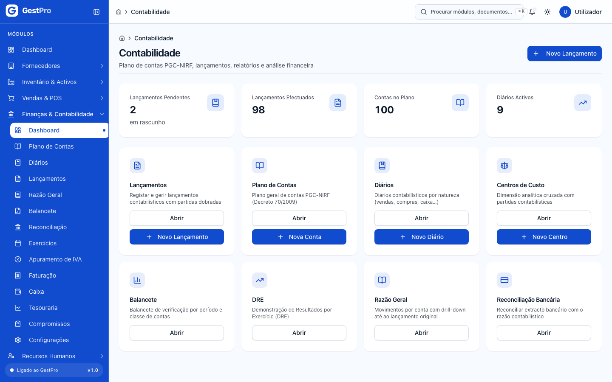

## Tarefas

### Como consultar e manter o plano de contas

**Antes de começar:** criar ou editar contas exige a permissão de escrita no plano de contas (Administrador e Financeiro). Consultar está aberto a todos os perfis.

1. Abra **Finanças & Contabilidade › Plano de Contas**. A lista mostra Código, Nome, Classe, Tipo, Natureza, Lançamentos (Sim/Não) e Estado. Pode filtrar por **Classe** e **Tipo**.
2. Clique numa conta para ver o detalhe: identificação, **Movimento do exercício** (Débitos, Créditos, Saldo devedor/credor, Movimentos) e **Hierarquia** (conta mãe e sub-contas). Numa conta de movimento, **Ver razão** abre o Razão Geral dessa conta no exercício corrente.
3. Para criar uma conta, clique **Nova Conta** e preencha:
   - **Identificação:** Código, Nível (1 a 4), Nome.
   - **Classificação:** Classe, Tipo, Natureza (Devedora/Credora), Conta Mãe (opcional) e **Aceita Lançamentos** (só as contas de movimento, as «folhas», devem ter este interruptor ligado).
   - **Conta Mãe** pesquisa no servidor por código ou nome; **Nenhuma (conta raiz)** deixa a conta sem mãe. Ao editar uma conta, a lista não oferece a própria conta nem as suas sub-contas (a qualquer nível), porque isso criaria um ciclo na hierarquia.
   - Descrição (opcional).
4. Clique **Guardar Conta**.

**Resultado:** a mensagem «Conta criada.» (ou «Conta actualizada.») e a conta passa a aparecer na lista.

**Regras que o sistema impõe:**
- Numa conta que já tem lançamentos, o **código, a classe, o tipo, a natureza, o nível e a conta mãe ficam bloqueados** — alterá-los mudaria o significado de documentos já emitidos. Só o nome e a descrição mudam. Para reclassificar, crie uma conta nova e desactive a antiga.
- **Desactivar** (no detalhe da conta) só é possível numa conta **sem** lançamentos. Uma conta com histórico fica; o que se faz é deixar de lançar nela.

**Natureza das contas do plano entregue:** a classe 6 (gastos) é devedora e a classe 7 (rendimentos) credora. Na
classe 4 a natureza é definida conta a conta: são **credoras**, por exemplo, 421 Fornecedores c/c, 44331 IVA
liquidado e as contas 42x (excepto 429), 43x, 46x, 47x e 48x; as restantes, como 411 Clientes c/c,
são **devedoras**. É a natureza que decide de que lado aparece o saldo no balancete.

> **Atenção:** os códigos do plano entregue não levam pontos (ex.: `111`, `44331`), apesar de o formulário sugerir o formato «1.1.1». Use o formato sem pontos, como no resto do plano. As designações de classe no formulário também diferem das do plano (no plano, a classe 2 é «Inventários e activos biológicos», a 3 «Investimentos de capital» e a 4 «Contas a receber, contas a pagar, acréscimos e diferimentos»); escolha a classe pelo primeiro algarismo do código.

<!-- captura: 05-contabilidade/plano-contas.png | /contabilidade/plano-contas -->
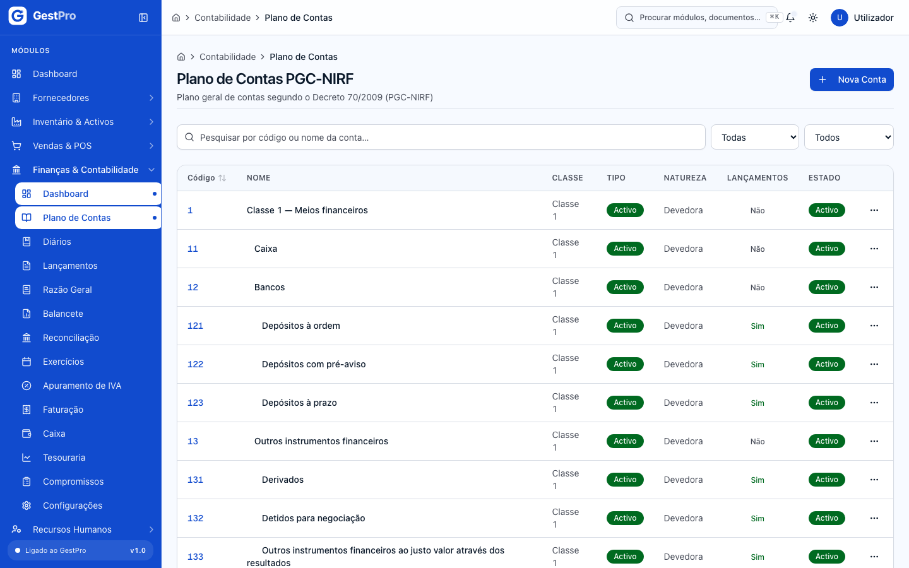

### Como criar ou editar um diário

**Antes de começar:** permissão de escrita em diários (Administrador, Financeiro, Gestor). Cada empresa já recebe nove diários: VD Vendas, CP Compras, CX Caixa, BN Banco, OP Operações, SL Salários, AB Abertura, EN Encerramento e OT Outros. O diário **EN** é reservado aos lançamentos gerados pelo encerramento e não aparece no formulário; no **AB** só se lança à mão no primeiro exercício da empresa (saldos iniciais) — nos seguintes, a abertura é gerada pelo encerramento do anterior.

1. Abra **Diários** e clique **Novo Diário** (ou abra um diário e clique **Editar**).
2. Preencha **Código** (máximo 10 caracteres), **Natureza** e **Nome**.
3. Deixe **Activo** ligado. Um diário inactivo deixa de estar disponível para novos lançamentos.
4. Clique **Guardar Diário**.

**Resultado:** «Diário criado.» No detalhe do diário, **Ver lançamentos** mostra os lançamentos desse diário.

### Como criar um lançamento manual

**Antes de começar:**
- Permissão de criar lançamentos (Administrador, Financeiro, Gestor).
- O período da data que vai usar tem de estar **Aberto** (veja em **Exercícios**).

1. Abra **Lançamentos** e clique **Novo Lançamento**.
2. Em **Informações Gerais**, preencha **Data do Lançamento**, **Diário**, **Histórico** (a descrição que identifica o lançamento no razão) e, se quiser, **Observações**.
3. Em **Partidas (Débito = Crédito)**, para cada linha escolha a **Conta**, o **Tipo** (**D — Débito** ou **C — Crédito**), o **Valor (MZN)** e, opcionalmente, o histórico da partida. Use **Adicionar Partida** para mais linhas; são precisas pelo menos duas.
4. Confira o quadro de totais: tem de aparecer **Lançamento equilibrado**. Enquanto aparecer **Diferença (bloqueia submissão)**, o lançamento não é aceite.
5. Clique **Guardar Lançamento**.

**Resultado:** «Lançamento criado com sucesso!». O lançamento fica em **Rascunho**, com número atribuído no diário e período correspondentes. **Ainda não conta** no balancete, no razão nem na DRE — é preciso confirmá-lo.

> **Dica:** o campo **Conta** de cada partida pesquisa no servidor: escreva parte do código ou do nome (ex.: «6981» ou «bancários»). Aparecem todas as contas de movimento activas, de qualquer classe.

<!-- captura: 05-contabilidade/lancamento-novo.png | /contabilidade/lancamentos/novo -->
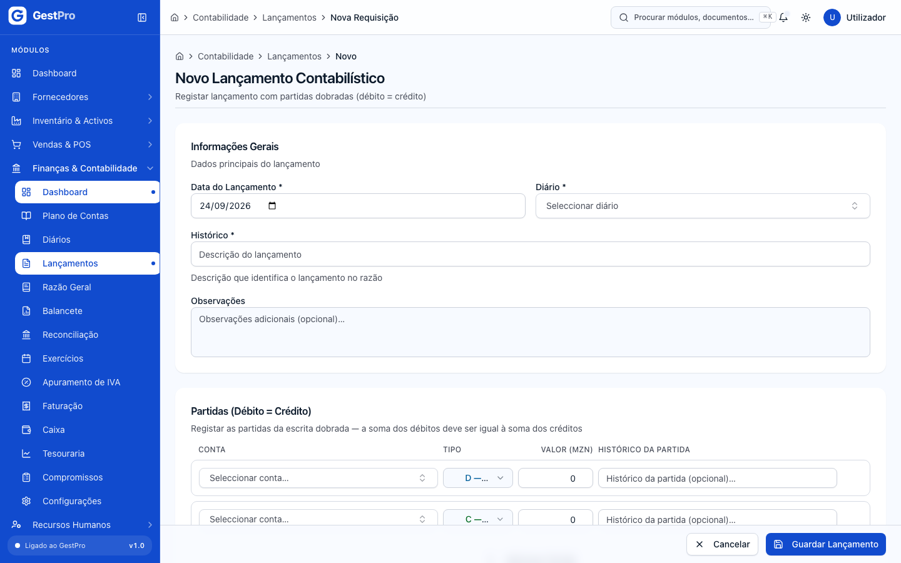

### Como confirmar (lançar) um lançamento

**Antes de começar:** permissão de confirmar lançamentos (Administrador, Financeiro, Gestor).

1. Em **Lançamentos**, filtre por **Estado: Rascunho**.
2. Abra o lançamento e clique **Confirmar** (ou, na lista, menu **⋯ › Confirmar**).
3. Leia o aviso — «Depois de lançado fica imutável… Correcções posteriores fazem-se por estorno, nunca por alteração.» — e clique **Confirmar**.

**Resultado:** «Lançamento confirmado.» O estado passa a **Lançado** e o lançamento entra no balancete, no razão, na DRE e no apuramento do IVA.

> **Nota:** um rascunho errado não precisa de ser confirmado e estornado: corrija-o ou anule-o enquanto
> ainda é rascunho (ver a tarefa seguinte).

### Como corrigir ou anular um rascunho

**Antes de começar:** permissão «Criar e editar lançamentos» (Administrador, Financeiro, Gestor). Só um
lançamento em **Rascunho** se edita ou anula; depois de confirmado, a correcção faz-se por estorno.

**Corrigir**
1. Abra o lançamento em **Lançamentos** e clique **Editar**.
2. Altere o **Histórico**, as **Observações**, a **Data** (dentro do mesmo período, que tem de estar
   **Aberto**) e as **Partidas**. O **diário** e o **número** não mudam — o número pertence à série do diário.
3. Confira **Lançamento equilibrado** e grave.

**Resultado:** «Lançamento actualizado.» O lançamento continua em **Rascunho**, pronto a confirmar.

**Anular**
1. No detalhe do rascunho, clique **Anular**.
2. Escreva o **Motivo** (pelo menos 3 caracteres; por exemplo «lançado em duplicado — o correcto é o 000012»).
3. Clique **Anular lançamento**.

**Resultado:** «Lançamento ‹número› anulado.» O lançamento passa a **Anulado**, sai da lista por omissão
(use o filtro **Estado: Anulado** para o ver) e deixa de impedir o fecho do período. **Não se recupera**: se
precisar do movimento, crie um lançamento novo.

<!-- captura: 05-contabilidade/lancamentos.png | /contabilidade/lancamentos -->
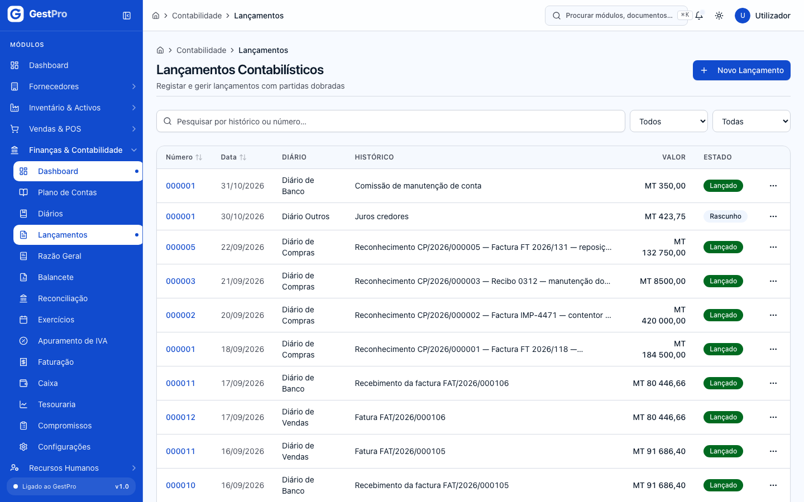

### Como estornar um lançamento

Um lançamento **Lançado** nunca se edita. Para o anular, estorna-se.

**Antes de começar:** permissão de estornar (Administrador e Financeiro). O período da **data do estorno** tem de estar aberto.

1. Abra o lançamento e clique **Estornar** (ou, na lista, **⋯ › Estornar**).
2. Indique a **Data do estorno** (por omissão, hoje). Esta data determina o período fiscal onde o contra-lançamento entra — pode ser um mês diferente do original.
3. Escreva o **Motivo** (obrigatório). Fica registado no contra-lançamento.
4. Clique **Estornar lançamento**.

**Resultado:** «Lançamento N estornado.» É criado um novo lançamento, já **Lançado**, com as partidas invertidas e o histórico «ESTORNO: …». O original passa a **Estornado** e mantém-se visível. No detalhe de cada um aparece a ligação ao outro («Estornado por …» / «Este é o estorno de …»). Um lançamento só se estorna uma vez.

**Efeitos noutros módulos:** estornar um lançamento criado por uma factura não anula a factura — isso faz-se em [Faturação](06-faturacao-caixa-tesouraria.md).

<!-- captura: 05-contabilidade/lancamento-detalhe.png | /contabilidade/lancamentos >primeiro -->
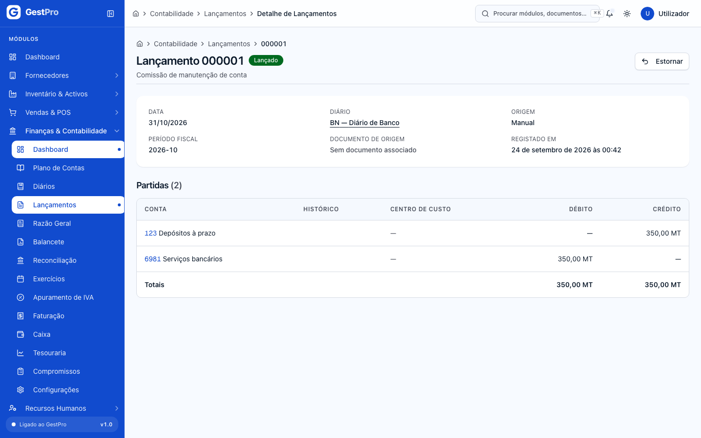

### Como consultar o Razão Geral de uma conta

1. Abra **Razão Geral**.
2. Escolha a **Conta** (só aparecem contas de movimento).
3. Escolha o modo de filtragem:
   - **Por datas**: preencha **De** e **Até** com datas no formato `aaaa-mm-dd`.
   - **Por períodos**: escolha o **Exercício** (código do ano, ex.: «2026»), o **Do período** e o **Ao período** (1–12; marque **Incluir período 13** para incluir o período de encerramento).
4. Clique **Consultar**.

**Resultado:** a tabela com Data, Histórico, Débito, Crédito e **Saldo Acum.**, enquadrada pela linha **Saldo anterior** (saldo da conta antes do intervalo) e pela linha **Saldo final** (soma do saldo anterior com o movimento do intervalo). Os totais de Débito e Crédito do período também aparecem na linha do Saldo final.

Só contam lançamentos **Lançados** e **Estornados** (os rascunhos ficam de fora; um lançamento estornado e o seu estorno aparecem os dois e anulam-se).

**Drill-down a partir do Balancete.** Ao clicar no código de uma conta de movimento no Balancete de Verificação, abre o Razão Geral dessa conta no mesmo exercício e intervalo de períodos — sem conversão para datas livres.

> **Nota:** no modo «Por períodos», o «Saldo anterior» inclui os movimentos dos períodos anteriores do mesmo exercício e, em contas de balanço (classes 1–5 e 8) sem lançamento de abertura, também os saldos dos exercícios anteriores. No modo «Por datas», o «Saldo anterior» inclui todos os lançamentos com data anterior à data «De».

### Como gerar o Balancete

1. Abra **Balancete**. Por omissão, mostra o exercício corrente, do período 01 ao período do mês actual.
2. Escolha o **Exercício**, o **Período inicial** e o **Período final**. Marque **Incluir período 13 (encerramento)** se quiser ver também o período do encerramento. Clique **Aplicar**.

**Resultado:** o quadro do «Exercício aaaa — períodos 01..mm», com Conta e Descrição, três pares de colunas e a linha **Totais**:

| Colunas | O que mostram |
|---|---|
| **Movimento do período** (Débito, Crédito) | Os lançamentos dos períodos escolhidos, do inicial ao final. Conta o período a que o lançamento pertence, não a data — é assim que o período 13 se distingue do 12. |
| **Acumulado** (Débito, Crédito) | Os lançamentos desde o período 01 do exercício até ao período final, mais a abertura. |
| **Saldo** (Devedor, Credor) | Acumulado a débito menos acumulado a crédito, mostrado do lado onde cai — nunca negativo. Uma conta com saldo **contra natureza** (por exemplo, Caixa credora) aparece assinalada a cor de aviso; não é um erro. |

Só contam lançamentos **Lançados** e **Estornados**. Por omissão, contas sem movimento nem acumulado não aparecem.

As contas aparecem em hierarquia: cada conta-mãe soma as suas sub-contas, com um subtotal por classe. Os restantes
campos do formulário afinam o que se vê e são aplicados com **Aplicar**:

| Campo | O que faz |
|---|---|
| **Grau máximo** | Até que nível de conta mostrar (**Todos** ou 1 a 7). |
| **Ver apenas contas de razão** | Mostra só as contas de nível 2. |
| **Conta inicial** · **Conta final** | Limita o quadro a um intervalo de códigos. |
| **Classe** | Uma só classe (ou **Todas**). |
| **Apresentação** | **Por período e acumulado**, **Por período** ou **Acumulado**. |
| **Excluir contas** | Códigos a retirar, separados por vírgulas (ex.: `121, 6112`). |
| **Pesquisar** | Código ou nome. |
| **Ver contas sem movimento e saldo** · **Ver apenas contas com saldo** | Inclui as contas a zero, ou mostra só as que têm saldo. |

Estes filtros mudam só o que se vê: a linha **Totais** e o indicador de equilíbrio são sempre os do balancete
completo. **Exportar CSV**, **Exportar Excel** e **Exportar PDF** descarregam o balancete tal como está a ser
mostrado.

Por baixo do quadro, o indicador **Balancete equilibrado** verifica três igualdades: **Movimento** (débitos = créditos do período), **Acumulado** (débitos = créditos acumulados) e **Saldos** (soma dos devedores = soma dos credores). Se alguma falhar, aparece **Balancete desequilibrado** com a igualdade em falta marcada — há lançamentos desequilibrados, e o período não fecha.

**Abertura implícita.** Enquanto o exercício não tiver lançamento de abertura (diário `AB`), o balancete calcula-a, sem gravar nada: os saldos das classes 1–5 e 8 de antes do exercício entram no acumulado conta a conta, e o resultado das classes 6 e 7 dos anos anteriores entra numa linha em itálico, **«Resultados de exercícios anteriores por encerrar» (implícita)**, com um aviso de que há exercícios anteriores por encerrar. Sempre que há abertura implícita — mesmo sem a linha sintética — aparece por baixo do quadro a nota «Este balancete inclui abertura implícita…». Quando o exercício tiver o lançamento de abertura, deixa de haver abertura implícita. Os termos estão definidos no [glossário](../../CONTEXT.md#balancete-de-verificação) e a decisão no [ADR-0040](../decisions/ADR-0040-balancete-verificacao-phc.md).

> **Nota:** o balancete já não se escolhe por datas livres (para isso use o **Razão Geral**).

> **Nota:** a imagem abaixo é uma captura anterior do ecrã do Balancete: pode ainda mostrar o botão «registar» do antigo protótipo, que foi retirado, e não reflectir todos os campos e colunas descritos acima. Vale o texto desta secção.

<!-- captura: 05-contabilidade/balancete.png | /contabilidade/balancete -->
<!-- recaptura pendente (#301): a imagem é anterior ao ecrã actual (ADR-0040, sem o botão do protótipo retirado pela #282). Recapturar com a ferramenta de capturas acordada; não substituir à mão. -->
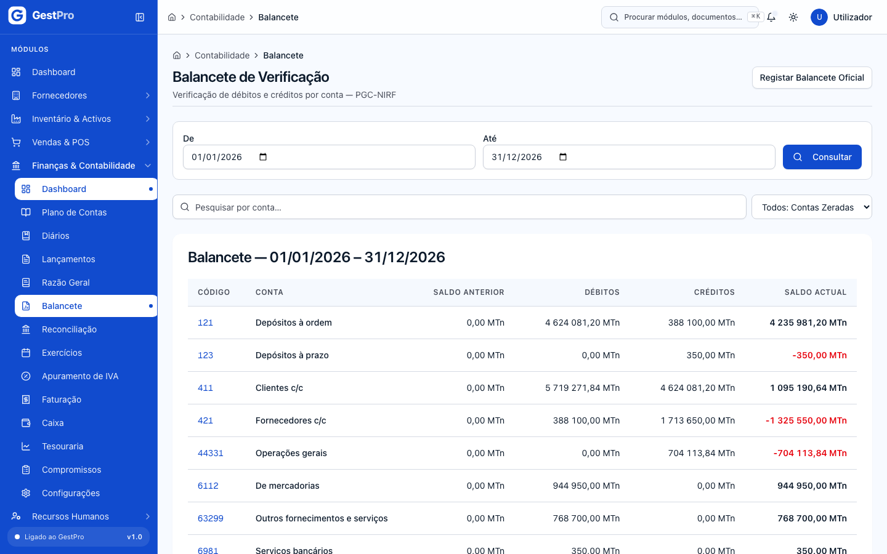

### Como abrir um exercício manualmente

Normalmente não é preciso: o exercício do ano seguinte abre sozinho (ver Configurações).

**Antes de começar:** permissão de abrir exercício (só o Administrador).

1. Abra **Exercícios** e clique **Abrir exercício**.
2. Indique o **Ano** e clique **Abrir exercício**.

**Resultado:** «Exercício 2027 aberto. N série(s) de documento criadas.» São criados o exercício, os 13 períodos (todos **Aberto**) e as séries de numeração dos documentos desse ano. Se o exercício já existia, a mensagem é «Exercício 2027 já existia — operação idempotente.» e nada muda.

### Como fechar um período (mês)

Fechar um período tranca-o: a partir daí, nenhum lançamento — manual ou vindo de outro módulo — pode entrar com data nesse mês.

**Antes de começar:**
- Permissão de fechar período (Administrador e Financeiro).
- A ordem recomendada do fecho mensal é: conferir documentos → confirmar rascunhos → reconciliar bancos → **apurar o IVA** → **fechar o período** → declarar o IVA à AT.

1. Abra **Exercícios**. Cada exercício mostra a grelha dos 13 períodos com Período, Código, Início, Fim, Estado, Fechado em e Acções.
2. Na linha do período, clique **Fechar período**.
3. Se tudo estiver em ordem, aparece «Período fechado» e o estado passa a **Fechado**.
4. Se não, aparece um quadro «N impedimentos para fechar» com **todos** os impedimentos de uma só vez. Resolva-os e tente de novo.

**O que impede o fecho de um período** (o sistema verifica todos e mostra-os juntos):

| Impedimento (mensagem mostrada) | O que significa | Como resolver |
|---|---|---|
| Existem lançamentos em rascunho no período. | Há lançamentos por confirmar com data nesse mês. | Em **Lançamentos**, filtre por **Rascunho** e confirme-os ou, se estiverem errados, corrija-os ou anule-os ([Como corrigir ou anular um rascunho](#como-corrigir-ou-anular-um-rascunho)). |
| Existe pelo menos uma sessão de caixa aberta com abertura neste período. | Uma sessão de caixa aberta nesse mês ainda não foi fechada. | Feche a sessão em **Caixa** ou, se foi aberta por engano e não tem movimentos, cancele-a ([capítulo 6](06-faturacao-caixa-tesouraria.md#caixa)). |
| Existe uma reconciliação bancária em curso que abrange datas deste período. | Há um período de reconciliação bancária **Aberto** ou **Em reconciliação** cujas datas tocam este mês. | Em **Reconciliação**, feche ou cancele esse período de reconciliação. |
| Existem facturas, notas de crédito ou notas de débito emitidas neste período sem o lançamento contabilístico correspondente. | Um documento fiscal emitido no mês não gerou o seu lançamento. | Não é situação normal e não se resolve com um lançamento manual (o documento continua sem ligação). Contacte o suporte. |
| O balancete do período não está equilibrado — o total dos débitos é diferente do total dos créditos. | A soma dos débitos dos lançamentos do mês difere da soma dos créditos. | Veja o **Balancete** do mês e corrija com estornos. |
| O período anterior ainda está aberto. | Os períodos fecham por ordem. | Feche primeiro o mês anterior. |
| O apuramento do IVA do período ainda não foi executado. | O mês não tem apuramento de IVA **Apurado** ou **Declarado à AT**. | Apure o IVA em **Apuramento de IVA** (mesmo que o resultado seja zero). |

**Efeitos noutros módulos:** com o período fechado, é recusada qualquer operação que gere lançamento com data nesse mês — emitir facturas, notas de crédito ou de débito, criar ou pagar contas a pagar, registar recepções de compras, processar salários, estornar.

> **Nota:** o **Período 13** (encerramento) não tem IVA a apurar e só verifica três impedimentos: rascunhos no período, balancete desequilibrado e período anterior (Dezembro) ainda aberto. Normalmente não se fecha à mão: fecha-o o encerramento do exercício.

<!-- captura: 05-contabilidade/exercicios.png | /contabilidade/exercicios -->
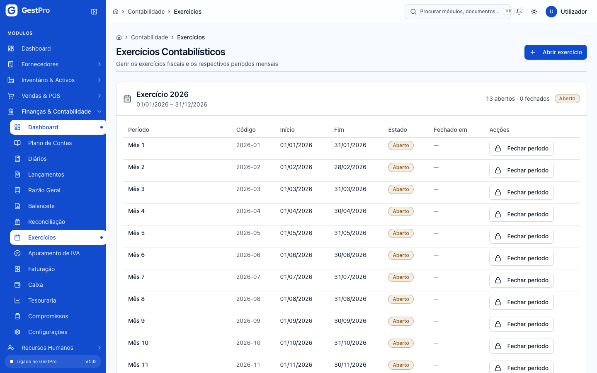

### Como reabrir um período fechado

Reabrir é possível, mas é uma operação excepcional, com motivo e registo.

**Antes de começar:**
- Permissão de reabrir período — por omissão só o **Administrador** a tem (nem o Financeiro nem o Gestor).
- **Não é possível** reabrir um período cujo IVA já foi marcado como **Declarado à AT**. Nesse caso, a correcção faz-se por regularização no período seguinte (contas 44341/44342).

1. Em **Exercícios**, na linha do período **Fechado**, clique **Reabrir**.
2. Escreva o **Motivo (mínimo 10 caracteres)** — fica gravado no trilho de auditoria.
3. Clique **Reabrir período**.

**Resultado:** «Período 2026-03 reaberto com sucesso». O período volta a **Aberto** e aceita lançamentos. O apuramento de IVA existente mantém-se; se precisar de o refazer, estorne-o em **Apuramento de IVA**.

### Como apurar o IVA de um período

> **Atenção — conformidade legal por confirmar:** o apuramento segue as alterações ao Código do IVA da Lei n.º 10/2025 (taxa normal de 16 %, taxa reduzida de 5 %, fim dos regimes especiais a partir de Janeiro de 2026), mas esta leitura assenta em análises de consultoras e **ainda não foi confirmada contra o texto publicado no Boletim da República nem junto da AT**. A regra de apuramento continua em validação. Confira os valores com o seu contabilista certificado antes de entregar a declaração.

**Antes de começar:**
- Permissão de apurar IVA (Administrador, Financeiro, Gestor).
- O período tem de estar **Aberto**, sem rascunhos, e todos os documentos fiscais do mês com lançamento.
- A partir de Janeiro de 2026, o produto **recusa apurar** um mês em que alguma factura, nota de débito ou nota de crédito emitida tenha linhas a uma taxa diferente de 16 % — **incluindo linhas isentas, a 0 %** — porque nesses casos a dedução do IVA depende do pro rata, cujo cálculo não está implementado. As compras sem IVA não contam para esta regra.

1. Abra **Apuramento de IVA**. Para cada exercício aparece a lista de períodos com Período, Intervalo, Estado período, Apuramento IVA (**Não apurado**, **Apurado**, **Declarado à AT**) e Acção.
2. Na linha do mês, clique **Apurar**.
3. Leia o que o apuramento vai fazer e clique **Apurar IVA do período 2026-03**.

**Resultado:** «IVA apurado com sucesso para o período 2026-03». O sistema:
- lê os saldos das contas de IVA (4432x dedutível, 4433x liquidado, 4434x regularizações) nesse mês;
- gera um lançamento **Lançado** no diário de Operações, com data do último dia do mês e histórico «Apuramento IVA 2026-03», que salda essas contas contra 4435 e passa o resultado para **4437 IVA a pagar** ou **4438 IVA a recuperar** (o crédito de meses anteriores em 4438 é trazido de volta ao apuramento);
- grava as linhas do apuramento para os mapas.

No detalhe (**Ver detalhe**) aparecem os totais **IVA Liquidado**, **IVA Dedutível**, **Regularizações**, **Crédito Reportado** e **IVA a Pagar** ou **IVA a Recuperar**, e as **Linhas do apuramento** (Conta, Nome (à data), Tipo, Base imponível, Taxa, Imposto, Divergência). Se houver divergências entre base × taxa e o imposto do razão, surge o aviso «Existem divergências nas linhas acima» — confirme a origem antes de declarar.

Se o apuramento for recusado, o ecrã mostra o motivo (ver [Erros frequentes](#erros-frequentes)); quando há documentos sem lançamento, lista-os pelo número.

<!-- captura: 05-contabilidade/iva.png | /contabilidade/iva -->
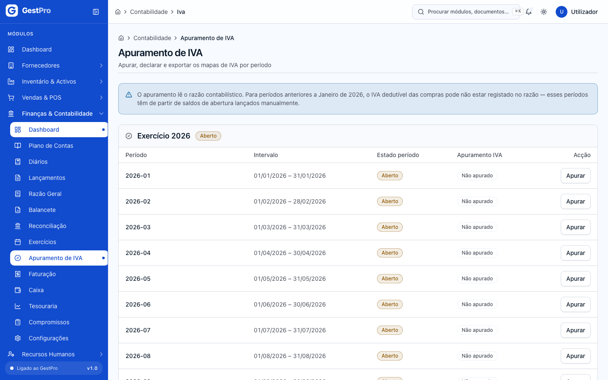

### Como descarregar os mapas de IVA

1. No detalhe do apuramento, em **Mapas de suporte**, clique no mapa pretendido:
   - **Suporte Declaração Periódica** — Modelo A — base e imposto por taxa;
   - **Mapa de Clientes** — por documento, NUIT e imposto liquidado;
   - **Mapa de Fornecedores** — por documento, NUIT e imposto dedutível;
   - **Antiguidade do Crédito** — crédito em 4438 por período de origem.

**Resultado:** é descarregado um ficheiro CSV. Os mapas saem das linhas gravadas no apuramento, não de um recálculo: um mapa pedido anos depois devolve os mesmos números. Todos os perfis, incluindo Leitura, podem descarregá-los.

### Como corrigir um apuramento de IVA (estornar)

Só enquanto **não** estiver declarado à AT.

**Antes de começar:** permissão de apurar IVA (Administrador, Financeiro, Gestor). O período tem de estar **Aberto** (se estiver fechado, peça primeiro a reabertura).

1. No detalhe do apuramento, clique **Estornar**.
2. Escreva o **Motivo (mínimo 10 caracteres)** e clique **Estornar apuramento**.

**Resultado:** o lançamento do apuramento é estornado **com data no último dia do mesmo período** e o apuramento fica **Estornado**. Pode então corrigir o que faltava e voltar a **Apurar** — nasce uma nova versão (v2, v3…). As versões anteriores ficam no histórico.

### Como marcar o IVA como declarado à AT

**Antes de começar:** permissão de declarar IVA (Administrador e Financeiro). Faça-o depois de entregar a declaração.

1. No detalhe de um apuramento **Apurado**, clique **Marcar declarado**.
2. Indique a **Data de entrega à AT** e a **Referência da entrega** (número de referência ou recibo da AT).
3. Clique **Confirmar declaração**.

**Resultado:** «Apuramento marcado como declarado à AT». O estado passa a **Declarado à AT**. **É irreversível:** o apuramento deixa de poder ser estornado e o período deixa de poder ser reaberto. Qualquer correcção posterior faz-se por regularização (contas 44341/44342) num período seguinte.

### Como reconciliar uma conta bancária

A reconciliação compara, conta a conta, os movimentos do extracto do banco com os lançamentos da conta PGC ligada a esse banco.

**Antes de começar:**
- Permissão de reconciliar (Administrador, Financeiro, Gestor).
- A conta bancária tem de estar criada e **activa** em **Contas Bancárias** (no menu, ou pelo botão no topo do ecrã de Reconciliação — ver [Como criar, desactivar ou reactivar uma conta bancária](#como-criar-desactivar-ou-reactivar-uma-conta-bancária)) e ligada à **sua própria** subconta PGC. As contas inactivas não aparecem na Reconciliação. Se duas contas bancárias activas partilharem a mesma conta PGC, aparece o aviso «Conta contabilística partilhada» e a reconciliação fica bloqueada.
- Tenha o extracto do banco em **CSV ou XLSX, até 5 MB**, com as colunas data, descrição e valor (opcionais: referência, tipo D/C, data-valor, saldo). Sem coluna de tipo, o sinal do valor decide se é entrada ou saída.

**1. Abrir um período de reconciliação**
1. Em **Reconciliação**, clique na conta bancária. O cabeçalho mostra o banco e a conta PGC.
2. Clique **Abrir período**. Indique **Início** e **Fim**, e os saldos **Saldo inicial** e **Saldo final** tal como o extracto os declara. Clique **Abrir período**.
   Só pode haver um período em aberto por conta, e não pode sobrepor-se a um já reconciliado.

**2. Importar o extracto**
1. Clique **Importar extracto**, escolha o ficheiro em **Extracto** e clique **Importar e reconciliar**.
2. Se alguma linha tiver erro, **nada é importado** e o ecrã lista todas as linhas com erro. Corrija o ficheiro e repita.

Reimportar o mesmo ficheiro, ou um extracto que se sobreponha a outro, não duplica movimentos.

**3. Executar o motor de correspondência**
A importação já corre o motor. Pode voltar a corrê-lo a qualquer momento com **Executar reconciliação** (por exemplo, depois de confirmar lançamentos novos). O motor procura pares entre banco e contabilidade por esta ordem: referência exacta, referência normalizada, documento, valor + natureza + data, valor dentro da tolerância, e descrição. Por omissão, **não confirma nada sozinho**: tudo o que encontra fica como sugestão.

**4. Tratar o resultado, vista a vista**

O ecrã da conta tem os indicadores **Excepções**, **Sugestões**, **Em trânsito** e **Reconciliados**, e as vistas:

- **Sugestões** — pares propostos pelo motor, com **Regra · confiança** e **Diferença**. Escolha os que aceita (ou **Todas nesta página**) e clique **Confirmar N**. Se algum tiver diferença de valor acima da tolerância, é pedida uma **Justificação** (mínimo 10 caracteres). **Rejeitar** liberta os dois movimentos e o motor não volta a propor esse par.
- **Excepções** — movimentos que precisam de decisão: **Banco sem contabilização**, **Contabilidade sem banco**, **Diferença de valor**, **Divergência**. Aqui pode:
  - **Contabilizar** (num movimento do banco sem lançamento): abre o formulário **Novo Lançamento** já preenchido com a data, o histórico e as partidas sugeridas (por exemplo, comissões e encargos bancários vão para a conta 6981 Serviços bancários). Se nenhuma regra se aplicar, aparece «Nenhuma regra de sugestão se aplica: escolha a conta de contrapartida.» Reveja, grave, **confirme o lançamento** (ver acima) e volte a **Executar reconciliação**.
  - **Reconciliar manualmente**: marque um ou mais movimentos de cada lado (**Extracto bancário** e **Contabilidade**), clique **Reconciliar manualmente (x + y)**, confira os totais e a diferença, escreva a **Justificação** (obrigatória, mínimo 10 caracteres) e confirme.
  - **Ignorar**: retira o movimento das excepções.
- **Em trânsito e pendentes** — lançamentos que ainda aguardam o banco (dentro da tolerância de dias, 5 por omissão) ou por classificar. Um movimento em trânsito continua a ser procurado nos extractos seguintes, mesmo depois de o período fechar.
- **Reconciliados** — **Reverter** desfaz uma reconciliação (os movimentos voltam a pendentes; fica o registo). Não é possível num período já fechado.
- **Ignorados** — **Reactivar** devolve o movimento às pendentes.

**5. Fechar o período de reconciliação**
1. Clique **Período em curso**. O ecrã mostra **Saldo reconciliado**, **Saldo contabilístico**, **Diferença residual** e o **Mapa de fecho** (saldo inicial e final do extracto, movimentos do período, valores em trânsito, bancários por contabilizar, diferenças aceites, diferença de abertura, saldo final da contabilidade, saldo reconciliado).
2. Clique **Fechar período** e confirme. Se a diferença residual não for zero, tem de escrever a **Justificação da diferença residual**.

**Resultado:** «Período reconciliado e fechado.» O mapa fica gravado tal como estava e as reconciliações deste período deixam de poder ser revertidas. Pode exportar o mapa em **XLSX** ou **CSV**. Em alternativa, **Cancelar período** anula-o sem afectar os movimentos (um período cancelado não se reabre: abre-se outro).

**Efeitos noutros módulos:** um período de reconciliação **Aberto** ou **Em reconciliação** impede o fecho do período contabilístico dos meses que abrange.

<!-- captura: 05-contabilidade/reconciliacao.png | /contabilidade/reconciliacao -->
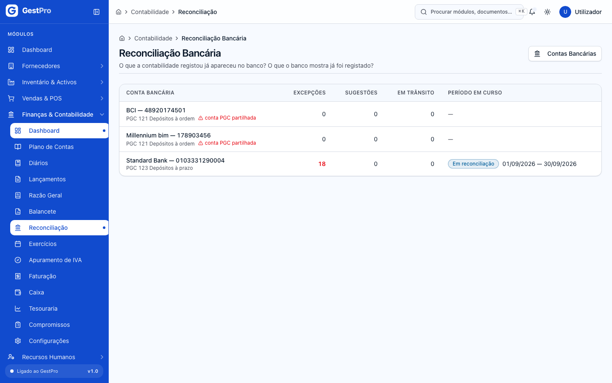

<!-- captura: 05-contabilidade/reconciliacao-conta.png | /contabilidade/reconciliacao >primeiro -->
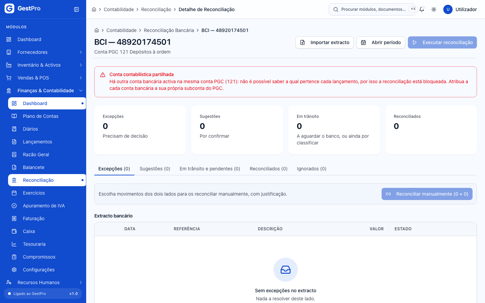

### Como configurar as regras de sugestão e as tolerâncias da reconciliação

**Regras de sugestão** — dizem ao **Contabilizar** qual a conta de contrapartida a propor para um movimento
do banco sem lançamento. Cada empresa nasce com uma regra para comissões, encargos, taxas, imposto de selo e
manutenção (conta 6981). Só sugerem: lançar é sempre um acto do utilizador.

**Antes de começar:** permissão de reconciliar (Administrador, Financeiro, Gestor).

1. Em **Reconciliação**, clique **Regras de sugestão** e depois **Nova regra**.
2. Preencha:
   - **Padrão** — palavras da descrição do extracto, separadas por `|` (ex.: `COMISSAO|ENCARGO|TAXA`);
   - **Movimento** — **Entrada** ou **Saída** (saída = dinheiro que sai da conta);
   - **Conta bancária** — uma conta concreta ou todas;
   - **Conta de contrapartida** — conta PGC activa que aceite lançamentos, diferente das contas dos bancos;
   - **Prioridade** e, opcionalmente, **Descrição** (ex.: «Comissões bancárias»).
3. Clique **Guardar**. Aparece «Regra criada.»

Uma regra não se elimina: **Desactivar** tira-a das sugestões (as já aceites não mudam) e **Activar** devolve-a.

**Tolerâncias da conta** — em **Contas Bancárias**, clique na conta (abre o ecrã de edição) e use a secção
**Reconciliação**:

| Campo | O que faz | Omissão |
|---|---|---|
| Tolerância de dias | Diferença máxima entre a data contabilística e a do extracto (0 a 60) | 5 |
| Tolerância de valor | Diferença aceite sem justificação; 0 = qualquer diferença impede o par automático | 0,00 |
| Correspondência por referência / por valor / por descrição | Que critérios o motor usa para propor pares | Sim / Sim / Não |
| Reconciliação automática | Confirma sozinhas as sugestões acima do **Limiar de confiança** | Não |
| Limiar de confiança | Confiança mínima (50 a 100) para a reconciliação automática | 90 |
| Permitir agregação · Máximo de movimentos agregados | Propor pares de vários movimentos para um (3 a 20, contando os dois lados) | Não · 5 |

Os valores aplicam-se na próxima **Executar reconciliação**.

### Como criar, desactivar ou reactivar uma conta bancária

As contas bancárias (e as carteiras móveis M-Pesa e e-Mola) são as que aparecem nos pagamentos, nos meios de
pagamento do POS, na reconciliação e no saldo da Tesouraria.

**Antes de começar:** consultar exige a permissão de leitura de contas bancárias (todos os perfis de sistema);
criar, editar, desactivar e reactivar, a de escrita (Administrador, Gestor e Financeiro). A conta PGC a ligar tem de existir: uma subconta de movimento da classe 1, só desta conta
bancária.

**Criar**
1. Abra **Finanças & Contabilidade › Contas Bancárias** e clique **Nova Conta Bancária**.
2. Em **Identificação**, preencha **Banco**, **Agência**, **Número de Conta**, **Tipo de Conta** (**Corrente**,
   **Poupança**, **Depósito a prazo** ou **Carteira móvel (M-Pesa, e-Mola)**) e **Moeda** (ex.: MZN).
3. Em **Ligação Contabilística**, escolha a **Conta PGC**.
4. Se quiser, ajuste a secção **Reconciliação** (ver a tarefa anterior) e clique **Guardar**.

**Resultado:** «Conta bancária criada.» A conta aparece na lista com o estado **Activo**. O saldo não se escreve: é
lido do razão da conta PGC.

**Desactivar ou reactivar**
1. Na lista, clique na conta (abre o ecrã de edição).
2. Clique **Desactivar…** (ou **Reactivar…**, numa conta inactiva) e confirme em **Desactivar conta** (ou
   **Reactivar conta**).

**Resultado:** «Conta «‹banco› — ‹número›» desactivada.» (ou «reactivada.»). Uma conta **Inactiva** deixa de ser
oferecida nos pagamentos (facturas, contas a pagar, salários, notas de crédito), sai da lista da reconciliação
bancária e do saldo de abertura da Tesouraria. O histórico mantém-se e a mudança fica no trilho de auditoria.

> **Atenção:** se a conta estiver escolhida em **Meios de pagamento do POS**, a confirmação avisa: «Atenção: esta
> conta está configurada no POS para …». A configuração **não muda sozinha** e as vendas com esse meio continuam a
> debitar a conta contabilística dela. Para o evitar, escolha outra conta em
> [Meios de pagamento do POS](#como-configurar-as-contas-dos-meios-de-pagamento-do-pos), onde a conta inactiva
> aparece marcada «(inactiva)».

### Como consultar o Balanço

1. Abra **Balanço** (`/contabilidade/balanco`).
2. Escolha o **Exercício** e **Até ao período** (01 a 12, ou **13 — Encerramento**). Por omissão: o período 13 se o exercício estiver encerrado, senão o 12.
3. Leia os blocos **Activo**, **Capital próprio** e **Passivo**, cada um com o seu total. Antes do encerramento, o Capital próprio mostra a linha **Resultado do período (por apurar)**.
4. No fim, **Activo** e **Capital próprio + Passivo** têm de dar **Equilibrado**.
5. **Exportar PDF** descarrega `balanco-<ano>-p<período>.pdf`.

> **Nota:** é um balanço por classes de contas, para acompanhamento — não o modelo oficial de balanço. A **DRE** tem também o botão **Exportar PDF**, com as datas e o centro de custo escolhidos.

### Como encerrar o exercício (fim do ano)

Encerrar o exercício apura o resultado do ano e transporta os saldos para o ano seguinte. Faz-se em três passos, todos **só pelo Administrador**.

```
Aberto ──Encerrar──► Encerrado (Provisório) ──Encerrar definitivamente──► Encerrado
  ▲                          │
  └────────Reabrir───────────┘
```

O resultado aplica-se depois, já no exercício seguinte (passo 3).

**1. Encerramento provisório**

**Antes de começar:** os doze meses (Janeiro a Dezembro) fechados — o que já obriga a ter o IVA de cada mês apurado; o Período 13 aberto e sem rascunhos; o exercício anterior, se existir, já encerrado (os exercícios encerram por ordem).

1. Em **Exercícios**, no cartão do ano, clique **Encerrar exercício**.
2. Em **Estimativa do imposto**, escreva o imposto sobre o rendimento estimado (em MT; **0** se não houver).
3. Clique **Encerrar exercício**.

**Resultado:** «Exercício 2026 encerrado provisoriamente.» O sistema cria, no Período 13 e no diário EN, até três lançamentos (só os que têm valores): apuramento dos resultados (classes 6 e 7 saldadas contra 81/82 e transferidas para 83), estimativa do imposto (débito 851 / crédito 4411) e resultado líquido (para **88**). O Período 13 fica **Fechado**; se o exercício seguinte já existir, recebe a **abertura** (diário AB, 1 de Janeiro) com os saldos das classes 1 a 5 e 8. São arquivados os PDF do **Balanço**, da **DRE** e do **Balancete**, que ficam no cartão do exercício.

Se faltar alguma condição, aparece **Não é possível encerrar** com todos os impedimentos (meses abertos, exercício anterior por encerrar, rascunhos no Período 13, balancete desequilibrado…).

**Exemplo:** se no ano as contas de rendimentos (classe 7) somam 5 000 000,00 MT e as de gastos (classe 6) 4 200 000,00 MT, o resultado antes de imposto é **800 000,00**. Com uma estimativa de imposto de 256 000,00 (32 %, valor ilustrativo — confirme a taxa e a matéria colectável com o seu contabilista), a conta **88** fica com um resultado líquido credor de **544 000,00**.

**2. Corrigir depois do encerramento provisório — Reabrir exercício**

Se a auditoria pedir um ajuste, clique **Reabrir exercício**, escreva o **Motivo** (mínimo 10 caracteres) e confirme. Os lançamentos do encerramento e a abertura do ano seguinte são **estornados**; os doze meses continuam fechados — reabra o mês que precisar (cada um com o seu motivo), corrija e volte a encerrar. Não é possível reabrir se o ano seguinte já tiver meses fechados ou se o resultado já tiver sido aplicado (anule primeiro a aplicação).

**3. Aplicar o resultado (no exercício seguinte)**

Depois de os sócios aprovarem as contas, no cartão do exercício encerrado clique **Aplicar resultado**, indique a **Data da deliberação** (no ano seguinte, num mês aberto) e a **Referência da acta** (ex.: «Acta n.º 3/2027»). O sistema lança, no diário de Operações, o saldo de 88 para **59 Resultados transitados** (no exemplo: débito 88 / crédito 59 de 544 000,00). A distribuição (reservas, dividendos) faz-se depois, com lançamentos a partir de 59. Um engano corrige-se com **Anular aplicação** (com motivo).

**4. Encerramento definitivo**

Só depois de as contas aprovadas: **Encerrar definitivamente** › confirmar. **É irreversível** — o exercício não volta a abrir e nenhum dos seus períodos aceita lançamentos.

> **Atenção:** a separação entre 81 e 82 (resultados operacionais e financeiros) segue a regra do produto e aguarda validação do contabilista. Confira os lançamentos do encerramento no **Razão Geral** antes de encerrar em definitivo.

### Como configurar a abertura automática do exercício

**Antes de começar:** permissão de configuração financeira (Administrador, Financeiro, Gestor). Sem ela, a página mostra «Acesso não autorizado».

1. Abra **Configurações**.
2. Em **Calendário contabilístico**, ligue ou desligue **Abertura automática do exercício** e, se ligada, escolha o **Dia** (1–28) e o **Mês** (1–12) em que o exercício do ano seguinte deve abrir. Por omissão: 1 de Dezembro.
3. Clique **Guardar configurações**.

**Resultado:** «Configurações guardadas com sucesso.» No dia escolhido, o sistema abre o exercício seguinte com os 13 períodos e as séries de documento. Mesmo com a abertura automática desligada, pode sempre abrir manualmente em **Exercícios**.

> **Atenção:** a secção **Fecho automático de períodos** (interruptor e «Dias após o fim do mês») está visível mas **desactivada**: o processo agendado que faria o fecho ainda não existe. Os períodos fecham-se à mão em **Exercícios**.

### Como configurar a conta de cada natureza de nota de débito

Cada nota de débito credita a conta da sua **natureza** (ver [Vendas e POS](04-vendas-e-pos.md#como-emitir-uma-nota-de-débito)). Aqui define-se a conta por omissão de cada natureza.

**Antes de começar:** permissão de configuração financeira (Administrador, Financeiro, Gestor).

1. Abra **Configurações** e, no cartão **Naturezas de nota de débito**, clique **Configurar contas por natureza de nota de débito**.
2. Para cada natureza — **Acerto de preço**, **Juros de mora**, **Despesas repercutidas**, **Penalização**, **Outro** — escolha a conta (pesquisa por código ou nome). Só aparecem contas de movimento activas da classe certa: **classe 6** para despesas repercutidas (o gasto que se recupera), **classe 7** para as outras. **Sem conta — escolhida em cada nota de débito** obriga quem emite a escolher.
3. Clique **Guardar** na linha. Aparece «‹Natureza›: conta guardada.»

As omissões de origem são: Acerto de preço → 711 Vendas · Juros de mora → 781 Juros obtidos · Penalização → 769 Outros rendimentos · Despesas repercutidas e Outro → sem conta. A mudança vale para as notas seguintes; as já emitidas não mudam.

### Como configurar as contas dos meios de pagamento do POS

Cada venda POS lança a débito a conta do meio com que foi paga. Dinheiro debita sempre **111 Caixa** e crédito
debita sempre **411 Clientes c/c** — não se configuram. Para cartão, transferência, M-Pesa e e-Mola, escolhe aqui a
conta bancária cuja conta contabilística é debitada; um meio sem conta debita **121 Depósitos à ordem**.

**Antes de começar:** permissão de configuração financeira (Administrador, Financeiro, Gestor). As contas bancárias
têm de existir e estar activas (ver [Faturação, Caixa e Tesouraria](06-faturacao-caixa-tesouraria.md)).

1. Abra **Configurações** e, em **Meios de pagamento do POS**, clique **Configurar contas dos meios de pagamento**.
2. Para cada meio, escolha a conta. M-Pesa e e-Mola só aceitam carteiras móveis; cartão e transferência, contas
   bancárias. Para voltar à omissão, escolha **Sem conta — debita 121 Depósitos à ordem**.
3. Clique **Guardar** na linha do meio.

**Resultado:** «Cartão: conta guardada.» (ou o meio que alterou). Vale para as vendas seguintes; as já lançadas não
mudam.

<!-- captura: 05-contabilidade/configuracoes.png | /contabilidade/configuracoes -->
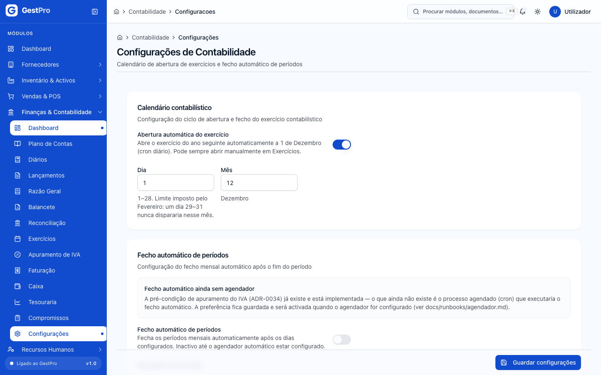

### Efeitos de outros módulos na contabilidade

Estes lançamentos são criados automaticamente, já no estado **Lançado**, com data do documento:

| Acção noutro módulo | Lançamento gerado |
|---|---|
| Emitir factura | Diário de Vendas: débito 411 Clientes c/c; crédito 711 Vendas e 44331 IVA liquidado. |
| Emitir nota de crédito | Diário de Vendas: o inverso da factura, na parte creditada. |
| Emitir nota de débito | Diário de Vendas: débito 411; crédito da conta da natureza (711, 781, 769 ou a escolhida) e 44331. |
| Vender no POS ([Vendas e POS](04-vendas-e-pos.md)) | Diário de Vendas, pelo documento da venda (Factura-Recibo ou, a crédito, Factura): débito da conta do meio de pagamento (111 dinheiro, 411 crédito, a conta configurada ou 121 nos restantes); crédito 711 Vendas e 44331 IVA liquidado. |
| Anular uma venda POS | Nota de crédito (o inverso da venda) e a devolução: débito 411; crédito das contas dos meios de pagamento originais. |
| Criar uma conta a pagar, ou registar a recepção de uma compra | Diário de Compras: débito da conta de gasto/existências (e da conta 4432x de IVA dedutível, só quando a conta a pagar tem o documento do fornecedor completo); crédito 421 Fornecedores c/c. Na recepção de compras não é lançado IVA dedutível. |
| Pagar uma conta a pagar | Diário de Caixa (numerário) ou de Banco: débito 421 Fornecedores c/c; crédito 111 Caixa ou a conta contabilística da conta bancária escolhida. |
| Processar e pagar a folha salarial | Diário de Salários ([Recursos Humanos](07-recursos-humanos.md)). O pagamento tem a data indicada e credita a conta do meio escolhido (111 Caixa em numerário, ou a conta da conta bancária). |
| Registar o pagamento de uma factura ([capítulo 6](06-faturacao-caixa-tesouraria.md#como-registar-o-pagamento-de-uma-fatura)) | Diário de Caixa (numerário) ou de Banco: débito 111 Caixa ou a conta da conta bancária; crédito 411 Clientes c/c. |
| Encerrar o exercício | Diário EN, Período 13: apuramento dos resultados (classes 6 e 7 → 81/82 → 83), estimativa do imposto (851/4411) e resultado líquido (→ 88). |
| Abrir o exercício seguinte (com o anterior encerrado) | Diário AB, dia 1 de Janeiro: saldos de fecho das classes 1 a 5 e 8. |
| Aplicar o resultado | Diário de Operações, na data da deliberação: 88 ↔ 59 Resultados transitados. |
| Apurar o IVA | Diário de Operações, no último dia do mês (ver acima). |

Se o período da data do documento estiver fechado, a operação no outro módulo é recusada com «Período … está fechado».

**O que ainda não lança:** o **custo das vendas**
(a saída de stock de uma venda não debita 61 nem credita 32) e as vendas POS feitas antes de as vendas POS emitirem
documento fiscal. O balancete e a DRE não mostram a margem.

## Estados

**Lançamento**

| Estado | Significado | Pode passar a | Quem |
|---|---|---|---|
| Rascunho | Gravado, sem efeito nos mapas. Impede o fecho do período e o apuramento do IVA. Pode ser editado. | Lançado · Anulado | Administrador, Financeiro, Gestor (**Confirmar** · **Anular**) |
| Lançado | Confirmado e imutável. Conta no balancete, razão, DRE e IVA. Os lançamentos automáticos nascem já neste estado. | Estornado | Administrador, Financeiro (**Estornar**) |
| Estornado | Anulado por um contra-lançamento; ambos continuam visíveis e anulam-se nos mapas. | — (final) | — |
| Anulado | Rascunho descartado, com motivo. Nunca teve efeito nos mapas; não aparece na lista por omissão. | — (final) | — |

**Período contabilístico**

| Estado | Significado | Pode passar a | Quem |
|---|---|---|---|
| Aberto | Aceita lançamentos com data no período. | Fechado | Administrador, Financeiro (**Fechar período**, sem impedimentos) |
| Fechado | Recusa qualquer escrita com data no período. | Aberto | Administrador (**Reabrir**, com motivo; nunca se o IVA estiver Declarado à AT) |

**Exercício**

| Estado | Significado | Pode passar a | Quem |
|---|---|---|---|
| Aberto | Exercício em curso. | Encerrado (Provisório) | Administrador (**Encerrar exercício**) |
| Encerrado (Provisório) | Resultado apurado no Período 13; o exercício seguinte já tem a abertura. Ainda se pode corrigir. | Aberto · Encerrado | Administrador (**Reabrir exercício**, com motivo · **Encerrar definitivamente**) |
| Encerrado | Definitivo. Nenhum período aceita lançamentos e não se reabre. | — (final) | — |

**Apuramento de IVA**

| Estado | Significado | Pode passar a | Quem |
|---|---|---|---|
| *(Não apurado)* | Ainda sem apuramento activo. | Apurado | Administrador, Financeiro, Gestor (**Apurar**) |
| Apurado | Calculado e lançado. Permite fechar o período. | Estornado · Declarado à AT | Estornar: Administrador, Financeiro, Gestor · Declarar: Administrador, Financeiro |
| Estornado | Versão anulada; o período volta a poder ser apurado (nova versão). | — (final) | — |
| Declarado à AT | Entregue à AT. Tranca a reabertura do período. | — (final) | — |

**Período de reconciliação bancária**

| Estado | Significado | Pode passar a | Quem |
|---|---|---|---|
| Aberto | Criado, motor ainda não corrido. | Em reconciliação · Cancelado | Administrador, Financeiro, Gestor |
| Em reconciliação | O motor já correu; em tratamento. | Reconciliado · Cancelado | Administrador, Financeiro, Gestor |
| Reconciliado | Fechado, com mapa gravado. | — (final) | — |
| Cancelado | Anulado; abre-se outro. | — (final) | — |

**Movimento na reconciliação** (extracto ou contabilidade)

| Estado | Significado |
|---|---|
| Pendente | Ainda não classificado ou devolvido após reverter/reactivar. |
| Em Trânsito | Lançamento ainda não visto no banco, dentro da tolerância de dias. |
| Banco sem contabilização | Está no extracto e não tem lançamento. |
| Contabilidade sem banco | Tem lançamento e não aparece no banco, já fora da tolerância. |
| Diferença de valor | Par encontrado, mas com valores diferentes (a decidir nas Sugestões). |
| Divergência | Não corresponde e precisa de análise. |
| Reconciliado · Reconciliado manualmente | Correspondido pelo motor (confirmado) ou à mão, com justificação. Volta a Pendente se for revertido. |
| Ignorado | Retirado da análise; volta a Pendente com **Reactivar**. |

## Erros frequentes

| Mensagem mostrada | Porquê | O que fazer |
|---|---|---|
| Período 2026-03 está fechado | A data do lançamento, estorno ou documento cai num período fechado. | Use uma data num período aberto, ou peça ao Administrador para reabrir o período. |
| Débitos (…) devem ser iguais a créditos (…) | O lançamento não está equilibrado. | Corrija os valores até ver «Lançamento equilibrado». |
| Mínimo de 2 partidas por lançamento | Só foi indicada uma partida. | Adicione pelo menos uma partida do lado oposto. |
| Conta … não aceita lançamentos | A conta escolhida é de agregação. | Escolha uma conta de movimento (subconta). |
| Conta "…" já existe | Já há uma conta com esse código. | Use outro código. |
| Esta conta já tem N movimento(s): … não pode(m) ser alterado(s). Crie uma conta nova e desactive esta. | Tentou mudar código, classe, tipo, natureza, nível ou conta mãe de uma conta com lançamentos. | Altere só o nome/descrição, ou crie conta nova. |
| Conta tem lançamentos — não pode ser desativada | A conta tem histórico. | Deixe de lançar nela; não é possível desactivá-la. |
| Transição inválida: LANCADO → LANCADO … | Tentou confirmar um lançamento que outra pessoa já confirmou. | Actualize a página. |
| O lançamento já foi estornado ou mudou de estado entretanto. | Outra pessoa estornou o mesmo lançamento ao mesmo tempo; só um estorno fica. | Actualize a página: o lançamento já aparece **Estornado**, com a ligação ao estorno. |
| Período 2026-03 já está fechado | O período foi fechado entretanto. | Actualize a página. |
| O apuramento do IVA do período … já foi declarado à AT (referência: …). A correcção deve ser feita por regularização no período seguinte … | Tentou reabrir um período com IVA declarado. | Faça a regularização (44341/44342) num período aberto. |
| Não é possível reabrir um período de um exercício encerrado | O exercício está encerrado em definitivo. | Não há reabertura possível; corrija no exercício seguinte. |
| O exercício está encerrado provisoriamente. Reabra primeiro o exercício para reabrir um período. | Tentou reabrir um mês de um exercício encerrado provisoriamente. | Reabra o exercício (Administrador) e depois o mês. |
| Motivo deve ter pelo menos 10 caracteres | Motivo de reabertura demasiado curto. | Escreva um motivo mais completo. |
| O período … já tem um apuramento activo (versão N). Para corrigir, estorne-o e execute de novo. | Já existe apuramento Apurado ou Declarado. | Estorne o apuramento (se não estiver declarado) e apure de novo. |
| O período … tem N lançamento(s) em rascunho. Confirme ou elimine antes de apurar. | Há rascunhos no mês. | Confirme-os ou anule-os em **Lançamentos**. |
| O período … tem N documento(s) fiscal(is) sem lançamento: … | Documentos emitidos sem lançamento. | Contacte o suporte, indicando os números listados. |
| Pro rata não suportado — apuramento recusado («Este período tem operações isentas (a 0 %), à taxa reduzida de 5 % ou fora do campo do imposto. …») | Desde Janeiro de 2026, há no mês facturas, notas de débito ou notas de crédito com linhas a taxa diferente de 16 %, incluindo isentas a 0 %. | Trate o apuramento desse mês com o seu contabilista: o ecrã indica as regularizações manuais (contas 44341/44342/44343) a lançar antes de tentar de novo. |
| O apuramento já não está apurado (foi estornado ou declarado entretanto). | Outra pessoa estornou ou declarou o mesmo apuramento ao mesmo tempo. | Actualize a página e veja o estado actual do apuramento. |
| Formato de extracto não suportado: … Use CSV ou XLSX. | Ficheiro com outra extensão. | Exporte o extracto em CSV ou XLSX. |
| O extracto excede o tamanho máximo de 5 MB. | Ficheiro demasiado grande. | Divida o extracto por períodos mais curtos. |
| Este ficheiro já tinha sido importado nesta conta — nada foi alterado. | Ficheiro repetido. | Nada a fazer. |
| Há N contas bancárias activas na mesma conta contabilística … | Duas contas bancárias partilham a conta PGC. | Em **Contas Bancárias**, ligue cada conta à sua própria subconta PGC. |
| A conta bancária indicada está inactiva e não pode ser utilizada. | A conta escolhida num pagamento foi desactivada entretanto. | Escolha outra conta, ou reactive-a em **Contas Bancárias**. |
| Já existe um período de reconciliação em aberto para esta conta. | Só pode haver um período aberto por conta. | Feche ou cancele o período em curso. |
| O período sobrepõe-se a outro já reconciliado nesta conta. | As datas tocam um período fechado. | Comece no dia seguinte ao último período reconciliado. |
| A reconciliação tem uma diferença residual de … MT: justifique-a para fechar o período. | Há diferença por explicar. | Resolva as excepções/sugestões ou escreva a justificação. |
| Não se reconciliam entradas com saídas. | Escolheu movimentos de naturezas diferentes. | Escolha só entradas, ou só saídas, dos dois lados. |
| Um dos movimentos já tem correspondência: rejeite-a primeiro. | Um movimento escolhido está reservado por uma sugestão. | Rejeite a sugestão em **Sugestões** e tente de novo. |
| A correspondência pertence a um período já reconciliado. | Tentou reverter uma reconciliação de um período fechado. | Não é possível; registe o ajuste no período seguinte. |

## Perguntas frequentes

**Enganei-me num lançamento que ainda está em rascunho. Posso corrigi-lo?** Sim: **Editar** enquanto for rascunho, ou **Anular** se não devia existir. Só depois de confirmado é que a correcção passa a ser por estorno.

**O que entra no Acumulado?** Os lançamentos do período 01 ao período final do exercício, mais a abertura (o lançamento do diário AB ou, sem ele, a abertura implícita).

**Posso lançar em Janeiro de 2027 antes de o exercício 2027 abrir?** Sim: se o exercício ainda não existir, é criado automaticamente no primeiro lançamento com essa data.

**Quem pode reabrir um mês?** Só o Administrador, com motivo escrito — e nunca depois de o IVA desse mês ter sido declarado à AT.
