# 6. Faturação, Caixa e Tesouraria

> **Para quem:** Administrador, Gestor, Financeiro (tudo); Operador (caixa); Leitura (consulta) · **Onde:** menu › Finanças & Contabilidade › Faturação, Caixa, Tesouraria, Compromissos

## Para que serve

Este capítulo junta os quatro ecrãs do grupo **Finanças & Contabilidade** onde se lida com dinheiro a entrar e a sair:

- **Faturação** emite os documentos fiscais (faturas, notas de crédito) e os documentos comerciais que os antecedem (cotações e proformas), cada um com a sua numeração oficial.
- **Caixa** controla o dinheiro físico de um turno: abre-se com um fundo inicial, recebe as vendas do POS e fecha-se com a contagem das notas e moedas.
- **Tesouraria** projecta o saldo da empresa para as próximas semanas ou meses, a partir das faturas por cobrar, das contas por pagar, dos salários processados e dos compromissos que regista à mão.
- **Compromissos** é onde regista essas obrigações e direitos que não nascem de nenhum documento do sistema (rendas, prestações, financiamentos).

A emissão de faturas feita a partir de uma venda, e as notas de crédito e de débito do lado comercial, estão descritas no capítulo [Vendas e POS](04-vendas-e-pos.md). Aqui não se repetem.

### Caixa e tesouraria: não são a mesma coisa

É a distinção mais importante deste capítulo. Confundir as duas dá números que parecem certos e estão errados.

| | **Caixa** | **Tesouraria** |
|---|---|---|
| O que mede | O dinheiro físico (notas e moedas) de **uma sessão de caixa** | Todo o dinheiro disponível da empresa: **caixa + saldo contabilístico das contas bancárias activas** |
| Pergunta a que responde | «Quanto dinheiro devia estar nesta gaveta agora?» | «Vamos ter dinheiro suficiente nas próximas semanas?» |
| Inclui o que os clientes nos devem? | Não | Não no saldo de hoje. As faturas por cobrar entram na **projecção**, na data em que se espera recebê-las |
| Saldo bancário | Não conta | Conta, lido da contabilidade (não de um valor escrito à mão na conta bancária) |
| Onde se vê | **Caixa** (`/caixa`) | **Tesouraria** (`/tesouraria`) |

## Conceitos

| Termo | O que é |
|---|---|
| Série de documento | A sequência de numeração de um tipo de documento num ano (por exemplo, `FAT/2026`). Há uma série por tipo e por ano: faturas (`FAT`), notas de crédito (`NC`), notas de débito (`ND`), proformas (`PRO`), cotações (`COT`), sessões de caixa (`CXS`), entre outras. |
| Numeração sem lacunas | Cada documento recebe o número seguinte da série no momento em que é gravado, no formato `PREFIXO/ANO/000001`. Se a gravação falhar, o número não é gasto, por isso não ficam números saltados. |
| Ano da série | O número vem sempre da série do **ano da data de emissão** (hora de Maputo). Uma fatura datada de 2027 precisa que a série `FAT/2027` exista. |
| Fatura | Documento fiscal. Depois de emitida não se edita nem se apaga: corrige-se com uma nota de crédito. |
| Nota de crédito | Documento fiscal que anula ou reduz, total ou parcialmente, o valor de uma fatura. |
| Cotação | Proposta ou orçamento enviado ao cliente. Não é documento fiscal. |
| Proforma | Documento preliminar com os valores da futura fatura. Não é documento fiscal. |
| Sessão de caixa | Um turno de caixa, de um utilizador, entre a abertura e o fecho. Tem número próprio (`CXS/…`). |
| Fundo inicial | O dinheiro que está na gaveta quando a sessão é aberta. |
| Movimento de caixa | Cada entrada ou saída de dinheiro na sessão: Abertura, Venda, Recebimento, Sangria, Reforço, Devolução, Fecho, Ajuste. |
| Sangria / Reforço | Retirar dinheiro da gaveta (sangria) ou juntar dinheiro à gaveta (reforço) a meio do turno. |
| Diferença | No fecho: o dinheiro contado menos o dinheiro que devia estar. Positiva é excedente; negativa é falta. |
| Projecção de tesouraria | Cálculo, feito na hora, do saldo previsto ao longo de um horizonte. Não fica gravado: cada vez que abre a página, é recalculado com os dados desse momento. |
| Período (bucket) | Cada linha da projecção: um dia, uma semana ou um mês, com entradas, saídas, saldo inicial e saldo final. |
| Cenário | Hipótese sobre quando os clientes pagam: **Optimista**, **Base** ou **Pessimista**. As saídas nunca mudam de cenário para cenário. |
| Perfil de atraso de cobrança | Quantos dias, em média, os clientes pagaram depois do vencimento, medido nas faturas pagas dos últimos 180 dias. |
| Compromisso | Obrigação (saída) ou direito (entrada) com data, que ainda não foi pago nem recebido e que não nasce de um documento do sistema. |
| Ruptura | O primeiro período em que o saldo projectado fica negativo. |

## Ecrãs

| Menu | Endereço (/rota) | Para que serve |
|---|---|---|
| Faturação | `/faturacao/dashboard` | Resumo (total faturado, recebido, pendente, vencidas), últimas faturas e atalhos para Cotações, Proformas, Notas de Crédito e Nova Fatura |
| Faturação › Ver todas as faturas | `/faturacao` | Lista de faturas com filtro por Estado e pesquisa por número |
| Faturação › Nova Fatura | `/faturacao/nova` | Emitir uma fatura |
| (clique numa fatura) | `/faturacao/<id>` | Detalhe da fatura: linhas, totais, valores pagos e pendentes |
| Faturação › Cotações | `/faturacao/cotacoes` | Lista de cotações e botão **Nova Cotação** |
| Faturação › Proformas | `/faturacao/proforma` | Lista de proformas e botão **Nova Proforma** |
| Faturação › Notas de Crédito | `/faturacao/nota-credito` | Lista de notas de crédito e botão **Nova Nota de Crédito** |
| Caixa | `/caixa` | Estado do seu caixa, lista de sessões e botão **Abrir Caixa** |
| Caixa › Abrir Caixa | `/caixa/abertura` | Abrir uma sessão com o fundo inicial |
| Caixa › Fechar caixa | `/caixa/fechamento` | Contar o dinheiro e fechar a sua sessão aberta |
| (clique numa sessão) | `/caixa/<id>` | Detalhe da sessão: resumo e todos os movimentos |
| Tesouraria | `/tesouraria` | Projecção de Tesouraria |
| Compromissos | `/tesouraria/compromissos` | Lista de compromissos de tesouraria e botão **Novo Compromisso** |

## Faturação

<!-- captura: 06-faturacao-caixa-tesouraria/faturacao-dashboard.png | /faturacao/dashboard -->
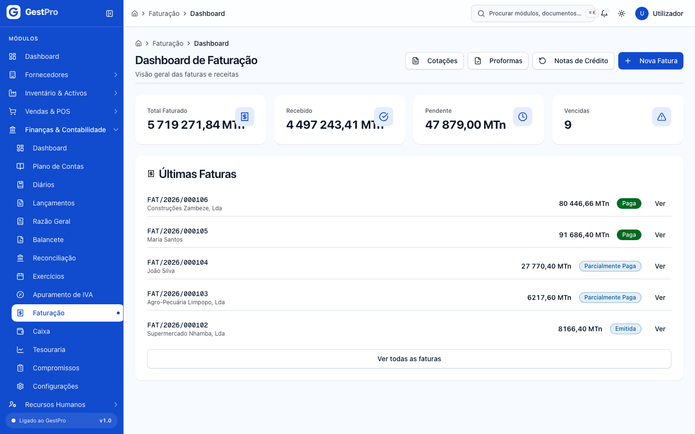

A entrada **Faturação** do menu abre o **Dashboard de Faturação**. É daqui que se chega a todos os documentos: os botões no topo levam a **Cotações**, **Proformas**, **Notas de Crédito** e **Nova Fatura**, e o botão **Ver todas as faturas**, no fim da caixa **Últimas Faturas**, abre a lista completa.

O caminho normal de um negócio é **Cotação → Proforma → Fatura**, mas nenhum passo é obrigatório: pode emitir uma fatura directamente.

### Séries de documento e numeração

Não precisa de criar séries para começar: quando a empresa é registada, o sistema cria uma série por tipo de documento para o ano corrente (e, se o registo for em Dezembro, também para o ano seguinte).

Para um ano novo, as séries são criadas quando se **abre o exercício contabilístico** desse ano, em **Contabilidade › Exercícios** (ou automaticamente, na data configurada em **Configurações**). Veja [Contabilidade](05-contabilidade.md). A mensagem de confirmação diz quantas séries foram criadas.

> **Atenção:** não existe hoje um ecrã para criar, editar ou desactivar séries à mão. Se o exercício do ano ainda não estiver aberto, a emissão pára com a mensagem «Série activa para tipo … no ano … não encontrada. Crie a série … primeiro.» A solução é abrir o exercício desse ano.

> **Atenção:** a caixa **Série de Faturação** mostra todas as séries de faturas activas, de qualquer ano. Seja qual for a escolhida, o número é sempre atribuído pela série do ano da **Data de Emissão**.

### Como emitir uma fatura

<!-- captura: 06-faturacao-caixa-tesouraria/fatura-nova.png | /faturacao/nova -->
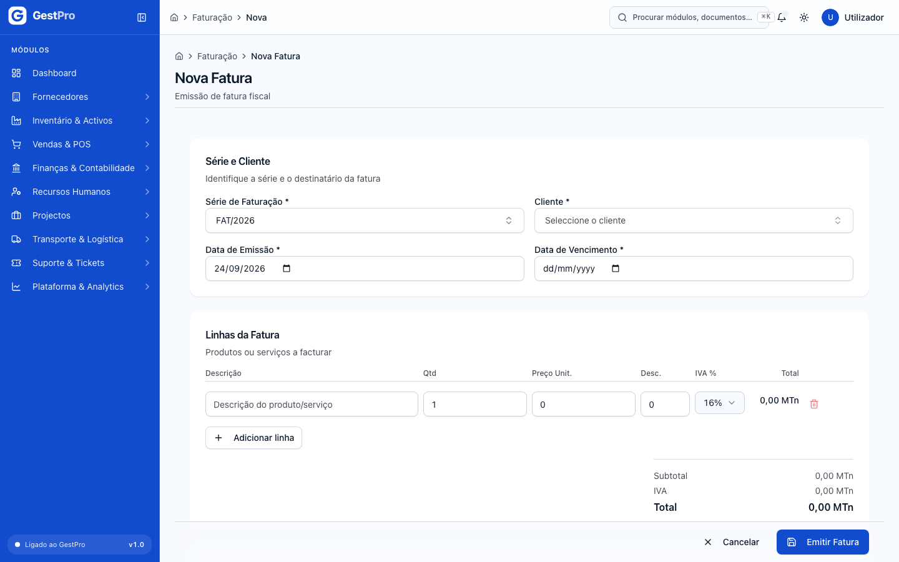

**Antes de começar**
- Precisa da permissão de emitir faturas (perfis Administrador, Gestor e Financeiro).
- O seu endereço de e-mail tem de estar confirmado (ver [Erros frequentes](#erros-frequentes)).
- O cliente tem de existir (ver [Vendas e POS](04-vendas-e-pos.md)).

**Passos**
1. Vá a **Faturação** e clique em **Nova Fatura**.
2. Em **Série e Cliente**, escolha a **Série de Faturação** e o **Cliente**. Pode escrever parte do nome ou do código do cliente para o encontrar.
3. Preencha a **Data de Emissão** e a **Data de Vencimento**. O vencimento não pode ser anterior à emissão.
4. Em **Linhas da Fatura**, preencha cada linha: **Descrição**, **Qtd**, **Preço Unit.**, **Desc.** (desconto em valor) e **IVA %** (16% ou 0% (isento)). Use **Adicionar linha** para mais linhas. O **Subtotal**, o **IVA** e o **Total** são actualizados à medida que escreve.
5. Se quiser, escreva notas para o cliente em **Observações**.
6. Clique em **Emitir Fatura**.

**Resultado**
Aparece a mensagem «Fatura emitida com sucesso.» e volta à lista. A fatura fica no estado **Emitida**, com o número seguinte da série (por exemplo `FAT/2026/000105`). A partir daqui não pode ser alterada.

**Efeitos noutros módulos**
- **Contabilidade:** ao emitir, o sistema cria automaticamente o lançamento no diário de vendas: débito em Clientes c/c (411), crédito em Vendas (711) e, se houver IVA, crédito em IVA liquidado (44331). Veja [Contabilidade](05-contabilidade.md).
- **Tesouraria:** o valor por receber entra na projecção na data de vencimento.

### Como consultar uma fatura

<!-- captura: 06-faturacao-caixa-tesouraria/faturas-lista.png | /faturacao -->
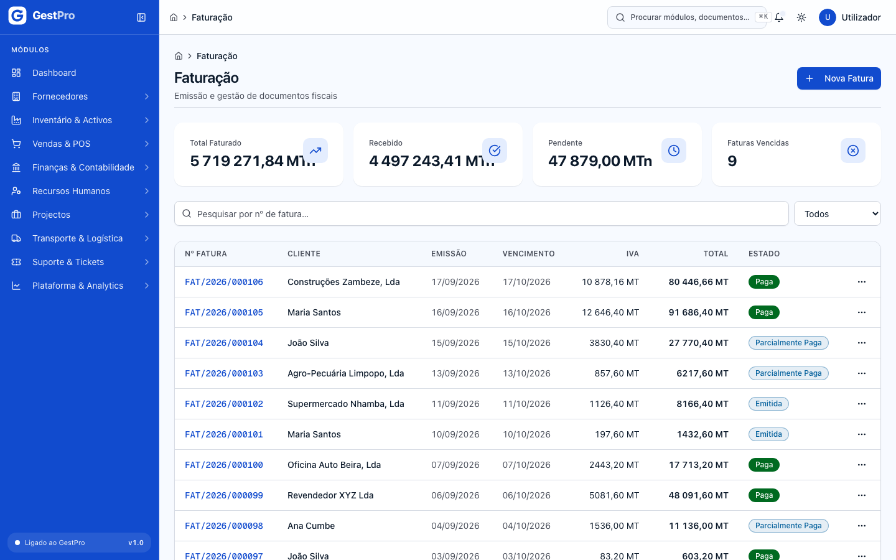

1. Em **Faturação**, clique em **Ver todas as faturas**.
2. No topo vê **Total Faturado**, **Recebido**, **Pendente** e **Faturas Vencidas**.
3. Filtre por **Estado** ou pesquise por nº de fatura.
4. Clique numa linha (ou em **⋯ › Ver detalhe**).

<!-- captura: 06-faturacao-caixa-tesouraria/fatura-detalhe.png | /faturacao >primeiro -->
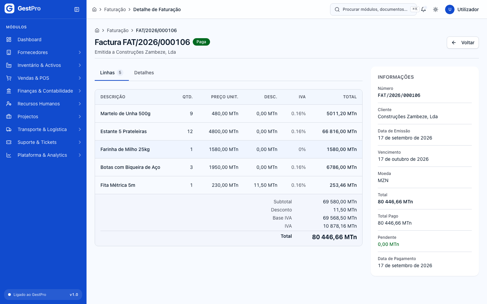

O detalhe mostra o **Número**, **Cliente**, **Data de Emissão**, **Vencimento**, **Moeda**, **Total**, **Total Pago** e **Pendente**. O separador **Linhas** tem cada linha e os totais (**Subtotal**, **Desconto**, **Base IVA**, **IVA**, **Total**); o separador **Detalhes** tem as observações.

> **Atenção — PDF fiscal:** o sistema gera o PDF fiscal da fatura (emitente e adquirente com NUIT, linhas, resumo de IVA por taxa e totais), mas a opção **Descarregar PDF** do menu **⋯** da lista ainda não está ligada, e no detalhe o botão só aparece em faturas que tenham um ficheiro guardado. Enquanto isto não for corrigido, peça o PDF ao administrador do sistema.

> **Atenção:** não há hoje, neste módulo, um botão para registar o pagamento de uma fatura nem para a marcar como vencida. As faturas emitidas aqui ficam em **Emitida** até isso ser possível.

### Como criar e enviar uma cotação

<!-- captura: 06-faturacao-caixa-tesouraria/cotacoes-lista.png | /faturacao/cotacoes -->
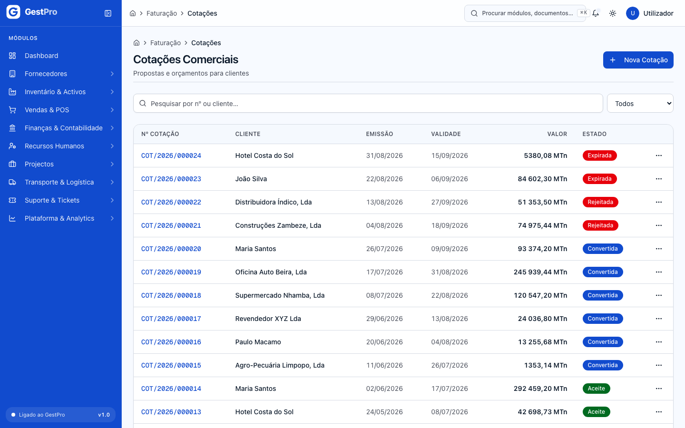

**Antes de começar**
- Precisa da permissão de criar cotações (Administrador, Gestor, Financeiro).

**Passos**
1. Em **Faturação**, clique em **Cotações** e depois em **Nova Cotação**.
2. Escolha a **Série de Documento**.
3. Em **ID do Cliente**, cole o identificador interno do cliente.
4. Preencha a **Data de Emissão** e a **Data de Validade** (a validade tem de ser posterior à emissão).
5. Preencha as **Linhas da Cotação** como numa fatura.
6. Se quiser, preencha **Condições Comerciais** (prazo de entrega, forma de pagamento, garantias) e **Observações**.
7. Clique em **Criar Cotação**.
8. Abra a cotação na lista e clique em **Enviar** quando a entregar ao cliente.

> **Atenção:** os formulários **Nova Cotação**, **Nova Fatura Proforma** e **Nova Nota de Crédito** deste módulo pedem o identificador interno do cliente ou da fatura, em vez de o deixar escolher numa lista. Para notas de crédito, use de preferência **Vendas & POS › Notas de Crédito** (ver [Vendas e POS](04-vendas-e-pos.md)).

**Resultado**
A cotação nasce em **Rascunho**. Depois de **Enviar**, fica **Enviada**, e aparece a mensagem «<número> enviada ao cliente.»

### Como registar a resposta do cliente a uma cotação

1. Abra a cotação (estado **Enviada**).
2. Se o cliente aceitou, clique em **Aceitar**. A cotação passa a **Aceite**.
3. Se o cliente recusou, clique em **Rejeitar**, escreva o **Motivo** (por exemplo «preço acima do orçamento do cliente») e confirme. A cotação fica **Rejeitada** e deixa de poder ser convertida. Nada se apaga.

### Como converter uma cotação em proforma

1. Abra a cotação (estado **Aceite**) e clique em **Converter em proforma**.
2. Escolha a **Série de proforma**.
3. Clique em **Converter em proforma**.

**Resultado**
É criada uma proforma com as mesmas linhas e valores, em **Rascunho**, e abre-se o seu detalhe. A cotação fica **Convertida** e não volta atrás. Se a cotação ainda não estiver aceite, o ecrã diz «Só uma cotação aceite pelo cliente se converte em proforma. Envie-a e registe a aceitação primeiro.»

### Como criar uma proforma e convertê-la em fatura

1. Em **Faturação**, clique em **Proformas** e depois em **Nova Proforma**, ou converta uma cotação (ver acima).
2. Preencha **Série de Documento**, **ID do Cliente**, **Data de Emissão**, **Data de Validade** e as **Linhas da Proforma**. Clique em **Criar Proforma**.
3. Abra a proforma e clique em **Enviar** quando a entregar ao cliente.
4. Quando o cliente aceitar, clique em **Aceitar**.
5. Clique em **Converter em factura**, escolha a **Série de factura** e confirme em **Converter em factura**.

**Resultado**
É emitida uma fatura com as mesmas linhas e valores, já no estado **Emitida**, com data de hoje e **vencimento a 30 dias**. A proforma fica **Convertida**. A mensagem é «<proforma> convertido — <número da fatura>.» e abre-se o detalhe da fatura.

> **Atenção:** a fatura criada por conversão de uma proforma ainda não gera o lançamento contabilístico automático (a fatura emitida em **Nova Fatura** gera). Avise o responsável pela contabilidade sempre que converter uma proforma.

### Como emitir uma nota de crédito

1. Em **Faturação**, clique em **Notas de Crédito** e depois em **Nova Nota de Crédito**.
2. Escolha a **Série de Documento** e cole em **ID da Factura a Creditar** o identificador da fatura original.
3. Preencha a **Data de Emissão** e o **Motivo**.
4. Em **Linhas da Nota de Crédito**, indique os itens e valores a creditar.
5. Clique em **Emitir Nota de Crédito**.

**Resultado**
A nota de crédito fica **Emitida**, com número da série `NC`, e aparece a mensagem «Nota de crédito emitida com sucesso.» Não é possível emitir uma nota de crédito sobre uma fatura cancelada.

**Efeitos noutros módulos**
- **Contabilidade:** é criado automaticamente o lançamento contabilístico da nota de crédito.

> **Atenção:** na lista de notas de crédito, as opções de ver o detalhe e de liquidar ainda não têm ecrã (abrem uma página inexistente).

## Caixa

<!-- captura: 06-faturacao-caixa-tesouraria/caixa-sessoes.png | /caixa -->
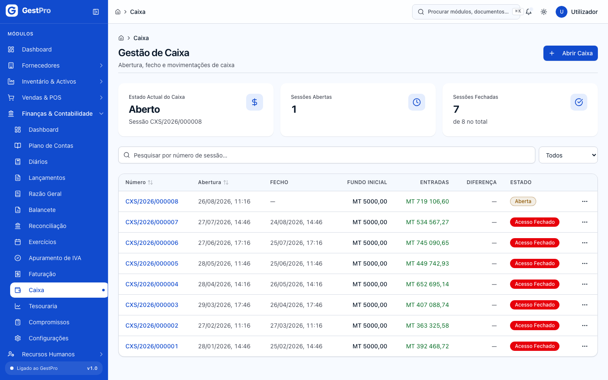

A página **Gestão de Caixa** mostra no topo o **Estado Actual do Caixa** (o **seu** caixa: Aberto ou Fechado, com o número da sessão), quantas **Sessões Abertas** e **Sessões Fechadas** há, e por baixo a lista de sessões com **Número**, **Abertura**, **Fecho**, **Fundo Inicial**, **Entradas**, **Diferença** e **Estado**.

Cada utilizador tem a sua própria sessão: só pode ter uma sessão aberta de cada vez.

### Como abrir o caixa

<!-- captura: 06-faturacao-caixa-tesouraria/caixa-abertura.png | /caixa/abertura -->
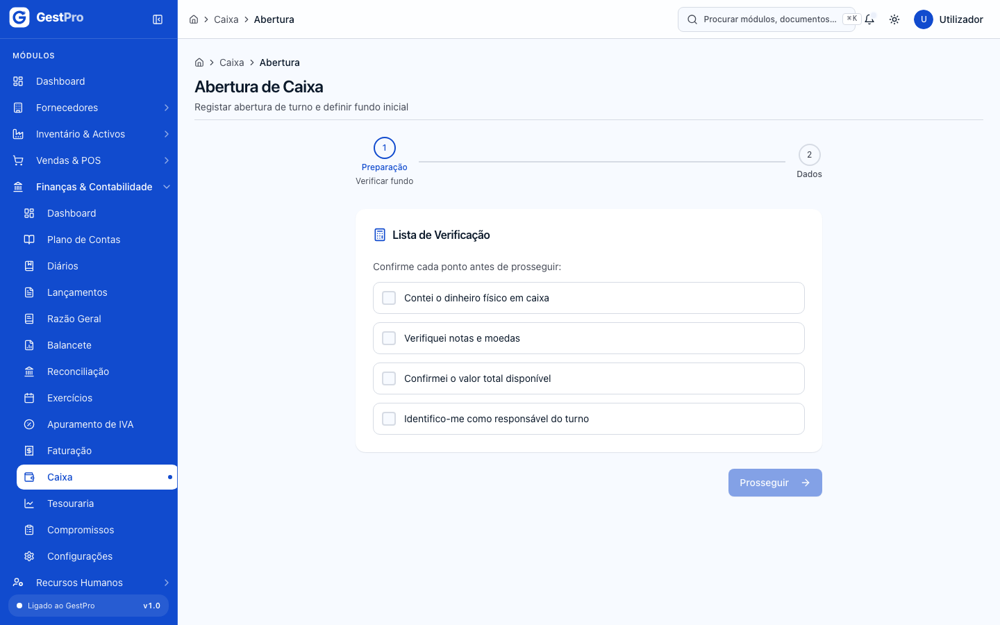

**Antes de começar**
- Precisa da permissão de abrir caixa (Administrador, Gestor, Financeiro, Operador).
- Não pode ter já uma sessão aberta.

**Passos**
1. Em **Caixa**, clique em **Abrir Caixa**.
2. No passo **Preparação**, confirme os quatro pontos da **Lista de Verificação** (contou o dinheiro, verificou notas e moedas, confirmou o total, identifica-se como responsável do turno). Clique em **Prosseguir**.
3. No passo **Dados**, escreva o **Fundo Inicial (MZN)**, o dinheiro físico que está na gaveta, e, se quiser, **Observações**.
4. Confira o **Resumo da Abertura** e clique em **Confirmar Abertura**.

**Resultado**
Aparece «Caixa aberto com sucesso!». É criada uma sessão **Aberta** com o número seguinte da série `CXS`, e o primeiro movimento da sessão é a **Abertura**, com o valor do fundo.

### Relação com o POS

O POS trabalha sempre sobre o caixa aberto do utilizador:

- Se abrir o **POS** sem ter o caixa aberto, o sistema leva-o para **Abertura de Caixa** e, depois de abrir, volta ao POS.
- Cada venda finalizada no POS regista na sessão um movimento **Venda** com o total da venda.
- Uma devolução com reembolso feita com o caixa aberto regista um movimento **Devolução** (saída).

Veja o funcionamento do POS em [Vendas e POS](04-vendas-e-pos.md).

> **Atenção:** o movimento **Venda** é registado pelo total da venda, seja qual for o método de pagamento (Dinheiro, Cartão, M-Pesa…). As vendas pagas por cartão ou carteira móvel contam como dinheiro esperado na gaveta. Tenha isto em conta ao interpretar a diferença no fecho.

### Como consultar uma sessão de caixa

<!-- captura: 06-faturacao-caixa-tesouraria/caixa-sessao-detalhe.png | /caixa >primeiro -->
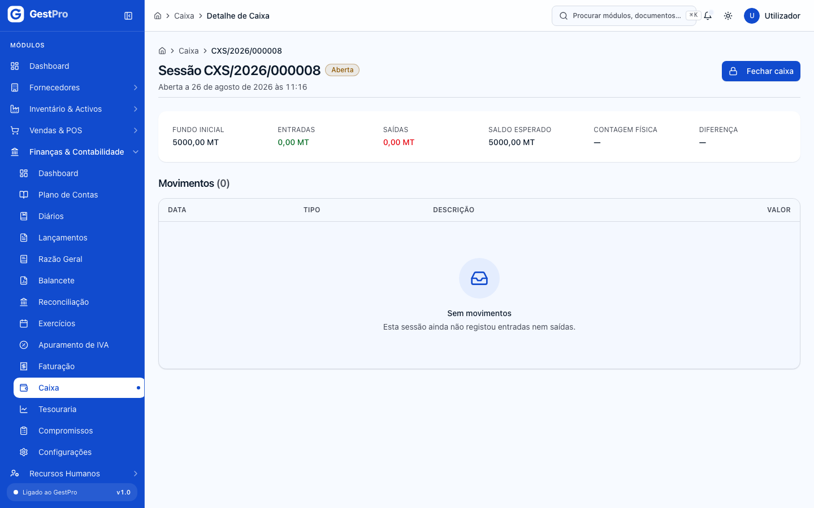

1. Em **Caixa**, clique numa sessão (ou em **⋯ › Ver detalhe**).
2. O resumo mostra **Fundo inicial**, **Entradas**, **Saídas**, **Saldo esperado** (ou **Saldo esperado ao fecho**, numa sessão fechada), **Contagem física** e **Diferença**.
3. Em **Movimentos** vê todas as entradas e saídas, por ordem, com **Data**, **Tipo**, **Descrição** e **Valor** (com sinal + ou −).

Numa sessão **aberta**, é neste detalhe que vê os valores do momento (serve como leitura do caixa a meio do turno). Na lista de sessões, as colunas **Entradas** e **Diferença** só ficam preenchidas depois do fecho.

### Como fechar o caixa

<!-- captura: 06-faturacao-caixa-tesouraria/caixa-fecho.png | /caixa/fechamento -->
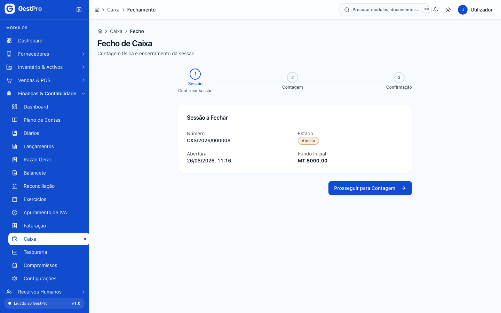

**Antes de começar**
- Precisa da permissão de fechar caixa (Administrador, Gestor, Financeiro, Operador).
- Só pode fechar a **sua** sessão aberta. Mesmo que clique em **Fechar caixa** na sessão de outra pessoa, o ecrã de fecho mostra a sua própria sessão (ou «Sem Sessão Activa»).

**Passos**
1. Em **Caixa**, clique em **⋯ › Fechar caixa** na sua sessão aberta, ou em **Fechar caixa** no detalhe dela.
2. No passo **Sessão**, confira a **Sessão a Fechar** (Número, Estado, Abertura, Fundo Inicial) e clique em **Prosseguir para Contagem**.
3. No passo **Contagem**, escreva quantas unidades tem de cada nota (**Nota MT 200** a **Nota MT 5**) e de cada moeda (**Moeda MT 10** a **Moeda MT 1**). O **Total Contado** é somado sozinho. Clique em **Prosseguir**.
4. No passo **Confirmação**, confira o **Resumo do Fecho**, escreva, se quiser, **Observações do Fecho** e clique em **Confirmar Fecho**.

**Resultado**
Aparece «Caixa fechado com sucesso!». A sessão fica **Fechada** (e não pode voltar a abrir). O sistema grava o total contado, os totais de entradas e saídas, a diferença, e regista um movimento **Fecho**.

> **Atenção:** a **Diferença** mostrada no passo de confirmação compara o total contado só com o fundo inicial, sem as vendas do turno. A diferença que fica gravada na sessão é calculada pelo sistema a partir dos movimentos e pode não coincidir com a do ecrã. Confira sempre o detalhe da sessão depois de fechar e, se os valores não fizerem sentido, fale com o responsável financeiro antes de repetir a contagem.

> **Atenção:** a contagem ainda não tem as notas de MT 500 e MT 1000. Se as tiver na gaveta, converta-as em notas de MT 200 ao contar (por exemplo, uma nota de MT 1000 = 5 notas de MT 200) ou registe-as nas **Observações do Fecho**.

### Reforço, sangria e cancelamento de sessão

O sistema já sabe registar **sangrias** (retirar dinheiro da gaveta), **reforços** (juntar dinheiro) e cancelar uma sessão sem movimentos, e esses movimentos aparecem no detalhe da sessão quando existem.

> **Atenção:** ainda não há botões no ecrã **Caixa** para registar um reforço, uma sangria ou para cancelar uma sessão. Até lá, registe essas operações nas **Observações do Fecho**.

**Efeitos noutros módulos**
- **Tesouraria:** as sessões **abertas** contam para o saldo de abertura da projecção de tesouraria.

## Tesouraria

<!-- captura: 06-faturacao-caixa-tesouraria/tesouraria-projecao.png | /tesouraria -->
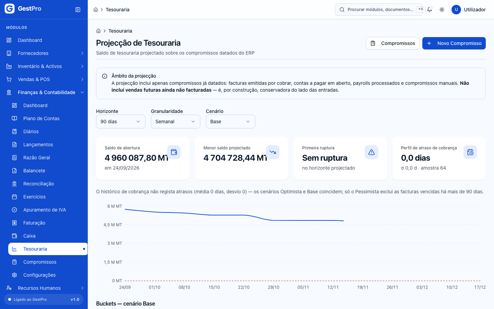

A página **Projecção de Tesouraria** responde a uma pergunta: com o que já está combinado, quanto dinheiro vamos ter em cada semana (ou dia, ou mês)?

**O que entra na projecção** (é isto que diz a caixa **Âmbito da projecção**, no topo da página):

| Entra | Como |
|---|---|
| Saldo de abertura | Dinheiro das sessões de caixa abertas + saldo contabilístico das contas bancárias activas, à data de hoje |
| Faturas por cobrar | Entradas: o valor ainda por pagar das faturas **Emitidas**, **Parcialmente Pagas** e **Vencidas**, na data de vencimento (ajustada pelo cenário) |
| Contas a pagar em aberto | Saídas, na data de vencimento (ver [Fornecedores e serviços](02-fornecedores-e-servicos.md)) |
| Payrolls processados | Saídas, pelo custo total para a empresa (ver [Recursos Humanos](07-recursos-humanos.md)) |
| Compromissos activos | Entradas ou saídas, na data prevista e nas repetições (ver [Compromissos](#compromissos)) |

**Não entra:** vendas futuras que ainda não foram faturadas. Por isso a projecção é, de propósito, conservadora do lado das entradas: não é uma previsão de vendas.

Valores já vencidos e ainda por pagar ou receber entram no **primeiro período**, assinalados com «N em atraso»: não desaparecem da projecção.

As contas bancárias são configuradas em **Contabilidade › Reconciliação › Contas Bancárias** (ver [Contabilidade](05-contabilidade.md)). O saldo delas vem sempre dos lançamentos contabilísticos das respectivas contas; duas contas bancárias ligadas à mesma conta contabilística contam uma só vez.

### Como ler a projecção

1. Abra **Tesouraria**.
2. Escolha os filtros:
   - **Horizonte**: quantos dias projectar.
   - **Granularidade**: **Diária** (até 90 dias), **Semanal** (até 180 dias) ou **Mensal** (até 365 dias). Se mudar para uma granularidade com limite menor, o horizonte é reduzido automaticamente.
   - **Cenário**: **Optimista**, **Base** ou **Pessimista** (ver abaixo).
3. Leia os quatro indicadores:
   - **Saldo de abertura**: o dinheiro disponível hoje.
   - **Menor saldo projectado**: o ponto mais baixo no horizonte. Fica a vermelho, com «saldo negativo no horizonte», se for negativo.
   - **Primeira ruptura**: a data de início do primeiro período com saldo negativo, ou **Sem ruptura**.
   - **Perfil de atraso de cobrança**: atraso médio dos clientes, com o desvio (σ) e o número de faturas usadas (amostra).
4. Veja o gráfico **Saldo projectado** e a tabela de períodos, com **Período**, **Entradas**, **Saídas**, **Saldo inicial** e **Saldo final**. Os períodos com saldo final negativo aparecem destacados com um sinal de aviso.

Os filtros ficam no endereço da página: pode copiar o endereço e enviá-lo a um colega para ele ver a mesma projecção.

**Os três cenários**

| Cenário | Recebimentos de clientes | Pagamentos |
|---|---|---|
| **Optimista** | Na data de vencimento | Na data de vencimento |
| **Base** | Vencimento + atraso médio histórico | Na data de vencimento |
| **Pessimista** | Vencimento + atraso médio + um desvio; faturas vencidas há mais de 90 dias são excluídas | Na data de vencimento |

Avisos que pode ver na página:
- **Não há origens de saldo configuradas**: a empresa não tem nenhuma conta bancária activa nem sessão de caixa aberta. O saldo de abertura aparece como «—», porque zero seria um valor falso.
- **Histórico de cobrança insuficiente**: há menos de 20 faturas pagas nos últimos 180 dias. O cenário **Base** usa então a hipótese optimista, e o título da tabela diz «cenário Optimista».
- Se os clientes não tiverem atrasos registados, uma nota explica que os cenários Optimista e Base coincidem.

> **Atenção:** as sessões de caixa abertas entram hoje na projecção só pelo fundo inicial: as vendas do turno em curso ainda não são somadas ao saldo de abertura.

A **demonstração de fluxos de caixa (DFC)** ainda não está disponível no produto.

## Compromissos

<!-- captura: 06-faturacao-caixa-tesouraria/compromissos-lista.png | /tesouraria/compromissos -->
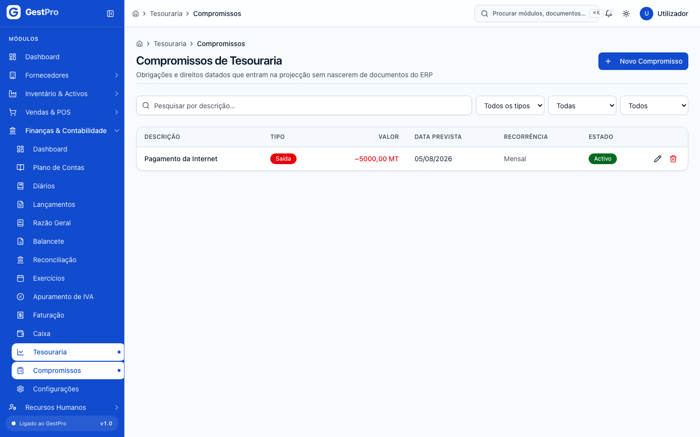

A página **Compromissos de Tesouraria** lista as obrigações e os direitos que entram na projecção sem nascerem de documentos do sistema: rendas, prestações de empréstimos, financiamentos a receber, etc. Pode filtrar por **Tipo** (Entrada, Saída), **Recorrência** (Única, Mensal, Trimestral, Anual) e **Estado** (Activo, Inactivo), e pesquisar por descrição.

Não registe aqui o que já existe no sistema (faturas, contas a pagar, salários): contaria duas vezes.

### Como registar um compromisso

<!-- captura: 06-faturacao-caixa-tesouraria/compromisso-novo.png | /tesouraria/compromissos/novo -->
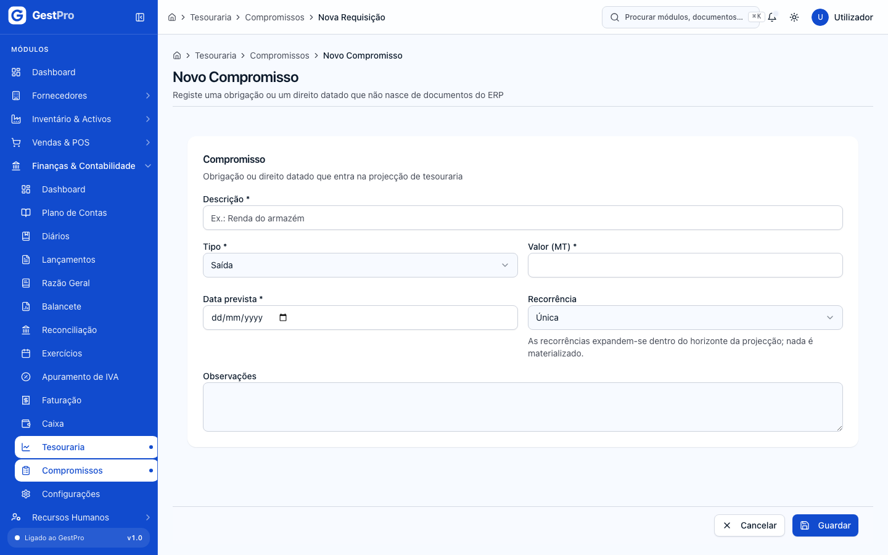

**Antes de começar**
- Precisa da permissão de escrita de tesouraria (Administrador, Gestor, Financeiro).

**Passos**
1. Em **Compromissos** (ou em **Tesouraria**), clique em **Novo Compromisso**.
2. Preencha:
   - **Descrição** (por exemplo «Renda do armazém»);
   - **Tipo**: **Entrada** (dinheiro a receber) ou **Saída** (dinheiro a pagar);
   - **Valor (MT)**;
   - **Data prevista**;
   - **Recorrência**: **Única**, **Mensal**, **Trimestral** ou **Anual**;
   - **Fim da recorrência** (só aparece se não for Única; opcional: sem fim, repete-se até ao fim do horizonte da projecção);
   - **Observações** (opcional).
3. Clique em **Guardar**.

**Resultado**
Aparece «Compromisso criado.» e volta à lista. O compromisso entra de imediato na projecção. As repetições são calculadas na hora, dentro do horizonte escolhido, e não ficam gravadas uma a uma.

### Como alterar, desactivar ou eliminar um compromisso

1. Na lista, clique no compromisso (ou no botão de editar).
2. Altere o que precisar. Para o tirar da projecção sem o apagar, desligue **Activo — entra na projecção**.
3. Clique em **Guardar**. Aparece «Compromisso actualizado.»

Para eliminar, clique no botão de eliminar na linha e confirme em **Eliminar compromisso?**. O compromisso deixa de entrar na projecção; a eliminação não afecta nenhum documento do sistema.

## Estados

### Fatura

| Estado | Significado | Pode passar a | Quem |
|---|---|---|---|
| Emitida | Documento fiscal emitido, por pagar | Paga, Parcialmente Paga, Vencida, Cancelada | Ainda sem botão neste módulo |
| Parcialmente Paga | Parte do valor recebida | Paga, Vencida | Ainda sem botão neste módulo |
| Vencida | Passou o vencimento sem pagamento total | Paga, Parcialmente Paga, Cancelada | Ainda sem botão neste módulo |
| Paga | Totalmente recebida | — (final) | — |
| Cancelada | Anulada | — (final) | — |

### Nota de crédito

| Estado | Significado | Pode passar a | Quem |
|---|---|---|---|
| Emitida | Documento fiscal emitido | Liquidada, Cancelada | Ainda sem ecrã neste módulo |
| Liquidada | O crédito foi usado ou devolvido | — (final) | — |
| Cancelada | Anulada, com motivo | — (final) | — |

### Cotação

| Estado | Significado | Pode passar a | Quem |
|---|---|---|---|
| Rascunho | Criada, ainda não enviada | Enviada (Cancelada ainda sem botão) | Financeiro, Gestor, Administrador (**Enviar**) |
| Enviada | Entregue ao cliente | Aceite, Rejeitada (Expirada ainda sem botão) | Financeiro, Gestor, Administrador (**Aceitar**, **Rejeitar**) |
| Aceite | Cliente aceitou | Convertida | Financeiro, Gestor, Administrador (**Converter em proforma**) |
| Rejeitada | Cliente recusou (com motivo) | — (final) | — |
| Convertida | Deu origem a uma proforma | — (final) | — |
| Expirada | Passou a validade | — (final) | — |
| Cancelada | Anulada | — (final) | — |

### Proforma

| Estado | Significado | Pode passar a | Quem |
|---|---|---|---|
| Rascunho | Criada, ainda não enviada | Enviada (Cancelada ainda sem botão) | Financeiro, Gestor, Administrador (**Enviar**) |
| Enviada | Entregue ao cliente | Aceite (Expirada e Cancelada ainda sem botão) | Financeiro, Gestor, Administrador (**Aceitar**) |
| Aceite | Cliente aceitou | Convertida (Cancelada ainda sem botão) | Financeiro, Gestor, Administrador (**Converter em factura**) |
| Convertida | Deu origem a uma fatura | — (final) | — |
| Expirada | Passou a validade | — (final) | — |
| Cancelada | Anulada | — (final) | — |

### Sessão de caixa

| Estado | Significado | Pode passar a | Quem |
|---|---|---|---|
| Aberta | Turno em curso; recebe movimentos | Fechada (Cancelada ainda sem botão) | O próprio utilizador (Operador, Financeiro, Gestor, Administrador) |
| Fechada | Turno encerrado com contagem. O selo mostra hoje «Acesso Fechado» | — (final) | — |
| Cancelada | Anulada sem movimentos além da abertura | — (final) | — |

### Compromisso

| Estado | Significado | Pode passar a | Quem |
|---|---|---|---|
| Activo | Entra na projecção | Inactivo | Financeiro, Gestor, Administrador |
| Inactivo | Guardado, mas fora da projecção | Activo | Financeiro, Gestor, Administrador |

## Erros frequentes

| Mensagem mostrada | Porquê | O que fazer |
|---|---|---|
| «Para emitir documentos fiscais é preciso confirmar o endereço de e-mail da conta…» | O seu e-mail ainda não foi confirmado. Faturas, notas de crédito e conversões de proforma em fatura são documentos fiscais e ficam bloqueados | Abra a ligação de confirmação que recebeu por e-mail (o aviso no painel reenvia-a). Se já confirmou há pouco, termine a sessão e entre de novo |
| «Série activa para tipo "…" no ano … não encontrada. Crie a série … primeiro.» | Não há série para o ano da data do documento | Abra o exercício desse ano em **Contabilidade › Exercícios** (ver [Contabilidade](05-contabilidade.md)) |
| «Série de documento não encontrada ou inactiva» | A série escolhida foi desactivada | Escolha outra série |
| «Cliente não encontrado» | O cliente não existe nesta empresa (ou o identificador colado está errado) | Confirme o cliente em **Clientes** |
| «Data de vencimento não pode ser anterior à data de emissão» | Datas trocadas na fatura | Corrija a **Data de Vencimento** |
| «Data de validade deve ser posterior à data de emissão» | Datas trocadas na cotação ou proforma | Corrija a **Data de Validade** |
| «Taxa de IVA inválida — use 0.16 (16%) ou 0 (isento)» | Taxa de IVA fora das permitidas | Escolha 16% ou 0% |
| «Não é possível emitir NC para factura cancelada» | A fatura original está cancelada | Confirme a fatura a creditar |
| «Factura original não encontrada» | O identificador da fatura na nota de crédito está errado | Confirme o identificador ou use **Vendas & POS › Notas de Crédito** |
| «Escolha a série de destino.» | Clicou em converter sem escolher a série | Escolha a série e confirme |
| «Só uma cotação aceite pelo cliente se converte em proforma…» / «Só uma proforma aceite pelo cliente se converte em factura…» | O documento ainda não foi aceite | Clique em **Enviar** e depois em **Aceitar** |
| «Já existe uma sessão de caixa aberta (CXS/…)» | Já tem um caixa aberto | Use a sessão aberta ou feche-a primeiro |
| «Sem Sessão Activa» / «É necessário ter uma sessão de caixa aberta para efectuar o fecho.» | Não tem nenhuma sessão aberta em seu nome | Clique em **Abrir Caixa** |
| «Fundo inicial não pode ser negativo» | Valor negativo no fundo inicial | Escreva zero ou um valor positivo |
| «Valor deve ser positivo» | Valor do compromisso é zero ou negativo | Escreva um valor maior que zero |
| «Data de fim da recorrência não pode ser anterior à data prevista.» | O fim da recorrência é antes da primeira data | Corrija o **Fim da recorrência** |
| «Compromisso único não admite data de fim de recorrência.» | Recorrência **Única** com data de fim | Apague o fim ou escolha outra recorrência |
| «Granularidade … admite no máximo … dias.» | Horizonte maior do que o permitido para a granularidade (endereço alterado à mão) | Use os filtros da página |

## Perguntas frequentes

**Porque é que o saldo da Tesouraria não é igual ao que o banco me diz?**
A tesouraria usa o saldo **contabilístico** das contas bancárias, isto é, o que foi lançado na contabilidade. Movimentos do banco ainda não lançados não aparecem. Para acertar os dois, use a reconciliação bancária (ver [Contabilidade](05-contabilidade.md)).

**Posso apagar uma fatura emitida por engano?**
Não. Uma fatura emitida é um documento fiscal: corrige-se com uma nota de crédito.

**Porque é que a projecção não mostra as vendas que esperamos fazer no próximo mês?**
Porque só inclui o que já está datado e combinado. Se tiver um recebimento certo que ainda não foi faturado (por exemplo, um contrato), registe-o como compromisso de **Entrada**.

**Duas pessoas podem ter o caixa aberto ao mesmo tempo?**
Sim. Cada utilizador tem a sua sessão; o que não pode é ter duas sessões abertas em seu nome.
