# 6. Faturação, Caixa e Tesouraria

> **Para quem:** Administrador, Gestor, Financeiro (tudo); Operador (caixa); Leitura (consulta) · **Onde:** menu › Finanças & Contabilidade › Faturação, Séries de documento, Caixa, Tesouraria, Compromissos

## Objectivo do módulo

Este capítulo junta os quatro ecrãs do grupo **Finanças & Contabilidade** onde se lida com dinheiro a entrar e a sair:

- **Faturação** emite os documentos fiscais (faturas, notas de crédito), os documentos comerciais que os antecedem (cotações e proformas), cada um com a sua numeração oficial, e regista os **pagamentos** dos clientes.
- **Caixa** controla o dinheiro físico de um turno: abre-se com um fundo inicial, recebe as vendas do POS e os recebimentos em numerário, regista as sangrias e os reforços feitos a meio do turno, e fecha-se com a contagem das notas e moedas.
- **Tesouraria** projecta o saldo da empresa para as próximas semanas ou meses, a partir das faturas por cobrar, das contas por pagar, dos salários processados e dos compromissos que regista à mão.
- **Compromissos** é onde regista essas obrigações e direitos que não nascem de nenhum documento do sistema (rendas, prestações, financiamentos).

O objectivo é responder, a qualquer momento, a três perguntas: **o que facturámos e o que já recebemos?
o dinheiro da gaveta está certo? vamos ter dinheiro para pagar o que aí vem?**

| | |
|---|---|
| **Que problema resolve** | Numeração de facturas com saltos, propostas perdidas, cobranças esquecidas, diferenças de caixa sem explicação, falta de dinheiro descoberta no dia do pagamento. |
| **Quem usa** | Financeiro (faturação, cobranças, tesouraria); Operador (caixa); Gestor (propostas a clientes). |
| **O que entra** | Clientes e linhas a facturar (com o motivo de isenção nas linhas a 0 %), pagamentos recebidos, o fundo, as sangrias, os reforços e a contagem da caixa, compromissos futuros. |
| **O que sai** | Documentos fiscais numerados e o seu PDF (as faturas com hash de integridade), faturas pagas/vencidas, sessões de caixa fechadas com diferença, projecção de saldo com a primeira data de ruptura. |
| **Liga-se a** | [Vendas & POS](04-vendas-e-pos.md) (vendas e notas), [Contabilidade](05-contabilidade.md) (cada documento e pagamento lança), [Fornecedores](02-fornecedores-e-servicos.md) e [Recursos Humanos](07-recursos-humanos.md) (saídas previstas). |

A emissão de faturas feita a partir de uma venda, e as notas de crédito e de débito do lado comercial, estão descritas no capítulo [Vendas e POS](04-vendas-e-pos.md). Aqui não se repetem.

### Caixa e tesouraria: não são a mesma coisa

É a distinção mais importante deste capítulo. Confundir as duas dá números que parecem certos e estão errados.

| | **Caixa** | **Tesouraria** |
|---|---|---|
| O que mede | O dinheiro físico (notas e moedas) de **uma sessão de caixa** | Todo o dinheiro disponível da empresa: **caixa + saldo contabilístico das contas bancárias activas** |
| Pergunta a que responde | «Quanto dinheiro devia estar nesta gaveta agora?» | «Vamos ter dinheiro suficiente nas próximas semanas?» |
| Inclui o que os clientes nos devem? | Não | Não no saldo de hoje. As faturas por cobrar entram na **projecção**, na data em que se espera recebê-las |
| Saldo bancário | Não conta | Conta, lido da contabilidade (não de um valor escrito à mão na conta bancária) |
| Onde se vê | **Caixa** (`/caixa`) | **Tesouraria** (`/tesouraria`) |

## Exemplo prático — da proposta ao dinheiro no banco

**Situação:** a Construções Machava pede preço para uma obra. O Carlos (Financeiro) trata da proposta, da
factura e da cobrança; a Ana (Operador) fecha a caixa ao fim do dia; no meio do mês o Carlos olha para as
próximas semanas.

**1. Proposta → proforma → factura**

| Passo | Ecrã | Resultado |
|---|---|---|
| Cotação: 100 × CIM-50 a 650,00 + 200 × VAR-12 a 480,00 | [Nova Cotação](#como-criar-e-enviar-uma-cotação) → **Enviar** | `COT/…` **Enviada** · Subtotal 161 000,00 · IVA 25 760,00 · **Total 186 760,00** |
| O cliente aceita | **Aceitar** → **Converter em proforma** | `COT/…` **Convertida** · `PRO/…` em Rascunho |
| O financeiro do cliente aprova | Proforma: **Enviar** → **Aceitar** → **Converter em factura** | `FAT/…` **Emitida**, vence a 30 dias · lançamento D 411 186 760,00 / C 711 161 000,00 e 44331 25 760,00 |

Cotação e proforma **não são documentos fiscais** e não lançam nada; só a factura.

**2. Cobrar** → [Como registar o pagamento de uma fatura](#como-registar-o-pagamento-de-uma-fatura)

| Data | Recebimento | Forma | Estado da factura | Lançamento |
|---|---:|---|---|---|
| dia 20 | 100 000,00 | Transferência bancária → BCI | **Parcialmente Paga** (pendente 86 760,00) | D conta do BCI / C 411 |
| dia 31 do mês seguinte | — | (passou o vencimento) | **Marcar como vencida** → **Vencida** | — |
| dia 35 | 86 760,00 | Transferência bancária → BCI | **Paga** | D conta do BCI / C 411 |

**3. Reforçar e fechar a caixa da Ana** → [Como registar uma sangria ou um reforço](#como-registar-uma-sangria-ou-um-reforço) · [Como fechar o caixa](#como-fechar-o-caixa)

A meio da tarde a Ana fica sem trocos e o gerente traz 2 500,00 MT do cofre: no detalhe da sessão, **Registar
reforço** com **Valor (MZN)** 2 500,00 e **Motivo** «Trocos do cofre».

| Movimento da sessão `CXS/…` | Valor |
|---|---:|
| Abertura (fundo inicial) | 5 000,00 |
| Vendas POS em dinheiro | 11 716,00 |
| Reforço — trocos do cofre | 2 500,00 |
| **Saldo esperado** | **19 216,00** |

A Ana conta 19 × Nota MT 1000, 2 × Nota MT 100 e 1 × Moeda MT 10, 1 × Moeda MT 5, 1 × Moeda MT 1 =
**19 216,00**. O **Resumo do Fecho** mostra **Saldo Esperado** 19 216,00 e **Diferença** 0,00 → **Confirmar Fecho**.
As vendas por M-Pesa ou a crédito não entram nesta conta: não passaram pela gaveta.

**4. Olhar para as próximas semanas** → [Como ler a projecção](#como-ler-a-projecção)

O Carlos regista dois **Compromissos** mensais — «Renda do armazém» (Saída, 35 000,00, dia 5) e «Prestação
leasing carrinha» (Saída, 22 500,00, dia 20) — e abre a **Tesouraria** com Horizonte 90 dias, **Semanal**,
cenário **Base**. Vê a entrada de 186 760,00 (ou do que ainda estiver pendente) na semana do vencimento, as
saídas mensais, os salários processados e as contas a pagar. Se aparecer **Primeira ruptura**, muda para
**Pessimista** e envia o endereço da página à gerência.

**Resultado esperado:** documentos numerados sem saltos (`COT/2026/…`, `PRO/2026/…`, `FAT/2026/…`), a
factura **Paga** com dois recebimentos no detalhe, a sessão de caixa **Fechada** com diferença zero e uma
projecção que mostra, semana a semana, se o dinheiro chega.

## Conceitos

| Termo | O que é |
|---|---|
| Série de documento | A sequência de numeração de um tipo de documento num ano (por exemplo, `FAT/2026`). Há uma série por tipo e por ano: faturas (`FAT`), notas de crédito (`NC`), notas de débito (`ND`), proformas (`PRO`), cotações (`COT`), sessões de caixa (`CXS`), entre outras. |
| Numeração sem lacunas | Cada documento recebe o número seguinte da série no momento em que é gravado, no formato `PREFIXO/ANO/000001`. Se a gravação falhar, o número não é gasto, por isso não ficam números saltados. |
| Ano da série | O número vem sempre da série do **ano da data de emissão** (hora de Maputo). Uma fatura datada de 2027 precisa que a série `FAT/2027` exista. |
| Fatura | Documento fiscal. Depois de emitida não se edita nem se apaga: corrige-se com uma nota de crédito. |
| Motivo de isenção | Texto legal obrigatório em cada linha de um documento fiscal com IVA a 0 % (por exemplo, «Isento nos termos do artigo 9.º do Código do IVA»). Sai no PDF junto da linha («Motivo de isenção: …»). |
| Hash de integridade | Código calculado no momento da emissão de cada Factura e Factura-Recibo, encadeado com o do documento anterior da mesma série. Aparece no detalhe e no PDF; qualquer alteração posterior ao documento deixaria de bater com ele. |
| Nota de crédito | Documento fiscal que anula ou reduz, total ou parcialmente, o valor de uma fatura. |
| Cotação | Proposta ou orçamento enviado ao cliente. Não é documento fiscal. |
| Proforma | Documento preliminar com os valores da futura fatura. Não é documento fiscal. |
| Sessão de caixa | Um turno de caixa, de um utilizador, entre a abertura e o fecho. Tem número próprio (`CXS/…`). |
| Fundo inicial | O dinheiro que está na gaveta quando a sessão é aberta. |
| Movimento de caixa | Cada entrada ou saída de dinheiro na sessão: Abertura, Venda, Recebimento, Sangria, Reforço, Devolução, Pagamento, Fecho, Ajuste. **Pagamento** é uma saída: um pagamento a fornecedor, ou o pagamento da folha salarial, feito em numerário a partir da sessão. |
| Sangria / Reforço | Retirar dinheiro da gaveta (sangria) ou juntar dinheiro à gaveta (reforço) a meio do turno. |
| Diferença | No fecho: o dinheiro contado menos o dinheiro que devia estar. Positiva é excedente; negativa é falta. |
| Projecção de tesouraria | Cálculo, feito na hora, do saldo previsto ao longo de um horizonte. Não fica gravado: cada vez que abre a página, é recalculado com os dados desse momento. |
| Período (bucket) | Cada linha da projecção: um dia, uma semana ou um mês, com entradas, saídas, saldo inicial e saldo final. |
| Cenário | Hipótese sobre quando os clientes pagam: **Optimista**, **Base** ou **Pessimista**. As saídas nunca mudam de cenário para cenário. |
| Perfil de atraso de cobrança | Quantos dias, em média, os clientes pagaram depois do vencimento, medido nas faturas pagas dos últimos 180 dias. |
| Compromisso | Obrigação (saída) ou direito (entrada) com data, que ainda não foi pago nem recebido e que não nasce de um documento do sistema. |
| Ruptura | O primeiro período em que o saldo projectado fica negativo. |

## Ecrãs

| Menu | Endereço (/rota) | Para que serve |
|---|---|---|
| Faturação | `/faturacao/dashboard` | Resumo (total faturado, recebido, pendente, vencidas), últimas faturas e atalhos para Cotações, Proformas, Notas de Crédito e Nova Fatura |
| Faturação › Ver todas as faturas | `/faturacao` | Lista de faturas com filtro por Estado e pesquisa por número |
| Faturação › Nova Fatura | `/faturacao/nova` | Emitir uma fatura |
| (clique numa fatura) | `/faturacao/<id>` | Detalhe da fatura: linhas, totais, valores pagos e pendentes; **Registar pagamento**, **Marcar como vencida**, **Descarregar PDF** |
| Fatura › Registar pagamento | `/faturacao/<id>/pagamento` | Registar um recebimento do cliente (total ou parcial) |
| Faturação › Cotações | `/faturacao/cotacoes` | Lista de cotações e botão **Nova Cotação** |
| Faturação › Proformas | `/faturacao/proforma` | Lista de proformas e botão **Nova Proforma** |
| Faturação › Notas de Crédito | `/faturacao/nota-credito` | Lista de notas de crédito e botão **Nova Nota de Crédito** |
| Séries de documento | `/faturacao/series` | Séries de numeração dos documentos de faturação; **Nova série** e **Criar séries de ‹ano seguinte›** |
| Caixa | `/caixa` | Estado do seu caixa, lista de sessões e botão **Abrir Caixa** |
| Caixa › Abrir Caixa | `/caixa/abertura` | Abrir uma sessão com o fundo inicial |
| Caixa › Fechar caixa | `/caixa/fechamento` | Contar o dinheiro e fechar a sua sessão aberta |
| (clique numa sessão) | `/caixa/<id>` | Detalhe da sessão: resumo e todos os movimentos; **Registar reforço**, **Registar sangria**, **Cancelar sessão**, **Fechar caixa** |
| Sessão › Registar reforço | `/caixa/<id>/reforco` | Juntar dinheiro à gaveta |
| Sessão › Registar sangria | `/caixa/<id>/sangria` | Retirar dinheiro da gaveta |
| Sessão › Cancelar sessão | `/caixa/<id>/cancelar` | Cancelar uma sessão aberta por engano |
| Tesouraria | `/tesouraria` | Projecção de Tesouraria |
| Compromissos | `/tesouraria/compromissos` | Lista de compromissos de tesouraria e botão **Novo Compromisso** |

## Faturação

<!-- captura: 06-faturacao-caixa-tesouraria/faturacao-dashboard.png | /faturacao/dashboard -->
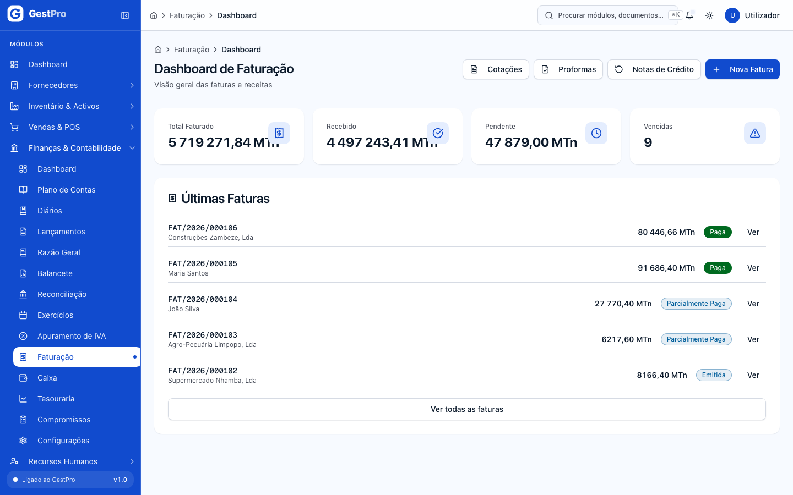

A entrada **Faturação** do menu abre o **Dashboard de Faturação**. É daqui que se chega a todos os documentos: os botões no topo levam a **Cotações**, **Proformas**, **Notas de Crédito** e **Nova Fatura**, e o botão **Ver todas as faturas**, no fim da caixa **Últimas Faturas**, abre a lista completa.

O caminho normal de um negócio é **Cotação → Proforma → Fatura**, mas nenhum passo é obrigatório: pode emitir uma fatura directamente.

### Séries de documento e numeração

Não precisa de criar séries para começar: quando a empresa é registada, o sistema cria uma série por tipo de documento para o ano corrente (e, se o registo for em Dezembro, também para o ano seguinte).

Para um ano novo, as séries são criadas quando se **abre o exercício contabilístico** desse ano, em **Contabilidade › Exercícios** (ou automaticamente, na data configurada em **Configurações**). Veja [Contabilidade](05-contabilidade.md). A mensagem de confirmação diz quantas séries foram criadas. Também as pode criar antecipadamente em **Séries de documento**, com **Criar séries de ‹ano seguinte›** (ver abaixo).

#### Gerir as séries de faturação

<!-- captura: 06-faturacao-caixa-tesouraria/series.png | /faturacao/series -->

Em **Finanças & Contabilidade › Séries de documento** (`/faturacao/series`) vê as séries dos sete documentos de faturação — Factura, Nota de Crédito, Nota de Débito, Factura Pró-forma, Cotação, Recibo e Factura-Recibo (`FR`, a das vendas POS pagas) — com o **próximo número** que cada uma vai emitir, o estado (**Activa**/**Inactiva**) e quantos documentos já numerou. Por omissão mostra o ano corrente; filtre por tipo, ano ou estado.

**Quem pode:** todos os que vêem a faturação consultam a lista. Criar, editar, activar, desactivar e eliminar exige a permissão *Configurar séries de faturação* (por omissão, Administrador e Financeiro).

**Regras:**
- Só pode haver **uma série activa por tipo de documento e por ano**. Para mudar de prefixo, desactive primeiro a série actual e depois crie (ou active) a nova.
- Uma série nova só pode ser do **ano corrente ou do seguinte**. O formato do número é sempre `PREFIXO/ANO/000001`.
- O **número inicial** serve para continuar a numeração de outro sistema (por exemplo, começar em 488).
- Enquanto a série não numerou nenhum documento, pode corrigir o prefixo e o número inicial, ou eliminá-la. Depois do primeiro documento, só a pode activar ou desactivar.
- Desactivar a única série activa de um tipo no ano corrente trava a emissão desse documento até activar outra — o ecrã avisa antes de confirmar.

**Como criar uma série:** clique em **Nova série**, escolha o **Tipo**, o **Ano**, o **Prefixo** (até 10 letras, algarismos ou hífen) e o **Número inicial**. A pré-visualização mostra o primeiro número que vai sair. Clique em **Guardar**.

**Como criar de uma vez as séries do ano seguinte:** antes de Janeiro, clique em **Criar séries de ‹ano seguinte›** (por exemplo, **Criar séries de 2027**) e confirme em **Criar séries**. É criada uma série activa, a começar no n.º 1 e com o prefixo habitual (`FAT`, `NC`, …), para **cada tipo de documento** que ainda não tenha nenhuma série nesse ano — incluindo os de vendas, compras, caixa e stock, que não aparecem nesta lista. Os tipos que já têm série nesse ano ficam como estão, por isso pode repetir a operação sem risco. A mensagem diz quantas foram criadas («N séries de 2027 criadas.») ou «Todos os tipos já tinham séries de 2027; nada foi criado.». O botão só aparece a quem pode configurar séries.

As séries de outros documentos (vendas, compras, caixa, stock, transporte…) continuam a ser criadas só automaticamente, e não aparecem neste ecrã.

> **Nota:** a série não se escolhe nos formulários de emissão. Cada documento é numerado na série **activa** do seu tipo no ano da **Data de Emissão** (hora de Maputo) — e é essa a série que fica gravada no documento.

### Como emitir uma fatura

<!-- captura: 06-faturacao-caixa-tesouraria/fatura-nova.png | /faturacao/nova -->
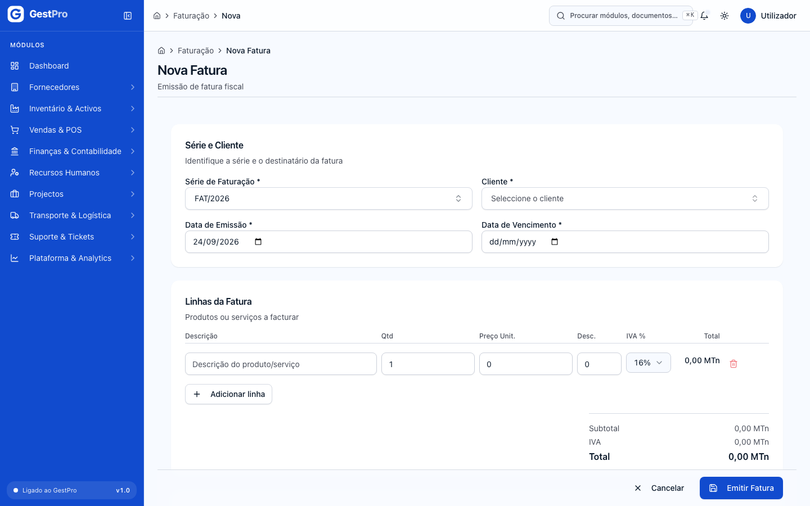

**Antes de começar**
- Precisa da permissão de emitir faturas (perfis Administrador, Gestor e Financeiro).
- O seu endereço de e-mail tem de estar confirmado (ver [Erros frequentes](#erros-frequentes)).
- O cliente tem de existir (ver [Vendas e POS](04-vendas-e-pos.md)).

**Passos**
1. Vá a **Faturação** e clique em **Nova Fatura**.
2. Em **Cliente e datas**, escolha o **Cliente**. Pode escrever parte do nome ou do código do cliente para o encontrar.
3. Preencha a **Data de Emissão** e a **Data de Vencimento**. O vencimento não pode ser anterior à emissão. A fatura é numerada na série activa de faturas do ano da data de emissão.
4. Em **Linhas da Fatura**, preencha cada linha: **Descrição**, **Qtd**, **Preço Unit.**, **Desc.** (desconto em valor) e **IVA %** (16% ou 0% (isento)). Numa linha a **0% (isento)** aparece o campo obrigatório **Motivo de isenção \*** — escreva a base legal (ex.: «Isento nos termos do artigo 9.º do Código do IVA»); sem ele a fatura não é emitida. Use **Adicionar linha** para mais linhas. O **Subtotal**, o **IVA** e o **Total** são actualizados à medida que escreve.
5. Se quiser, escreva notas para o cliente em **Observações**.
6. Clique em **Emitir Fatura**.

**Resultado**
Aparece a mensagem «Fatura emitida com sucesso.» e volta à lista. A fatura fica no estado **Emitida**, com o número seguinte da série (por exemplo `FAT/2026/000105`). A partir daqui não pode ser alterada.

**Efeitos noutros módulos**
- **Contabilidade:** ao emitir, o sistema cria automaticamente o lançamento no diário de vendas: débito em Clientes c/c (411), crédito em Vendas (711) e, se houver IVA, crédito em IVA liquidado (44331). Veja [Contabilidade](05-contabilidade.md).
- **Tesouraria:** o valor por receber entra na projecção na data de vencimento.
- **Apuramento do IVA:** a partir de Janeiro de 2026, um mês com linhas de fatura a 0 % é recusado no apuramento do IVA, por depender do pro rata (ver [Como apurar o IVA](05-contabilidade.md#como-apurar-o-iva-de-um-período)).

### Como consultar uma fatura

<!-- captura: 06-faturacao-caixa-tesouraria/faturas-lista.png | /faturacao -->
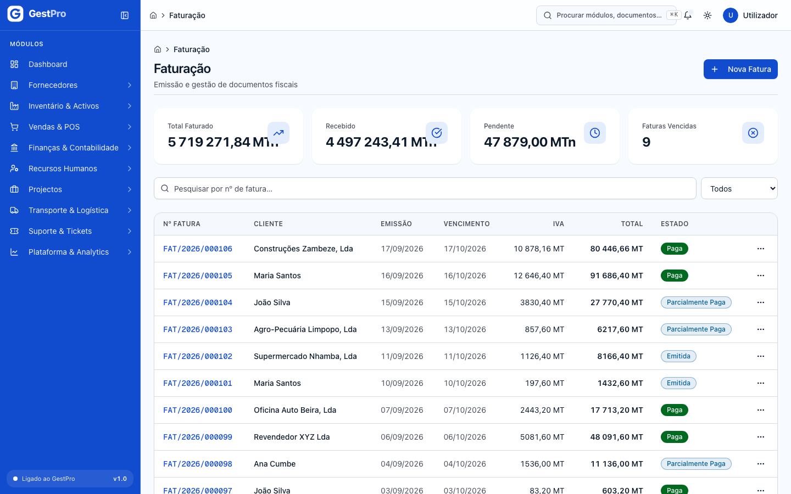

1. Em **Faturação**, clique em **Ver todas as faturas**.
2. No topo vê **Total Faturado**, **Recebido**, **Pendente** e **Faturas Vencidas**.
3. Filtre por **Estado** ou pesquise por nº de fatura.
4. Clique numa linha (ou em **⋯ › Ver detalhe**).

<!-- captura: 06-faturacao-caixa-tesouraria/fatura-detalhe.png | /faturacao >primeiro -->
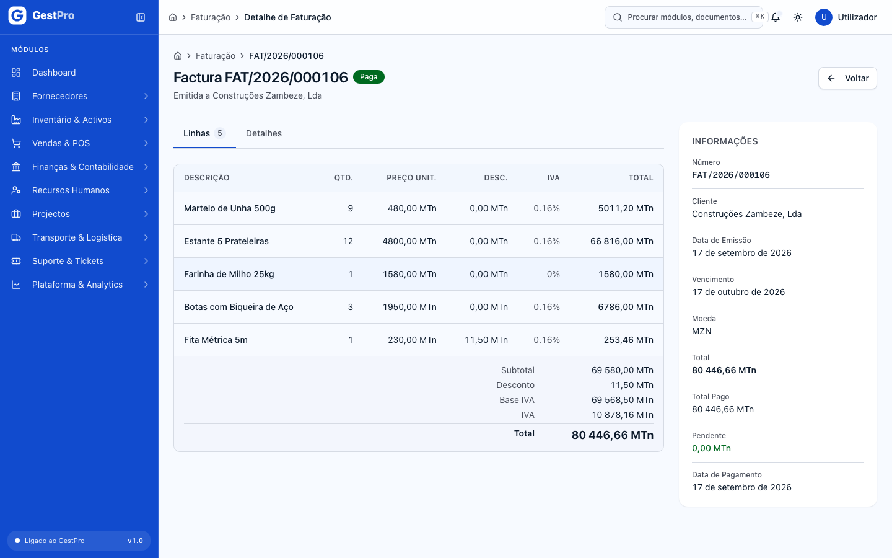

O detalhe mostra o **Número**, **Cliente**, **Data de Emissão**, **Vencimento**, **Moeda**, **Total**, **Total Pago** e **Pendente**. O separador **Linhas** tem cada linha e os totais (**Subtotal**, **Desconto**, **Base IVA**, **IVA**, **Total**); o separador **Detalhes** tem as observações e o **Hash de integridade** do documento (as faturas mais antigas, emitidas antes de o sistema o gravar, não o têm e o campo não aparece).

**PDF fiscal:** no detalhe da fatura, **Descarregar PDF** gera o PDF fiscal (emitente e adquirente com NUIT, linhas — com o motivo de isenção nas linhas a 0 % —, resumo de IVA por taxa, totais e o hash de integridade, quando existe), a partir do documento emitido.

Na lista, o menu **⋯** de cada fatura também tem **Descarregar PDF**.

### Como registar o pagamento de uma fatura

**Antes de começar**
- Permissão de registar pagamento de factura (Administrador, Gestor, Financeiro).
- Para receber em **Numerário**, permissão de operar o caixa e **o seu caixa aberto** (o dinheiro entra na sua sessão). Para as outras formas, permissão de movimentar contas bancárias e uma conta bancária activa do tipo certo. Administrador, Gestor e Financeiro têm as duas permissões.
- O período contabilístico da data do pagamento tem de estar aberto.

**Passos**
1. Abra a fatura em **Faturação** (estado **Emitida**, **Parcialmente Paga** ou **Vencida**) e clique **Registar pagamento**.
2. Confira o resumo («Total … · pago … · pendente …») e o **Valor**, que vem com o valor em aberto. Para um pagamento parcial, escreva um valor menor.
3. Indique a **Data do pagamento** (não pode ser anterior à emissão da fatura).
4. Escolha a **Forma de pagamento**: Transferência bancária, Cheque, M-Pesa, e-Mola ou Numerário. Para as quatro primeiras, escolha a **Conta bancária** — transferência e cheque mostram contas correntes, de poupança ou a prazo; M-Pesa e e-Mola só carteiras móveis.
5. Clique **Registar pagamento**.

**Resultado:** «Pagamento da factura ‹número› registado.» A fatura passa a **Paga** se o pendente chegar a zero, ou a **Parcialmente Paga**. Um valor acima do pendente é recusado.

**Efeitos noutros módulos**
- **Contabilidade:** lançamento «Recebimento da factura ‹número›», com a data do pagamento: débito **111 Caixa** (numerário, diário de Caixa) ou da conta contabilística da conta bancária (diário de Banco); crédito **411 Clientes c/c**.
- **Caixa:** em numerário, um movimento **Recebimento** na sua sessão — conta para o saldo esperado no fecho.
- **Tesouraria:** o valor recebido sai das entradas previstas e passa a saldo.

> **Nota:** o pagamento regista-se no detalhe da fatura em **Faturação**; o ecrã de faturas de **Vendas & POS** só tem o PDF.

### Como marcar uma fatura como vencida

A partir do **dia seguinte** ao vencimento, uma fatura **Emitida** ou **Parcialmente Paga** mostra o botão **Marcar como vencida** (permissão de gerir faturas: Administrador, Gestor, Financeiro).

1. Clique **Marcar como vencida**.
2. Confirme em **Marcar como vencida** («O prazo de pagamento já passou. A factura passa ao estado Vencida e continua a aceitar pagamentos.»).

**Resultado:** «Factura ‹número› marcada como vencida». A fatura continua a aceitar pagamentos. O sistema **não** marca as faturas como vencidas sozinho: faça-o na rotina de cobranças (por exemplo, todas as segundas-feiras, filtrando a lista por **Emitida**).

### Como criar e enviar uma cotação

<!-- captura: 06-faturacao-caixa-tesouraria/cotacoes-lista.png | /faturacao/cotacoes -->
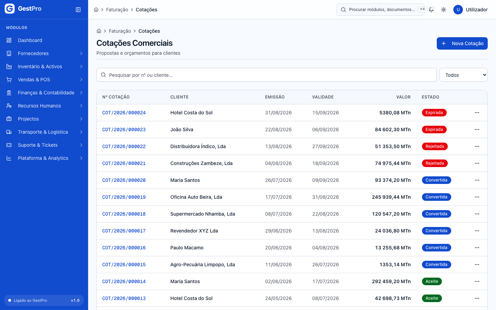

**Antes de começar**
- Precisa da permissão de criar cotações (Administrador, Gestor, Financeiro).

**Passos**
1. Em **Faturação**, clique em **Cotações** e depois em **Nova Cotação**.
2. Em **Cliente**, pesquise por código, nome ou NUIT e escolha o cliente.
3. Preencha a **Data de Emissão** e a **Data de Validade** (a validade tem de ser posterior à emissão). A cotação é numerada na série activa de cotações do ano da data de emissão.
4. Preencha as **Linhas da Cotação** como numa fatura.
5. Se quiser, preencha **Condições Comerciais** (prazo de entrega, forma de pagamento, garantias) e **Observações**.
6. Clique em **Criar Cotação**.
7. Abra a cotação na lista e clique em **Enviar** quando a entregar ao cliente.

**Resultado**
A cotação nasce em **Rascunho**. Depois de **Enviar**, fica **Enviada**, e aparece a mensagem «<número> enviada ao cliente.»

### Como registar a resposta do cliente a uma cotação

1. Abra a cotação (estado **Enviada**).
2. Se o cliente aceitou, clique em **Aceitar**. A cotação passa a **Aceite**.
3. Se o cliente recusou, clique em **Rejeitar**, escreva o **Motivo** (por exemplo «preço acima do orçamento do cliente») e confirme. A cotação fica **Rejeitada** e deixa de poder ser convertida. Nada se apaga.

### Como converter uma cotação em proforma

1. Abra a cotação (estado **Aceite**) e clique em **Converter em proforma**.
2. Confirme em **Converter em proforma**. A proforma tem a data de hoje e é numerada na série activa de proformas do ano corrente.

**Resultado**
É criada uma proforma com as mesmas linhas e valores, em **Rascunho**, e abre-se o seu detalhe. A cotação fica **Convertida** e não volta atrás. Se a cotação ainda não estiver aceite, o ecrã diz «Só uma cotação aceite pelo cliente se converte em proforma. Envie-a e registe a aceitação primeiro.»

### Como criar uma proforma e convertê-la em fatura

1. Em **Faturação**, clique em **Proformas** e depois em **Nova Proforma**, ou converta uma cotação (ver acima).
2. Escolha o **Cliente** (pesquisa por código, nome ou NUIT) e preencha a **Data de Emissão**, **Data de Validade** e as **Linhas da Proforma**. Clique em **Criar Proforma**. A proforma é numerada na série activa de proformas do ano da data de emissão.
3. Abra a proforma e clique em **Enviar** quando a entregar ao cliente.
4. Quando o cliente aceitar, clique em **Aceitar**.
5. Clique em **Converter em factura** e confirme em **Converter em factura**. A fatura tem a data de hoje e é numerada na série activa de faturas do ano corrente.

**Resultado**
É emitida uma fatura com as mesmas linhas e valores, já no estado **Emitida**, com data de hoje e **vencimento a 30 dias**. A proforma fica **Convertida**. A mensagem é «<proforma> convertido — <número da fatura>.» e abre-se o detalhe da fatura. Cotações e proformas não pedem motivo de isenção: na fatura convertida, as linhas a 0 % levam o texto legal fixo «Isento de IVA nos termos do Código do IVA.» (ou, se a empresa estiver no regime de isenção, «Isento de IVA — sujeito passivo enquadrado no regime de isenção (Código do IVA).»).

**Efeitos noutros módulos:** a fatura convertida é emitida como qualquer outra — gera no mesmo momento o lançamento no diário de vendas (débito 411, crédito 711 e 44331) e entra na projecção de tesouraria na data de vencimento.

### Como emitir uma nota de crédito

1. Em **Faturação**, clique em **Notas de Crédito** e depois em **Nova Nota de Crédito**.
2. Em **Factura a creditar**, pesquise pelo número e escolha a fatura original. A lista só mostra faturas que ainda têm valor por creditar; cada opção mostra o número, a data e o saldo («… · saldo …»).
3. Preencha a **Data de Emissão** e o **Motivo**. A nota de crédito é numerada na série activa de notas de crédito do ano da data de emissão.
4. Em **Linhas da Nota de Crédito**, indique os itens e valores a creditar. Uma linha a 0 % pede também o **Motivo de isenção**, como na fatura.
5. Clique em **Emitir Nota de Crédito**.

**Resultado**
A nota de crédito fica **Emitida**, com número da série `NC`, e aparece a mensagem «Nota de crédito emitida com sucesso.» Não é possível emitir uma nota de crédito sobre uma fatura cancelada.

**Efeitos noutros módulos**
- **Contabilidade:** é criado automaticamente o lançamento contabilístico da nota de crédito.

### Como liquidar uma nota de crédito

**Antes de começar:** permissão *Liquidar nota de crédito* (Administrador, Gestor, Financeiro). A nota tem de estar **Emitida**. A liquidação é sempre pelo total da nota.

1. Em **Notas de Crédito**, abra a nota (**Ver detalhe** no menu ⋯) e clique em **Liquidar**.
2. Escolha a **Forma**:
   - **Compensação na factura** (seguida do número da factura original) — abate o valor da nota ao que o cliente ainda deve nessa fatura. Só aparece se a fatura estiver por pagar (Emitida, Parcialmente paga ou Vencida) e o saldo em aberto for pelo menos o total da nota; o saldo é mostrado.
   - **Devolução ao cliente** — o dinheiro sai para o cliente. Escolha a **Forma de pagamento** e, se não for numerário, a **Conta bancária**. Em numerário é preciso ter o caixa aberto. Só aparece a quem tem permissão de operar o caixa (numerário) ou de registar movimentos bancários (restantes formas).
3. Indique a **Data da liquidação** (não pode ser anterior à data de emissão da nota) e confirme.

**Resultado:** a nota fica **Liquidada**, com a forma e a data visíveis no detalhe.
- **Compensação:** o valor pago da fatura original sobe o total da nota (fica Paga ou Parcialmente paga). Não há lançamento novo: a nota já tinha abatido o crédito ao cliente quando foi emitida.
- **Devolução:** é criado o lançamento Clientes c/c (411) a débito contra a conta do meio (Caixa ou a conta bancária) a crédito; em numerário, fica também registada a saída na sessão de caixa.

### Como cancelar uma nota de crédito, uma proforma ou uma cotação

**Antes de começar:** permissões *Cancelar nota de crédito*, *Cancelar factura proforma* ou *Gerir cotações*, conforme o documento (Administrador, Gestor e Financeiro têm as três).

1. Abra o documento e clique em **Cancelar** (também no menu ⋯ da lista).
2. Escreva o **Motivo** (obrigatório, pelo menos 3 caracteres) e confirme.

**Resultado:** o documento fica **Cancelado**, com o motivo visível no detalhe. As observações do documento não são alteradas.
- **Nota de crédito:** só se cancela uma nota **Emitida**. O lançamento contabilístico dela é **estornado** com a data de hoje, e o detalhe liga ao estorno. Não é possível cancelar uma nota cujo mês (da data de emissão) já tenha o **IVA apurado ou declarado**, ou cujo período esteja fechado — nesse caso, corrija com uma **nota de débito**.
- **Proforma:** cancela-se em Rascunho, Enviada ou Aceite.
- **Cotação:** só em **Rascunho**. Uma cotação já enviada ao cliente não se cancela: use **Rejeitar**.

## Caixa

<!-- captura: 06-faturacao-caixa-tesouraria/caixa-sessoes.png | /caixa -->
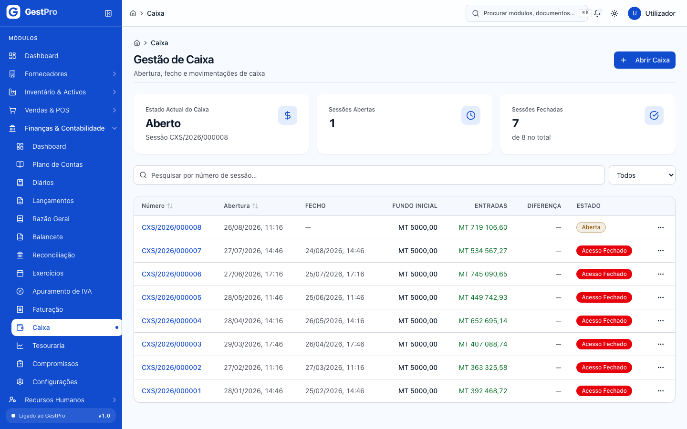

A página **Gestão de Caixa** mostra no topo o **Estado Actual do Caixa** (o **seu** caixa: Aberto ou Fechado, com o número da sessão), quantas **Sessões Abertas** e **Sessões Fechadas** há, e por baixo a lista de sessões com **Número**, **Abertura**, **Fecho**, **Fundo Inicial**, **Entradas**, **Diferença** e **Estado**.

Cada utilizador tem a sua própria sessão: só pode ter uma sessão aberta de cada vez.

### Como abrir o caixa

<!-- captura: 06-faturacao-caixa-tesouraria/caixa-abertura.png | /caixa/abertura -->
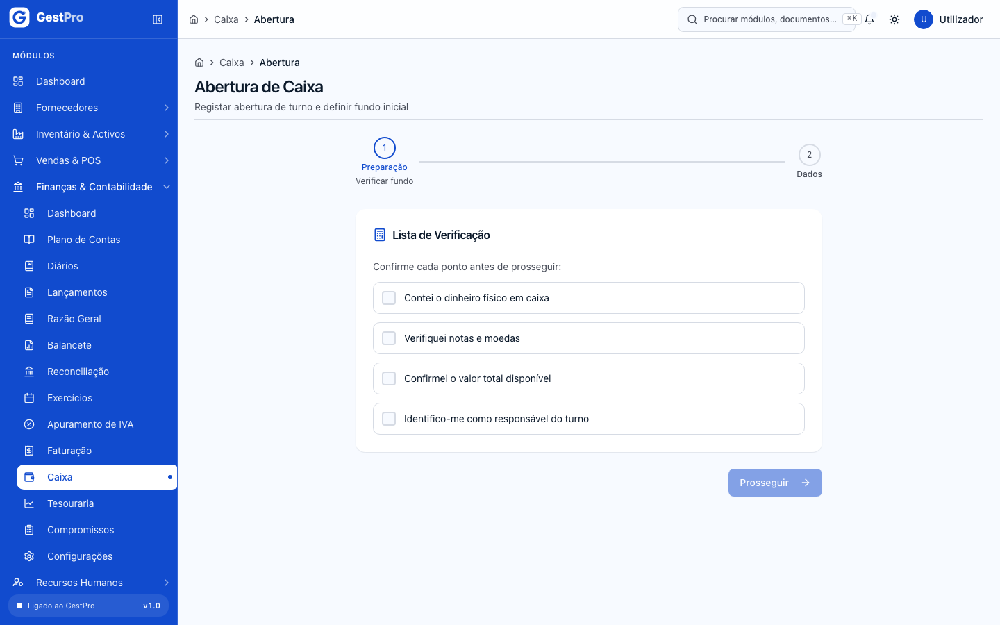

**Antes de começar**
- Precisa da permissão de abrir caixa (Administrador, Gestor, Financeiro, Operador).
- Não pode ter já uma sessão aberta.

**Passos**
1. Em **Caixa**, clique em **Abrir Caixa**.
2. No passo **Preparação**, confirme os quatro pontos da **Lista de Verificação** (contou o dinheiro, verificou notas e moedas, confirmou o total, identifica-se como responsável do turno). Clique em **Prosseguir**.
3. No passo **Dados**, escreva o **Fundo Inicial (MZN)**, o dinheiro físico que está na gaveta, e, se quiser, **Observações**.
4. Confira o **Resumo da Abertura** e clique em **Confirmar Abertura**.

**Resultado**
Aparece «Caixa aberto com sucesso!». É criada uma sessão **Aberta** com o número seguinte da série `CXS`, e o primeiro movimento da sessão é a **Abertura**, com o valor do fundo.

### Relação com o POS

O POS trabalha sempre sobre o caixa aberto do utilizador:

- Se abrir o **POS** sem ter o caixa aberto, o sistema leva-o para **Abertura de Caixa** e, depois de abrir, volta ao POS.
- Cada venda finalizada no POS regista na sessão um movimento **Venda** só pela parte paga em **dinheiro**; cartão,
  M-Pesa, e-Mola, transferência e crédito não passam pela gaveta (entram na contabilidade pelo documento da venda).
- **Anular venda** devolve a parte em dinheiro pela sessão de caixa aberta **de quem anula** (não pela sessão onde a venda foi feita, que no dia seguinte já pode estar fechada).
- Uma devolução com reembolso feita com o caixa aberto regista um movimento **Devolução** (saída).
- Fechar ou cancelar a sessão de caixa fecha também as sessões do POS abertas sobre ela; com vendas pendentes no POS, o fecho é recusado até as concluir ou anular.

Veja o funcionamento do POS em [Vendas e POS](04-vendas-e-pos.md).

> **Nota:** o movimento **Venda** na sessão é só o valor pago em **Dinheiro**. Uma venda por cartão, M-Pesa, e-Mola, transferência ou a crédito não aumenta o dinheiro esperado na gaveta — por isso não cria diferença no fecho.

### Como consultar uma sessão de caixa

<!-- captura: 06-faturacao-caixa-tesouraria/caixa-sessao-detalhe.png | /caixa >primeiro -->
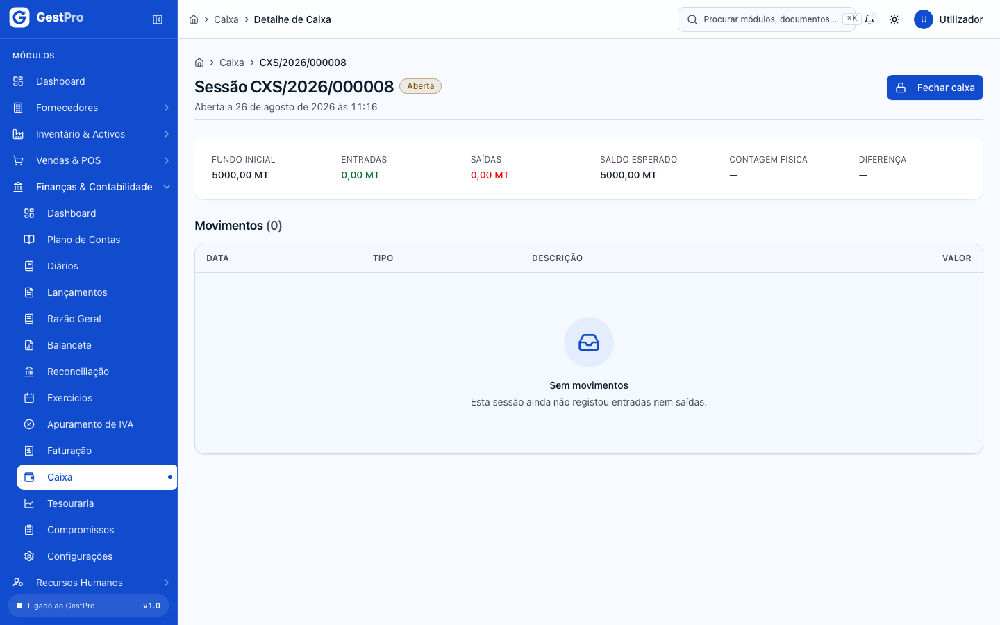

1. Em **Caixa**, clique numa sessão (ou em **⋯ › Ver detalhe**).
2. O resumo mostra **Fundo inicial**, **Entradas**, **Saídas**, **Saldo esperado** (ou **Saldo esperado ao fecho**, numa sessão fechada), **Contagem física** e **Diferença**.
3. Em **Movimentos** vê todas as entradas e saídas, por ordem, com **Data**, **Tipo**, **Descrição** e **Valor** (com sinal + ou −).

Numa sessão **aberta**, é neste detalhe que vê os valores do momento (serve como leitura do caixa a meio do turno): **Entradas**, **Saídas** e **Saldo esperado** são calculados a partir dos movimentos registados até agora. Na lista de sessões, a coluna **Entradas** de uma sessão aberta também já mostra o valor do momento; a **Diferença** só fica preenchida depois do fecho.

Numa sessão **aberta**, o topo do detalhe tem os botões **Registar reforço**, **Registar sangria**, **Cancelar sessão** e **Fechar caixa** — cada um só aparece a quem tem a permissão correspondente (o Operador vê os três primeiros; **Cancelar sessão** é só de Administrador, Gestor e Financeiro), e **Cancelar sessão** só enquanto a sessão não tiver movimentos além da abertura.

### Como fechar o caixa

<!-- captura: 06-faturacao-caixa-tesouraria/caixa-fecho.png | /caixa/fechamento -->
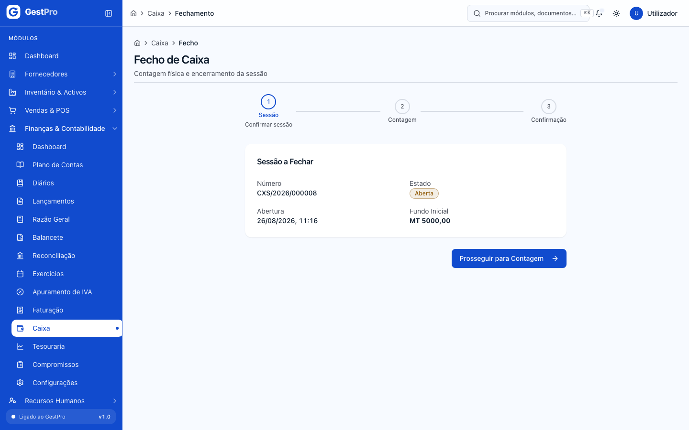

**Antes de começar**
- Precisa da permissão de fechar caixa (Administrador, Gestor, Financeiro, Operador).
- Só pode fechar a **sua** sessão aberta. Mesmo que clique em **Fechar caixa** na sessão de outra pessoa, o ecrã de fecho mostra a sua própria sessão (ou «Sem Sessão Activa»).

**Passos**
1. Em **Caixa**, clique em **⋯ › Fechar caixa** na sua sessão aberta, ou em **Fechar caixa** no detalhe dela.
2. No passo **Sessão**, confira a **Sessão a Fechar** (Número, Estado, Abertura, Fundo Inicial) e clique em **Prosseguir para Contagem**.
3. No passo **Contagem**, escreva quantas unidades tem de cada nota (**Nota MT 1000** a **Nota MT 20**) e de cada moeda (**Moeda MT 10** a **Moeda MT 1**). O **Total Contado** é somado sozinho. Clique em **Prosseguir**.
4. No passo **Confirmação**, confira o **Resumo do Fecho** — **Fundo Inicial**, **Saldo Esperado** (fundo inicial + entradas − saídas do turno), **Total Contado** e **Diferença** —, escreva, se quiser, **Observações do Fecho** e clique em **Confirmar Fecho**.

**Resultado**
Aparece «Caixa fechado com sucesso!». A sessão fica **Fechada** (e não pode voltar a abrir). O sistema grava o total contado, os totais de entradas e saídas, a diferença, e regista um movimento **Fecho**.

**Efeitos noutros módulos**
- **POS:** as sessões do POS abertas sobre este caixa são fechadas ao mesmo tempo. Se alguma tiver vendas pendentes, o fecho é recusado («Existem N vendas pendentes nas sessões POS deste caixa. Conclua-as ou anule-as antes de encerrar o caixa.») e nada muda: conclua ou anule essas vendas no POS e volte a fechar.
- **Tesouraria:** enquanto está aberta, a sessão conta para o saldo de abertura da projecção de tesouraria pelo seu saldo do momento (fundo inicial + entradas − saídas).

### Como registar uma sangria ou um reforço

Uma **sangria** retira dinheiro da gaveta a meio do turno (por exemplo, para o cofre); um **reforço** junta dinheiro (por exemplo, trocos).

**Antes de começar**
- A sessão tem de estar **Aberta**.
- Precisa da permissão de sangria ou de reforço de caixa (Administrador, Gestor, Financeiro e Operador têm as duas — ver [Perfis de sistema](00-primeiros-passos.md#perfis-de-sistema)).

**Passos**
1. Em **Caixa**, abra a sessão e clique em **Registar sangria** (ou **Registar reforço**).
2. Escreva o **Valor (MZN) \*** (maior que zero) e o **Motivo \*** (por exemplo «Depósito no cofre às 13h»).
3. Clique em **Registar sangria** (ou **Registar reforço**).

**Resultado:** «Sangria registada.» (ou «Reforço registado.») e volta ao detalhe da sessão. O movimento aparece em **Movimentos** com a descrição «Sangria: ‹motivo›» (ou «Reforço: ‹motivo›»): a sangria conta nas **Saídas**, o reforço nas **Entradas**, e o **Saldo esperado** do fecho já os inclui. Não lançam nada na contabilidade.

### Como cancelar uma sessão de caixa

Serve para uma sessão aberta por engano, antes de qualquer venda ou movimento. Com movimentos, o caminho é o fecho.

**Antes de começar**
- Só a pessoa que abriu a sessão a pode cancelar, e precisa da permissão de cancelar sessões de caixa (Administrador,
  Gestor e Financeiro). O Operador não a tem: uma sessão que ele abriu por engano não se cancela, fecha-se.
- A sessão tem de estar **Aberta** e sem movimentos além da **Abertura**.

**Passos**
1. Em **Caixa**, abra a sessão e clique em **Cancelar sessão**.
2. Escreva o **Motivo \*** e clique em **Cancelar sessão**.
3. Confirme em **Confirmar cancelamento** («A sessão fica CANCELADA e deixa de aceitar movimentos. Esta operação não se desfaz.»).

**Resultado:** «Sessão ‹número› cancelada.» A sessão fica **Cancelada**, com o motivo nas observações, e pode abrir uma nova. As sessões do POS abertas sobre ela são fechadas, como no fecho.

## Tesouraria

<!-- captura: 06-faturacao-caixa-tesouraria/tesouraria-projecao.png | /tesouraria -->
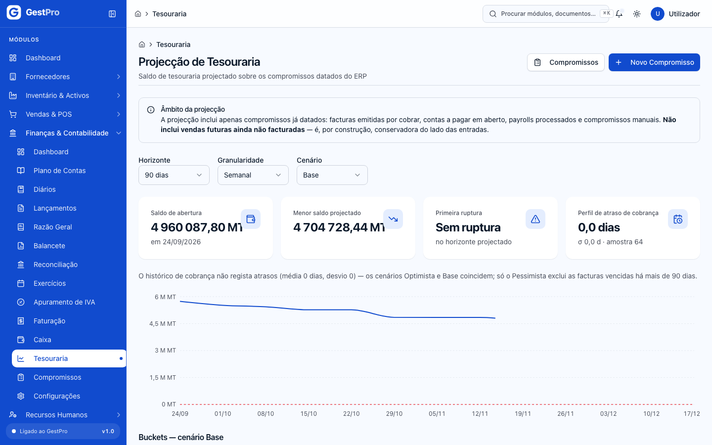

A página **Projecção de Tesouraria** responde a uma pergunta: com o que já está combinado, quanto dinheiro vamos ter em cada semana (ou dia, ou mês)?

**O que entra na projecção** (é isto que diz a caixa **Âmbito da projecção**, no topo da página):

| Entra | Como |
|---|---|
| Saldo de abertura | Dinheiro das sessões de caixa abertas (fundo inicial + entradas − saídas do turno, incluindo as vendas já feitas) + saldo contabilístico das contas bancárias activas, à data de hoje |
| Faturas por cobrar | Entradas: o valor ainda por pagar das faturas **Emitidas**, **Parcialmente Pagas** e **Vencidas**, na data de vencimento (ajustada pelo cenário) |
| Contas a pagar em aberto | Saídas, na data de vencimento (ver [Fornecedores e serviços](02-fornecedores-e-servicos.md)) |
| Payrolls processados | Saídas, pelo custo total para a empresa (ver [Recursos Humanos](07-recursos-humanos.md)) |
| Compromissos activos | Entradas ou saídas, na data prevista e nas repetições (ver [Compromissos](#compromissos)) |

**Não entra:** vendas futuras que ainda não foram faturadas. Por isso a projecção é, de propósito, conservadora do lado das entradas: não é uma previsão de vendas.

Valores já vencidos e ainda por pagar ou receber entram no **primeiro período**, assinalados com «N em atraso»: não desaparecem da projecção.

As contas bancárias são configuradas em **Finanças & Contabilidade › Contas Bancárias** (ver [Contabilidade](05-contabilidade.md#como-criar-desactivar-ou-reactivar-uma-conta-bancária)); uma conta desactivada sai do saldo de abertura. O saldo delas vem sempre dos lançamentos contabilísticos das respectivas contas; duas contas bancárias ligadas à mesma conta contabilística contam uma só vez.

### Como ler a projecção

1. Abra **Tesouraria**.
2. Escolha os filtros:
   - **Horizonte**: quantos dias projectar.
   - **Granularidade**: **Diária** (até 90 dias), **Semanal** (até 180 dias) ou **Mensal** (até 365 dias). Se mudar para uma granularidade com limite menor, o horizonte é reduzido automaticamente.
   - **Cenário**: **Optimista**, **Base** ou **Pessimista** (ver abaixo).
3. Leia os quatro indicadores:
   - **Saldo de abertura**: o dinheiro disponível hoje.
   - **Menor saldo projectado**: o ponto mais baixo no horizonte. Fica a vermelho, com «saldo negativo no horizonte», se for negativo.
   - **Primeira ruptura**: a data de início do primeiro período com saldo negativo, ou **Sem ruptura**.
   - **Perfil de atraso de cobrança**: atraso médio dos clientes, com o desvio (σ) e o número de faturas usadas (amostra).
4. Veja o gráfico **Saldo projectado** e a tabela de períodos, com **Período**, **Entradas**, **Saídas**, **Saldo inicial** e **Saldo final**. Os períodos com saldo final negativo aparecem destacados com um sinal de aviso.

Os filtros ficam no endereço da página: pode copiar o endereço e enviá-lo a um colega para ele ver a mesma projecção.

**Os três cenários**

| Cenário | Recebimentos de clientes | Pagamentos |
|---|---|---|
| **Optimista** | Na data de vencimento | Na data de vencimento |
| **Base** | Vencimento + atraso médio histórico | Na data de vencimento |
| **Pessimista** | Vencimento + atraso médio + um desvio; faturas vencidas há mais de 90 dias são excluídas | Na data de vencimento |

Avisos que pode ver na página:
- **Não há origens de saldo configuradas**: a empresa não tem nenhuma conta bancária activa nem sessão de caixa aberta. O saldo de abertura aparece como «—», porque zero seria um valor falso.
- **Histórico de cobrança insuficiente**: há menos de 20 faturas pagas nos últimos 180 dias. O cenário **Base** usa então a hipótese optimista, e o título da tabela diz «cenário Optimista».
- Se os clientes não tiverem atrasos registados, uma nota explica que os cenários Optimista e Base coincidem.

A **demonstração de fluxos de caixa (DFC)**, que mostra o que aconteceu ao dinheiro num período já decorrido, está em **Finanças & Contabilidade › Demonstração de Fluxos de Caixa** (ver [Contabilidade](05-contabilidade.md#ecrãs)).

## Compromissos

<!-- captura: 06-faturacao-caixa-tesouraria/compromissos-lista.png | /tesouraria/compromissos -->
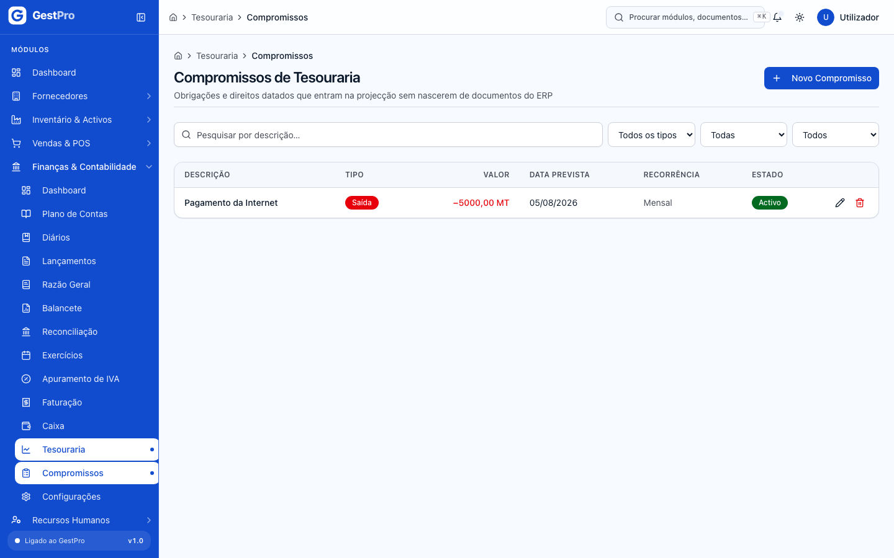

A página **Compromissos de Tesouraria** lista as obrigações e os direitos que entram na projecção sem nascerem de documentos do sistema: rendas, prestações de empréstimos, financiamentos a receber, etc. Pode filtrar por **Tipo** (Entrada, Saída), **Recorrência** (Única, Mensal, Trimestral, Anual) e **Estado** (Activo, Inactivo), e pesquisar por descrição.

Não registe aqui o que já existe no sistema (faturas, contas a pagar, salários): contaria duas vezes.

### Como registar um compromisso

<!-- captura: 06-faturacao-caixa-tesouraria/compromisso-novo.png | /tesouraria/compromissos/novo -->
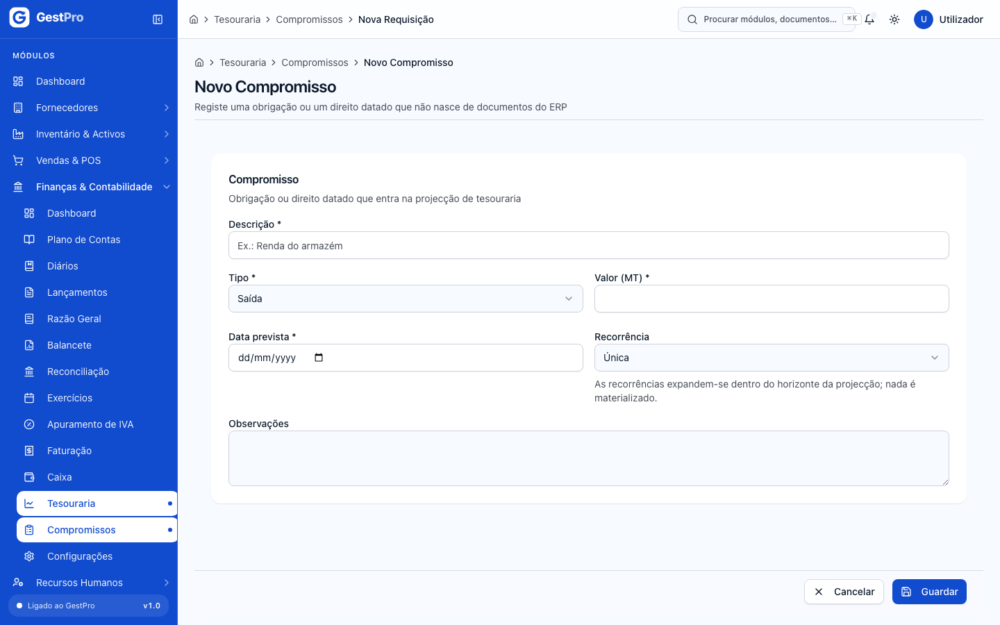

**Antes de começar**
- Precisa da permissão de escrita de tesouraria (Administrador, Gestor, Financeiro).

**Passos**
1. Em **Compromissos** (ou em **Tesouraria**), clique em **Novo Compromisso**.
2. Preencha:
   - **Descrição** (por exemplo «Renda do armazém»);
   - **Tipo**: **Entrada** (dinheiro a receber) ou **Saída** (dinheiro a pagar);
   - **Valor (MT)**;
   - **Data prevista**;
   - **Recorrência**: **Única**, **Mensal**, **Trimestral** ou **Anual**;
   - **Fim da recorrência** (só aparece se não for Única; opcional: sem fim, repete-se até ao fim do horizonte da projecção);
   - **Observações** (opcional).
3. Clique em **Guardar**.

**Resultado**
Aparece «Compromisso criado.» e volta à lista. O compromisso entra de imediato na projecção. As repetições são calculadas na hora, dentro do horizonte escolhido, e não ficam gravadas uma a uma.

### Como alterar, desactivar ou eliminar um compromisso

1. Na lista, clique no compromisso (ou no botão de editar).
2. Altere o que precisar. Para o tirar da projecção sem o apagar, desligue **Activo — entra na projecção**.
3. Clique em **Guardar**. Aparece «Compromisso actualizado.»

Para eliminar, clique no botão de eliminar na linha e confirme em **Eliminar compromisso?**. O compromisso deixa de entrar na projecção; a eliminação não afecta nenhum documento do sistema.

## Estados

### Fatura

| Estado | Significado | Pode passar a | Quem |
|---|---|---|---|
| Emitida | Documento fiscal emitido, por pagar | Paga, Parcialmente Paga (**Registar pagamento**) · Vencida (**Marcar como vencida**, a partir do dia seguinte ao vencimento) | Administrador, Gestor, Financeiro |
| Parcialmente Paga | Parte do valor recebida | Paga, Parcialmente Paga (novo pagamento) · Vencida | Administrador, Gestor, Financeiro |
| Vencida | Passou o vencimento e foi marcada como vencida | Paga, Parcialmente Paga (pagamento) | Administrador, Gestor, Financeiro |
| Paga | Totalmente recebida | — (final) | — |
| Cancelada | Anulada | — (final) | — |

### Nota de crédito

| Estado | Significado | Pode passar a | Quem |
|---|---|---|---|
| Emitida | Documento fiscal emitido | Liquidada, Cancelada | Financeiro, Gestor, Administrador (**Liquidar**, **Cancelar**) |
| Liquidada | O crédito foi usado ou devolvido | — (final) | — |
| Cancelada | Anulada, com motivo | — (final) | — |

### Cotação

| Estado | Significado | Pode passar a | Quem |
|---|---|---|---|
| Rascunho | Criada, ainda não enviada | Enviada, Cancelada | Financeiro, Gestor, Administrador (**Enviar**, **Cancelar**) |
| Enviada | Entregue ao cliente | Aceite, Rejeitada (Expirada ainda sem botão) | Financeiro, Gestor, Administrador (**Aceitar**, **Rejeitar**) |
| Aceite | Cliente aceitou | Convertida | Financeiro, Gestor, Administrador (**Converter em proforma**) |
| Rejeitada | Cliente recusou (com motivo) | — (final) | — |
| Convertida | Deu origem a uma proforma | — (final) | — |
| Expirada | Passou a validade | — (final) | — |
| Cancelada | Anulada, com motivo | — (final) | — |

### Proforma

| Estado | Significado | Pode passar a | Quem |
|---|---|---|---|
| Rascunho | Criada, ainda não enviada | Enviada, Cancelada | Financeiro, Gestor, Administrador (**Enviar**, **Cancelar**) |
| Enviada | Entregue ao cliente | Aceite, Cancelada (Expirada ainda sem botão) | Financeiro, Gestor, Administrador (**Aceitar**, **Cancelar**) |
| Aceite | Cliente aceitou | Convertida, Cancelada | Financeiro, Gestor, Administrador (**Converter em factura**, **Cancelar**) |
| Convertida | Deu origem a uma fatura | — (final) | — |
| Expirada | Passou a validade | — (final) | — |
| Cancelada | Anulada, com motivo | — (final) | — |

### Sessão de caixa

| Estado | Significado | Pode passar a | Quem |
|---|---|---|---|
| Aberta | Turno em curso; recebe movimentos (incluindo sangrias e reforços) | Fechada (**Fechar caixa**) · Cancelada (**Cancelar sessão**, só sem movimentos além da abertura) | O próprio utilizador que a abriu, com a permissão correspondente |
| Fechada | Turno encerrado com contagem | — (final) | — |
| Cancelada | Anulada sem movimentos além da abertura, com motivo | — (final) | — |

### Compromisso

| Estado | Significado | Pode passar a | Quem |
|---|---|---|---|
| Activo | Entra na projecção | Inactivo | Financeiro, Gestor, Administrador |
| Inactivo | Guardado, mas fora da projecção | Activo | Financeiro, Gestor, Administrador |

## Erros frequentes

| Mensagem mostrada | Porquê | O que fazer |
|---|---|---|
| «Para emitir documentos fiscais é preciso confirmar o endereço de e-mail da conta…» | O seu e-mail ainda não foi confirmado. Faturas, notas de crédito e conversões de proforma em fatura são documentos fiscais e ficam bloqueados | Abra a ligação de confirmação que recebeu por e-mail (o aviso no painel reenvia-a). Se já confirmou há pouco, termine a sessão e entre de novo |
| «Série activa para tipo "…" no ano … não encontrada. Crie a série … primeiro.» | Não há série activa para o ano da data do documento | Abra o exercício desse ano em **Contabilidade › Exercícios** (ver [Contabilidade](05-contabilidade.md)); para o ano seguinte, use também **Criar séries de ‹ano›** em **Séries de documento**; para documentos de faturação, pode ainda criar ou activar a série nesse ecrã |
| «Já existe uma série activa de … para …. Desactive-a primeiro.» | Tentou criar ou activar uma segunda série do mesmo tipo e ano | Desactive a série actual em **Séries de documento** e repita |
| «Já existe uma série com este prefixo para o mesmo tipo e ano.» | Já há uma série (activa ou não) com o mesmo tipo, ano e prefixo | Escolha outro prefixo, ou active a série existente |
| «Esta série já numerou documentos: não pode ser alterada nem eliminada.» (ou a série não mostra **Editar** nem **Eliminar**) | A série já numerou documentos | Só pode activá-la ou desactivá-la; para mudar de prefixo, desactive-a e crie uma nova |
| «Cliente não encontrado» | O cliente escolhido já não existe nesta empresa | Confirme o cliente em **Clientes** e escolha-o de novo |
| «Data de vencimento não pode ser anterior à data de emissão» | Datas trocadas na fatura | Corrija a **Data de Vencimento** |
| «Data de validade deve ser posterior à data de emissão» | Datas trocadas na cotação ou proforma | Corrija a **Data de Validade** |
| «Taxa de IVA inválida — use 0.16 (16%) ou 0 (isento)» | Taxa de IVA fora das permitidas | Escolha 16% ou 0% |
| «Indique o motivo de isenção (IVA a 0%).» (no campo) ou «A linha N tem IVA a 0%: indique o motivo de isenção ou de não sujeição.» | Uma linha a 0 % não tem **Motivo de isenção** | Escreva a base legal da isenção no campo **Motivo de isenção** da linha |
| «Não é possível emitir NC para factura cancelada» | A fatura original está cancelada | Confirme a fatura a creditar |
| «Factura original não encontrada» | A fatura escolhida em **Factura a creditar** já não existe nesta empresa | Escolha-a de novo na lista |
| «Só uma cotação aceite pelo cliente se converte em proforma…» / «Só uma proforma aceite pelo cliente se converte em factura…» | O documento ainda não foi aceite | Clique em **Enviar** e depois em **Aceitar** |
| «Já existe uma sessão de caixa aberta (CXS/…)» | Já tem um caixa aberto | Use a sessão aberta ou feche-a primeiro |
| «Sem Sessão Activa» / «É necessário ter uma sessão de caixa aberta para efectuar o fecho.» | Não tem nenhuma sessão aberta em seu nome | Clique em **Abrir Caixa** |
| «Fundo inicial não pode ser negativo» | Valor negativo no fundo inicial | Escreva zero ou um valor positivo |
| «Existem N vendas pendentes nas sessões POS deste caixa. Conclua-as ou anule-as antes de encerrar o caixa.» | Ao fechar ou cancelar a sessão de caixa, há vendas por concluir no POS | Conclua ou anule essas vendas no POS e repita |
| «Esta sessão de caixa pertence a outro utilizador» | Tentou cancelar (ou fechar) a sessão de outra pessoa | Só quem abriu a sessão a fecha ou cancela |
| «Sessão não pode ser cancelada com movimentos registados. Use o fecho.» | A sessão já tem movimentos além da abertura | Feche a sessão com a contagem ([Como fechar o caixa](#como-fechar-o-caixa)) |
| «Valor deve ser positivo» | Valor do compromisso, da sangria ou do reforço é zero ou negativo | Escreva um valor maior que zero |
| «Motivo obrigatório» | Sangria, reforço ou cancelamento de sessão sem motivo | Escreva o motivo |
| «Data de fim da recorrência não pode ser anterior à data prevista.» | O fim da recorrência é antes da primeira data | Corrija o **Fim da recorrência** |
| «Compromisso único não admite data de fim de recorrência.» | Recorrência **Única** com data de fim | Apague o fim ou escolha outra recorrência |
| «Granularidade … admite no máximo … dias.» | Horizonte maior do que o permitido para a granularidade (endereço alterado à mão) | Use os filtros da página |

## Perguntas frequentes

**Porque é que o saldo da Tesouraria não é igual ao que o banco me diz?**
A tesouraria usa o saldo **contabilístico** das contas bancárias, isto é, o que foi lançado na contabilidade. Movimentos do banco ainda não lançados não aparecem. Para acertar os dois, use a reconciliação bancária (ver [Contabilidade](05-contabilidade.md)).

**Posso apagar uma fatura emitida por engano?**
Não. Uma fatura emitida é um documento fiscal: corrige-se com uma nota de crédito.

**Porque é que a projecção não mostra as vendas que esperamos fazer no próximo mês?**
Porque só inclui o que já está datado e combinado. Se tiver um recebimento certo que ainda não foi faturado (por exemplo, um contrato), registe-o como compromisso de **Entrada**.

**Duas pessoas podem ter o caixa aberto ao mesmo tempo?**
Sim. Cada utilizador tem a sua sessão; o que não pode é ter duas sessões abertas em seu nome.
