# 7. Recursos Humanos

> **Para quem:** administrador, gestor, financeiro (salários); operador para registar assiduidade, ausências e pedidos de férias · **Onde:** menu › Recursos Humanos

## Para que serve

O módulo de Recursos Humanos guarda a ficha de cada colaborador e o dia-a-dia da equipa: assiduidade, ausências, férias, avaliações de desempenho e formações. É também aqui que se processa a folha de salários do mês: o GestPro calcula o INSS e o IRPS de cada colaborador, gera o lançamento contabilístico, emite os recibos de vencimento em PDF e os mapas mensais de INSS e IRPS.

O recrutamento (vagas e candidatos) e os benefícios também existem, mas não aparecem no menu lateral. Para lá chegar, escreva o endereço no navegador (ver [Ecrãs](#ecrãs)).

## Conceitos

| Termo | O que é |
|---|---|
| Colaborador | Pessoa com contrato na empresa. Tem código, documentos de identificação (BI/DIRE, NUIT, NISS), contrato e salário base. |
| Período aquisitivo | O período que dá direito a um saldo de dias de férias. Um pedido de férias pertence sempre a um período aquisitivo. |
| Ausência | Falta, atestado médico ou licença de um colaborador, num intervalo de datas. |
| Registo de assiduidade | A entrada e a saída de um colaborador num dia. Só pode haver um registo por colaborador e por dia. |
| Folha mensal | O conjunto dos salários de um mês, com um processamento para cada colaborador activo. Tem um ciclo de vida próprio (Pendente → Processado → Pago). |
| Payroll individual | O cálculo do salário de um colaborador num mês: proventos, descontos, salário líquido e custo para a empresa. Abre como **Recibo de Vencimento**. |
| Tabelas INSS / IRPS | As taxas de INSS (trabalhador e entidade) e os escalões de IRPS configurados no sistema, cada um com a sua **vigência** (data de início e de fim). O cálculo de um mês usa sempre a tabela em vigor nesse mês. |
| Encargo patronal | O INSS pago pela empresa. Não sai do salário do colaborador: soma-se ao custo total da entidade. |
| Vaga / Candidatura | Uma posição em aberto e o processo de cada candidato nessa vaga, organizado por etapas. |
| Benefício | Regalia do catálogo (seguro, subsídio, plano de pensões…) que pode ser atribuída a colaboradores. |

## Ecrãs

| Menu | Endereço | Para que serve |
|---|---|---|
| Recursos Humanos › Dashboard | /rh | Indicadores (colaboradores, férias e avaliações pendentes, ausências de hoje), colaboradores recentes e acesso rápido. |
| Recursos Humanos › Colaboradores | /rh/colaboradores | Lista, pesquisa e filtro por estado. **Novo Colaborador** em /rh/colaboradores/novo. |
| — | /rh/colaboradores/[id] | Ficha do colaborador. **Editar**, **Activar**, **Desactivar**, **Arquivar Colaborador**. |
| Recursos Humanos › Assiduidade | /rh/assiduidade | Registos de presença do mês e filtro por tipo. **Registar** em /rh/assiduidade/novo. |
| Recursos Humanos › Ausências | /rh/ausencias | Lista de ausências. **Registar Ausência** em /rh/ausencias/nova. |
| Recursos Humanos › Avaliações | /rh/avaliacoes | Avaliações de desempenho. **Nova Avaliação** em /rh/avaliacoes/nova. |
| Recursos Humanos › Payroll | /rh/payroll | **Processamento de Salários**: folhas mensais e payrolls individuais. |
| — | /rh/payroll/novo | **Processar Folha Mensal** (mês e ano). |
| — | /rh/payroll/[id] | **Recibo de Vencimento** de um colaborador, com **Descarregar PDF**. |
| Recursos Humanos › Férias | /rh/ferias | Pedidos de férias. **Nova Solicitação** em /rh/ferias/nova. |
| Recursos Humanos › Formações | /rh/formacoes | Acções de formação. **Nova Formação** em /rh/formacoes/nova. |
| (sem menu) | /rh/recrutamento | Vagas e processos de selecção. **Nova Vaga** em /rh/recrutamento/vagas/nova. |
| (sem menu) | /rh/beneficios | Catálogo de benefícios. **Novo Benefício** em /rh/beneficios/novo, **Atribuir** em /rh/beneficios/atribuir. |
| (sem menu) | /rh/documentos | Lista (só de consulta) dos documentos dos colaboradores. |

<!-- captura: 07-recursos-humanos/dashboard.png | /rh -->
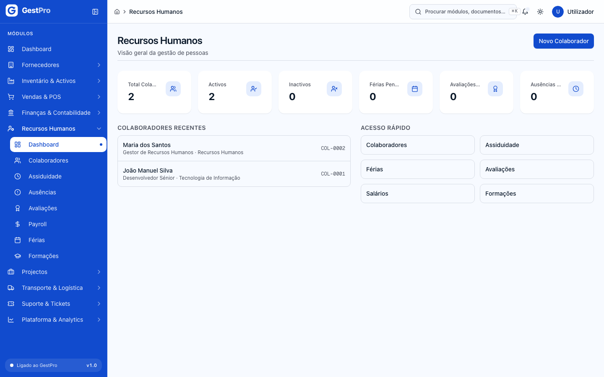

## Tarefas

### Como registar um novo colaborador

**Antes de começar:** precisa da permissão para admitir colaboradores (perfis Administrador e Gestor). Tenha à mão o BI/DIRE, o NUIT e, se existir, o NISS.

1. Abra **Recursos Humanos › Colaboradores** e clique em **Novo Colaborador**.
2. Preencha as secções:
   - **Dados Básicos:** Código (ex.: COL-001), Nome Completo, Data de Nascimento, Género, Estado Civil, Nacionalidade.
   - **Documentos de Identificação:** BI/DIRE, NUIT (9 dígitos), NISS (11 dígitos, opcional).
   - **Contactos:** Email, Telefone, Rua, Número, Bairro, Cidade, Província, Província de Naturalidade, Distrito de Naturalidade.
   - **Contacto de Emergência:** Nome, Parentesco, Telefone.
   - **Dados Profissionais:** Data de Admissão, Tipo de Contrato (Efectivo, Termo Certo, Estágio, Temporário, Prestação de Serviços), Regime de Trabalho (Tempo Integral, Tempo Parcial), Salário Base (MZN).
3. Clique em **Guardar Colaborador**.

**Resultado:** aparece a mensagem "Colaborador criado com sucesso!" e volta à lista.

> **Atenção:** este formulário não tem campos de departamento, cargo nem subsídios. Os subsídios de alimentação e de transporte só se indicam quando o colaborador é admitido a partir do recrutamento (ver [Como admitir um candidato](#como-admitir-um-candidato-como-colaborador)).

<!-- captura: 07-recursos-humanos/colaboradores.png | /rh/colaboradores -->
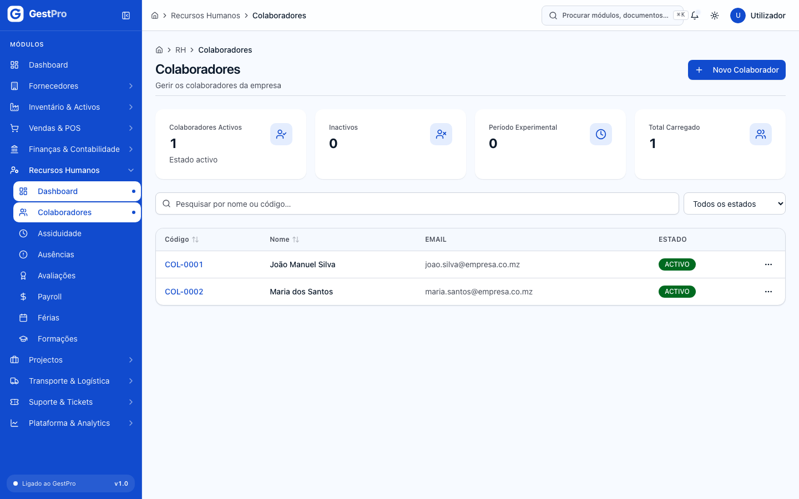

<!-- captura: 07-recursos-humanos/colaborador-novo.png | /rh/colaboradores/novo -->
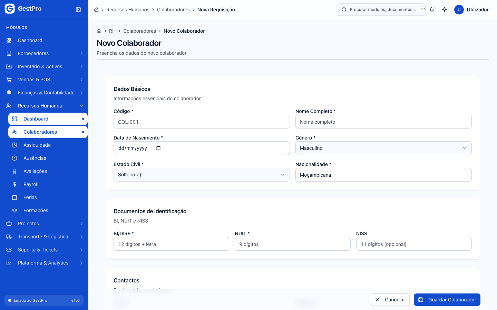

### Como editar, activar ou desactivar um colaborador

1. Na lista, clique na linha do colaborador, ou use o menu **⋯** › **Ver detalhe**.
2. Na ficha pode:
   - clicar em **Editar** para alterar o Nome Completo, o Email, o Telefone, o Tipo de Contrato, o Regime de Trabalho e o Salário Base (MZN), e depois clicar em **Guardar Alterações**;
   - clicar em **Activar**, que aparece quando o colaborador está em Período Experimental, Férias ou Afastado;
   - clicar em **Desactivar**, que aparece quando o colaborador está Activo ou em Período Experimental.
3. Um colaborador Inactivo já não pode ser editado. Só pode ser arquivado com **Arquivar Colaborador** › **Confirmar Arquivamento**. O arquivamento não se pode desfazer neste ecrã e só o Administrador o pode fazer.

**Efeitos noutros módulos:** só os colaboradores **Activos** entram no processamento da folha de salários. Um colaborador acabado de admitir pelo recrutamento fica em Período Experimental e só entra na folha depois de ser activado.

<!-- captura: 07-recursos-humanos/colaborador-detalhe.png | /rh/colaboradores >primeiro -->
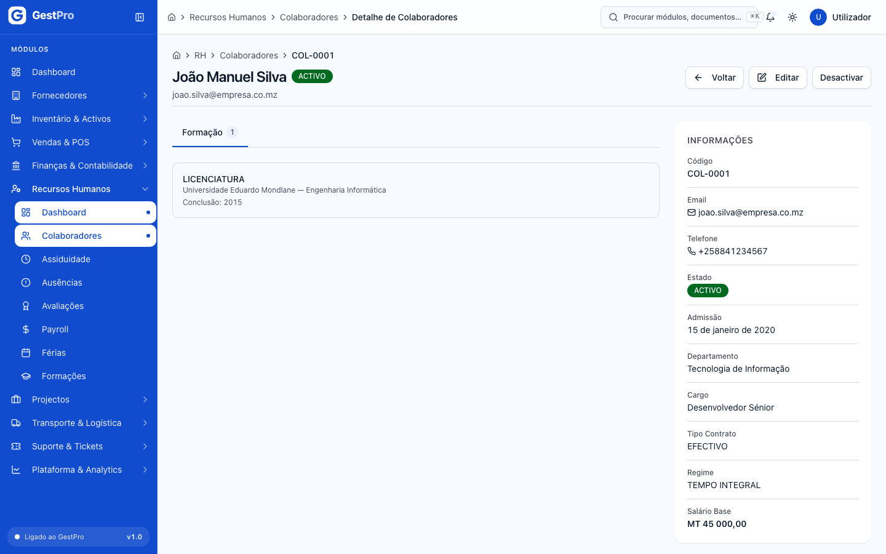

### Como registar a assiduidade de um dia

1. Abra **Recursos Humanos › Assiduidade** e clique em **Registar**.
2. Escolha o **Colaborador** (só aparecem os Activos) e o **Tipo**: Normal, Feriado, Fim de Semana, Férias ou Ausência.
3. Indique a **Data**, a **Entrada** e a **Saída**. A **Saída Almoço**, o **Retorno Almoço** e as **Observações** são opcionais.
4. Clique em **Registar**.

**Resultado:** "Assiduidade registada com sucesso." O sistema calcula as horas trabalhadas entre a Entrada e a Saída e conta como **Horas Extra** tudo o que passar das 8 horas.

**Efeitos noutros módulos:** as horas extra do mês entram no salário quando a folha é processada. O valor por hora é o salário base a dividir por 208 horas mensais, com uma majoração de 50%.

<!-- captura: 07-recursos-humanos/assiduidade-registar.png | /rh/assiduidade/novo -->
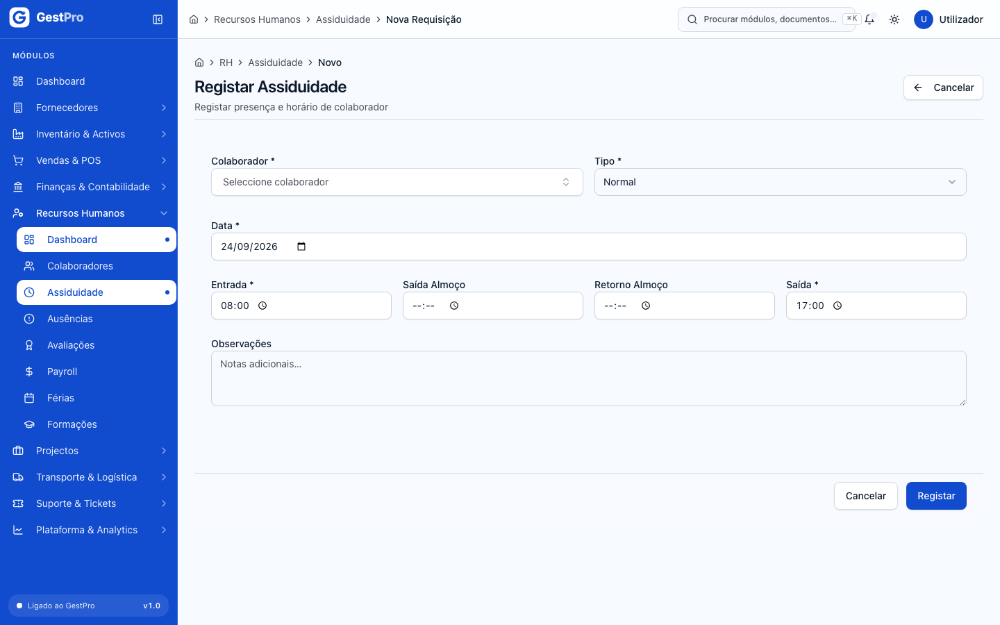

### Como registar uma ausência

1. Abra **Recursos Humanos › Ausências** e clique em **Registar Ausência**.
2. Em **ID do Colaborador**, cole o identificador interno do colaborador. É o código longo que aparece no fim do endereço da ficha dele (por exemplo, /rh/colaboradores/**clx…**).
3. Escolha o **Tipo**: Falta, Atestado Médico, Licença de Maternidade, Licença de Paternidade, Licença sem Vencimento, Licença por Nojo, Licença por Casamento ou Outro.
4. Indique a **Data de Início** e a **Data de Fim**, e marque **Justificada** se for o caso. A **Justificativa** e as **Observações** são opcionais.
5. Clique em **Registar Ausência**.

**Resultado:** "Ausência registada com sucesso." A ausência fica **Pendente**.

> **Atenção:** hoje não existe nenhum botão para aprovar ou rejeitar uma ausência, por isso todas ficam Pendentes. Isto conta para os salários: a folha só desconta as faltas **aprovadas** não justificadas e as licenças sem vencimento, pelo que na prática ainda não se desconta nenhuma falta.

### Como pedir férias

**Antes de começar:** o colaborador tem de ter um período aquisitivo de férias. Se não houver nenhum, o ecrã mostra "Sem períodos aquisitivos". Não existe ecrã para criar períodos aquisitivos: os que existem vêm da configuração inicial.

1. Abra **Recursos Humanos › Férias** e clique em **Nova Solicitação**.
2. Em **Período aquisitivo**, escolha o colaborador e o período. A lista mostra também o saldo de dias.
3. Indique o **Início**, o **Fim**, os **Dias a gozar** e o **Tipo** (Integral, Fracionada, Abono Pecuniário). As **Observações** são opcionais.
4. Clique em **Submeter**.

**Resultado:** "Solicitação de férias submetida com sucesso." O pedido fica **Pendente**. Os dias pedidos ficam reservados: deixam de contar para o saldo disponível de novos pedidos, mas só são descontados ao saldo quando o pedido for aprovado.

> **Atenção:** o ecrã de Férias ainda não tem botões para aprovar, rejeitar ou cancelar pedidos, pelo que ficam Pendentes. O indicador **Férias Pendentes** do Dashboard conta estes pedidos.

<!-- captura: 07-recursos-humanos/ferias-nova.png | /rh/ferias/nova -->
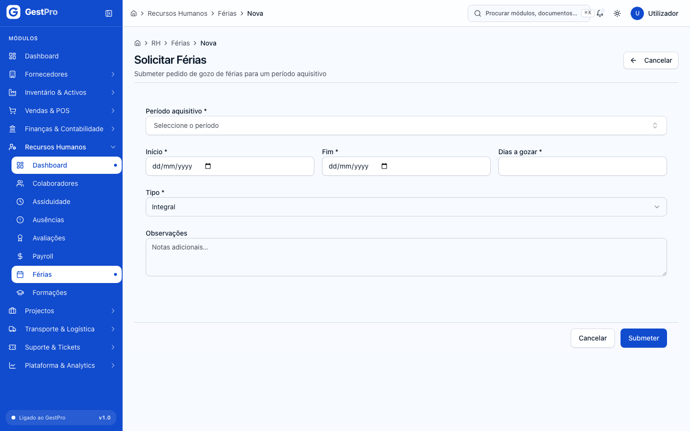

### Como fazer uma avaliação de desempenho

1. Abra **Recursos Humanos › Avaliações** e clique em **Nova Avaliação**.
2. Em **Identificação**, escolha o **Colaborador Avaliado**, o **Tipo** (Desempenho, Competências, 360°, Probatório), o **Período** (ex.: 2026-S1) e a **Data de Início**.
3. Clique em **Adicionar Critério** e preencha o **Nome**, a **Descrição** (opcional), a **Nota (0–10)** e o **Peso (%)**. Depois clique em **Adicionar**. Repita para cada critério. É obrigatório ter pelo menos um.
4. Em **Síntese**, pode preencher **Pontos Fortes**, **Pontos a Desenvolver**, **Plano de Acção** (um por linha) e **Comentários Gerais**.
5. Clique em **Criar Avaliação**.
6. Na ficha da avaliação, clique em **Iniciar** (passa a Em Andamento) e depois em **Concluir**. Para anular, use **Cancelar** › **Cancelar Avaliação**. Enquanto está Pendente ou Em Andamento, pode alterar os critérios e a síntese em **Editar** › **Guardar Alterações**.

**Resultado:** ao **Concluir**, o sistema calcula a **Nota Final**, que é a média das notas pesada pelos pesos dos critérios.

> **Atenção:** o avaliador é gravado como o utilizador com sessão iniciada, mas o sistema espera que o avaliador seja um colaborador. Por isso, a criação da avaliação pode falhar com "Erro interno". Se isto acontecer, contacte o suporte.

### Como organizar uma formação e inscrever colaboradores

1. Abra **Recursos Humanos › Formações** e clique em **Nova Formação**.
2. Em **Informações Gerais**, preencha o Título, a Descrição, a Categoria, a Modalidade (Presencial, Online, Híbrido), o Instrutor / Entidade e o Local.
3. Em **Planeamento**, preencha a Data de Início, a Data de Fim, a Carga Horária (horas), as Vagas Disponíveis, o Custo Total (MZN) e as Observações.
4. Clique em **Guardar Formação**. Abre-se a ficha da formação, no estado **Planeada**.
5. No separador **Participantes**, escolha o colaborador em **Inscrever colaborador** e clique em **Inscrever**. Só se pode inscrever enquanto a formação está Planeada ou Em Andamento e há vagas livres.
6. Use **Iniciar** e **Concluir** para fazer avançar a formação. Para anular, use **Cancelar** › **Cancelar Formação**.

**Resultado:** "Formação criada com sucesso!" e, depois, "Colaborador inscrito com sucesso." A coluna **Participantes** da lista mostra quantos inscritos há.

<!-- captura: 07-recursos-humanos/formacao-nova.png | /rh/formacoes/nova -->
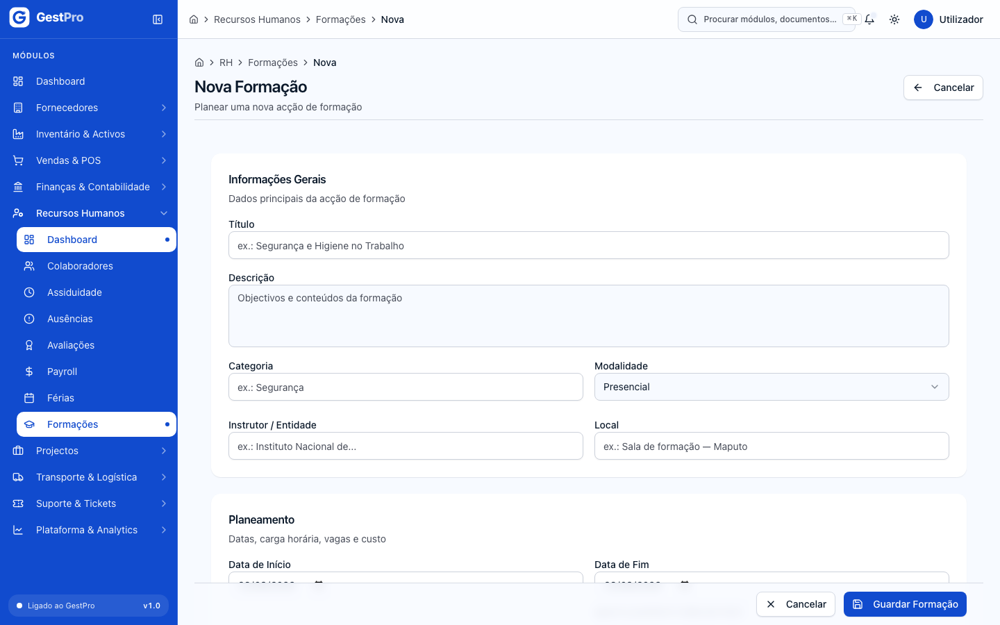

### Como processar a folha de salários do mês

**Antes de começar:**
- Precisa da permissão de processar salários (perfis Administrador, Gestor e Financeiro).
- Confirme que os colaboradores a pagar estão **Activos** e que o salário base de cada um está certo.
- Registe a assiduidade do mês, para que as horas extra sejam pagas.
- Têm de existir uma tabela de INSS e escalões de IRPS em vigor no mês. As tabelas vêm da configuração do sistema e não se escrevem à mão.

1. Abra **Recursos Humanos › Payroll** e clique em **Processar Folha do Mês**.
2. Escolha o **Mês** e o **Ano**. O ecrã mostra quantos colaboradores activos vão ser processados.
3. Clique em **Processar Folha do Mês**.

**Resultado:** aparece "Folha MM/AAAA processada para N colaborador(es)." Em **Folhas mensais** surge o mês com o total de colaboradores, o Bruto, o Líquido e o Custo total, no estado **Pendente**. Em **Payrolls individuais** aparece uma linha por colaborador.

Para cada colaborador, o sistema calcula:
- **Proventos:** salário base, os subsídios registados na ficha (alimentação, transporte, habitação, outros), as horas extras do mês e as comissões **aprovadas** no mês (ver [Vendas e POS](04-vendas-e-pos.md)). As comissões são ligadas ao colaborador pelo email: o email do colaborador tem de ser igual ao do utilizador vendedor.
- **Descontos:** INSS do trabalhador, IRPS (retenção na fonte) e faltas não remuneradas aprovadas, a 1/30 do salário base por dia.
- **Encargo patronal:** o INSS da entidade, que se soma ao custo total da empresa.

As taxas de INSS e os escalões de IRPS **não estão escritos no ecrã nem no manual**. Vêm das tabelas configuradas no sistema, cada uma com a sua vigência, e o cálculo de cada mês usa a tabela em vigor nesse mês. Quando a lei muda, carrega-se uma nova vigência e os meses anteriores continuam a usar a tabela antiga. Hoje não existe ecrã para gerir estas tabelas: peça ao administrador do sistema ou ao suporte para carregar uma nova vigência.

**Reprocessar:** enquanto a folha está **Pendente**, pode voltar a processar o mesmo mês. Os valores são recalculados, por exemplo depois de corrigir um salário ou registar mais assiduidade.

<!-- captura: 07-recursos-humanos/payroll-processar.png | /rh/payroll/novo -->
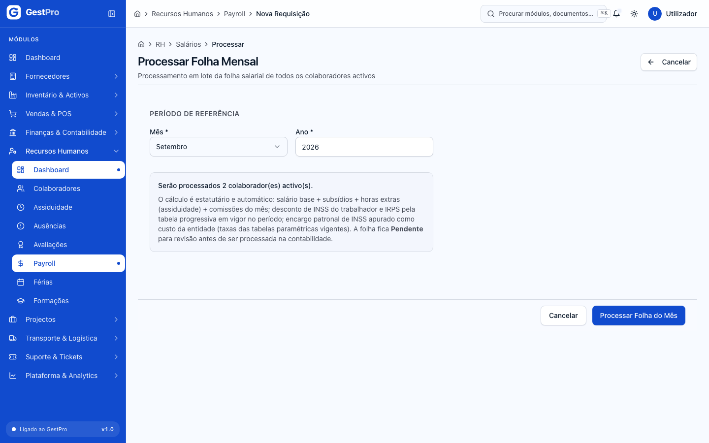

### Como confirmar a folha na contabilidade

Não há um passo de "aprovação" à parte. A folha Pendente é a fase de revisão, e confirmá-la é o passo seguinte.

1. Em **Recursos Humanos › Payroll**, reveja os recibos (clique numa linha de **Payrolls individuais**).
2. Na linha do mês, em **Folhas mensais**, clique em **Processar na contabilidade**.

**Resultado:** "Folha <mês> <ano> processada — lançamento contabilístico gerado." A folha e os payrolls passam a **Processado** e os valores ficam fixos: já não se recalculam.

**Efeitos noutros módulos:** gera um lançamento no diário de Salários, já lançado, com a data do processamento (ver [Contabilidade](05-contabilidade.md)):

| Conta | Débito | Crédito |
|---|---|---|
| 622 Remunerações dos trabalhadores | total bruto | |
| 623 Encargos sobre remunerações | INSS da entidade | |
| 449 Contribuições para o INSS | | INSS do trabalhador + INSS da entidade |
| 442 Impostos retidos na fonte | | IRPS |
| 451 Pessoal | | outros descontos (ex.: faltas) |
| 4622 Remunerações a pagar aos trabalhadores | | total líquido |

O período contabilístico da data de hoje tem de estar aberto.

### Como marcar a folha como paga

1. Na linha do mês (estado **Processado**), clique em **Marcar como paga**.

**Resultado:** "Folha <mês> <ano> marcada como paga." A folha e os payrolls passam a **Pago** e a data de pagamento fica registada no recibo.

**Efeitos noutros módulos:** gera o lançamento de pagamento, com débito em 4622 (Remunerações a pagar aos trabalhadores) e crédito em 121 (Depósitos à ordem), pelo total líquido e com a data de hoje. Por este ecrã, o pagamento não cria movimento no Caixa (ver [Faturação, Caixa e Tesouraria](06-faturacao-caixa-tesouraria.md)).

<!-- captura: 07-recursos-humanos/payroll.png | /rh/payroll -->
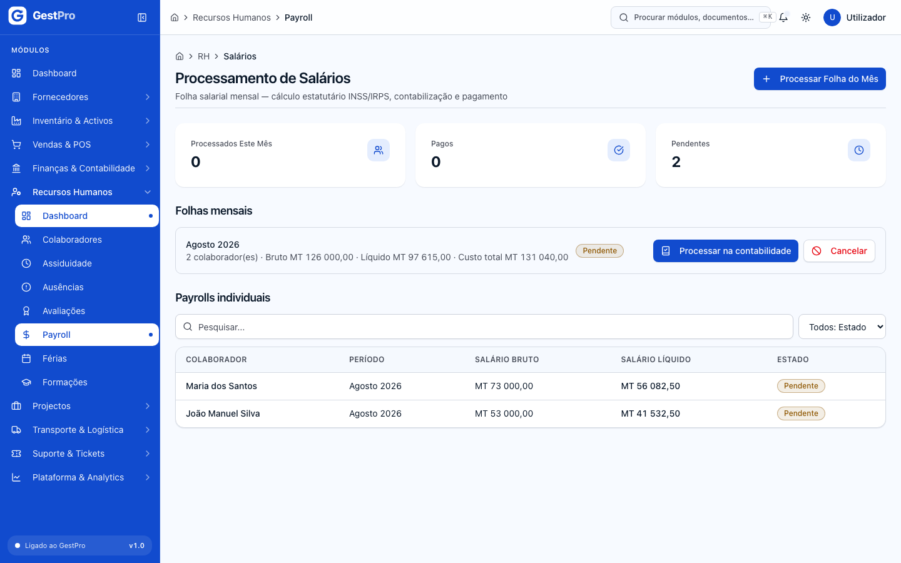

### Como cancelar uma folha

1. Na linha do mês (Pendente ou Processado), clique em **Cancelar**.
2. Escreva o **Motivo do cancelamento**. É obrigatório.
3. Clique em **Confirmar cancelamento**.

**Resultado:** "Folha <mês> <ano> cancelada." Todos os payrolls do mês passam a **Cancelado**. Se a folha já estava Processada, o lançamento contabilístico é **estornado**: não é apagado, é anulado por um lançamento inverso. Depois pode voltar a processar o mesmo mês. Uma folha **Paga** já não se pode cancelar.

### Como ver e descarregar o recibo de vencimento

1. Em **Payrolls individuais**, clique na linha do colaborador.
2. O **Recibo de Vencimento** mostra os dados do colaborador (NUIT, NISS, cargo, departamento, NIB), os **Proventos**, os **Descontos**, o **Salário líquido**, o **INSS entidade (encargo patronal)** e o **Custo total da entidade**.
3. Clique em **Descarregar PDF**. O ficheiro chama-se `recibo-<código>-<ano>-<mês>.pdf`.

<!-- captura: 07-recursos-humanos/recibo.png | /rh/payroll >primeiro -->
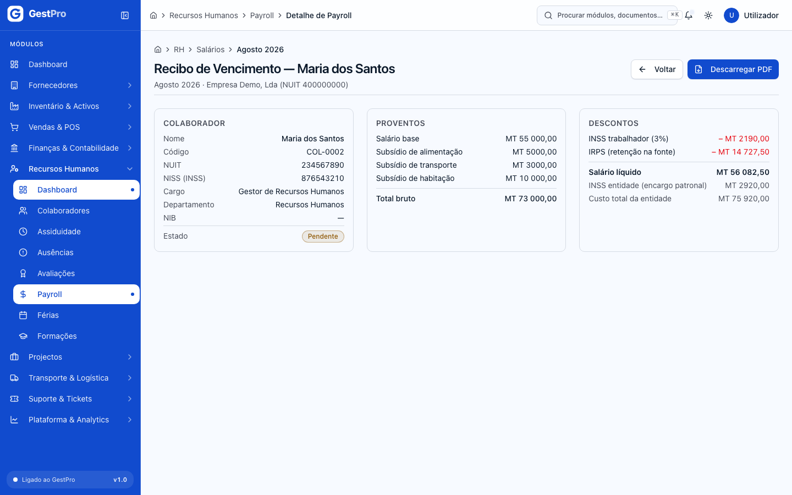

### Como obter os mapas mensais de INSS e IRPS

1. Na linha de uma folha **Processada** ou **Paga**, clique em **Mapa INSS** ou **Mapa IRPS**.
2. O navegador descarrega um ficheiro CSV (separado por `;`, que abre no Excel): `mapa-inss-AAAA-MM.csv` ou `mapa-irps-AAAA-MM.csv`.

- **Mapa INSS:** código, nome, NUIT, NISS, salário bruto, INSS do trabalhador, INSS da entidade e total, por colaborador.
- **Mapa IRPS:** código, nome, NUIT, salário bruto e IRPS retido.

Os mapas são um resumo para preparar as declarações. Não estão no formato oficial de submissão do INSS nem da Autoridade Tributária. Os mapas e os recibos em PDF contam para o limite de exportações por utilizador; se descarregar muitos seguidos, aguarde um minuto antes de tentar de novo.

### Como abrir uma vaga e gerir candidatos

1. Vá a **/rh/recrutamento** e clique em **Nova Vaga**.
2. Preencha:
   - **Informações Básicas:** Título, Descrição, Localização.
   - **Condições de Trabalho:** Regime, Tipo de Contrato, Número de Posições.
   - **Faixa Salarial** (opcional): Salário Mínimo e Salário Máximo (MZN).
3. Clique em **Criar Vaga**. A vaga fica em **Rascunho**.
4. Na vaga, use **Alterar Estado** › **Abrir Vaga**. Mais tarde pode usar **Iniciar Triagem**, **Fechar Vaga** ou **Cancelar Vaga**.
5. Com a vaga Aberta ou Em Triagem, abra o separador **Adicionar Candidato**. Preencha os **Dados do Candidato** (Nome Completo, Email, Telefone, BI e NUIT opcionais, Observações) e a **Candidatura** (Fonte / Origem, Pretensão Salarial). Depois clique em **Registar Candidatura**.
6. O separador **Pipeline** mostra os candidatos por etapa. Clique num candidato para abrir a candidatura.
7. Na candidatura, use **Mover Etapa** (**Mover para Triagem**, **Mover para Entrevista**, **Mover para Proposta**, ou **Rejeitar Candidato** / **Registar Desistência**).
8. No separador **Entrevistas**, preencha **Registar Nova Entrevista** com o Tipo, a Data e Hora, os Entrevistadores, a Avaliação (0-10), a Recomendação e o Parecer / Notas. Depois clique em **Registar Entrevista**.

<!-- captura: 07-recursos-humanos/vaga-detalhe.png | /rh/recrutamento >primeiro -->
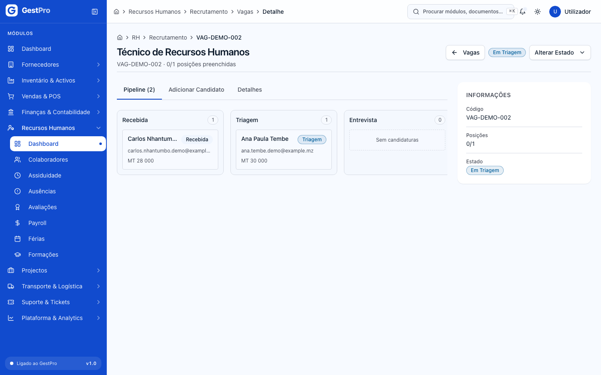

### Como admitir um candidato como colaborador

1. Mova a candidatura até à etapa **Proposta**.
2. Clique em **Admitir como Colaborador**.
3. Complete os dados:
   - **Identificação:** Nome Completo, Código de Colaborador, BI, NUIT, Data de Nascimento, Género, Estado Civil.
   - **Naturalidade e Nacionalidade.**
   - **Contactos.**
   - **Contacto de Emergência.**
   - **Contrato e Remuneração:** Data de Admissão, Tipo de Contrato, Regime, Salário Base, Subsídio Alimentação e Subsídio Transporte.
4. Clique em **Confirmar Admissão**.

**Resultado:** "Colaborador criado com sucesso!" e abre-se a ficha do novo colaborador, que fica em **Período Experimental**. A candidatura passa a **Contratado** e a vaga conta mais uma posição preenchida. Quando todas as posições estão preenchidas, a vaga fecha sozinha.

> **Atenção:** na etapa Proposta, **não** use **Mover Etapa › Marcar como Contratado**. Esta opção muda a etapa sem criar o colaborador, e depois já não é possível usar **Admitir como Colaborador**.

### Como criar e atribuir um benefício

1. Vá a **/rh/beneficios** e clique em **Novo Benefício**.
2. Preencha o Nome, o Tipo, a Periodicidade (Mensal, Trimestral, Anual, Pontual), o Fornecedor / Seguradora, o Custo Total (MZN), a parte da Empresa (MZN), o Desconto Colaborador (MZN), se é **Tributável (IRPS)** e a Descrição.
3. Clique em **Guardar**.
4. Na ficha do benefício, clique em **Atribuir**. Em **Colaborador**, cole o identificador interno do colaborador (tal como nas ausências). Indique a **Data de Início**, a **Data de Fim (opcional)** e, se quiser, valores próprios de **Comparticipação Empresa** e **Desconto Colaborador**. Em branco, estes valores são os do benefício.
5. Clique em **Atribuir Benefício**.

**Resultado:** "Benefício atribuído com sucesso". A atribuição aparece em **Colaboradores Atribuídos**.

> **Atenção:** os benefícios **ainda não entram no processamento salarial**, porque a folha não os lê. O botão **Editar** da ficha do benefício abre uma página que ainda não existe. Também não há botões para suspender ou terminar atribuições.

<!-- captura: 07-recursos-humanos/beneficios.png | /rh/beneficios -->
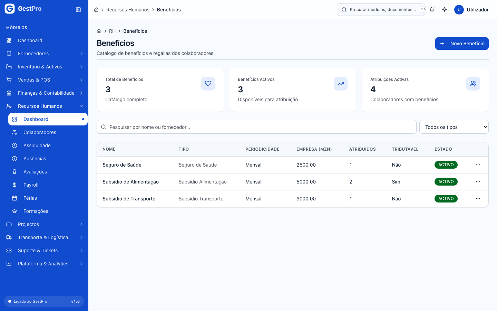

## Estados

### Colaborador

| Estado | Significado | Pode passar a | Quem |
|---|---|---|---|
| Período Experimental | Admitido pelo recrutamento, ainda em experiência | Activo, Inactivo | Administrador, Gestor |
| Activo | A trabalhar. Entra na folha de salários | Inactivo, Férias, Afastado | Administrador, Gestor |
| Férias | De férias (não há botão para este estado) | Activo | Administrador, Gestor |
| Afastado | Afastado temporariamente (não há botão para este estado) | Activo, Inactivo | Administrador, Gestor |
| Inactivo | Saiu da empresa. Já não se edita | — (só arquivar) | Administrador |

### Pedido de férias

| Estado | Significado | Pode passar a | Quem |
|---|---|---|---|
| Pendente | Submetido. Os dias ficam reservados | Aprovada, Rejeitada, Cancelada | Administrador, Gestor (ainda sem botão) |
| Aprovada | Os dias são descontados ao saldo | Cancelada | Administrador, Gestor (ainda sem botão) |
| Rejeitada | Recusado | — | — |
| Cancelada | Anulado. Se estava aprovado, os dias voltam ao saldo | — | — |

### Ausência

| Estado | Significado | Pode passar a | Quem |
|---|---|---|---|
| Pendente | Registada | Aprovada, Rejeitada | ainda sem botão |
| Aprovada | Confirmada. Se for falta não justificada ou licença sem vencimento, é descontada no salário | — | — |
| Rejeitada | Recusada | — | — |

### Avaliação e Formação

| Estado | Significado | Pode passar a | Quem |
|---|---|---|---|
| Pendente (avaliação) / Planeada (formação) | Criada | Em Andamento, Cancelada | Administrador, Gestor |
| Em Andamento | A decorrer | Concluída, Cancelada | Administrador, Gestor |
| Concluída | Terminada. Na avaliação, a Nota Final fica calculada | — | — |
| Cancelada | Anulada | — | — |

### Folha mensal e payroll

| Estado | Significado | Pode passar a | Quem |
|---|---|---|---|
| Pendente | Calculada, em revisão. Pode ser reprocessada | Processado, Cancelado | Administrador, Gestor, Financeiro |
| Processado | Lançada na contabilidade. Os valores ficam fixos | Pago, Cancelado (com estorno) | Administrador, Gestor, Financeiro |
| Pago | Pagamento lançado | — | — |
| Cancelado | Anulada. O mês pode ser processado de novo | — | — |

### Vaga

| Estado | Significado | Pode passar a | Quem |
|---|---|---|---|
| Rascunho | Criada, ainda sem candidaturas | Aberta, Cancelada | Administrador, Gestor |
| Aberta | Aceita candidaturas | Em Triagem, Fechada, Cancelada | Administrador, Gestor |
| Em Triagem | Aceita candidaturas, em selecção | Aberta, Fechada, Cancelada | Administrador, Gestor |
| Fechada | Terminada (também fecha sozinha quando todas as posições estão preenchidas) | — | — |
| Cancelada | Anulada | — | — |

### Candidatura

| Estado | Significado | Pode passar a | Quem |
|---|---|---|---|
| Recebida | Registada | Triagem, Rejeitado, Desistiu | Administrador, Gestor |
| Triagem | Em análise | Entrevista, Rejeitado, Desistiu | Administrador, Gestor |
| Entrevista | Em entrevistas | Proposta, Rejeitado, Desistiu | Administrador, Gestor |
| Proposta | Proposta feita. Pode ser admitido | Contratado, Rejeitado, Desistiu | Administrador, Gestor |
| Contratado / Rejeitado / Desistiu | Fim do processo | — | — |

### Quem pode fazer o quê

| Acção | Administrador | Gestor | Financeiro | Operador | Leitura |
|---|---|---|---|---|---|
| Consultar colaboradores, assiduidade, recrutamento, benefícios | ✔ | ✔ | ✔ | ✔ | ✔ |
| Criar e editar colaboradores | ✔ | ✔ | | | |
| Arquivar colaborador | ✔ | | | | |
| Registar assiduidade e ausências, pedir férias | ✔ | ✔ | | ✔ | |
| Avaliações e formações | ✔ | ✔ | | | |
| Processar, pagar e cancelar folhas de salários | ✔ | ✔ | ✔ | | |
| Ver recibos e mapas INSS/IRPS | ✔ | ✔ | ✔ | | ✔ |
| Vagas, candidaturas, entrevistas, admissões | ✔ | ✔ | | | |
| Criar e atribuir benefícios | ✔ | ✔ | | | |

## Erros frequentes

| Mensagem mostrada | Porquê | O que fazer |
|---|---|---|
| Não existe tabela INSS vigente para o período | Não há taxas de INSS configuradas para o mês escolhido | Peça ao administrador do sistema ou ao suporte para carregar a tabela com a vigência certa. |
| Não existem escalões IRPS vigentes para o período | Não há escalões de IRPS configurados para o mês | Igual ao anterior. |
| A folha MM/AAAA já foi processada; cancele-a para reprocessar | A folha do mês está Processada ou Paga | Se estiver Processada, cancele-a primeiro. Uma folha Paga já não se pode alterar. |
| A folha MM/AAAA está a ser processada noutra sessão | Outra pessoa está a processar o mesmo mês neste momento | Aguarde e actualize a página. |
| Não existem colaboradores activos para processar | Nenhum colaborador está no estado Activo | Active os colaboradores (os que estão em Período Experimental não entram). |
| A folha não tem payrolls pendentes para processar | A folha não tem salários por confirmar | Volte a processar o mês em **Processar Folha do Mês**. |
| N payroll(s) com salário líquido negativo — corrija os descontos antes de processar | Os descontos são maiores do que os proventos | Reveja as faltas e os salários base e volte a processar o mês. |
| Período XXXX está fechado | O período contabilístico de hoje está fechado | Peça à contabilidade para o abrir (ver [Contabilidade](05-contabilidade.md)). |
| Transição de 'X' para 'Y' não é permitida | A acção não é válida para o estado actual (ex.: pagar uma folha Pendente) | Siga a ordem de estados indicada acima. |
| Saldo disponível (N dias) insuficiente para M dias solicitados | O pedido excede o saldo do período, já descontados os pedidos pendentes | Reduza os dias ou escolha outro período aquisitivo. |
| Já existe um registo de assiduidade para este colaborador nesta data | Só há um registo por colaborador e por dia | Consulte o registo existente na lista. |
| Hora de saída deve ser posterior à entrada | A Saída é anterior ou igual à Entrada | Corrija as horas. |
| Adicione pelo menos um critério de avaliação. | A avaliação foi submetida sem critérios | Use **Adicionar Critério**. |
| Formação não aceita inscrições | A formação está Concluída ou Cancelada | — |
| Não há vagas disponíveis nesta formação | As Vagas Disponíveis estão todas ocupadas | Aumente as vagas ou crie outra formação. |
| A vaga '…' não está a aceitar candidaturas (status: …) | A vaga não está Aberta nem Em Triagem | Abra a vaga em **Alterar Estado**. |
| Este candidato já se candidatou a esta vaga | Candidatura repetida | Abra a candidatura existente no Pipeline. |
| Já existe um candidato com o email '…' | O email já pertence a outro candidato | Use outro email. |
| Esta candidatura já foi convertida em colaborador | A candidatura já está Contratado | Consulte o colaborador em Colaboradores. |
| Já existe um colaborador com o NUIT / BI / email / código '…' | Os dados repetem os de outro colaborador | Verifique se o colaborador já existe. |
| O colaborador já possui este benefício activo ou suspenso no período indicado | Atribuição repetida | Mude as datas ou mantenha a atribuição existente. |
| O colaborador não pertence a um departamento elegível para este benefício | O benefício está limitado a certos departamentos ou cargos | Escolha outro benefício. |
| NUIT deve ter exactamente 9 dígitos numéricos | NUIT mal escrito | Corrija o NUIT. |
| NISS deve ter exactamente 11 dígitos | NISS mal escrito | Corrija o NISS ou deixe o campo vazio. |
| Sem permissão para esta operação | O seu perfil não tem a permissão | Peça a um administrador. |
| A sua subscrição terminou e a conta está em modo de leitura… | A conta da empresa está em modo de leitura | Subscreva um plano para voltar a gravar. |

## Perguntas frequentes

**Onde altero as taxas de INSS ou os escalões de IRPS?** Não se alteram no ecrã. Estão em tabelas configuradas por vigência, e uma mudança de lei é registada como uma nova vigência, sem apagar a anterior. Por isso, os meses já processados mantêm a tabela antiga. Peça ao administrador do sistema ou ao suporte.

**Enganei-me num salário e a folha já está Processada. E agora?** Cancele a folha: o lançamento é estornado. Depois corrija o salário na ficha do colaborador e processe de novo o mês.

**Os subsídios aparecem no recibo?** Sim, se estiverem registados na ficha do colaborador. Hoje só se indicam na admissão a partir do recrutamento (Subsídio Alimentação e Subsídio Transporte).

**Porque é que as comissões de um vendedor não entram no salário?** As comissões só entram se estiverem aprovadas no mês e se o email do colaborador for igual ao email do utilizador vendedor.
