# 7. Recursos Humanos

> **Para quem:** administrador, gestor, financeiro (salários); operador para registar assiduidade, ausências e pedidos de férias · **Onde:** menu › Recursos Humanos

## Objectivo do módulo

O módulo de Recursos Humanos guarda a ficha de cada colaborador e o dia-a-dia da equipa: assiduidade, ausências, férias, avaliações de desempenho e formações. É também aqui que se processa a folha de salários do mês: o GestPro calcula o INSS e o IRPS de cada colaborador com as tabelas em vigor, gera o lançamento contabilístico, emite os recibos de vencimento em PDF e os mapas mensais de INSS e IRPS.

O objectivo é **pagar certo, a tempo e com rasto**: o salário de cada pessoa resulta da ficha, da assiduidade
e das tabelas legais do mês — não de uma folha de cálculo refeita todos os meses.

| | |
|---|---|
| **Que problema resolve** | Salários calculados à mão, horas extra esquecidas, INSS/IRPS com tabelas desactualizadas, recibos feitos em Word, lançamento de salários feito semanas depois. |
| **Quem usa** | RH e Gestor (fichas, férias, recrutamento); Financeiro (folha de salários e mapas); Operador (assiduidade, pedidos de férias). |
| **O que entra** | Ficha do colaborador (contrato, salário base, subsídios), assiduidade, ausências e férias aprovadas, benefícios atribuídos, comissões aprovadas, ajustes, tabelas INSS/IRPS. |
| **O que sai** | Folha mensal, recibos de vencimento em PDF, lançamento de salários (diário SL), lançamento do pagamento pelo meio escolhido (banco ou caixa), mapas de INSS e IRPS, saída prevista na tesouraria. |
| **Liga-se a** | [Contabilidade](05-contabilidade.md) (diário de Salários), [Tesouraria](06-faturacao-caixa-tesouraria.md#tesouraria) (custo da folha), [Caixa](06-faturacao-caixa-tesouraria.md) (pagamento em numerário), [Vendas](04-vendas-e-pos.md) (comissões), [Projectos](08-projetos-e-producao.md) (timesheets). |

O recrutamento (vagas e candidatos) e os benefícios também existem, mas não aparecem no menu lateral. Para lá chegar, escreva o endereço no navegador (ver [Ecrãs](#ecrãs)).

Se o seu perfil não tiver permissão para consultar os Recursos Humanos, o grupo não aparece no menu lateral e, se abrir um endereço do módulo, vê o aviso **Sem permissão**.

## Exemplo prático — o salário de Outubro da Ana

**Situação:** a Ferragens Boa Obra tem três colaboradores. O Carlos (Financeiro) vai processar Outubro e
quer perceber o recibo da Ana Mabunda.

**1. A ficha** → [Como registar um novo colaborador](#como-registar-um-novo-colaborador)

| Colaborador | Contrato | Salário base | Subsídios |
|---|---|---:|---|
| Ana Mabunda (COL-001) — Balcão | Efectivo, Tempo Integral | 18 000,00 | Alimentação 1 500,00 · Transporte 1 000,00 |
| Jorge Mabote (COL-002) — Motorista | Termo Certo | 15 000,00 | Alimentação 1 500,00 |
| Carlos Nhantumbo (COL-003) — Financeiro | Efectivo | 35 000,00 | — |

**2. O mês** → [Como registar a assiduidade](#como-registar-a-assiduidade-de-um-dia) · [Como pedir férias](#como-pedir-férias) · [Como aprovar férias](#como-aprovar-rejeitar-ou-cancelar-um-pedido-de-férias)

- No dia do inventário a Ana entra às 08:00 e sai às 20:00: 12 horas entre a entrada e a saída, **4 horas
  extra** (tudo o que passa das 8). Atenção: o cálculo usa só a **Entrada** e a **Saída** — as horas de
  almoço registadas não são descontadas.
- A Ana pede 5 dias de férias em Dezembro, no período aquisitivo dela: o pedido fica **Pendente** e os dias
  ficam reservados. O gestor abre **Férias**, clica em **Aprovar** na linha do pedido e confirma: o pedido
  passa a **Aprovada** e os 5 dias são descontados do saldo.

**3. Processar a folha** → [Como processar a folha de salários](#como-processar-a-folha-de-salários-do-mês)

**Payroll › Processar Folha do Mês** → Outubro 2026 → 3 colaboradores. Proventos da Ana:

| Provento | Cálculo | Valor |
|---|---|---:|
| Salário base | | 18 000,00 |
| Subsídio de alimentação | da ficha | 1 500,00 |
| Subsídio de transporte | da ficha | 1 000,00 |
| Horas extra | 18 000 ÷ 208 h × 1,5 × 4 h | ≈ 519,23 |
| **Total bruto** | | **≈ 21 019,23** |

A Ana não tem benefícios atribuídos. Se tivesse um benefício mensal tributável, a parte paga pela empresa
entraria aqui como mais um provento (ver [Como criar e atribuir um benefício](#como-criar-e-atribuir-um-benefício)).

Os **descontos** (INSS do trabalhador e IRPS) e o **INSS da entidade** saem das tabelas em vigor em Outubro,
em **Payroll › Tabelas INSS/IRPS** — confirme-as antes de processar. O recibo mostra o **Salário líquido** e o
**Custo total da entidade**.

**4. Corrigir antes de confirmar** → [Como corrigir um recibo](#como-corrigir-um-recibo-antes-de-confirmar-recalcular-e-ajustes)

A gerência decide um prémio de 1 000,00 para a Ana: no recibo dela, **Adicionar ajuste** → Tipo **Provento**,
Natureza **Bónus**, «Prémio inventário de Outubro», 1 000,00 → o recibo é recalculado.

**5. Confirmar, pagar e declarar** → [Processar na contabilidade](#como-confirmar-a-folha-na-contabilidade) ·
[Marcar como paga](#como-marcar-a-folha-como-paga) · [Mapas](#como-obter-os-mapas-mensais-de-inss-e-irps)

| Passo | Efeito |
|---|---|
| **Processar na contabilidade** (ainda em Outubro) | Folha **Processada**, valores fixos; lançamento SL: D 622 (bruto) e 623 (INSS entidade) / C 449, 442, 4622 (líquido) |
| Transferência feita no banco → **Marcar como paga**: Forma **Transferência bancária**, a conta do BCI e a data da transferência → **Registar pagamento** | Folha **Paga**; lançamento SL na data indicada: D 4622 / C conta do BCI pelo líquido |
| **Mapa INSS** e **Mapa IRPS** | CSV para preparar as declarações do mês |
| Recibo › **Descarregar PDF** | `recibo-COL-001-2026-10.pdf` para entregar à Ana |

**Resultado esperado:** a folha de Outubro **Paga**, três recibos em PDF, os dois lançamentos no diário de
Salários e os mapas prontos. Precisa de um fiel de armazém? Abra a vaga em `/rh/recrutamento` e, quando
escolher o candidato, use **Admitir como Colaborador** → [Como admitir um candidato](#como-admitir-um-candidato-como-colaborador).

## Conceitos

| Termo | O que é |
|---|---|
| Colaborador | Pessoa com contrato na empresa. Tem código, documentos de identificação (BI/DIRE, NUIT, NISS), contrato e salário base. |
| Período aquisitivo | O período que dá direito a um saldo de dias de férias. Um pedido de férias pertence sempre a um período aquisitivo. |
| Ausência | Falta, atestado médico ou licença de um colaborador, num intervalo de datas. |
| Registo de assiduidade | A entrada e a saída de um colaborador num dia. Só pode haver um registo por colaborador e por dia. |
| Folha mensal | O conjunto dos salários de um mês, com um processamento para cada colaborador activo. Tem um ciclo de vida próprio (Pendente → Processado → Pago). |
| Payroll individual | O cálculo do salário de um colaborador num mês: proventos, descontos, salário líquido e custo para a empresa. Abre como **Recibo de Vencimento**. |
| Tabelas INSS / IRPS | As taxas de INSS (trabalhador e entidade) e os escalões de IRPS configurados no sistema, cada um com a sua **vigência** (data de início e de fim). O cálculo de um mês usa sempre a tabela em vigor nesse mês. |
| Encargo patronal | O INSS pago pela empresa. Não sai do salário do colaborador: soma-se ao custo total da entidade. |
| Vaga / Candidatura | Uma posição em aberto e o processo de cada candidato nessa vaga, organizado por etapas. |
| Benefício | Regalia do catálogo (seguro, subsídio, plano de pensões…) que pode ser atribuída a colaboradores. |

## Ecrãs

| Menu | Endereço | Para que serve |
|---|---|---|
| Recursos Humanos › Dashboard | /rh | Indicadores (colaboradores, férias e avaliações pendentes, ausências de hoje), colaboradores recentes e acesso rápido. |
| Recursos Humanos › Colaboradores | /rh/colaboradores | Lista, pesquisa e filtro por estado. **Novo Colaborador** em /rh/colaboradores/novo. |
| — | /rh/colaboradores/[id] | Ficha do colaborador. **Editar**, **Activar**, **Desactivar**, **Arquivar Colaborador**. |
| Recursos Humanos › Assiduidade | /rh/assiduidade | Registos de presença do mês e filtro por tipo. **Registar** em /rh/assiduidade/novo. |
| Recursos Humanos › Ausências | /rh/ausencias | Lista de ausências, com filtro por estado. **Registar Ausência** em /rh/ausencias/nova. Quem pode aprovar vê, nas ausências Pendentes, **Aprovar** e **Rejeitar**. |
| — | /rh/ausencias/[id]/rejeitar | **Rejeitar Ausência**, com o motivo. |
| Recursos Humanos › Avaliações | /rh/avaliacoes | Avaliações de desempenho. **Nova Avaliação** em /rh/avaliacoes/nova. |
| Recursos Humanos › Payroll | /rh/payroll | **Processamento de Salários**: folhas mensais e payrolls individuais. |
| — | /rh/payroll/novo | **Processar Folha Mensal** (mês e ano). |
| — | /rh/payroll/[id] | **Recibo de Vencimento** de um colaborador, com **Descarregar PDF**. |
| — | /rh/payroll/[id]/ajuste | **Ajuste manual** de um payroll Pendente (provento ou desconto). |
| — | /rh/payroll/folhas/[id]/pagar | **Pagar folha de salários**: data, forma de pagamento e conta bancária de uma folha Processada. |
| Payroll › Tabelas INSS/IRPS | /rh/payroll/tabelas | Vigências das taxas de INSS e dos escalões de IRPS; **Nova vigência INSS** e **Nova vigência IRPS**. |
| Recursos Humanos › Férias | /rh/ferias | Pedidos de férias, com filtro por estado. **Nova Solicitação** em /rh/ferias/nova e **Iniciar período aquisitivo** em /rh/ferias/periodos/novo. Nos pedidos Pendentes: **Aprovar**, **Rejeitar** e **Cancelar**. |
| — | /rh/ferias/[id]/rejeitar | **Rejeitar Pedido de Férias**, com o motivo. |
| Recursos Humanos › Formações | /rh/formacoes | Acções de formação. **Nova Formação** em /rh/formacoes/nova. |
| (sem menu) | /rh/recrutamento | Vagas e processos de selecção. **Nova Vaga** em /rh/recrutamento/vagas/nova. |
| (sem menu) | /rh/beneficios | Catálogo de benefícios. **Novo Benefício** em /rh/beneficios/novo, **Atribuir** em /rh/beneficios/atribuir. |
| (sem menu) | /rh/documentos | Lista (só de consulta) dos documentos dos colaboradores. |

<!-- captura: 07-recursos-humanos/dashboard.png | /rh -->
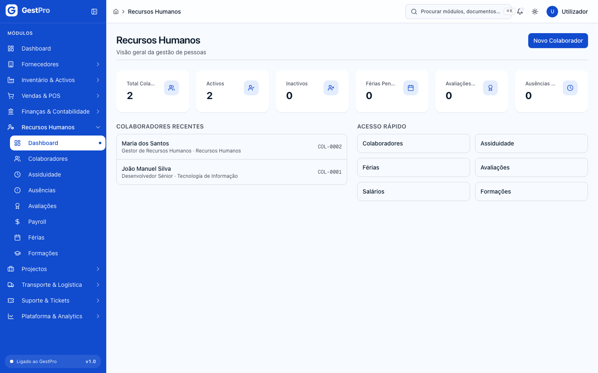

## Tarefas

### Como registar um novo colaborador

**Antes de começar:** precisa da permissão para admitir colaboradores (perfis Administrador e Gestor). Tenha à mão o BI/DIRE, o NUIT e, se existir, o NISS.

1. Abra **Recursos Humanos › Colaboradores** e clique em **Novo Colaborador**.
2. Preencha as secções:
   - **Dados Básicos:** Código (ex.: COL-001), Nome Completo, Data de Nascimento, Género, Estado Civil, Nacionalidade.
   - **Documentos de Identificação:** BI/DIRE, NUIT (9 dígitos), NISS (11 dígitos, opcional).
   - **Contactos:** Email, Telefone, Rua, Número, Bairro, Cidade, Província, Província de Naturalidade, Distrito de Naturalidade.
   - **Contacto de Emergência:** Nome, Parentesco, Telefone.
   - **Dados Profissionais:** Data de Admissão, Tipo de Contrato (Efectivo, Termo Certo, Estágio, Temporário, Prestação de Serviços), Regime de Trabalho (Tempo Integral, Tempo Parcial), Salário Base (MZN), **Departamento** e **Cargo** (escolhidos numa lista) e os subsídios **Alimentação**, **Transporte**, **Habitação** e **Outros Subsídios** (MZN, opcionais).
3. Clique em **Guardar Colaborador**.

**Resultado:** aparece a mensagem "Colaborador criado com sucesso!" e volta à lista.

**Efeitos noutros módulos:** os subsídios entram nos **Proventos** de cada folha de salários processada a partir daí.

<!-- captura: 07-recursos-humanos/colaboradores.png | /rh/colaboradores -->
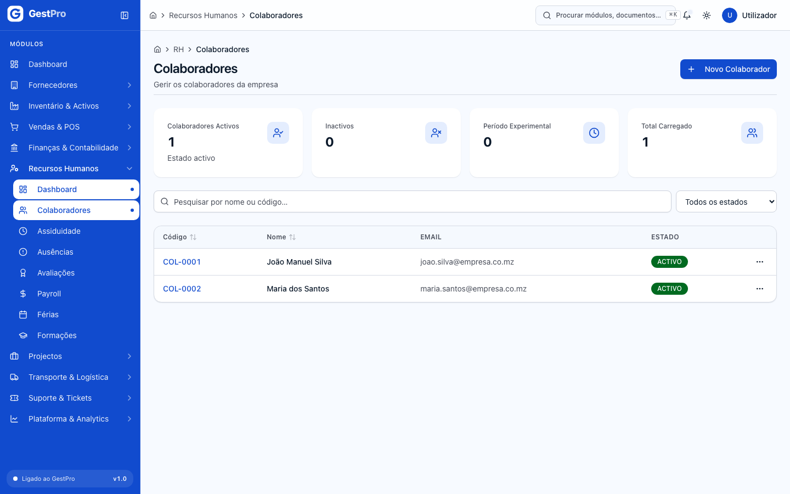

<!-- captura: 07-recursos-humanos/colaborador-novo.png | /rh/colaboradores/novo -->
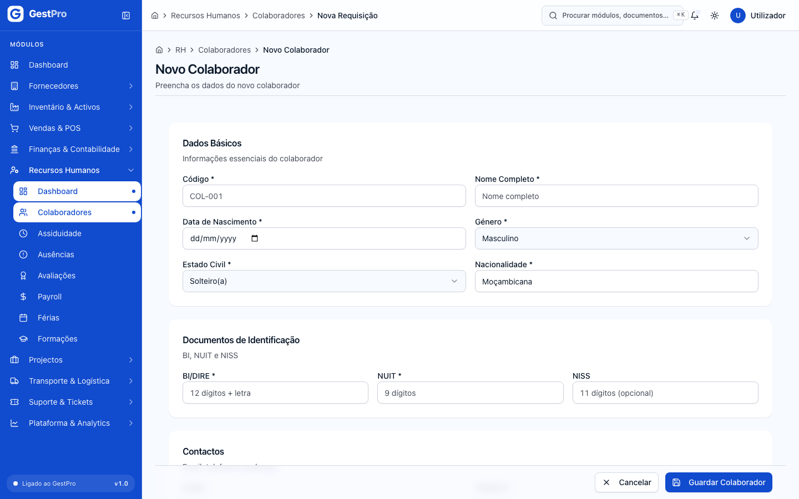

### Como editar, activar ou desactivar um colaborador

1. Na lista, clique na linha do colaborador, ou use o menu **⋯** › **Ver detalhe**.
2. Na ficha pode:
   - clicar em **Editar** para alterar o Nome Completo, o Email, o Telefone, o Tipo de Contrato, o Regime de Trabalho, o Salário Base (MZN), o Departamento, o Cargo e os subsídios (o formulário vem preenchido com os valores actuais), e depois clicar em **Guardar Alterações** — aparece «Colaborador actualizado com sucesso!». O Código, os documentos de identificação (BI/DIRE, NUIT, NISS) e a Data de Admissão não se alteram na edição;
   - clicar em **Activar**, que aparece quando o colaborador está em Período Experimental, Férias ou Afastado;
   - clicar em **Desactivar**, que aparece quando o colaborador está Activo ou em Período Experimental.
3. Um colaborador Inactivo já não pode ser editado. Só pode ser arquivado com **Arquivar Colaborador** › **Confirmar Arquivamento**. O arquivamento não se pode desfazer neste ecrã e só o Administrador o pode fazer.

**Efeitos noutros módulos:** só os colaboradores **Activos** entram no processamento da folha de salários. Um colaborador acabado de admitir pelo recrutamento fica em Período Experimental e só entra na folha depois de ser activado.

<!-- captura: 07-recursos-humanos/colaborador-detalhe.png | /rh/colaboradores >primeiro -->
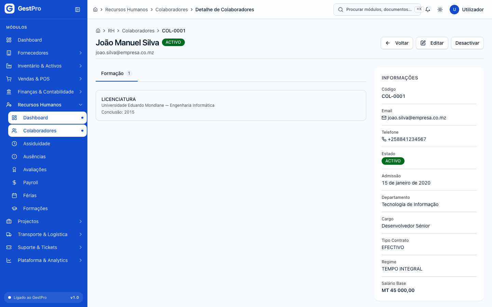

### Como registar a assiduidade de um dia

1. Abra **Recursos Humanos › Assiduidade** e clique em **Registar**.
2. Escolha o **Colaborador** (só aparecem os Activos) e o **Tipo**: Normal, Feriado, Fim de Semana, Férias ou Ausência.
3. Indique a **Data**, a **Entrada** e a **Saída**. A **Saída Almoço**, o **Retorno Almoço** e as **Observações** são opcionais.
4. Clique em **Registar**.

**Resultado:** "Assiduidade registada com sucesso." O sistema calcula as horas trabalhadas entre a Entrada e a Saída e conta como **Horas Extra** tudo o que passar das 8 horas.

**Efeitos noutros módulos:** as horas extra do mês entram no salário quando a folha é processada. O valor por hora é o salário base a dividir por 208 horas mensais, com uma majoração de 50%.

<!-- captura: 07-recursos-humanos/assiduidade-registar.png | /rh/assiduidade/novo -->
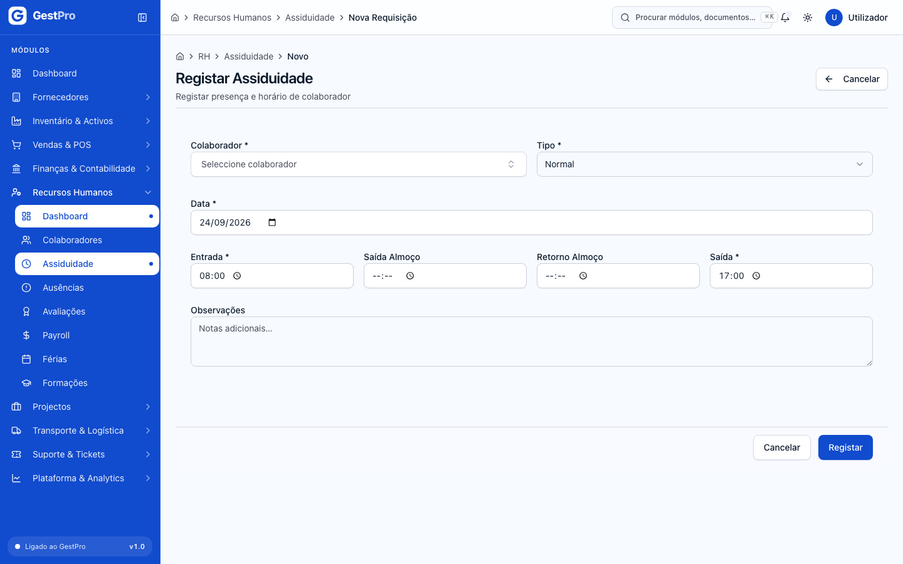

### Como registar uma ausência

1. Abra **Recursos Humanos › Ausências** e clique em **Registar Ausência**.
2. Em **Colaborador**, abra a lista e escreva parte do código ou do nome (por exemplo, «COL-001» ou «Mabunda»); escolha o colaborador nos resultados.
3. Escolha o **Tipo**: Falta, Atestado Médico, Licença de Maternidade, Licença de Paternidade, Licença sem Vencimento, Licença por Nojo, Licença por Casamento ou Outro.
4. Indique a **Data de Início** e a **Data de Fim**, e marque **Justificada** se for o caso. A **Justificativa** e as **Observações** são opcionais.
5. Clique em **Registar Ausência**.

**Resultado:** "Ausência registada com sucesso." A ausência fica **Pendente** até ser aprovada ou rejeitada (ver a tarefa seguinte). Só as ausências **aprovadas** contam para os salários.

### Como aprovar ou rejeitar uma ausência

**Antes de começar:** precisa da permissão para aprovar ausências (perfis Administrador e Gestor). Sem ela, a lista não mostra a coluna **Acções**.

1. Abra **Recursos Humanos › Ausências**. Se quiser, filtre por **Estado** › **Pendente**.
2. Para aprovar, clique em **Aprovar** na linha da ausência e confirme com **Aprovar** na janela «Aprovar a ausência de …?» (ou **Voltar** para desistir).
3. Para rejeitar, clique em **Rejeitar**. Na página **Rejeitar Ausência**, escreva o **Motivo da rejeição** (obrigatório) e clique em **Rejeitar ausência**.

**Resultado:** "Ausência aprovada." ou "Ausência rejeitada." A ausência passa a **Aprovada** ou **Rejeitada**. A decisão não pode ser desfeita.

**Efeitos noutros módulos:** uma **Falta** não justificada ou uma **Licença sem Vencimento** aprovada é descontada no salário do mês em que começa, a 1/30 do salário base por dia, quando a folha desse mês for processada. A aprovação **não** recalcula sozinha uma folha já criada: se a folha do mês já existir, a janela de aprovação avisa «A folha salarial deste mês já existe: tem de ser recalculada para descontar esta ausência.» Enquanto a folha estiver Pendente, processe o mês de novo (ou use **Recalcular** no recibo); se já estiver Processada, cancele-a e processe-a de novo.

### Como pedir férias

**Antes de começar:** o colaborador tem de ter um período aquisitivo de férias. Se não houver nenhum, o ecrã mostra "Sem períodos aquisitivos" — inicie um primeiro (ver [Como iniciar um período aquisitivo de férias](#como-iniciar-um-período-aquisitivo-de-férias)).

1. Abra **Recursos Humanos › Férias** e clique em **Nova Solicitação**.
2. Em **Período aquisitivo**, escolha o colaborador e o período. A lista mostra também o saldo de dias.
3. Indique o **Início**, o **Fim**, os **Dias a gozar** e o **Tipo** (Integral, Fracionada, Abono Pecuniário). As **Observações** são opcionais.
4. Clique em **Submeter**.

**Resultado:** "Solicitação de férias submetida com sucesso." O pedido fica **Pendente** e fica registado quem o submeteu. Os dias pedidos ficam reservados: deixam de contar para o saldo disponível de novos pedidos, mas só são descontados ao saldo quando o pedido for aprovado. O indicador **Férias Pendentes** do Dashboard conta os pedidos por decidir.

<!-- captura: 07-recursos-humanos/ferias-nova.png | /rh/ferias/nova -->
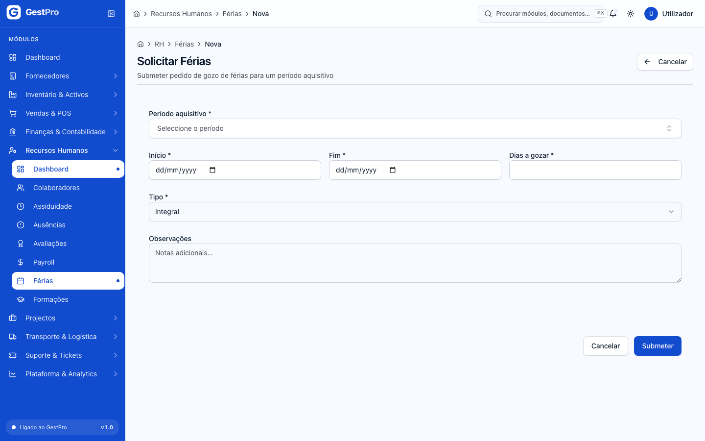

### Como iniciar um período aquisitivo de férias

**Antes de começar:** precisa da permissão para iniciar períodos aquisitivos (perfis Administrador e Gestor). Sem ela, o botão **Iniciar período aquisitivo** não aparece.

1. Abra **Recursos Humanos › Férias** e clique em **Iniciar período aquisitivo**.
2. Em **Colaborador**, escreva parte do código ou do nome e escolha o colaborador.
3. Indique o **Início** e o **Fim** do período e os **Dias de férias** a que dá direito.
4. Clique em **Iniciar período**.

**Resultado:** "Período aquisitivo iniciado." e volta à lista de férias. O período começa com zero dias usados e passa a aparecer em **Nova Solicitação**, com o saldo.

### Como aprovar, rejeitar ou cancelar um pedido de férias

Os botões aparecem na coluna **Acções** da lista **Recursos Humanos › Férias**, só nos pedidos **Pendentes**.

**Aprovar** (perfis Administrador e Gestor):

1. Clique em **Aprovar** na linha do pedido.
2. Na janela «Aprovar as férias de …?», confirme com **Aprovar** (ou **Voltar** para desistir).

**Resultado:** "Férias aprovadas." O pedido passa a **Aprovada** e os dias são descontados do saldo do período aquisitivo. A aprovação não pode ser desfeita.

**Rejeitar** (perfis Administrador e Gestor):

1. Clique em **Rejeitar** na linha do pedido.
2. Na página **Rejeitar Pedido de Férias**, escreva o **Motivo da rejeição** (obrigatório) e clique em **Rejeitar pedido**.

**Resultado:** "Pedido de férias rejeitado." O pedido passa a **Rejeitada**, com o motivo registado, e os dias deixam de estar reservados.

**Cancelar o seu próprio pedido:**

1. Clique em **Cancelar** na linha do pedido. Este botão só aparece a quem submeteu o pedido.
2. Na janela «Cancelar o seu pedido de férias?», confirme com **Cancelar pedido**.

**Resultado:** "Pedido de férias cancelado." O pedido passa a **Cancelada** e os dias deixam de estar reservados. Para voltar a pedir, submeta um pedido novo. Um pedido já aprovado não se cancela neste ecrã.

### Como fazer uma avaliação de desempenho

1. Abra **Recursos Humanos › Avaliações** e clique em **Nova Avaliação**.
2. Em **Identificação**, escolha o **Colaborador Avaliado**, o **Tipo** (Desempenho, Competências, 360°, Probatório), o **Período** (ex.: 2026-S1) e a **Data de Início**.
3. Clique em **Adicionar Critério** e preencha o **Nome**, a **Descrição** (opcional), a **Nota (0–10)** e o **Peso (%)**. Depois clique em **Adicionar**. Repita para cada critério. É obrigatório ter pelo menos um.
4. Em **Síntese**, pode preencher **Pontos Fortes**, **Pontos a Desenvolver**, **Plano de Acção** (um por linha) e **Comentários Gerais**.
5. Clique em **Criar Avaliação**.
6. Na ficha da avaliação, clique em **Iniciar** (passa a Em Andamento) e depois em **Concluir**. Para anular, use **Cancelar** › **Cancelar Avaliação**. Enquanto está Pendente ou Em Andamento, pode alterar os critérios e a síntese em **Editar** › **Guardar Alterações**.

**Resultado:** ao **Concluir**, o sistema calcula a **Nota Final**, que é a média das notas pesada pelos pesos dos critérios.

O **avaliador** é sempre quem cria a avaliação: o sistema usa o colaborador ligado ao seu utilizador, ou seja, o colaborador cujo **Email** é igual ao do seu utilizador. Se não existir nenhum, a avaliação é recusada — peça aos Recursos Humanos que o registem como colaborador com o mesmo email. Ninguém se pode avaliar a si próprio.

### Como organizar uma formação e inscrever colaboradores

1. Abra **Recursos Humanos › Formações** e clique em **Nova Formação**.
2. Em **Informações Gerais**, preencha o Título, a Descrição, a Categoria, a Modalidade (Presencial, Online, Híbrido), o Instrutor / Entidade e o Local.
3. Em **Planeamento**, preencha a Data de Início, a Data de Fim, a Carga Horária (horas), as Vagas Disponíveis, o Custo Total (MZN) e as Observações.
4. Clique em **Guardar Formação**. Abre-se a ficha da formação, no estado **Planeada**.
5. No separador **Participantes**, escolha o colaborador em **Inscrever colaborador** e clique em **Inscrever**. Só se pode inscrever enquanto a formação está Planeada ou Em Andamento e há vagas livres.
6. Use **Iniciar** e **Concluir** para fazer avançar a formação. Para anular, use **Cancelar** › **Cancelar Formação**.

**Resultado:** "Formação criada com sucesso!" e, depois, "Colaborador inscrito com sucesso." A coluna **Participantes** da lista mostra quantos inscritos há.

<!-- captura: 07-recursos-humanos/formacao-nova.png | /rh/formacoes/nova -->
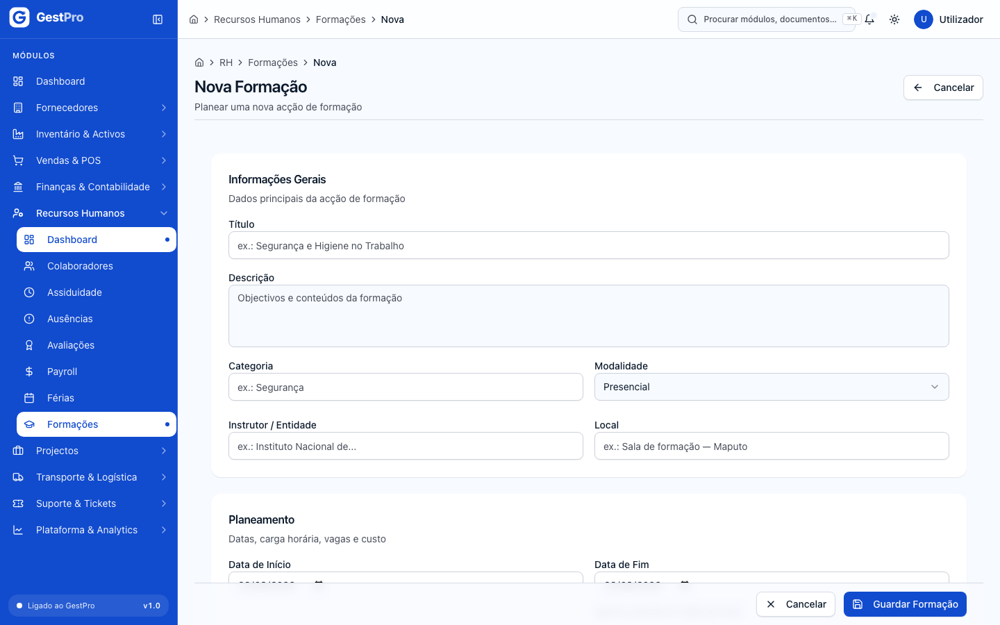

### Como processar a folha de salários do mês

**Antes de começar:**
- Precisa da permissão de processar salários (perfis Administrador, Gestor e Financeiro).
- Confirme que os colaboradores a pagar estão **Activos** e que o salário base de cada um está certo.
- Registe a assiduidade do mês, para que as horas extra sejam pagas.
- Têm de existir uma tabela de INSS e escalões de IRPS em vigor no mês — ver [Como carregar uma nova vigência das tabelas INSS e IRPS](#como-carregar-uma-nova-vigência-das-tabelas-inss-e-irps).

1. Abra **Recursos Humanos › Payroll** e clique em **Processar Folha do Mês**.
2. Escolha o **Mês** e o **Ano**. O ecrã mostra quantos colaboradores activos vão ser processados.
3. Clique em **Processar Folha do Mês**.

**Resultado:** aparece "Folha MM/AAAA processada para N colaborador(es)." Em **Folhas mensais** surge o mês com o total de colaboradores, o Bruto, o Líquido e o Custo total, no estado **Pendente**. Em **Payrolls individuais** aparece uma linha por colaborador.

Para cada colaborador, o sistema calcula:
- **Proventos:** salário base, os subsídios registados na ficha (alimentação, transporte, habitação, outros), as horas extras do mês, as comissões **aprovadas** no mês (ver [Vendas e POS](04-vendas-e-pos.md)) e a parte paga pela empresa nos benefícios **tributáveis** atribuídos (uma linha «Benefício: ‹nome›» por benefício). As comissões são ligadas ao colaborador pelo email: o email do colaborador tem de ser igual ao do utilizador vendedor.
- **Descontos:** INSS do trabalhador, IRPS (retenção na fonte), faltas não remuneradas aprovadas (faltas não justificadas e licenças sem vencimento), a 1/30 do salário base por dia, e a parte do colaborador nos benefícios atribuídos.
- **Encargo patronal:** o INSS da entidade, que se soma ao custo total da empresa.

As taxas de INSS e os escalões de IRPS **não estão escritos no ecrã nem no manual**. Vêm das tabelas configuradas no sistema, cada uma com a sua vigência, e o cálculo de cada mês usa a tabela em vigor nesse mês. Quando a lei muda, carrega-se uma nova vigência e os meses anteriores continuam a usar a tabela antiga. As tabelas consultam-se e carregam-se em **Payroll › Tabelas INSS/IRPS** (ver abaixo).

**Reprocessar:** enquanto a folha está **Pendente**, pode voltar a processar o mesmo mês. Os valores são recalculados, por exemplo depois de corrigir um salário ou registar mais assiduidade.

### Como corrigir um recibo antes de confirmar (recalcular e ajustes)

Enquanto o payroll de um colaborador está **Pendente**, o detalhe (clique na linha em **Payrolls individuais**) mostra dois botões:

- **Recalcular** — volta a calcular o recibo com os dados actuais (ficha, assiduidade, ausências aprovadas, benefícios, tabelas INSS e IRPS), **sem** apagar os ajustes manuais. Abre-se a janela «Recalcular payroll?»; confirme com **Recalcular** (ou **Cancelar** para desistir). Aparece «Payroll recalculado».
- **Adicionar ajuste** — abre o formulário **Ajuste manual** para um valor que o cálculo automático não conhece:
  1. **Tipo**: **Provento** (soma ao bruto) ou **Desconto** (abate ao líquido);
  2. **Natureza**: **Bónus**, **Adiantamento**, **Penhora** ou **Outro**;
  3. **Descrição** (ex.: «Prémio de desempenho de Setembro») e **Valor**;
  4. **Guardar ajuste**. Aparece «Ajuste adicionado com sucesso.» e o recibo é recalculado. Se o desconto deixasse o líquido negativo, o ajuste é recusado e nada fica gravado.

Depois de **Processar na contabilidade**, os valores ficam fixos e estes botões desaparecem; para corrigir, cancele a folha e processe-a de novo.

### Como carregar uma nova vigência das tabelas INSS e IRPS

**Antes de começar:** permissão «Gerir tabelas INSS/IRPS» (Administrador, Gestor, Financeiro). Confirme as taxas e os escalões com o diploma publicado — o GestPro não os sabe por si.

1. Abra **Recursos Humanos › Payroll** e clique **Tabelas INSS/IRPS**. Vê as vigências registadas: INSS (Início, Trabalhador, Entidade, Descrição) e escalões de IRPS (Escalão, De, Até, Taxa %, Parcela a abater).
2. Para o INSS, clique **Nova vigência INSS** e preencha o **Mês** e o **Ano** de início, a **Taxa do trabalhador (%)**, a **Taxa da entidade (%)**, o **Teto de incidência** (vazio = sem teto) e a **Descrição** (decreto ou diploma de origem).
3. Para o IRPS, clique **Nova vigência IRPS**, indique o início e preencha os escalões da tabela geral (sem dependentes): **De (MZN)**, **Até (MZN)**, **Taxa (%)** e **Parcela a abater**. Use **Adicionar escalão** / **Remover escalão**. O **último escalão** fica com **Até** vazio.
4. Clique **Guardar vigência**.

**Resultado:** volta à lista com a vigência nova. A nova vigência **fecha automaticamente a anterior** no dia anterior ao início. As tabelas são *append-only*: não se editam nem se apagam, e os meses anteriores continuam a ser calculados com a tabela que estava em vigor nesse mês.

Duas regras protegem as folhas já fechadas:
- a nova vigência tem de começar **no mês corrente ou num mês futuro** — não se carregam vigências para trás;
- não pode começar num mês que já tenha (ou seguido de meses que já tenham) uma folha **Processada** ou **Paga**, porque essas folhas foram calculadas com a tabela anterior. Para corrigir uma tabela usada por uma folha Processada, cancele primeiro a folha.

<!-- captura: 07-recursos-humanos/payroll-processar.png | /rh/payroll/novo -->
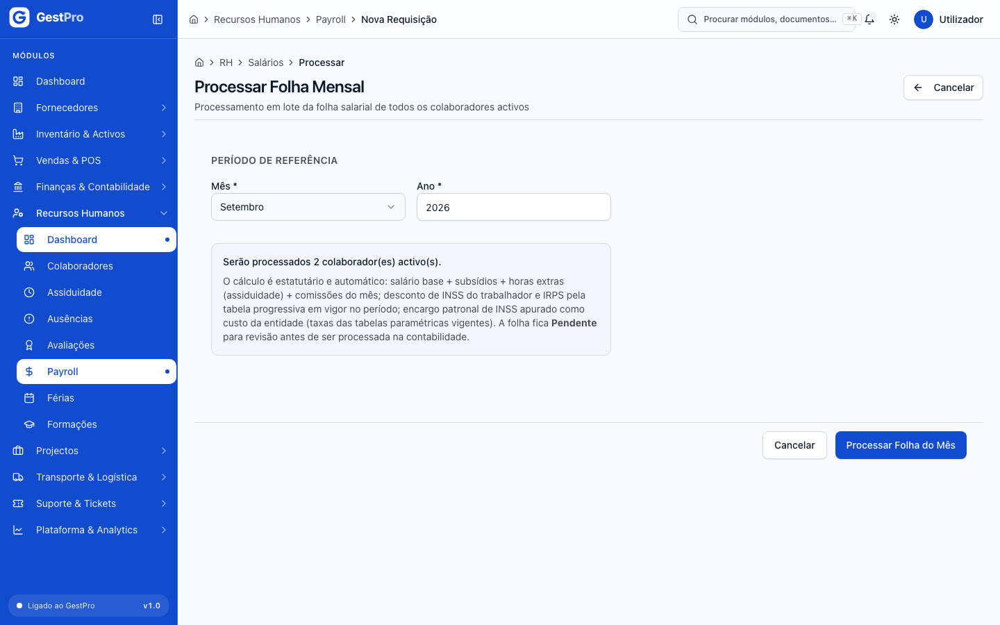

### Como confirmar a folha na contabilidade

Não há um passo de "aprovação" à parte. A folha Pendente é a fase de revisão, e confirmá-la é o passo seguinte.

1. Em **Recursos Humanos › Payroll**, reveja os recibos (clique numa linha de **Payrolls individuais**).
2. Na linha do mês, em **Folhas mensais**, clique em **Processar na contabilidade**.

**Resultado:** "Folha <mês> <ano> processada — lançamento contabilístico gerado." A folha e os payrolls passam a **Processado** e os valores ficam fixos: já não se recalculam.

**Efeitos noutros módulos:** gera um lançamento no diário de Salários, já lançado, com a data do processamento (ver [Contabilidade](05-contabilidade.md)):

| Conta | Débito | Crédito |
|---|---|---|
| 622 Remunerações dos trabalhadores | total bruto | |
| 623 Encargos sobre remunerações | INSS da entidade | |
| 449 Contribuições para o INSS | | INSS do trabalhador + INSS da entidade |
| 442 Impostos retidos na fonte | | IRPS |
| 451 Pessoal | | outros descontos (ex.: faltas) |
| 4622 Remunerações a pagar aos trabalhadores | | total líquido |

O período contabilístico da data de hoje tem de estar aberto.

### Como marcar a folha como paga

**Antes de começar:**
- Precisa da permissão de pagar a folha de salários (perfis Administrador, Gestor e Financeiro).
- Para pagar em **Numerário**, precisa também da permissão de operar o caixa e de ter **o seu caixa aberto** (o dinheiro sai da sua sessão de caixa). Para as outras formas, precisa da permissão de movimentar contas bancárias e de uma conta bancária activa do tipo certo (Corrente, Poupança ou Depósito a prazo para transferência e cheque; Carteira móvel para M-Pesa e e-Mola). Nos perfis de sistema, quem pode pagar a folha tem também estas duas permissões; o que pode faltar é o caixa aberto ou a conta bancária.

1. Na linha do mês (estado **Processado**), clique em **Marcar como paga**. Abre-se a página **Pagar folha de salários — ‹mês› ‹ano›**, que mostra o número de colaboradores e o **Líquido a pagar**.
2. Indique a **Data do pagamento**: tem de estar entre o dia do processamento e hoje.
3. Escolha a **Forma de pagamento**: Transferência bancária, Cheque, M-Pesa, e-Mola ou Numerário. Só aparecem as formas que as suas permissões cobrem.
4. Fora do numerário, escolha a **Conta bancária** de onde sai o dinheiro.
5. Clique em **Registar pagamento** (ou **Voltar** para desistir).

**Resultado:** "Folha <mês> <ano> paga." e volta à lista de salários. A folha e os payrolls passam a **Pago** e a data de pagamento fica registada no recibo.

**Efeitos noutros módulos:** gera, no diário de Salários e com a data do pagamento, o lançamento com débito em 4622 (Remunerações a pagar aos trabalhadores) e crédito na conta do meio — **111 Caixa** em numerário, ou a conta contabilística da conta bancária escolhida — pelo total líquido. Em numerário, fica também registada uma saída na sua sessão de caixa (ver [Faturação, Caixa e Tesouraria](06-faturacao-caixa-tesouraria.md)).

<!-- captura: 07-recursos-humanos/payroll.png | /rh/payroll -->
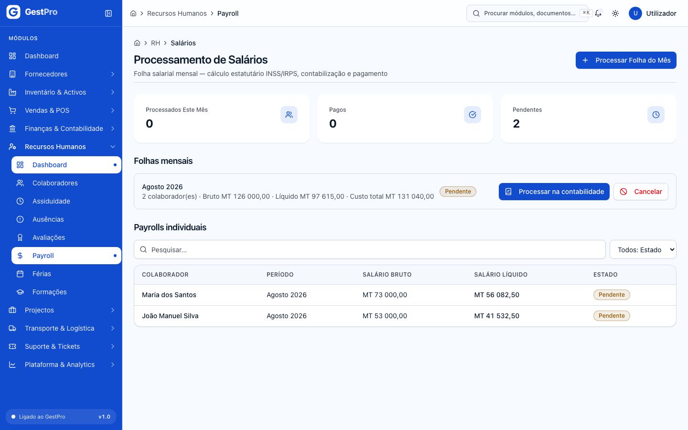

### Como cancelar uma folha

1. Na linha do mês (Pendente ou Processado), clique em **Cancelar**.
2. Escreva o **Motivo do cancelamento**. É obrigatório.
3. Clique em **Confirmar cancelamento**.

**Resultado:** "Folha <mês> <ano> cancelada." Todos os payrolls do mês passam a **Cancelado**. Se a folha já estava Processada, o lançamento contabilístico é **estornado**: não é apagado, é anulado por um lançamento inverso. Depois pode voltar a processar o mesmo mês. Uma folha **Paga** já não se pode cancelar.

### Como ver e descarregar o recibo de vencimento

1. Em **Payrolls individuais**, clique na linha do colaborador.
2. O **Recibo de Vencimento** mostra os dados do colaborador (NUIT, NISS, cargo, departamento, NIB), os **Proventos**, os **Descontos**, o **Salário líquido**, o **INSS entidade (encargo patronal)** e o **Custo total da entidade**.
3. Clique em **Descarregar PDF**. O ficheiro chama-se `recibo-<código>-<ano>-<mês>.pdf`.

<!-- captura: 07-recursos-humanos/recibo.png | /rh/payroll >primeiro -->
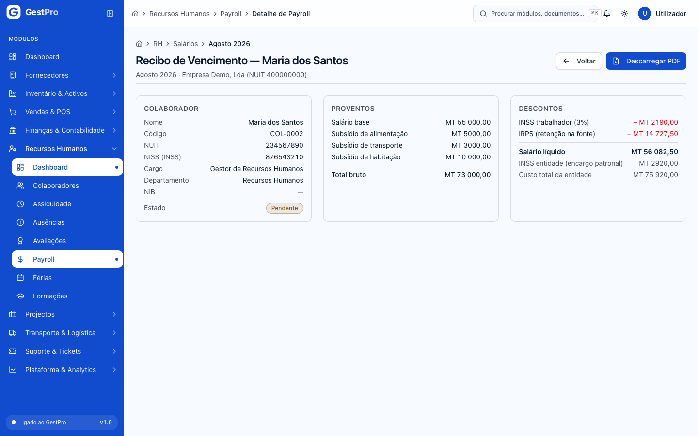

### Como obter os mapas mensais de INSS e IRPS

1. Na linha de uma folha **Processada** ou **Paga**, clique em **Mapa INSS** ou **Mapa IRPS**.
2. O navegador descarrega um ficheiro CSV (separado por `;`, que abre no Excel): `mapa-inss-AAAA-MM.csv` ou `mapa-irps-AAAA-MM.csv`.

- **Mapa INSS:** código, nome, NUIT, NISS, salário bruto, INSS do trabalhador, INSS da entidade e total, por colaborador.
- **Mapa IRPS:** código, nome, NUIT, salário bruto e IRPS retido.

Os mapas são um resumo para preparar as declarações. Não estão no formato oficial de submissão do INSS nem da Autoridade Tributária. Os mapas e os recibos em PDF contam para o limite de exportações por utilizador; se descarregar muitos seguidos, aguarde um minuto antes de tentar de novo.

### Como abrir uma vaga e gerir candidatos

1. Vá a **/rh/recrutamento** e clique em **Nova Vaga**.
2. Preencha:
   - **Informações Básicas:** Título, Descrição, Localização.
   - **Condições de Trabalho:** Regime, Tipo de Contrato, Número de Posições.
   - **Faixa Salarial** (opcional): Salário Mínimo e Salário Máximo (MZN).
3. Clique em **Criar Vaga**. A vaga fica em **Rascunho**.
4. Na vaga, use **Alterar Estado** › **Abrir Vaga**. Mais tarde pode usar **Iniciar Triagem**, **Fechar Vaga** ou **Cancelar Vaga**.
5. Com a vaga Aberta ou Em Triagem, abra o separador **Adicionar Candidato**. Preencha os **Dados do Candidato** (Nome Completo, Email, Telefone, BI e NUIT opcionais, Observações) e a **Candidatura** (Fonte / Origem, Pretensão Salarial). Depois clique em **Registar Candidatura**.
6. O separador **Pipeline** mostra os candidatos por etapa. Clique num candidato para abrir a candidatura.
7. Na candidatura, use **Mover Etapa** (**Mover para Triagem**, **Mover para Entrevista**, **Mover para Proposta**, ou **Rejeitar Candidato** / **Registar Desistência**).
8. No separador **Entrevistas**, preencha **Registar Nova Entrevista** com o Tipo, a Data e Hora, os Entrevistadores, a Avaliação (0-10), a Recomendação e o Parecer / Notas. Depois clique em **Registar Entrevista**.

<!-- captura: 07-recursos-humanos/vaga-detalhe.png | /rh/recrutamento >primeiro -->
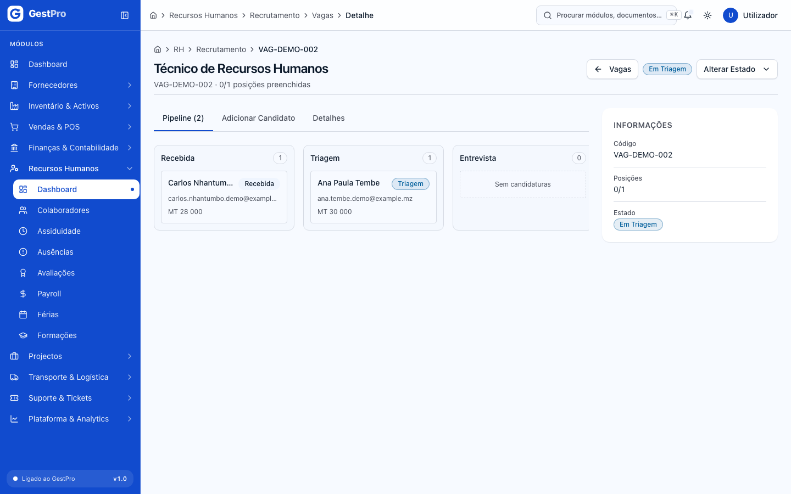

### Como admitir um candidato como colaborador

1. Mova a candidatura até à etapa **Proposta**.
2. Na candidatura aparece a caixa «Esta candidatura está em estado … Pode convertê-la numa admissão de Colaborador.» Clique em **Admitir como Colaborador**. A caixa aparece na etapa **Proposta** e também em **Contratado**, enquanto a candidatura ainda não tiver colaborador.
3. Complete os dados:
   - **Identificação:** Nome Completo, Código de Colaborador, BI, NUIT, Data de Nascimento, Género, Estado Civil.
   - **Naturalidade e Nacionalidade.**
   - **Contactos.**
   - **Contacto de Emergência.**
   - **Contrato e Remuneração:** Data de Admissão, Tipo de Contrato, Regime, Salário Base, Subsídio Alimentação e Subsídio Transporte.
4. Clique em **Confirmar Admissão**.

**Resultado:** "Colaborador criado com sucesso!" e abre-se a ficha do novo colaborador, que fica em **Período Experimental**. A candidatura passa a **Contratado** e a vaga conta mais uma posição preenchida. Quando todas as posições estão preenchidas, a vaga fecha sozinha.

Se, na etapa Proposta, usou **Mover Etapa › Marcar como Contratado**, a etapa muda mas o colaborador **não** é criado. Nesse caso, a candidatura continua a mostrar **Admitir como Colaborador**: use-o para criar a ficha.

### Como criar e atribuir um benefício

1. Vá a **/rh/beneficios** e clique em **Novo Benefício**.
2. Preencha o Nome, o Tipo, a Periodicidade (Mensal, Trimestral, Anual, Pontual), o Fornecedor / Seguradora, o Custo Total (MZN), a parte da Empresa (MZN), o Desconto Colaborador (MZN), se é **Tributável (IRPS)** e a Descrição.
3. Clique em **Guardar**.
4. Na ficha do benefício, clique em **Atribuir**. O **Benefício** vem já escolhido (se abrir **Atribuir** em /rh/beneficios/atribuir, escolha-o na lista). Em **Colaborador**, escreva parte do código ou do nome e escolha o colaborador nos resultados. Indique a **Data de Início**, a **Data de Fim (opcional)** e, se quiser, valores próprios de **Comparticipação Empresa (MZN)** e **Desconto Colaborador (MZN)**. Em branco, estes valores são os do benefício.
5. Clique em **Atribuir Benefício**.

**Resultado:** "Benefício atribuído com sucesso". A atribuição aparece em **Colaboradores Atribuídos**.

**Efeitos noutros módulos:** as atribuições activas de benefícios com periodicidade **Mensal** entram em cada folha de salários dos meses em que estão em vigor (entre a Data de Início e a Data de Fim):
- a **Comparticipação Empresa** de um benefício **Tributável (IRPS)** soma-se aos proventos, numa linha «Benefício: ‹nome›», e conta para o INSS e o IRPS;
- a Comparticipação Empresa de um benefício **não tributável** não entra no recibo (é um custo que a empresa paga a terceiros, como a seguradora);
- o **Desconto Colaborador** entra sempre nos descontos do recibo.

Os benefícios Trimestrais, Anuais ou Pontuais não entram na folha. Uma folha já processada não muda: atribuições feitas depois só contam se a folha for processada (ou recalculada) de novo.

> **Atenção:** o botão **Editar** da ficha do benefício abre uma página que ainda não existe. Também não há botões para suspender ou terminar atribuições.

<!-- captura: 07-recursos-humanos/beneficios.png | /rh/beneficios -->
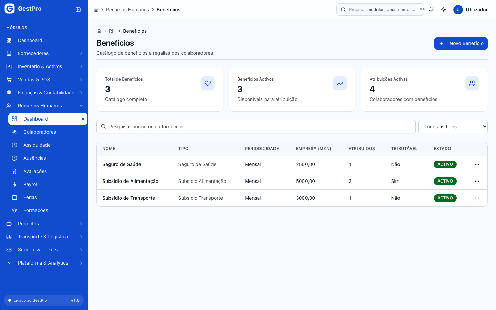

## Estados

### Colaborador

| Estado | Significado | Pode passar a | Quem |
|---|---|---|---|
| Período Experimental | Admitido pelo recrutamento, ainda em experiência | Activo, Inactivo | Administrador, Gestor |
| Activo | A trabalhar. Entra na folha de salários | Inactivo, Férias, Afastado | Administrador, Gestor |
| Férias | De férias (não há botão para este estado) | Activo | Administrador, Gestor |
| Afastado | Afastado temporariamente (não há botão para este estado) | Activo, Inactivo | Administrador, Gestor |
| Inactivo | Saiu da empresa. Já não se edita | — (só arquivar) | Administrador |

### Pedido de férias

| Estado | Significado | Pode passar a | Quem |
|---|---|---|---|
| Pendente | Submetido. Os dias ficam reservados | Aprovada, Rejeitada (com motivo) | Administrador, Gestor |
| | | Cancelada | Quem submeteu o pedido |
| Aprovada | Os dias são descontados ao saldo. Não se desfaz no ecrã | — | — |
| Rejeitada | Recusado, com o motivo registado. Os dias deixam de estar reservados | — | — |
| Cancelada | Anulado por quem o pediu. Os dias deixam de estar reservados | — | — |

### Ausência

| Estado | Significado | Pode passar a | Quem |
|---|---|---|---|
| Pendente | Registada | Aprovada, Rejeitada (com motivo) | Administrador, Gestor |
| Aprovada | Confirmada. Se for falta não justificada ou licença sem vencimento, é descontada no salário | — | — |
| Rejeitada | Recusada, com o motivo registado | — | — |

### Avaliação e Formação

| Estado | Significado | Pode passar a | Quem |
|---|---|---|---|
| Pendente (avaliação) / Planeada (formação) | Criada | Em Andamento, Cancelada | Administrador, Gestor |
| Em Andamento | A decorrer | Concluída, Cancelada | Administrador, Gestor |
| Concluída | Terminada. Na avaliação, a Nota Final fica calculada | — | — |
| Cancelada | Anulada | — | — |

### Folha mensal e payroll

| Estado | Significado | Pode passar a | Quem |
|---|---|---|---|
| Pendente | Calculada, em revisão. Pode ser reprocessada | Processado, Cancelado | Administrador, Gestor, Financeiro |
| Processado | Lançada na contabilidade. Os valores ficam fixos | Pago, Cancelado (com estorno) | Administrador, Gestor, Financeiro |
| Pago | Pagamento lançado | — | — |
| Cancelado | Anulada. O mês pode ser processado de novo | — | — |

### Vaga

| Estado | Significado | Pode passar a | Quem |
|---|---|---|---|
| Rascunho | Criada, ainda sem candidaturas | Aberta, Cancelada | Administrador, Gestor |
| Aberta | Aceita candidaturas | Em Triagem, Fechada, Cancelada | Administrador, Gestor |
| Em Triagem | Aceita candidaturas, em selecção | Aberta, Fechada, Cancelada | Administrador, Gestor |
| Fechada | Terminada (também fecha sozinha quando todas as posições estão preenchidas) | — | — |
| Cancelada | Anulada | — | — |

### Candidatura

| Estado | Significado | Pode passar a | Quem |
|---|---|---|---|
| Recebida | Registada | Triagem, Rejeitado, Desistiu | Administrador, Gestor |
| Triagem | Em análise | Entrevista, Rejeitado, Desistiu | Administrador, Gestor |
| Entrevista | Em entrevistas | Proposta, Rejeitado, Desistiu | Administrador, Gestor |
| Proposta | Proposta feita. Pode ser admitido | Contratado, Rejeitado, Desistiu | Administrador, Gestor |
| Contratado | Fim do processo. Se foi marcado sem admissão, ainda pode ser admitido como colaborador | — | — |
| Rejeitado / Desistiu | Fim do processo | — | — |

### Quem pode fazer o quê

| Acção | Administrador | Gestor | Financeiro | Operador | Leitura |
|---|---|---|---|---|---|
| Consultar colaboradores, assiduidade, recrutamento, benefícios | ✔ | ✔ | ✔ | ✔ | ✔ |
| Criar e editar colaboradores | ✔ | ✔ | | | |
| Arquivar colaborador | ✔ | | | | |
| Registar assiduidade e ausências, pedir férias | ✔ | ✔ | | ✔ | |
| Aprovar ou rejeitar ausências e pedidos de férias | ✔ | ✔ | | | |
| Iniciar períodos aquisitivos de férias | ✔ | ✔ | | | |
| Avaliações e formações | ✔ | ✔ | | | |
| Processar, pagar e cancelar folhas de salários | ✔ | ✔ | ✔ | | |
| Gerir tabelas INSS/IRPS | ✔ | ✔ | ✔ | | |
| Ver recibos e mapas INSS/IRPS | ✔ | ✔ | ✔ | ✔ | ✔ |
| Vagas, candidaturas, entrevistas, admissões | ✔ | ✔ | | | |
| Criar e atribuir benefícios | ✔ | ✔ | | | |

Para pagar uma folha, além da permissão de pagar salários, é preciso a permissão do meio: operar o caixa (numerário) ou movimentar contas bancárias (as outras formas). Administrador, Gestor e Financeiro têm as duas.

## Erros frequentes

| Mensagem mostrada | Porquê | O que fazer |
|---|---|---|
| Não existe tabela INSS vigente para o período | Não há taxas de INSS configuradas para o mês escolhido | Carregue a vigência em **Payroll › Tabelas INSS/IRPS** (ver [Como carregar uma nova vigência](#como-carregar-uma-nova-vigência-das-tabelas-inss-e-irps)). |
| Não existem escalões IRPS vigentes para o período | Não há escalões de IRPS configurados para o mês | Igual ao anterior. |
| A nova vigência tem de começar no mês corrente ou num mês futuro | Tentou carregar uma vigência com início num mês passado | Escolha o mês corrente ou um mês futuro. |
| Já há folhas processadas a partir desse mês: a vigência que usaram não pode ser alterada | Há folhas Processadas ou Pagas no mês de início ou depois | Escolha um mês de início posterior, ou cancele primeiro a folha Processada. |
| A nova vigência tem de começar depois da vigência actual | O início é igual ou anterior ao da vigência em vigor | Escolha um mês posterior. |
| A folha MM/AAAA já foi processada; cancele-a para reprocessar | A folha do mês está Processada ou Paga | Se estiver Processada, cancele-a primeiro. Uma folha Paga já não se pode alterar. |
| A folha MM/AAAA está a ser processada noutra sessão | Outra pessoa está a processar o mesmo mês neste momento | Aguarde e actualize a página. |
| Não existem colaboradores activos para processar | Nenhum colaborador está no estado Activo | Active os colaboradores (os que estão em Período Experimental não entram). |
| A folha não tem payrolls pendentes para processar | A folha não tem salários por confirmar | Volte a processar o mês em **Processar Folha do Mês**. |
| N payroll(s) com salário líquido negativo — corrija os descontos antes de processar | Os descontos são maiores do que os proventos | Reveja as faltas e os salários base e volte a processar o mês. |
| Os descontos excedem os proventos (líquido …) — ajuste os descontos | Ao recalcular ou ajustar um recibo, o líquido ficaria negativo | Reveja os ajustes e as faltas do colaborador. |
| Período XXXX está fechado | O período contabilístico da data do lançamento (hoje, ao processar; a data do pagamento, ao pagar) está fechado | Peça à contabilidade para o abrir (ver [Contabilidade](05-contabilidade.md)) ou, no pagamento, escolha outra data. |
| A data do pagamento não pode ser anterior à data de processamento da folha. | Data do pagamento antes do dia em que a folha foi processada | Corrija a data. |
| A data do pagamento não pode ser futura. | Data do pagamento depois de hoje | Registe o pagamento no dia em que é feito. |
| Para pagar em numerário é necessário ter uma sessão de caixa aberta. Abra o caixa em Caixa › Abertura antes de pagar em numerário. | Escolheu Numerário sem ter o seu caixa aberto | Abra o caixa ou escolha outra forma. |
| Não tem permissão para operar o caixa: o pagamento da folha em numerário não é possível. | O seu perfil não pode operar o caixa | Escolha outra forma ou peça a quem opera o caixa. |
| Não tem permissão para movimentar contas bancárias: o pagamento da folha por esta forma não é possível. | O seu perfil não pode movimentar contas bancárias | Peça a quem tem essa permissão (Administrador, Gestor ou Financeiro). |
| A conta bancária é obrigatória para esta forma de pagamento. | Fora do numerário, não escolheu a conta | Escolha a **Conta bancária**. |
| A conta bancária indicada está inactiva e não pode ser utilizada. | A conta escolhida foi desactivada | Escolha outra conta. |
| A conta bancária não tem conta contabilística associada. | A conta bancária não está ligada ao plano de contas | Peça à contabilidade que a associe. |
| Transição de 'X' para 'Y' não é permitida | A acção não é válida para o estado actual (ex.: pagar uma folha Pendente) | Siga a ordem de estados indicada acima. |
| Saldo disponível (N dias) insuficiente para M dias solicitados | O pedido excede o saldo do período, já descontados os pedidos pendentes | Reduza os dias ou escolha outro período aquisitivo. |
| O fim do período não pode ser anterior ao início | Datas trocadas ao iniciar um período aquisitivo | Corrija as datas. |
| Motivo de rejeição é obrigatório | Tentou rejeitar uma ausência ou um pedido de férias sem motivo | Escreva o motivo. |
| O pedido de férias já não está pendente | Outra pessoa já decidiu ou cancelou o pedido | Actualize a página. |
| Só quem submeteu o pedido de férias o pode cancelar | Tentou cancelar o pedido de outra pessoa | Peça a quem o submeteu, ou peça ao gestor que o rejeite. |
| O seu utilizador não tem um colaborador associado nesta empresa (o email tem de coincidir). Peça aos Recursos Humanos que o registe como colaborador para poder avaliar. | Não existe colaborador com o email do seu utilizador | Peça o registo ao RH, com o mesmo email. |
| O colaborador não pode avaliar-se a si próprio | Escolheu-se a si próprio como Colaborador Avaliado | Escolha outro colaborador. |
| Já existe um registo de assiduidade para este colaborador nesta data | Só há um registo por colaborador e por dia | Consulte o registo existente na lista. |
| Hora de saída deve ser posterior à entrada | A Saída é anterior ou igual à Entrada | Corrija as horas. |
| Adicione pelo menos um critério de avaliação. | A avaliação foi submetida sem critérios | Use **Adicionar Critério**. |
| Formação não aceita inscrições | A formação está Concluída ou Cancelada | — |
| Não há vagas disponíveis nesta formação | As Vagas Disponíveis estão todas ocupadas | Aumente as vagas ou crie outra formação. |
| A vaga '…' não está a aceitar candidaturas (status: …) | A vaga não está Aberta nem Em Triagem | Abra a vaga em **Alterar Estado**. |
| Este candidato já se candidatou a esta vaga | Candidatura repetida | Abra a candidatura existente no Pipeline. |
| Já existe um candidato com o email '…' | O email já pertence a outro candidato | Use outro email. |
| Esta candidatura já foi convertida em colaborador | A candidatura já tem um colaborador criado | Consulte o colaborador em Colaboradores. |
| Já existe um colaborador com o NUIT / BI / email / código '…' | Os dados repetem os de outro colaborador | Verifique se o colaborador já existe. |
| O colaborador já possui este benefício activo ou suspenso no período indicado | Atribuição repetida | Mude as datas ou mantenha a atribuição existente. |
| O colaborador não pertence a um departamento elegível para este benefício | O benefício está limitado a certos departamentos ou cargos | Escolha outro benefício. |
| NUIT deve ter exactamente 9 dígitos numéricos | NUIT mal escrito | Corrija o NUIT. |
| NISS deve ter exactamente 11 dígitos | NISS mal escrito | Corrija o NISS ou deixe o campo vazio. |
| Sem permissão para esta operação | O seu perfil não tem a permissão | Peça a um administrador. |
| A sua subscrição terminou e a conta está em modo de leitura… | A conta da empresa está em modo de leitura | Subscreva um plano para voltar a gravar. |

## Perguntas frequentes

**Onde altero as taxas de INSS ou os escalões de IRPS?** As tabelas não se editam. Uma mudança de lei regista-se como uma nova vigência em **Payroll › Tabelas INSS/IRPS**, a começar no mês corrente ou num mês futuro, sem apagar a anterior. Por isso, os meses já processados mantêm a tabela antiga (ver [Como carregar uma nova vigência](#como-carregar-uma-nova-vigência-das-tabelas-inss-e-irps)).

**Enganei-me num salário e a folha já está Processada. E agora?** Cancele a folha: o lançamento é estornado. Depois corrija o salário na ficha do colaborador e processe de novo o mês.

**Os subsídios aparecem no recibo?** Sim, se estiverem registados na ficha do colaborador. Indicam-se em **Novo Colaborador** ou em **Editar** (Alimentação, Transporte, Habitação e Outros Subsídios) e, na admissão a partir do recrutamento, em Subsídio Alimentação e Subsídio Transporte.

**Aprovei uma falta mas o recibo do mês não mudou. Porquê?** A aprovação não recalcula sozinha uma folha já criada. Com a folha Pendente, processe de novo o mês ou use **Recalcular** no recibo; com a folha Processada, cancele-a e processe-a de novo.

**Porque é que as comissões de um vendedor não entram no salário?** As comissões só entram se estiverem aprovadas no mês e se o email do colaborador for igual ao email do utilizador vendedor.
