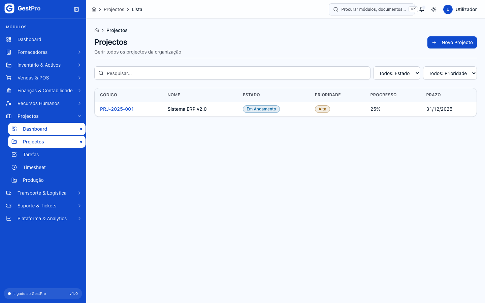
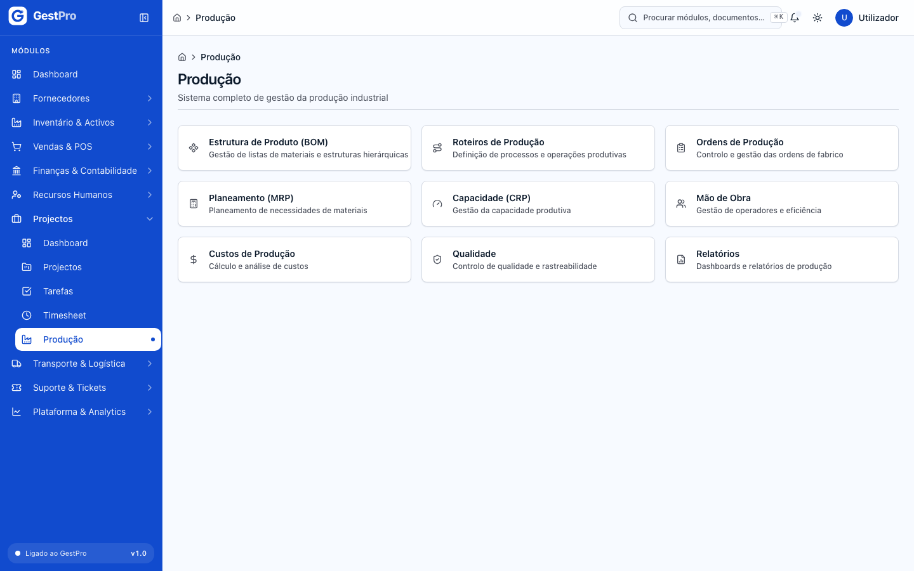
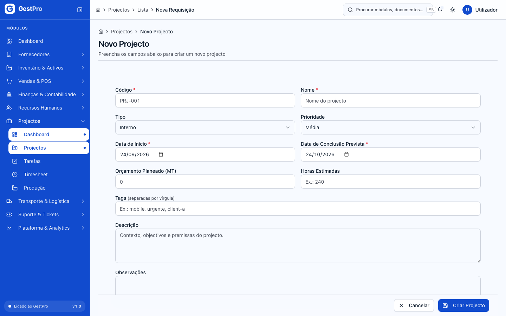
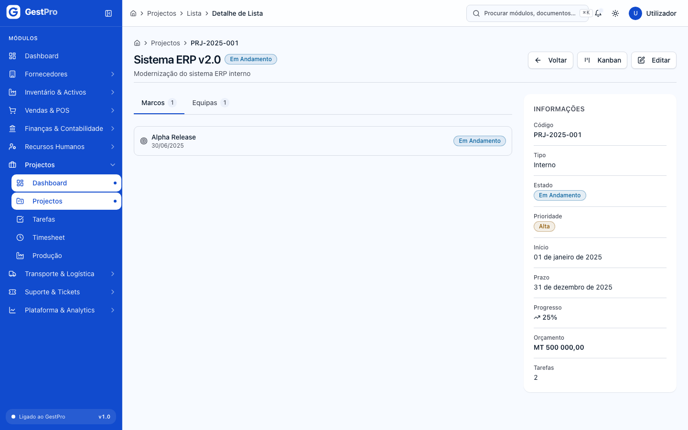
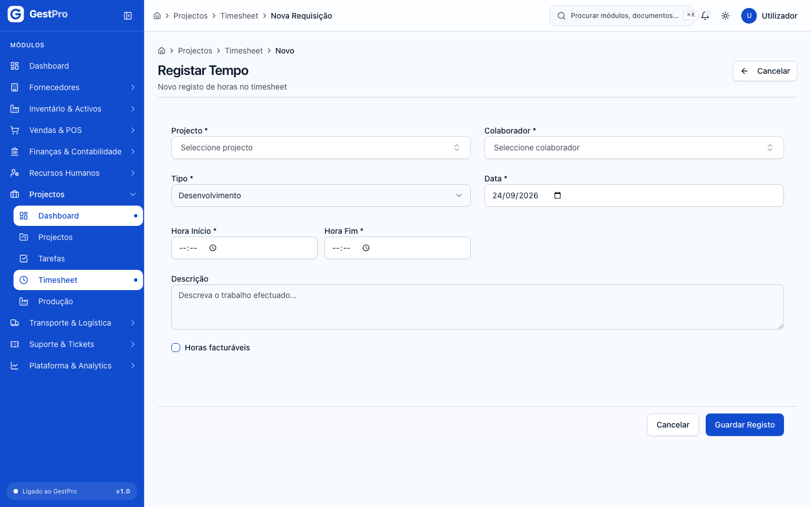
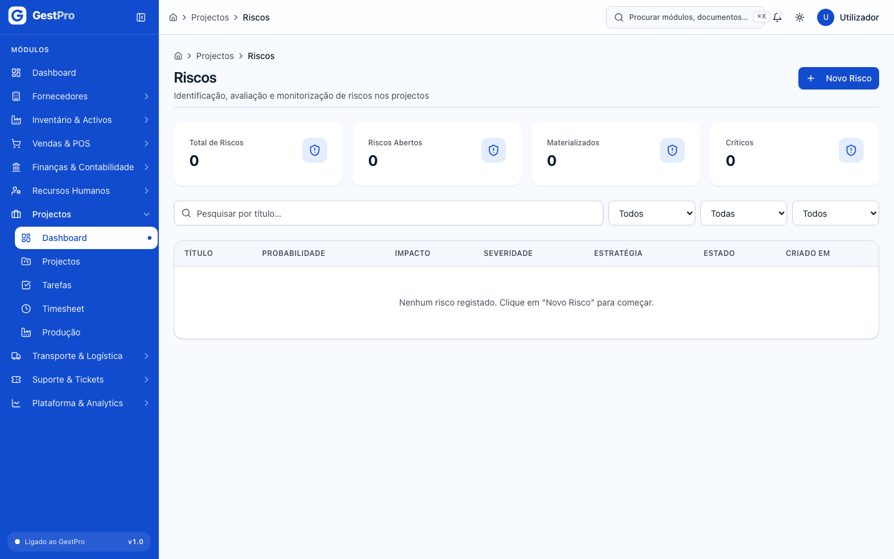
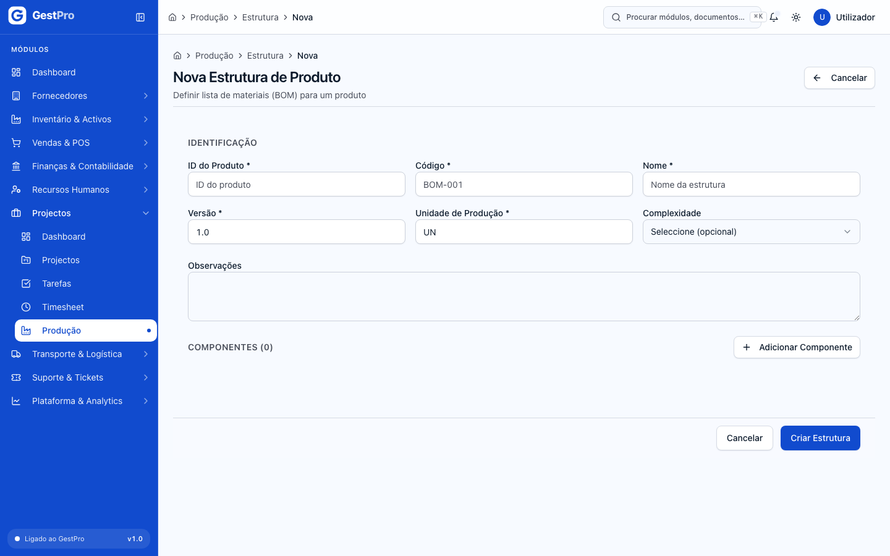
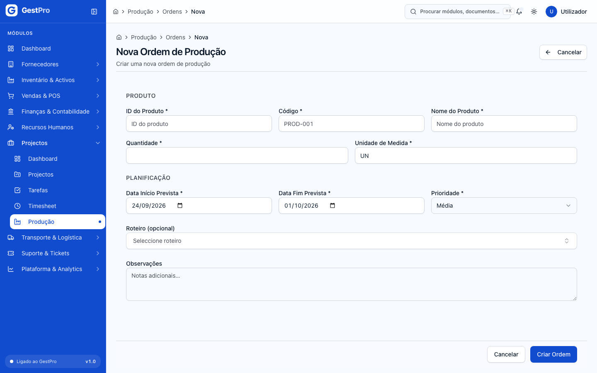
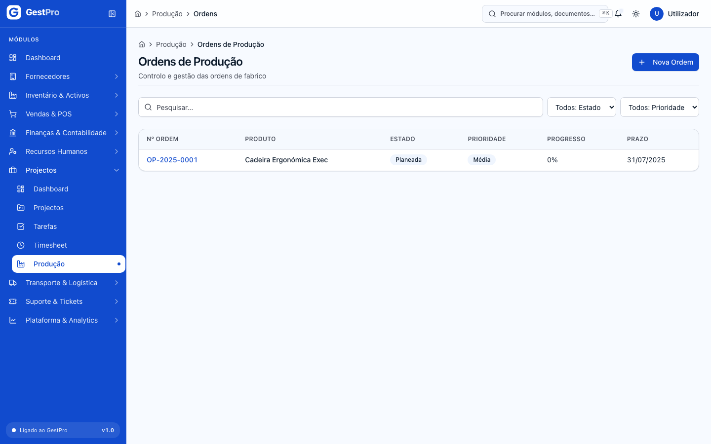

# 8. Projectos e Produção

> **Para quem:** Administrador, Gestor, Operador (consulta: Financeiro, Leitura) · **Onde:** menu › Projectos

## Para que serve

O grupo **Projectos** reúne duas áreas. Em **Projectos** regista os projectos da empresa, acompanha as tarefas num quadro Kanban, lança as horas trabalhadas (timesheet) e mantém o registo de riscos, qualidade e comunicações de cada projecto. Em **Produção** define as estruturas de produto (listas de materiais), os roteiros de fabrico e as ordens de produção, e consulta indicadores de planeamento, capacidade, custos e mão-de-obra.

Este capítulo descreve o que cada ecrã faz hoje. Algumas funções que existem no sistema ainda não têm botão no ecrã: estão assinaladas em caixas **Atenção**.

## Conceitos

| Termo | O que é |
|---|---|
| Projecto | Trabalho com início, prazo, orçamento planeado e horas estimadas. Identificado por um **Código** que escolhe (ex.: PRJ-001), único na empresa. |
| Tarefa | Unidade de trabalho dentro de um projecto. Aparece no Kanban do projecto, numa coluna por estado. |
| Marco | Data-chave de um projecto (entrega, aprovação). |
| Timesheet (registo de tempo) | Horas que um colaborador dedicou a um projecto num dia, com hora de início e de fim. |
| Risco | Ameaça ao projecto, com **Probabilidade** e **Impacto**. O sistema calcula a **Severidade** (de 1 a 16) multiplicando os dois. |
| Registo de qualidade | Não-conformidade, inspecção, auditoria ou revisão ligada a um projecto. |
| Comunicação | Reunião, ata, decisão, anúncio ou relatório de um projecto. Depois de registada não se altera. |
| Estrutura de produto (BOM) | Lista de materiais (componentes e quantidades) necessária para fabricar um produto. |
| Roteiro | Sequência de operações de fabrico, cada uma com tempos e custo por hora. |
| Centro de trabalho | Máquina, posto, célula ou linha onde se executa uma operação. |
| Ordem de produção (OP) | Pedido para fabricar uma quantidade de um produto até uma data. Recebe um número automático da série **OP**. |

## Ecrãs

### Projectos

| Menu | Endereço | Para que serve |
|---|---|---|
| Projectos › Dashboard | `/projetos` | Abre directamente a lista de projectos. |
| Projectos › Projectos | `/projetos/lista` | Lista de projectos, com filtros por **Estado** e **Prioridade**. Botão **Novo Projecto**. |
| (a partir da lista) | `/projetos/lista/novo` | Formulário **Novo Projecto**. |
| (clicar num projecto) | `/projetos/lista/<projecto>` | Ficha do projecto: dados, separadores **Marcos** e **Equipas**, botões **Kanban** e **Editar**. |
| (na ficha) | `/projetos/lista/<projecto>/kanban` | Quadro Kanban das tarefas do projecto. |
| Projectos › Tarefas | `/projetos/tarefas` | Todas as tarefas de todos os projectos, com filtros por **Estado** e **Prioridade**. |
| Projectos › Timesheet | `/projetos/timesheet` | Registos de horas, com filtro por **Tipo**. Botão **Registar Tempo**. |
| — | `/projetos/cronograma` | **Cronograma**: vista de Gantt dos projectos activos. |
| — | `/projetos/marcos` | **Marcos** de todos os projectos. |
| — | `/projetos/equipa` | **Equipas** de projecto. Botão **Nova Equipa**. |
| — | `/projetos/orcamento` | **Orçamentos** de projecto. Botão **Novo Orçamento**. |
| — | `/projetos/riscos` | **Riscos**: indicadores, matriz de risco e lista. Botão **Novo Risco**. |
| — | `/projetos/qualidade` | **Qualidade**: registos de não-conformidade, inspecção e auditoria. Botão **Novo Registo**. |
| — | `/projetos/comunicacoes` | **Comunicações**: reuniões, atas, decisões e anúncios. Botão **Nova Comunicação**. |
| — | `/projetos/relatorios` | **Relatórios**: indicadores globais e relatório por projecto. |
| — | `/projetos/configuracoes` | **Configurações** por projecto. |

> **Atenção:** os ecrãs marcados com «—» ainda não têm entrada no menu lateral. Abra-os escrevendo o endereço na barra do navegador (por exemplo, `/projetos/riscos`).

> **Atenção:** o ecrã `/projetos/documentos` é um protótipo: os documentos que lá carregar ficam guardados **só neste navegador** e não são partilhados com a empresa. Não o use para guardar documentos de projecto.

<!-- captura: 08-projetos-e-producao/projetos-lista.png | /projetos/lista -->

### Produção

| Menu | Endereço | Para que serve |
|---|---|---|
| Projectos › Produção | `/producao` | Página de entrada com atalhos para as nove áreas de produção. |
| (atalho) Estrutura de Produto (BOM) | `/producao/estrutura` | Lista de estruturas de produto. Botão **Nova Estrutura**. |
| (atalho) Roteiros de Produção | `/producao/roteiros` | Lista de roteiros. Botão **Novo Roteiro**. |
| (atalho) Ordens de Produção | `/producao/ordens` | Lista de ordens, com filtro por **Estado**. Botão **Nova Ordem**. |
| (atalho) Planeamento (MRP) | `/producao/planeamento` | Ordens planeadas: indicadores **Em Planeamento**, **Urgentes** e **Atrasadas**. |
| (atalho) Capacidade (CRP) | `/producao/capacidade` | Centros de trabalho, capacidade em horas por dia e operações em curso. |
| (atalho) Mão de Obra | `/producao/mao-obra` | Registos de assiduidade dos colaboradores (vêm de [Recursos Humanos](07-recursos-humanos.md)). |
| (atalho) Custos de Produção | `/producao/custos` | Custo estimado por ordem de produção. |
| (atalho) Qualidade | `/producao/qualidade` | Estado de qualidade e taxa de conclusão das ordens. |
| (atalho) Relatórios | `/producao/relatorios` | Totais de ordens, custo realizado face ao estimado, taxa de qualidade e progresso médio. |

<!-- captura: 08-projetos-e-producao/producao-entrada.png | /producao -->

## Tarefas

### Como criar um projecto

**Antes de começar:** precisa do perfil Administrador ou Gestor.

1. No menu, abra **Projectos › Projectos** e clique em **Novo Projecto**.
2. Preencha **Código** (ex.: PRJ-001) e **Nome**. São obrigatórios.
3. Escolha o **Tipo** (Interno, Externo, Pesquisa ou Desenvolvimento) e a **Prioridade** (Baixa, Média, Alta ou Crítica).
4. Indique a **Data de Início** e a **Data de Conclusão Prevista** (obrigatórias). A data de conclusão não pode ser anterior à de início.
5. Opcionalmente, preencha **Orçamento Planeado (MT)**, **Horas Estimadas**, **Tags** (separadas por vírgula), **Descrição** e **Observações**.
6. Clique em **Criar Projecto**.

**Resultado:** aparece a mensagem «Projecto criado com sucesso.» e abre a ficha do projecto, no estado **Planeamento**.

<!-- captura: 08-projetos-e-producao/projeto-novo.png | /projetos/lista/novo -->

### Como editar um projecto

1. Na lista, clique no projecto para abrir a ficha.
2. Clique em **Editar**. O botão só aparece se o projecto não estiver **Cancelado** nem **Arquivado**.
3. Altere **Nome**, **Prioridade**, **Data de Conclusão Prevista**, **Orçamento Planeado (MT)**, **Horas Estimadas**, **Tags**, **Descrição** ou **Observações**. O código, o tipo e a data de início não se alteram depois de criados.
4. Clique em **Guardar Alterações**.

**Resultado:** mensagem «Projecto actualizado com sucesso.»

<!-- captura: 08-projetos-e-producao/projeto-ficha.png | /projetos/lista >primeiro -->

> **Atenção:** ainda não há botão para mudar o estado de um projecto (por exemplo, de Planeamento para Em Andamento ou Concluído). O estado mostrado na ficha é o que o projecto tem no sistema.

### Como mover tarefas no Kanban

**Antes de começar:** precisa do perfil Administrador, Gestor ou Operador. O projecto tem de ter tarefas.

1. Abra a ficha do projecto e clique em **Kanban**.
2. O quadro tem as colunas **A Fazer**, **Em Progresso**, **Em Revisão**, **Bloqueada** e **Concluída**.
3. Arraste o cartão da tarefa para outra posição na mesma coluna (muda a ordem) ou para outra coluna (muda o estado).

**Resultado:** a tarefa fica na nova posição. Se a mudança de coluna não for permitida (ver [Estados](#estados)), aparece uma mensagem de erro e a tarefa fica onde estava.

> **Atenção:** ainda não é possível criar ou editar tarefas no ecrã. O botão **Nova Tarefa** em **Projectos › Tarefas** leva para a lista de projectos, e clicar numa tarefa dessa lista abre uma página inexistente.

### Como registar horas (timesheet)

**Antes de começar:** precisa do perfil Administrador, Gestor ou Operador. O colaborador tem de existir em [Recursos Humanos](07-recursos-humanos.md).

1. Abra **Projectos › Timesheet** e clique em **Registar Tempo**.
2. Escolha o **Projecto** e o **Colaborador**.
3. Escolha o **Tipo**: Desenvolvimento, Reunião, Documentação, Teste, Suporte ou Outro.
4. Indique a **Data**, a **Hora Início** e a **Hora Fim**. A hora de fim tem de ser posterior à de início.
5. Opcionalmente escreva uma **Descrição** e marque **Horas facturáveis**.
6. Clique em **Guardar Registo**.

**Resultado:** mensagem «Registo de tempo guardado.» O sistema calcula a duração. O registo aparece na lista com o estado **Pendente**.

> **Atenção:** a aprovação de horas ainda não tem botão no ecrã, por isso os registos ficam em **Pendente**. A opção **Política de Aprovação de Timesheet** em Configurações é guardada, mas ainda não altera este comportamento.

<!-- captura: 08-projetos-e-producao/timesheet-novo.png | /projetos/timesheet/novo -->

### Como criar uma equipa de projecto

**Antes de começar:** precisa do perfil Administrador ou Gestor.

1. Abra `/projetos/equipa` e clique em **Nova Equipa**.
2. Preencha **Nome** (obrigatório) e, se quiser, **Descrição**.
3. Clique em **Criar Equipa**.

**Resultado:** mensagem «Equipa criada com sucesso.» Ainda não é possível adicionar membros nem associar a equipa a um projecto a partir do ecrã.

### Como criar um orçamento de projecto

**Antes de começar:** precisa do perfil Administrador ou Gestor.

1. Abra `/projetos/orcamento` e clique em **Novo Orçamento**.
2. Em **ID do Projecto**, cole o identificador interno do projecto: é a última parte do endereço da ficha do projecto (`/projetos/lista/<identificador>`).
3. Em **Categorias**, preencha para cada rubrica o **Nome**, o **Tipo** (Mão de Obra, Material, Equipamento, Serviço ou Outro) e o **Valor Planeado**. Use **Adicionar categoria** para mais linhas. O **Total Planeado** é somado automaticamente.
4. Opcionalmente, escreva **Observações**.
5. Clique em **Criar Orçamento**.

**Resultado:** mensagem «Orçamento criado com sucesso.»

### Como registar um risco

**Antes de começar:** precisa do perfil Administrador ou Gestor.

1. Abra `/projetos/riscos` e clique em **Novo Risco**.
2. Escolha o **Projecto** e escreva o **Título**. Opcionalmente, uma **Descrição**.
3. Escolha a **Probabilidade** (Baixa, Média, Alta, Muito Alta) e o **Impacto** (Baixo, Médio, Alto, Muito Alto).
4. Escolha a **Estratégia de Resposta**: Evitar, Mitigar, Transferir ou Aceitar.
5. Opcionalmente, descreva o **Plano de Mitigação**.
6. Clique em **Guardar**.

**Resultado:** mensagem «Risco criado com sucesso». O risco fica **Identificado** e com a severidade calculada. Na matriz de risco, as cores correspondem a **Baixo (1-2)**, **Médio (3-6)**, **Alto (7-12)** e **Crítico (13-16)**.

Para alterar um risco, abra-o na lista e clique em **Editar**. Se mudar a probabilidade ou o impacto, a severidade é recalculada. Um risco **Fechado** já não pode ser editado.

> **Atenção:** ainda não há botão para mudar o estado de um risco (Em Mitigação, Materializado, Fechado).

<!-- captura: 08-projetos-e-producao/riscos.png | /projetos/riscos -->

### Como registar qualidade e comunicações

**Antes de começar:** precisa do perfil Administrador ou Gestor.

**Registo de qualidade**

1. Abra `/projetos/qualidade` e clique em **Novo Registo**.
2. Escolha o **Projecto** e o **Tipo** (Não Conformidade, Inspeção, Auditoria, Revisão).
3. Escreva a **Descrição** (obrigatória) e, se aplicável, a **Acção Correctiva**.
4. Clique em **Guardar**.

**Resultado:** mensagem «Registo de qualidade criado com sucesso». O registo fica **Aberta**. Ainda não há botão para mudar o estado.

**Comunicação**

1. Abra `/projetos/comunicacoes` e clique em **Nova Comunicação**.
2. Escolha o **Projecto**, o **Tipo** (Reunião, Ata, Decisão, Anúncio, Relatório) e a **Data**.
3. Em **Participantes**, escreva um nome por linha.
4. Escreva o **Resumo / Ata**.
5. Clique em **Guardar**.

**Resultado:** mensagem «Comunicação registada com sucesso». As comunicações não se editam depois de registadas.

### Como consultar o cronograma e os relatórios

1. Abra `/projetos/cronograma`. No topo vê **Total de Projectos**, **Em Andamento**, **Com Atraso** e **Progresso Médio**. Clique num projecto para ver o Gantt das suas tarefas e marcos.
2. Abra `/projetos/relatorios`. Vê **Total de Projectos**, **Em Andamento**, **Concluídos**, **Horas Registadas** e o gráfico **Progresso por Projecto**.

> **Atenção:** o relatório de um só projecto (**Progresso**, **Tarefas Concluídas**, **Horas (est./real)**, **Desvio Orçamental** e marcos em atraso) existe, mas ainda não há no ecrã uma forma de escolher o projecto.

O cronograma só mostra projectos em Planeamento, Em Andamento ou Pausado.

### Como configurar um projecto

**Antes de começar:** precisa do perfil Administrador ou Gestor.

1. Abra `/projetos/configuracoes` e escolha o projecto.
2. Defina a **Política de Aprovação de Timesheet** (Manual ou Automática), os **Tipos de Tarefa Activos** e os **Papéis de Equipa Activos**. Pode acrescentar **Observações**.
3. Clique em **Guardar Configurações**.

**Resultado:** mensagem «Configurações guardadas com sucesso». Estas opções ficam guardadas, mas ainda não alteram o funcionamento das tarefas nem das horas.

### Como criar uma estrutura de produto (BOM)

**Antes de começar:** precisa do perfil Administrador, Gestor ou Operador. O produto e os componentes têm de existir no [Inventário](03-inventario.md).

1. Abra **Projectos › Produção**, clique em **Estrutura de Produto (BOM)** e depois em **Nova Estrutura**.
2. Em **Identificação**, preencha **ID do Produto** (identificador interno do produto), **Código** (ex.: BOM-001), **Nome**, **Versão** (ex.: 1.0) e **Unidade de Produção** (ex.: UN). **Complexidade** é opcional (Baixo, Médio, Alto).
3. Em **Componentes**, clique em **Adicionar Componente** e preencha **ID do Componente**, **Código**, **Nome**, **Categoria** (Matéria-Prima, Componente, Subconjunto, Produto Acabado), **Unidade**, **Quantidade** e **Custo Unitário (MZN)**. Clique em **Adicionar**. Repita para cada componente.
4. Clique em **Criar Estrutura**.

**Resultado:** mensagem «Estrutura de produto criada com sucesso.» A estrutura fica em **Rascunho**. Se um componente criar um ciclo (um produto que, directa ou indirectamente, é componente de si próprio), a gravação é recusada.

<!-- captura: 08-projetos-e-producao/estrutura-nova.png | /producao/estrutura/nova -->

### Como criar um roteiro de produção

**Antes de começar:** precisa do perfil Administrador, Gestor ou Operador.

1. Em **Produção**, abra **Roteiros de Produção** e clique em **Novo Roteiro**.
2. Preencha **Código** (ex.: ROT-001), **Nome** e **Versão**. **Categoria**, **Estrutura do Produto** e **Observações** são opcionais.
3. Em **Operações**, clique em **Adicionar Operação**. Preencha **Nome**, **Tempo Operação (min)** e, se quiser, **Centro de Trabalho**, **Sequência**, **Tempo Preparação (min)**, **Custo/Hora (MZN)** e **Eficiência Esperada (%)**. Clique em **Adicionar**.
4. Clique em **Criar Roteiro**.

**Resultado:** mensagem «Roteiro criado com sucesso.» O roteiro fica em **Rascunho**.

### Como criar uma ordem de produção

**Antes de começar:** precisa do perfil Administrador, Gestor ou Operador.

1. Em **Produção**, abra **Ordens de Produção** e clique em **Nova Ordem**.
2. Em **Produto**, preencha **ID do Produto**, **Código**, **Nome do Produto**, **Quantidade** e **Unidade de Medida**.
3. Em **Planificação**, indique **Data Início Prevista**, **Data Fim Prevista** e **Prioridade** (Baixa, Média, Alta, Urgente). A data de fim não pode ser anterior ao início.
4. Opcionalmente, escolha um **Roteiro (opcional)** e escreva **Observações**.
5. Clique em **Criar Ordem**.

**Resultado:** mensagem «Ordem de produção criada com sucesso.» A ordem recebe um número da série OP e fica **Planeada**. Passa a contar nos indicadores de **Planeamento** e **Custos de Produção**.

<!-- captura: 08-projetos-e-producao/ordem-nova.png | /producao/ordens/nova -->

<!-- captura: 08-projetos-e-producao/ordens-lista.png | /producao/ordens -->

> **Atenção:** a ficha da ordem de produção ainda não existe. Por isso, a partir do ecrã **ainda não é possível**: libertar, iniciar, pausar, concluir ou cancelar uma ordem; registar o consumo de materiais; nem dar entrada do produto acabado em stock. O mesmo se aplica à activação de estruturas (BOM) e roteiros, que ficam em **Rascunho**. Clicar numa linha das listas de ordens, estruturas ou roteiros (ou em **Ver detalhes** nos Custos) abre uma página inexistente.
>
> Quando estas acções tiverem botão, o sistema já está preparado para: ao **libertar** uma ordem, reservar no armazém de matérias-primas os materiais da estrutura **activa** do produto; ao **concluir**, exigir que todas as operações estejam concluídas e a qualidade aprovada, baixar o stock dos materiais reservados e dar entrada do produto acabado; ao **cancelar**, libertar as reservas. Ver [Inventário](03-inventario.md).

## Estados

### Projecto

| Estado | Significado | Pode passar a | Quem |
|---|---|---|---|
| Planeamento | Projecto criado, ainda não arrancou. | Em Andamento, Cancelado | Administrador, Gestor |
| Em Andamento | Projecto em execução. | Pausado, Concluído, Cancelado | Administrador, Gestor |
| Pausado | Execução suspensa. | Em Andamento, Cancelado | Administrador, Gestor |
| Concluído | Terminado. | Arquivado | Administrador, Gestor |
| Cancelado | Abandonado. Já não se edita. | Arquivado | Administrador, Gestor |
| Arquivado | Fechado definitivamente. Já não se edita. | — | — |

Hoje as mudanças de estado do projecto não têm botão no ecrã (ver caixa acima).

### Tarefa (colunas do Kanban)

| Estado | Significado | Pode passar a | Quem |
|---|---|---|---|
| A Fazer | Por iniciar. | Em Progresso, Cancelada | Administrador, Gestor, Operador |
| Em Progresso | Em curso. | Em Revisão, Bloqueada, Concluída, Cancelada | Administrador, Gestor, Operador |
| Em Revisão | Aguarda validação. | Em Progresso, Concluída, Cancelada | Administrador, Gestor, Operador |
| Bloqueada | Impedida de avançar. Não pode passar directamente a Concluída. | A Fazer, Em Progresso, Cancelada | Administrador, Gestor, Operador |
| Concluída | Terminada. | — | — |
| Cancelada | Abandonada (não tem coluna no Kanban). | — | — |

### Registo de tempo

| Estado | Significado | Pode passar a | Quem |
|---|---|---|---|
| Pendente | Horas registadas, por aprovar. | Aprovado | Administrador, Gestor (sem botão no ecrã, ver caixa acima) |
| Aprovado | Horas aprovadas. | — | — |

### Risco

| Estado | Significado | Pode passar a | Quem |
|---|---|---|---|
| Identificado | Registado. | Em Mitigação, Fechado, Materializado | Administrador, Gestor |
| Em Mitigação | Plano de resposta em curso. | Fechado, Materializado, Identificado | Administrador, Gestor |
| Materializado | O risco aconteceu. | Em Mitigação, Fechado | Administrador, Gestor |
| Fechado | Encerrado. Já não se edita. | — | — |

### Registo de qualidade

| Estado | Significado | Pode passar a | Quem |
|---|---|---|---|
| Aberta | Registado. | Em Análise, Fechada | Administrador, Gestor |
| Em Análise | Em investigação. | Resolvida, Fechada | Administrador, Gestor |
| Resolvida | Acção correctiva aplicada. | Fechada | Administrador, Gestor |
| Fechada | Encerrado. Já não se edita. | — | — |

### Ordem de produção

| Estado | Significado | Pode passar a | Quem |
|---|---|---|---|
| Planeada | Criada, à espera de libertação. | Liberada, Cancelada | Administrador, Gestor, Operador |
| Liberada | Materiais reservados. | Em Produção, Cancelada | Administrador, Gestor, Operador |
| Em Produção | Em fabrico. | Concluída, Pausada, Cancelada | Administrador, Gestor, Operador |
| Pausada | Fabrico interrompido. | Em Produção, Cancelada | Administrador, Gestor, Operador |
| Concluída | Produto acabado em stock. | — | — |
| Cancelada | Anulada; reservas libertadas. | — | — |

Hoje só é possível criar ordens (estado Planeada); as restantes mudanças ainda não têm botão.

### Estrutura de produto (BOM) e roteiro

| Estado | Significado | Pode passar a |
|---|---|---|
| Rascunho | Em preparação. | Activo, Inactivo (roteiro: também Em Revisão) |
| Em Revisão (só roteiro) | Em validação. | Rascunho, Activo |
| Activo | Em uso. Só a estrutura activa é usada ao libertar ordens. | Inactivo, Substituído |
| Inactivo | Fora de uso. | Activo |
| Substituído | Trocado por outra versão. Já não se edita. | — |

## Erros frequentes

| Mensagem mostrada | Porquê | O que fazer |
|---|---|---|
| Sem permissão para esta operação | O seu perfil não permite esta acção (por exemplo, um Operador a criar um projecto). | Peça a um Administrador ou Gestor. |
| Data de fim prevista não pode ser anterior à data de início | Datas trocadas no projecto. | Corrija as datas. |
| Hora de fim deve ser posterior à hora de início | No registo de tempo, a hora de fim é igual ou anterior à de início. | Corrija as horas. |
| Não é possível editar um projecto arquivado | O projecto está Arquivado. | Não é possível alterar. |
| Transição de 'BLOQUEADA' para 'CONCLUIDA' não é permitida | No Kanban, moveu uma tarefa para uma coluna não permitida a partir do estado actual. | Mova-a primeiro para um estado intermédio (ver tabela da Tarefa). |
| Não é possível editar um risco fechado | O risco está Fechado. | Não é possível alterar. |
| Adicionar este componente criaria um ciclo na BOM | O componente contém, directa ou indirectamente, o próprio produto. | Retire esse componente. |
| Data de fim não pode ser anterior ao início previsto | Datas trocadas na ordem de produção. | Corrija as datas. |
| Série activa para tipo "ORDEM_PRODUCAO" no ano … não encontrada. Crie a série … primeiro. | Não existe série de numeração OP activa para o ano. | As séries são criadas automaticamente quando a empresa é criada e, em Dezembro, para o ano seguinte. Se faltar, contacte o suporte do GestPro. |
| Erro interno | Erro inesperado. Ao criar um projecto, acontece por exemplo se o **Código** já estiver a ser usado por outro projecto. | Use um código diferente. Se persistir, contacte o suporte. |

## Perguntas frequentes

**Onde encontro Riscos, Qualidade, Cronograma e os outros ecrãs de projecto?**
Ainda não estão no menu. Escreva o endereço na barra do navegador (ver a tabela [Ecrãs](#ecrãs)).

**A pesquisa na lista de projectos não filtra nada.**
Use os filtros **Estado** e **Prioridade**. A caixa de pesquisa desta lista (e das listas de marcos, equipas, orçamentos, timesheet, ordens, estruturas e roteiros) ainda não tem efeito.

**O Operador pode criar projectos?**
Não. O Operador pode consultar projectos, mover tarefas no Kanban e registar horas. Criar e editar projectos, riscos, qualidade, comunicações, equipas, orçamentos e configurações é para Administrador e Gestor.
