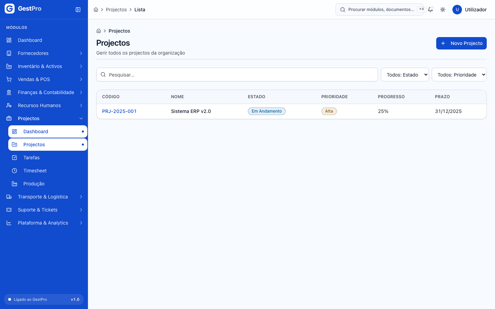
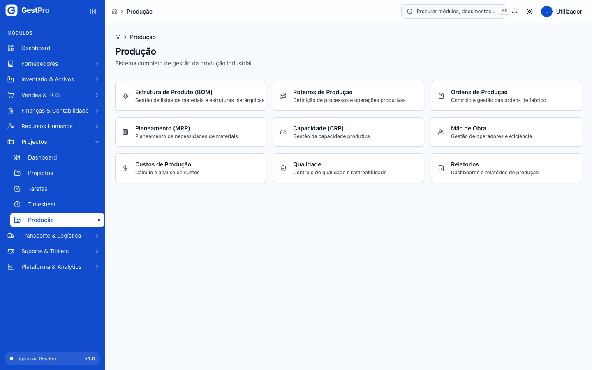
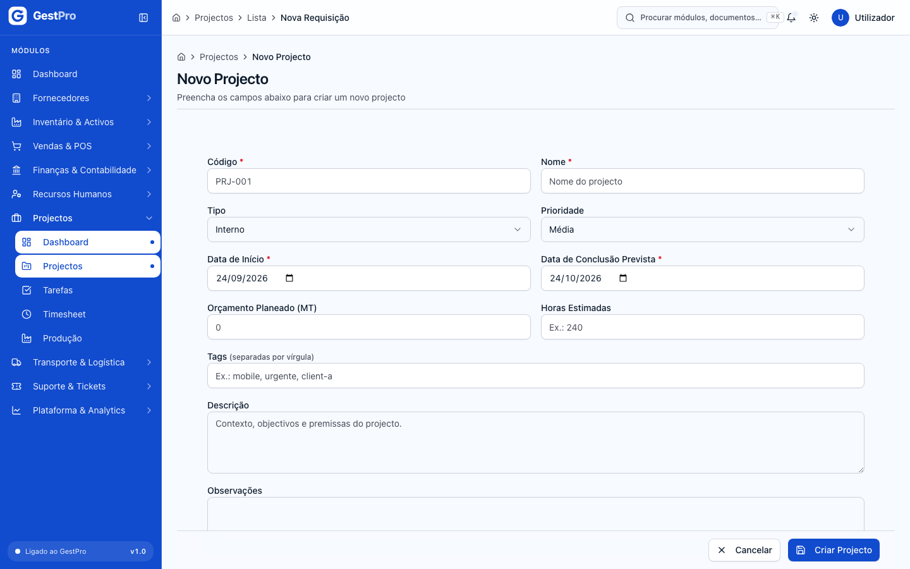
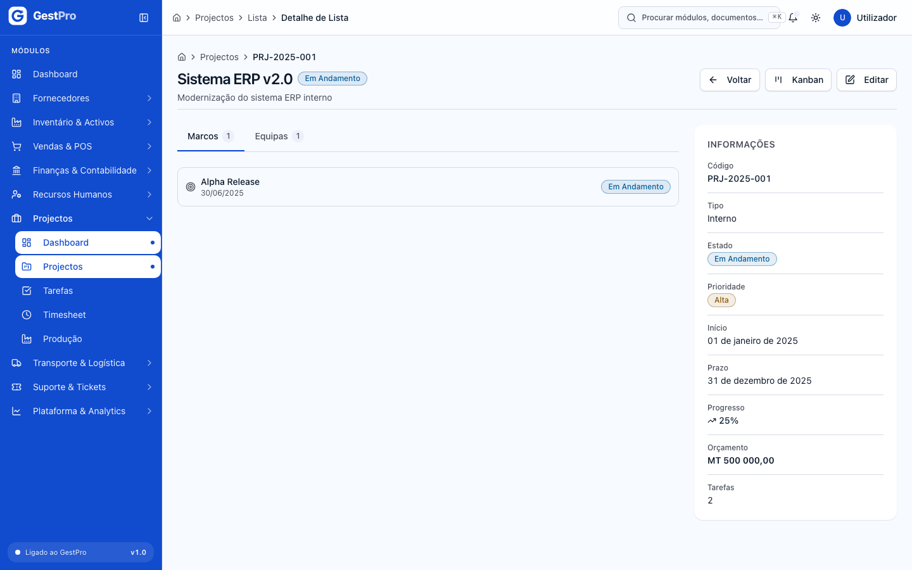
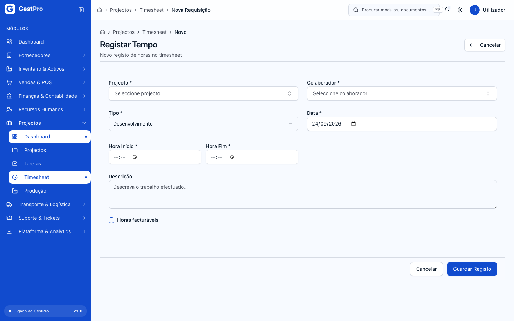
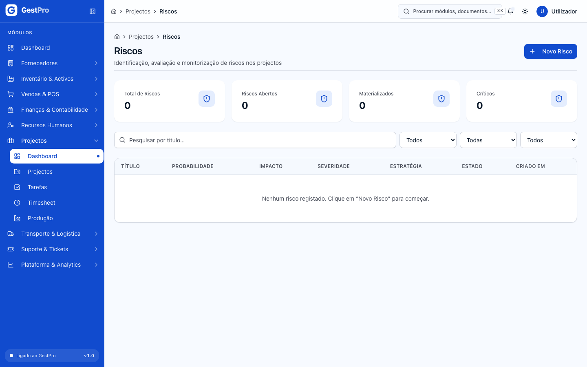
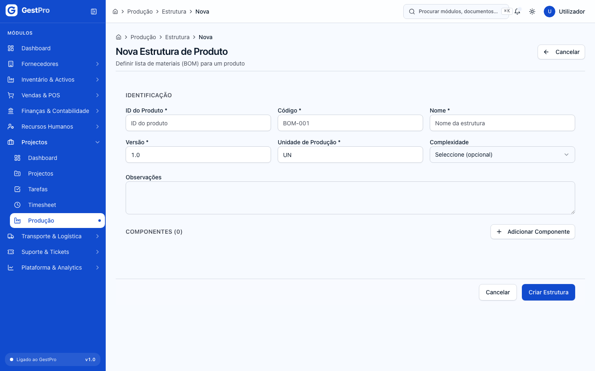
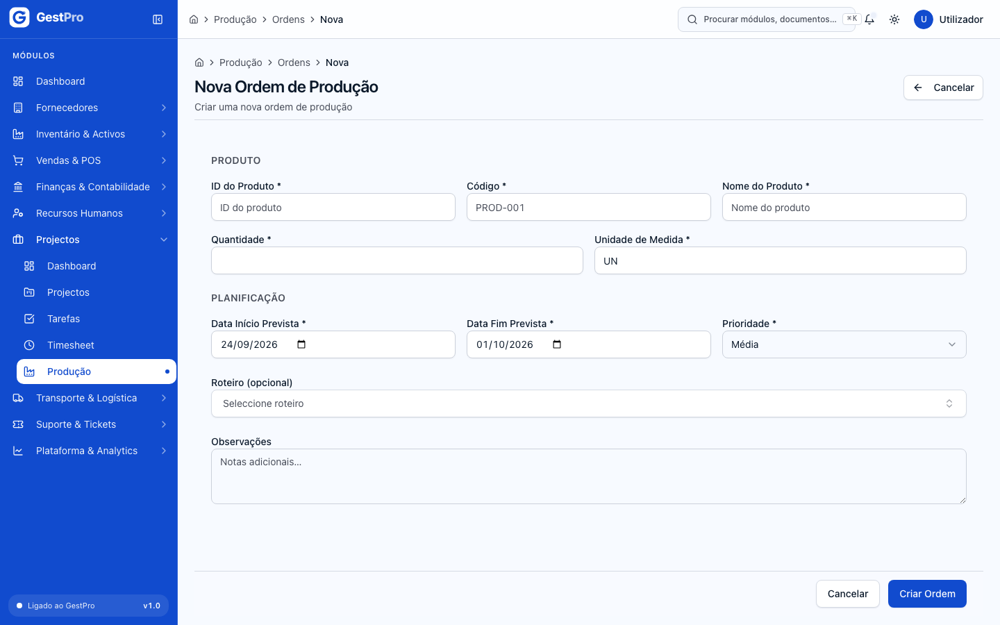
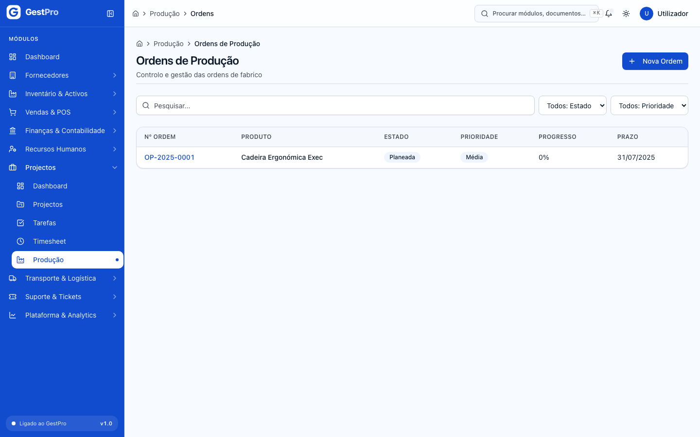

# 8. Projectos e Produção

> **Para quem:** Administrador, Gestor, Operador (consulta: Financeiro, Leitura) · **Onde:** menu › Projectos

## Objectivo do módulo

O grupo **Projectos** reúne duas áreas. Em **Projectos** regista os projectos da empresa e acompanha o seu estado, cria as tarefas e move-as num quadro Kanban, marca os marcos, lança e aprova as horas trabalhadas (timesheet) e mantém o registo de riscos, qualidade e comunicações de cada projecto. Em **Produção** define as estruturas de produto (listas de materiais), os centros de trabalho e os roteiros de fabrico, e acompanha cada ordem de produção desde a libertação até à conclusão, com reserva e consumo de materiais, controlo de qualidade e entrada do produto acabado no stock; consulta ainda indicadores de planeamento, capacidade, custos e mão-de-obra.

O objectivo é dar **controlo a trabalho que não é uma simples venda**: um projecto com prazo, orçamento e
horas, ou um produto que a empresa fabrica a partir de matérias-primas, com custo conhecido antes de produzir.

| | |
|---|---|
| **Que problema resolve** | Projectos geridos de memória, horas que ninguém regista nem aprova, riscos descobertos tarde; produção sem receita de materiais, sem custo por unidade e sem rasto no stock. |
| **Quem usa** | Gestor (projectos, riscos, aprovação de horas, estruturas, ordens); Operador (tarefas, timesheets, produção). |
| **O que entra** | Projectos (prazos, orçamento, horas), tarefas, marcos, horas, riscos; estruturas de produto (BOM), centros de trabalho, roteiros e ordens de produção, consumos de material e avaliação de qualidade. |
| **O que sai** | Kanban, cronograma, relatórios de progresso, matriz de risco, horas aprovadas; custo planeado de cada produto fabricado, materiais reservados e consumidos, produto acabado em stock e indicadores de produção. |
| **Liga-se a** | [Recursos Humanos](07-recursos-humanos.md) (colaboradores nas timesheets), [Inventário](03-inventario.md) (reserva e consumo dos materiais, entrada do produto acabado). |

Este capítulo descreve o que cada ecrã faz hoje. Algumas funções que existem no sistema ainda não têm botão no ecrã: estão assinaladas em caixas **Atenção**.

## Exemplo prático — abrir uma segunda loja e fabricar blocos

**Situação:** a Ferragens Boa Obra vai abrir uma loja na Matola e, ao mesmo tempo, começar a fabricar
blocos de cimento no quintal do armazém. A Marta (Gestor) gere os dois.

**Parte A — o projecto da loja**

1. **Criar o projecto** → [Como criar um projecto](#como-criar-um-projecto)

   | Campo | Valor |
   |---|---|
   | Código · Nome | PRJ-001 · Abertura da loja da Matola |
   | Tipo · Prioridade | Interno · Alta |
   | Início · Conclusão prevista | 1 de Novembro · 31 de Janeiro |
   | Orçamento planeado · Horas estimadas | 850 000,00 MT · 400 h |

   O projecto nasce em **Planeamento**. A 1 de Novembro, a Marta clica em **Iniciar** na ficha e o projecto
   passa a **Em Andamento** → [Como mudar o estado de um projecto](#como-mudar-o-estado-de-um-projecto).

2. **Criar as tarefas e os marcos** → [Como criar e editar uma tarefa](#como-criar-e-editar-uma-tarefa) ·
   [Como criar um marco](#como-criar-um-marco): tarefa `TAR-001` «Levantamento de medidas», prazo 8 de
   Novembro, prioridade **Alta** (aparece na coluna **A Fazer** do Kanban); marco «Licença municipal
   aprovada», data prevista 30 de Novembro.

3. **Registar e aprovar horas** → [Como registar horas](#como-registar-horas-timesheet) ·
   [Como aprovar ou rejeitar horas](#como-aprovar-ou-rejeitar-horas): o Jorge passa a manhã de 4 de Novembro a
   tirar medidas — Projecto PRJ-001, Colaborador Jorge Mabote, Tipo **Outro**, 08:00–12:00 → **4 h**,
   **Pendente**. A Marta abre o registo e clica em **Aprovar**: fica **Aprovado**.

4. **Registar um risco** → [Como registar um risco](#como-registar-um-risco): «Atraso na licença municipal»,
   Probabilidade **Alta** (3) × Impacto **Alto** (3) = severidade **9 → Alto** (7–12); estratégia **Mitigar**,
   plano «Entregar o processo completo na primeira semana e acompanhar semanalmente».

5. **Acompanhar** no **Cronograma** e nos **Relatórios** (`/projetos/cronograma`, `/projetos/relatorios`):
   horas registadas, progresso e projectos com atraso.

**Parte B — fabricar blocos de cimento**

1. **Criar os produtos** em [Inventário](03-inventario.md#como-criar-um-produto): `AREIA` «Areia grossa» (unidade
   Quilograma, compra 1,00 MT/kg) e `BLC-15` «Bloco de cimento 15 cm» (unidade Unidade, venda 45,00).
2. **Criar os armazéns da produção** em [Inventário](03-inventario.md#como-criar-uma-localização): `MP`
   «Matérias-primas» e `PA` «Produto acabado», ambos do tipo **Armazém**. Os códigos têm de ser exactamente
   `MP` e `PA`: é deles que as ordens de produção tiram os materiais e onde põem o produto acabado. Com o
   `ARM-01`, a empresa passa a ter três armazéns activos, o que exige o plano Profissional ou Empresarial.
3. **Estrutura de produto (BOM)** → [Como criar uma estrutura](#como-criar-uma-estrutura-de-produto-bom): `BOM-001`
   «Bloco 15 cm», produto BLC-15, versão 1.0, Unidade de Produção «UN». As quantidades são **por bloco**, porque
   a ordem multiplica-as pela quantidade a fabricar:

   | Componente | Categoria | Qtd por bloco | Custo unit. | Custo |
   |---|---|---:|---:|---:|
   | Cimento Portland 50 kg (saco) | Matéria-Prima | 0,03 | 520,00 | 15,60 |
   | Areia grossa (kg) | Matéria-Prima | 7,5 | 1,00 | 7,50 |
   | **Custo de materiais por bloco** | | | | **23,10** |

   Com venda a 45,00, a margem bruta sobre materiais é de 21,90 por bloco, antes da mão-de-obra. Na ficha da
   estrutura, a Marta clica em **Activar** → [Como activar ou desactivar](#como-activar-ou-desactivar-uma-estrutura-ou-um-roteiro).
4. **Centro de trabalho e roteiro** → [Como gerir os centros de trabalho](#como-gerir-os-centros-de-trabalho) ·
   [Como criar um roteiro](#como-criar-um-roteiro-de-produção): centro `BET-1` «Betoneira 1», tipo **Máquina**,
   custo por hora 250,00 MT, 8 h/dia; roteiro `ROT-001` com as operações «Misturar» (20 min) e «Moldar e curar»
   (60 min), ambas no centro BET-1. O roteiro também se **Activa**.
5. **Pôr os materiais no armazém MP** → [Inventário](03-inventario.md#como-transferir-stock-entre-localizações):
   transferir 15 sacos de CIM-50 de `ARM-01` para `MP` e receber 3 000 kg de areia em `MP` (na recepção da compra,
   com **Localização de destino** MP).
6. **Ordem de produção** → [Como criar uma ordem](#como-criar-uma-ordem-de-produção): 500 blocos BLC-15 (5 lotes de
   100), de 10 a 12 de Novembro, prioridade **Alta**, roteiro ROT-001. Recebe o número `OP/…` e fica **Planeada**.
7. **Liberar, produzir e concluir** → [Como acompanhar uma ordem de produção](#como-acompanhar-uma-ordem-de-produção):

   | Acção | Estado | Efeito no stock |
   |---|---|---|
   | **Liberar ordem** | Liberada | Reserva em MP 15 sacos de cimento (0,03 × 500) e 2 500 kg de areia (7,5 × 500) |
   | **Iniciar produção** | Em Produção | — |
   | **Aprovar qualidade** | Em Produção (qualidade **Aprovada**) | — |
   | **Concluir ordem** | Concluída | Saída de MP dos 15 sacos e dos 2 500 kg; entrada de 500 BLC-15 em PA |

   Custo de materiais da ordem: 500 × 23,10 = **11 550,00 MT**.

**Resultado esperado:** o projecto aparece **Em Andamento** no Kanban, no cronograma e nos relatórios, com as
horas aprovadas; a ordem fica **Concluída** e, em Inventário › Movimentações, aparecem as saídas de cimento e
areia do MP e a entrada dos 500 blocos no PA. Para os vender ao balcão, transfira-os para o `ARM-01`: o POS dá
saída do armazém activo principal (ver [Inventário](03-inventario.md)).

## Conceitos

| Termo | O que é |
|---|---|
| Projecto | Trabalho com início, prazo, orçamento planeado e horas estimadas. Identificado por um **Código** que escolhe (ex.: PRJ-001), único na empresa. |
| Tarefa | Unidade de trabalho dentro de um projecto, com código, título e prazo. Aparece no Kanban do projecto, numa coluna por estado. |
| Marco | Data-chave de um projecto (entrega, aprovação). |
| Timesheet (registo de tempo) | Horas que um colaborador dedicou a um projecto num dia, com hora de início e de fim. Fica por aprovar até um Gestor o aprovar ou rejeitar. |
| Risco | Ameaça ao projecto, com **Probabilidade** e **Impacto**. O sistema calcula a **Severidade** (de 1 a 16) multiplicando os dois. |
| Registo de qualidade | Não-conformidade, inspecção, auditoria ou revisão ligada a um projecto. |
| Comunicação | Reunião, ata, decisão, anúncio ou relatório de um projecto. Depois de registada não se altera. |
| Estrutura de produto (BOM) | Lista de materiais (componentes e quantidades) necessária para fabricar **uma unidade** de um produto. Só a estrutura **Activa** é usada pelas ordens. |
| Roteiro | Sequência de operações de fabrico, cada uma com tempos e custo por hora. |
| Centro de trabalho | Máquina, pessoa, célula ou linha onde se executa uma operação, com custo por hora e capacidade em horas por dia. |
| Ordem de produção (OP) | Pedido para fabricar uma quantidade de um produto até uma data. Recebe um número automático da série **OP**. |
| Armazéns MP e PA | Localizações do tipo Armazém com os códigos `MP` (matérias-primas: de onde saem os materiais) e `PA` (produto acabado: onde entra o que se fabrica). |

## Ecrãs

### Projectos

| Menu | Endereço | Para que serve |
|---|---|---|
| Projectos › Dashboard | `/projetos` | Abre directamente a lista de projectos. |
| Projectos › Projectos | `/projetos/lista` | Lista de projectos, com filtros por **Estado** e **Prioridade**. Botão **Novo Projecto**. |
| (a partir da lista) | `/projetos/lista/novo` | Formulário **Novo Projecto**. |
| (clicar num projecto) | `/projetos/lista/<projecto>` | Ficha do projecto: dados, separadores **Marcos** e **Equipas**, botões de estado (**Iniciar**, **Pausar**, **Concluir**…), **Kanban** e **Editar**. |
| (na ficha) | `/projetos/lista/<projecto>/kanban` | Quadro Kanban das tarefas do projecto. |
| Projectos › Tarefas | `/projetos/tarefas` | Todas as tarefas de todos os projectos, com filtros por **Estado** e **Prioridade**. Botão **Nova Tarefa**. |
| (clicar numa tarefa) | `/projetos/tarefas/<tarefa>` | Detalhe da tarefa, com **Editar**. |
| Projectos › Timesheet | `/projetos/timesheet` | Registos de horas, com filtro por **Tipo** e a coluna **Estado**. Botão **Registar Tempo**. |
| (clicar num registo) | `/projetos/timesheet/<registo>` | **Registo de Tempo**: detalhe e, se estiver por aprovar, **Aprovar** ou **Rejeitar**. |
| — | `/projetos/cronograma` | **Cronograma**: vista de Gantt dos projectos activos. |
| — | `/projetos/marcos` | **Marcos** de todos os projectos. Botão **Novo Marco**. |
| — | `/projetos/equipa` | **Equipas** de projecto. Botão **Nova Equipa**. |
| — | `/projetos/orcamento` | **Orçamentos** de projecto. Botão **Novo Orçamento**. |
| — | `/projetos/riscos` | **Riscos**: indicadores, matriz de risco e lista. Botão **Novo Risco**. |
| — | `/projetos/qualidade` | **Qualidade**: registos de não-conformidade, inspecção e auditoria. Botão **Novo Registo**. |
| — | `/projetos/comunicacoes` | **Comunicações**: reuniões, atas, decisões e anúncios. Botão **Nova Comunicação**. |
| — | `/projetos/relatorios` | **Relatórios**: indicadores globais e relatório por projecto. |
| — | `/projetos/configuracoes` | **Configurações** por projecto. |

> **Atenção:** os ecrãs marcados com «—» ainda não têm entrada no menu lateral. Abra-os escrevendo o endereço na barra do navegador (por exemplo, `/projetos/riscos`).

> **Atenção:** o ecrã `/projetos/documentos` é um protótipo: os documentos que lá carregar ficam guardados **só neste navegador** e não são partilhados com a empresa. Não o use para guardar documentos de projecto.

<!-- captura: 08-projetos-e-producao/projetos-lista.png | /projetos/lista -->

### Produção

| Menu | Endereço | Para que serve |
|---|---|---|
| Projectos › Produção | `/producao` | Página de entrada com atalhos para as dez áreas de produção. |
| (atalho) Estrutura de Produto (BOM) | `/producao/estrutura` | Lista de estruturas de produto. Botão **Nova Estrutura**. Clicar numa linha abre a ficha (`/producao/estrutura/<estrutura>`), com **Activar** / **Desactivar**. |
| (atalho) Roteiros de Produção | `/producao/roteiros` | Lista de roteiros. Botão **Novo Roteiro**. Clicar numa linha abre a ficha (`/producao/roteiros/<roteiro>`), com **Activar** / **Desactivar**. |
| (atalho) Centros de Trabalho | `/producao/centros-trabalho` | Lista de centros de trabalho, com filtros por **Tipo** e **Estado**. Botão **Novo centro**. |
| (atalho) Ordens de Produção | `/producao/ordens` | Lista de ordens, com filtro por **Estado**. Botão **Nova Ordem**. |
| (clicar numa ordem) | `/producao/ordens/<ordem>` | Ficha da ordem: dados, **Consumo de materiais**, **Controlo de qualidade** e os botões de acção. |
| (na ficha da ordem) | `/producao/ordens/<ordem>/registar-consumo` | **Registar consumo** de material. |
| (na ficha da ordem) | `/producao/ordens/<ordem>/reprovar-qualidade` | **Reprovar qualidade**, com o motivo. |
| (atalho) Planeamento (MRP) | `/producao/planeamento` | Ordens planeadas: indicadores **Em Planeamento**, **Urgentes** e **Atrasadas**. |
| (atalho) Capacidade (CRP) | `/producao/capacidade` | Centros de trabalho, capacidade em horas por dia e operações em curso. |
| (atalho) Mão de Obra | `/producao/mao-obra` | Registos de assiduidade dos colaboradores (vêm de [Recursos Humanos](07-recursos-humanos.md)). |
| (atalho) Custos de Produção | `/producao/custos` | Custo estimado por ordem de produção. **Ver detalhes** abre a ficha da ordem. |
| (atalho) Qualidade | `/producao/qualidade` | Estado de qualidade e taxa de conclusão das ordens. |
| (atalho) Relatórios | `/producao/relatorios` | Totais de ordens, custo realizado face ao estimado, taxa de qualidade e progresso médio. |

<!-- captura: 08-projetos-e-producao/producao-entrada.png | /producao -->

## Tarefas

### Como criar um projecto

**Antes de começar:** precisa do perfil Administrador ou Gestor.

1. No menu, abra **Projectos › Projectos** e clique em **Novo Projecto**.
2. Preencha **Código** (ex.: PRJ-001) e **Nome**. São obrigatórios.
3. Escolha o **Tipo** (Interno, Externo, Pesquisa ou Desenvolvimento) e a **Prioridade** (Baixa, Média, Alta ou Crítica).
4. Indique a **Data de Início** e a **Data de Conclusão Prevista** (obrigatórias). A data de conclusão não pode ser anterior à de início.
5. Opcionalmente, preencha **Orçamento Planeado (MT)**, **Horas Estimadas**, **Tags** (separadas por vírgula), **Descrição** e **Observações**.
6. Clique em **Criar Projecto**.

**Resultado:** aparece a mensagem «Projecto criado com sucesso.» e abre a ficha do projecto, no estado **Planeamento**.

<!-- captura: 08-projetos-e-producao/projeto-novo.png | /projetos/lista/novo -->

### Como editar um projecto

1. Na lista, clique no projecto para abrir a ficha.
2. Clique em **Editar**. O botão só aparece se o projecto não estiver **Cancelado** nem **Arquivado**.
3. Altere **Nome**, **Prioridade**, **Data de Conclusão Prevista**, **Orçamento Planeado (MT)**, **Horas Estimadas**, **Tags**, **Descrição** ou **Observações**. O código, o tipo e a data de início não se alteram depois de criados.
4. Clique em **Guardar Alterações**.

**Resultado:** mensagem «Projecto actualizado com sucesso.»

<!-- captura: 08-projetos-e-producao/projeto-ficha.png | /projetos/lista >primeiro -->

### Como mudar o estado de um projecto

**Antes de começar:** precisa do perfil Administrador ou Gestor.

1. Abra a ficha do projecto.
2. No topo aparecem só os botões dos estados permitidos a partir do estado actual (ver [Estados](#projecto)):
   - **Iniciar** (de Planeamento para Em Andamento) e **Retomar** (de Pausado para Em Andamento);
   - **Pausar**;
   - **Concluir** (regista a data de conclusão real);
   - **Arquivar** (de Concluído ou Cancelado);
   - **Cancelar projecto**, que pede confirmação: clique em **Confirmar cancelamento**. Um projecto cancelado já não se retoma; só pode ser arquivado.
3. Clique no botão pretendido.

**Resultado:** aparece «Estado do projecto actualizado.» e a ficha mostra o novo estado. Um projecto **Cancelado** ou **Arquivado** deixa de poder ser editado.

### Como criar e editar uma tarefa

**Antes de começar:** perfil Administrador, Gestor ou Operador. O projecto tem de existir.

1. Abra **Projectos › Tarefas** e clique em **Nova Tarefa**.
2. Em **Projecto \***, pesquise o projecto pelo código ou pelo nome e escolha-o.
3. Preencha **Código \*** (ex.: TAR-001), **Título \*** e **Prazo \***.
4. Escolha a **Prioridade** (Baixa, Média, Alta ou Crítica; por omissão, Média) e, se quiser, escreva a **Descrição**.
5. Clique em **Criar tarefa**.

**Resultado:** aparece «Tarefa criada.». A tarefa fica **A Fazer**, no fim dessa coluna do Kanban do projecto.

Para alterar, clique na tarefa na lista (abre o detalhe, com **Código**, **Projecto**, **Estado**, **Prioridade**, **Prazo**, **Progresso** e **Horas**) e depois em **Editar**. Pode mudar **Título**, **Prazo**, **Prioridade** e **Descrição**; o código e o projecto não se alteram. Clique em **Guardar**: aparece «Tarefa actualizada.».

O código da tarefa tem de ser único na empresa: um código repetido é recusado com «Erro interno».

### Como mover tarefas no Kanban

**Antes de começar:** precisa do perfil Administrador, Gestor ou Operador. O projecto tem de ter tarefas ([Como criar e editar uma tarefa](#como-criar-e-editar-uma-tarefa)).

1. Abra a ficha do projecto e clique em **Kanban**.
2. O quadro tem as colunas **A Fazer**, **Em Progresso**, **Em Revisão**, **Bloqueada** e **Concluída**.
3. Arraste o cartão da tarefa para outra posição na mesma coluna (muda a ordem) ou para outra coluna (muda o estado).

**Resultado:** a tarefa fica na nova posição. Se a mudança de coluna não for permitida (ver [Estados](#estados)), aparece uma mensagem de erro e a tarefa fica onde estava.

### Como criar um marco

**Antes de começar:** precisa do perfil Administrador ou Gestor.

1. Abra `/projetos/marcos` e clique em **Novo Marco**.
2. Em **Projecto \***, pesquise e escolha o projecto.
3. Indique a **Data prevista \*** e o **Nome \***. Se quiser, escreva a **Descrição**.
4. Clique em **Criar marco**.

**Resultado:** aparece «Marco criado.» e volta à lista de marcos. O marco fica **Pendente** e aparece também no separador **Marcos** da ficha do projecto e no cronograma.

> **Atenção:** ainda não há botão para mudar o estado de um marco (Em Andamento, Atrasado, Concluído).

### Como registar horas (timesheet)

**Antes de começar:** precisa do perfil Administrador, Gestor ou Operador. O colaborador tem de existir em [Recursos Humanos](07-recursos-humanos.md).

1. Abra **Projectos › Timesheet** e clique em **Registar Tempo**.
2. Escolha o **Projecto** e o **Colaborador**.
3. Escolha o **Tipo**: Desenvolvimento, Reunião, Documentação, Teste, Suporte ou Outro.
4. Indique a **Data**, a **Hora Início** e a **Hora Fim**. A hora de fim tem de ser posterior à de início.
5. Opcionalmente escreva uma **Descrição** e marque **Horas facturáveis**.
6. Clique em **Guardar Registo**.

**Resultado:** mensagem «Registo de tempo guardado.» O sistema calcula a duração. O registo aparece na lista com o estado **Pendente**, à espera de aprovação ([Como aprovar ou rejeitar horas](#como-aprovar-ou-rejeitar-horas)).

> **Atenção:** a opção **Política de Aprovação de Timesheet** em Configurações é guardada, mas ainda não altera este comportamento: os registos ficam sempre **Pendentes** até alguém os aprovar.

<!-- captura: 08-projetos-e-producao/timesheet-novo.png | /projetos/timesheet/novo -->

### Como aprovar ou rejeitar horas

**Antes de começar:** precisa do perfil Administrador ou Gestor. O registo tem de estar **Pendente**.

1. Em **Projectos › Timesheet**, clique no registo. Abre o ecrã **Registo de Tempo**, com colaborador, projecto, data, horário, duração, tipo e se é facturável.
2. Para aprovar, clique em **Aprovar** (secção **Aprovar**). Aparece «Registo aprovado.».
3. Para rejeitar, escreva o **Motivo da rejeição \*** na secção **Rejeitar** e clique em **Rejeitar**. Aparece «Registo rejeitado.».

**Resultado:** o registo fica **Aprovado** ou **Rejeitado**, e já não se altera. Um registo rejeitado mostra «Registo rejeitado» com o motivo. As decisões são definitivas: um registo aprovado não pode ser rejeitado, e um rejeitado não pode ser aprovado.

### Como criar uma equipa de projecto

**Antes de começar:** precisa do perfil Administrador ou Gestor.

1. Abra `/projetos/equipa` e clique em **Nova Equipa**.
2. Preencha **Nome** (obrigatório) e, se quiser, **Descrição**.
3. Clique em **Criar Equipa**.

**Resultado:** mensagem «Equipa criada com sucesso.» Ainda não é possível adicionar membros nem associar a equipa a um projecto a partir do ecrã.

### Como criar um orçamento de projecto

**Antes de começar:** precisa do perfil Administrador ou Gestor.

1. Abra `/projetos/orcamento` e clique em **Novo Orçamento**.
2. Em **Projecto \***, pesquise o projecto pelo código ou pelo nome e escolha-o.
3. Em **Categorias**, preencha para cada rubrica o **Nome**, o **Tipo** (Mão de Obra, Material, Equipamento, Serviço ou Outro) e o **Valor Planeado**. Use **Adicionar categoria** para mais linhas. O **Total Planeado** é somado automaticamente.
4. Opcionalmente, escreva **Observações**.
5. Clique em **Criar Orçamento**.

**Resultado:** mensagem «Orçamento criado com sucesso.»

### Como registar um risco

**Antes de começar:** precisa do perfil Administrador ou Gestor.

1. Abra `/projetos/riscos` e clique em **Novo Risco**.
2. Escolha o **Projecto** e escreva o **Título**. Opcionalmente, uma **Descrição**.
3. Escolha a **Probabilidade** (Baixa, Média, Alta, Muito Alta) e o **Impacto** (Baixo, Médio, Alto, Muito Alto).
4. Escolha a **Estratégia de Resposta**: Evitar, Mitigar, Transferir ou Aceitar.
5. Opcionalmente, descreva o **Plano de Mitigação**.
6. Clique em **Guardar**.

**Resultado:** mensagem «Risco criado com sucesso». O risco fica **Identificado** e com a severidade calculada. Na matriz de risco, as cores correspondem a **Baixo (1-2)**, **Médio (3-6)**, **Alto (7-12)** e **Crítico (13-16)**.

Para alterar um risco, abra-o na lista e clique em **Editar**. Se mudar a probabilidade ou o impacto, a severidade é recalculada. Um risco **Fechado** já não pode ser editado.

> **Atenção:** ainda não há botão para mudar o estado de um risco (Em Mitigação, Materializado, Fechado).

<!-- captura: 08-projetos-e-producao/riscos.png | /projetos/riscos -->

### Como registar qualidade e comunicações

**Antes de começar:** precisa do perfil Administrador ou Gestor.

**Registo de qualidade**

1. Abra `/projetos/qualidade` e clique em **Novo Registo**.
2. Escolha o **Projecto** e o **Tipo** (Não Conformidade, Inspeção, Auditoria, Revisão).
3. Escreva a **Descrição** (obrigatória) e, se aplicável, a **Acção Correctiva**.
4. Clique em **Guardar**.

**Resultado:** mensagem «Registo de qualidade criado com sucesso». O registo fica **Aberta**. Ainda não há botão para mudar o estado.

**Comunicação**

1. Abra `/projetos/comunicacoes` e clique em **Nova Comunicação**.
2. Escolha o **Projecto**, o **Tipo** (Reunião, Ata, Decisão, Anúncio, Relatório) e a **Data**.
3. Em **Participantes**, escreva um nome por linha.
4. Escreva o **Resumo / Ata**.
5. Clique em **Guardar**.

**Resultado:** mensagem «Comunicação registada com sucesso». As comunicações não se editam depois de registadas.

### Como consultar o cronograma e os relatórios

1. Abra `/projetos/cronograma`. No topo vê **Total de Projectos**, **Em Andamento**, **Com Atraso** e **Progresso Médio**. Clique num projecto para ver o Gantt das suas tarefas e marcos.
2. Abra `/projetos/relatorios`. Vê **Total de Projectos**, **Em Andamento**, **Concluídos**, **Horas Registadas** e o gráfico **Progresso por Projecto**.

> **Atenção:** o relatório de um só projecto (**Progresso**, **Tarefas Concluídas**, **Horas (est./real)**, **Desvio Orçamental** e marcos em atraso) existe, mas ainda não há no ecrã uma forma de escolher o projecto.

O cronograma só mostra projectos em Planeamento, Em Andamento ou Pausado.

### Como configurar um projecto

**Antes de começar:** precisa do perfil Administrador ou Gestor.

1. Abra `/projetos/configuracoes` e escolha o projecto.
2. Defina a **Política de Aprovação de Timesheet** (Manual ou Automática), os **Tipos de Tarefa Activos** e os **Papéis de Equipa Activos**. Pode acrescentar **Observações**.
3. Clique em **Guardar Configurações**.

**Resultado:** mensagem «Configurações guardadas com sucesso». Estas opções ficam guardadas, mas ainda não alteram o funcionamento das tarefas nem das horas.

### Como criar uma estrutura de produto (BOM)

**Antes de começar:** precisa do perfil Administrador, Gestor ou Operador. O produto e os componentes têm de existir no [Inventário](03-inventario.md).

1. Abra **Projectos › Produção**, clique em **Estrutura de Produto (BOM)** e depois em **Nova Estrutura**.
2. Em **Identificação**, escolha o **Produto \*** (pesquisa pelo nome ou SKU) e preencha **Código \*** (ex.: BOM-001), **Nome \***, **Versão \*** (ex.: 1.0) e **Unidade de Produção \*** (ex.: UN). **Complexidade** (Baixo, Médio, Alto) e **Observações** são opcionais.
3. Em **Componentes**, clique em **Adicionar Componente**. Escolha o **Componente \*** (pesquisa pelo nome ou SKU; o **Código** e o **Nome** preenchem-se sozinhos) e preencha **Categoria** (Matéria-Prima, Componente, Subconjunto, Produto Acabado), **Unidade**, **Quantidade \*** e **Custo Unitário (MZN)**. Clique em **Adicionar**. Repita para cada componente.
4. Clique em **Criar Estrutura**.

**Resultado:** mensagem «Estrutura de produto criada com sucesso.» A estrutura fica em **Rascunho**: para ser usada pelas ordens, tem de ser **activada** ([Como activar ou desactivar](#como-activar-ou-desactivar-uma-estrutura-ou-um-roteiro)). Se um componente criar um ciclo (um produto que, directa ou indirectamente, é componente de si próprio), a gravação é recusada.

As quantidades dos componentes são **por uma unidade** do produto: a ordem de produção multiplica-as pela quantidade a fabricar. Para um produto que se fabrica em lotes, divida as quantidades do lote pelo número de unidades do lote (ver o [exemplo](#exemplo-prático--abrir-uma-segunda-loja-e-fabricar-blocos)). As quantidades guardam-se com duas casas decimais.

<!-- captura: 08-projetos-e-producao/estrutura-nova.png | /producao/estrutura/nova -->

### Como gerir os centros de trabalho

**Antes de começar:** precisa do perfil Administrador, Gestor ou Operador.

1. Em **Produção**, abra **Centros de Trabalho** e clique em **Novo centro**.
2. Em **Identificação**, preencha **Código \*** (ex.: BET-1), **Nome \*** e **Tipo \*** (Máquina, Pessoa, Célula ou Linha). **Descrição** é opcional.
3. Indique o **Custo por hora (MT) \*** e, se quiser, a **Capacidade (h/dia)** (no máximo 24).
4. Deixe ligado o interruptor **Activo**.
5. Clique em **Criar centro**.

**Resultado:** aparece «Centro de trabalho criado.» e volta à lista **Centros de Trabalho**, com **Código**, **Nome**, **Tipo**, **Custo/hora**, **Capacidade (h/dia)** e **Estado**. Os centros activos passam a poder ser escolhidos nas operações dos roteiros e contam no ecrã **Capacidade (CRP)**.

Para alterar, clique na linha, mude os campos e clique em **Guardar** («Centro de trabalho actualizado.»). Para deixar de usar um centro, desligue **Activo**. O código tem de ser único.

### Como criar um roteiro de produção

**Antes de começar:** precisa do perfil Administrador, Gestor ou Operador. Para indicar o centro de cada operação, o centro de trabalho tem de existir e estar activo ([Como gerir os centros de trabalho](#como-gerir-os-centros-de-trabalho)).

1. Em **Produção**, abra **Roteiros de Produção** e clique em **Novo Roteiro**.
2. Preencha **Código** (ex.: ROT-001), **Nome** e **Versão**. **Categoria**, **Estrutura do Produto** e **Observações** são opcionais.
3. Em **Operações**, clique em **Adicionar Operação**. Preencha **Nome**, **Tempo Operação (min)** e, se quiser, **Centro de Trabalho** (escolhido na lista dos centros activos), **Sequência**, **Tempo Preparação (min)**, **Custo/Hora (MZN)** e **Eficiência Esperada (%)**. Clique em **Adicionar**.
4. Clique em **Criar Roteiro**.

**Resultado:** mensagem «Roteiro criado com sucesso.» O roteiro fica em **Rascunho**. Só os roteiros **Activos** aparecem na lista **Roteiro (opcional)** das ordens de produção: active-o na ficha do roteiro.

### Como activar ou desactivar uma estrutura ou um roteiro

**Antes de começar:** precisa do perfil Administrador, Gestor ou Operador.

1. Na lista **Estrutura de Produto** ou **Roteiros**, clique na linha. Abre a ficha, com os dados e a lista de **Componentes** (estrutura) ou de **Operações** (roteiro).
2. Clique em **Activar** (aparece em Rascunho e em Inactivo; no roteiro, também em Em Revisão) ou em **Desactivar** (aparece em Activo).

**Resultado:** aparece «Activado.» ou «Desactivado.» e a ficha mostra o novo estado. Uma estrutura ou roteiro **Substituído** já não tem botão.

Ao **liberar** uma ordem, o sistema usa a estrutura **Activa** do produto. Mantenha só uma estrutura activa por produto: se houver mais de uma, o sistema usa apenas uma delas. Se não houver nenhuma, a ordem é liberada sem reservar materiais.

### Como criar uma ordem de produção

**Antes de começar:** precisa do perfil Administrador, Gestor ou Operador.

1. Em **Produção**, abra **Ordens de Produção** e clique em **Nova Ordem**.
2. Em **Produto**, escolha o **Produto \*** (pesquisa pelo nome ou SKU; o **Código** e o **Nome do Produto** preenchem-se sozinhos) e indique a **Quantidade \*** e a **Unidade de Medida \***.
3. Em **Planificação**, indique **Data Início Prevista**, **Data Fim Prevista** e **Prioridade** (Baixa, Média, Alta, Urgente). A data de fim não pode ser anterior ao início.
4. Opcionalmente, escolha um **Roteiro (opcional)** (só aparecem os roteiros activos) e escreva **Observações**.
5. Clique em **Criar Ordem**.

**Resultado:** mensagem «Ordem de produção criada com sucesso.» A ordem recebe um número da série OP e fica **Planeada**. Passa a contar nos indicadores de **Planeamento** e **Custos de Produção**.

<!-- captura: 08-projetos-e-producao/ordem-nova.png | /producao/ordens/nova -->

<!-- captura: 08-projetos-e-producao/ordens-lista.png | /producao/ordens -->

### Como acompanhar uma ordem de produção

**Antes de começar:** precisa do perfil Administrador, Gestor ou Operador. A empresa tem de ter, em
[Inventário](03-inventario.md#como-criar-uma-localização), duas localizações activas do tipo **Armazém** com os
códigos **MP** (matérias-primas) e **PA** (produto acabado). Os materiais da estrutura têm de estar no armazém MP
em quantidade disponível suficiente.

Abra a ordem na lista **Ordens de Produção**. Cada botão pede confirmação: clique em **Confirmar** (ou em **Voltar** para desistir).

1. **Liberar ordem** (ordem **Planeada**): os materiais da estrutura activa do produto, multiplicados pela quantidade da ordem, ficam **reservados** no armazém MP. Aparecem em **Consumo de materiais**, com a origem «Estrutura de produto» e o stock «Reservado». A ordem passa a **Liberada**.
2. **Iniciar produção** (ordem **Liberada**): fica registada a data de início real. A ordem passa a **Em Produção**.
3. **Registar consumo** (ordem **Em Produção**), para material gasto **além** do que a estrutura previa:
   1. clique em **Registar consumo**;
   2. em **Material**, pesquise o produto pelo nome ou SKU e indique a **Quantidade**;
   3. clique em **Registar consumo**. Aparece «Consumo de … registado.».

   A quantidade sai **de imediato** do armazém MP e aparece em **Consumo de materiais** com a origem «Registo manual» e o stock «Baixado». Não registe aqui os materiais da estrutura: esses já estão reservados e saem do stock ao concluir.
4. **Controlo de qualidade** (ordem **Em Produção**):
   - para aprovar, clique em **Aprovar qualidade** › **Aprovar**. Aparece «Qualidade da ordem … aprovada.»;
   - para reprovar, clique em **Reprovar qualidade**, escreva o **Motivo** (ex.: fissura no encosto em 2 das 5 unidades) e clique em **Reprovar qualidade**. Aparece «Qualidade reprovada. A ordem continua em produção.». Depois do retrabalho, avalie de novo.

   O cartão **Controlo de qualidade** mostra a **Avaliação** (Pendente, Aprovada ou Reprovada), **Avaliada por** e **Avaliada em**.
5. **Concluir ordem** (ordem **Em Produção**, com a qualidade **Aprovada**): os materiais reservados saem do armazém MP (passam a «Baixado») e o produto acabado dá entrada no armazém PA pela quantidade da ordem. A ordem passa a **Concluída**, com a data de fim real e o progresso a 100 %.

Para anular, clique em **Cancelar ordem** (em Planeada, Liberada, Em Produção ou Pausada). As reservas de material são libertadas (passam a «Libertado»). Uma ordem cancelada já não se retoma. Os consumos registados à mão já saíram do stock e não voltam com o cancelamento.

**Efeitos noutros módulos:** os movimentos aparecem em [Inventário › Movimentações](03-inventario.md#como-consultar-as-movimentações): saída dos materiais do MP e entrada do produto acabado no PA. Para vender o produto acabado ao balcão, transfira-o para o armazém de onde o POS vende. A produção não cria lançamentos contabilísticos.

> **Atenção:** ainda não há botão para pausar uma ordem nem para registar o andamento das operações do roteiro.

## Estados

### Projecto

| Estado | Significado | Pode passar a | Quem |
|---|---|---|---|
| Planeamento | Projecto criado, ainda não arrancou. | Em Andamento (**Iniciar**), Cancelado | Administrador, Gestor |
| Em Andamento | Projecto em execução. | Pausado (**Pausar**), Concluído (**Concluir**), Cancelado | Administrador, Gestor |
| Pausado | Execução suspensa. | Em Andamento (**Retomar**), Cancelado | Administrador, Gestor |
| Concluído | Terminado. | Arquivado (**Arquivar**) | Administrador, Gestor |
| Cancelado | Abandonado. Já não se edita. | Arquivado (**Arquivar**) | Administrador, Gestor |
| Arquivado | Fechado definitivamente. Já não se edita. | — | — |

### Tarefa (colunas do Kanban)

| Estado | Significado | Pode passar a | Quem |
|---|---|---|---|
| A Fazer | Por iniciar. Estado de uma tarefa nova. | Em Progresso, Cancelada | Administrador, Gestor, Operador |
| Em Progresso | Em curso. | Em Revisão, Bloqueada, Concluída, Cancelada | Administrador, Gestor, Operador |
| Em Revisão | Aguarda validação. | Em Progresso, Concluída, Cancelada | Administrador, Gestor, Operador |
| Bloqueada | Impedida de avançar. Não pode passar directamente a Concluída. | A Fazer, Em Progresso, Cancelada | Administrador, Gestor, Operador |
| Concluída | Terminada. | — | — |
| Cancelada | Abandonada (não tem coluna no Kanban). | — | — |

### Registo de tempo

| Estado | Significado | Pode passar a | Quem |
|---|---|---|---|
| Pendente | Horas registadas, por aprovar. | Aprovado (**Aprovar**), Rejeitado (**Rejeitar**, com motivo) | Administrador, Gestor |
| Aprovado | Horas aprovadas. | — | — |
| Rejeitado | Horas recusadas; o motivo fica no registo. | — | — |

### Risco

| Estado | Significado | Pode passar a | Quem |
|---|---|---|---|
| Identificado | Registado. | Em Mitigação, Fechado, Materializado | Administrador, Gestor |
| Em Mitigação | Plano de resposta em curso. | Fechado, Materializado, Identificado | Administrador, Gestor |
| Materializado | O risco aconteceu. | Em Mitigação, Fechado | Administrador, Gestor |
| Fechado | Encerrado. Já não se edita. | — | — |

As mudanças de estado do risco ainda não têm botão no ecrã.

### Registo de qualidade

| Estado | Significado | Pode passar a | Quem |
|---|---|---|---|
| Aberta | Registado. | Em Análise, Fechada | Administrador, Gestor |
| Em Análise | Em investigação. | Resolvida, Fechada | Administrador, Gestor |
| Resolvida | Acção correctiva aplicada. | Fechada | Administrador, Gestor |
| Fechada | Encerrado. Já não se edita. | — | — |

### Ordem de produção

| Estado | Significado | Pode passar a | Quem |
|---|---|---|---|
| Planeada | Criada, à espera de libertação. | Liberada (**Liberar ordem**), Cancelada | Administrador, Gestor, Operador |
| Liberada | Materiais da estrutura reservados no armazém MP. | Em Produção (**Iniciar produção**), Cancelada | Administrador, Gestor, Operador |
| Em Produção | Em fabrico; aceita consumos e a avaliação de qualidade. | Concluída (**Concluir ordem**, só com a qualidade aprovada), Cancelada | Administrador, Gestor, Operador |
| Pausada | Fabrico interrompido (sem botão para pausar). | Cancelada | Administrador, Gestor, Operador |
| Concluída | Materiais baixados e produto acabado em stock no armazém PA. | — | — |
| Cancelada | Anulada; reservas libertadas. | — | — |

Na ficha da ordem, o estado **Em Produção** aparece escrito como «EM PRODUCAO».

### Estrutura de produto (BOM) e roteiro

| Estado | Significado | Pode passar a |
|---|---|---|
| Rascunho | Em preparação. | Activo (**Activar**); roteiro: também Em Revisão |
| Em Revisão (só roteiro) | Em validação. | Rascunho, Activo (**Activar**) |
| Activo | Em uso. Só a estrutura activa é usada ao liberar ordens; só os roteiros activos se escolhem nas ordens. | Inactivo (**Desactivar**), Substituído |
| Inactivo | Fora de uso. | Activo (**Activar**) |
| Substituído | Trocado por outra versão. Já não se edita. | — |

Os botões **Activar** e **Desactivar** estão na ficha da estrutura e na ficha do roteiro. As passagens a Em Revisão e a Substituído ainda não têm botão.

## Erros frequentes

| Mensagem mostrada | Porquê | O que fazer |
|---|---|---|
| Sem permissão para esta operação | O seu perfil não permite esta acção (por exemplo, um Operador a criar um projecto). | Peça a um Administrador ou Gestor. |
| Data de fim prevista não pode ser anterior à data de início | Datas trocadas no projecto. | Corrija as datas. |
| Hora de fim deve ser posterior à hora de início | No registo de tempo, a hora de fim é igual ou anterior à de início. | Corrija as horas. |
| Não é possível editar um projecto arquivado | O projecto está Arquivado. | Não é possível alterar. |
| Transição de 'BLOQUEADA' para 'CONCLUIDA' não é permitida | No Kanban, moveu uma tarefa para uma coluna não permitida a partir do estado actual. | Mova-a primeiro para um estado intermédio (ver tabela da Tarefa). |
| Motivo de rejeição é obrigatório | Clicou em **Rejeitar** sem escrever o motivo. | Escreva o motivo da rejeição. |
| Não é possível editar um risco fechado | O risco está Fechado. | Não é possível alterar. |
| Adicionar este componente criaria um ciclo na BOM | O componente contém, directa ou indirectamente, o próprio produto. | Retire esse componente. |
| Já existe um centro de trabalho com o código "…". | O código do centro já está a ser usado. | Use outro código. |
| Um dia não tem mais de 24 horas | A **Capacidade (h/dia)** do centro é superior a 24. | Corrija a capacidade. |
| Data de fim não pode ser anterior ao início previsto | Datas trocadas na ordem de produção. | Corrija as datas. |
| Série activa para tipo "ORDEM_PRODUCAO" no ano … não encontrada. Crie a série … primeiro. | Não existe série de numeração OP activa para o ano. | As séries são criadas automaticamente quando a empresa é criada e, em Dezembro, para o ano seguinte. Se faltar, contacte o suporte do GestPro. |
| Localização "MP" (armazém de matérias-primas) não configurada para este tenant. Crie uma Localização com código "MP" e tipo ARMAZEM. | Ao liberar a ordem (ou ao registar consumo), não existe um armazém activo com o código MP. O mesmo aviso, com "PA", aparece ao concluir sem armazém PA. | Crie a localização em [Inventário](03-inventario.md#como-criar-uma-localização), do tipo **Armazém**, com o código pedido. |
| Stock disponível insuficiente. Disponível: X, solicitado: Y. | Ao liberar a ordem, o armazém MP não tem material disponível suficiente para a reserva. | Transfira ou dê entrada do material no armazém MP e tente de novo. |
| Stock insuficiente. Disponível: X, solicitado: Y. | Ao registar consumo, o armazém MP não tem a quantidade disponível (o que está reservado para ordens não conta). | Reduza a quantidade ou reponha o material no MP. |
| Qualidade não foi aprovada para esta ordem | Tentou concluir a ordem sem a qualidade aprovada. | Clique em **Aprovar qualidade** e conclua depois. |
| Indique o motivo da reprovação | Tentou reprovar a qualidade sem motivo. | Escreva o motivo. |
| Erro interno | Erro inesperado. Acontece por exemplo se o **Código** de um projecto ou de uma tarefa já estiver a ser usado. | Use um código diferente. Se persistir, contacte o suporte. |

## Perguntas frequentes

**Onde encontro Riscos, Qualidade, Cronograma, Marcos e os outros ecrãs de projecto?**
Ainda não estão no menu. Escreva o endereço na barra do navegador (ver a tabela [Ecrãs](#ecrãs)).

**A pesquisa na lista de projectos não filtra nada.**
Use os filtros **Estado** e **Prioridade**. A caixa de pesquisa desta lista (e das listas de marcos, equipas, orçamentos, timesheet, ordens, estruturas e roteiros) ainda não tem efeito.

**O Operador pode criar projectos?**
Não. O Operador pode consultar projectos, criar e editar tarefas, movê-las no Kanban, registar horas e trabalhar na produção. Criar, editar e mudar o estado de projectos, aprovar ou rejeitar horas e criar marcos, riscos, registos de qualidade, comunicações, equipas, orçamentos e configurações é para Administrador e Gestor.

**Porque é que a ordem foi liberada e não reservou nada?**
O produto não tem nenhuma estrutura de produto **Activa**. Active a estrutura antes de liberar a ordem. Se a ordem já foi liberada, cancele-a e crie outra.

**Os materiais estão no armazém, mas a ordem diz que não há stock.**
As ordens só usam o armazém de código **MP**. Transfira os materiais para lá em [Inventário](03-inventario.md#como-transferir-stock-entre-localizações).
