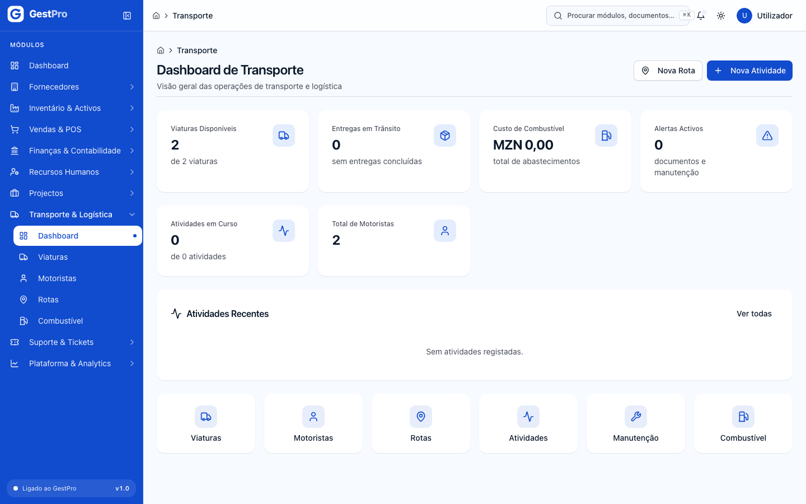
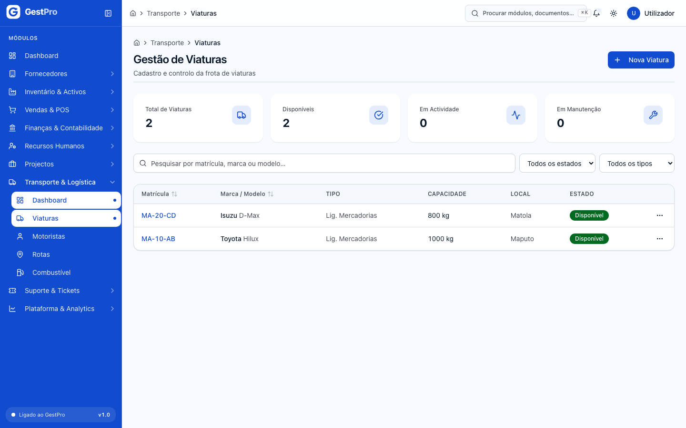
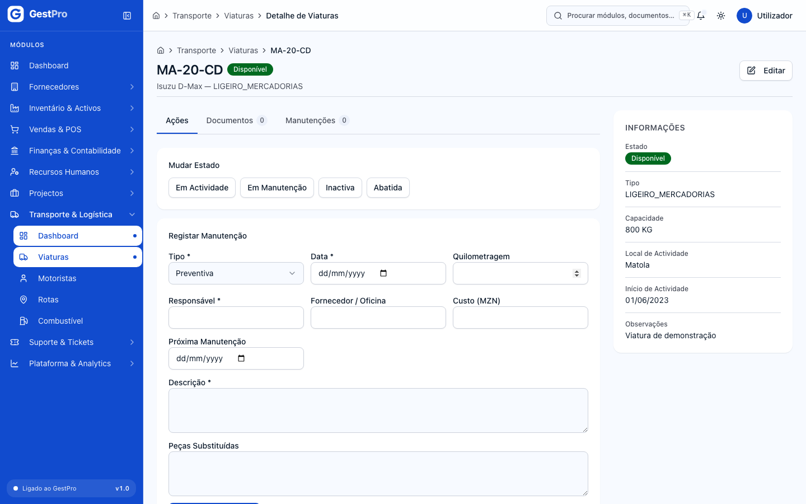
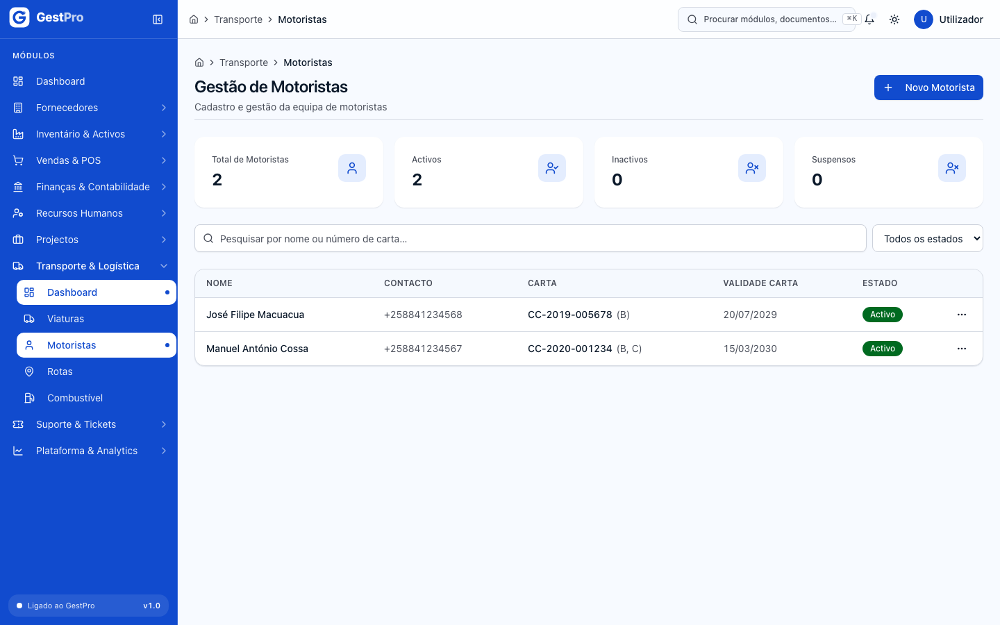
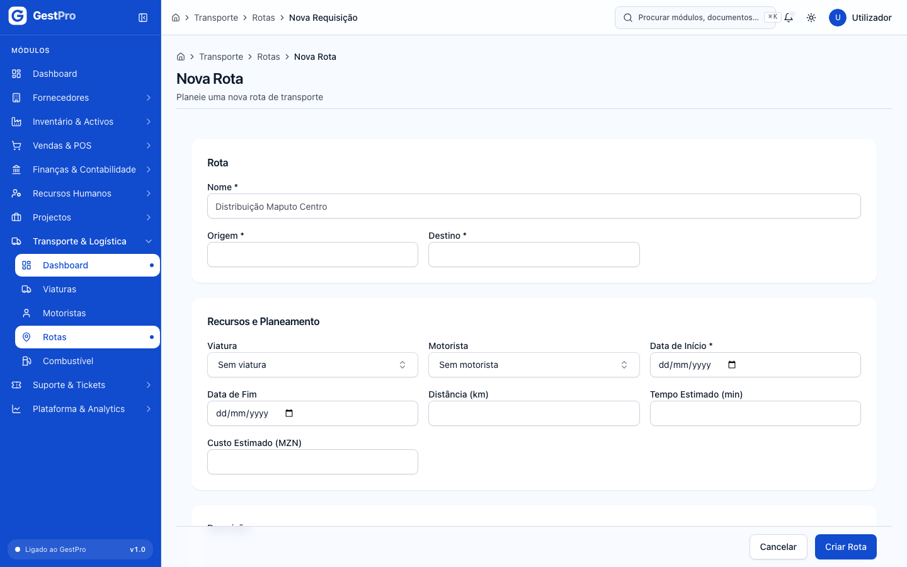
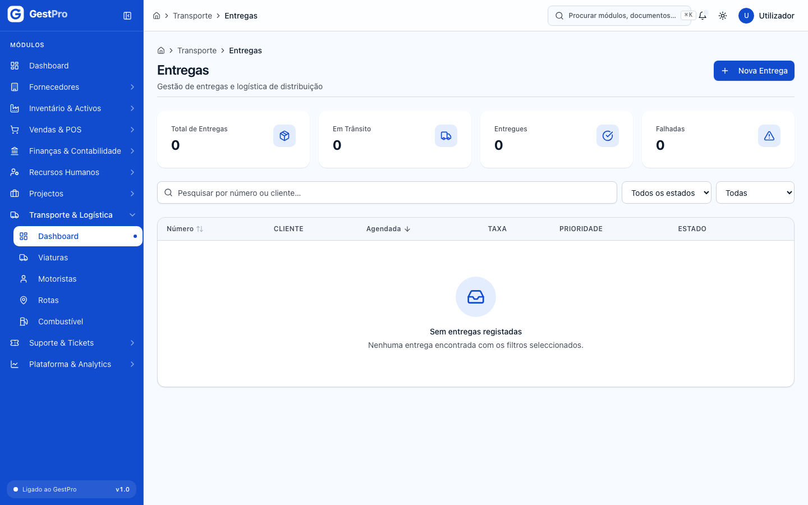
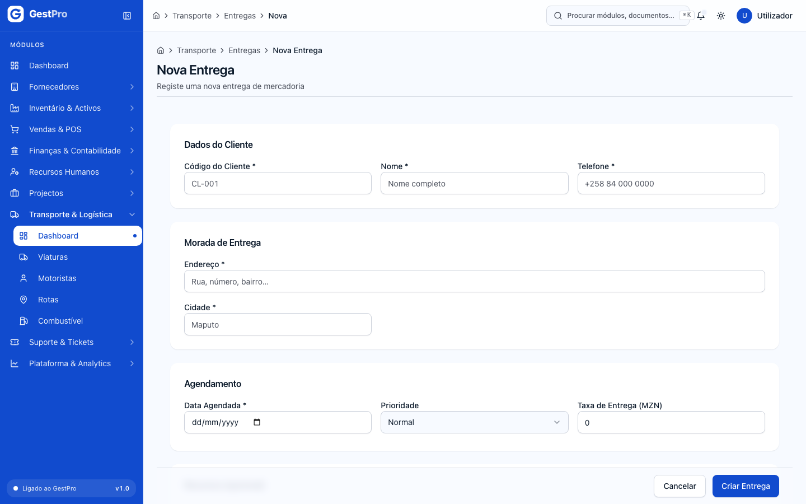
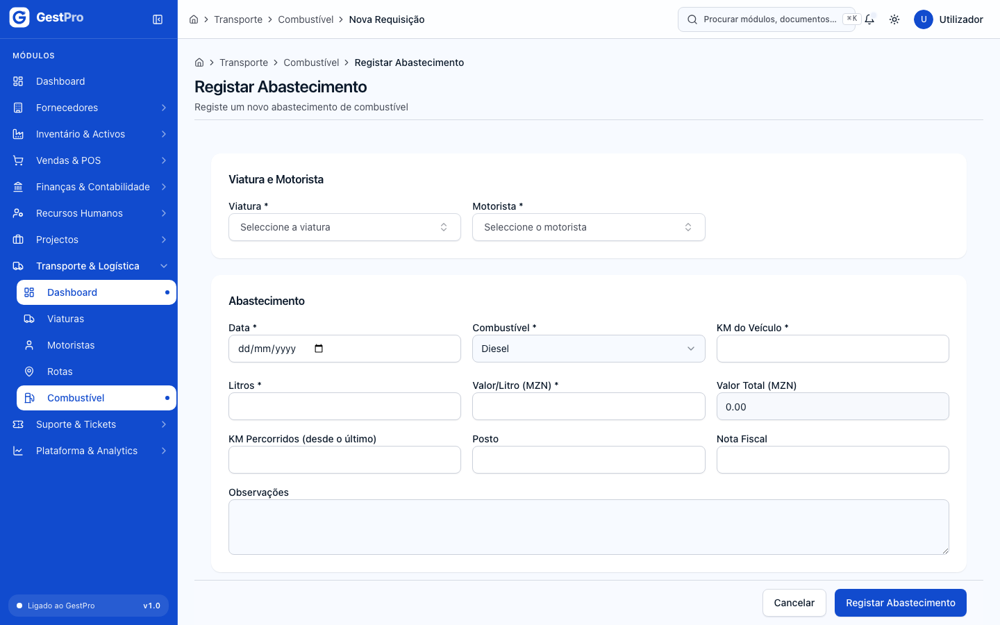

# 9. Transporte e Logística

> **Para quem:** Administrador, Gestor, Operador (consulta: Financeiro, Leitura) · **Onde:** menu › Transporte & Logística

## Para que serve

O módulo de Transporte gere a frota da empresa: as viaturas e os seus documentos, os motoristas e a sua disponibilidade, as rotas, as actividades de transporte, as entregas a clientes (com prova de entrega), os abastecimentos de combustível e as manutenções. O painel inicial mostra os indicadores principais e os alertas de documentos a expirar e de manutenções em atraso.

Os registos deste módulo não mexem no stock, na caixa nem na contabilidade: uma entrega marcada como **Entregue** não baixa stock e a taxa de entrega não gera movimento de caixa.

## Conceitos

| Termo | O que é |
|---|---|
| Viatura | Veículo da frota, identificado pela **Matrícula**. Tem tipo, capacidade, estado e documentos. |
| Motorista | Pessoa habilitada a conduzir, com carta de condução, contacto e disponibilidade. |
| Documento | Livrete, inspecção, seguro, licença, manifesto, taxa de rádio (viatura) ou carta de condução, BI (motorista), com data de validade e ficheiro anexo. |
| Estado do documento | **Válido**, **A Expirar** (dentro do prazo de alerta, 30 dias por omissão) ou **Expirado**. É recalculado automaticamente pelo sistema; não se escolhe à mão. |
| Actividade | Serviço de transporte (deslocação, missão de serviço, transporte de mercadorias ou de pessoal, manutenção em campo). Recebe um código automático da série **ATI**. |
| Rota | Percurso planeado entre uma **Origem** e um **Destino**, com viatura e motorista. Recebe um código **RT/ano/número**. |
| Entrega | Compromisso de levar mercadoria a um cliente numa data. Recebe um número automático da série **ENT**. |
| Prova de entrega | Confirmação de que o cliente recebeu: nome de quem recebeu e assinatura, foto ou código. |
| Checklist (inspecção) | Verificação da viatura item a item (OK, Avaria, Falta). |
| Abastecimento | Registo de combustível: litros, preço por litro, quilómetros. |

## Ecrãs

| Menu | Endereço | Para que serve |
|---|---|---|
| Transporte & Logística › Dashboard | `/transporte` | Indicadores, **Alertas Operacionais**, **Atividades Recentes** e atalhos. Botões **Nova Rota** e **Nova Atividade**. |
| Transporte & Logística › Viaturas | `/transporte/veiculos` | **Gestão de Viaturas**: lista, indicadores e filtros por **Estado** e **Tipo**. Botão **Nova Viatura**. |
| (clicar numa viatura) | `/transporte/veiculos/<viatura>` | Ficha da viatura: separadores **Ações**, **Documentos**, **Manutenções** e **Última Inspecção**. |
| Transporte & Logística › Motoristas | `/transporte/motoristas` | **Gestão de Motoristas**: lista, indicadores e filtro por **Estado**. Botão **Novo Motorista**. |
| (clicar num motorista) | `/transporte/motoristas/<motorista>` | Ficha do motorista: separadores **Documentos** e **Disponibilidade**. |
| Transporte & Logística › Rotas | `/transporte/rotas` | Lista de rotas com filtro por **Estado**. Botão **Nova Rota**. |
| (clicar numa rota) | `/transporte/rotas/<rota>` | Ficha da rota: separadores **Ações**, **Pontos de Entrega** e **Descrição**. |
| Transporte & Logística › Combustível | `/transporte/combustivel` | Abastecimentos, indicadores e filtro por **Combustível**. Botão **Registar Abastecimento**. |
| (atalho no Dashboard) Atividades | `/transporte/atividades` | **Atividades de Transporte**: lista com filtros por **Estado**, **Prioridade** e **Tipo**. Botão **Nova Atividade**. |
| (atalho no Dashboard) Manutenção | `/transporte/manutencao` | **Manutenção de Viaturas**: todas as intervenções registadas e o custo total. |
| — | `/transporte/entregas` | **Entregas**: lista, indicadores e filtros por **Estado** e **Prioridade**. Botão **Nova Entrega**. |
| (clicar numa entrega) | `/transporte/entregas/<entrega>` | Ficha da entrega: separadores **Ações**, **Itens** e **Prova de Entrega**. |
| — | `/transporte/veiculos/documentos` | Vista de consulta de todos os documentos de viaturas. |
| — | `/transporte/motoristas/documentos` | **Documentos de Motoristas**: todos os documentos, com contagem de expirados e a expirar. |

> **Atenção:** os ecrãs marcados com «—» ainda não têm entrada no menu nem atalho. Abra-os escrevendo o endereço na barra do navegador (por exemplo, `/transporte/entregas`). Os documentos só se carregam na ficha da viatura ou do motorista.

<!-- captura: 09-transporte/dashboard.png | /transporte -->

### O Dashboard

| Indicador | O que conta |
|---|---|
| Viaturas Disponíveis | Viaturas no estado Disponível, face ao total. |
| Entregas em Trânsito | Entregas Em Trânsito; por baixo, a percentagem de entregas feitas até à data agendada. |
| Custo de Combustível | Soma do valor dos abastecimentos registados. |
| Alertas Activos | Documentos a expirar ou expirados e manutenções preventivas em atraso. |
| Atividades em Curso | Actividades no estado Em Curso, face ao total. |
| Total de Motoristas | Motoristas registados. |

Em **Alertas Operacionais** aparecem até 10 alertas, por exemplo «Viatura ABC-123-MP: SEGURO (nº …) expira em …» ou «… manutenção preventiva prevista para … está em atraso.» Os documentos expirados aparecem a vermelho; os restantes a amarelo.

## Tarefas

### Como registar uma viatura

**Antes de começar:** precisa do perfil Administrador, Gestor ou Operador.

1. Abra **Transporte & Logística › Viaturas** e clique em **Nova Viatura**.
2. Em **Identificação**, preencha **Matrícula**, **Tipo** (Ligeiro de Passageiros, Ligeiro de Mercadorias, Pesado de Mercadorias, Pesado de Passageiros, Motociclo, Outro), **Marca** e **Modelo**.
3. Em **Capacidade e Operação**, indique a **Capacidade** e a **Unidade** (Quilogramas (kg), Toneladas (ton), Metros cúbicos (m³), Passageiros), o **Local de Actividade** e o **Início de Actividade**. Opcionalmente escolha o **Motorista Responsável**.
4. Clique em **Registar Viatura**.

**Resultado:** mensagem «Viatura registada.» e abre a ficha da viatura, no estado **Disponível**.

Para alterar os dados, use **Editar** na ficha (ou no menu de acções da linha na lista) e clique em **Guardar Alterações**. Uma viatura **Abatida** já não pode ser editada.

<!-- captura: 09-transporte/viaturas-lista.png | /transporte/veiculos -->

<!-- captura: 09-transporte/viatura-ficha.png | /transporte/veiculos >primeiro -->

### Como carregar um documento de viatura ou motorista

**Antes de começar:** tenha o ficheiro (PDF, imagem ou Office, até 10 MB).

1. Abra a ficha da viatura (ou do motorista) e o separador **Documentos**.
2. Em **Adicionar Documento**, escolha o **Tipo de Documento**:
   - viatura: Livrete, Inspecção, Seguro, Licença, Manifesto, Taxa de Rádio, Outro;
   - motorista: Carta de Condução, Bilhete de Identidade, Outro.
3. Preencha **Número**, **Data de Emissão**, **Data de Validade** e **Entidade Emissora**. A validade tem de ser posterior à emissão.
4. Clique em **Carregar ficheiro do documento** e escolha o ficheiro.

**Resultado:** mensagem «Documento carregado com sucesso.» O documento aparece na lista com a ligação **Descarregar ficheiro**.

> **Atenção:** preencha todos os campos **antes** de escolher o ficheiro. O documento é gravado no momento em que o ficheiro é carregado.

Um documento novo aparece como **Válido**. O estado passa a **A Expirar** ou **Expirado** quando o sistema faz o recálculo automático periódico. Uma viatura com documentos **Expirados** não pode passar a **Em Actividade** nem ser usada para iniciar uma rota ou actividade.

### Como mudar o estado de uma viatura, registar manutenção ou inspecção

**Antes de começar:** a viatura não pode estar **Abatida**.

1. Abra a ficha da viatura e o separador **Ações**.
2. Em **Mudar Estado**, clique no estado pretendido. Só aparecem os estados permitidos (ver [Estados](#estados)).
3. Em **Registar Manutenção**, preencha **Tipo** (Preventiva ou Correctiva), **Data**, **Responsável** e **Descrição**; opcionalmente **Quilometragem**, **Fornecedor / Oficina**, **Custo (MZN)**, **Próxima Manutenção** e **Peças Substituídas**. Clique em **Registar Manutenção**.
4. Em **Registar Inspecção (Checklist)**, preencha **Data da Inspecção** e **Responsável**. Em **Itens**, use o botão **Item** (com o sinal +) e, para cada item, indique **Nome**, **Categoria** (Componente, Sobressalente, Acessório) e **Estado** (OK, Avaria, Falta). Clique em **Registar Inspecção**.

**Resultado:** mensagens «Viatura em estado …», «Manutenção registada.» ou «Checklist registado.». A manutenção aparece no separador **Manutenções** e em `/transporte/manutencao`. A inspecção mais recente aparece em **Última Inspecção**.

Se uma manutenção **Preventiva** tiver **Próxima Manutenção** já ultrapassada, surge um alerta no Dashboard. Se a última inspecção tiver itens em **Avaria** ou **Falta**, a viatura não pode ser usada para iniciar rotas ou actividades.

> **Atenção:** iniciar ou concluir rotas e actividades não muda o estado da viatura. Mude-o à mão no separador **Ações** se precisar.

### Como registar um motorista e gerir a disponibilidade

**Antes de começar:** precisa do perfil Administrador, Gestor ou Operador.

1. Abra **Transporte & Logística › Motoristas** e clique em **Novo Motorista**.
2. Em **Dados Pessoais**, preencha **Nome Completo** e **Contacto**; opcionalmente **Nº do BI**, **Local de Actividade** e **Morada**.
3. Em **Carta de Condução**, preencha **Número da Carta**, **Categorias** (separadas por vírgula), **Data de Emissão** e **Validade**.
4. Clique em **Registar Motorista**.

**Resultado:** mensagem «Motorista registado.» e abre a ficha, com o estado **Activo**.

Para marcar o motorista como indisponível:

1. Na ficha, abra o separador **Disponibilidade**.
2. Em **Gerir Disponibilidade**, escolha **Estado** › **Indisponível**, o **Motivo** (Férias, Ausência, Suspensão, Manual, Conflito de Agenda) e, se quiser, **Até (opcional)**.
3. Clique em **Atualizar Disponibilidade**.

**Resultado:** mensagem «Disponibilidade atualizada.» Um motorista indisponível, ou com a carta de condução fora da validade, não pode ser usado para iniciar rotas ou actividades.

<!-- captura: 09-transporte/motoristas-lista.png | /transporte/motoristas -->

### Como planear e executar uma rota

**Antes de começar:** precisa do perfil Administrador, Gestor ou Operador.

1. Abra **Transporte & Logística › Rotas** (ou **Nova Rota** no Dashboard) e clique em **Nova Rota**.
2. Em **Rota**, preencha **Nome**, **Origem** e **Destino**.
3. Em **Recursos e Planeamento**, escolha a **Viatura** e o **Motorista** (podem ficar para depois), a **Data de Início** e, opcionalmente, **Data de Fim**, **Distância (km)**, **Tempo Estimado (min)** e **Custo Estimado (MZN)**. Pode acrescentar **Descrição** e **Observações**.
4. Clique em **Criar Rota**. A rota fica **Planeada**.
5. Na ficha da rota, separador **Ações**, use **Atribuir Viatura e Motorista** › **Guardar Recursos** se ainda não os definiu. Só é possível enquanto a rota estiver Planeada ou Pausada.
6. Em **Mudar Estado**, clique em **Activa** para iniciar. Depois pode clicar em **Pausada**, **Concluída** ou **Cancelada**. Para cancelar, escreva o **Motivo do Cancelamento** (opcional) e clique em **Confirmar Cancelamento**.

**Resultado:** mensagem «Rota em estado …». Ao iniciar, o sistema confirma que a viatura e o motorista estão atribuídos e aptos (documentos válidos, inspecção sem avarias, motorista disponível e sem conflito de agenda). Ao concluir ou cancelar, fica registada a data de fim.

<!-- captura: 09-transporte/rota-nova.png | /transporte/rotas/novo -->

### Como criar e acompanhar uma entrega

**Antes de começar:** precisa do perfil Administrador, Gestor ou Operador.

**1. Criar**

1. Abra `/transporte/entregas` e clique em **Nova Entrega**.
2. Em **Dados do Cliente**, preencha **Código do Cliente**, **Nome** e **Telefone**.
3. Em **Morada de Entrega**, preencha **Endereço** e **Cidade**.
4. Em **Agendamento**, indique a **Data Agendada**, a **Prioridade** (Baixa, Normal, Alta, Urgente) e, se aplicável, a **Taxa de Entrega (MZN)**.
5. Em **Recursos (opcional)**, pode já escolher **Viatura**, **Motorista** e **Rota**.
6. Em **Itens da Carga**, preencha para cada item **Código**, **Nome**, **Quantidade** e, opcionalmente, **Peso (kg)** e **Valor (MZN)**. Use **Adicionar Item** para mais linhas. É obrigatório pelo menos um item.
7. Clique em **Criar Entrega**.

**Resultado:** mensagem «Entrega criada com sucesso.» e abre a ficha da entrega, no estado **Pendente**.

**2. Atribuir recursos**

1. Na ficha, separador **Ações**, escolha **Viatura**, **Motorista** e **Rota**.
2. Clique em **Guardar Recursos**. Só é possível enquanto a entrega estiver Pendente ou Agendada.

**3. Fazer avançar**

1. Em **Mudar Estado**, clique em **Agendada** e, no dia, em **Em Trânsito**. Estas mudanças são imediatas.
2. Quando a mercadoria chegar, clique em **Entregue**. Em **Prova de Entrega**, preencha **Recebedor**, o **Tipo de Prova** (Assinatura, Foto ou Código) e o campo seguinte (**Nome/Assinatura**, **Referência da Foto** ou **Código de Confirmação**). Clique em **Confirmar Entrega**.
3. Se a entrega não for possível, clique em **Falhada**, escreva o **Motivo da Falha** e clique em **Marcar como Falhada**. Uma entrega falhada pode voltar a **Agendada** ou ser **Cancelada**.
4. Para cancelar (a partir de Pendente, Agendada ou Falhada), clique em **Cancelada**, escreva o **Motivo do Cancelamento** e clique em **Confirmar Cancelamento**.

**Resultado:** com a prova registada, aparece «Prova de entrega registada. Entrega concluída.» e a entrega fica **Entregue**, com o separador **Prova de Entrega**. Cada falha aumenta o contador **Tentativas**.

<!-- captura: 09-transporte/entregas-lista.png | /transporte/entregas -->

<!-- captura: 09-transporte/entrega-nova.png | /transporte/entregas/nova -->

> **Atenção:** o **Código do Cliente** é texto livre; o sistema não o liga à ficha do cliente em [Vendas](04-vendas-e-pos.md).

### Como registar e executar uma actividade de transporte

**Antes de começar:** precisa do perfil Administrador, Gestor ou Operador.

1. No Dashboard, clique em **Nova Atividade** (ou em **Atividades** › **Nova Atividade**).
2. Em **Atividade**, preencha **Título**, **Tipo** (Deslocação, Missão de Serviço, Transporte de Mercadorias, Transporte de Pessoal, Manutenção em Campo, Outro), **Prioridade** (Baixa, Média, Alta, Urgente) e **Local**.
3. Em **Agendamento e Recursos**, indique **Início Previsto** e, opcionalmente, **Conclusão Prevista**, **Viatura** e **Motorista Responsável**. A conclusão prevista tem de ser posterior ao início.
4. Opcionalmente, **Descrição** e **Observações**. Clique em **Criar Atividade**.
5. Na ficha, separador **Ações** › **Mudar Estado**, clique no estado pretendido (por exemplo, **Em Curso**). Escreva a **Descrição da transição** (obrigatória) e clique em **Confirmar Transição**.

**Resultado:** mensagem «Atividade em estado …». Cada mudança fica registada no separador **Histórico**, com o utilizador e a descrição. Para passar a **Em Curso**, a actividade tem de ter viatura e motorista, e ambos têm de estar aptos. A actividade só pode ser editada enquanto estiver Planeada ou Suspensa.

### Como registar um abastecimento

**Antes de começar:** precisa do perfil Administrador, Gestor ou Operador.

1. Abra **Transporte & Logística › Combustível** e clique em **Registar Abastecimento**.
2. Em **Viatura e Motorista**, escolha a **Viatura** e o **Motorista** (ambos obrigatórios).
3. Em **Abastecimento**, indique a **Data**, o **Combustível** (Gasolina, Diesel, Etanol, Gás Natural (GNV)), **KM do Veículo**, **Litros** e **Valor/Litro (MZN)**. O **Valor Total (MZN)** é calculado automaticamente.
4. Opcionalmente, **KM Percorridos (desde o último)**, **Posto**, **Nota Fiscal** e **Observações**.
5. Clique em **Registar Abastecimento**.

**Resultado:** mensagem «Abastecimento registado.» O registo entra nos indicadores **Litros Consumidos**, **Custo Total** e **Consumo Médio** (km/L) e no **Custo de Combustível** do Dashboard. Os abastecimentos não se editam nem apagam depois de registados.

<!-- captura: 09-transporte/abastecimento-novo.png | /transporte/combustivel/novo -->

## Estados

### Viatura

| Estado | Significado | Pode passar a | Quem |
|---|---|---|---|
| Disponível | Pronta a ser usada. | Em Actividade, Em Manutenção, Inactiva, Abatida | Administrador, Gestor, Operador |
| Em Actividade | Em serviço. Exige que não haja documentos expirados. | Disponível | Administrador, Gestor, Operador |
| Em Manutenção | Na oficina. | Disponível, Inactiva | Administrador, Gestor, Operador |
| Inactiva | Parada. | Disponível, Abatida | Administrador, Gestor, Operador |
| Abatida | Saiu da frota. Já não se edita. | — | — |

### Rota

| Estado | Significado | Pode passar a | Quem |
|---|---|---|---|
| Planeada | Criada. Pode receber viatura e motorista. | Activa, Cancelada | Administrador, Gestor, Operador |
| Activa | Em execução. Exige viatura e motorista aptos. | Pausada, Concluída, Cancelada | Administrador, Gestor, Operador |
| Pausada | Interrompida. Pode trocar recursos. | Activa, Cancelada | Administrador, Gestor, Operador |
| Concluída | Terminada. | — | — |
| Cancelada | Anulada. | — | — |

### Actividade

| Estado | Significado | Pode passar a | Quem |
|---|---|---|---|
| Planeada | Agendada. | Em Curso, Cancelada | Administrador, Gestor, Operador |
| Em Curso | Em execução. Exige viatura e motorista aptos. | Suspensa, Concluída, Cancelada | Administrador, Gestor, Operador |
| Suspensa | Interrompida. | Em Curso, Cancelada | Administrador, Gestor, Operador |
| Concluída | Terminada. | — | — |
| Cancelada | Anulada. | — | — |

### Entrega

| Estado | Significado | Pode passar a | Quem |
|---|---|---|---|
| Pendente | Criada. | Agendada, Cancelada | Administrador, Gestor, Operador |
| Agendada | Data e recursos confirmados. | Em Trânsito, Cancelada | Administrador, Gestor, Operador |
| Em Trânsito | A caminho do cliente. | Entregue (com prova), Falhada (com motivo) | Administrador, Gestor, Operador |
| Falhada | Não foi possível entregar. | Agendada, Cancelada | Administrador, Gestor, Operador |
| Entregue | Recebida pelo cliente. | — | — |
| Cancelada | Anulada. | — | — |

### Motorista

O **Estado Operacional** (Activo, Inactivo, Suspenso) é mostrado na lista e na ficha. Um motorista novo fica **Activo**; ainda não há opção no ecrã para o alterar. Um motorista **Suspenso** não pode ser editado. A **Disponibilidade** (Disponível / Indisponível) gere-se no separador próprio, como descrito acima.

## Erros frequentes

| Mensagem mostrada | Porquê | O que fazer |
|---|---|---|
| Sem permissão para esta operação | O seu perfil só permite consultar (Financeiro, Leitura). | Peça a um Administrador, Gestor ou Operador. |
| Preencha tipo, número, datas e entidade emissora antes de carregar. | Escolheu o ficheiro antes de preencher os dados do documento. | Preencha os campos e carregue o ficheiro de novo. |
| Ficheiro demasiado grande (máx. 10 MB). | O ficheiro excede o limite. | Reduza ou comprima o ficheiro. |
| Data de validade deve ser posterior à data de emissão | Datas do documento trocadas. | Corrija as datas. |
| A viatura tem N documento(s) expirado(s). Renove antes de alocar. | Tentou pôr a viatura Em Actividade com documentos expirados. | Carregue o documento renovado. |
| A rota requer viatura e motorista atribuídos antes de ser iniciada. | Rota sem viatura ou sem motorista. | Use **Guardar Recursos** antes de iniciar. |
| A atividade requer viatura e motorista alocados antes de ser iniciada. | Actividade sem viatura ou sem motorista. | Edite a actividade e escolha-os. |
| Viatura …: documento (id: …) está expirado desde … | A viatura escolhida tem documentos expirados. | Renove o documento ou escolha outra viatura. |
| Viatura …: checklist — item "…" em estado "avaria". | A última inspecção tem itens em Avaria ou Falta. | Registe uma nova inspecção com os itens OK. |
| Carta de condução do motorista "…" expirou em … | A validade da carta já passou. | Actualize a validade na ficha do motorista ou escolha outro. |
| Motorista "…" está indisponível: … | O motorista está marcado como Indisponível. | Altere a disponibilidade ou escolha outro. |
| Conflito com a atividade "…" (…) | A viatura ou o motorista já têm uma actividade no mesmo período. | Escolha outra data ou outros recursos. |
| A rota tem N ponto(s) de entrega por fechar. | Ao concluir a rota, ainda há pontos de entrega abertos. | Feche os pontos antes de concluir. |
| Só é possível atribuir recursos a rotas PLANEADA ou PAUSADA. | A rota está Activa, Concluída ou Cancelada. | Pause a rota antes de trocar recursos. |
| Só é possível atribuir recursos a entregas PENDENTE ou AGENDADA. | A entrega já está Em Trânsito ou terminada. | — |
| Recebedor e dados da prova são obrigatórios. | Falta o nome de quem recebeu ou o dado da prova. | Preencha os dois campos. |
| Indique o motivo da falha. | Tentou marcar como Falhada sem motivo. | Escreva o motivo. |
| Transição de … para … não é permitida. | O estado de destino não é permitido a partir do estado actual. | Consulte a tabela de [Estados](#estados). |
| Viatura e motorista são obrigatórios. | No abastecimento, falta a viatura ou o motorista. | Escolha os dois. |
| Litros e valor/litro devem ser positivos. | Valores a zero ou negativos no abastecimento. | Corrija os valores. |
| Indique pelo menos uma categoria de carta. | Campo **Categorias** vazio no motorista. | Escreva pelo menos uma categoria. |

## Perguntas frequentes

**Carreguei um seguro já vencido e aparece como Válido. Porquê?**
O estado dos documentos é recalculado por um processo automático periódico. Até lá, um documento novo aparece como Válido.

**A pesquisa nas listas de rotas, motoristas, entregas ou combustível não filtra.**
Use os filtros (Estado, Prioridade, Tipo, Combustível). Nestas listas a caixa de pesquisa ainda não tem efeito.

**Posso otimizar rotas ou atribuir viaturas automaticamente?**
Não. A atribuição de viatura e motorista é sempre manual.
