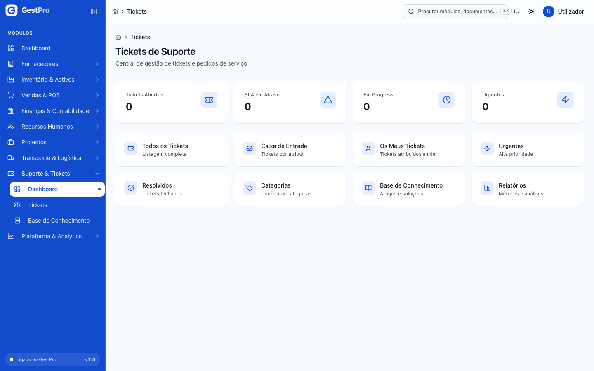
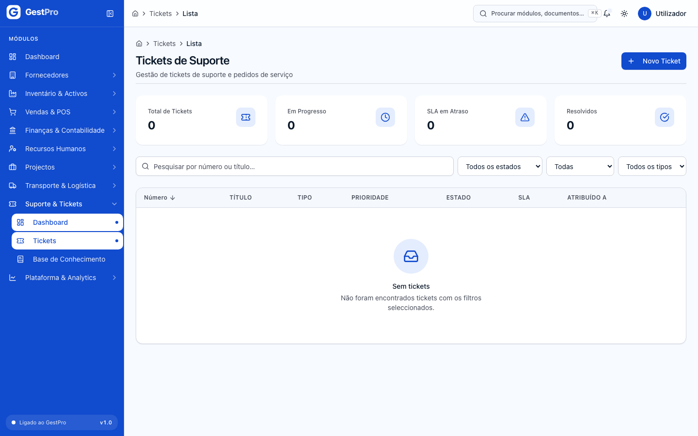
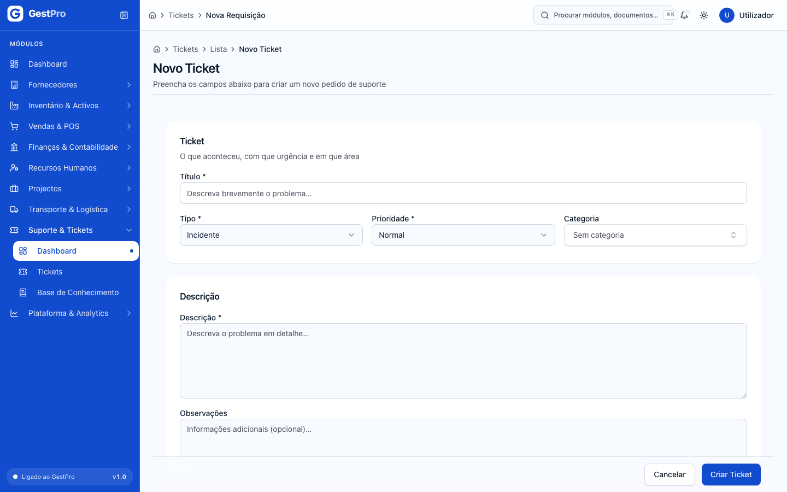
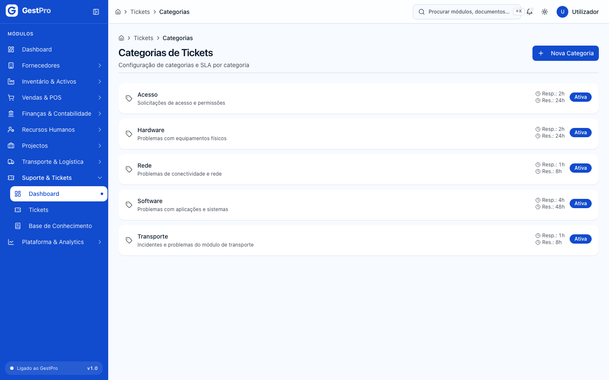
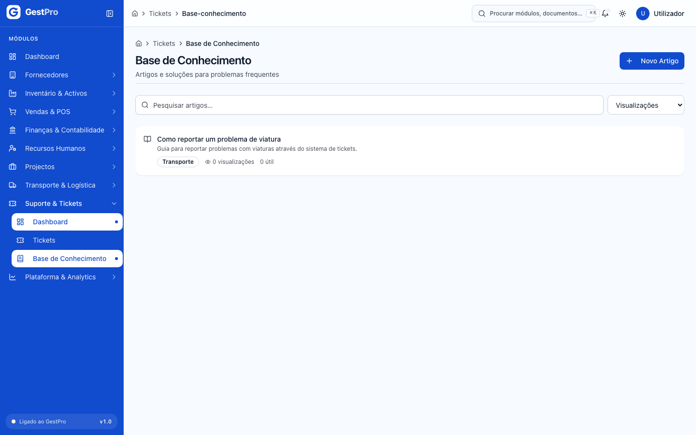

# 10. Suporte e Tickets

> **Para quem:** Administrador, Gestor, Operador (consulta: Financeiro, Leitura) · **Onde:** menu › Suporte & Tickets

## Objectivo do módulo

O módulo de Suporte regista os pedidos de ajuda (tickets) — incidentes, requisições, problemas, mudanças ou consultas — e acompanha-os até à resolução, com prazos de resposta e de resolução (SLA). Inclui categorias de tickets, cada uma com os seus prazos, e uma **Base de Conhecimento** com artigos de solução para problemas frequentes.

O objectivo é que **nenhum pedido se perca e cada um tenha um prazo**: quem pediu sabe em que ponto está, e
quem resolve sabe o que está mais perto de estourar o prazo.

| | |
|---|---|
| **Que problema resolve** | Avarias e pedidos feitos de boca ou por mensagem, esquecidos; o mesmo problema resolvido de raiz cada vez que aparece. |
| **Quem usa** | Quem tem perfil Administrador, Gestor ou Operador abre tickets (Financeiro e Leitura só consultam); a equipa de suporte (Operador, Gestor) trata-os. |
| **O que entra** | O pedido (tipo, prioridade, categoria, descrição), o agente atribuído, os comentários e as mudanças de estado. |
| **O que sai** | Fila ordenada por prazo de SLA, histórico de actividades, avaliação do solicitante (1 a 5), taxa de resolução, artigos de solução. |
| **Liga-se a** | É autónomo; os indicadores aparecem em [Analytics](11-plataforma-e-administracao.md#como-consultar-os-indicadores-analytics). |

## Exemplo prático — a impressora do POS deixou de imprimir

**Situação:** às 09:00 a Ana não consegue imprimir o talão no POS. A loja tem uma pequena equipa de suporte
interno (a Marta).

1. **Categoria com SLA próprio** (feito uma vez) → [Como criar uma categoria](#como-criar-uma-categoria-de-tickets):
   «Equipamento da loja», Tempo de Resposta **30** min, Tempo de Resolução **240** min.
2. **A Ana abre o ticket** → [Como abrir um ticket](#como-abrir-um-ticket): Título «Impressora do POS não imprime o
   talão», Tipo **Incidente**, Prioridade **Alta**, Categoria «Equipamento da loja», descrição com o que já tentou.
   O ticket `TKT/…` fica **Aberto** e o **Limite SLA** é 13:00 (4 horas — o da categoria sobrepõe-se às 24 h da
   prioridade Alta).
3. **A Marta pega no ticket** a partir da **Caixa de Entrada** (ordenada pelo SLA mais próximo): em **Atribuído a**
   escolhe-se a si própria e clica **Atribuir** → [Como atribuir](#como-atribuir-um-ticket-a-um-agente). Depois,
   **Mudar Estado** › **Em Progresso** → [Como acompanhar](#como-acompanhar-e-mudar-o-estado-de-um-ticket).
4. **Registo no ticket** → [Como comentar](#como-comentar-um-ticket): no separador **Actividades** a Marta escreve
   «Cabo USB da impressora estava solto — religado e talão impresso.» Depois, **Resolvido** e **Fechado**.
5. **A Ana avalia** → [Como avaliar](#como-avaliar-um-ticket-fechado): no ticket fechado, nota **5** e
   «Resolvido em 20 minutos».
6. **Para não voltar a perder tempo** → [Como escrever um artigo](#como-escrever-um-artigo-na-base-de-conhecimento):
   artigo «POS não imprime o talão — verificações rápidas», categoria «Loja», com os três passos que resolveram.

**Resultado esperado:** o ticket fecha dentro do SLA, com a avaliação da Ana no separador **Avaliação**; o ticket
aparece em **Os Meus Tickets** da Marta; em **Relatórios** a **Taxa de Resolução** sobe; e o
artigo fica na Base de Conhecimento para a próxima vez. Lembre-se de que o talão **não é** documento fiscal:
mesmo sem impressora, a venda e a Factura-Recibo ficam registadas e o PDF fiscal está em **Faturas**.

## Conceitos

| Termo | O que é |
|---|---|
| Ticket | Pedido de suporte. Recebe um número automático da série **TKT**. Quem o cria fica registado como **Solicitante**. |
| Tipo | Natureza do pedido: Incidente, Requisição, Problema, Mudança ou Consulta. |
| Prioridade | Baixa, Normal, Alta ou Urgente. Define os prazos de SLA quando o ticket não tem categoria. |
| SLA | Prazos máximos de resposta e de resolução, contados desde a abertura do ticket. |
| Categoria | Área do pedido (ex.: Suporte Técnico), com prazos de SLA próprios que se sobrepõem aos da prioridade. |
| Agente | Utilizador activo da empresa a quem o ticket está **Atribuído a**. Escolhe-se na ficha do ticket. |
| Comentário | Resposta ou nota registada no histórico do ticket. Pode ser marcada como **interna**. |
| Avaliação | Nota de 1 a 5 que o solicitante dá a um ticket fechado, com observação opcional. |
| Artigo | Texto da Base de Conhecimento com a solução de um problema. |

### Prazos de SLA por omissão (sem categoria)

| Prioridade | Resposta | Resolução |
|---|---|---|
| Urgente | 1 hora | 8 horas |
| Alta | 2 horas | 24 horas |
| Normal | 4 horas | 48 horas |
| Baixa | 8 horas | 72 horas |

## Ecrãs

| Menu | Endereço | Para que serve |
|---|---|---|
| Suporte & Tickets › Dashboard | `/tickets` | **Tickets de Suporte**: indicadores e atalhos para as vistas de tickets, categorias, base de conhecimento e relatórios. |
| Suporte & Tickets › Tickets | `/tickets/lista` | Todos os tickets, com indicadores e filtros por **Estado**, **Prioridade** e **Tipo**. Botão **Novo Ticket**. |
| (a partir da lista) | `/tickets/novo` | Formulário **Novo Ticket**. |
| (clicar num ticket) | `/tickets/<ticket>` | Ficha do ticket: dados, SLA, separadores **Descrição** (com a avaliação, quando o ticket fechado é seu) e **Actividades** (com o campo **Comentário**), e **Avaliação** depois de avaliado; em **Atribuído a**, a escolha do agente com **Atribuir**; botões **Editar**, **Mudar Estado** e **Cancelar Ticket**. |
| (atalho) Caixa de Entrada | `/tickets/caixa-entrada` | Tickets no estado Aberto, ordenados pelo prazo de SLA mais próximo. |
| (atalho) Os Meus Tickets | `/tickets/meus` | Tickets atribuídos a si. |
| (atalho) Urgentes | `/tickets/urgentes` | Tickets de prioridade Urgente, ordenados por SLA. |
| (atalho) Resolvidos | `/tickets/resolvidos` | Tickets Resolvidos ou Fechados. |
| (atalho) Categorias | `/tickets/categorias` | **Categorias de Tickets** e respectivos SLA. Botão **Nova Categoria**. |
| Suporte & Tickets › Base de Conhecimento | `/tickets/base-conhecimento` | Artigos, com pesquisa e ordenação (**Mais visualizados**, **Mais úteis**, **Mais recentes**). Botão **Novo Artigo**. |
| (atalho) Relatórios | `/tickets/relatorios` | **Relatórios de Tickets**: **Total de Tickets**, **Taxa de Resolução**, **SLA em Atraso**, **Urgentes**. |

Se o seu perfil não tiver permissão para consultar os tickets, o grupo **Suporte & Tickets** não aparece no menu lateral e, se abrir um endereço do módulo, vê o aviso **Sem permissão**.

<!-- captura: 10-suporte/dashboard.png | /tickets -->

<!-- captura: 10-suporte/tickets-lista.png | /tickets/lista -->

## Tarefas

### Como abrir um ticket

**Antes de começar:** precisa do perfil Administrador, Gestor ou Operador.

1. Abra **Suporte & Tickets › Tickets** e clique em **Novo Ticket**.
2. Em **Ticket**, escreva o **Título** (mínimo 3 caracteres), escolha o **Tipo** (Incidente, Requisição, Problema, Mudança, Consulta), a **Prioridade** (Baixa, Normal, Alta, Urgente) e, se quiser, a **Categoria**.
3. Em **Descrição**, descreva o problema (mínimo 10 caracteres). **Observações** é opcional.
4. Clique em **Criar Ticket**.

**Resultado:** mensagem «Ticket criado com sucesso.» e abre a ficha do ticket, no estado **Aberto**. O sistema calcula as datas-limite de SLA a partir da categoria (se escolheu uma) ou da prioridade. A abertura fica registada no separador **Actividades**.

<!-- captura: 10-suporte/ticket-novo.png | /tickets/novo -->

### Como acompanhar e mudar o estado de um ticket

1. Abra o ticket a partir da lista (ou da **Caixa de Entrada**, **Urgentes**, etc.).
2. Consulte os dados: **Estado**, **Prioridade**, **SLA**, **Tipo**, **Solicitante**, **Atribuído a**, **Abertura** e **Limite SLA**. O campo **SLA** mostra o tempo restante (por exemplo, «5h restantes» ou «2d restantes») ou **SLA em Atraso**.
3. Clique em **Mudar Estado** e escolha o novo estado na lista. Só aparecem os estados permitidos a partir do estado actual.

**Resultado:** mensagem «Ticket movido para "…".». A mudança fica registada em **Actividades**. Ao passar a **Resolvido** fica registada a data de resolução; ao passar a **Fechado**, a data de fecho.

Para um ticket passar de **Aberto** a **Em Progresso**, tem de ter um agente atribuído: atribua-o primeiro (ver [Como atribuir um ticket a um agente](#como-atribuir-um-ticket-a-um-agente)). Atribuir o agente não muda o estado — depois de atribuir, use **Mudar Estado** › **Em Progresso**.

### Como atribuir um ticket a um agente

**Antes de começar:** precisa da permissão de atribuir tickets (perfis Administrador, Gestor e Operador). O ticket não pode estar **Fechado** nem **Cancelado**.

1. Abra o ticket. Em **Atribuído a** vê o agente actual (ou «Não atribuído»).
2. Abra a lista **Escolher agente…** e escreva parte do nome ou do email do utilizador. Só aparecem utilizadores activos da empresa.
3. Escolha o agente e clique em **Atribuir**.

**Resultado:** mensagem «Ticket atribuído a ‹nome›.» O nome aparece em **Atribuído a**, a atribuição fica registada em **Actividades** e o ticket passa a aparecer em **Os Meus Tickets** desse agente. Para trocar de agente, repita os passos.

### Como comentar um ticket

**Antes de começar:** precisa da permissão de comentar tickets (perfis Administrador, Gestor e Operador). Não se comenta um ticket **Cancelado**.

1. Abra o ticket e o separador **Actividades**.
2. No campo **Comentário**, escreva a resposta ou a nota.
3. Se for uma nota só para a equipa, marque **Nota interna (marcada como interna no histórico)**.
4. Clique em **Comentar**.

**Resultado:** mensagem «Comentário adicionado.» O comentário aparece no histórico, com o autor e a hora; as notas internas levam a marca **Interno**. O primeiro comentário regista a data da primeira resposta ao ticket.

### Como avaliar um ticket fechado

**Antes de começar:** só o **Solicitante** (quem abriu o ticket) avalia, só depois de o ticket estar **Fechado**, e só uma vez. Precisa também da permissão de avaliar tickets (perfis Administrador, Gestor e Operador).

1. Abra o ticket. No separador **Descrição** aparece «Como avalia a resolução deste ticket?».
2. Escolha uma nota de **1** a **5** e, se quiser, escreva uma **Observação (opcional)**.
3. Clique em **Avaliar**.

**Resultado:** mensagem «Avaliação registada. Obrigado!» A ficha passa a mostrar o separador **Avaliação**, com a nota, a observação e a data.

### Como editar um ticket

1. Na ficha, clique em **Editar**. O botão não aparece em tickets **Fechados** ou **Cancelados**.
2. Altere **Título**, **Prioridade**, **Descrição** ou **Observações**.
3. Clique em **Guardar Alterações**.

**Resultado:** mensagem «Ticket actualizado com sucesso.»

### Como cancelar um ticket

1. Na ficha, clique em **Cancelar Ticket**.
2. Na janela **Cancelar ticket?**, escreva o **Motivo do cancelamento** (obrigatório, até 500 caracteres).
3. Clique em **Confirmar Cancelamento** (ou **Voltar** para desistir).

**Resultado:** mensagem «Ticket cancelado.» O ticket fica **Cancelado** e já não pode mudar de estado.

O cancelamento só é aceite a partir de **Aberto**, **Em Progresso**, **A Aguardar Cliente** ou **A Aguardar Terceiro**. Um ticket **Resolvido** não pode ser cancelado (ver [Erros frequentes](#erros-frequentes)).

### Como criar uma categoria de tickets

**Antes de começar:** precisa do perfil Administrador, Gestor ou Operador.

1. No Dashboard, clique em **Categorias** e depois em **Nova Categoria**.
2. Em **Categoria**, preencha o **Nome** (obrigatório) e, opcionalmente, **Descrição**, **Ícone**, **Cor** (formato #3b82f6) e **Subcategorias** (separadas por vírgula).
3. Em **SLA**, indique o **Tempo de Resposta** e o **Tempo de Resolução**, **em minutos** (ex.: 60 e 480).
4. Clique em **Criar Categoria**.

**Resultado:** mensagem «Categoria criada com sucesso.» Na lista de categorias os prazos aparecem em horas (**Resp.:** e **Res.:**). Os novos tickets desta categoria passam a usar estes prazos.

<!-- captura: 10-suporte/categorias.png | /tickets/categorias -->

### Como escrever um artigo na Base de Conhecimento

**Antes de começar:** precisa do perfil Administrador, Gestor ou Operador.

1. Abra **Suporte & Tickets › Base de Conhecimento** e clique em **Novo Artigo**.
2. Em **Artigo**, preencha o **Título** (mínimo 3 caracteres), a **Categoria** (texto livre, ex.: Conta e Acesso) e o **Conteúdo**. **Tags** (separadas por vírgula) e **Resumo** são opcionais.
3. Clique em **Criar Artigo**.

**Resultado:** mensagem «Artigo criado com sucesso.» O artigo aparece na lista com o título, o resumo, a categoria, o número de visualizações e quantas vezes foi marcado como útil.

> **Atenção:** ainda não é possível abrir um artigo para o ler por inteiro, editá-lo ou publicá-lo a partir do ecrã. A lista mostra só o título e o resumo.

<!-- captura: 10-suporte/base-conhecimento.png | /tickets/base-conhecimento -->

## Estados

### Ticket

| Estado | Significado | Pode passar a | Quem |
|---|---|---|---|
| Aberto | Criado, por tratar. | Em Progresso (exige agente), A Aguardar Cliente, A Aguardar Terceiro, Cancelado | Administrador, Gestor, Operador |
| Em Progresso | Em tratamento. | A Aguardar Cliente, A Aguardar Terceiro, Resolvido, Cancelado | Administrador, Gestor, Operador |
| A Aguardar Cliente | À espera de resposta do solicitante. | Em Progresso, Resolvido, Cancelado | Administrador, Gestor, Operador |
| A Aguardar Terceiro | À espera de um fornecedor ou outra entidade. | Em Progresso, Cancelado | Administrador, Gestor, Operador |
| Resolvido | Solução aplicada. | Fechado, Em Progresso (reabrir) | Administrador, Gestor, Operador |
| Fechado | Encerrado. Já não se edita. | Em Progresso (reabrir) | Administrador, Gestor, Operador |
| Cancelado | Anulado, com motivo. | — | — |

## Erros frequentes

| Mensagem mostrada | Porquê | O que fazer |
|---|---|---|
| Sem permissão para esta operação | O seu perfil só permite consultar (Financeiro, Leitura). | Peça a um Administrador, Gestor ou Operador. |
| Título deve ter pelo menos 3 caracteres | Título demasiado curto. | Escreva um título mais descritivo. |
| Descrição deve ter pelo menos 10 caracteres | Descrição demasiado curta. | Descreva o problema com mais detalhe. |
| O ticket precisa de ter um agente atribuído antes de entrar em progresso. | Tentou passar de Aberto a Em Progresso sem agente. | Atribua primeiro um agente em **Atribuído a** › **Atribuir**. |
| O utilizador escolhido está inactivo e não pode receber tickets. | O agente escolhido foi desactivado entretanto. | Escolha outro agente. |
| Só é possível avaliar tickets FECHADOS. | O ticket ainda não está Fechado. | Aguarde o fecho do ticket. |
| Só o solicitante pode avaliar o ticket. | Quem avalia não é quem abriu o ticket. | Peça ao solicitante que avalie. |
| Este ticket já foi avaliado. | O ticket só se avalia uma vez. | — |
| Transição de RESOLVIDO para CANCELADO não é permitida. | Tentou cancelar um ticket Resolvido. | Feche o ticket, ou reabra-o (Em Progresso) e cancele a seguir. |
| Indique o motivo do cancelamento. | Motivo de cancelamento vazio. | Escreva o motivo. |
| Cor deve ser hex válido (ex: #3b82f6) | Cor da categoria em formato errado. | Use o formato # seguido de 6 caracteres. |
| Série activa para tipo "TICKET" no ano … não encontrada. Crie a série … primeiro. | Não existe série de numeração TKT activa para o ano. | As séries são criadas automaticamente; se faltar, contacte o suporte do GestPro. |

## Perguntas frequentes

**Porque é que «Os Meus Tickets» está vazio?**
Mostra só os tickets atribuídos a si. Se ninguém lhe atribuiu ainda um ticket (em **Atribuído a** › **Atribuir**, na ficha do ticket), a vista fica vazia.

**O ticket passou o prazo mas não aparece «SLA em Atraso».**
A marca de atraso é actualizada quando o ticket muda de estado. Até lá, compare o **Limite SLA** com a data actual.

**A pesquisa na lista de tickets não filtra.**
Use os filtros **Estado**, **Prioridade** e **Tipo**. Na lista de tickets, em **Os Meus Tickets** e em **Resolvidos**, a caixa de pesquisa ainda não tem efeito. Na **Base de Conhecimento** a pesquisa funciona.
