# 11. Plataforma e Administração

> **Para quem:** ADMIN e GESTOR (gestão); todos os perfis (consulta) · **Onde:** Plataforma & Analytics › Analytics, Core Tenancy, Subscrição; sino de notificações no cabeçalho

## Para que serve

Este capítulo reúne o que é da empresa como um todo: os indicadores de todos os módulos
(**Analytics**), a gestão de quem entra e do que pode fazer (**Core Tenancy** — utilizadores,
papéis e auditoria), a **Subscrição** do GestPro (plano, período de teste, pagamento, Modo de
Leitura) e as **Notificações**. Para a entrada no produto, a interface e os perfis de sistema, veja
[Primeiros passos](00-primeiros-passos.md).

## Conceitos

| Termo | O que é |
|---|---|
| Utilizador | Uma pessoa com acesso à empresa. Tem nome, e-mail (não editável), estado Activo/Inactivo e um ou mais papéis. |
| Papel | Conjunto de permissões com nome. Os cinco papéis de **Sistema** (ADMIN, GESTOR, FINANCEIRO, OPERADOR, LEITURA) existem em todas as empresas e não podem ser removidos; a empresa pode criar outros. |
| Permissão | Autorização para uma acção, escrita como `modulo:accao` (por exemplo `faturacao:fatura:emitir`), com uma descrição em português. |
| Convite por e-mail | Forma de primeiro acesso: a pessoa recebe uma mensagem onde confirma o endereço e escolhe a palavra-passe. |
| Palavra-passe provisória | Forma de primeiro acesso sem e-mail: o sistema gera uma palavra-passe, mostra-a uma única vez a quem cria o utilizador, e a pessoa é obrigada a trocá-la ao entrar. Não fica guardada em lado nenhum. |
| Registo de Auditoria | Histórico das alterações e acções feitas no sistema, com data/hora, acção, entidade e utilizador. |
| Plano | Básico, Profissional ou Empresarial. Define o preço (em USD, mensal ou anual) e o número de utilizadores, armazéns e o suporte anunciados. |
| Subscrição | O vínculo entre a empresa e o GestPro: plano, periodicidade e estado. O pagamento é feito por cartão através do Stripe. |
| Período de Teste | Os primeiros 14 dias, sem cartão, com o plano escolhido no registo. |
| Modo de Leitura | 30 dias em que a empresa entra, consulta e exporta tudo o que é seu, mas não grava. É por aqui que passa qualquer fim de subscrição: fim do teste, cancelamento ou falta de pagamento. |
| Acesso Fechado | Fim dos 30 dias de Modo de Leitura: ninguém da empresa entra. **Os dados não são apagados.** |

## Ecrãs

| Menu | Endereço (/rota) | Para que serve |
|---|---|---|
| Plataforma & Analytics › Analytics | `/analytics` | Indicadores de todos os módulos. |
| Plataforma & Analytics › Core Tenancy | `/core-tenancy` | «Administração da Plataforma»: resumo e entrada para utilizadores, papéis e auditoria. |
| Core Tenancy › Gerir Utilizadores | `/core-tenancy/utilizadores` | Lista de utilizadores. |
| Utilizadores › Novo Utilizador | `/core-tenancy/utilizadores/novo` | Criar um utilizador (convite ou palavra-passe provisória). |
| Utilizadores › (linha) | `/core-tenancy/utilizadores/[id]` | Ficha do utilizador; **Repor palavra-passe**. |
| Utilizadores › Editar | `/core-tenancy/utilizadores/[id]/editar` | Alterar o nome e o estado activo. |
| Core Tenancy › Gerir Papéis | `/core-tenancy/roles` | Lista de papéis («Papéis e Permissões»). |
| Papéis › Novo Papel | `/core-tenancy/roles/novo` | Criar um papel e escolher as permissões. |
| — (sem ligação na lista) | `/core-tenancy/roles/[id]` | Ficha do papel, com as permissões; só se abre pelo endereço. |
| Papéis › ⋯ › Editar | `/core-tenancy/roles/[id]/editar` | Alterar nome, descrição e permissões. |
| Core Tenancy › Ver Auditoria | `/core-tenancy/auditoria` | Registo de Auditoria. |
| Plataforma & Analytics › Subscrição | `/definicoes/faturacao` | Estado da subscrição, planos, pagamento e cancelamento. |
| (sino no cabeçalho) | `/notificacoes` | Centro de notificações. |
| Notificações › Preferências | `/notificacoes/preferencias` | Canais de entrega por tipo de notificação. |

A entrada **Subscrição** só aparece a quem tem a permissão `assinatura:ver` (todos os perfis de
sistema a têm). Hoje a área **Definições** tem apenas este ecrã.

> **Atenção:** ainda não existe ecrã para alterar os dados da empresa (nome, NUIT, configuração
> fiscal). O cartão **Configuração Fiscal** em `/core-tenancy` mostra sempre «Activa» e não é
> uma ligação.

## Tarefas

### Como consultar os indicadores (Analytics)

1. Abra **Plataforma & Analytics › Analytics**.
2. Percorra as secções: **Vendas & Comercial** (Vendas do Mês, Nº de Vendas, Ticket Médio,
   Clientes Activos (90d), com o gráfico **Vendas — Comparativo**), **Inventário & Stock**
   (Valor Total em Stock, Produtos Abaixo Mínimo, Rotatividade (30d), Sem Movimento (90d)),
   **Compras & Fornecedores** (Compras do Mês, Pedidos Pendentes, Contas a Pagar Vencidas, Aging
   Médio), **Finanças & Caixa** (Saldo de Caixa, Receita do Mês, Despesa do Mês, Resultado
   Líquido, com o gráfico **Finanças — Mês Actual**), **Recursos Humanos** (Colaboradores
   Activos, Férias Pendentes, Projectos em Curso) e **Operações & Transporte** (Tickets Abertos,
   Dentro de SLA, Fora de SLA, Actividades Hoje, com o gráfico de tickets e viaturas).

<!-- captura: 11-plataforma-e-administracao/analytics.png | /analytics -->
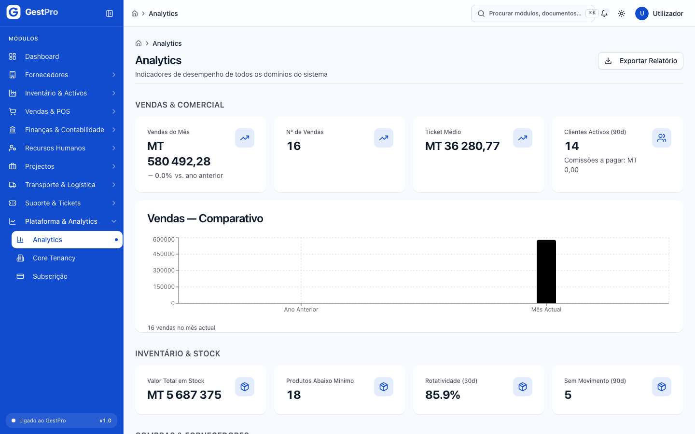

**Resultado:** os valores são calculados na hora a partir dos dados de cada módulo. Os montantes
aparecem em MT.

> **Atenção:** o botão **Exportar Relatório** ainda não está ligado — não descarrega nada.

### Como ver o resumo da administração

1. Abra **Plataforma & Analytics › Core Tenancy**.
2. O ecrã **Administração da Plataforma** mostra os cartões Utilizadores, Papéis (Roles),
   Configuração Fiscal e Auditoria, e três entradas: **Gerir Utilizadores**, **Gerir Papéis** e
   **Ver Auditoria**.

<!-- captura: 11-plataforma-e-administracao/core-tenancy.png | /core-tenancy -->
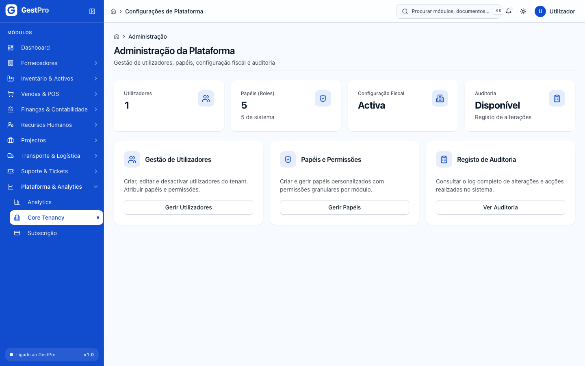

> **Atenção:** o cartão **Utilizadores** deste resumo não mostra o total real de utilizadores
> (mostra no máximo 1). Para contar, use a lista em **Gerir Utilizadores**.

### Como procurar utilizadores

1. Abra **Core Tenancy › Gerir Utilizadores**.
2. Use **Pesquisar por nome ou email…** e o filtro **Estado** (Activo / Inactivo).
3. A lista mostra Nome, Email, Papéis, Permissões (número), Estado e Criado em. Clique numa linha
   para abrir a ficha; o botão **⋯** oferece **Ver detalhe**, **Editar** e **Desactivar**.

<!-- captura: 11-plataforma-e-administracao/utilizadores.png | /core-tenancy/utilizadores -->
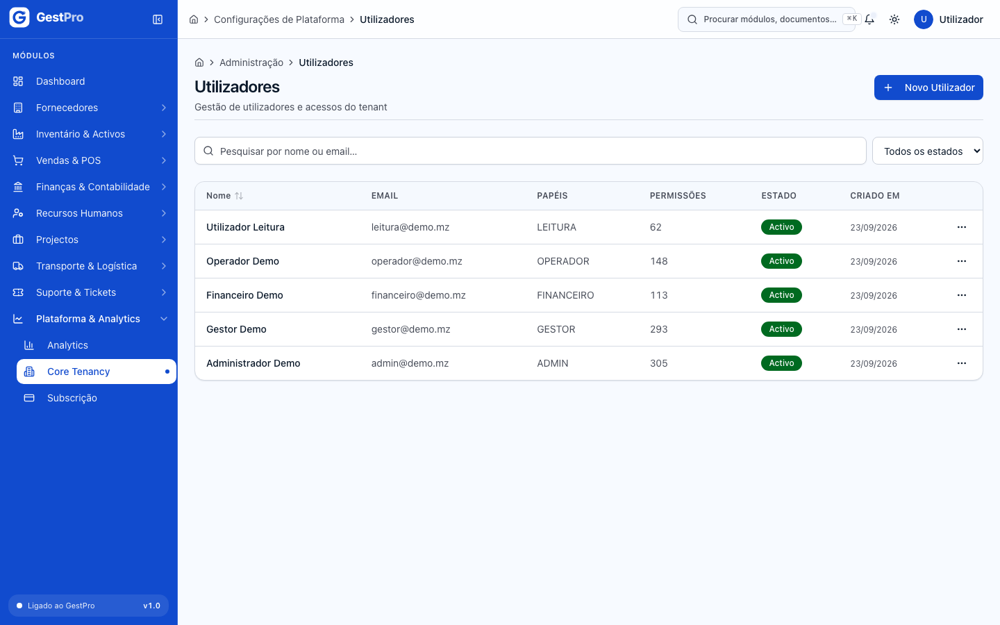

### Como criar um utilizador (convite ou palavra-passe atribuída)

**Antes de começar:** precisa da permissão `admin:gerir_utilizadores` (ADMIN, GESTOR) e de ter
o seu próprio endereço de e-mail **confirmado** (ver [Primeiros passos](00-primeiros-passos.md)).
O e-mail da pessoa não pode estar associado a nenhuma conta GestPro.

1. Em **Gerir Utilizadores**, clique em **Novo Utilizador**.
2. Em **Dados de Acesso**, preencha **Nome Completo** e **Email Corporativo** (é o identificador
   com que a pessoa entra).
3. Em **Como é que esta pessoa entra pela primeira vez?**, escolha:
   - **Convite por e-mail** — a pessoa recebe uma mensagem onde confirma o endereço e escolhe a
     palavra-passe; ou
   - **Definir palavra-passe agora** — o sistema gera uma provisória, mostra-a a si uma vez, e a
     pessoa é obrigada a mudá-la ao entrar. Use esta opção quando o e-mail da empresa não é fiável.
4. Deixe marcado **Utilizador activo** (ou desmarque para criar já inactivo).
5. Em **Papéis e Permissões**, marque pelo menos um papel. Cada papel mostra a descrição e o
   número de permissões.
6. Clique em **Criar Utilizador**.

<!-- captura: 11-plataforma-e-administracao/utilizador-novo.png | /core-tenancy/utilizadores/novo -->
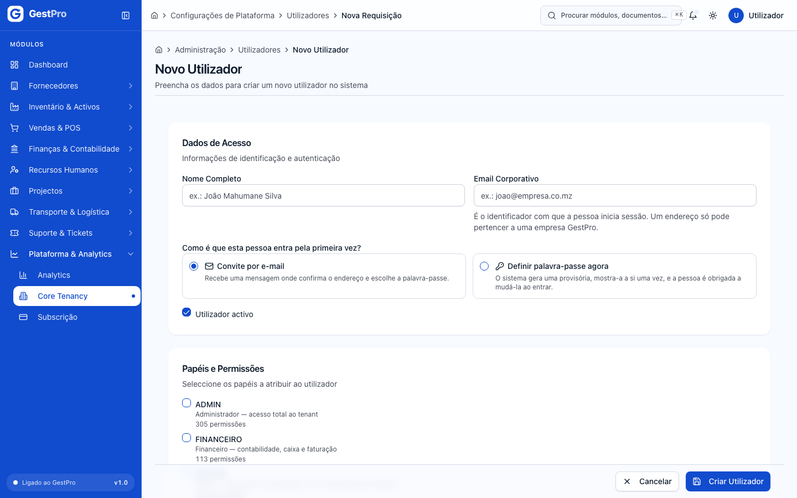

**Resultado:**

- Com **Convite por e-mail**: aparece «Utilizador criado. O convite seguiu por e-mail.» e volta à lista.
- Com **Definir palavra-passe agora**: aparece o ecrã **Utilizador criado** com o **E-mail** e a
  **Palavra-passe provisória**. Use **Copiar** ou anote-a e entregue-a ao próprio.
  **Esta palavra-passe não volta a ser mostrada** — se sair sem a guardar, terá de a repor na
  ficha do utilizador. Clique em **Já anotei — concluir**.

A pessoa entra como descrito em [Primeiros passos](00-primeiros-passos.md) (convite ou palavra-passe provisória).

> **Atenção:** os papéis só podem ser escolhidos ao criar o utilizador. O ecrã **Editar** mostra os
> **Papéis Actuais** apenas para consulta — ainda não há forma, no ecrã, de mudar os papéis de um
> utilizador existente. Para mudar o que uma pessoa pode fazer, edite as permissões do papel
> (afecta todos os que o têm) ou crie um utilizador novo.

### Como repor a palavra-passe de um utilizador

É o caminho para quem se esqueceu da palavra-passe — não depende de e-mail.

**Antes de começar:** permissão `admin:gerir_utilizadores` (ADMIN, GESTOR).

1. Abra a ficha do utilizador (clique na linha em **Gerir Utilizadores**).
2. Clique em **Repor palavra-passe**.
3. Na janela **Repor a palavra-passe de …?**, confirme com **Repor palavra-passe**.
4. Na janela **Palavra-passe reposta**, use **Copiar** ou anote a nova palavra-passe e clique em
   **Já anotei**.

<!-- captura: 11-plataforma-e-administracao/utilizador-detalhe.png | /core-tenancy/utilizadores >primeiro -->
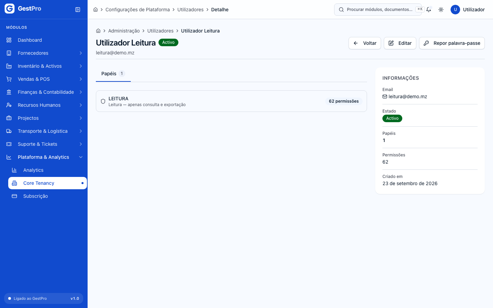

**Resultado:** a palavra-passe antiga deixa de funcionar imediatamente. A nova é provisória: a
pessoa tem de a trocar no próximo acesso. Não volta a ser mostrada.

### Como alterar o nome de um utilizador ou colocá-lo inactivo/activo

1. Na ficha do utilizador, clique em **Editar**.
2. Altere **Nome Completo** e/ou marque/desmarque **Utilizador activo**. O **Email** não é editável.
3. Clique em **Guardar Alterações**. Aparece «Utilizador actualizado com sucesso!».

**Resultado:** um utilizador desmarcado fica **Inactivo** e deixa de conseguir entrar (a sessão
que tiver aberta termina em 15 minutos, no máximo); continua na lista (filtro **Estado** › Inactivo)
e pode voltar a ser marcado como activo. Reactivar exige que o seu e-mail esteja confirmado.

### Como desactivar um utilizador

**Antes de começar:** permissão `admin:gerir_utilizadores` (ADMIN, GESTOR). Não pode desactivar-se
a si próprio nem desactivar o último administrador.

1. Em **Gerir Utilizadores**, na linha do utilizador, clique em **⋯** › **Desactivar**.
2. Na janela **Desactivar utilizador?**, clique em **Confirmar Desactivação**.

**Resultado:** aparece «Utilizador "…" desactivado com sucesso.» A pessoa perde o acesso e o
utilizador **sai da lista**. As acções que praticou continuam atribuídas a ela no Registo de Auditoria.

> **Atenção:** a janela diz que a desactivação «pode ser revertida posteriormente», mas hoje o
> utilizador desactivado por este botão deixa de aparecer em qualquer ecrã e não pode ser
> reactivado a partir do GestPro. Se quer apenas suspender o acesso temporariamente, use
> **Editar** e desmarque **Utilizador activo**.

### Como consultar os papéis e as suas permissões

1. Abra **Core Tenancy › Gerir Papéis**.
2. A lista mostra Nome (com a etiqueta **Sistema** nos papéis de sistema), Descrição, Permissões e
   Criado em. As linhas não abrem ao clicar: para ver ou alterar as permissões de um papel, use o
   menu **⋯** da linha › **Editar**.

<!-- captura: 11-plataforma-e-administracao/papeis.png | /core-tenancy/roles -->
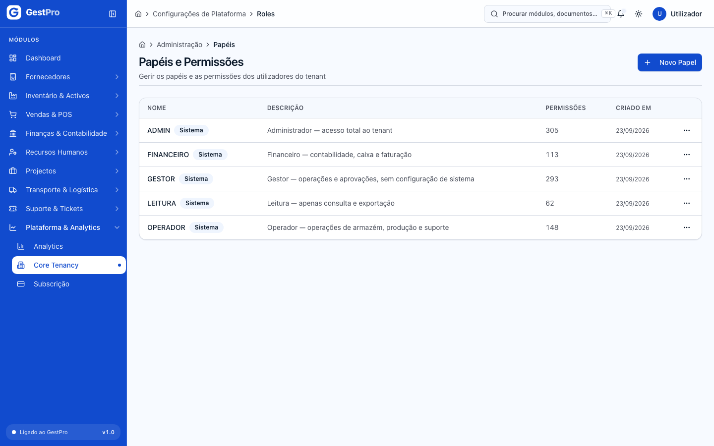

<!-- captura: 11-plataforma-e-administracao/papel-editar.png | /core-tenancy/roles >editar-primeiro -->
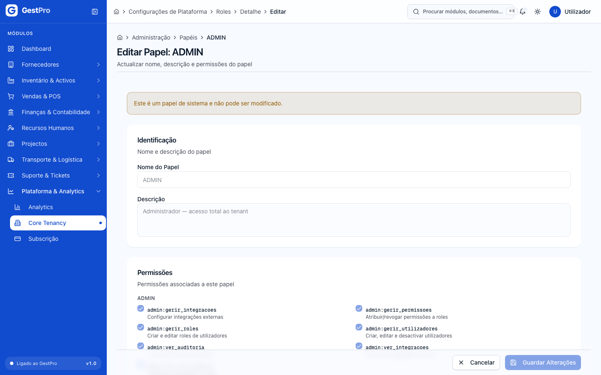

### Como criar um papel

**Antes de começar:** permissão `admin:gerir_roles` (ADMIN, GESTOR).

1. Em **Papéis e Permissões**, clique em **Novo Papel**.
2. Em **Identificação do Papel**, preencha **Nome do Papel** (por exemplo «Gestor de Vendas») e,
   opcionalmente, a **Descrição**.
3. Em **Permissões**, marque as permissões pretendidas. Estão agrupadas por módulo; cada uma
   mostra o código e a descrição.
4. Clique em **Criar Papel**. Aparece «Papel criado com sucesso!».

<!-- captura: 11-plataforma-e-administracao/papel-novo.png | /core-tenancy/roles/novo -->
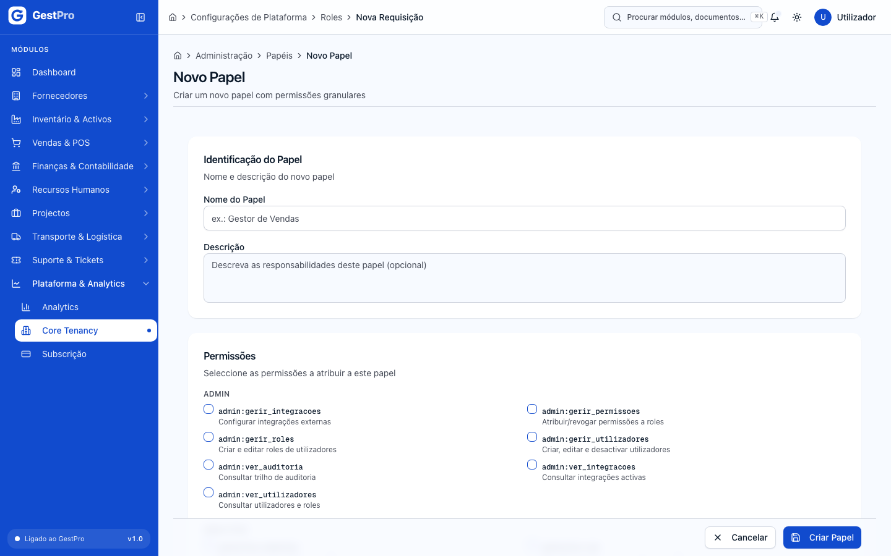

**Resultado:** o papel fica disponível para atribuir a novos utilizadores.

### Como editar ou remover um papel

1. Em **Papéis e Permissões**, clique em **⋯** › **Editar** na linha do papel (ou **Editar** na ficha).
2. Altere **Nome do Papel**, **Descrição** e as **Permissões**; clique em **Guardar Alterações**.
3. Para remover um papel criado pela empresa: **⋯** › **Remover** e, na janela **Remover papel?**,
   **Confirmar Remoção**.

**Resultado:** as alterações de permissões aplicam-se a todos os utilizadores com esse papel (nas
sessões abertas, em 15 minutos, no máximo). Remover é permanente: os utilizadores com esse papel
perdem as permissões associadas.

> **Atenção:** os papéis de sistema não podem ser removidos. A ficha de um papel de sistema indica
> «Papel de sistema (não editável)» e não mostra **Editar**, mas a lista ainda oferece **Editar**
> para eles. Evite alterar os papéis de sistema: são a referência descrita neste manual.

### Como consultar o Registo de Auditoria

1. Abra **Core Tenancy › Ver Auditoria**.
2. Filtre por **Entidade** e **Acção**, ou pesquise em **Pesquisar por ID de entidade ou utilizador…**.
3. A lista mostra Data/Hora, Acção, Entidade, Utilizador (ou «Sistema») e um excerto dos Dados.

<!-- captura: 11-plataforma-e-administracao/auditoria.png | /core-tenancy/auditoria -->
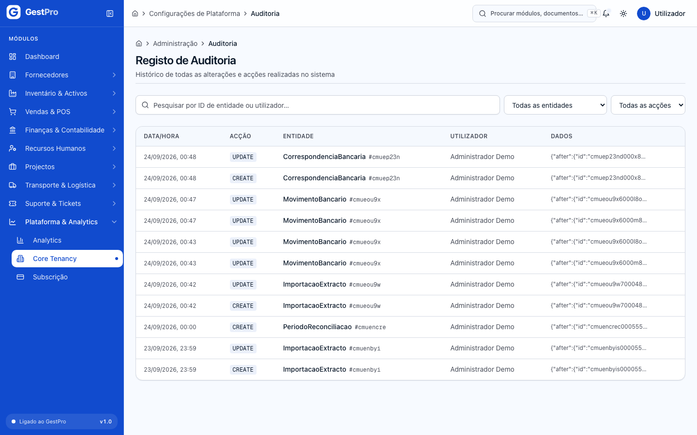

### Como consultar a subscrição

1. Abra **Plataforma & Analytics › Subscrição**.
2. No topo vê o **Estado**, o **Plano** e, em Período de Teste, os **Dias de teste restantes**
   (nos outros estados, a data de **Fim do teste**).
3. Por baixo aparece um aviso conforme o estado (por exemplo «Está a usar o teste gratuito de 14
   dias», que fica a vermelho nos últimos 3 dias) e os três planos com preço, utilizadores,
   armazéns e suporte. O plano actual tem a etiqueta **Plano actual**.

<!-- captura: 11-plataforma-e-administracao/subscricao.png | /definicoes/faturacao -->
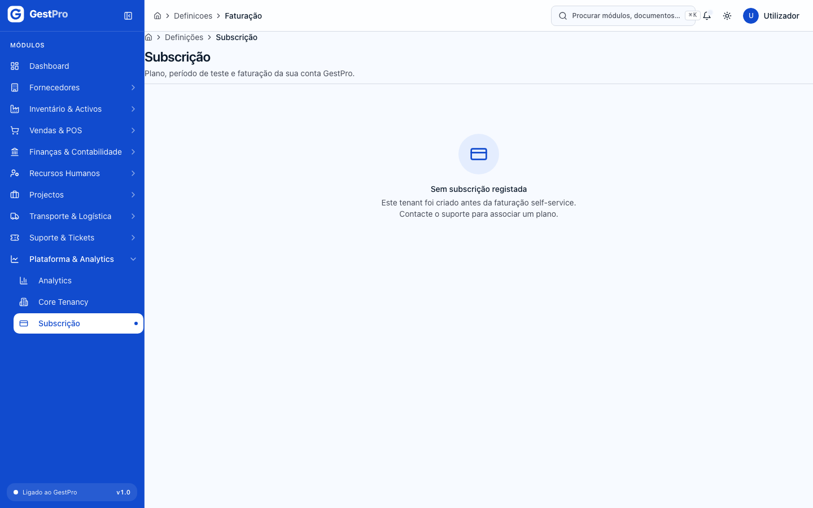

| Plano | Mensal | Anual | Utilizadores | Armazéns | Suporte |
|---|---|---|---|---|---|
| Básico | 29 USD | 290 USD | 3 | 1 | Email (48h) |
| Profissional | 79 USD | 790 USD | 15 | 5 | Email + telefone (24h) |
| Empresarial | 199 USD | 1990 USD | ilimitados | ilimitados | Gestor de conta dedicado (4h) |

O preço é do plano, não do número de pessoas. A subscrição do GestPro é cobrada em USD pelo
Stripe e **não** é registada na contabilidade da sua empresa.

### Como subscrever um plano (ou mudar de ciclo)

**Antes de começar:** permissão `assinatura:gerir` (ADMIN, GESTOR). Funciona também em Modo de Leitura.

1. Em **Subscrição**, escolha a **Periodicidade**: **Mensal** ou **Anual (2 meses grátis)**.
2. No plano pretendido, clique em **Subscrever** (no plano actual, **Renovar / mudar ciclo**).
3. É encaminhado para a página de pagamento do Stripe. Introduza o cartão e confirme.
4. No fim, volta ao ecrã **Subscrição**.

**Resultado:** quando o Stripe confirma o pagamento, a subscrição passa a **Activa** (se não mudar
logo, actualize a página daí a instantes). Se a empresa estava em Modo de Leitura, a escrita volta
a funcionar — nas sessões abertas, em 15 minutos, no máximo.

### Como gerir o cartão e ver as facturas do GestPro

1. Em **Subscrição**, clique em **Gerir pagamento e facturas** (só aparece depois de existir
   registo no Stripe).
2. No portal do Stripe pode mudar o cartão, ver e descarregar as facturas e mudar de plano.

### Como cancelar a subscrição

**Antes de começar:** permissão `assinatura:gerir` (ADMIN, GESTOR).

1. Em **Subscrição**, clique em **Cancelar subscrição**.
2. Na janela **Cancelar a subscrição do GestPro?**, clique em **Cancelar subscrição** (ou em
   **Manter subscrição** para desistir).

**Resultado:**

- Com subscrição paga: aparece «A subscrição será cancelada no fim do período já pago.» Até lá
  tudo funciona; depois, a empresa entra em **Modo de Leitura** por 30 dias.
- Em Período de Teste sem pagamento: aparece «Subscrição cancelada.» e a empresa entra de imediato
  em **Modo de Leitura** por 30 dias.

> **Atenção:** o texto da janela de confirmação diz que, depois do período pago, «os utilizadores
> deixam de conseguir iniciar sessão». Na realidade a empresa passa primeiro 30 dias em Modo de
> Leitura (entra, consulta e exporta) e só depois o acesso fecha.

### O que pode e não pode fazer em cada estado da subscrição

| | Período de Teste / Activa | Modo de Leitura (30 dias) | Acesso Fechado |
|---|---|---|---|
| Entrar no GestPro | Sim | Sim | **Não** («A subscrição da sua empresa não está activa…») |
| Consultar listas, fichas, relatórios, Analytics | Sim | Sim | Não |
| Exportar (CSV/XLSX) | Sim | **Sim** | Não |
| Gravar (criar, editar, emitir, anular, aprovar, gerir utilizadores, marcar notificações…) | Sim | **Não** — recusado com «A sua subscrição terminou e a conta está em modo de leitura…» | Não |
| Subscrever / pagar / gerir o cartão / cancelar | Sim | **Sim** | Não pelo produto — contacte o suporte GestPro |
| Reenviar a ligação de confirmação de e-mail | Sim | Sim | Não |
| Os dados | Guardados | Guardados | **Guardados** — não se apagam; pagar reabre tudo como estava |

Em Modo de Leitura, uma faixa no topo de **todas** as páginas diz «Modo de leitura. Pode consultar
e exportar tudo o que é seu; não pode gravar.», quantos dias faltam («Faltam N dias para o acesso
fechar.» ou «O acesso fecha hoje.») e tem o botão **Subscrever um plano**.

### Como consultar as notificações

1. Clique no sino no cabeçalho (o número vermelho indica as não lidas).
2. Em **Notificações**, filtre por **Estado** (**Apenas não lidas**) ou **Tipo** (Documento
   Expirado, Documento a Expirar, Manutenção Pendente, Alerta do Sistema).
3. Clique no visto de uma notificação para **Marcar como lida**, ou em **Marcar todas como lidas**.

<!-- captura: 11-plataforma-e-administracao/notificacoes.png | /notificacoes -->
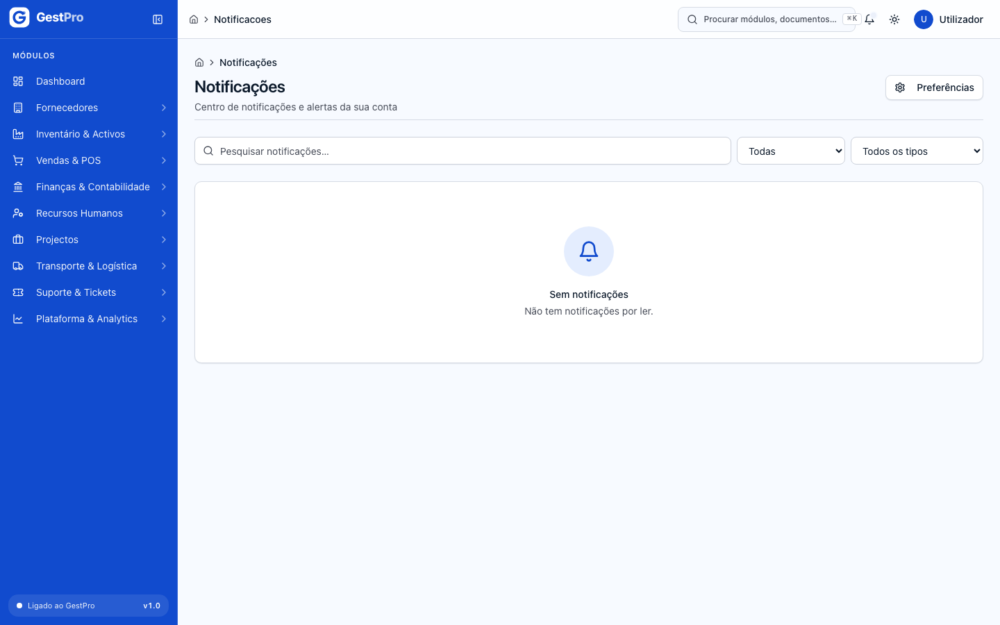

Os administradores recebem aqui, entre outros, os avisos da subscrição: «O período de teste termina
em breve», «Pagamento da subscrição falhou» e «Subscrição em modo de leitura por falta de pagamento».

> **Atenção:** a caixa **Pesquisar notificações…** ainda não filtra a lista, e a lista mostra as
> 20 notificações mais recentes, sem página seguinte.

### Como escolher como recebe cada tipo de notificação

1. Em **Notificações**, clique em **Preferências** (ou em **Gerir preferências de notificação**, no fundo da lista).
2. Para cada tipo — Documento Expirado, Documento Próximo a Expirar, Manutenção Pendente,
   Recuperação de Palavra-passe, Convite de Utilizador, Alertas do Sistema — ligue ou desligue
   **In-App** (no sino) e **Email**.
3. Cada mudança grava logo e mostra «Preferência actualizada».

<!-- captura: 11-plataforma-e-administracao/notificacoes-preferencias.png | /notificacoes/preferencias -->
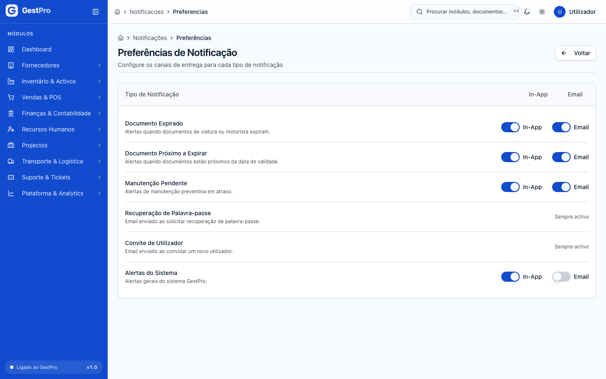

## Estados

**Subscrição** (etiquetas como aparecem no ecrã)

| Estado | Significado | Pode passar a | Quem |
|---|---|---|---|
| Período de Teste | 14 dias grátis desde o registo. | Activa (pagamento); Modo de Leitura (fim do teste ou cancelamento) | Automático / ADMIN, GESTOR |
| Activa | Subscrição paga; acesso completo. | Modo de Leitura (cancelamento no fim do período pago, ou falha de cobrança depois das novas tentativas) | Automático / ADMIN, GESTOR |
| Modo de Leitura | 30 dias só de consulta e exportação. | Activa (pagamento); Acesso Fechado (fim dos 30 dias) | ADMIN, GESTOR / automático |
| Acesso Fechado | Ninguém entra; dados guardados. | Activa (pagamento) | — |

Contas antigas podem ainda mostrar **Suspensa**, **Expirado** ou **Cancelada**; nesses casos o
ecrã explica a situação e a saída é sempre subscrever um plano.

**Utilizador**

| Estado | Significado | Pode passar a | Quem |
|---|---|---|---|
| Activo | Entra e trabalha conforme os papéis. | Inactivo (Editar, ou Desactivar) | ADMIN, GESTOR |
| Inactivo | Não entra. | Activo (Editar; exige e-mail confirmado) | ADMIN, GESTOR |

## Erros frequentes

| Mensagem mostrada | Porquê | O que fazer |
|---|---|---|
| Sem permissão para esta operação | O seu perfil não tem a permissão exigida (por exemplo, `admin:gerir_utilizadores` ou `assinatura:gerir`). | Peça a um ADMIN. |
| Para criar utilizadores é preciso confirmar o endereço de e-mail da conta — … | O seu e-mail ainda não está confirmado. | Confirme-o pelo aviso do Dashboard; se já confirmou, termine a sessão e entre de novo. |
| Para reactivar utilizadores é preciso confirmar o endereço de e-mail da conta — … | Idem, ao marcar de novo **Utilizador activo**. | Idem. |
| Este endereço de e-mail já está associado a uma conta GestPro. Cada pessoa tem uma única identidade, numa única empresa — … | O e-mail já é usado noutra conta (desta ou de outra empresa). | Use outro endereço. |
| Atribua pelo menos um papel ao utilizador | Nenhum papel marcado. | Marque pelo menos um papel. |
| Nome obrigatório / Email inválido | Campos por preencher ou mal escritos. | Corrija o campo assinalado. |
| Demasiados convites enviados. Tente novamente dentro de N minutos. | Muitos utilizadores criados em pouco tempo. | Espere o tempo indicado. |
| Demasiadas reposições seguidas. Tente novamente dentro de N minutos. | Muitas reposições de palavra-passe seguidas. | Espere o tempo indicado. |
| O navegador não deixou copiar. Anote a palavra-passe antes de sair. | O navegador bloqueou a cópia. | Anote a palavra-passe à mão. |
| Não pode desactivar o próprio utilizador | Tentou desactivar-se a si próprio. | Peça a outro administrador. |
| Não é possível desactivar o último administrador do tenant | É o único ADMIN activo. | Crie ou mantenha outro utilizador ADMIN primeiro. |
| Papel com este nome já existe | Já há um papel com esse nome. | Escolha outro nome. |
| Papéis de sistema não podem ser removidos | Tentou remover ADMIN, GESTOR, FINANCEIRO, OPERADOR ou LEITURA. | — |
| Não é possível remover o papel que confere acesso de administrador ao último administrador | Remover o papel deixaria a empresa sem administrador. | Atribua acesso de administrador a outra pessoa primeiro. |
| Ainda não existe uma subscrição paga. Subscreva um plano primeiro. | Abriu o portal de pagamento sem subscrição no Stripe. | Use **Subscrever**. |
| Não foi possível iniciar o pagamento. | O Stripe não devolveu a página de pagamento. | Tente de novo; se persistir, contacte o suporte. |
| A sua subscrição terminou e a conta está em modo de leitura. Pode consultar e exportar tudo o que é seu; para voltar a gravar, subscreva um plano. | Tentou gravar em Modo de Leitura. | Subscreva um plano em **Subscrição**. |
| Sem subscrição registada | Empresa criada antes da subscrição self-service. | Contacte o suporte para associar um plano. |

## Perguntas frequentes

**Um utilizador esqueceu-se da palavra-passe. O que faço?** Abra a ficha dele e use **Repor
palavra-passe**; entregue-lhe a provisória. Não depende de e-mail.

**Se a subscrição acabar, perco os dados?** Não. Passa 30 dias em Modo de Leitura (pode exportar
tudo) e depois o acesso fecha, mas os dados ficam guardados. Subscrever reabre tudo como estava.

**Quem pode pagar a subscrição?** Quem tem a permissão `assinatura:gerir`: os perfis ADMIN e GESTOR.
Os restantes perfis vêem o ecrã **Subscrição** mas não conseguem subscrever nem cancelar.

**Posso dar a mesma pessoa acesso a duas empresas?** Não com o mesmo e-mail: cada endereço
pertence a uma só empresa GestPro.
