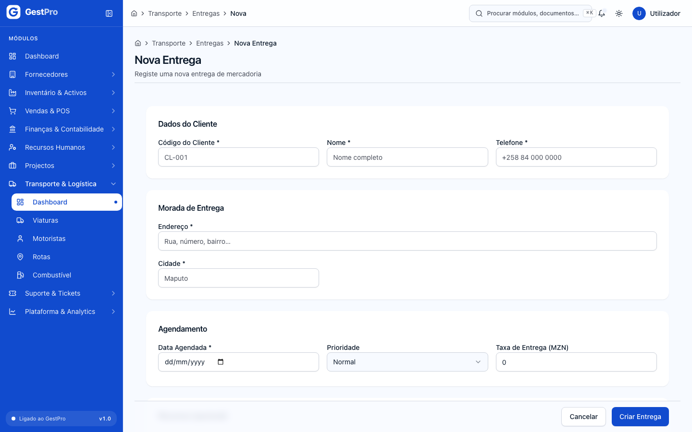

# 12. Casos práticos — um mês na vida de uma empresa

> **Para quem:** todos os perfis · **Onde:** atravessa todos os módulos · **Pré-requisito:** ter lido
> [Primeiros passos](00-primeiros-passos.md)

## Para que serve

Os capítulos 0 a 11 explicam **o objectivo de cada módulo e cada ecrã**, cada um com o seu exemplo prático. Este capítulo explica **como os ecrãs se encadeiam** no
trabalho real. Segue uma empresa fictícia durante o seu primeiro mês no GestPro, com valores
concretos, para que possa reproduzir cada passo na sua própria empresa (ou numa conta de teste) e
confirmar que obtém os mesmos números.

Cada caso tem a mesma estrutura: **Situação** → **Quem faz** → **Passo a passo** (com ligação à tarefa
detalhada noutro capítulo) → **O que o sistema faz sozinho** → **Como confirmar que correu bem**.

> **Os valores deste capítulo são de exemplo.** Nomes de empresas, pessoas e NUIT são fictícios. Os
> preços de venda no GestPro são **sem IVA**: o IVA de 16 % é somado por linha e arredondado a 2 casas.

## A empresa do exemplo

**Ferragens Boa Obra, Lda** — loja de materiais de construção na Cidade de Maputo, com balcão de
venda ao público e clientes empresariais a crédito.

| Item | Valor no exemplo |
|---|---|
| Empresa | Ferragens Boa Obra, Lda · NUIT 400500600 · Província: Maputo Cidade · plano **Profissional** |
| Administrador | Sérgio Cossa (quem regista a empresa; perfil **ADMIN**) |
| Balcão e armazém | Ana Mabunda (perfil **OPERADOR**) |
| Financeiro | Carlos Nhantumbo (perfil **FINANCEIRO**) |
| Armazém | `ARM-01` — Armazém Central (tipo Armazém) |
| Banco | BCI, conta à ordem · carteira M-Pesa da empresa |
| Fornecedor | Cimentos do Índico, SA · NUIT 400100200 · 30 dias |
| Cliente empresarial | Construções Machava, Lda · NUIT 400300400 · 30 dias |

**Catálogo usado em todos os casos** (categoria de produto «Materiais de construção»)

| SKU | Produto | Unid. | Compra (MT) | Venda s/ IVA (MT) | IVA | Stock mínimo |
|---|---|---|---:|---:|---|---:|
| CIM-50 | Cimento Portland 50 kg | Unidade | 520,00 | 650,00 | 16 % | 40 |
| VAR-12 | Varão de aço 12 mm (12 m) | Unidade | 380,00 | 480,00 | 16 % | 100 |
| TIN-20 | Tinta plástica branca 20 L | Unidade | 2 900,00 | 3 600,00 | 16 % | 10 |

**Mapa do mês**

```
Dia 1   Caso 1  Pôr a empresa a funcionar ........ ADMIN
Dia 2   Caso 2  Comprar e dar entrada no stock ... ADMIN + OPERADOR
Dia 3   Caso 3  Um dia de balcão (POS + caixa) ... OPERADOR (+ ADMIN para anular)
Dia 6   Caso 4  Venda empresarial com proposta ... FINANCEIRO + OPERADOR
Dia 7   Caso 5  Entregar ao cliente .............. OPERADOR
Dia 10  Caso 6  Pagar a um fornecedor ............ FINANCEIRO
Dia 15  Caso 7  Ver a tesouraria das próximas semanas  FINANCEIRO
Dia 31  Caso 8  Contagem de stock e reposição .... OPERADOR
Dia 31  Caso 9  Salários do mês .................. FINANCEIRO (+ ADMIN nas comissões)
Dia 31+ Caso 10 Fecho do mês ...................... FINANCEIRO + ADMIN
```

---

## Caso 1 — Pôr a empresa a funcionar

**Situação:** a Ferragens Boa Obra vai começar a usar o GestPro hoje. Antes de vender seja o que for,
precisa da conta, dos dados da empresa, dos colegas, do banco, do armazém e do catálogo.

**Quem faz:** Sérgio (ADMIN).

### Passo a passo

1. **Registar a empresa** em `/registo`: Nome da empresa «Ferragens Boa Obra, Lda», NUIT `400500600`,
   Província «Maputo Cidade», o nome e o e-mail do Sérgio, palavra-passe com 10+ caracteres e o plano
   **Profissional**. Clique **Criar conta e entrar**. → [Como criar a conta da sua empresa](00-primeiros-passos.md#como-criar-a-conta-da-sua-empresa)

   

2. **Confirmar o e-mail** pela ligação recebida (válida 24 h). Sem isto **não pode criar utilizadores
   nem emitir documentos fiscais** — nem vender no POS.
   → [Como confirmar o endereço de e-mail](00-primeiros-passos.md#como-confirmar-o-endereço-de-e-mail-e-reenviar-a-ligação)

3. **Completar os dados da empresa** em **Plataforma & Analytics › Core Tenancy › Editar Dados da
   Empresa**: confira **Nome da empresa** e **NUIT**, escolha o **Regime de IVA** **Normal**, e preencha
   a **Morada** e os **Contactos**. Clique **Guardar**. São os dados do emitente que saem no cabeçalho
   das facturas. → [Como alterar os dados da empresa](11-plataforma-e-administracao.md#como-alterar-os-dados-da-empresa-e-a-configuração-fiscal)

4. **Criar os colegas** em **Core Tenancy › Gerir Utilizadores › Novo Utilizador**:

   | Nome | E-mail | Primeira entrada | Papel |
   |---|---|---|---|
   | Ana Mabunda | ana@boaobra.co.mz | Convite por e-mail | OPERADOR |
   | Carlos Nhantumbo | carlos@boaobra.co.mz | Definir palavra-passe agora | FINANCEIRO |

   Para o Carlos, anote a **palavra-passe provisória** antes de clicar **Já anotei — concluir** — não
   volta a ser mostrada. Se mais tarde a função de alguém mudar, os papéis mudam-se na ficha, em
   **Editar** › **Papéis** › **Guardar Alterações**.
   → [Como criar um utilizador](11-plataforma-e-administracao.md#como-criar-um-utilizador-convite-ou-palavra-passe-atribuída) ·
   [Como mudar os papéis de um utilizador](11-plataforma-e-administracao.md#como-mudar-os-papéis-de-um-utilizador)

   

   > **Limites do plano:** contam os utilizadores e os armazéns **activos**. O Profissional permite 15 e 5;
   > o Básico, 3 e 1 — chegaria à justa para este exemplo (Sérgio, Ana e Carlos; um armazém).
   > → [Como consultar a subscrição](11-plataforma-e-administracao.md#como-consultar-a-subscrição)

5. **Registar o banco e a carteira M-Pesa** em **Finanças & Contabilidade › Contas Bancárias › Nova
   Conta Bancária**: em **Identificação**, Banco, Agência, Número de Conta, **Tipo de Conta**
   (**Corrente** para o BCI; **Carteira móvel (M-Pesa, e-Mola)** para o M-Pesa) e Moeda MZN; em
   **Ligação Contabilística**, a **Conta PGC**. Clique **Guardar**. Ligue **cada conta à sua própria
   subconta** de depósitos (crie-a antes no Plano de Contas, se não existir) — duas contas na mesma
   conta PGC bloqueiam a reconciliação.
   → [Como criar uma conta bancária](05-contabilidade.md#como-criar-desactivar-ou-reactivar-uma-conta-bancária)

6. **Dizer ao POS onde lançar cada meio de pagamento** em **Finanças & Contabilidade › Configurações ›
   Meios de pagamento do POS › Configurar contas dos meios de pagamento**: Cartão e Transferência →
   conta BCI; M-Pesa → carteira M-Pesa. Clique **Guardar** em cada linha.
   → [Como configurar as contas dos meios de pagamento do POS](05-contabilidade.md#como-configurar-as-contas-dos-meios-de-pagamento-do-pos)

7. **Conferir as séries** em **Finanças & Contabilidade › Séries de documento** (`/faturacao/series`):
   devem existir `FAT/2026`, `FR/2026`, `NC/2026`, `ND/2026`, `PRO/2026`, `COT/2026` activas. Se a empresa
   vem de outro sistema e quer continuar a numeração, é agora — antes do primeiro documento — que se
   ajusta o **Número inicial**. → [Séries de documento e numeração](06-faturacao-caixa-tesouraria.md#séries-de-documento-e-numeração)

8. **Criar o armazém** em **Inventário & Activos › Dashboard › Localizações › Nova Localização**:
   Código `ARM-01`, Nome «Armazém Central», Tipo **Armazém** → **Criar Localização**. Não há edição
   depois de criada: confira antes de gravar. → [Como criar uma localização](03-inventario.md#como-criar-uma-localização)

9. **Criar a categoria de produto** em **Inventário & Activos › Categorias de produto › Nova
   categoria**: Nome «Materiais de construção» → **Criar categoria**. Sem pelo menos uma categoria, o
   formulário de produto não grava. → [Como criar uma categoria de produto](03-inventario.md#como-criar-uma-categoria-de-produto)

10. **Criar os três produtos** do catálogo em **Inventário & Activos › Produtos › Novo Produto** (SKU,
    Nome, Categoria «Materiais de construção», Unidade de Medida, preços, Taxa de IVA 16 %, Stock
    Mínimo) → **Criar Produto**. → [Como criar um produto](03-inventario.md#como-criar-um-produto)

    

11. **Criar o cliente empresarial** em **Vendas & POS › Clientes › Novo Cliente**: Tipo de Cliente
    **Pessoa Jurídica**, «Construções Machava, Lda», NUIT `400300400`, **Dias de Pagamento** 30,
    **Limite de Crédito (MT)** 500 000 → **Guardar Cliente**. → [Como criar um cliente](04-vendas-e-pos.md#como-criar-um-cliente)

12. **Criar o fornecedor** em **Fornecedores › Lista de Fornecedores › Novo Fornecedor**: «Cimentos do
    Índico, SA», NUIT `400100200`, **Dias para Pagamento** 30. → [Como registar um fornecedor](02-fornecedores-e-servicos.md#como-registar-um-fornecedor)

### O que o sistema faz sozinho

- Cria o exercício 2026 com os 13 períodos **Abertos**, o plano de contas PGC-NIRF, os nove diários e
  as séries de numeração do ano.
- Cria os cinco papéis de sistema e o cliente técnico **Consumidor Final** (`CF-000000`).
- Atribui códigos automáticos ao fornecedor (`FOR-0001`).

### Como confirmar que correu bem

- [ ] O Dashboard já não mostra o aviso **Endereço de e-mail por confirmar**.
- [ ] Em **Gerir Utilizadores** aparecem a Ana e o Carlos, **Activos**.
- [ ] Em **Exercícios**, o período do mês corrente está **Aberto**.
- [ ] Em **Produtos**, os três SKU estão **Activos**; no detalhe, o separador **Stock** mostra «Sem stock
  registado em nenhuma localização.» — é normal, ainda não houve compras.

---

## Caso 2 — Comprar e dar entrada no stock

**Situação:** o armazém está vazio. É preciso comprar 200 sacos de cimento e 300 varões à Cimentos do
Índico, e 30 latas de tinta a outro fornecedor.

**Quem faz:** Ana (requisição, recepção e entrada de stock) e Sérgio (cotação e pedido de compra).

### Passo a passo

O circuito completo, com dois fornecedores a cotar, está no
[exemplo prático de Compras](01-compras.md#exemplo-prático--reabastecer-cimento-e-varão). Aqui segue-se o
caminho mais curto.

1. **Ana regista a necessidade** em **Compras & Procurement › Requisições › Nova Requisição**:
   - Prioridade **Alta**, Departamento «Loja», Justificativa «Abertura de stock inicial da loja».
   - Itens: `Cimento Portland 50 kg` · 200 · UN · 520,00 e `Varão de aço 12 mm` · 300 · UN · 380,00.
   - **Valor Total Estimado: 218 000,00 MZN**. Clique **Guardar Requisição** e, no detalhe, **Submeter
     para Aprovação**.

   Sem circuito de aprovação configurado, a requisição passa logo a **Aprovada**. (Com um circuito
   activo, ficaria **Em Aprovação** até o aprovador clicar **Aprovar…**.)
   → [Como criar uma requisição](01-compras.md#como-criar-uma-requisição-de-compra)

   

2. **Sérgio pede o preço** em **Cotações (RFQ) › Nova Cotação**: Data de Validade +7 dias, **Requisição
   de Compra** escolhida pelo número, **Fornecedores a Convidar** «Cimentos do Índico» (pesquisa por nome,
   código ou NUIT) e os dois itens. **Criar Cotação** → abra-a → **Enviar aos fornecedores**.
   → [Como criar um pedido de cotação](01-compras.md#como-criar-um-pedido-de-cotação-rfq)

3. **Chega a proposta:** separador **Fornecedores** › **Registar resposta** → Preço unitário 520,00 e
   380,00, **Prazo de entrega (dias)** 3, Condições de pagamento «30 dias após factura» → **Registar
   resposta**. Depois **Adjudicar** → Fornecedor vencedor «Cimentos do Índico» → **Adjudicar**.
   → [Como registar a resposta](01-compras.md#como-registar-a-resposta-de-um-fornecedor) ·
   [Como adjudicar](01-compras.md#como-adjudicar-uma-cotação)

4. **Sérgio converte a requisição em pedido:** no detalhe da requisição, **Converter em pedido** →
   Cotação adjudicada → **Converter em pedido**. Nasce o pedido para a Cimentos do Índico, com os preços
   da requisição:

   | Linha | Qtd | Preço | IVA | Total linha |
   |---|---:|---:|---|---:|
   | Cimento Portland 50 kg | 200 | 520,00 | 16 % | 104 000,00 |
   | Varão de aço 12 mm | 300 | 380,00 | 16 % | 114 000,00 |
   | **Subtotal** | | | | **218 000,00** |
   | **IVA** | | | | **34 880,00** |
   | **Total** | | | | **252 880,00** |

   → [Como converter uma requisição aprovada em pedido de compra](01-compras.md#como-converter-uma-requisição-aprovada-em-pedido-de-compra)

5. **Sérgio acompanha o pedido:** **Enviar pedido** → (o fornecedor confirma) **Confirmar pedido** →
   (o camião sai) **Marcar em trânsito**. → [Como enviar, confirmar e acompanhar um pedido de compra](01-compras.md#como-enviar-confirmar-e-acompanhar-um-pedido-de-compra)

6. **Ana regista a recepção** quando o camião chega: no detalhe do pedido, **Registar recepção** →
   Localização de destino «Armazém Central (ARM-01)», Guia de remessa = número da guia do fornecedor,
   quantidades **200** e **300** → **Registar recepção**. O pedido passa a **Recebido**.
   → [Como registar a recepção de mercadoria](01-compras.md#como-registar-a-recepção-de-mercadoria)

7. **Ana dá entrada da mercadoria no stock** em **Inventário & Activos › Movimentações › Nova
   Movimentação › Entrada**, uma vez por produto:
   - Produto «Cimento Portland 50 kg», Localização de destino `ARM-01`, Quantidade **200**;
   - Tipo de documento **Recebimento de compra**, Nº do documento = número da guia do fornecedor.
   - Repita para o varão (**300**). A tinta (**30**) entra da mesma forma: a compra dela a outro
     fornecedor não é seguida neste capítulo.

   É preciso porque os itens criados em Compras não ficam ligados a produtos do catálogo: a recepção
   mostra-os «sem produto (não entra em stock)».
   → [Como dar entrada de stock](03-inventario.md#como-dar-entrada-de-stock)

   

### O que o sistema faz sozinho

- Com o pedido **Recebido**, cria em **Fornecedores › Contas a Pagar** uma conta **Aberta** de
  **252 880,00** à Cimentos do Índico, «Compra via pedido …», com vencimento **3 dias depois da
  recepção** (a data da recepção mais o prazo de entrega do pedido — não os 30 dias das condições).
- Lança, no diário de Compras, **débito 211 Mercadorias / crédito 421 Fornecedores c/c 252 880,00**.
  Não é lançado IVA dedutível: a factura do fornecedor costuma chegar depois e ainda não há forma de a
  registar sobre esta conta.

### Como confirmar que correu bem

- [ ] A requisição está **Convertida**, a cotação **Adjudicada** e o pedido de 252 880,00 **Recebido**.
- [ ] Em **Contas a Pagar** aparece a conta de 252 880,00, **Aberta**.
- [ ] Em **Movimentações** aparecem três entradas: 200, 300 e 30.
- [ ] No separador **Stock** de cada produto, em `ARM-01`: **CIM-50 = 200 · VAR-12 = 300 · TIN-20 = 30**.

---

## Caso 3 — Um dia de balcão (POS + caixa)

**Situação:** primeiro dia de vendas ao público. A Ana abre o caixa de manhã, vende ao longo do dia e
fecha à noite.

**Quem faz:** Ana (OPERADOR); o Sérgio (ADMIN) anula uma venda — o perfil Operador não anula vendas.
**Requisitos já cumpridos no Caso 1:** e-mail confirmado, período do mês aberto, armazém activo com stock.

### Manhã — abrir o caixa

1. Em **Caixa › Abrir Caixa**, confirme a **Lista de Verificação** e clique **Prosseguir**.
2. **Fundo Inicial (MZN): 5 000,00**. Clique **Confirmar Abertura**.

Resultado: sessão `CXS/2026/000001` **Aberta**, com o movimento **Abertura** de 5 000,00.
→ [Como abrir o caixa](06-faturacao-caixa-tesouraria.md#como-abrir-o-caixa)


### Durante o dia — quatro vendas

Abra **Vendas & POS › POS**. A sessão POS abre-se sozinha sobre o caixa aberto.
→ [Como vender no POS](04-vendas-e-pos.md#como-vender-no-pos)


| # | Cliente | Carrinho | Subtotal | IVA 16 % | Total | Pagamento | Documento emitido |
|---|---|---|---:|---:|---:|---|---|
| 1 | (Consumidor Final) | 10 × CIM-50 + 1 × TIN-20 | 10 100,00 | 1 616,00 | **11 716,00** | Dinheiro — recebido 12 000,00, **troco 284,00** | Factura-Recibo `FR/…` (Paga) |
| 2 | (Consumidor Final) | 20 × VAR-12 | 9 600,00 | 1 536,00 | **11 136,00** | M-Pesa | Factura-Recibo `FR/…` (Paga) |
| 3 | Construções Machava | 50 × CIM-50 | 32 500,00 | 5 200,00 | **37 700,00** | **Crédito** | Factura `FAT/…` (Emitida, vence a 30 dias) |
| 4 | (Consumidor Final) | 1 × TIN-20 | 3 600,00 | 576,00 | **4 176,00** | M-Pesa | Factura-Recibo `FR/…` (Paga) |

Como se faz cada uma, no terminal — **Finalizar (F10)** abre o painel de pagamento com uma linha pelo
total, no meio da venda anterior (ou **Dinheiro**):

- **Venda 1:** clique no cartão do cimento 10 vezes (ou use **+**), depois no da tinta. **F10** → na linha
  de **Dinheiro**, escreva **12 000,00**; o painel mostra «Troco: MT 284,00» → **Pagar MT 11 716,00**.
- **Venda 2:** **F2**, escreva «VAR», acrescente 20 unidades → **F10** → **M-Pesa** → **Pagar MT 11 136,00**.
- **Venda 3:** carrinho com 50 sacos → **F10** → **Crédito** → **Cliente**: pesquise «400300400» →
  **Facturar a crédito MT 37 700,00**. A crédito, o cliente tem de estar identificado — nunca o
  Consumidor Final.
- **Venda 4:** uma lata de tinta paga por **M-Pesa**.

*Pagamento dividido:* se um cliente pagasse parte por M-Pesa e o resto em dinheiro, mudava-se a primeira
linha para **M-Pesa** com o valor dele e clicava-se **Adicionar pagamento** — a nova linha vem em
**Dinheiro** com o valor em falta. Só a parte em dinheiro entra na gaveta.

### A meio da tarde — reforçar a gaveta

A Ana fica sem trocos e o Sérgio traz 2 500,00 MT do cofre. Em **Caixa**, a Ana abre a sua sessão →
**Registar reforço** → **Valor (MZN)** 2 500,00, **Motivo** «Trocos do cofre» → **Registar reforço**.
Aparece «Reforço registado.» e o movimento «Reforço: Trocos do cofre» entra nas **Entradas** da sessão.
→ [Como registar uma sangria ou um reforço](06-faturacao-caixa-tesouraria.md#como-registar-uma-sangria-ou-um-reforço)

### Corrigir um engano — anular a venda 4

Dez minutos depois, o cliente da venda 4 volta: levou a cor errada e quer o dinheiro de volta. Anular
uma venda exige a permissão de cancelar vendas (Administrador ou Gestor), por isso a Ana chama o Sérgio.

1. O Sérgio abre a venda 4 em `/vendas` e clica **Anular venda**.
2. Confere o resumo, escreve o **Motivo** «Cliente devolveu — cor errada» e clica **Anular venda**.

O sistema emite, de uma só vez, uma **nota de crédito** total sobre a Factura-Recibo, regista a
devolução dos 4 176,00 pelo meio original — a carteira M-Pesa da empresa, de onde o Sérgio envia o
dinheiro ao cliente — e repõe a lata no armazém. A Factura-Recibo original **não se altera** — é a regra
de ouro: um documento emitido só se corrige com outro documento.
→ [Como anular uma venda POS](04-vendas-e-pos.md#como-anular-uma-venda-pos)

> **E se a venda 4 tivesse sido paga em dinheiro?** O dinheiro a devolver sai da sessão de caixa
> **aberta de quem anula** — neste caso, o Sérgio teria de ter o seu próprio caixa aberto, e a saída
> ficaria na gaveta dele, não na da Ana.

### Noite — fechar o caixa

**Quanto devia estar na gaveta?** Só o dinheiro conta — M-Pesa e crédito não passam pela gaveta:

| Movimento | Valor |
|---|---:|
| Abertura (fundo inicial) | + 5 000,00 |
| Venda 1 (dinheiro, já sem o troco) | + 11 716,00 |
| Reforço — trocos do cofre | + 2 500,00 |
| **Saldo esperado** | **19 216,00** |

1. Em **Caixa**, abra a sessão → **Fechar caixa** → **Prosseguir para Contagem**. Não precisa de fechar
   antes a sessão POS: o fecho do caixa fecha-a sozinho.
2. Conte a gaveta. Exemplo que bate certo: **19 × Nota MT 1000**, **2 × Nota MT 100**, **1 × Moeda MT
   10**, **1 × Moeda MT 5**, **1 × Moeda MT 1** = **19 216,00** → **Prosseguir**.
3. No **Resumo do Fecho**, confira **Saldo Esperado** 19 216,00 e **Diferença** 0,00 → **Confirmar Fecho**.

→ [Como fechar o caixa](06-faturacao-caixa-tesouraria.md#como-fechar-o-caixa)


### O que o sistema faz sozinho

**Stock** (`ARM-01`): CIM-50 200 → **140** · VAR-12 300 → **280** · TIN-20 30 → **29** (−1 −1 +1).

**Contabilidade** — um lançamento por documento, já **Lançado**:

| Documento | Débito | Crédito |
|---|---|---|
| FR venda 1 | 111 Caixa 11 716,00 | 711 Vendas 10 100,00 · 44331 IVA liquidado 1 616,00 |
| FR venda 2 | Conta da carteira M-Pesa 11 136,00 | 711 9 600,00 · 44331 1 536,00 |
| FAT venda 3 | 411 Clientes c/c 37 700,00 | 711 32 500,00 · 44331 5 200,00 |
| FR venda 4 | Conta da carteira M-Pesa 4 176,00 | 711 3 600,00 · 44331 576,00 |
| NC anulação 4 | 711 3 600,00 · 44331 576,00 | 411 4 176,00 |
| Devolução 4 | 411 4 176,00 | Conta da carteira M-Pesa 4 176,00 |

Saldo do dia: **711 Vendas 52 200,00 (C)** · **44331 IVA liquidado 8 352,00 (C)** · **411 Construções
Machava 37 700,00 (D)**. O fundo inicial, o reforço e a contagem são dinheiro da gaveta: ficam na sessão de
caixa e não lançam nada na contabilidade.

**Comissões:** uma comissão **Pendente** para a Ana por cada venda; a da venda 4 foi cancelada pela anulação.

> **Nota:** a venda POS **não lança o custo das mercadorias vendidas** (61/32). A margem não aparece
> ainda na contabilidade. Ver [Vendas & POS › limitações actuais](04-vendas-e-pos.md#como-vender-no-pos).

### Como confirmar que correu bem

- [ ] Em **Faturas** aparecem 3 Factura-Recibo e 1 Factura; em **Notas de Crédito**, 1 nota.
- [ ] O detalhe da sessão `CXS/…` mostra **Fechada** e **Diferença 0,00**.
- [ ] Em **Razão Geral**, conta 111, o dia fecha com saldo 11 716,00 (D) se não houver outros movimentos.
- [ ] Em `/vendas`, a venda 4 está **Cancelada**; as outras **Concluídas** ou **Faturada** (a 3).

---

## Caso 4 — Venda empresarial com proposta (Cotação → Proforma → Factura)

**Situação:** a Construções Machava pede preço para 100 sacos de cimento e 200 varões para uma obra.
Aceita a proposta, pede proforma para o seu departamento financeiro e, depois, a factura. Na entrega,
5 sacos chegam rasgados.

**Quem faz:** Carlos (FINANCEIRO) — ou um GESTOR; a saída de stock (passo 5) é da Ana (OPERADOR), porque
o perfil Financeiro não movimenta stock.

### Passo a passo

1. **Cotação** em **Faturação › Cotações › Nova Cotação**: pesquise o **Cliente** por código, nome ou
   NUIT, Data de Emissão hoje, Data de Validade +15 dias, e as linhas:

   | Descrição | Qtd | Preço | IVA | Base |
   |---|---:|---:|---|---:|
   | Cimento Portland 50 kg | 100 | 650,00 | 16 % | 65 000,00 |
   | Varão de aço 12 mm | 200 | 480,00 | 16 % | 96 000,00 |
   | **Subtotal / IVA / Total** | | | | **161 000,00 / 25 760,00 / 186 760,00** |

   Em **Condições Comerciais**: «Entrega em 48 h na obra; pagamento a 30 dias». **Criar Cotação**
   → abra-a → **Enviar**. → [Como criar e enviar uma cotação](06-faturacao-caixa-tesouraria.md#como-criar-e-enviar-uma-cotação)

2. O cliente aceita por e-mail: na cotação, **Aceitar**.
3. **Converter em proforma** → confirme. Abre-se a proforma `PRO/…`, em Rascunho, com as mesmas linhas.
   → [Como converter uma cotação em proforma](06-faturacao-caixa-tesouraria.md#como-converter-uma-cotação-em-proforma)
4. Na proforma: **Enviar** → (cliente confirma) **Aceitar** → **Converter em factura**.
   Resultado: factura `FAT/…` de **186 760,00**, **Emitida**, com data de hoje e **vencimento a 30 dias**.
   → [Como criar uma proforma e convertê-la em fatura](06-faturacao-caixa-tesouraria.md#como-criar-uma-proforma-e-convertê-la-em-fatura)
5. **Dar saída do stock** da mercadoria facturada (a factura não mexe no stock). A Ana, em **Movimentações
   › Nova Movimentação › Saída**: Localização de origem `ARM-01`, Tipo de documento **Venda**, **Motivo**
   com o número da factura — 100 × CIM-50 e 200 × VAR-12. → [Como dar saída de stock](03-inventario.md#como-dar-saída-de-stock)
6. **Corrigir os 5 sacos rasgados** com uma nota de crédito em **Vendas & POS › Notas de Crédito ›
   Nova Nota de Crédito**: **Factura a creditar** = a factura do passo 4 (a lista mostra-a com o saldo
   que ainda se pode creditar, 186 760,00), Motivo **Produto com defeito**, item «Cimento Portland 50 kg —
   saco rasgado na entrega» · 5 · 650,00 · IVA 16 % → **3 250,00 + 520,00 = 3 770,00**. **Emitir Nota de
   Crédito**. → [Como emitir uma nota de crédito](04-vendas-e-pos.md#como-emitir-uma-nota-de-crédito)

   

7. **Liquidar a nota por compensação**: abra a nota → **Liquidar** → Forma **Compensação na factura** →
   Data → confirmar. O cliente passa a dever **182 990,00** nesta factura.
   → [Como liquidar uma nota de crédito](06-faturacao-caixa-tesouraria.md#como-liquidar-uma-nota-de-crédito)

### O que o sistema faz sozinho

| Documento | Débito | Crédito |
|---|---|---|
| Factura | 411 Clientes c/c 186 760,00 | 711 Vendas 161 000,00 · 44331 IVA liquidado 25 760,00 |
| Nota de crédito | 711 3 250,00 · 44331 520,00 | 411 3 770,00 |
| Liquidação por compensação | — (sem lançamento novo: a nota já abateu o crédito ao cliente) | — |

Cotação e proforma **não são documentos fiscais** e não lançam nada.

### Como confirmar que correu bem

- [ ] Cotação **Convertida**, proforma **Convertida**, factura **Emitida** (Total Pago 3 770,00, Pendente 182 990,00).
- [ ] Nota de crédito **Liquidada**.
- [ ] Stock: CIM-50 140 → **40** · VAR-12 280 → **80**. Os 5 sacos rasgados **não** voltam ao stock
  (não são vendáveis) — a nota de crédito não mexe no stock.
- [ ] No detalhe da factura, o separador **Detalhes** mostra o **Hash de integridade**, e **Descarregar
  PDF** entrega o PDF fiscal para enviar ao cliente.

### Mais tarde — receber o pagamento

Na data de vencimento a Construções Machava transfere os **182 990,00** para o BCI. No detalhe da factura
(em **Faturação**), **Registar pagamento** → Valor 182 990,00 (vem preenchido com o pendente) → Data do
pagamento → Forma **Transferência bancária** → Conta bancária **BCI** → **Registar pagamento**. A factura
passa a **Paga** e é lançado **débito conta do BCI / crédito 411 Clientes c/c 182 990,00**. Se pagasse só uma
parte, ficaria **Parcialmente Paga**; se passasse do prazo sem pagar, a partir do dia seguinte ao vencimento
usar-se-ia **Marcar como vencida**. Este passo é do Carlos (ou de um Gestor): o perfil Operador não regista
recebimentos de facturas.
→ [Como registar o pagamento de uma fatura](06-faturacao-caixa-tesouraria.md#como-registar-o-pagamento-de-uma-fatura)

---

## Caso 5 — Entregar a encomenda ao cliente

**Situação:** os 100 sacos e 200 varões do Caso 4 seguem para a obra da Construções Machava, na Machava.

**Quem faz:** Ana (OPERADOR). Viatura e motorista já registados ([capítulo 9](09-transporte.md)).

1. Em `/transporte/entregas` → **Nova Entrega**: Código do Cliente `400300400`, Nome, Telefone,
   Endereço da obra, Cidade «Matola»; Data Agendada amanhã; Prioridade **Alta**; Itens: CIM-50 · 100
   · 5 000 kg e VAR-12 · 200. **Criar Entrega**.
2. Na ficha, separador **Ações**: escolha **Viatura** e **Motorista** → **Guardar Recursos**.
3. No dia: **Agendada** → **Em Trânsito**.
4. Na obra: **Entregue** → Recebedor «Eng.º Tembe», Tipo de Prova **Assinatura** → **Confirmar Entrega**.
   Se os sacos chegarem rasgados, é este o momento de recolher a prova que justifica a nota de
   crédito do Caso 4.

→ [Como criar e acompanhar uma entrega](09-transporte.md#como-criar-e-acompanhar-uma-entrega)



**Confirmar:** a entrega aparece **Entregue** com o separador **Prova de Entrega**.

---

## Caso 6 — Pagar a um fornecedor

**Situação:** a conta a pagar da compra do Caso 2 — **252 880,00 MT** à Cimentos do Índico, «Compra via
pedido …» — venceu no dia 5 (3 dias depois da recepção). Vai ser paga hoje, por transferência a partir
do BCI.

**Quem faz:** Carlos (FINANCEIRO) — ou o Sérgio, ou um GESTOR.

1. Em **Fornecedores › Contas a Pagar**, o indicador **Vencidas** conta esta conta; na tabela, por baixo
   do vencimento, aparece «5d atraso». Abra a conta: o detalhe mostra «· 5 dias de atraso».

   O estado continua **Aberta** — o sistema não muda o estado sozinho quando a data passa, por isso o
   filtro **Estado › Vencida** não a mostra. Use o indicador **Vencidas** e os dias de atraso.
   → [Como consultar as contas a pagar](02-fornecedores-e-servicos.md#como-consultar-as-contas-a-pagar)
2. **Registar pagamento** → Valor **252 880,00** (vem preenchido com o restante) → Data do pagamento hoje →
   Forma **Transferência bancária** → Conta bancária **BCI** → Referência = n.º da transferência.
3. **Registar pagamento**.

→ [Como registar um pagamento a um fornecedor](02-fornecedores-e-servicos.md#como-registar-um-pagamento-a-um-fornecedor)


**O que o sistema faz sozinho:** aparece «Pagamento registado.», a conta passa a **Paga** e é lançado, no
diário de Banco, **débito 421 Fornecedores c/c 252 880,00 / crédito conta PGC do BCI 252 880,00**. A linha
do pagamento tem **Ver lançamento**.

**Variante — pagamento parcial em numerário:** escreva um valor menor (por exemplo 20 000,00) e Forma
**Numerário**. Quem paga tem de ter **o seu próprio caixa aberto**: o pagamento sai dessa sessão como
movimento **Pagamento**, é lançado a crédito de **111 Caixa** (diário de Caixa) e a conta fica
**Parcialmente Paga**.

> **Contas a pagar que não vêm de compras** — a renda, um serviço, uma factura sem pedido — registam-se em
> **Contas a Pagar › Nova conta a pagar** e pagam-se da mesma forma.
> → [Como criar uma conta a pagar à mão](02-fornecedores-e-servicos.md#como-criar-uma-conta-a-pagar-à-mão)

---

## Caso 7 — Ver a tesouraria das próximas semanas

**Situação:** a meio do mês, o Carlos quer saber se há dinheiro para a renda e para a prestação da
carrinha nas próximas 12 semanas.

**Quem faz:** Carlos (FINANCEIRO).

1. **Registar o que o sistema não conhece**, em **Compromissos › Novo Compromisso**:

   | Descrição | Tipo | Valor (MT) | Data prevista | Recorrência |
   |---|---|---:|---|---|
   | Renda do armazém | Saída | 35 000,00 | dia 5 do próximo mês | Mensal |
   | Prestação leasing carrinha | Saída | 22 500,00 | dia 20 do próximo mês | Mensal |

   Clique **Guardar** em cada um. Não registe aqui facturas, contas a pagar nem salários — já entram
   sozinhos e contariam duas vezes.
   → [Como registar um compromisso](06-faturacao-caixa-tesouraria.md#como-registar-um-compromisso)

2. Abrir **Tesouraria**: Horizonte **90** dias, Granularidade **Semanal**, Cenário **Base**.
3. Ler, por esta ordem: **Saldo de abertura** → **Menor saldo projectado** → **Primeira ruptura** →
   tabela de períodos.


**O que deve ver neste exemplo:**

- Na semana do vencimento da factura do Caso 4, uma **entrada de 182 990,00** (o pendente depois da
  compensação). A factura a crédito do POS (Caso 3) entra também, na data do seu vencimento.
- Em cada mês, duas **saídas** de 35 000,00 e 22 500,00.
- A conta a pagar do Caso 2 **já não aparece**: foi paga no Caso 6.
- Como a empresa é nova (menos de 20 facturas pagas em 180 dias), aparece **Histórico de cobrança
  insuficiente** e o cenário Base usa a hipótese optimista — é o comportamento esperado.

> **Nota:** o saldo do BCI no **Saldo de abertura** é o da contabilidade, não o do extracto. Se o
> dinheiro com que a conta já vinha do sistema anterior não foi lançado (o contabilista regista-o por
> lançamento manual), o saldo de abertura sai mais baixo do que o real — e a projecção pode mostrar
> uma ruptura que não existe.

**Como agir:** se houver **Primeira ruptura**, mude para **Pessimista** para ver o pior caso e envie o
endereço da página (os filtros vão nele) ao gestor.

---

## Caso 8 — Contagem de stock e reposição

**Situação:** no último dia do mês, a Ana conta o armazém. Um saco de cimento rasgou-se no manuseamento.

**Quem faz:** Ana (OPERADOR).

**Saldo esperado no sistema** (Casos 2 a 4): CIM-50 **40** · VAR-12 **80** · TIN-20 **29**.

1. `/inventario/contagens` → **Nova Contagem** → Contagem Cega **Sim (saldos ocultos até fecho)**,
   Localização «Todas as localizações» e Categoria «Todos os produtos» → **Abrir Contagem**.
2. Em **Itens de Contagem**, escreva a **Qtd. Contada** e clique ✓ em cada linha:

   | Produto | Saldo Sistema | Contado | Diferença | % |
   |---|---:|---:|---:|---:|
   | CIM-50 | 40 | 39 | −1 | 2,5 % |
   | VAR-12 | 80 | 80 | 0 | — |
   | TIN-20 | 29 | 29 | 0 | — |

3. **Reconciliar** → **Confirmar Reconciliação** → **Concluir** → **Confirmar Conclusão**.

→ [Como fazer uma contagem de stock](03-inventario.md#como-fazer-uma-contagem-de-stock-e-acertar-o-stock)


> **E se a diferença fosse grande?** Uma diferença **superior a 5 %** do saldo do sistema precisa de
> aprovação: a Ana não a pode reconciliar, mas o Sérgio (Administrador) ou um Gestor pode — clica
> **Reconciliar** e fica registado como aprovador. Se a diferença estiver explicada e **não** dever
> mexer no stock, justifique o item (**Justificar discrepância**): um item justificado não é ajustado.

**O que o sistema faz sozinho:** um movimento de saída de 1 × CIM-50 com o motivo «Ajuste de contagem …».
Sem lançamento contabilístico.

**E a seguir — reposição:** abra `/stock/reposicao`. Aparecem **CIM-50 (39 < 40)** e **VAR-12 (80 <
100)** com **Stock Baixo**. É o ponto de partida de uma nova requisição — o ciclo do **Caso 2** recomeça.

---

## Caso 9 — Salários do mês

**Situação:** fim do mês; a Ferragens Boa Obra tem 3 colaboradores activos e paga por transferência.

**Quem faz:** Carlos (FINANCEIRO); o Sérgio (ADMIN) aprova as comissões.

**Antes de começar:** colaboradores **Activos** com o salário base certo; assiduidade do mês registada
(para as horas extra); ausências do mês **aprovadas** (só as faltas não justificadas e as licenças sem
vencimento aprovadas descontam); comissões da Ana **aprovadas** pelo Sérgio se forem para pagar este mês
— e o e-mail do colaborador igual ao do utilizador vendedor
([Como aprovar uma comissão](04-vendas-e-pos.md#como-aprovar-pagar-ou-cancelar-uma-comissão)). Tabela INSS
e escalões IRPS em vigor para o mês em **Payroll › Tabelas INSS/IRPS**.

1. **Processar:** **Recursos Humanos › Payroll › Processar Folha do Mês** → Mês e Ano → **Processar
   Folha do Mês**. A folha fica **Pendente**.
2. **Rever:** clique em cada linha de **Payrolls individuais** e confira o recibo. Um prémio pontual
   ou um adiantamento entra por **Adicionar ajuste** (Tipo, Natureza, Descrição, Valor) enquanto a
   folha estiver Pendente. Corrigiu um salário na ficha ou aprovou uma ausência depois de processar?
   Use **Recalcular** no recibo (e confirme) ou processe o mês de novo.
   → [Como corrigir um recibo](07-recursos-humanos.md#como-corrigir-um-recibo-antes-de-confirmar-recalcular-e-ajustes)
3. **Processar na contabilidade** (na linha do mês, ainda no dia 31): os valores ficam fixos e é gerado
   o lançamento de salários. → [Como confirmar a folha na contabilidade](07-recursos-humanos.md#como-confirmar-a-folha-na-contabilidade)
4. **Pagar:** a transferência dos salários sai do BCI a **2 de Novembro**. Nesse dia, **Marcar como
   paga** → **Data do pagamento** 2 de Novembro → Forma **Transferência bancária** → Conta bancária
   **BCI** → **Registar pagamento**. → [Como marcar a folha como paga](07-recursos-humanos.md#como-marcar-a-folha-como-paga)
5. Descarregar os **recibos em PDF** e os mapas **INSS** e **IRPS** (CSV) para preparar as declarações.

→ [Como processar a folha de salários do mês](07-recursos-humanos.md#como-processar-a-folha-de-salários-do-mês)


**O que o sistema faz sozinho:**

| Momento | Débito | Crédito |
|---|---|---|
| Processar na contabilidade | 622 (bruto) · 623 (INSS entidade) | 449 (INSS trabalhador + entidade) · 442 (IRPS) · 451 (outros descontos) · 4622 (líquido) |
| Marcar como paga | 4622 (líquido) | Conta PGC do BCI (líquido) — **111 Caixa**, se pagasse em numerário |

> **Atenção às datas:** **Processar na contabilidade** lança com a **data do dia em que clica**, não com
> o último dia do mês. Para que os salários de Outubro fiquem em Outubro, processe-os **antes de fechar
> Outubro** (Caso 10). O pagamento lança na **Data do pagamento** que indica (entre o dia do
> processamento e hoje): como a transferência saiu a 2 de Novembro, o pagamento fica em Novembro — não
> entra no extracto nem na reconciliação de Outubro.

---

## Caso 10 — Fecho do mês

**Situação:** o mês terminou. O Carlos fecha a contabilidade de Outubro; o Sérgio (ADMIN) é o único que
pode reabrir, se for preciso.

**Quem faz:** Carlos (FINANCEIRO). A ordem importa — o sistema verifica todos os impedimentos de uma vez.

```
1 Conferir documentos → 2 Confirmar rascunhos → 3 Fechar caixas → 4 Reconciliar bancos
      → 5 Apurar o IVA → 6 Balancete → 7 Fechar o período → 8 Declarar o IVA à AT
```

1. **Conferir documentos.** Em **Faturação**, todas as facturas e notas do mês têm lançamento? (O fecho
   recusa se algum documento fiscal ficou sem lançamento.)
2. **Confirmar rascunhos.** **Lançamentos** → filtro **Estado: Rascunho** → abrir → **Confirmar**. Um
   rascunho errado corrige-se com **Editar** ou descarta-se com **Anular** — não precisa de estorno.
   → [Como confirmar um lançamento](05-contabilidade.md#como-confirmar-lançar-um-lançamento) ·
   [Como corrigir ou anular um rascunho](05-contabilidade.md#como-corrigir-ou-anular-um-rascunho)
3. **Fechar as sessões de caixa** abertas no mês. A da Ana já foi fechada no Caso 3; uma sessão aberta
   por engano e sem movimentos cancela-se com **Cancelar sessão**.
4. **Reconciliar o BCI.** Em **Reconciliação** → conta BCI → **Abrir período** (1 a 31, saldos do
   extracto) → **Importar extracto** (CSV/XLSX até 5 MB). Exemplo mínimo de ficheiro:

   ```csv
   data;descricao;valor;referencia
   2026-10-10;TRF CIMENTOS DO INDICO;-252880,00;TRF0001234
   2026-10-31;COMISSAO MANUTENCAO CONTA;-350,00;
   ```

   - A transferência do Caso 6 aparece em **Sugestões** → **Confirmar**.
   - A comissão de 350,00 aparece em **Excepções › Banco sem contabilização** → **Contabilizar** (o
     formulário vem preenchido com a conta **6981 Serviços bancários**) → gravar → **confirmar o
     lançamento** → **Executar reconciliação**.
   - **Período em curso** → **Diferença residual 0,00** → **Fechar período**.

   O pagamento dos salários (Caso 9) tem data de Novembro: entra na reconciliação de Novembro.
   → [Como reconciliar uma conta bancária](05-contabilidade.md#como-reconciliar-uma-conta-bancária)

   

5. **Apurar o IVA.** **Apuramento de IVA** → linha `2026-10` → **Apurar** → confirmar. Se no mês só
   houvesse as operações deste capítulo:

   | | MT |
   |---|---:|
   | IVA liquidado — POS (1 616 + 1 536 + 5 200 + 576 − 576) | 8 352,00 |
   | IVA liquidado — factura do Caso 4 menos nota de crédito (25 760 − 520) | 25 240,00 |
   | IVA dedutível | 0,00 |
   | **IVA a pagar (4437)** | **33 592,00** |

   O IVA dedutível é zero porque a conta a pagar criada pela recepção do Caso 2 não regista o IVA da
   compra (34 880,00): a factura do fornecedor costuma chegar depois, e ainda não há forma de a juntar a
   essa conta. Todos os documentos do mês estão a 16 %, por isso o apuramento não é recusado por pro
   rata. Descarregue os **Mapas de suporte** (Modelo A, Clientes, Fornecedores).
   → [Como apurar o IVA](05-contabilidade.md#como-apurar-o-iva-de-um-período)

6. **Ver o Balancete.** Exercício 2026, Período inicial e Período final 10 → **Aplicar**. Tem de aparecer
   **Balancete equilibrado**. Clique no código de uma conta de movimento para ir ao **Razão Geral** dela;
   para guardar o quadro, use **Exportar PDF** (ou CSV / Excel).
   → [Como gerar o Balancete](05-contabilidade.md#como-gerar-o-balancete)

   

7. **Fechar o período.** **Exercícios** → linha `2026-10` → **Fechar período**. Se aparecer «N
   impedimentos para fechar», resolva-os todos (a tabela de impedimentos está em
   [Como fechar um período](05-contabilidade.md#como-fechar-um-período-mês)) e repita.
8. **Declarar à AT** — depois de entregar a declaração: no apuramento, **Marcar declarado** → Data de
   entrega à AT e Referência da entrega → **Confirmar declaração**. **É irreversível**: o período deixa de
   poder ser reaberto e qualquer correcção faz-se por regularização num mês seguinte.

> **Atenção — conformidade:** a regra de apuramento do IVA ainda está em validação (ver a caixa em
> [Como apurar o IVA](05-contabilidade.md#como-apurar-o-iva-de-um-período)). Confirme os valores com o
> seu contabilista certificado antes de entregar a declaração.

### Como confirmar que correu bem

- [ ] Em **Exercícios**, `2026-10` está **Fechado** e `2026-11` **Aberto**.
- [ ] Em **Apuramento de IVA**, `2026-10` está **Apurado** (ou **Declarado à AT**).
- [ ] Em **Reconciliação**, o período do BCI está fechado com diferença residual zero.
- [ ] Tentar emitir uma factura com data de Outubro é recusado com «Período 2026-10 está fechado» —
  prova de que o mês está trancado.

> **E no fim do ano?** Fechado Dezembro, o Administrador encerra o exercício (o resultado é apurado no
> Período 13 e o ano seguinte recebe a abertura), aplica o resultado quando os sócios aprovarem as contas e,
> por fim, encerra em definitivo — ver [Como encerrar o exercício](05-contabilidade.md#como-encerrar-o-exercício-fim-do-ano).

---


## Resumo — onde cada acção deixa rasto

| Acção | Documento | Stock | Caixa | Contabilidade | Tesouraria |
|---|---|---|---|---|---|
| Recepção de compra (pedido totalmente recebido) | Conta a pagar | — (faça a entrada à mão) | — | 211 ↔ 421 | Saída no vencimento |
| Conta a pagar à mão | Conta a pagar | — | — | conta escolhida ↔ 421 | Saída no vencimento |
| Venda POS paga | Factura-Recibo | Saída | Só a parte em dinheiro | 111 / conta do meio ↔ 711 + 44331 | — |
| Venda POS a crédito | Factura | Saída | — | 411 ↔ 711 + 44331 | Entrada no vencimento |
| Anular venda POS | Nota de crédito | Entrada | Saída do dinheiro (sessão de quem anula) | Estorno + devolução | — |
| Reforço / sangria | — | — | Entrada / saída na sessão | — | — |
| Factura (Faturação/Vendas) | Factura | — (faça a saída à mão) | — | 411 ↔ 711 + 44331 | Entrada no vencimento |
| Pagamento de factura | Recebimento | — | Só em numerário (entra na sessão) | caixa/banco ↔ 411 | Sai das entradas previstas |
| Nota de crédito | Nota de crédito | — | Só se devolução em numerário | 711 + 44331 ↔ 411 | Reduz a entrada (se compensada) |
| Cotação / Proforma | — (não fiscal) | — | — | — | — |
| Entrada / saída de stock manual | Movimento | Sim | — | — | — |
| Contagem reconciliada | Movimentos de ajuste | Sim | — | — | — |
| Pagamento a fornecedor | Pagamento | — | Só em numerário | 421 ↔ banco/caixa | Retira a saída |
| Processar/pagar salários | Folha | — | Só se pagar em numerário | Diário de Salários (pagamento: 4622 ↔ banco/caixa) | Saída (payroll processado) |
| Compromisso | — | — | — | — | Entrada/Saída |
| Apurar IVA | Apuramento | — | — | 4433x/4432x ↔ 4435 → 4437/4438 | — |

## Perguntas frequentes

**Posso seguir estes casos numa empresa em produção?**
Sim, mas lembre-se de que tudo o que é emitido é real: durante o Período de Teste os documentos são
fiscais como quaisquer outros. Para treinar, use uma conta de teste com outro e-mail.

**Os meus totais diferem por alguns centavos dos do exemplo.**
O GestPro arredonda o IVA **por linha**, a 2 casas, e soma as linhas. Uma calculadora que aplica 16 % ao
total do documento pode diferir em cêntimos. O valor certo é o do documento emitido.

**Porque é que o custo das vendas não aparece no balancete?**
Nesta versão as saídas de stock não lançam 61/32. A margem tem de ser vista fora da contabilidade até
essa funcionalidade existir.

**Porque é que a compra do Caso 2 não aparece no stock sozinha?**
Porque os itens criados em Compras (requisição, cotação, pedido) não ficam ligados a produtos do
catálogo. A recepção cria a conta a pagar e o lançamento, mas a entrada no stock faz-se em
**Movimentações**, com Tipo de documento **Recebimento de compra**.

**Onde vejo o que ainda não está disponível?**
Cada capítulo tem caixas **Atenção** com os limites actuais. A lista técnica completa está em
[`docs/sistema/08-lacunas-conhecidas.md`](../sistema/08-lacunas-conhecidas.md).
