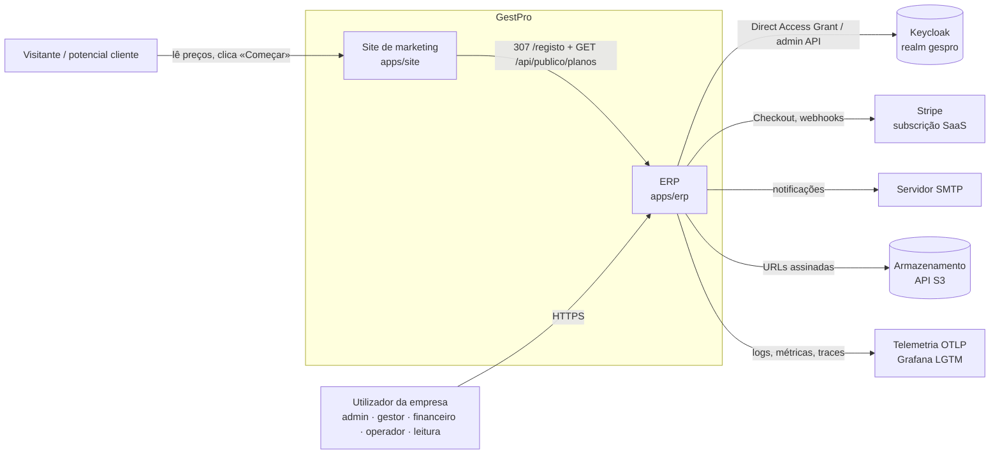
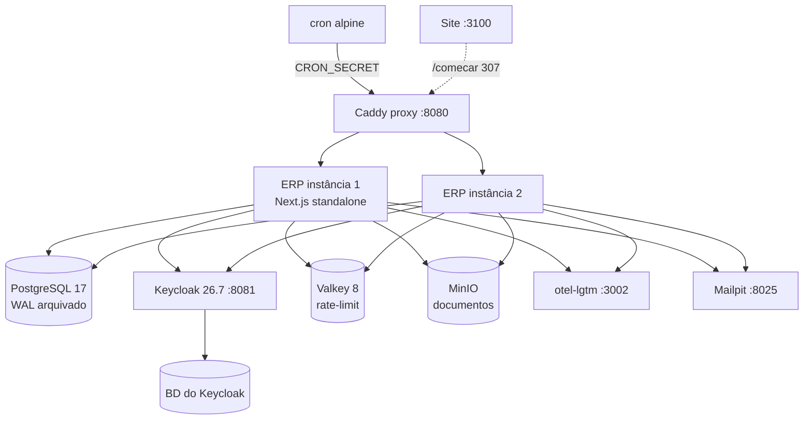

# 1. Visão geral

> **Estado a 2026-09-24** — `origin/main` em `3ea52bd` (PR #74). Documento regenerado a cada fecho de
> *wave* (ADR-0023 §4). Se contradisser o código, o código ganha — e abre-se nota em
> [`status.md`](../status.md).

## O que é

O GestPro é um ERP **SaaS multi-tenant** para PME moçambicanas: compras, fornecedores, inventário e
activos, vendas e POS, faturação, contabilidade PGC-NIRF (Decreto 70/2009), IVA, caixa e tesouraria,
recursos humanos com payroll (INSS/IRPS), projectos, produção, transporte e suporte. Moeda MZN, fuso
`Africa/Maputo`, validações NUIT/BI, UI inteira em português de Portugal.

Cada empresa cliente é um **tenant**: fronteira de isolamento de todos os dados de negócio. O acesso é
governado por uma **Assinatura** (trial de 14 dias → activa → Leitura durante 30 dias → fechada), e a
autenticação é delegada no **Keycloak**.

## Números que ajudam a calibrar

| | |
|---|---|
| Aplicações | 2 — `apps/erp` (produto) e `apps/site` (marketing + funil) |
| Páginas do ERP (`page.tsx`) | 336 |
| Modelos Prisma | 182, em 11 ficheiros de schema |
| Permissões / papéis de sistema | 305 / 5 (ADMIN, GESTOR, FINANCEIRO, OPERADOR, LEITURA) |
| Server Actions | ~379, em 25 ficheiros |
| Route Handlers | 24 (ver [API](05-api.md)) |
| ADRs | 41 (três colidem no nº 0005 — citam-se `ADR-0005-a/-b/-c`) |

## Estado de produção

**Não há ambiente de produção.** O ADR-0026 adiou a escolha de fornecedor de infraestrutura; tudo é
construído e validado contra um **ambiente local de referência** (`docker compose --profile full`) que
materializa as mesmas capacidades que a produção terá de oferecer (Postgres com PITR, Keycloak, Valkey,
API S3, OTLP, SMTP, contentores sem estado). O Terraform em `infra/` descreve o candidato AWS (App
Runner + RDS + Secrets Manager) mas **nunca foi aplicado**. Ver [Operação](06-operacao.md).

A maioria dos ADRs da Wave 8 em diante está `Proposto`. Passar um ADR a `Aceite` é um acto humano.

## Diagrama de contexto (C4 — nível 1)

## Diagrama de contentores (C4 — nível 2, ambiente de referência)

## Stack

| Camada | Tecnologia |
|---|---|
| Web | Next.js 16 (App Router, Turbopack, `output: 'standalone'`), React 19, TypeScript 5 |
| UI | Tailwind 4, shadcn/Radix, `packages/brand` (tokens únicos), Inter |
| Dados | PostgreSQL 17, Prisma 7 (schema multi-ficheiro, `@prisma/adapter-pg`) |
| Identidade | Keycloak 26.7 + Auth.js v5 (sessão JWT) |
| Documentos | `@react-pdf/renderer` (runtime Node), CSV/XLSX com `Decimal` sem perdas |
| Pagamentos SaaS | Stripe (USD, ADR-0009) |
| Observabilidade | pino, OpenTelemetry, `prom-client` |
| Testes | Vitest + fast-check, Testcontainers, Playwright + axe, k6 |
| Monorepo | pnpm workspaces + Turborepo |

## Onde continuar

- Como as peças encaixam: [Arquitectura](02-arquitectura.md)
- O que está onde nos dados: [Domínios e dados](03-dominios-e-dados.md)
- Quem pode o quê: [Segurança e identidade](04-seguranca-e-identidade.md)
- O que está partido hoje: [Lacunas conhecidas](08-lacunas-conhecidas.md)
