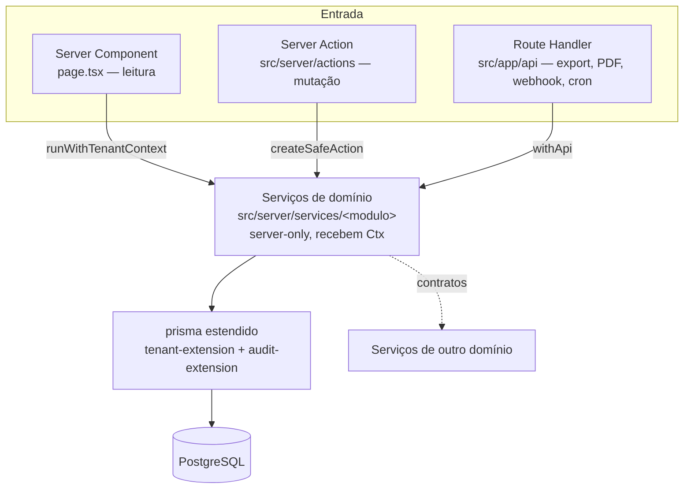

# 2. Arquitectura

## Estilo: monólito modular

Um único deployable Next.js (`apps/erp`) com fronteiras de domínio explícitas. A comunicação entre
domínios faz-se **só por funções de contrato publicadas**, nunca por import de internals de outro
módulo. Decisão e alternativas: [ADR-0001](../decisions/0001-stack-e-scaffolding.md) (Next.js + Prisma
em vez de Spring) e [ADR-0003](../decisions/0003-gate-wave1-arbitragens.md) (contratos canónicos, sem
tipos-espelho).

**Porquê monólito:** um só developer, transacções que atravessam domínios (venda → stock → caixa →
contabilidade) e necessidade de consistência forte em documentos fiscais. Microserviços trariam sagas e
consistência eventual para um problema que uma `$transaction` resolve. O custo é disciplina de
fronteiras — imposta por convenção, revisão e gates de CI, não pelo compilador.

## Camadas do backend

| Camada | Onde | Responsabilidade |
|---|---|---|
| Schema | `prisma/schema/*.prisma` | Um ficheiro por domínio + `tenant`/`auth`. URL do datasource em `prisma.config.ts` (Prisma 7) |
| Cliente | `src/server/db/client.ts` | `prisma` (estendido) e `prismaBase` (cru) |
| Isolamento | `src/server/db/tenant-extension.ts` | `AsyncLocalStorage` com `{tenantId, userId}`; `TENANT_MODELS`/`SOFT_DELETE_MODELS` derivados do `Prisma.dmmf` |
| Auditoria | `audit-extension` | `AuditLog` em `create`/`update`/`delete` **singulares** (não em `upsert`/`*Many`) |
| Domínio | `src/server/services/<modulo>/*.service.ts` | Regras puras; `BusinessRuleError` com código estável; máquinas de estado `TRANSICOES_*` + `transitar()` |
| Pipeline de mutação | `src/server/safe-action.ts` | sessão → permissão → Zod → recusa em Leitura → contexto de tenant → handler → `ActionResult<Serializado<T>>` |
| Pipeline HTTP | `src/lib/api/with-api.ts` | sessão → permissão → recusa de escrita em Leitura → contexto → handler → envelope (ver [API](05-api.md)) |

## Fluxo de dados

- **Leitura de página** — o Server Component obtém a sessão (`auth()`), abre
  `runWithTenantContext` e chama o serviço directamente. Nunca faz fetch à própria API.
- **Mutação** — Client Component → Server Action. Nunca lança para o cliente: devolve
  `ActionResult`. `Decimal` é serializado para `string` antes de atravessar a fronteira.
- **Exportação, PDF, webhook, cron, probes** — Route Handler via `withApi` (com excepções listadas
  em [API §6](05-api.md)).

## Integração entre domínios (transaccional)

Chaves estrangeiras entre domínios são **escalares** (`clienteId String` + índice), nunca `@relation`.
A consistência vem de chamar a função de contrato do outro domínio **dentro da mesma `$transaction`**:

| Fornecedor do contrato | Funções | Consumidores |
|---|---|---|
| Inventário (A) | `entradaStock`, `baixarStock`, `reservarStock`, `confirmarConsumoStock`, `libertarStock` | vendas/POS, recepção de compras, produção |
| Finanças (D) | `registarLancamentoContabilistico` (partida dobrada), `registarMovimentoCaixa`, `proximoNumeroSerie` | faturação, POS, payroll, pagamentos, reconciliação |

Fluxos ligados hoje: venda/POS → stock + caixa · recepção → stock + conta a pagar · factura →
contabilidade · produção → consumo/entrada de stock · payroll → contabilidade. Nem todos têm UI
completa — ver [Lacunas conhecidas](08-lacunas-conhecidas.md).

## Camadas transversais

Envelopam os pipelines sem mudar contratos:

| Preocupação | Onde | Notas |
|---|---|---|
| Observabilidade | `src/server/observability/*`, `instrumentation.ts` | Logger estruturado com redacção de PII; `requestId` num ALS **separado** do tenant; métricas RED; `/api/health`, `/api/ready`, `/api/metrics` ([ADR-0005-c](../decisions/ADR-0005-observabilidade.md), [ADR-0019](../decisions/ADR-0019-telemetria-slo.md)) |
| Segurança HTTP | `middleware.ts`, `src/lib/security/headers.ts`, `src/lib/api/cors.ts` | CSP com nonce (report-only até `CSP_ENFORCE=true`), HSTS, frame, nosniff; CORS por allowlist; `middleware.ts` é o único dono dos paths públicos |
| Documentos | `src/lib/documents/*`, `src/lib/reporting/*` | PDF fiscal **reflecte** o documento emitido, nunca recalcula ([ADR-0005-a](../decisions/0005-motor-pdf.md)) |
| Armazenamento | `src/lib/storage/objeto/*` | URLs assinadas; prefixo de chave por tenant verificado na escrita e no delete ([ADR-0017](../decisions/ADR-0017-ciclo-vida-armazenamento.md)) |
| Notificações | `plataforma/notificacao.service.ts`, `src/server/email/*` | Persistir dentro da tx, enviar **depois** do commit (`despacharNotificacoes`) |
| Limitação de tráfego | porta com adaptador memória/Valkey | [ADR-0014](../decisions/ADR-0014-cache-e-rate-limit-distribuido.md) |

## UI

- **Sem modais.** Criar, editar e detalhar são rotas próprias; `AlertDialog` só para confirmar acções
  destrutivas. Molde de referência: `src/app/(dashboard)/compras/requisicoes/**` (lista + painel
  `@panel/(.)[id]` + detalhe com separadores + `novo`/`[id]/editar`).
- `page.tsx` de listagem/detalhe é **sempre** Server Component; interactividade em componentes-folha.
- Composição a partir de `src/components/patterns/*` (PageHeader, DataTable, FilterBar, StatusBadge,
  KpiCard, DetailShell, FormPage…). O `StatusBadge` tem **um** mapa estado → etiqueta.
- Formulários: `react-hook-form` + `zodResolver` com o mesmo schema de `src/lib/validations/<modulo>.ts`.
- Datas sempre por `src/lib/format-date.ts` (fuso fixo `Africa/Maputo`); dinheiro por `formatMZN`.

As regras não-óbvias que já causaram incidentes (fronteira RSC, hidratação por fuso, redirect fora de
transição, formulários desmontados pela revalidação) estão em [`CLAUDE.md`](../../CLAUDE.md) §«Regras
invioláveis» e não se repetem aqui.

## Gates de arquitectura

`pnpm gates` (`apps/erp/scripts/gate-*.mjs`) falha o merge se houver: `Dialog` fora de `AlertDialog`;
`'use client'` em `page.tsx` de listagem/detalhe; imports de `@/data/` em `src/app`; Server Actions
sem declaração de comportamento em Leitura; escrita directa em `Lancamento`/`PartidaLancamento` fora
do `contabilidade.service.ts` (`gate-periodo`). Racional: [ADR-0024](../decisions/ADR-0024-gates-arquitectura.md).

## Site de marketing

`apps/site` é estático (sem base de dados nem Keycloak). Preços vêm de `GET /api/publico/planos` do
ERP; `/comecar` responde 307 para `NEXT_PUBLIC_APP_URL/registo` preservando `plano` e `utm_*`. O
formulário de registo vive no ERP ([ADR-0031](../decisions/ADR-0031-entrada-imediata-registo-publico.md)).
Monorepo: [ADR-0006](../decisions/ADR-0006-monorepo-site.md).

## Decisões-chave

| Tema | ADR |
|---|---|
| Stack | [0001](../decisions/0001-stack-e-scaffolding.md) |
| Identidade e autorização | [0010](../decisions/ADR-0010-keycloak-fornecedor-identidade.md), [0011](../decisions/ADR-0011-fronteira-autorizacao.md), [0013](../decisions/ADR-0013-migracao-identidade.md), [0029](../decisions/ADR-0029-login-no-erp-direct-grant.md), [0030](../decisions/ADR-0030-palavra-passe-inicial-atribuida.md) |
| Comercial e acesso | [0009](../decisions/ADR-0009-moeda-faturacao-saas.md), [0027](../decisions/ADR-0027-modelo-comercial-planos-limites.md), [0031](../decisions/ADR-0031-entrada-imediata-registo-publico.md), [0032](../decisions/ADR-0032-aplicacao-da-leitura.md) |
| Contabilidade e fiscal | [0015](../decisions/ADR-0015-auditoria-documentos-financeiros.md), [0033](../decisions/ADR-0033-exercicio-contabilistico.md), [0034](../decisions/ADR-0034-apuramento-iva.md), [0035](../decisions/ADR-0035-encerramento-exercicio.md), [0038](../decisions/ADR-0038-reconciliacao-bancaria-automatica.md), [0039](../decisions/ADR-0039-nota-debito-contabilidade.md) |
| Tesouraria | [0036](../decisions/ADR-0036-projecao-tesouraria.md), [0037](../decisions/ADR-0037-demonstracao-fluxos-caixa.md) |
| Infra e operação | [0014](../decisions/ADR-0014-cache-e-rate-limit-distribuido.md), [0017](../decisions/ADR-0017-ciclo-vida-armazenamento.md)–[0022](../decisions/ADR-0022-provisionamento-ambientes.md), [0026](../decisions/ADR-0026-adiamento-fornecedor-infraestrutura.md) |

Índice completo e próximo número livre: [`decisions/README.md`](../decisions/README.md).
