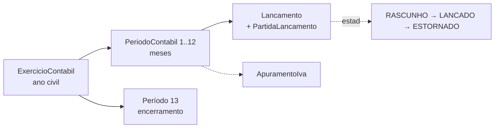

# 3. Domínios e dados

Vocabulário: [`CONTEXT.md`](../../CONTEXT.md) é o glossário canónico. Convenções de modelação
normativas: `.claude/skills/prisma-conventions/SKILL.md`. Mapa histórico de propriedade de entidades
e conflitos arbitrados: [`handoff/00-mapa-entidades-conflitos.md`](../handoff/00-mapa-entidades-conflitos.md).

## Mapa de domínios

| WS | Schema | Serviços | Modelos principais | Contratos que expõe |
|---|---|---|---|---|
| — | `tenant.prisma`, `auth.prisma` | `plataforma/` | Tenant · User, Role, Permission, UserRole, RolePermission, AuditLog | — |
| A — Inventário | `inventario.prisma` (19) | `inventario/` | Produto, VarianteProduto, Localizacao, MovimentoStock, SaldoStock, ReservaStock, ContagemStock · Ativo, ManutencaoAtivo, AmortizacaoCalculo, InventarioFisico | `entradaStock`, `baixarStock`, `reservarStock`, `confirmarConsumoStock`, `libertarStock` |
| B — Compras | `compras.prisma` (27) | `compras/` | Fornecedor, RequisicaoCompra, ConfiguracaoWorkflow/NivelAprovacao, Cotacao, PedidoCompra, RecebimentoCompra, ContaPagar, Pagamento · Servico, AgendamentoServico, ContratoServico | — |
| C — Comercial | `comercial.prisma` (18) | `comercial/` | Cliente, SessaoPOS, Venda, PagamentoVenda, Encomenda, Devolucao, Troca, Vendedor, RegraComissao, Comissao | — |
| D — Finanças | `financas.prisma` (26) | `financas/` | ContaPGC, Diario, ExercicioContabil, PeriodoContabil, Lancamento, PartidaLancamento, ApuramentoIva · SerieDocumento, Fatura, NotaCredito, NotaDebito, Proforma, CotacaoComercial · SessaoCaixa, MovimentoCaixa · ContaBancaria, CompromissoTesouraria | `registarLancamentoContabilistico`, `registarMovimentoCaixa`, `proximoNumeroSerie` |
| D′ — Reconciliação | `reconciliacao.prisma` (8) | `reconciliacao/` | ImportacaoExtracto, MovimentoBancario, CorrespondenciaBancaria, PeriodoReconciliacao, RegraSugestaoLancamento | — |
| E — Pessoas & Projectos | `pessoas-projetos.prisma` (50) | `pessoas-projetos/` | Colaborador, Ausencia, Ferias, Avaliacao, Formacao · FolhaPagamento, LinhaPayroll, TabelaINSS, EscalaoIRPS · Vaga, Candidatura · Beneficio · Projeto, TarefaProjeto, Timesheet, Marco · EstruturaProduto, Roteiro, OrdemProducao, ConsumoProducao | `linhasPayrollDeBeneficios` (não consumido — ver lacunas) |
| F — Operações | `operacoes.prisma` (21) | `operacoes/` | Viatura, Motorista, Rota, Entrega, Atividade, Abastecimento · Ticket, BaseConhecimento | — |
| G — Plataforma | `plataforma.prisma` (6) | `plataforma/` | ConfiguracaoFiscal, Notificacao, Assinatura, EventoWebhookStripe, ChaveIdempotencia | `estadoDeAcesso()` (em `lib/state-machines.ts`) |

Separação Pessoas/Projectos: [ADR-0025](../decisions/ADR-0025-separacao-dominio-pessoas-projetos.md).

## Invariantes de dados

### Multi-tenancy
- Todo o modelo de negócio tem `tenantId`. A `tenant-extension` injecta-o em `create`/`findMany`/`count`
  etc. **`findUnique`/`update`/`delete`/`upsert` não são scoped** — os serviços filtram explicitamente.
- `tenantId` **nunca** vem do cliente; vem da sessão via contexto.
- Acesso a recurso de outro tenant devolve `NotFoundError` (404), nunca 403 (não se confirma existência).
- Dentro de `prismaBase.$transaction` (cliente cru) o `tenantId` vai em todas as escritas à mão.
- Chaves de armazenamento de objectos têm prefixo do tenant, verificado na escrita e antes de assinar
  GET/DELETE (vector de fuga cross-tenant fechado na Wave 7).

### Dinheiro e documentos
- Dinheiro é sempre `Prisma.Decimal`. IVA guardado como fracção (`0.16`).
- Documentos transaccionais (facturas emitidas, notas, lançamentos) são **append-only**. Correcções por
  estorno ou nota de crédito/débito, nunca `UPDATE` de valores ([ADR-0015](../decisions/ADR-0015-auditoria-documentos-financeiros.md)).
- Quem emite um documento guarda o lançamento que criou (`Fatura.lancamentoId`, notas idem). Sem isso o
  período fica inapurável (`DOCUMENTO_SEM_LANCAMENTO`).
- Soft delete (`deletedAt`) nos modelos que o declaram; a extensão filtra-os nas leituras.

### Numeração de documentos
`SerieDocumento` por tenant, **tipo e ano**. `proximoNumeroSerie(tx, tipo, ctx, data)` faz
`UPDATE … RETURNING` com tranca e devolve `PREFIXO/ANO/NNNNNN` sem lacunas, dentro da transacção do
documento. A data é a **do documento** (série do ano certo em documentos retroactivos). Tipos em
`enum TipoSerieDocumento` (faturação, POS, compras, produção, operações, stock…). Estender o enum exige
acrescentar a série a `SERIES_INICIAIS` em `src/server/provisioning/tenant-bootstrap.ts` e um
`INSERT … SELECT … ON CONFLICT DO NOTHING` na migração para os tenants existentes.

### Ciclo contabilístico

- Cada `Lancamento` tem `periodoId` obrigatório, resolvido por `periodoFiscalDe(data)` no fuso
  `Africa/Maputo`. Só `criarLancamento`/`registarLancamentoContabilistico` escrevem lançamentos
  (imposto pelo `gate-periodo`); recusam períodos fechados.
- `fecharPeriodo` verifica as pré-condições com tranca (`FOR UPDATE`) e devolve **todos** os
  impedimentos de uma vez. Reabertura regista `ReaberturaPeriodo`.
- Mapas (balancete, razão, DRE) filtram por `FILTRO_LANCAMENTO_MAPA` (`LANCADO` + `ESTORNADO`).
- Plano PGC-NIRF em `prisma/seed/data/plano-contas-pgc.json` (504 contas); a natureza (DEVEDORA/
  CREDORA) é por conta — classe 6 devedora, classe 7 credora.
- Decisões: [ADR-0033](../decisions/ADR-0033-exercicio-contabilistico.md) (exercício/períodos),
  [ADR-0034](../decisions/ADR-0034-apuramento-iva.md) (IVA, legal por confirmar — issue #64),
  [ADR-0035](../decisions/ADR-0035-encerramento-exercicio.md) (encerramento — **não implementado**).

### Máquinas de estado
Mapas `TRANSICOES_*` nos serviços; as que o cliente precisa estão duplicadas em
`src/lib/state-machines.ts` (client-safe): activo, manutenção de activo, ticket, contagem de stock,
payroll, formação, vaga, candidatura, encomenda, devolução, risco, qualidade, viatura, rota,
actividade, entrega, assinatura, movimento e período de reconciliação. `transitar*` lança `Error`
cru — o serviço valida antes para não chegar ao utilizador como 500.

### Acesso e subscrição
`Assinatura.estado` (`TRIAL`, `ATIVA`, `LEITURA`, `FECHADA`; `EXPIRADO`/`SUSPENSA`/`CANCELADA` só em
linhas antigas) e `Tenant.deletedAt` decidem o acesso; o árbitro é `estadoDeAcesso()`. Em `LEITURA`
(30 dias, `leituraFim`) a sessão abre e as escritas são recusadas com `ACESSO_LEITURA`. Nada se apaga.
`ConfiguracaoFiscal.statusAtivo` está morto. Ver [ADR-0027 §6](../decisions/ADR-0027-modelo-comercial-planos-limites.md)
e [ADR-0032](../decisions/ADR-0032-aplicacao-da-leitura.md).

## Datas e fuso
O servidor corre em UTC; o dia fiscal é `Africa/Maputo` (UTC+2, sem hora de Verão). Usar
`diaCivilEmMaputo`/`periodoFiscalDe` ou `AT TIME ZONE` em SQL. Um `aaaa-mm-dd` coagido por Zod fica à
meia-noite UTC — como fim de intervalo exclui o próprio dia (defeito conhecido no balancete/razão/DRE).

## Migrações
Só `prisma migrate deploy` fora de desenvolvimento (o `docker-entrypoint.sh` corre-o antes de
arrancar). Geração não-interactiva, renomeações à mão e proibição de `prisma format`: ver
[Desenvolvimento](07-desenvolvimento.md#migrações).

## Seeds
`pnpm db:seed` (aditivo e idempotente): tenant `demo`, 5 utilizadores, RBAC, PGC, dados dos sete
domínios e um exercício comercial completo. O funil transaccional só corre se ainda não houver vendas.
`pnpm db:seed:volume`: tenants `perf-*` com volume de dois anos de PME ([ADR-0018](../decisions/ADR-0018-desempenho-capacidade.md)).
