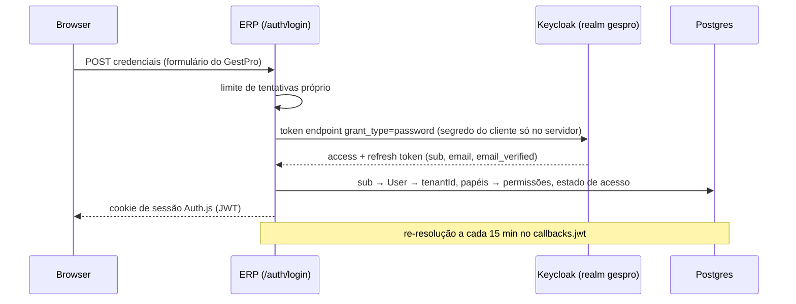

# 4. Segurança e identidade

Princípio: **o Keycloak responde «quem és»; o Postgres responde «o que podes»**
([ADR-0011](../decisions/ADR-0011-fronteira-autorizacao.md)).

## Autenticação

- **Ecrã de login próprio** por Direct Access Grant ([ADR-0029](../decisions/ADR-0029-login-no-erp-direct-grant.md)).
  Decisão tomada **contra** a RFC 9700 §2.4, conscientemente: perde-se federação/SSO empresarial,
  MFA fica reduzida a OTP, e a protecção anti-força-bruta do Keycloak deixa de distinguir IPs — daí o
  limitador próprio. Se SSO ou WebAuthn voltarem a ser requisito, é este ADR que se substitui.
- Realm único `gespro` para todos os tenants ([ADR-0010](../decisions/ADR-0010-keycloak-fornecedor-identidade.md));
  Organizations adiadas. Realm versionado em `infra/keycloak/realm-gespro.json`
  (`verifyEmail: false` obrigatório — ADR-0031 §2-ter).
- **Uma Identidade pertence a exactamente um tenant**; o e-mail é único em todo o sistema.
- Primeiro acesso: registo self-service com entrada imediata e e-mail por confirmar
  ([ADR-0031](../decisions/ADR-0031-entrada-imediata-registo-publico.md)); convite por e-mail; ou
  palavra-passe atribuída com troca obrigatória ([ADR-0030](../decisions/ADR-0030-palavra-passe-inicial-atribuida.md)).
- E-mail por confirmar bloqueia **emitir documentos fiscais e convidar colegas**
  (`exigirEmailConfirmadoParaEmitir`). Ligação de confirmação assinada com `EMAIL_VERIFY_SECRET`, sem
  estado, válida 24 h.
- Sessão: `AUTH_SESSION_MAX_AGE`; revogar papel, desactivar utilizador ou fechar subscrição produz
  efeito em **≤ 15 min** sem novo login.
- Acesso de suporte: o pessoal GestPro não tem identidade nos tenants; cria-se uma temporária por
  incidente.

## Autorização

- Catálogo de **305 permissões** e 5 papéis de sistema em `apps/erp/prisma/seed/rbac.ts`, versionado com
  o código. Papéis por tenant (`Role`, `isSystem`), com papéis personalizados possíveis.
- Aplicação no **servidor**: cada Server Action declara `permission`; cada Route Handler declara a sua
  no `withApi`. A sessão transporta `session.user.permissions`.
- Uma permissão nova só chega aos tenants existentes com `pnpm db:seed` (aditivo).

| Papel | Âmbito resumido |
|---|---|
| ADMIN | Tudo |
| GESTOR | Tudo excepto configuração perigosa (permissões, integrações, core-tenancy, plano de contas, fecho/reabertura de período, declaração de IVA, estorno de lançamentos, séries, apagar colaboradores, admin de inventário/activos) |
| FINANCEIRO | `financas:*` (excepto reabrir período e abrir exercício), faturação, caixa, analytics, payroll + leituras |
| OPERADOR | Leituras + inventário, produção, transporte, tickets, POS, caixa operacional, criar/submeter requisições, vendas básicas, self-service RH |
| LEITURA | Só consulta e exportação |

> **Lacuna conhecida:** a navegação e a maioria das páginas **não filtram por permissão de consulta**
> — qualquer perfil abre, por exemplo, Utilizadores e Auditoria; as permissões só travam acções. Há
> também três permissões referidas no menu de Compras que não existem no catálogo, o que esconde o
> grupo a todos. Ver [Lacunas conhecidas](08-lacunas-conhecidas.md#transversal).

## Isolamento entre tenants

Ver [Domínios e dados § Multi-tenancy](03-dominios-e-dados.md#multi-tenancy). Resumo: contexto por
`AsyncLocalStorage`, `tenantId` nunca do cliente, filtros explícitos nos métodos não-scoped, 404 em
acesso cruzado, prefixo de tenant nas chaves de armazenamento. Cada revisão de *wave* procura
activamente fugas cross-tenant — foram encontradas e fechadas seis entre as Waves 2 e 7
([`status.md`](../status.md)).

## Modo de Leitura

`createSafeAction` e `withApi` recusam escritas com `ACESSO_LEITURA` quando a assinatura está em
`LEITURA`. Leituras declaram `permiteEmLeitura: true` (imposto por `gate-leitura`). Pagar e exportar
nunca se travam.

## Defesas HTTP

| Controlo | Implementação |
|---|---|
| Headers | `middleware.ts` é o dono único: CSP com nonce por pedido (report-only até `CSP_ENFORCE=true`), HSTS, `X-Frame-Options`, `nosniff`, Referrer-Policy, Permissions-Policy |
| Rotas públicas | `PUBLIC_PATHS` em `middleware.ts`: `/auth/`, `/api/auth/`, probes, `/api/publico/*`, webhooks, `/api/cron/` (protegidos por segredo próprio) |
| CORS | Allowlist `ALLOWED_ORIGINS`; nunca wildcard |
| Limitação de tráfego | Porta com adaptador em memória ou Valkey (`RATE_LIMIT_DRIVER`, `VALKEY_URL`); registo público, login, convites, exportações, presign ([ADR-0014](../decisions/ADR-0014-cache-e-rate-limit-distribuido.md)). Detalhe e desvios em [API §1](05-api.md) |
| Anti-abuso no registo | Campo-armadilha + rate-limit; provedor de captcha por fixar ([ADR-0016](../decisions/ADR-0016-anti-abuso-registo.md)) |
| Webhooks Stripe | Assinatura verificada; idempotência por `EventoWebhookStripe`; transições de assinatura por compare-and-set; eventos não resolvidos → 503 para o Stripe reentregar |
| Segredos | Zero no repositório; `.env` local não versionado; `.tfvars`/`.tfstate` ignorados |
| Métricas | `/api/metrics` protegido por `METRICS_SECRET` — **aberto se a variável não estiver definida** |

## Auditoria

`AuditLog` automático em escritas singulares de modelos em `AUDIT_MODELS` (quem, quando, antes/depois).
`upsert`/`*Many` **não** são auditados: escritas que têm de ficar no trilho usam `findFirst` + operação
singular. Consulta em `/core-tenancy` e `GET /api/audit`.
Decisão: [ADR-0015](../decisions/ADR-0015-auditoria-documentos-financeiros.md).

## Riscos em aberto

| Risco | Impacto | Mitigação actual / próximo passo |
|---|---|---|
| Direct grant (RFC 9700) | Sem SSO/WebAuthn; força-bruta vista com IP do servidor | Limitador próprio; reavaliar ao primeiro cliente que exija SSO |
| Rate-limit em memória por omissão | Ineficaz com >1 instância | Valkey no perfil `full`; obrigatório antes de abrir o registo em produção |
| Captcha por fixar | Registo automatizado | Campo-armadilha + rate-limit |
| Visibilidade não filtrada por permissão | Divulgação interna (ex.: auditoria a um operador) | Filtrar menu e `page.tsx` por permissão de leitura |
| `METRICS_SECRET` opcional | Métricas expostas | Falhar o arranque em produção sem a variável |
| CSP em report-only | XSS não bloqueado | `CSP_ENFORCE=true` após smoke em produção |
